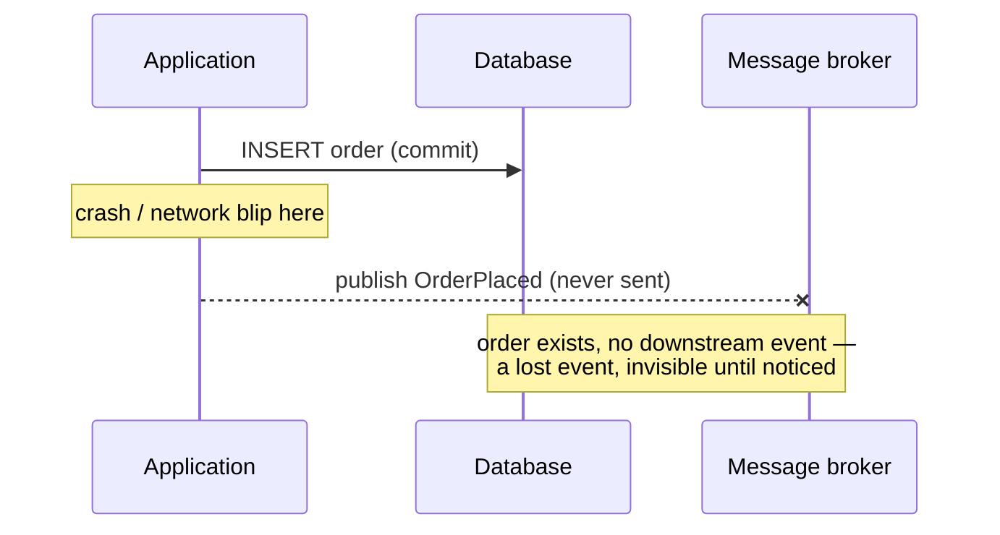
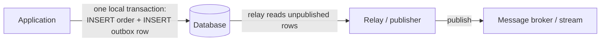
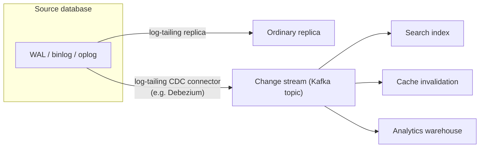

# Change Data Capture (CDC) and the Transactional Outbox Pattern

*Getting a row change safely out of one service's database and into everyone else's, without a shared transaction.*

`⏱️ ~8 min · 8 of 15 · L4`

> [!TIP] The gist
> Writing to your own database and then separately publishing an event to a message broker is **not atomic** — a crash between the two can silently lose the event or send a phantom one. The **transactional outbox pattern** fixes this by writing the event as an ordinary row, in the *same local transaction* as the business write, then relaying it out asynchronously. **Change data capture (CDC)** is the general technique that makes the relay itself fast and reliable: it taps the database's own write-ahead log (the exact mechanism [replication](02-replication.md#leader-follower-single-leader-replication) already uses) to stream every committed row change out, in order, near-real-time. Combined, "outbox + CDC" gets atomicity from the database and freshness from the log — at the cost of accepting **at-least-once delivery**, which means every downstream consumer must be idempotent.

## Intuition

You keep a personal to-do list, and whenever you add an item that your friend Alex needs to know about, you also want to text them. The naive way: write the item down, then separately send the text. If your phone dies right after you write the item but before you hit send, Alex never finds out — and you won't notice, because *your* list looks correct.

The fix: instead of texting Alex directly, write a second line on the *same list*, in the *same pen stroke*: "tell Alex about item 7." Now both lines exist or neither does — there's no window where one exists without the other, because they were never two separate actions to begin with. Later, a helper walks by, reads your list for "tell Alex" lines, sends the texts, and crosses them off. The helper might occasionally text Alex twice if they get interrupted mid-crossing-off — so Alex just has to shrug off a duplicate "item 7" text rather than being confused by it.

## The concept

**Change data capture is the technique of streaming a database's row-level changes out as they happen, by reading the database's own internal change log rather than querying tables directly; the transactional outbox pattern is the discipline of writing an event as a row in the same local transaction as the business write it describes, so the two can never become inconsistent with each other.**

The core knowledge to take away:

- **The problem both solve: the dual-write problem.** Writing to a database and publishing to a message broker are two independent commits with no shared protocol between them. Every ordering of "write DB, then publish" has a crash window: DB commits but publish fails (**lost event**), or publish succeeds but the DB write is rolled back (**phantom event**).
- **The outbox pattern's trick: make it one commit, not two.** Insert the event as a row into an `outbox` table, inside the same transaction as the business write. [ACID's atomicity](../L2/04-acid.md) — already mechanized by the same [write-ahead log](../L2/09-write-ahead-log.md) — now covers both rows: either both are durable, or neither is.
- **CDC's trick: don't invent a new source, tap the one that already exists.** Postgres's logical replication slot, MySQL's binlog, MongoDB's oplog/change streams — the same log a *replica* reads to stay in sync — can also be read by a CDC connector (Debezium is the dominant one) and turned into a stream of change events for any consumer, not just another database replica.
- **The ceiling both accept: at-least-once delivery.** No relay (polling or log-tailing) can mark "published" and actually publish as one atomic step across two systems, so every correctly-built pipeline can duplicate a message but never silently lose one — which makes **idempotent consumers** mandatory, not optional.

## How it works

### The dual-write problem, made concrete



There's no atomic operation spanning a database commit and a broker publish by default — a two-phase commit could do it, but almost no production broker speaks the protocol a database expects, and 2PC's blocking coordinator and latency cost are exactly why real systems reach for the two patterns below instead.

### The transactional outbox: reuse the DB's own atomicity

Instead of publishing directly, write the event as a row into an `outbox` table, in the *same* transaction as the business write:

```sql
BEGIN;
  INSERT INTO orders (id, customer_id, total, status)
    VALUES ('ord_123', 'cust_9', 4200, 'placed');

  INSERT INTO outbox (id, aggregate_id, event_type, payload, created_at)
    VALUES (gen_random_uuid(), 'ord_123', 'OrderPlaced',
            '{"order_id":"ord_123","total":4200}', now());
COMMIT;
```

A separate **relay** process then moves rows out of the outbox onto the broker, independently of the request path that wrote them:



This turns "make two heterogeneous systems agree" into "eventually move already-durable rows out of one database" — strictly easier, because a relay crash never loses the row; it's just sitting there, unpublished, waiting.

### CDC: build that relay by tailing the log instead of polling it

The relay can either **poll** (`SELECT * FROM outbox WHERE published = false`, on a timer) or **tail the database's own transaction log** for inserts into the outbox table — exactly the technique that generalizes to *any* table, not just the outbox, which is what "CDC" means:



Polling misses intermediate updates (three writes between two polls only shows the last one), can't see deletes without a `deleted_at` convention, and adds load to the source DB proportional to how fresh consumers want the data. Log-tailing reads a stream the engine is already producing for its own durability — captures everything, in exact commit order, with far less marginal load — which is exactly why Debezium is built around log-tailing connectors as its primary mode, not polling.

### Ordering and the at-least-once ceiling

Relays (either kind) publish, *then* mark published — the only safe order, since the reverse can silently lose a message on a crash. That means every pipeline is **at-least-once**: duplicates are expected, never a bug. Consumers stay correct by keying off the event's own ID (an idempotency check, or a naturally idempotent operation like an `UPSERT`). Publishing keyed by `aggregate_id` (the order ID) as a Kafka partition key preserves **ordering within one entity's history** — never a global order across all entities, which almost nothing actually needs.

## In the real world

- **Shopify** replaced a query-based CDC tool polling `updated_at` columns (hourly freshness, missed hard deletes) with one Debezium connector per MySQL shard reading binlogs directly across 100+ shards — cutting change-to-Kafka latency to p99 under 10 seconds, and upstreaming a lock-free snapshot mode to Debezium after the default mode held table locks for hours on their largest tables. ([Shopify Engineering, 2021](https://shopify.engineering/capturing-every-change-shopify-sharded-monolith))
- **Debezium** was created at Red Hat (2015-16), built on Kafka Connect and inspired by Martin Kleppmann's "turning the database inside out." Separately, **LinkedIn** built its own log-based CDC for Oracle: an early polling-based version hit reliability limits, so version 2.0 moved to **Oracle GoldenGate** reading redo logs directly, streamed through Kafka and LinkedIn's own open-sourced **Brooklin** framework. ([LinkedIn Engineering, 2017](https://www.linkedin.com/blog/engineering/data-management/incremental-data-capture-for-oracle-databases-at-linkedin-then-); [Brooklin, 2019](https://engineering.linkedin.com/blog/2019/brooklin-open-source))
- **Stripe's** webhook docs state plainly that event delivery is at-least-once — events "might occasionally" arrive more than once, retried for up to three days, not guaranteed in order — and recommend exactly the fix this lesson derives: log each processed `event.id` and no-op on a repeat. Stripe doesn't publicly document its internal CDC/outbox mechanism, so that part is unverified — only the external delivery contract is confirmed. ([Stripe Docs](https://docs.stripe.com/webhooks), accessed 2026-07-16)

## Trade-offs

| | Dual write (naive) | Outbox + polling relay | Outbox + CDC (log-tailing relay) |
| --- | --- | --- | --- |
| Atomicity of write + publish | None — genuinely unsafe | Yes, via one local transaction | Yes, via one local transaction |
| Extra infrastructure | None | A small polling worker | A CDC connector platform (Debezium + Kafka Connect) |
| Source DB load | None extra | Periodic polling query | Minimal — reads the log the engine already writes |
| Latency to downstream | Immediate (when it works) | Bounded by poll interval | Near-real-time |
| Delivery semantics | Undefined — can lose or duplicate | At-least-once | At-least-once |
| Captures non-outbox table changes too | No | No | Yes — the same connector can stream any table |

> [!IMPORTANT] Remember
> The outbox pattern doesn't invent a new atomicity mechanism — it reuses the one your database already has, by making the event a row in the same commit as the business write. CDC doesn't invent a new data source — it taps the same log replication already tails. Together they get you atomicity and freshness, but never exactly-once: every consumer downstream has to be idempotent, because at-least-once is the honest ceiling.

## Check yourself

- Walk through exactly what state the system ends up in if an app commits a DB write and then crashes before publishing the event — why doesn't "just retry the publish" fix this without an outbox?
- A team wires a CDC connector directly onto their `outbox` table instead of running a polling relay. What do they gain, and what do they take on in exchange?

→ Next: Event sourcing
↩ comes back in: L5 (idempotency, delivery semantics) and L6 (Kafka partitioning/DLQs)
