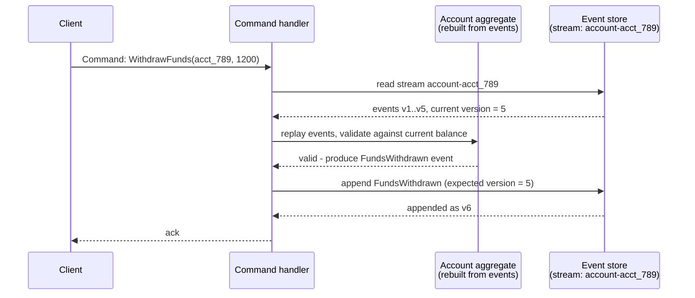
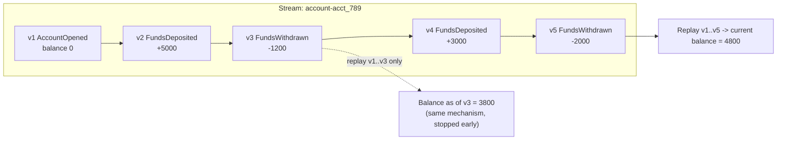

# Event Sourcing

*Storing every fact that ever happened, instead of the current answer — and rebuilding the answer by replaying the facts.*

`⏱️ ~8 min · 9 of 15 · L4`

> [!TIP] The gist
> Every prior topic in this level assumed a row holds *current* state and you overwrite it in place. Event sourcing throws that assumption away: the durable record is an **append-only log of immutable events** ("FundsDeposited", "OrderCancelled") for one entity at a time, and current state is never stored as the source of truth — it's *computed* by replaying every event, in order, from the beginning. This buys a complete audit trail and free "time travel," at the cost of query complexity, eventually-consistent reads, and a schema-evolution tax that never fully goes away. It's the genuine endpoint [CDC and the outbox pattern](08-cdc-and-outbox.md#the-transactional-outbox-pattern) was pointing toward: instead of *deriving* an event stream from a state-oriented table, the event stream *becomes* the table.

## Intuition

Think about how you'd track a bank account by hand, in a paper checkbook register. You never cross out yesterday's balance and write a new number over it — you write a brand-new line: "+$50 deposit," "−$12 withdrawal." The balance at the bottom of the page isn't stored anywhere on its own; it's whatever you get by adding up every line above it. If someone asks what your balance was last Tuesday, you don't need a separate record for that — you just add up the lines through Tuesday and stop.

Event sourcing runs an entire system's storage layer this way: nothing is ever crossed out, only added to, and "current state" is just today's running total.

## The concept

**Event sourcing is a storage strategy in which the durable, authoritative record of an entity's state is an immutable, strictly ordered sequence of events describing every change that has ever happened to it — never the current state itself.** Current state is a *derived* value: computed on demand, or cached as an optimization, but never treated as the record of truth. The only way to get it is to replay every event for that entity, in order, from the start.

The vocabulary this rests on:

- **Event** — an immutable fact about something that already happened, named in the past tense (`FundsDeposited`, never `DepositFunds`). Once appended, it can never be edited or un-happened.
- **Aggregate** — the consistency boundary the events belong to (one bank account, one order). Each aggregate instance owns its own **stream**: the strictly ordered sequence of every event that has ever happened to that one instance.
- **Command** — the *input* that triggers a change (`WithdrawFunds`). A command is validated against the aggregate's current, replayed state; if valid it produces one or more new events to append; if invalid (insufficient funds), it's rejected and **no event is ever appended for it** — only things that actually happened become facts.

This is a genuine inversion of everything else this level has assumed:

| | State-oriented storage (every prior L4 topic) | Event-sourced storage |
| --- | --- | --- |
| What's durably stored | Current state only — a row, overwritten in place | Every change, as an immutable, ordered event |
| A write | `UPDATE`/`INSERT` mutates a row | Append a new event; nothing is ever updated or deleted |
| Getting current state | Read the row directly | Replay every event, folding each into an accumulator |
| "State as of last Tuesday" | Not answerable without a separate history mechanism | Answered for free: replay only up to that point |
| Storage growth | Bounded by the number of current entities | Grows with every change ever made, by design |

**The crisp distinction from [CDC/outbox](08-cdc-and-outbox.md):** both produce "a stream of events a consumer can subscribe to," but the difference is *where the source of truth lives*. CDC/outbox derives an event stream from a state-oriented table that already holds the facts — delete the stream, and the table still has everything. Event sourcing makes the event log itself the only copy of the facts — delete the log, and there is nothing left to fall back to. This is why the CDC/outbox topic named event sourcing as its own natural conceptual endpoint: they converge exactly when a team uses the same durable log (a compacted Kafka topic, an event-store's own subscriptions) as both the primary store *and* the thing other services tail.

## How it works

### The event store: append, never overwrite

The **event store** plays the role a table plays in a CRUD system, but with a narrower API: appends and ordered reads of a stream, never in-place updates. Two common ways to build one:

- **A purpose-built event-store database** (EventStoreDB, created by Greg Young — also the person who coined the term CQRS, next lesson) models a "stream" as its core primitive, and exposes **subscriptions** — a live, ordered tail of new events — that downstream projections consume.
- **A repurposed log or plain table** — Apache Kafka with **log compaction** enabled (retaining only the latest event per key, forever) is commonly used as an event store directly. Or the humblest version: a relational table `events(stream_id, version, event_type, payload)` with a unique constraint on `(stream_id, version)` — the exact same shape as the outbox table from the [prior lesson](08-cdc-and-outbox.md#the-transactional-outbox-reuse-the-dbs-own-atomicity), except a row here is never deleted once published; it's kept forever as the permanent record, not a transient relay buffer.

**Appending is guarded by optimistic concurrency, not a lock** — the same idea already covered for [row-level writes](../L2/07-locking.md), applied to an entire stream instead of one row. An append specifies the version it expects the stream to be at right now ("append as v6, only if current version is 5") — a compare-and-swap that rejects the write outright if another event landed first, which is exactly what stops two concurrent commands for the same account from silently corrupting the stream's own ordering.

### Replaying events: current state is a fold

**Current state is nothing but a fold (a left-to-right reduce) over a stream.** Given events `e1, e2, ..., en` in order, and an "apply" function that takes the current state plus one event and returns the next state, current state is `apply(apply(apply(initial, e1), e2), ..., en)`. There is no other way to get it.

Here's a bank account, `acct_789`, as nothing but its own event stream (amounts in cents):

| v | Event | Payload |
| --- | --- | --- |
| 1 | `AccountOpened` | `{owner: "ava", opening_balance: 0}` |
| 2 | `FundsDeposited` | `{amount: 5000}` |
| 3 | `FundsWithdrawn` | `{amount: 1200}` |
| 4 | `FundsDeposited` | `{amount: 3000}` |
| 5 | `FundsWithdrawn` | `{amount: 2000}` |

**Current balance** is the fold: `0 + 5000 − 1200 + 3000 − 2000 = 4800` cents ($48.00) — never read off a stored "balance" field, because no such field exists as the source of truth.

**"What was the balance right after v3" — time travel, for free.** Replay only `v1..v3`: `0 + 5000 − 1200 = 3800` cents. No separate history table, no bitemporal schema — the exact same replay mechanism used for current state answers "state as of any point in the past" simply by stopping early.

A command that would overdraw the account (`WithdrawFunds(acct_789, 10000)` after v5) is validated against the replayed balance (4800), found invalid, and rejected — no event for it is ever appended.

### Snapshots: bounding the cost of replay

Replaying from event 1 stops being affordable once a stream gets long — an account with ten years of history can accumulate tens of thousands of events, and folding all of them on every command is real, unbounded latency, unlike a state-oriented table where a read is always O(1) regardless of history.

**The fix: periodically persist a snapshot** — the fully-folded state as of a specific version (`{version: 500, balance: 812340}`) — stored *alongside*, never instead of, the stream. Rebuilding then means: load the snapshot, replay only the events after it, and fold those on top. A snapshot is purely a performance optimization, never the source of truth — it's disposable, always reconstructible by replaying from the beginning, and a lost snapshot costs only a slower rebuild, never data loss.

## In the real world

- **Stripe's Ledger** describes itself in event-sourced terms directly: "Ledger is an immutable log of events. Transactions previously published into Ledger cannot be deleted or modified, and we can always reconstruct past state by processing all events up to that point." It processes roughly **five billion events daily**, with **99.9999% money-movement explainability** maintained through 10x volume growth. ([Stripe Dot Dev Blog](https://stripe.dev/blog/ledger-stripe-system-for-tracking-and-validating-money-movement), accessed July 2026)
- **LMAX**, a UK retail FX/CFD trading exchange, built its entire **Business Logic Processor** in-memory with no database at all — current state is derived purely by replaying input events, an architecture that lets a single thread handle a confirmed **6 million orders per second**, achieved by avoiding lock contention (the Disruptor pattern) rather than by adding hardware. ([Martin Fowler, "The LMAX Architecture," 2011](https://martinfowler.com/articles/lmax.html))

No UPI/NPCI write-up describing India's real-time payments rail as *literally* event-sourced (rather than just log/audit-trail-based generally) turned up in this pass — flagged here rather than forced to fit.

## Trade-offs

✅ **What it buys:**

- A complete, immutable audit trail, structurally guaranteed — not a bolted-on audit table with its own consistency to maintain.
- Temporal queries ("balance last Tuesday") for free — the same replay mechanism, just stopped early, no bitemporal schema engineering required.
- Retroactive read-model correction: fix a buggy projector and **replay the entire log from scratch** to get a correct answer — a genuine replay, not a best-effort backfill.

❌ **What it costs:**

- No `SELECT * FROM accounts WHERE balance > 1000000` against a log — every useful query needs its own maintained projection ([CQRS](../L4/README.md), next lesson).
- Eventually-consistent read models — a projection updates asynchronously off the stream, so a client can read stale data right after its own write.
- A permanent, growing schema-evolution tax: every future version of the code must still interpret every historical event shape it might replay (mitigated by *upcasting* — transforming an old event's shape at read time — but never eliminated).
- Unbounded storage growth by design, and a genuine tension with GDPR-style "right to erasure": you cannot edit or delete one person's events out of an append-only log. The standard mitigation is **crypto-shredding** — encrypt personal fields with a per-subject key stored separately, and "erase" by deleting only the key, leaving the (now unreadable) bytes in place.

> [!IMPORTANT] Remember
> The event log is the source of truth; everything else — current state, read models, snapshots — is a disposable, rebuildable *projection* of it. If losing something would just mean a slower rebuild rather than losing a fact permanently, you built event sourcing. If losing it would mean falling back to a more-authoritative table underneath, you built CDC.

## Check yourself

- A colleague says "event sourcing is just CDC with extra steps." Using the account-balance worked example, explain precisely why this is wrong — what would be lost if the event log disappeared in each case?
- Walk through how the bank account's current balance is computed, then explain exactly what a snapshot changes about that process — and what it does *not* change about where the source of truth lives.

→ Next: CQRS
↩ comes back in: L5 (sagas — keeping two separate streams consistent without one atomic transaction) and L6 (Kafka's log compaction and partitioning as an event-store mechanism)
