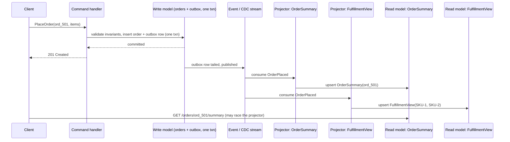

# CQRS (Command Query Responsibility Segregation)

*Splitting an application's write path from its read path into two separate models, each shaped for what it actually needs to do.*

`⏱️ ~7 min · 10 of 15 · L4`

> [!TIP] The gist
> Most CRUD apps read and write the *exact same* schema — the `SELECT` that renders a page hits the identical table the `INSERT` just wrote to. CQRS breaks that symmetry on purpose: one **write model** (a command handler enforcing business rules) and one or more **read models** (denormalized, query-shaped copies built for a specific screen or consumer), kept in sync after the fact — usually asynchronously. It's a distinct decision from [event sourcing](09-event-sourcing.md), even though the two pair up constantly.

## Intuition

Think about how a newsroom publishes a story. A reporter's draft goes through exactly one editor-in-chief, who checks the facts and either approves it or sends it back — there's one, single gate where "is this actually true and ready" gets decided. Once approved, the story doesn't stay in one place. It gets reshaped into the print edition's column, the homepage's three-line teaser, a push notification, and the search index — four completely different formats, each built for how *that* reader consumes it, each updated a few seconds after the original approval, not in the same instant.

Nobody edits the homepage teaser directly to "fix" a fact — if something's wrong, it gets corrected at the source (the approved story) and the teaser catches up. That's CQRS: one gate for deciding what's true (the write model), many shapes for displaying it (the read models), synced after the fact.

## The concept

**CQRS is the architectural decision to serve an application's writes (commands) and its reads (queries) through two separate models, each shaped for what it actually needs to do — rather than one shared model that tries to do both.** The name generalizes an older, method-level rule (a function should either change state or answer a question, never both) up to the whole application's data-access architecture, a jump credited to Greg Young — the same person who coined event sourcing's terminology, circa 2010.

The vocabulary it rests on:

- **Command** — a request that something happen (`PlaceOrder`, `WithdrawFunds`), as distinct from a query, which only ever asks a question.
- **Command handler** — the one piece of code that takes a command, checks it against the write model's current state, and either accepts it (a durable state change) or rejects it. **Invariants** — the business rules it exists to enforce (an order's total must match its line items; a balance can't go negative) — are checked in exactly this one place, nowhere else.
- **Read model** — a denormalized, purpose-built representation of data, shaped around *one* access pattern rather than around the entities themselves. An app can have several: an order-summary view for a confirmation page, a completely different aggregate view for a warehouse team, a search index for full-text queries — all fed by the same underlying write model.
- **Projection** — the mechanism that turns a write-side change into a read-model update.

Traditional CRUD vs. CQRS, side by side:

| | Single-model CRUD | CQRS |
| --- | --- | --- |
| Handles a write | Same schema a query later reads | A command handler, against a dedicated write model |
| Handles a read | Same schema, joined/aggregated at query time | One or more read models, pre-shaped so a query is a plain lookup |
| Number of models | One | Two or more |
| Consistency between write and read | Immediate — same row, same transaction | Eventually consistent by default (the sync is usually async) |
| Where invariants live | Scattered wherever code writes to the shared model | Exactly one place — the write model |

**The crisp distinction from event sourcing.** These two get confused constantly because they show up together so often, but they answer different questions:

- **Event sourcing** — how the *write* side persists state (a log of immutable facts, vs. a mutated row). Covered in the [prior lesson](09-event-sourcing.md).
- **CQRS** — whether the *read* path is served by a separate model at all, kept in sync after the fact.

Either can exist alone. An event-sourced system with no separate read model — every query replays the aggregate's stream on demand — is event sourcing *without* CQRS. A perfectly ordinary CRUD write table feeding a denormalized read replica via CDC is CQRS *without* event sourcing (in fact this is the far more common real-world shape — more on that below). They pair often because an event-sourced write side already produces exactly the raw ingredient a CQRS projector needs — an ordered stream of facts — for free.

## How it works

### One write model, one or more read models

A single write model commonly feeds several read models at once, each serving a different consumer of the same underlying facts — an order-summary view for the customer's confirmation page, a fulfillment view aggregating open orders per SKU for the warehouse team, a search index for full-text queries. Each can live in whatever storage technology fits its own access pattern — a key-value store, a document store, a search index — completely independent of the write model's own technology and of each other.

### Keeping read models in sync: two ways to build the stream a projector needs

A **projection** needs a stream of changes to fold into a read model, and there are exactly two ways to get one:

- **From an event stream**, if the write side is event-sourced — the stream already exists as [the prior lesson's event store](09-event-sourcing.md#the-event-store-append-never-overwrite) produces it for free.
- **From CDC/outbox**, if the write side is an ordinary mutable table — [the outbox pattern](08-cdc-and-outbox.md#the-transactional-outbox-pattern) synthesizes a stream out of row changes: write an outbox row in the same transaction as the business write, tail it, publish it.

Either way, the projector on the other end works the same: it consumes the stream and folds each change into the read model it maintains. And because delivery is only ever **at-least-once**, the projector must be **idempotent** — the same discipline [already established for event-sourced projectors](09-event-sourcing.md#replaying-events-current-state-is-a-fold).

### Sync vs. async: the single biggest lever

The projection step can run on two timelines, and this choice is CQRS's biggest trade-off:

- **Synchronous** — the read model updates in the *same* transaction as the write (a materialized view refreshed on commit). Always current, but the write path now pays the read model's own latency too, and the read model must live in a store that can share the write's transaction.
- **Asynchronous** — the command handler commits and returns success immediately; a projector updates the read model afterward, independently, milliseconds to seconds later. This is the dominant choice in practice — it's what actually delivers CQRS's payoff, that each side scales and fails independently — at the cost of a real staleness window, covered below.

## Worked example: placing an order

A customer places order `ord_501`: 2 units of `SKU-1` at $25 and 1 unit of `SKU-2` at $40 — total $90.

**Write side.** `PlaceOrder` reaches the command handler. It checks invariants (enough inventory, valid payment method, no duplicate order) — all pass — and writes the order, its line items, and an outbox row in one transaction:

```sql
BEGIN;
  INSERT INTO orders (id, customer_id, total_cents, status)
    VALUES ('ord_501', 'cust_44', 9000, 'placed');
  INSERT INTO order_items (order_id, sku, qty, unit_price_cents) VALUES
    ('ord_501', 'SKU-1', 2, 2500),
    ('ord_501', 'SKU-2', 1, 4000);
  INSERT INTO outbox (id, event_type, aggregate_id, payload) VALUES
    (gen_random_uuid(), 'OrderPlaced', 'ord_501',
     '{"order_id":"ord_501","total_cents":9000,"items":[...]}');
COMMIT;
```

The handler returns `201 Created` the instant this commits — it does not wait for any read model.

**Read side.** A relay tails the outbox and publishes `OrderPlaced`. Two projectors, subscribed independently, each update their own read model: one upserts an `OrderSummary` row for the confirmation page; another updates a `FulfillmentView` aggregate for the warehouse team. Neither re-validates anything — both just reflect a fact the write side already accepted.



**The race, concretely.** If the confirmation page calls `GET /orders/ord_501/summary` within milliseconds of the `201`, it can arrive before `P1` has applied the event — the read model genuinely doesn't have `ord_501` yet, even though the write side has already durably accepted it. That's not a bug; it's the direct cost of choosing asynchronous projection. The standard fix: don't query the read model for the thing you *just* wrote — return enough of the write's own result (`order_id`, `total_cents`, `status`) directly in the `201` body, so the confirmation UI never needs that round trip at all.

## In the real world

- **Netflix's Tudum** (its editorial fan site) names CQRS explicitly: an editorial CMS is the command/write side; consumer-facing services reading a separate, read-optimized store are the query side. The sync mechanism *evolved* — originally CMS changes were pushed through Kafka into Cassandra, but edits took minutes to propagate, which made in-CMS previews impractical. Netflix replaced that pipeline with **RAW Hollow**, an in-memory, co-located object database with strong read-after-write consistency. Result: editors now preview changes in seconds instead of minutes, and homepage construction time dropped from roughly 1.4s to roughly 0.4s. ([Netflix TechBlog, July 2025](https://netflixtechblog.com/netflix-tudum-architecture-from-cqrs-with-kafka-to-cqrs-with-raw-hollow-86d141b72e52))
- **Microsoft's `eShopOnContainers` reference architecture** is a canonical, current example of "CQRS-lite" — the common case where CQRS uses a *single* database, just two logical models. Its Ordering microservice queries with the micro-ORM Dapper directly against SQL, deliberately bypassing the write side's domain model, because "for read-only queries, you do not get the advantages of treating multiple objects as a single Aggregate; you only get the complexity." The same guidance explicitly cautions against overusing CQRS: "Do not use CQRS and DDD patterns everywhere... many subsystems... are simpler and can be implemented more easily using simple CRUD." ([Microsoft Learn, .NET Microservices Architecture](https://learn.microsoft.com/en-us/dotnet/architecture/microservices/microservice-ddd-cqrs-patterns/eshoponcontainers-cqrs-ddd-microservice))

No fintech-specific CQRS write-up (Stripe, PayPal, Coinbase, Block/Square) or UPI/NPCI source describing CQRS explicitly turned up in this pass — flagged openly rather than forced in. Stripe's Ledger is a well-verified event-sourcing example (see the [prior lesson](09-event-sourcing.md#in-the-real-world)), but no Stripe publication was found describing its query side in CQRS terms specifically.

## Trade-offs

✅ **What it buys**

- Independent scaling — each side can be cached, indexed, or hosted on entirely different technology, sized to its own load.
- Query-optimized read models with no runtime joins or aggregation — every access pattern that matters gets its own precomputed shape.
- One unambiguous place invariants are enforced — read models never re-decide anything, they only reflect already-validated facts.
- New read models can be added or rebuilt without touching the write path, as long as the stream retains enough history to replay.

❌ **What it costs**

- Eventual consistency, with a real, user-facing read-your-writes problem whenever projection is asynchronous — mitigated, never fully eliminated.
- A real projection mechanism to build, monitor, and keep idempotent — genuine operational surface a single-model system doesn't have.
- Two (or more) schemas to keep conceptually aligned — a write-model change often needs a matching change in every projector.

**When it's overkill.** A CRUD app with one dominant, roughly symmetric access pattern and no independent-scaling need gains nothing from a second model and an eventual-consistency window — it only pays the costs above for a benefit that never shows up. CQRS earns its keep when the read:write ratio is heavily skewed (a catalog read thousands of times per write), the read side needs a fundamentally different query shape (full-text search, cross-entity aggregation), or reads and writes need independent failure domains. It's also a per-entity choice, not all-or-nothing — a team can apply CQRS-lite to just the one or two hot entities that need it and leave the rest of the app on plain CRUD.

> [!IMPORTANT] Remember
> CQRS and event sourcing answer different questions — CQRS is about whether reads are served by a *separate* model kept in sync after the fact; event sourcing is about whether the write side stores a log of facts or a mutated row. Either can exist without the other; they just make each other cheaper, which is why they pair up so often.

## Check yourself

- A system is event-sourced but has no separate read models — every query replays the relevant stream directly. Is this CQRS? Is it event sourcing? Justify both answers.
- Using the order-placement example, explain exactly what goes wrong if the confirmation page queries the `OrderSummary` read model instead of using the command's own `201` response — and name a fix that avoids the race entirely.

→ Next: Vector databases / ANN search (HNSW)
↩ comes back in: L5 (sagas — keeping two models consistent without one shared transaction; consistency models — formalizing read-your-writes), L6 (messaging and streaming — the event/CDC stream a projector consumes), L12 (scalability patterns — fan-out-on-write vs. fan-out-on-read), and later in this level (real-time OLAP — CQRS applied at the OLTP/OLAP boundary)
