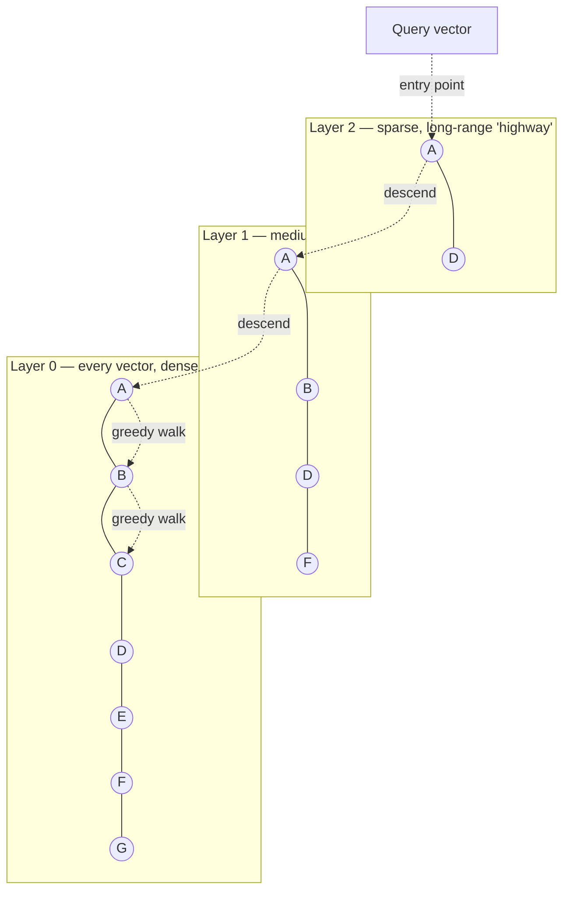

# Vector Databases and ANN Search (HNSW)

*Finding the nearest neighbors of a high-dimensional embedding fast, without scanning everything.*

`⏱️ ~8 min · 11 of 15 · L4`

> [!TIP] The gist
> Embeddings turn "similar meaning" into "close together in space" — but no B-tree, hash index, or even a k-d tree has any real notion of geometric distance across hundreds of dimensions at once. **Approximate nearest neighbor (ANN)** search gives up on guaranteeing the exact answer in exchange for search that's orders of magnitude faster than comparing a query against every stored vector. **HNSW** — a layered, small-world graph — is the algorithm behind almost every production vector database today, and it's tunable: a handful of named knobs let you trade recall for speed and memory, explicitly and measurably.

## Intuition

Picture how you'd actually get from one city to another far away one: you don't drive local streets the whole way. You take a highway to get into the right region fast, then hand off to arterial roads, then to your own street — each layer of the road network narrower in reach but denser in connections than the one above it.

HNSW builds exactly that structure over a set of embeddings. A sparse top "layer" of long-range connections gets a query into roughly the right neighborhood of the vector space in just a few hops; progressively denser layers below refine the search until it lands on the actual nearest neighbors. No single index has to be globally sorted for this to work — it just needs the right roads at the right density.

## The concept

**An embedding is a fixed-length vector of real numbers, produced by a machine learning model, positioned so that geometric distance between vectors reflects semantic similarity between the things they represent.** A sentence, a product photo, a song, a user's taste — each becomes a point in a space (often a few hundred to a few thousand dimensions) where "similar in meaning" becomes "close together" under a distance metric like cosine similarity, Euclidean distance, or dot product. The embedding model does all the semantic work up front; a vector database's entire job downstream of that is purely geometric: **given a query vector, find the k stored vectors closest to it, fast, at scale.**

**Why no index you've already met can do this.** A B-tree or hash index (from [L2's indexing lesson](../L2/08-indexing.md#b-tree-indexes)) works by exploiting a total order or exact-equality hash over a single scalar key — neither has any concept of *distance*. Even low-dimensional spatial indexes like k-d trees, which do handle geometric proximity, only work well up to a few dozen dimensions; past that they degrade to no better than a linear scan. The reason is the **curse of dimensionality**: as dimensionality grows, the contrast between "nearest" and "farthest" collapses — almost every point ends up roughly equidistant from a query, so the pruning ("skip this whole region, it's clearly farther") that makes spatial indexes fast in 2-3 dimensions stops meaning anything at all.

**Exact k-NN search is correct but doesn't scale.** Comparing a query against every one of N stored d-dimensional vectors costs O(N × d) — at a billion vectors and 768 dimensions, that's roughly 768 billion multiply-adds, paid again in full for every single query. **ANN accepts a small, tunable probability of missing some true nearest neighbors in exchange for search cost that's sub-linear in N.** The standard way to measure that cost: **recall@k** — the fraction of the true top-k (from exact brute-force search) that the ANN algorithm's own top-k actually returned. A recall@10 of 0.90 means, on average, 9 of the true 10 nearest neighbors showed up in the approximate result. Every ANN tuning knob is, underneath, a dial on this one number.

## How it works

### HNSW: a graph with a highway and local streets

HNSW (Hierarchical Navigable Small World graphs) organizes every stored vector as a node in a **multi-layer graph**:

- **Layer 0 (the bottom)** contains *every* vector, densely connected to its close neighbors — for precise, local search.
- **Higher layers** contain an exponentially shrinking, randomly chosen subset of the layer below, connected by sparser, longer-range edges — built purely for fast, coarse navigation across the space.

A query enters at the top layer's single fixed entry point, greedily hops toward whichever neighbor is closest, drops down a layer once no closer neighbor remains at the current one, and repeats — arriving at layer 0 already in roughly the right neighborhood, where a wider local search finds the actual nearest neighbors. Because each layer shrinks the node count geometrically, the number of layers — and so the number of hops — grows only **logarithmically** with the total number of vectors, instead of linearly.

### The three knobs that govern everything

- **`M`** — how many edges each node keeps per layer (commonly 16). Higher M means a denser, more accurate graph, at the cost of more memory and slower construction. M also happens to set the layer-shrinkage rate: the probability a node reaches the next layer up is exactly `1/M` — worked out below.
- **`efConstruction`** — how wide a candidate list gets explored while inserting a new node, before picking its M best edges. Higher values build a better-connected, higher-recall graph, at the cost of slower builds only — it has zero effect once the graph already exists.
- **`ef` (query-time)** — how wide a candidate list gets explored at layer 0 during a search. This is the cheapest dial in the whole system: raising it costs nothing but that one query's own latency, and buys higher recall in return.

### Other ANN families, briefly

HNSW isn't the only approach, and production systems often combine it with others:

- **IVF (inverted file index)** clusters vectors offline (like k-means), then searches only the closest few clusters to a query — needs a training pass before anything can be indexed, unlike HNSW's fully incremental build.
- **Product quantization (PQ)** compresses each vector into a short sequence of centroid IDs — often a 10-30x memory reduction — at a small recall cost, frequently paired with HNSW's graph for navigation plus PQ's compressed vectors for storage.
- **LSH (locality-sensitive hashing)** hashes vectors so nearby ones collide into the same bucket — an earlier approach, now largely outperformed by graph-based methods like HNSW at comparable memory budgets.

### Filtering, deletion, and sharding aren't free either

Three problems show up the moment HNSW leaves a whiteboard and has to run in production:

- **Metadata filtering** ("similar to this, but `in_stock = true` and `price < $100`") is harder than it sounds, because a filter that excludes most of the graph can strand a greedy walk with nowhere useful to go. Pre-filtering first (then searching only the survivors) can collapse the ANN speedup entirely; post-filtering (search first, discard misses) can silently under-return results if the filter is selective; **integrated filtering** — letting the walk pass *through* filtered-out nodes as stepping stones while only counting filtered-in ones toward the answer — is the approach modern vector databases increasingly favor.
- **Deletion doesn't remove the node.** Splicing a node out risks breaking connectivity for other nodes that used it as a routing waypoint. The standard fix is **tombstoning** — mark it dead, exclude it from results, but leave its edges in place — and periodically rebuild the graph in the background once dead nodes pile up, the same discipline as [MVCC's dead tuples](../L2/06-mvcc.md#garbage-collection-vacuum-bloat-and-transaction-id-wraparound) and [LSM-tree compaction](../L2/08-indexing.md#lsm-tree-indexes).
- **Sharding breaks the "route to one shard" assumption.** [Hash and range partitioning](03-partitioning-and-sharding.md#what-partitioning-is-and-why-it-exists) work because a key deterministically identifies its home shard — a k-NN query has no such guarantee, since the true nearest neighbor could live on any shard. The default is **scatter-gather**: fan every query out to all shards, merge each shard's local top-k at a coordinator. Cluster-aware sharding can cut fan-out, at the cost of reintroducing hotspot risk for popular semantic clusters.

## Worked example: layer math and a recall@k calculation

**How sharply do layers shrink, for M = 16?** The probability that a freshly inserted node reaches the next layer up, given it's already at the current one, works out to exactly `1/M` — here, **1/16 (6.25%)** at every transition. For a 16-million-vector collection: roughly 1 million vectors reach layer 1, roughly 62,500 reach layer 2, roughly 3,900 reach layer 3 — each layer shrinking by the same factor of 16. That geometric shrinkage is exactly why the number of layers, and therefore query cost, stays logarithmic in the total vector count.

**A concrete recall@10 calculation.** A product-search index runs a query at `ef = 50` for k = 10. The true nearest neighbors (from brute-force ground truth) are `{p1...p10}`. HNSW's approximate result is `{p1, p2, p3, p4, p6, p7, p8, p9, p10, p14}` — nine of the true ten, plus one near-miss (`p14`). Recall@10 = 9/10 = **0.90**. Re-running the same query at `ef = 200` might recover `p5` too, at the cost of exploring a wider candidate list — the exact recall-for-latency trade `ef` exists to make, one query at a time, with no index rebuild required.

## In the real world

- **Pinterest** built an in-house ANN service, **Manas**, serving embedding-based retrieval over "300 billion ideas and counting" using HNSW graphs. Its key engineering move is applying metadata filters *during* the HNSW graph traversal itself, streaming-style — automatically deciding how much to over-fetch per request rather than using a fixed multiplier — a production instance of the integrated-filtering approach above. ([Pinterest Engineering, 2022](https://medium.com/pinterest-engineering/manas-hnsw-streaming-filters-351adf9ac1c4))
- **Spotify** replaced its decade-old tree-based ANN library **Annoy** with **Voyager**, built on HNSW, in 2023 — a concrete, dated illustration of the recall/speed/memory trade this lesson describes in the abstract. Voyager reported **more than 10x Annoy's query speed at equal recall** (or up to 50% better accuracy at equal speed) and **up to 4x less memory**, while adding multithreading for production deployment. ([Spotify Engineering, 2023](https://engineering.atspotify.com/2023/10/introducing-voyager-spotifys-new-nearest-neighbor-search-library))
- **Uber** built semantic search on OpenSearch's HNSW-backed vector search, serving **over 1.5 billion items** (roughly 400-dimensional vectors) under a **100ms P99 latency at 2,000 QPS** budget. Through indexing and quantization work — storing both full-precision and quantized (int8) vectors to trade latency against storage per use case — Uber cut ingestion time from 12.5 hours to 2.5 hours, P99 latency from ~250ms to under 120ms, and total index size from 11TB to 4TB. ([Uber Engineering, 2025](https://www.uber.com/blog/powering-billion-scale-vector-search-with-opensearch/))

No current, verified fintech (Stripe or otherwise) or UPI/NPCI example of HNSW/vector-database use was found for this specific topic — flagged openly rather than forced in.

## Trade-offs

| Lever | Turning it up | Turning it down |
| --- | --- | --- |
| `ef` (query-time) | Higher recall, higher latency, zero memory/build cost | Lower recall, lower latency — the cheapest per-query dial |
| `efConstruction` (build-time) | Higher recall ceiling, slower build, zero query-time cost | Faster builds, a recall ceiling `ef` alone can't recover |
| `M` (structural) | Better recall and faster queries at fixed `ef`, but more memory and slower builds | Less memory, faster builds, a structurally weaker graph |
| Product quantization | Large memory reduction, faster distance math | Recall loss, usually mitigated by re-ranking a small shortlist exactly |
| IVF `nprobe` | Higher recall (more clusters searched) | Faster queries, real risk of missing the right cluster entirely |

✅ **What ANN/HNSW buys:** sub-linear, roughly logarithmic query cost instead of O(N × d) brute force; fully incremental construction with no upfront training step; a per-query recall dial (`ef`) that costs nothing when left alone.

❌ **What it costs:** approximate by construction — recall must be measured, never assumed; higher memory per vector than quantized methods unless explicitly paired with PQ; deletion and update are structurally awkward (tombstone-and-rebuild, not true in-place removal); k-NN queries can't be routed to a single shard the way hash/range-partitioned queries can.

> [!IMPORTANT] Remember
> Similarity search is a different problem from anything a B-tree or hash index solves — it needs a fundamentally different family of algorithms because "nearby in every dimension at once" isn't something a total order or an exact-match hash can express. HNSW solves it with a layered small-world graph and gives you exactly one honest dial to trade accuracy for speed: `ef`.

## Check yourself

- Explain precisely why a B-tree index on a `VECTOR(768)` column would be structurally useless for a nearest-neighbor query — what property does a B-tree rely on that a 768-dimensional vector doesn't have?
- A colleague sets `ef = 10` for k = 10 and complains about poor recall. What's the first thing you'd check, and why would raising `ef` likely fix it without touching the index itself?
- A team wants to delete a vector from their HNSW index the instant a user deletes their account. Why doesn't the index just remove the node and its edges immediately, and what happens instead?

→ Next: Real-time OLAP (Pinot, Druid, ClickHouse)
↩ comes back in: L6 (messaging and streaming — the CDC-fed re-embedding pipeline that keeps a vector index fresh as source data changes), L12 (scalability patterns — hot semantic clusters overloading one shard, and Bloom filters layered in front of an ANN index), L13 (RAG pipelines and recommendation systems — both are, underneath, exactly this ANN retrieval step over a purpose-trained embedding space)
