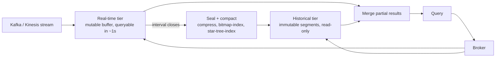
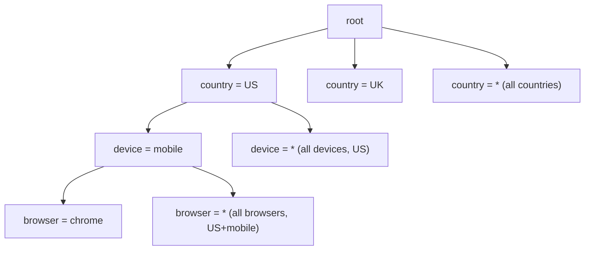

# Real-Time OLAP (Pinot, Druid, ClickHouse)

*Running analytical queries over data that's still arriving, instead of yesterday's batch.*

`⏱️ ~8 min · 12 of 15 · L4`

> [!TIP] The gist
> A batch warehouse (Snowflake/BigQuery/Redshift) is great at scan-and-aggregate queries, but data only lands there minutes-to-hours after it happened — an ETL/ELT schedule, not a live feed. Real-time OLAP engines (Apache Pinot, Apache Druid, ClickHouse) are a third category built to close that gap to **seconds**: they keep OLAP's columnar, aggregate-optimized query engine, but split storage into a fast mutable tier for the freshest data and a slower, excellently-indexed tier for everything else — so no single tier has to be both instantly-writable and perfectly organized for scanning.

## Intuition

Picture a newsroom that has to answer "what's happened today?" instantly, while also keeping a beautifully cross-referenced archive of every past edition.

A whiteboard ticker captures breaking news the second it happens — messy, unindexed, but immediately readable. At the end of each day, an editor takes that whiteboard, cleans it up, cross-references every story, and files it into the archive as a properly typeset, indexed edition. Ask "what happened this week?" and a clerk checks *both* the finished archive **and** today's still-being-written whiteboard, then hands you one combined answer.

That's exactly the shape real-time OLAP uses: a fast, sloppy, immediately-queryable tier for what just arrived, and a slower-to-build, excellently-indexed tier for everything settled — merged at query time.

## The concept

**Real-time OLAP is a class of database purpose-built to run sub-second-to-low-second analytical queries — scans, filters, `GROUP BY`, aggregates — directly against data that's still streaming in, not a nightly-loaded copy.** It's a genuinely third point in the design space, not just "a faster warehouse":

| | OLTP | Batch OLAP warehouse | Real-time OLAP |
| --- | --- | --- | --- |
| Example systems | Postgres, DynamoDB | Snowflake, BigQuery, Redshift | Pinot, Druid, ClickHouse |
| Write → queryable | Immediate | Minutes to hours (ETL window) | Seconds |
| Query latency | Milliseconds | Seconds to minutes | Milliseconds to low seconds |
| Concurrency | Very high | Low — a handful of analysts | High — thousands of dashboard/API consumers |
| System of record? | Yes | No — a derived copy | No — a derived copy |

What forces this into its own category is the **combination** of high concurrency, sub-second latency, and near-zero staleness all at once. A batch warehouse optimizes for a few analysts tolerating hours-stale data; real-time OLAP optimizes for thousands of concurrent dashboard refreshes and user-facing API calls (a live view counter, a leaderboard) against data that's seconds old — a combination that forces a genuinely different physical design.

**The one tension every technique here exists to resolve:** columnar storage — the thing that makes OLAP scans fast — wants large, immutable, sorted, heavily-indexed blocks, and building one of those well takes time and a batch of rows to work with. That's in direct conflict with "make this row queryable within a second of arriving." Every mechanism below is a way of not making one tier do both jobs at once.

## How it works

### The hot/cold segment split

Druid and Pinot organize storage around **segments** — self-contained, columnar chunks covering a time interval, built once and never mutated afterward — split into two serving tiers:

- A **real-time tier** consumes directly from a stream (Kafka/Kinesis) and buffers new rows in a mutable, lightly-indexed, immediately-queryable form. A row is queryable within about a second of arriving.
- Once a segment's interval closes (or a size threshold is hit), it's **sealed**: compacted into a fully compressed, fully indexed, immutable segment and handed to a **historical tier** — read-only, built purely for fast scans.
- A query is scattered across both tiers by a broker, and the two partial results are merged before returning.

This is a direct structural cousin of an [LSM-tree's memtable/SSTable split](../L2/10-storage-engines.md#lsm-tree-storage-engines-the-write-path-and-read-path-end-to-end), one level up the stack: the real-time tier is the memtable, the historical tier is the compacted SSTable equivalent, and "sealing a segment" is the cluster-scale analogue of a memtable flush plus compaction.

### Star-tree indexes: pre-aggregating without exploding

A **star-tree index** (Druid and Pinot) pre-aggregates measures across *combinations* of dimension values, so a `GROUP BY` that doesn't need every dimension broken out can skip straight to a pre-computed answer instead of scanning raw rows.

Pick a dimension order — say `country`, then `device_type`, then `browser`. At each level, alongside a branch for every actual value, there's one extra **star (`*`) node** holding measures pre-aggregated across *every* value of that dimension at once.

A query with `GROUP BY country` and no filter on `device_type`/`browser` walks straight to `country → * → *` and reads one pre-aggregated node — never touching a raw row. A query that filters `device_type = 'mobile'` (but not `browser`) walks `country → mobile → *` instead, one level deeper, still hitting a pre-aggregated node. High-cardinality or rarely-grouped dimensions can be excluded from star-tree materialization so the index doesn't explode combinatorially — the cost is extra ingest-time build work and storage, in exchange for near-instant answers to any aggregate query needing only a subset of dimensions broken out.

Two more indexes carry the *filter* half of a query (`WHERE country = 'US' AND device_type = 'mobile'`): a **bitmap index** stores one bit per row per distinct value, so a multi-condition filter becomes a cheap bitwise `AND` instead of a per-row scan (Roaring bitmaps are the compressed form both Pinot and Druid use in practice `verify`); an **inverted index** does the same job for multi-valued/text fields like a `tags` array.

### ClickHouse's simpler path

ClickHouse skips the real-time/historical split entirely and builds directly on an LSM-tree-style engine, **MergeTree**: each batched `INSERT` writes a new immutable, sorted **part**, and a background merge process combines smaller parts into larger ones — the exact compaction discipline [L2's storage-engines topic](../L2/10-storage-engines.md#compaction-strategies-in-depth) already covered, with variants doing extra merge-time work (`ReplacingMergeTree` dedups by key, `SummingMergeTree`/`AggregatingMergeTree` pre-aggregate at merge time — ClickHouse's own answer to rollup).

One detail worth internalizing: **ClickHouse's "primary key" is not a uniqueness constraint.** It's a sparse index — one entry roughly every 8,192 rows (`verify` exact default), sorted by the `ORDER BY` key — enough to jump to roughly the right block for a range scan, but not enough to look up one exact row cheaply the way a B-tree does. Duplicate values are legal and normal; ClickHouse is built to make "scan a big range fast" cheap, not "find and update one row fast."

### Getting data in: streaming, and exactly-once bookkeeping

Streaming ingestion from Kafka/Kinesis is the default path in, not an add-on — both Pinot and Druid ship native connectors tracking consumer offsets per partition. This runs into the same at-least-once problem [CDC's outbox topic already covered](08-cdc-and-outbox.md#at-least-once-delivery-and-idempotent-consumers): a crash-and-restart could reprocess rows. Both systems solve it by making segment creation **offset-keyed and deterministic** — a sealed segment records exactly which Kafka offset range built it, so a restarted task resumes from the last durably-recorded offset instead of reprocessing, giving effectively exactly-once ingestion. ClickHouse has no equivalent built-in role; getting the same effect relies on the same idempotent-consumer discipline (dedup by offset/event-ID, or `ReplacingMergeTree`).

This is why real-time OLAP is so often the last hop of a pipeline this level already built: a [CDC connector](08-cdc-and-outbox.md#change-data-capture-cdc) tailing an OLTP database's log can feed it directly; an [event-sourced](09-event-sourcing.md#what-event-sourcing-is) system's own append log can be tailed with no separate connector at all; and in [CQRS's vocabulary](10-cqrs.md#read-models-one-or-more-shaped-per-query), the resulting store is simply another asynchronously-projected read model — shaped for aggregate/dashboard queries instead of key lookups.

## Worked example: a live product-analytics dashboard

An e-commerce site streams a clickstream event per page view into Kafka at **50,000 events/sec**, and wants "page views by product category, by country, over the last 24 hours" refreshing every few seconds for hundreds of concurrent viewers.

1. **Ingestion.** A Pinot real-time server consumes the topic, buffering rows into a mutable segment for the current, still-open hour. Each row is queryable within about a second.
2. **Sealing.** At the top of the hour, the ~180 million rows accumulated (50,000/sec × 3,600 sec) are compressed, bitmap-indexed on `country`/`device_type`, and star-tree-indexed across `(product_category, country, device_type)` — then handed to the historical tier. A fresh empty segment starts for the new hour.
3. **Query.** The broker scatters the query across ~23 sealed hourly segments and the current in-flight one. The historical portion answers almost instantly by walking straight to `product_category → country → *` pre-aggregated nodes (no `device_type` breakdown needed, so no raw row is ever touched). The real-time portion scans its much smaller in-flight buffer directly. Both partial results merge in well under a second.
4. **Contrast:** the same 24 hours loaded overnight into Snowflake/BigQuery would answer this query fast too — once landed — but the data itself could be up to 24 hours stale, and the warehouse isn't built to serve hundreds of concurrent dashboard refreshes at once.

## Choosing among Pinot, Druid, and ClickHouse

| | Pinot | Druid | ClickHouse |
| --- | --- | --- | --- |
| Origin / design center | LinkedIn — high-QPS user-facing analytics | Metamarkets — ad-tech, time-series, streaming exploration | Yandex — broad, general-purpose analytical SQL |
| Segment/storage model | Real-time + historical segment split | Segments, unconditionally time-partitioned | Parts (MergeTree), merged/compacted in the background |
| Signature index | Star-tree index | Bitmap + inverted, time-partition pruning | Sparse primary index + skip indexes |
| Best fit | Very high-QPS, predictable-shape, user-facing dashboards/APIs | Time-series-dominant, exploratory streaming analytics | Broad ad hoc SQL, observability/log analytics, operational simplicity |

**What none of the three is good for:** multi-row ACID transactions (they're never a system of record — a real OLTP database or event store sits upstream); complex, arbitrary joins across large dimension tables (the whole design assumes a largely denormalized, fact-table-like shape); and genuinely novel, never-anticipated ad hoc queries over dimension combinations no index was built for — a star-tree or rollup grain accelerates only the query shapes it was configured for, falling back to a slow raw scan (or, for a rollup system, sometimes no answer at all) otherwise.

## In the real world

- **Stripe — Apache Pinot for real-time billing analytics.** Stripe Dashboard's billing analytics (MRR, churn, conversion) run on Pinot, fed by a Kafka/Flink pipeline, with query latency kept under 300ms and most data landing within a minute. Stripe runs roughly 8 production Pinot clusters (the largest ~3 PB) and recently adopted Pinot's v2 engine for windowed aggregation without offline pre-aggregation — a live example of the raw-event-plus-heavy-indexing path chosen over rollup. ([Stripe Dev Blog, Sep 2025](https://stripe.dev/blog/how-we-built-it-real-time-analytics-for-stripe-billing))
- **Cloudflare — ClickHouse at extreme scale.** Cloudflare's global analytics system runs on ClickHouse across 300+ data centers, processing roughly **1.61 quadrillion events per day**, with single queries scanning up to 96 trillion rows returning in under 2 seconds — active-active, so losing an entire region shifts load without breaking query accuracy. ([ClickHouse Blog, Feb 2026](https://clickhouse.com/blog/cloudflare))
- **Confluent — Apache Druid for multi-tenant observability.** Confluent uses Druid to power real-time observability (dashboards, alerting, its Cloud Metrics API) across multi-tenant Kafka infrastructure, ingesting 5+ million events/sec and serving hundreds of concurrent queries over high-cardinality metrics — the time-series-dominant workload Druid was built for. `verify`: sourced from an undated vendor case-study page; Confluent's own dated post on the same architecture (Nov 2021, ~3M events/sec) is older, so the higher figure looks like a later refresh, but the exact date couldn't be confirmed. ([Imply case study](https://imply.io/case-studies/confluent-delivers-real-time-observability-across-multi-tenant-streaming-infrastructure/))

No credible source ties UPI/NPCI's infrastructure specifically to Pinot, Druid, or ClickHouse — flagging that gap openly rather than forcing a connection.

## Trade-offs

✅ **What it buys:** sub-second-to-low-second query latency at high concurrency against data that's only seconds stale — closing the OLTP-to-analytics gap far tighter than any batch cycle; purpose-built indexes (star-tree, bitmap, inverted) that keep predictable aggregate shapes fast without discarding filter/slice flexibility; a natural fit as the last hop of a CDC or event-sourcing pipeline already built for other reasons.

❌ **What it costs:** real operational complexity — Pinot/Druid run several independently-scaled cluster roles, a heavier footprint than one OLTP database; consistency is always eventual (it's a derived copy fed by a stream with its own lag); query flexibility is narrower than a batch warehouse — strong at anticipated shapes, weak at genuinely novel ad hoc joins/dimensions; and it's never a system of record, so it always adds a pipeline to keep healthy and monitored for lag.

> [!IMPORTANT] Remember
> Real-time OLAP resolves one tension — columnar storage wants big immutable blocks, freshness wants instant writes — by splitting into a fast mutable tier and a slow, excellently-indexed immutable tier, then merging at query time. That's the memtable/SSTable trade from L2, reused one level up the stack.

## Check yourself

- A dashboard needs "orders per minute, by region" no more than 5 seconds stale, refreshed continuously for hundreds of concurrent viewers. Explain concretely why nightly batch ETL into Snowflake/BigQuery doesn't meet this, and what a real-time OLAP engine does differently at the storage-tier level to close the gap.
- Walk through a star-tree index answering a `GROUP BY country` query with no filter on `device_type` or `browser` — which node does the query land on, and why doesn't it need to touch a single raw row?
- Why is ClickHouse's "primary key" not a uniqueness constraint the way a B-tree primary key in an OLTP table is? What query pattern does it make fast, and what does it leave expensive?

→ Next: HTAP (hybrid transactional/analytical)
↩ comes back in: L6 (messaging and streaming — the Kafka/Kinesis ingestion mechanics named here in outline get their full treatment), L11 (data pipelines/lakehouse — the batch-side counterpart run alongside real-time OLAP), L12 (scalability patterns — approximate aggregate functions like HyperLogLog, and hot-partition mitigation generalized further)
