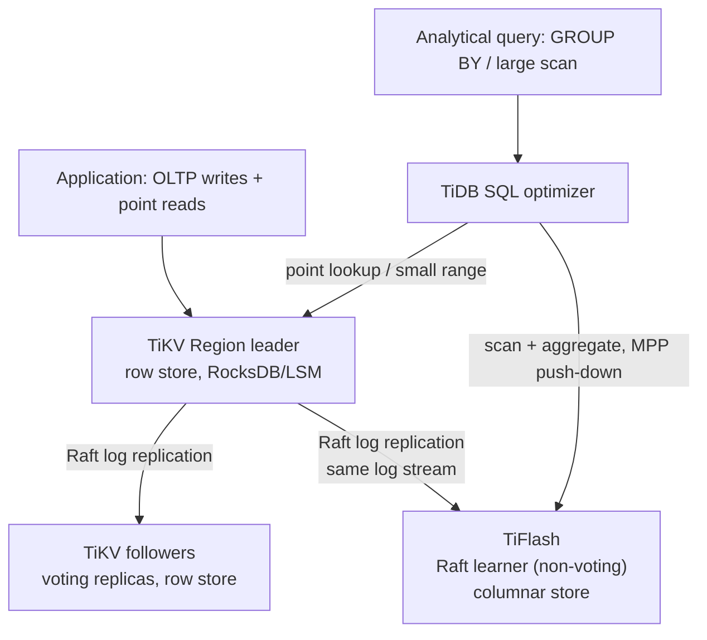

# HTAP (Hybrid Transactional/Analytical Processing)

*One database trying to serve both transactions and analytics, with no pipeline lag in between at all.*

`⏱️ ~8 min · 13 of 15 · L4`

> [!TIP] The gist
> [Real-time OLAP](12-real-time-olap.md) shrank the OLTP-to-analytics freshness gap to seconds by streaming changes into a *separate* columnar engine — still two systems, connected by a pipeline. HTAP asks a harder question: what if there were no pipeline at all — one database product serving both workload shapes directly, so an analytical query can read data a transaction just committed? Every real system that pulls this off still keeps two physical storage engines under the hood (a row store and a column store don't merge into one format) — the trick is syncing them at the database's own internal layer instead of via an external connector.

## Intuition

Real-time OLAP's newsroom kept two buildings — a whiteboard ticker and an archive — connected by a courier who copies today's news over during the day. However fast that courier runs, they're still a separate moving part: they can get delayed, lose a page, or need their own schedule watched.

HTAP's bet is different: what if the whiteboard *is* the archive — one building, where every word a reporter dictates is automatically transcribed into both the messy live ticker and the properly indexed archive at the same instant, by the building's own internal wiring, not a courier walking between two addresses? No courier means no courier's delay — but it also means the building now needs two writing systems built into its walls instead of one, and a very deliberate floor plan so the ticker crowd and the archive researchers don't trip over each other.

## The concept

**HTAP (Hybrid Transactional/Analytical Processing) is a class of database designed to serve both OLTP-style transactional workloads and OLAP-style analytical workloads from one system — or one logically unified system — with little to no staleness between a write committing and that write being visible to an analytical query.** Gartner popularized the term around 2014 to name a category distinct from either a pure OLTP database or a pure OLAP warehouse.

The problem it targets is the exact one [OLTP vs. OLAP](../L2/13-oltp-vs-olap.md) named and [real-time OLAP](12-real-time-olap.md) shrank but didn't eliminate: every mainstream architecture keeps the system of record (an OLTP database) and the analytical serving layer as **two separate systems**, connected by a pipeline — batch ETL/ELT, or [CDC](08-cdc-and-outbox.md)/streaming ingestion. However fast that pipeline gets, it's still a second moving part with its own lag, its own failure modes, and its own operational surface. **HTAP's proposition is to remove the pipeline entirely**: keep both representations of the data inside the same database product, so an analytical query can run directly against data a transaction just committed.

| | Batch OLAP warehouse | Real-time OLAP (L4/12) | HTAP |
| --- | --- | --- | --- |
| Freshness | Minutes to hours | Seconds | Sub-second to near-zero |
| Mechanism | Scheduled batch ETL/ELT | Streaming ingestion into a separate columnar engine | Both workloads served by one database product |
| Number of systems | 2 (source + warehouse) | 2, plus a pipeline | 1 logical system (still 2 storage engines under the hood) |
| Consistency of analytical read | Whatever the last batch load landed | Eventually consistent, bounded by pipeline lag | Often snapshot-consistent or stronger — both engines share one transaction manager |

## How it works

### Two genuine obstacles, not just "engineering effort"

Unifying OLTP and OLAP is hard for two independent reasons — worth naming both, because conflating them makes the problem look easier than it is.

**Obstacle 1: row-store and column-store are opposite physical layouts, not two settings of the same one.** A row store keeps every column of one row contiguous — built to make "fetch/update one row fast" cheap, exactly what a transaction needs. A column store keeps each column contiguous across many rows, heavily compressed and organized for scanning — exactly what a `GROUP BY` needs, but at the direct cost of making a single-row update expensive: touching one value inside a compressed, sorted column block can mean decompressing, rewriting, and recompressing the whole block. There is no single data structure that's simultaneously the best row store and the best column store — which is why every real HTAP system maintains **two physical representations** rather than one universal format.

**Obstacle 2: even with two storage engines, OLTP and OLAP compete for the same CPU, memory, and I/O if run on shared hardware.** A transaction wants low, predictable latency touching a handful of rows; an analytical query wants to consume as much resource as it can get for a large scan, and is comparatively latency-tolerant. Run both against the same buffer pool and disks with no isolation, and one heavy scan can evict the transactional working set from cache and spike checkout latency — the classic **noisy-neighbor problem**, showing up here at the storage/compute layer.

### Approach 1: dual storage, synced by the database's own replication protocol — TiDB

**TiDB** (PingCAP) pairs two genuinely separate storage engines, kept in sync through the database's native replication protocol rather than an external pipeline:

- **TiKV** — a row-oriented, LSM-tree key-value store, partitioned into key ranges ("Regions"), each replicated (typically 3-way) and kept consistent via **Raft consensus**: a Region leader accepts writes, appends them to its Raft log, and replicates that log to follower replicas.
- **TiFlash** — a columnar storage extension that registers as a **Raft learner** on the same Regions. A learner receives and applies the exact same replicated log stream an ordinary Raft follower does, but doesn't vote in leader elections or count toward the write quorum. TiFlash applies that log into a columnar, compressed format instead of TiKV's row format.
- Because TiFlash consumes the *same Raft log* TiKV's own followers consume, it inherits Raft's ordering and durability guarantees directly, rather than depending on a separately-operated CDC connector's offset tracking. For queries needing a stronger guarantee than "eventually caught up," TiDB can require a TiFlash replica to prove it has applied the log up to a target index before answering — trading a small wait for a snapshot-consistent read.
- TiDB's SQL optimizer routes each query, transparently to the application: point lookups and small-range scans go to TiKV; large scans and aggregates push down to TiFlash's MPP-style execution.

The key point: this isn't one storage engine serving both workloads — it's two engines, kept in sync at the database's own consensus-protocol layer instead of via an external CDC pipeline.

### Approach 2: in-memory hybrid engines — SAP HANA and SingleStore

A second family gets to the same goal by maintaining both representations **in memory**, inside a single engine, rather than as separate replica types across a cluster.

**SAP HANA** splits each column-store table into a small, write-optimized **delta store** (new writes land here, fast to insert) and a compressed, read-optimized **main store** that queries actually scan against — a background **merge** process periodically folds delta into main. This is the same memtable/SSTable-style two-tier trade already seen for LSM-trees and for real-time OLAP's segment split, applied one level further down inside a single engine. MVCC keeps both representations consistent, so a query sees one coherent snapshot spanning both.

**SingleStore** historically let you pick, per table, between an in-memory **Rowstore** (OLTP-shaped) and a disk-based **Columnstore** (OLAP-shaped). Its current **Universal Storage** extends the columnstore with hash indexes, row-level locking, and upserts so one disk-based columnar table can also absorb transactional-style point writes efficiently — narrowing the old either/or choice. Either way, both storage forms sit inside one distributed SQL engine with one MVCC-based transaction manager, so a query joining a small hot table against a large fact table sees one consistent snapshot across two physically different representations.

### Workload isolation: unifying storage doesn't remove Obstacle 2

Because resource contention doesn't disappear just because storage is logically unified, essentially every real HTAP deployment still isolates the two workloads at the compute level:

- **Physically separate replica types reading a shared/synced dataset** — TiFlash nodes are literally separate machines from TiKV nodes; a heavy analytical scan runs entirely on TiFlash's own hardware, never stealing cycles from TiKV's OLTP path. This is the most common real-world isolation technique.
- **Separate compute pools over shared storage** — decoupling storage from compute so independent compute clusters can read the same data without contending for CPU/memory.
- **Resource governors on a shared instance** — capping CPU/memory/I/O per workload group when no dedicated HTAP engine is in play at all.

The throughline: whether via a non-voting replica, a separate compute pool, or a resource cap, almost every real mixed-workload deployment ends up doing some explicit form of isolation — because running a latency-sensitive point-lookup workload and a throughput-hungry scan workload on fully shared, unisolated hardware reliably reproduces the noisy-neighbor problem, unified storage format or not.

## Worked example: a live per-merchant dashboard

A payments platform processes ~2,000 card transactions/sec across thousands of merchants and wants a live "today's sales, by hour, by store" dashboard reflecting a transaction within a second or two of it clearing.

1. **Without HTAP (the mainstream pattern):** transactions land in Postgres; a Debezium connector tails the replication slot; a Kafka topic streams changes into a real-time OLAP engine serving the dashboard. This works and gets single-digit-second freshness — but it's three systems with three sets of operational concerns: connector lag, idempotent consumption, a second cluster to keep available.
2. **With TiDB-style HTAP:** the same write commits to a TiKV Region leader, replicating via Raft to both TiKV followers (OLTP durability) and a TiFlash learner (the columnar copy) in the same replication round. The dashboard's `GROUP BY store_id, hour` query pushes down to TiFlash's columnar execution while TiKV keeps serving payment writes/reads undisturbed, on separate hardware. Freshness is bounded by Raft replication lag to the learner — typically a low-single-digit-second window — with no separate connector or cluster.
3. **The trade actually made:** the platform gave up a battle-tested, independently-swappable stack (Postgres + Debezium + a purpose-built OLAP engine) for a single vendor's dual-engine internals and a smaller talent pool — in exchange for one fewer moving part and a tighter freshness bound than any CDC pipeline can promise.

## In the real world

- **TiDB Cloud's own documentation** confirms the mechanism above in its own words: "the replica in TiFlash is asynchronously replicated as a special role, Raft Learner," conducting "real-time replication of data in the TiKV nodes at a low cost that does not block writes in TiKV," and providing "the same Snapshot Isolation level of consistency as TiKV." ([TiFlash Overview, TiDB Cloud docs](https://docs.pingcap.com/tidbcloud/tiflash-overview/), accessed 2026-07-23)
- **Flipkart** migrated its Coin Manager platform off 700+ sharded MySQL clusters onto two self-managed TiDB clusters after hitting scalability and operational-complexity limits during high-traffic shopping events. Notably, the case study is explicit that Flipkart has used TiDB primarily for its *transactional* workload so far, naming HTAP/TiFlash adoption for real-time analytics as a **planned next step** — not something already running in production. It's a useful, honest data point: migrate the OLTP workload first, adopt HTAP later, rather than flipping an HTAP switch on day one. ([PingCAP case study](https://www.pingcap.com/case-study/flipkart-transforming-database-management-and-reducing-complexity-with-tidb/), ~Oct 2024)
- **PLAID Inc.**, which runs the KARTE real-time customer-experience platform (19.9 billion cumulative users tracked, peak 134,000 events/sec), benchmarked TiFlash against BigQuery and found TiDB/TiFlash delivered "performance comparable to OLAP-specialized databases" with strong horizontal scalability as data volume grew, while noting it required more tuning than a fully managed warehouse. ([PingCAP Japan case study](https://pingcap.co.jp/case-study/plaid/), Nov 2023)
- **SingleStore's Universal Storage**, per current docs, is "a continuing evolution of the columnstore, supporting transactional workloads that would have traditionally used the rowstore" — adding hash indexes, row-level locking, and upserts directly to the columnstore. ([SingleStore docs](https://docs.singlestore.com/cloud/create-a-database/columnstore/universal-storage/), last modified Oct 18, 2024)

No verified fintech example of *true HTAP already running in production* (as opposed to an OLTP-only migration with HTAP planned) turned up within this repo's freshness window, and no UPI/NPCI angle applies here — UPI is documented as a payments switch, not a database vendor's HTAP product, so that connection isn't forced in.

## Trade-offs

✅ **What true HTAP buys**
- Shrinks the OLTP-to-analytics freshness gap to sub-second without operating a second external pipeline.
- One logical schema and one transaction manager — analytical queries see transactionally-consistent (sometimes strongly consistent, on demand) data, not a pipeline-lag-bound copy.
- Fewer distinct operational surfaces than "OLTP DB + CDC connector + separate OLAP cluster," provided the dual-engine internals count as one thing to operate.

❌ **What it costs**
- Every real implementation still maintains two physical storage representations — "unification" is at the logical/query layer, not one magical format.
- Genuine resource-contention risk if workload isolation isn't deliberately configured.
- A materially smaller ecosystem and hiring pool than "Postgres + Debezium + ClickHouse."
- A bigger, riskier migration than incrementally bolting a CDC pipeline onto an existing estate.

> [!IMPORTANT] Remember
> HTAP doesn't invent one storage format that's simultaneously an ideal row store and an ideal column store — it can't, because those are opposite physical layouts. What it actually does is keep two storage engines in sync at the database's own internal layer (a Raft log, an in-memory delta-merge) instead of via an external pipeline — and every real deployment still has to isolate the two workloads at the compute level, or the noisy-neighbor problem comes right back.

## Check yourself

- Explain precisely why "row store vs. column store" is a real obstacle to HTAP even before any resource-contention concern is considered — what specifically makes one physical layout bad at the other's job?
- A TiFlash node is a "Raft learner." What does it receive, and what does it *not* get to do, compared with an ordinary Raft follower?
- Flipkart's case study describes adopting TiDB for OLTP first and treating HTAP/TiFlash as a later step. Why might a company sequence a migration this way rather than adopting the full HTAP stack on day one?
- Why does even a "logically unified" HTAP system still need explicit workload isolation? What failure mode does skipping it reproduce?

→ Next: Database branching / serverless DBs (Neon, PlanetScale)
↩ comes back in: L5 (consensus — Raft's leader election, log replication, and learners as a distinct replica role get their full treatment), L12 (scalability patterns — the workload-isolation techniques here are specific instances of general resource-isolation/noisy-neighbor patterns)
