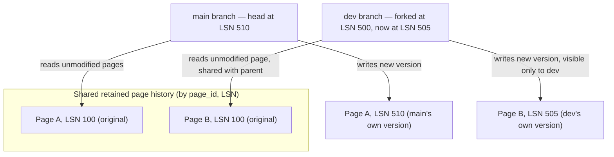

# Database Branching / Serverless Databases

*Compute that scales to zero, storage that never forgets a version — so cloning a multi-gigabyte database costs about as much as creating a git branch.*

`⏱️ ~7 min · 14 of 15 · L4`

> [!TIP] The gist
> A serverless database splits **compute** (stateless, can be torn down and recreated freely) from **storage** (durable, and — the key trick — it never throws an old page version away). Because storage keeps every version of every page it has ever produced, keyed by a log position, forking an entire database is just planting a new named pointer into that shared history. No bytes move. That's what lets a "branch" of a 40-million-row production database appear in about a second, at close to zero cost, the same way a git branch appears instantly without duplicating the repository.

## Intuition

A git branch isn't a second copy of your repository's history — it's a new pointer into the *same* shared commits everyone already has. `git checkout -b` doesn't duplicate a single file; it just means "reads resolve here now." Only the commits you make *after* branching produce new, branch-only objects. Everything before the fork point stays shared, unduplicated, forever — which is exactly why branching a repo with ten years of history is instant, regardless of how much history there is.

Database branching is the identical trick, one layer down. The "commits" are page versions tagged with a log position instead of git hashes; "checking out a branch" means telling the storage layer "resolve this branch's reads by walking this shared history, forked at this point, plus whatever this branch writes from here." No table gets copied — for the exact same reason no file gets copied when you branch a repo.

## The concept

**A serverless database separates compute (the stateless process that executes queries and enforces transactions) from storage (a durable, independently-scaled service that persists every change and can be scaled — including to zero — on its own schedule).** This is the core architectural move; "serverless" describes *who* provisions the underlying machines and on *what timescale*, not an absence of servers. Neon (PostgreSQL-compatible) and PlanetScale (MySQL-compatible, built on the Vitess sharding layer, `verify` exact storage internals) are the two systems most commonly used to make this concrete.

**Database branching is creating an instant, cheap, full copy of a database — schema and data both — for an isolated use** (a dev environment, a PR preview, a migration test) — a complete, independently-writable database from the application's point of view, not a read replica (which only ever mirrors its source, never diverges) and not a view (always a live derivative, never a frozen, writable fork). What makes it a genuinely new capability rather than "cloning with better marketing" is that creating one **copies nothing**: it's a metadata pointer into storage that was already retaining every version it needed.

## How it works

### Storage keeps every page version, not just the current one

A traditional B-tree engine (standard PostgreSQL, InnoDB) keeps exactly one current physical copy of each page, overwritten in place on every write. The write-ahead log exists purely for crash recovery and is disposable once a checkpoint confirms it's reflected in the pages. This is precisely why cloning a traditional database is expensive: current state lives *only* in the current pages, so a second copy means copying those pages, in full.

A serverless storage tier inverts this. Every write still produces a normal WAL record tagged with an [LSN](../L2/09-write-ahead-log.md#log-records-and-log-sequence-numbers-lsns) exactly as usual — but instead of discarding old page versions once a checkpoint runs, the storage tier deliberately **retains every version of every page**, keyed by `(page_id, LSN)`, and answers "give me page P as of LSN X" by finding the closest prior version and replaying only the deltas since. This is [MVCC's row-versioning idea](../L2/06-mvcc.md#the-core-idea-versions-not-overwrites) — keep old versions instead of overwriting, let a reader ask for a snapshot — generalized from individual rows up to entire physical pages, and kept around far longer than a normal engine's `VACUUM` would ever allow, because that retained history is exactly what a branch needs to fork from.

### A branch is a pointer, not a copy

Creating a branch means picking a source LSN (almost always "the parent's current position, right now") and recording: *"this new branch's history is everything the parent had up to this LSN, plus whatever new writes land on the branch itself from here forward."* Because every page version back to that point already exists in the shared store, this is a metadata-only operation — fast regardless of how large the parent database actually is.

From there it behaves exactly like copy-on-write forking anywhere else it shows up (a filesystem snapshot, an OS process's memory after `fork()`): a read for a page the branch hasn't touched walks up to the parent's history and reconstructs it from the identical shared bytes — no divergence yet. A write on the branch produces a *new* page version, tagged with an LSN in the branch's own forward sequence, visible only to that branch; the parent is completely unaffected.

Storage cost from that point on is proportional only to how much the branch has actually *diverged* — never to the size of the dataset it forked from. This is the same "pay for the diff, not the whole copy" idea that log-structured storage and LSM-tree compaction use throughout this level, applied here to "clone a whole database" instead of "append a row version."

### Why this needed a new storage layer, and what compute gets in return

A B-tree engine mutates pages in place, destroying the old bytes once a checkpoint runs — there's nothing left to fork from without a separate layer intercepting the WAL and reconstructing pages on demand underneath the standard engine, which is exactly what Neon's Pageserver/Safekeeper split and PlanetScale's Vitess-based storage layer each do in their own way.

Once compute holds no unique durable state, two more properties fall out for free: it can be torn down entirely when idle with nothing to lose (**scale-to-zero** — the first query after idling pays a cold-start cost measured in sub-seconds to low single digits, `verify` exact current figures per vendor, but nothing is billed while idle), and a burst of short-lived serverless *application* compute (Lambda-style) can hammer the database with far more simultaneous connections than a fixed pool was ever sized for — solved the same way [connection pooling](../L2/12-connection-pooling.md) always solved it, just relocated in front of the whole platform as an elastically-scaled shared service instead of one app server's static pool.

### Worked example: forking a branch at LSN 500

A team's production database sits at **LSN 500**, holding a `users` table with 40 million rows.

1. A developer runs `create branch dev-feature-123 from main`. The platform records "`dev-feature-123` = main's history up to LSN 500, plus its own writes from here." No page is copied — this takes about a second regardless of table size, and the branch immediately has all 40 million rows.
2. Reads on the branch against untouched rows cost nothing extra — same shared physical bytes `main` itself would serve.
3. The developer runs a migration and backfills a subset of rows, only on the branch. Each modified page gets a new version tagged LSN 501-504, visible only to `dev-feature-123`. `main` keeps taking its own production writes (advancing past LSN 500) completely unaware.
4. If the branch is deleted after the test, it never held more than a handful of megabytes of its own diverged pages — never a second 40-million-row copy, and never a 24/7 compute bill.

## In the real world

**Neon** implements exactly this mechanism: its Pageserver answers a page request by finding "the last image of the page by the LSN, and any write-ahead-log (WAL) records on top of it, applies the WAL records if needed to reconstruct the page" — and branch creation is a pointer, since "if you access a part of the database that hasn't been modified on the branch, the storage system fetches the data from the parent branch instead." Its own workflow write-up describes the concrete CI pattern: a GitHub Actions job creates a branch when a PR opens, points a Vercel preview at it, and deletes it on merge — "creating a branch takes ~1 second, regardless of the size of your database," and billing only covers "unique data across all branches." ([Neon storage engine deep dive](https://neon.com/blog/get-page-at-lsn); [Preview environments with Neon, GitHub Actions, and Vercel](https://neon.com/blog/branching-with-preview-environments))

**PlanetScale's** "branching" is worth contrasting rather than assuming identical: per its own engineering blog, it's primarily a *schema-collaboration* workflow on top of Vitess — a branch is a copy of the schema for safe DDL experimentation, tracked and merged three-way against production's current schema at deploy time, then rolled out via non-blocking, `gh-ost`-based migrations with no table locking. That's a different mechanism from Neon's LSN-keyed, copy-on-write data forking — centered on merging concurrent schema changes across a team, not on giving every branch its own fully-diverging copy of the data. (`verify`: whether PlanetScale has since added full data-branching beyond this schema-branching model.) ([PlanetScale: three-way merge for schema changes](https://planetscale.com/blog/database-branching-three-way-merge-schema-changes))

## Trade-offs

✅ **What this buys**
- Branches cheap enough to give every PR, every developer, and every migration test its own full, production-shaped database — previously either skipped or paid for at full instance cost per copy.
- Idle compute costs nothing; dozens of preview branches can exist at near-zero standing cost.
- Strong isolation — a branch's writes land only in its own private page versions, so destructive tests can't touch the parent or a sibling branch.

❌ **What it costs**
- **Cold starts.** The first query after idling pays a real wake-up cost — a poor fit for an always-on, latency-sensitive OLTP path expecting consistent low p99s.
- **Branches don't auto-sync.** A branch is a static fork as of its source LSN unless the platform explicitly resets it; there's no cross-branch transaction or join once each has taken its own writes.
- **Long-lived, high-write branches stop being cheap.** Storage cost is proportional to divergence — a branch kept alive for months with its own continuous writes gradually approaches the cost of an independent database.
- **Vendor lock-in at the operational layer**, even though the wire protocol (PostgreSQL/MySQL) stays portable — branching and scale-to-zero are proprietary storage-tier features with no standard self-hosted equivalent.
- **Not a substitute for a dedicated, always-provisioned instance** on a high-QPS, latency-sensitive production path (a payments ledger, checkout) — the storage tier is a network hop away from compute, adding baseline per-page-fetch latency a co-located instance doesn't pay.

> [!IMPORTANT] Remember
> Branching isn't a clever new feature bolted onto a database — it's the direct consequence of a storage tier that never overwrites a page and never throws an old version away. A branch is just a named pointer into history that already existed; the same reason a git branch is instant is the reason this is instant.

## Check yourself

- A B-tree engine like standard PostgreSQL mutates pages in place. Explain precisely why that specifically rules out cheap copy-on-write branching without an extra storage layer underneath it.
- Walk through what happens when a branch forked at LSN 500 writes to a row on page P: what does the parent see, what does the branch see, and how many bytes actually moved at each step? Then explain why an eight-month-old branch with continuous independent writes no longer counts as "cheap."

→ Next: Data contracts (schema-registry-enforced)
↩ comes back in: L7 (reliability — scale-to-zero and elastic pooling as general resilience/cost patterns), L11 (cloud architecture — compute/storage separation reappears as a general cloud-architecture pattern beyond databases), L14 (infrastructure/cost — the scale-to-zero cost model generalized to cloud cost optimization)
