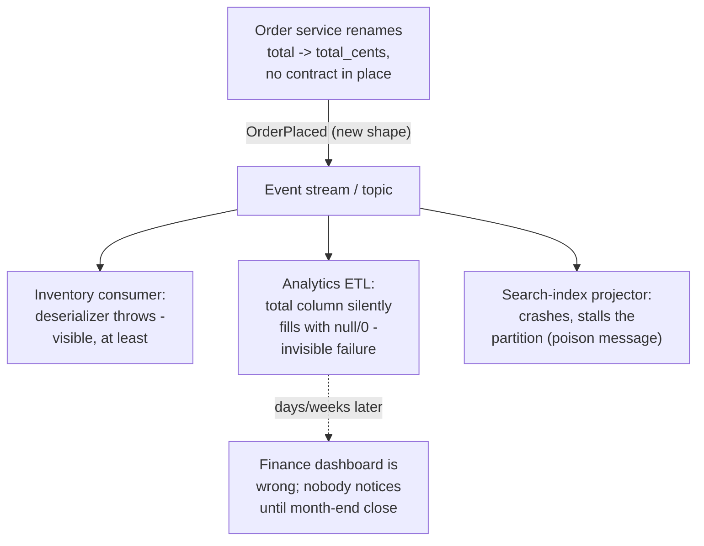
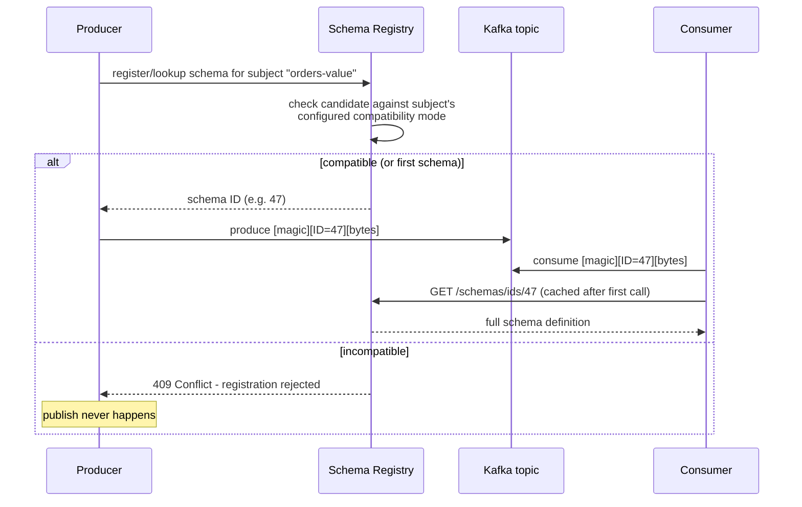
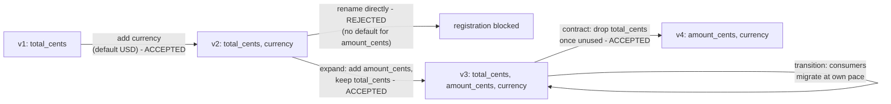

# Data Contracts (Schema-Registry-Enforced)

*Making a producer's schema a versioned, mechanically-enforced contract instead of an informal agreement everyone hopes holds.*

`⏱️ ~7 min · 15 of 15 · L4`

> [!TIP] The gist
> When one service publishes an event, every downstream consumer implicitly assumes it knows the event's shape. Nothing stops the producer from changing that shape — renaming a field, dropping one, widening a type — without telling anyone. A **schema registry** closes that gap: a centralized service that stores every version of every schema, and rejects a producer's new schema at write time if it violates a configured **compatibility mode** (BACKWARD, FORWARD, FULL, or NONE). It's the same discipline a compiler gives you inside one codebase — checking every caller before a signature changes — extended across service and team boundaries.

## Intuition

Imagine every team in a company that emails a shared spreadsheet link to a dozen other teams. One day, the spreadsheet's owner renames a column from "Total" to "Total_USD" because it fixes a units bug. Nothing in their own workflow breaks — their macros still run fine. But eleven other teams' formulas, which reference "Total" by name, now silently return errors or blank cells, and nobody finds out until someone notices a report doesn't add up weeks later.

A schema registry is the office policy that says: before you touch that column, submit the change to a central desk, which checks it against every rule "existing readers must still work" implies — and simply refuses to let the new version exist if it would break them.

## The concept

**A data contract is an explicit, versioned agreement between a producer and its consumers that fixes the structure, semantics, and evolution rules of the data the producer emits — whether a stream of events or a table at rest — so a consumer can build against it with the same confidence it would build against a stable function signature.**

This lesson focuses on the **structural** slice of that contract — field names, types, nullability — because that's the part a machine can check automatically, via a **schema registry**. Two other kinds of guarantee exist but live elsewhere:

- **Semantic guarantees** ("`total_cents` always equals the sum of line items") — enforced by application code or data-quality tooling, never by a schema.
- **Non-functional guarantees** (freshness, completeness, ownership) — live in docs and monitoring, not in a schema.

**The core terms:**

- **Schema registry** — a centralized service (Confluent Schema Registry is the dominant Kafka-ecosystem implementation; AWS Glue Schema Registry is AWS's managed equivalent) that stores every schema **version** for a **subject** (conventionally one per topic, e.g. `orders-value`), assigns each distinct schema a globally unique **ID**, and checks a proposed new schema against the subject's configured rule before allowing registration at all.
- **Compatibility mode** — the specific rule (BACKWARD / FORWARD / FULL / NONE) the registry enforces at registration time.
- **Schema drift** — what happens by default, with no contract in place: a producer changes shape, and consumers find out only when something breaks (or worse, when nothing visibly breaks and data is just silently wrong — the industry term for this is **data downtime**).

## How it works

### Why this problem gets worse, not better, with scale

Inside one service, a compiler catches a breaking signature change because every caller is visible in the same codebase. Across an event stream, a producer often has no idea how many consumer groups even exist. The more successful the architecture — the more teams subscribed to a topic — the bigger the blast radius of any single uncoordinated change.



### The registry as a mandatory checkpoint

Every message carries a small header — a magic byte plus a 4-byte schema ID — ahead of the compact, schema-free payload bytes. A consumer reads the ID, fetches (and caches) the matching schema, and decodes accordingly. The check that actually enforces anything happens at registration:



Kafka's brokers themselves are schema-agnostic — a partition is just an append-only log of opaque bytes. The registry is what turns "a pile of bytes" into a well-defined, versioned type every producer and consumer can be checked against.

### The four compatibility modes

Confluent Schema Registry (and AWS Glue Schema Registry's equivalent) define the same four modes — and **BACKWARD is the documented default** for a new subject:

| Mode | Allows adding a field | Allows removing a field | Safe rollout order |
| --- | --- | --- | --- |
| **BACKWARD** | Only with a default | Freely | Consumers upgrade *before* producers |
| **FORWARD** | Freely | Only if it had a default | Producers upgrade *before* consumers |
| **FULL** | Only with a default (both directions) | Only with a default (both directions) | Either order, independently |
| **NONE** | Anything goes | Anything goes | No guarantee at all |

The logic behind BACKWARD: a new-schema consumer must be able to read old data. Old data has nothing for a newly-added field to read, so a default plugs the gap. Old data doesn't have the deleted field either, but old data never *needed* it — so deletion is always safe. FORWARD is the mirror image, for old consumers reading new data. FULL demands both, and is the right choice when many independent consumer teams can't coordinate a rollout order with each other or the producer.

Formats matter here too: **Avro and Protobuf** are the common registry-paired choices because they're compact, strongly typed, and (Avro especially) have a formally specified evolution algorithm the registry's compatibility checker can implement precisely — JSON Schema works but has looser, more ad-hoc compatibility rules.

### Where enforcement actually happens

Three layered checkpoints, because each closes a gap the others leave open:

- **Producer-side** — the serializer calls the registry before sending; this is also where CI gates live, failing a pull request that would register an incompatible schema before it's even merged.
- **Broker-side** — optional server-side validation, closing the gap left by a producer that bypasses the registry-aware client entirely.
- **Consumer-side** — the deserializer's own schema-ID lookup fails loudly if a payload doesn't match, the last line of defense regardless of what happened upstream.

### Worked example: evolving `OrderPlaced` safely

Subject `orders-value`, mode BACKWARD:

```json
// v1
{"order_id": "ord_501", "customer_id": "cust_44", "total_cents": 9000}
```

Adding `currency` with a default of `"USD"` is **accepted** — a v2 consumer reading old v1 data has no `currency` field, and just falls back to the default. But *renaming* `total_cents` to `amount_cents` directly is **rejected** — a rename is structurally "delete old, add new," and `amount_cents` has no sane static default (there's no one constant that's correct for every historical order's actual total).

The safe path is an **expand-contract migration**:



Add the new field alongside the old one, let every consumer migrate its read path at its own pace, then — once every consumer has confirmed the switch — drop the old field in a later, separately-registered version. It's the exact same "add a column, backfill, dual-write, drop the old column" discipline as an ordinary relational migration, just made mechanically enforceable at every step.

### The synchronous-API cousin: consumer-driven contracts

A schema registry needs a broker with room to embed a schema ID — that shape doesn't exist for a direct REST/gRPC call between two services. The complementary technique there is **consumer-driven contract testing**, and **Pact** is the canonical implementation: a consumer records the exact fields/interactions it actually depends on as a "pact file," publishes it to a Pact Broker, and the provider's CI replays every consumer's recorded pact against its real implementation, failing the build if it no longer satisfies any of them.

| | Schema registry (streaming) | Pact (request/response) |
| --- | --- | --- |
| Checks | The entire schema's shape, against a fixed rule | Only the specific fields a consumer actually asserted on |
| Who has to act | Producer registers once; enforcement is automatic for every consumer | Every consumer must write and maintain its own contract tests |
| Blast-radius precision | Coarser, zero-effort per consumer | Finer-grained, but opt-in |

Neither replaces the other — a system with both event streams and internal REST/gRPC calls needs both mechanisms.

## In the real world

- **Confluent Schema Registry** was built by Kafka's original creators (Jay Kreps, Neha Narkhede, Jun Rao — all ex-LinkedIn engineers) after they left LinkedIn to found Confluent in 2014; it's the de facto standard across the Kafka ecosystem. Confluent's own documentation confirms BACKWARD as the default compatibility mode for a new subject. ([Confluent Docs](https://docs.confluent.io/platform/current/schema-registry/fundamentals/schema-evolution.html), accessed 2026-07-24)
- **AWS Glue Schema Registry** is AWS's serverless, free managed equivalent, integrating with Kafka, MSK, Kinesis Data Streams, Managed Flink, and Lambda — supporting Avro, JSON Schema, and Protobuf, with 8 named compatibility modes (a superset covering Confluent's transitive variants under different names). ([AWS Docs](https://docs.aws.amazon.com/glue/latest/dg/schema-registry.html), accessed 2026-07-24)
- **Pact** originated in 2013 at realestate.com.au (REA Group), created by Ron Holshausen to solve integration-testing pain in a growing Ruby microservices architecture; Beth Skurrie joined shortly after and built out the Pact Broker and "provider states" concept. ([Pact Docs — History](https://docs.pact.io/history), accessed 2026-07-24)
- **Stripe** pins every account to a specific API version on first request, allows a per-request `Stripe-Version` override, and scopes monthly releases to backward-compatible-only changes (adding optional parameters, new response fields, new webhook event types) — consumers are contractually expected to ignore fields they don't recognize, the same "additive is safe, anything else needs an explicit step" principle behind BACKWARD compatibility. Named major releases may break compatibility, with a 72-hour rollback window after upgrade. ([Stripe Docs — API upgrades](https://docs.stripe.com/upgrades), accessed 2026-07-24)

No UPI/NPCI source describing schema-registry-style versioning or compatibility governance for UPI specifically was found in this pass — the closest verifiable document (an NPCI circular on migrating from ISO 8583 to XML) governs a different NPCI rail (AePS), not UPI, so it isn't included here as a UPI example.

## Trade-offs

✅ **What it buys**

- Fail-fast at write time — an incompatible change is rejected before a single byte reaches a topic, instead of an unbounded downstream blast radius discovered later.
- A single, versioned source of truth for a payload's shape, usable by any consumer without coordinating with the producer directly.
- A precise, mechanically checked answer to "is this change safe" (BACKWARD/FORWARD/FULL), instead of an informal judgment call.
- Compact wire format as a side effect of pairing with Avro/Protobuf — real bandwidth/storage savings at high volume.

❌ **What it costs**

- A new, centralized dependency: if the registry is unreachable, a producer or consumer that hasn't already cached a schema can't produce or consume at all.
- Real friction on a legitimately desired breaking change — a field rename needs a multi-step expand-contract migration, not a one-line diff.
- Ever-growing versioning overhead — every accepted change is a permanent, numbered version someone has to be able to explain.
- Zero coverage of semantic or business-rule violations — a schema checks *shape* only, never meaning.
- Doesn't stop a producer that bypasses the registry-aware client entirely, unless broker-side validation is also enabled.

> [!IMPORTANT] Remember
> A schema registry doesn't invent a new enforcement idea — it does at write time, across service boundaries, what a compiler already does at compile time inside one codebase: reject a change before it can break a caller. The compatibility mode you pick (BACKWARD, FORWARD, or FULL) isn't just a policy — it dictates the safe rollout order, and getting that order backward is exactly how "compatible" schema changes still cause outages.

## Check yourself

- A subject is configured with BACKWARD compatibility, and a producer tries to add a new *required* field with no default. What happens, and why — what would have to change for the registration to succeed?
- A team wants to rename a field with no sensible default value. Why does this fail immediately under BACKWARD compatibility, and what's the standard safe path that gets there anyway?
- A teammate says "we use Avro, so we have a full data contract." What does this claim correctly cover, and what kind of guarantee does it leave completely unchecked?

→ Next: This completes **L4 (NoSQL and Data at Scale)** — up next is **L5 (Distributed Systems Theory)**, starting with CAP/PACELC and consistency models.
↩ comes back in: L5 (idempotency and delivery semantics generalize the at-least-once assumption this topic's enforcement sits on top of), L6 (Kafka internals — the broker/partition mechanics a registry's wire format rides on), and later wherever event-driven microservices or API versioning come up again.
