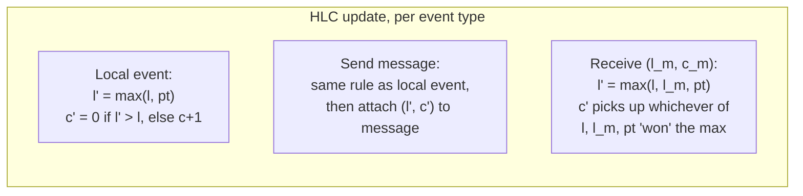
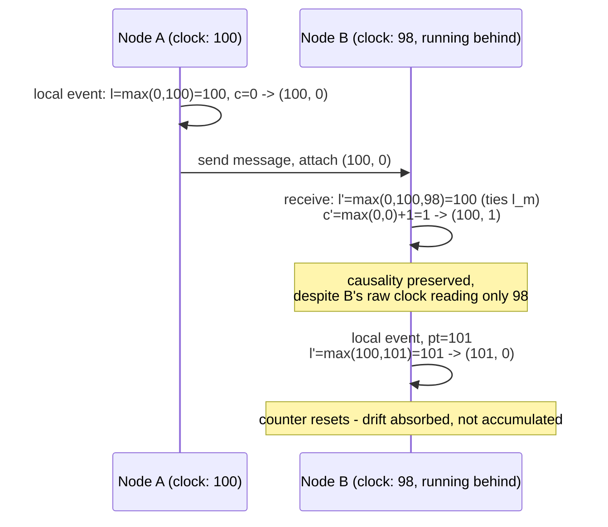

# Hybrid Logical Clocks vs TrueTime

*Two answers to "can I trust a timestamp from a machine that isn't mine" — one built entirely in software, one built on atomic clocks.*

`⏱️ ~8 min · 16 of 16 · L4`

> [!TIP] The gist
> Every machine's clock drifts and skews relative to every other machine's — so comparing raw timestamps across nodes can silently get causality backward, with no warning. **Hybrid Logical Clocks (HLC)** fix this in pure software: a `(physical time, logical counter)` pair that stays close to wall-clock time but falls back to Lamport-style counting whenever physical time alone can't be trusted. **TrueTime** (Google Spanner) takes the opposite bet: dedicated GPS/atomic-clock hardware bounds clock uncertainty tightly, and a technique called **commit wait** spends a few milliseconds of latency on every write to convert that bound into a provable global ordering guarantee.

## Intuition

Imagine two people at opposite ends of a long table, each wearing a slightly different wristwatch, trying to agree on who spoke first. One approach: agree on a set of ground rules — "if I heard you speak, my next word counts as later than yours, no matter what our watches say." That's a logical clock, tuned by HLC to also stay roughly watch-accurate.

The other approach: give both people a watch synced to an atomic clock down to the millisecond, and a rule — "before you claim you spoke, wait out the watch's known margin of error first." That's TrueTime: don't argue about the reading, just make the margin of error small enough, and pay it in wait time whenever it matters.

## The concept

**Clock drift** is how much a single machine's own clock diverges from true time as it runs — a quartz oscillator ticking slightly fast or slow (Spanner's own paper cites a worst case of ~200 microseconds/second, roughly 17 seconds/day if never corrected). **Clock skew** is the *gap between two different machines' clocks* at the same instant — unavoidable because every machine drifts independently, and never provably zero even with NTP running everywhere.

**NTP (Network Time Protocol)** mitigates drift and skew by periodically re-syncing a machine's clock to a reference source — typically holding datacenter machines within single-digit milliseconds under good conditions — but it's a mitigation, not a cure: a correction can even move a clock *backward*, and skew between any two unsynchronized reads is never guaranteed to be zero.

**Why this breaks naive ordering.** If two nodes just compare raw timestamps to decide "which write happened first," skew alone can make a causally-*later* write appear to have an *earlier* timestamp — silently, with no error raised. Every mechanism below exists to close off exactly that failure.

**Lamport clocks** (Leslie Lamport, 1978) were the first fix: throw physical time away, keep a single integer counter per process that only ever increases. On a local event, increment it. On sending a message, attach the current value. On receiving one carrying value `t`, set the local counter to `max(local, t) + 1`. This guarantees: if A happened-before B, A's counter is strictly less than B's. But a Lamport timestamp tells you nothing about elapsed real time (5 vs. 105 could be a microsecond or a decade apart), and it only gives a *partial* order — concurrent, causally-unrelated events can land in either order.

**Hybrid Logical Clocks (HLC)** graft Lamport's causality-preserving counter onto physical time instead of discarding physical time. An HLC timestamp is a pair `(l, c)`: `l` is a physical-time component kept close to the node's real clock (but never allowed to run backward), and `c` is a logical counter that absorbs any moment physical time alone isn't enough to keep events strictly ordered. (Formalized by Kulkarni, Demirbas, Madappa, Avva & Leenders, 2014.)

**TrueTime** is Google Spanner's hardware-backed alternative: instead of a single timestamp, `TT.now()` returns an interval `[earliest, latest]` guaranteed to contain the true time — and a mechanism called **commit wait** spends that interval's width as deliberate latency to buy a provable global ordering guarantee Spanner calls **external consistency** (linearizability extended across distributed transactions — L5's own topic, in full).

## How it works

### HLC's update rules

Every node keeps a running `(l, c)` state, updated by three rules that mirror Lamport's exactly, with physical time spliced in:

- **Local event.** Read the physical clock `pt`. Set `l' = max(l, pt)`. If `l'` genuinely exceeds the old `l`, reset `c' = 0`; otherwise (physical time hasn't caught up) keep `l' = l` and bump `c' = c + 1`.
- **Send a message.** Same update as a local event, then attach `(l', c')` to the message.
- **Receive `(l_m, c_m)`.** Set `l' = max(l, l_m, pt)` — the max of *three* things now, not two. Whichever of local `l`, the message's `l_m`, or the fresh physical read `pt` "wins" that max decides how `c'` is set: if physical time genuinely wins outright, reset `c' = 0`; otherwise bump whichever counter tied for the max.



**Worked example, two nodes, both starting at `(0, 0)`:**

1. **A: local event.** A's clock reads `pt = 100`. `100 > 0`, so **`(100, 0)`**.
2. **A sends `(100, 0)` to B.** B's clock happens to be running slightly *behind* A's — ordinary bounded skew — reading only `pt = 98` on receipt.
3. **B receives it.** `l' = max(0, 100, 98) = 100` — ties the message's `l_m`, so `c' = max(0, 0) + 1 = 1`. **`(100, 1)`** — strictly greater than A's `(100, 0)`, exactly as causality requires, *even though B's own clock says 98*. The counter absorbed the 2ms of skew without letting the receive look earlier than the send.
4. **B: local event later**, clock now reads `pt = 101` (caught back up). `l' = max(100, 101) = 101`, genuinely exceeds the old `l`, so `c'` resets to `0`. **`(101, 0)`** — the logical component never piles up indefinitely; it discards itself the instant physical time is trustworthy again.



### TrueTime and commit wait

TrueTime's tight interval is bought with real hardware: every Spanner datacenter runs **time master** machines equipped with GPS receivers or a local atomic clock (an "armageddon master," hedging against GPS-specific failures like jamming), polled by a lightweight **timeslave daemon** on every ordinary machine using **Marzullo's algorithm** to combine sources. Between polls, uncertainty (**epsilon, ε**) widens continuously at a conservative rate — the well-known **sawtooth** pattern — then resets after the next poll.

**Commit wait** spends that uncertainty to guarantee commit timestamps match real-world commit order:

1. On commit, Spanner assigns timestamp `s = TT.now().latest` — the conservative, upper end of the interval.
2. Before releasing the commit's writes to anyone, it waits until `TT.after(s)` is true — i.e., until real time has certainly passed `s`.
3. Because true time has provably passed `s` before the writes become visible, any transaction starting afterward is guaranteed a strictly greater timestamp — no coordination round needed, just a wait.

```mermaid
sequenceDiagram
    participant T1 as Transaction T1
    participant Clock as TrueTime
    participant T2 as Transaction T2 (starts after T1 is visible)

    T1->>Clock: TT.now() -> [earliest, latest]
    T1->>T1: assign commit timestamp s = latest
    T1->>Clock: wait until TT.after(s) is true<br/>(TT.now().earliest &gt; s)
    Note over T1,Clock: commit wait - roughly 2*epsilon, a few ms
    T1->>T1: release commit - writes now visible
    T2->>Clock: TT.now() -> earliest already &gt; s
    T2->>T2: assigned commit timestamp guaranteed &gt; s
```

The cost is named plainly: commit wait adds roughly `2ε` of latency to **every** write commit — a real, unavoidable, single-digit-to-low-double-digit-millisecond tax, paid in exchange for never needing an explicit cross-node coordination protocol to get global ordering right.

## In the real world

- **Google Spanner** is TrueTime's canonical home: every commit calls `TT.now()`, assigns `s = latest`, and waits for `TT.after(s)` — Google's current Cloud docs still describe TrueTime as "a highly available, distributed clock" producing monotonically increasing timestamps that make Spanner externally consistent. The original OSDI 2012 paper remains the primary source for ε figures (typically single-digit milliseconds) and the GPS/atomic-clock hardware detail.
- **CockroachDB** uses HLC for MVCC timestamps, with no special hardware, "to optimize for performance." It adds its own software-only echo of TrueTime's uncertainty interval — a configurable `max_offset` (default 500ms) — and a read landing inside that window forces a transaction *restart* at a higher timestamp rather than risk an ambiguous order: trading Spanner's hardware-bounded ε for a wider NTP-bounded window, paid for with occasional restarts instead of per-commit waits.
- **MongoDB** implements "cluster time" as an HLC internally (a 64-bit value combining a physical component and a logical counter), used to order operations consistently across a replica set or sharded cluster and to guarantee causal consistency (read-your-writes, monotonic reads) for causally-consistent sessions — published by MongoDB engineers at SIGMOD 2019.
- **YugabyteDB**, built in the Spanner lineage, defaults to HLC and offers hardware-clock-synchronization as only an optional alternative for deployments that have already invested in tightly bounded physical clock sync.

*(No UPI/NPCI source on clock-synchronization mechanics for distributed transaction ordering was found meeting this sweep's bar — flagging that gap rather than guessing.)*

## Trade-offs

| | Hybrid Logical Clocks (HLC) | TrueTime |
| --- | --- | --- |
| **Hardware** | None — pure software, on top of ordinary NTP-synced clocks | Dedicated GPS/atomic clocks in every datacenter, plus a fleet-wide time-distribution daemon |
| **Portability** | Runs anywhere, any cloud | Effectively tied to an operator controlling its own datacenter hardware |
| **What's returned** | A single `(l, c)` pair | An explicit interval `[earliest, latest]` |
| **Causality guarantee** | Always: happened-before implies strictly smaller timestamp | Only via commit wait — the raw call gives you the bound, not the ordering guarantee for free |
| **Global total order for concurrent events** | Not guaranteed — two truly concurrent writes can tie or land either way | Guaranteed, system-wide, for anything through commit wait ("external consistency") |
| **Added write latency** | ~None — a handful of comparisons | Real, deliberate wait on every commit, roughly `2ε` |
| **If clock sync degrades** | Gracefully absorbed — counter grows, causality never lost, only wall-clock-closeness weakens | ε widens, commit-wait latency grows; Spanner prefers unavailability over risking incorrect ordering |
| **Who uses it** | CockroachDB, MongoDB (cluster time), YugabyteDB (default) | Google Spanner; YugabyteDB offers it only as an optional alternative |

> [!IMPORTANT] Remember
> HLC and TrueTime answer the identical question — "can I trust a timestamp from another machine" — with opposite bets: HLC buys causal ordering plus approximate wall time everywhere, for free, in software, but never quite promises a true global total order for concurrent events. TrueTime buys a genuine, provable global total order everywhere commit wait runs, at the cost of dedicated hardware and a real latency tax paid on every single write. Most systems don't need cross-region external consistency and get everything from HLC's free causal ordering; the narrow case that specifically needs "any later transaction anywhere sees this write, no exceptions, ever" is what TrueTime's extra cost actually buys.

## Check yourself

- Node A writes value X and sends a message to node B, which then writes value Y in response. B's physical clock happens to be running *ahead* of A's. Walk through why comparing A's and B's raw physical timestamps could get the ordering backward, and why an HLC timestamp on the same two events cannot.
- Why does TrueTime hand back an *interval* instead of a single timestamp, and what specific technique (and what does it cost) turns that interval into a global ordering guarantee?
- A team says "we don't have GPS receivers in our datacenter, so we can't get ordering guarantees across nodes." What's wrong with that claim, and what would CockroachDB or MongoDB tell them instead?

→ Next: This completes **L4 (NoSQL and Data at Scale)** — up next is **L5 (Distributed Systems Theory)**, starting with **CAP and PACELC**.
↩ comes back in: L5 (external consistency/linearizability formalizes commit wait's guarantee; consensus — Paxos, Raft, ZAB — is paired with, not a substitute for, this topic's clocks; vector clocks generalize Lamport's counter to detect concurrency, the exact gap this topic deferred; L5 revisits HLC itself with the fuller consistency-model vocabulary), and later wherever multi-region databases or distributed transaction ordering come up again.
