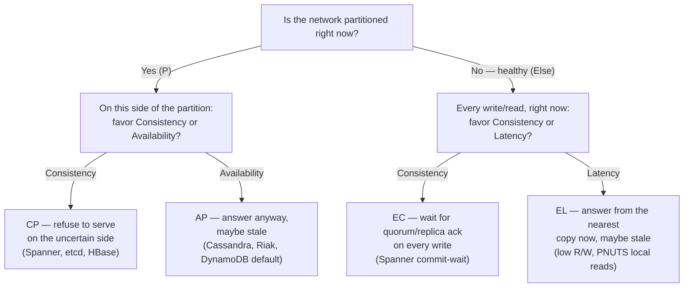

# CAP and PACELC

*Every system with more than one copy of the data eventually has to answer one question: when a copy can't be sure it's current, does it refuse to talk, or does it talk anyway?*

`⏱️ ~8 min · 1 of 22 · L5. Distributed Systems Theory`

> [!TIP] The gist
> **CAP** says that once you replicate data across a network, you cannot have perfect **Consistency** (every read sees the latest write) and perfect **Availability** (every request gets an answer) at the same time *during a network partition* — you must pick one. Partition tolerance isn't really a choice; networks partition whether you plan for it or not, so the real question is always "C or A, when it happens." **PACELC** fills the gap CAP leaves open: even with **no** partition, keeping replicas in sync costs round-trip latency, so *normal operation* forces its own trade-off — **Latency or Consistency**. Together: **if Partitioned, choose Availability or Consistency; Else, choose Latency or Consistency.**

## Intuition

Picture two branches of the same bank, connected by a phone line that just went dead. A customer walks into Branch A and withdraws the last $100 in a shared account. Branch B has no way to know that happened — the line is down.

Now a second customer walks into Branch B and asks, "what's my balance?" Branch B has exactly two honest options: **refuse to answer** ("the line's down, I can't confirm your balance, come back later") or **answer with what it has on paper**, which might already be wrong. There's no third option where it both answers immediately *and* is guaranteed correct — the phone line being dead makes that combination physically impossible. CAP is that observation, formalized.

## The concept

**CAP** (Eric Brewer, 2000; proved rigorously by Seth Gilbert and Nancy Lynch, 2002) is a theorem about three properties of a system that keeps more than one copy of data across a network:

- **C — Consistency, meaning *linearizability*.** This is **not** ACID's "C" (that one means "transactions preserve application invariants" — a totally different idea). CAP's C means: there's a single, real-time-respecting order of operations such that **every read returns the most recent completed write, as if there were only one copy of the data, anywhere.** No staleness, ever. Confusing this with ACID-C is the single most common CAP mistake — watch for it every time you see the word "consistency."
- **A — Availability.** *Every request that reaches a live, non-failing node must eventually get a non-error response.* Note the precise bar: it's not "the process is running," it's "**it must answer, with real data, every single time**." A node that says "I can't be sure I'm current, so I won't answer" is, by this strict definition, **not** available — even though it's healthy.
- **P — Partition tolerance.** *The system keeps operating even when the network arbitrarily drops or delays messages*, splitting nodes into groups that can't talk to each other.

**Why P is not really a choice.** "Pick any 2 of the 3" makes it sound like you could select "CA" — consistent and available, don't worry about partitions. You can't, for one physical reason: **networks partition regardless of what you decide.** Cables get cut, switches reboot, a cross-region link saturates, a GC pause makes a healthy node look unreachable — over a fleet of any real size this is routine, not exotic. You can no more choose "no partitions" than you can choose "no disk failures." So "sacrificing P" doesn't buy you C+A — it just means you built on an assumption reality will eventually violate, and the system corrupts data or hangs the moment it does. The only genuine, forced decision is:

> **When (not if) a partition happens, do you sacrifice C or sacrifice A?** That's the entire content of CAP.

One more correction worth internalizing early: **CAP only describes behavior *during* an actual partition.** When the network is healthy, a well-built system can be both consistent and available at once — CAP says nothing against that. Calling a database "CP" or "AP" is shorthand for "this is what it does *if* partitioned," not a claim about its everyday behavior. That gap — what happens the rest of the time — is exactly what PACELC exists to fill.

## How it works

### CP vs AP: what a node actually does

Strip the theory away and CAP becomes one operational question: **when a node can't confirm it's current, does it block, or does it answer anyway?**

- **CP-leaning ("sacrifice A to protect C"):** the node **refuses to serve** — errors, blocks, or steps down — rather than risk a stale read or a conflicting write. Mechanism: a leader/consensus-replicated shard needs a write acknowledged by a **majority quorum** before it commits; if a partition puts a node in the minority, it can't reach a majority, so it **stops accepting writes** (and often stops serving strongly-consistent reads) on that side. Only the majority side makes progress — this is also exactly what prevents *split-brain*, a later L5 topic. Concrete shape: Spanner, ZooKeeper/etcd, HBase, a MongoDB replica set requiring `majority` writes.
- **AP-leaning ("sacrifice C to protect A"):** the node **keeps serving** from whatever copy it has, accepting that reads may be stale and that writes on different sides might conflict — to be reconciled once the partition heals. Mechanism: a leaderless (Dynamo-style) store with low read/write quorums lets any reachable replica answer; a *sloppy quorum* with *hinted handoff* is the archetype — the write succeeds if **any** reachable nodes exist anywhere, healed later. Concrete shape: Cassandra/Riak at low consistency levels, DynamoDB's default eventually-consistent reads, shopping carts, social feeds.

**One line to keep:** *CP blocks so it never lies; AP answers so it never blocks.*

### The gap CAP leaves open

Partitions are (thankfully) rare — the network is healthy almost all the time, and CAP says literally nothing about that common case. But the same underlying tension shows up anyway, for a completely different reason: **keeping replicas in sync costs a round trip**, partition or not. Wait for other replicas to acknowledge before returning, and you pay real latency for real freshness. Answer from one copy immediately, and you're fast but possibly stale. This is true even on a perfectly healthy network — it's just physics (light doesn't travel instantly, especially cross-region).

### PACELC: extending CAP to the normal case

PACELC (Daniel Abadi, 2010) states the full trade-off as an if/else:

> **If there is a Partition (P): trade Availability vs Consistency. Else (E), trade Latency vs Consistency.**

The two decisions are **independent** — a system can be strongly consistent under partition but favor speed the rest of the time (Yahoo's PNUTS is the classic case: **PC/EL**). CAP alone can't tell two "both CP" systems apart if one pays latency for freshness on every read and the other doesn't — PACELC can. Notice there's no "P.../E-A": when the network is healthy a live node can *always* respond, so the only normal-operation question is *how fast* versus *how fresh*, never whether to respond at all.

### Naming a system

A system's PACELC class is written as two letters after each keyword — e.g. **PA/EL** ("on Partition favor Availability; Else favor Latency") or **PC/EC** ("on Partition favor Consistency; Else favor Consistency"). Most real systems also make both knobs tunable per-operation, so the honest question is never "what class is X?" but "what's X's *default*, and how far can each knob move?"

## In the real world

- **Amazon Dynamo / DynamoDB — the canonical PA/EL system.** The original 2007 Dynamo paper explicitly chose a *sloppy quorum*: a write succeeds if it reaches any `N` **reachable** nodes, even if the key's rightful owners are unreachable, stashing it as a *hinted handoff* to be replayed once the partition heals — sacrifice C, keep A, by design. Today's DynamoDB exposes the same fork as a per-request knob: eventually-consistent reads by default, with an explicit `ConsistentRead=true` escape hatch that pays latency for freshness only where it's actually needed.
- **Google Spanner — the canonical PC/EC system.** Spanner's headline guarantee, *external consistency*, means transaction order matches real wall-clock time globally. It's bought with **TrueTime** (GPS/atomic-clock-bounded uncertainty) and **commit-wait**: every commit deliberately waits out the clock's uncertainty window before releasing — an EC cost paid on *every write*, partition or not. Under an actual partition, a minority-side Paxos group can't reach quorum and simply stops serving — the PC half.
- **Fintech: UPI/NPCI and Stripe.** NPCI's live "Deemed Approval" rule (Circular UPI/OC/39A/2025-26, effective 30 June 2025) makes an explicit AP-style call at the payment-*status* layer: when NPCI can't get timely confirmation from the merchant's bank, it marks the transaction **"SUCCESS"** rather than blocking the merchant indefinitely, then reconciles afterward through normal settlement — availability now, correctness reconciled later, while the underlying account ledger itself stays strongly consistent. Stripe solves the adjacent problem one layer up: **idempotency keys** let a client safely retry a payment after a timeout without risking a double charge — the server replays the *first* request's stored result for that key, so the client can keep retrying (availability) while the server guarantees exactly-once effect (correctness), without forcing anyone to choose between "maybe double-charged" and "maybe silently dropped."

## Trade-offs

| Archetype (examples) | PACELC | On partition | Normal operation | Choose when |
| --- | --- | --- | --- | --- |
| Dynamo-style leaderless (Cassandra, Riak, DynamoDB default) | **PA/EL** | Stay available, serve/accept stale, reconcile later | Low latency, small R/W | Availability + speed matter most; conflicts are mergeable (carts, feeds, telemetry) |
| Consensus / ACID (Spanner, VoltDB, CockroachDB) | **PC/EC** | Minority side refuses; only majority progresses | Pay coordination/commit-wait latency for freshness | Correctness is non-negotiable (ledgers, inventory, config) |
| Single-writer log stores (HBase, ZooKeeper, etcd) | **PC/EC** | Unreachable side stops serving | Reads hit the authoritative copy | Coordination, metadata, leadership |
| Per-record master, local reads (PNUTS) | **PC/EL** | Master side stays consistent, other side unavailable | Fast local possibly-stale reads | Want strong writes but cheap, geo-local reads |
| Document store, default (MongoDB — `verify` exact version) | **PA/EC** | Favors availability | Leans consistent (primary reads, majority writes) | General-purpose; tune per-operation |
| Single-leader SQL + async read replicas | **PC/EL** | Single writer keeps writes consistent | Fast reads from lagging replicas | Read-heavy workloads tolerant of replica lag |

> [!IMPORTANT] Remember
> A partition is not a maybe — it will happen, so "P" was never really the choice. The real choice is two independent knobs: **during a partition, block (CP) or answer-anyway (AP)**; **during normal operation, pay latency for freshness (EC) or answer fast and risk staleness (EL)**. Every distributed system sits somewhere on both axes — the goal isn't to escape the trade-off, it's to put each specific piece of data at the point its own correctness requirements actually justify, and pay the EC/CP cost only where staleness would genuinely hurt.

## Check yourself

- Someone claims "we built a CA system — consistent and available, we just don't handle partitions." Explain precisely why this describes either a single-node system or one that will eventually corrupt data or hang.
- Two databases are both "CP" under CAP, but one is PC/EC and the other is PC/EL. Describe a day with zero partitions for each — how would a user actually *feel* the difference, even though CAP calls them identical?
- A payments ledger and a "who's online" indicator run on the same tunable store (e.g., Cassandra with adjustable R/W). Describe how you'd place each operation at a *different* point on the PACELC map, and justify each choice against the cost of being wrong.

→ Next: [Consistency models](02-consistency-models.md) — CAP's single "C or not-C" explodes into a full hierarchy (strong, causal, read-your-writes, eventual).
↩ comes back in: L5's own consensus and quorum topics (the constructive answer to "you chose C — now how do you actually stay consistent during a partition?"), and wherever multi-region or distributed-transaction design choices recur later.
