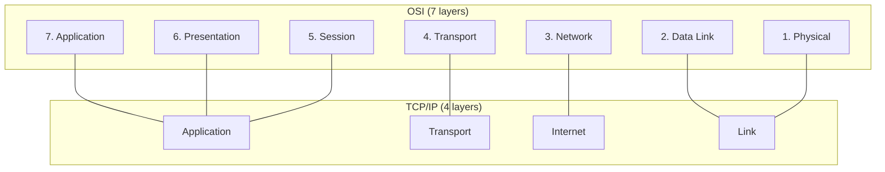
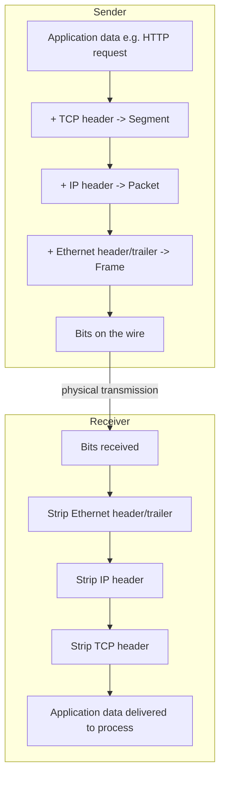

# OSI and TCP/IP Models

_The layer map every later networking topic - IP, DNS, TCP/UDP, HTTP, TLS, load balancers, CDNs - hangs on._

## Contents

- [Why a layered model at all](#why-a-layered-model-at-all)
- [The OSI 7-layer model](#the-osi-7-layer-model)
- [The TCP/IP model](#the-tcpip-model)
- [Mapping OSI onto TCP/IP](#mapping-osi-onto-tcpip)
- [PDUs and addressing at each layer](#pdus-and-addressing-at-each-layer)
- [Encapsulation and decapsulation](#encapsulation-and-decapsulation)
- [Worked example: one HTTP request down and back up the stack](#worked-example-one-http-request-down-and-back-up-the-stack)
- [Where each L1 protocol you will study next lives](#where-each-l1-protocol-you-will-study-next-lives)
- [Points of confusion and trade-offs](#points-of-confusion-and-trade-offs)
- [How this connects onward](#how-this-connects-onward)
- [Check yourself](#check-yourself)
- [Real-world and sources](#real-world-and-sources)

## Why a layered model at all

A network has to solve a huge problem: get an arbitrary chunk of application data from a process on one machine to a process on another machine, possibly on the other side of the planet, over wires, radio, fiber, and dozens of intermediate routers built by different vendors, running different software, on different physical media. No single piece of software could sanely handle "turn light pulses in a fiber into a rendered webpage" as one monolithic step.

**Layering** is the engineering answer: split that giant problem into a stack of smaller, independent problems, where each layer:

- Has **one job** (e.g. "get bits across this one physical link" or "get bytes reliably between two processes").
- Exposes a **simple interface** to the layer above it and consumes a simple interface from the layer below it, hiding its own internal complexity (**abstraction**).
- Can be **implemented, replaced, or evolved independently** of every other layer, as long as its interface stays the same.

This buys three concrete things:

1. **Separation of concerns.** The engineer writing an application (say, a chat app) never thinks about Wi-Fi signal modulation; the person designing a new radio technology never thinks about your app's business logic. Each works within their own layer's contract.
2. **Interoperability.** A packet leaving a Linux server can pass through routers from Cisco, Juniper, and a home Wi-Fi router, and still be understood at the far end, because every hop agrees on the same layer boundaries and header formats - not the same vendor or OS.
3. **Independent evolution.** Wi-Fi replaced Ethernet cables, IPv6 is replacing IPv4, HTTP/1.1 became HTTP/2 became HTTP/3 - each of these changed _one_ layer without requiring the others to change. You can swap the physical medium under an application and the application never notices.

Two models formalize this idea: the **OSI model** (a 7-layer _reference/teaching_ model) and the **TCP/IP model** (a 4-layer _practical_ model that actually describes how the real internet is built). You need both: OSI gives you the precise vocabulary ("Layer 3", "Layer 7 load balancer"); TCP/IP is what is actually implemented in every operating system's network stack.

## The OSI 7-layer model

OSI (**Open Systems Interconnection**) was defined by the ISO in the early 1980s as a vendor-neutral reference for how networked systems _should_ be structured. It was never fully adopted as a literal implementation stack (the internet runs on TCP/IP), but its seven layers are the standard vocabulary the whole industry still uses.

Mnemonic to memorize the order bottom-up: **"Please Do Not Throw Sausage Pizza Away"** (Physical, Data Link, Network, Transport, Session, Presentation, Application).

| #   | Layer            | Job                                                                                                                                                                | PDU (unit of data)                     | Addressing                                | Example protocols                                                                                               |
| --- | ---------------- | ------------------------------------------------------------------------------------------------------------------------------------------------------------------ | -------------------------------------- | ----------------------------------------- | --------------------------------------------------------------------------------------------------------------- |
| 7   | **Application**  | The protocol the actual application speaks - defines the _meaning_ of the message (a page request, a mail command, a name lookup)                                  | Data / Message                         | none (uses ports handed to it from L4)    | HTTP, DNS, SMTP, FTP, SSH                                                                                       |
| 6   | **Presentation** | Translates data between the format an application needs and the format sent on the wire - encoding, serialization, compression, encryption                         | Data                                   | none                                      | TLS (often placed here or spanning 5-6), character encoding (UTF-8), data serialization (JSON/Protobuf framing) |
| 5   | **Session**      | Establishes, manages, and tears down a logical conversation between two applications - tracks "who is talking to whom" across possibly many underlying connections | Data                                   | session identifiers/tokens                | RPC session handling, session establishment in some VoIP/SIP flows, OS socket session state                     |
| 4   | **Transport**    | End-to-end delivery **between processes** on two hosts - reliability, ordering, flow control, and (for UDP) simple delivery                                        | **Segment** (TCP) / **Datagram** (UDP) | **Port number**                           | TCP, UDP                                                                                                        |
| 3   | **Network**      | End-to-end delivery **between hosts** across multiple networks - logical addressing and routing (choosing the path)                                                | **Packet**                             | **IP address**                            | IP (IPv4/IPv6), ICMP, routing protocols (BGP, OSPF)                                                             |
| 2   | **Data Link**    | Delivery **across a single physical link/segment** - framing, error detection, and addressing hosts on the same local network                                      | **Frame**                              | **MAC address**                           | Ethernet, Wi-Fi (802.11), ARP (sits at the boundary of L2/L3)                                                   |
| 1   | **Physical**     | The actual transmission of raw **bits** as electrical signals, light pulses, or radio waves over a physical medium                                                 | **Bit**                                | none (physical signaling, not addressing) | Copper cable (Ethernet PHY), fiber optics, radio (Wi-Fi/5G PHY), connectors/voltages                            |

A useful way to hold these seven in your head: **layers 1-4 move data**, **layers 5-7 are about what the data _means_ and how applications use it**. Everything below Transport cares about _getting bytes somewhere_; everything at Transport and above increasingly cares about _what those bytes are for_.

## The TCP/IP model

The **TCP/IP model** (also called the Internet Protocol Suite) is what the real internet actually runs on, and it predates OSI's formalization. It's typically taught with **4 layers** (sometimes drawn as 5, splitting Link into Physical + Data Link):

| TCP/IP layer              | Job (in one line)                                                                                | Roughly corresponds to OSI               |
| ------------------------- | ------------------------------------------------------------------------------------------------ | ---------------------------------------- |
| **Application**           | The application-level protocol and everything the app cares about: format, semantics, encryption | OSI Application + Presentation + Session |
| **Transport**             | Process-to-process delivery, reliability, ordering                                               | OSI Transport                            |
| **Internet**              | Host-to-host addressing and routing across networks                                              | OSI Network                              |
| **Link** (Network Access) | Delivery across the local physical network                                                       | OSI Data Link + Physical                 |

Why TCP/IP is the one that matters practically: it is the model the actual internet protocols (IP, TCP, UDP, HTTP) were designed against, from the 1970s-80s ARPANET work onward, and it is what every OS's networking stack (the "TCP/IP stack") literally implements as software layers with real code boundaries (e.g. the Linux kernel's `net/ipv4`, socket layer, and NIC drivers). OSI came later as a more granular, vendor-neutral _reference_ for teaching and terminology - it was designed top-down as a standard, and while an OSI protocol stack was built, it never won adoption; TCP/IP won because it was already running, free, and good enough.

**Rule of thumb:** use TCP/IP's 4 layers to understand _how a real stack is built and where code actually lives_; use OSI's 7 layers as the _precise vocabulary_ for talking about any one piece of that stack (e.g., "a Layer 7 load balancer" is unambiguous; "an application-layer load balancer" is the same idea, less precisely pinned to a numbered layer).

## Mapping OSI onto TCP/IP

Notice the squeeze: OSI's top three layers (Application, Presentation, Session) all collapse into **one** TCP/IP Application layer. In practice, real protocols like HTTP just handle framing, encoding, and session-like behavior (cookies, keep-alive) themselves, rather than delegating to distinct Presentation/Session protocols - which is exactly why those two OSI layers feel abstract and rarely get their own named protocols in real systems (more on this below).

## PDUs and addressing at each layer

A **PDU (Protocol Data Unit)** is simply "the named chunk of data at a given layer, including that layer's own header." Naming the PDU correctly is how engineers communicate precisely about where a problem or a device operates.

| Layer (OSI #)                            | PDU name                                | Carries                                      | Addressing used to deliver it                                                 |
| ---------------------------------------- | --------------------------------------- | -------------------------------------------- | ----------------------------------------------------------------------------- |
| Application/Presentation/Session (7/6/5) | **Data** / **Message**                  | The actual payload the app cares about       | none of its own - relies on L4's ports                                        |
| Transport (4)                            | **Segment** (TCP) or **Datagram** (UDP) | Application data + transport header          | **Port number** (identifies _which process_ on the host)                      |
| Network (3)                              | **Packet**                              | A segment/datagram + IP header               | **IP address** (identifies _which host_, and enables routing across networks) |
| Data Link (2)                            | **Frame**                               | A packet + Ethernet/Wi-Fi header and trailer | **MAC address** (identifies _which network interface_ on the local link)      |
| Physical (1)                             | **Bit**                                 | Raw frame as electrical/optical/radio signal | none - this is just the transmission medium                                   |

The three addresses form a clean division of labor worth memorizing cold:

- **MAC address** - burned into (or assigned to) a network interface card; only meaningful **on the local link** (it never survives a router hop; a router replaces the MAC addressing at every hop it forwards through).
- **IP address** - identifies a host globally (or within a private network) and is what routers use to decide the next hop toward the destination; it _does_ survive across the whole path, changing only which link-layer framing wraps it.
- **Port number** - identifies which _process/service_ on that host should receive the data (e.g. port 443 for HTTPS, port 53 for DNS) - this is how one machine can run many networked services simultaneously on one IP address.

## Encapsulation and decapsulation

This is the mechanical heart of the whole topic. When an application sends data, it passes down through the stack, and **each layer wraps the data from the layer above it in its own header** (and, at Layer 2, also a trailer) - this is **encapsulation**. Each layer only understands and manipulates its own header; it treats everything above it as an opaque payload it doesn't need to interpret.

When data arrives at the receiver, the process runs in reverse: each layer strips off its own header, reads the field that tells it "hand this up to _this_ next layer" (e.g., the IP header's protocol field says "the payload is TCP"; the TCP header's port field says "this belongs to process X"), and passes the remaining payload upward. This is **decapsulation**.

Every intermediate device only looks as deep into this stack as it needs to do its job - this is _why_ the layering buys interoperability: a switch only reads L2, a router only reads up to L3, and only the two true endpoints ever fully decapsulate all the way to L7.

## Worked example: one HTTP request down and back up the stack

A browser sends `GET /feed` to a server. Trace exactly what is added at each hop, layer by layer, on the way down at the client, and stripped away on the way up at the server.

**Sender side (client), top to bottom:**

1. **Application (L7):** the browser builds the HTTP request text/bytes: `GET /feed HTTP/1.1\r\nHost: app.example.com\r\n...`. This is the raw application **Data**.
2. **Transport (L4):** the OS wraps that data in a **TCP header** containing the source port (an ephemeral port the OS picked, e.g. `54321`) and destination port (`443` for HTTPS), plus sequence numbers and flags for reliability. Result: a **TCP segment**.
3. **Network (L3):** the OS wraps the segment in an **IP header** containing the source IP (the client's own address) and destination IP (the server's address, already resolved via DNS). Result: an **IP packet**.
4. **Data Link (L2):** the network interface wraps the packet in an **Ethernet (or Wi-Fi) header** containing the source MAC (the client NIC's address) and destination MAC - which is **not** the server's MAC, but the local router's MAC, since the destination is off-link (this is exactly what "the default gateway" is for). A trailer (checksum) is appended. Result: an **Ethernet frame**.
5. **Physical (L1):** the NIC converts the frame into electrical signals, light pulses, or radio waves and puts them on the wire/air. Result: **bits**.

At every router along the path, the packet is **decapsulated up to L3 only**: the router strips the incoming frame, reads the destination IP in the packet, consults its routing table, and **re-encapsulates** the same packet in a **brand-new L2 frame** addressed to the next hop's MAC - the IP packet (and everything inside it) is untouched; only the Ethernet framing around it is swapped at every hop. This is precisely why MAC addresses are "local-link only" and IP addresses are "end-to-end."

**Receiver side (server), bottom to top - the exact mirror:**

1. **Physical (L1):** the server's NIC receives the bits and reconstructs the frame.
2. **Data Link (L2):** the NIC checks the destination MAC matches itself, verifies the trailer's checksum, strips the Ethernet header/trailer, and hands the packet up.
3. **Network (L3):** the OS checks the destination IP matches itself, strips the IP header, sees the protocol field says "TCP", and hands the segment up.
4. **Transport (L4):** the OS strips the TCP header, uses the destination port (`443`) to find the right listening process/socket (the web server), reassembles bytes in order, and hands the payload up.
5. **Application (L7):** the web server process reads `GET /feed HTTP/1.1...` as HTTP, parses it, and starts building a response - which then goes right back down through the same five steps in reverse to travel home.

**Overhead this adds, concretely:** each layer's header costs real bytes before a single byte of your actual HTTP payload is sent - roughly ~14 bytes Ethernet header + ~20 bytes IPv4 header + ~20 bytes TCP header (more with options) ≈ **~54+ bytes of pure overhead per segment**, which is why very small, chatty payloads (like tiny API calls) are proportionally expensive, and why batching/compression matters more as payloads shrink.

## Where each L1 protocol you will study next lives

Placing every upcoming protocol on this map now, before you learn its internals, is the entire payoff of this topic:

| Protocol/topic (coming up in L1)          | OSI layer                                                          | TCP/IP layer                                       | PDU it operates on                             |
| ----------------------------------------- | ------------------------------------------------------------------ | -------------------------------------------------- | ---------------------------------------------- |
| Ethernet, ARP                             | Data Link (2) - ARP straddles 2/3                                  | Link                                               | Frame                                          |
| IP (IPv4/IPv6), subnets, NAT, anycast/BGP | Network (3)                                                        | Internet                                           | Packet                                         |
| TCP, UDP                                  | Transport (4)                                                      | Transport                                          | Segment/Datagram                               |
| TLS (handshake, encryption)               | Presentation (6), sometimes described as sitting "between 4 and 7" | Application (in practice)                          | Data (wraps app data before TCP)               |
| DNS                                       | Application (7)                                                    | Application                                        | Data (usually carried over UDP, sometimes TCP) |
| HTTP/1.1, HTTP/2, HTTP/3 (QUIC)           | Application (7) - HTTP/3's QUIC also absorbs transport-like duties | Application (HTTP) / Transport-ish (QUIC over UDP) | Data                                           |
| WebSockets, SSE, long-polling             | Application (7)                                                    | Application                                        | Data                                           |
| Load balancers: "L4" vs "L7"              | Named directly after Transport (4) vs Application (7)              | -                                                  | Segment (L4 LB) vs Data (L7 LB)                |
| Reverse proxies, API gateways, CDNs       | Application (7) (they inspect HTTP)                                | Application                                        | Data                                           |

This is also the direct answer to _why_ the industry says "**Layer 4 load balancer**" vs "**Layer 7 load balancer**": an L4 balancer only reads as far as the TCP/UDP header (IP + port) to decide where to send a packet - fast, protocol-agnostic, cannot see the HTTP path. An L7 balancer fully decapsulates up to the HTTP request to route based on path, headers, or cookies - slower per-request but far more flexible. That vocabulary is a direct, literal borrow from the OSI numbering you just learned. (Full mechanics of this trade-off are covered in the dedicated load-balancer topic.)

## Points of confusion and trade-offs

- **Why two models, not one?** OSI is a **reference/teaching model**: precise, layer-complete, designed top-down as an international standard, and used industry-wide as shared vocabulary ("that's a Layer 2 problem"). TCP/IP is the **implementation model**: looser, only 4 layers, but it's what every real device on the internet actually runs. You think in TCP/IP's layers when reading a stack trace or a packet capture; you speak in OSI's layer numbers when discussing devices and problems with other engineers.
- **Where does TLS really live?** TLS encrypts application data before it's handed to TCP, which conceptually matches OSI's Presentation layer (it transforms data's _format_, not its meaning) - but TLS is implemented as a library called by the application (or terminated by a proxy/load balancer), not as a separate OS-level layer the way TCP is. In the TCP/IP model it's simplest to just say TLS lives "at the top of Transport / bottom of Application," which is why you'll see it drawn inconsistently across textbooks. `verify: exact placement varies by source; treat "Presentation-ish, implemented at the application layer" as the practical answer.`
- **Session and Presentation feel like "missing" layers in practice.** That's accurate - very few real-world protocols are named "the session protocol" or "the presentation protocol." Their responsibilities (session tracking → cookies, connection keep-alive, WebSocket upgrade state; presentation → TLS encryption, JSON/Protobuf serialization, character encoding) were absorbed directly into application protocols and libraries rather than standardized as separate wire protocols. This is a real historical outcome, not a simplification you can skip - it's _why_ OSI is taught as 7 layers but real systems are described in TCP/IP's 4.
- **A device's "layer" tells you what it can see and change.** A plain network switch only reads L2 (MAC) and cannot see IP addresses. A router reads up to L3 (IP) and cannot see ports or HTTP paths (it doesn't need to - that's the point of the abstraction). A firewall can operate at L3/L4 (IP/port filtering) or at L7 ("next-gen"/application firewalls inspecting HTTP). Once you know a device's layer, you instantly know the ceiling of what it's capable of routing/filtering on.
- **Layering has a real performance cost, not just a conceptual one.** Every layer's header is bytes you pay on every packet (see the ~54+ byte overhead above), and every layer's processing is CPU cycles per packet. This is a genuine trade-off: layering buys modularity and interoperability at the price of per-packet overhead - which is part of why protocols like QUIC (HTTP/3) deliberately blur the Transport/Application boundary to cut overhead and head-of-line blocking, a design choice you'll meet properly in the HTTP evolution topic.

## How this connects onward

- **IP, subnetting, NAT, anycast/BGP** - deepen Layer 3/Internet, the "packet + IP address" row above.
- **TCP vs UDP (handshake, flow/congestion control)** - deepen Layer 4/Transport, the "segment/datagram + port" row above.
- **DNS** - an Application-layer protocol that resolves the names used to fill in the IP addresses this topic assumed were already known.
- **HTTP/1.1, HTTP/2, HTTP/3 (QUIC), TLS handshake, WebSockets/SSE** - all Application-layer (with QUIC blurring into Transport), building directly on the TCP/UDP segment this topic showed being carried inside an IP packet.
- **Load balancers (L4 vs L7), reverse proxies, API gateways, CDNs** - the "L4 vs L7" terminology and the "how deep can this device look" mental model both come straight from this topic's layer table.
- **Request lifecycle (L0)** - you already walked a request through hops like DNS, TCP/TLS handshake, and the LB; this topic supplies the missing internal mechanics - _what actually happens inside_ the "connection setup" and "the request travels" hops.

## Check yourself

- Name the three reasons layering exists, and give one concrete example of "independent evolution" from real internet history (e.g., a physical medium or a transport protocol changing without the layers above it changing).
- A router receives a frame, decides where to forward it, and sends it out. Which headers does it read, which does it strip, and which brand-new header does it construct before retransmitting? Why does the MAC address change at every hop while the IP address does not?
- Fill in the blank for each: a switch operates at Layer **, a router at Layer **, a plain TCP/UDP load balancer at Layer **, and an HTTP-aware reverse proxy at Layer **.
- Why do OSI's Session and Presentation layers rarely correspond to any named real-world protocol, while Application, Transport, Network, and Data Link all have obvious, ubiquitous ones?
- A tiny 40-byte API payload is sent over TCP/IP/Ethernet. Roughly how many bytes of pure header overhead ride alongside it, and why does this matter more for small, chatty requests than for large file transfers?

## Real-world and sources

- ISO/IEC 7498-1 - the original OSI Basic Reference Model standard.
- IETF RFC 1122 / RFC 1123 - "Requirements for Internet Hosts," the closest thing to an official definition of the TCP/IP (Internet Protocol Suite) layering as actually implemented.
- IETF RFC 791 (IPv4), RFC 793 (TCP), RFC 768 (UDP) - the foundational protocol specs referenced throughout the layer table above; deep-dived in their own upcoming L1 topics.
- Standard networking references (e.g., Kurose & Ross, _Computer Networking: A Top-Down Approach_; Stevens, _TCP/IP Illustrated_) are the canonical textbook treatments of this exact layering discussion, `verify` edition-specific details if quoting directly.
