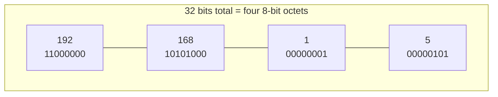
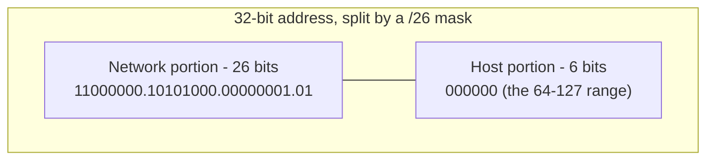
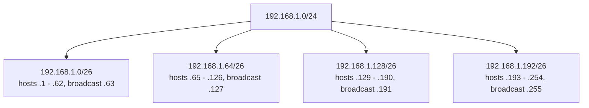

# IP Addressing and Subnets

*How every host on a Layer 3 network gets a name that a router can act on, and how one big address block gets carved into smaller ones.*

## Contents
- [What an IP address actually is](#what-an-ip-address-actually-is)
- [IPv4: 32 bits, dotted decimal, and why it ran out](#ipv4-32-bits-dotted-decimal-and-why-it-ran-out)
- [Classful addressing and why it was abandoned](#classful-addressing-and-why-it-was-abandoned)
- [CIDR notation](#cidr-notation)
- [Subnet masks and the network/host split](#subnet-masks-and-the-networkhost-split)
- [Network address, broadcast address, usable hosts](#network-address-broadcast-address-usable-hosts)
- [Worked example: subnetting 192.168.1.0/24](#worked-example-subnetting-1921681024)
- [Private vs public IP ranges](#private-vs-public-ip-ranges)
- [Loopback and link-local addresses](#loopback-and-link-local-addresses)
- [IPv6: 128 bits and why it exists](#ipv6-128-bits-and-why-it-exists)
- [How addressing connects to routing](#how-addressing-connects-to-routing)
- [Diagram: address split and subnet breakdown](#diagram-address-split-and-subnet-breakdown)
- [Trade-offs and common confusions](#trade-offs-and-common-confusions)
- [How this connects onward](#how-this-connects-onward)
- [Check yourself](#check-yourself)
- [Real-world and sources](#real-world-and-sources)

## What an IP address actually is

An **IP address** is the Layer 3 (Network layer) identifier assigned to a network interface, used so that routers can figure out *where* to forward a packet and so the destination host can be uniquely identified across many interconnected networks. It answers a different question than a MAC address: a MAC address says "which physical interface on this local link" (flat, non-hierarchical, changes meaning nowhere); an IP address says "which host, on which network" (hierarchical, and that hierarchy is exactly what makes internet-scale routing possible at all — see [How this connects onward](#how-this-connects-onward) for the L1-topic-1 recap).

Every IP address is conceptually split into two parts:

- **Network portion** — identifies *which network* the host belongs to. All hosts on the same physical/logical network segment share this portion.
- **Host portion** — identifies *which specific host* within that network.

This is the single most important idea in this entire topic: **an IP address alone means nothing without knowing where the network/host boundary falls.** The same 32 bits, `192.168.1.5`, could mean "host 5 of a /24 network" or "host 1.5... of a /16 network" depending on the mask. The mask (or prefix length) is not optional metadata — it is half of the address's meaning.

## IPv4: 32 bits, dotted decimal, and why it ran out

**IPv4** addresses are **32 bits** long, giving a theoretical address space of 2^32 = **4,294,967,296** (~4.3 billion) unique addresses. For human readability, those 32 bits are split into four 8-bit groups (**octets**), each written as a decimal number 0-255, separated by dots — **dotted-decimal notation**, e.g. `192.168.1.5`.



**Why 4.3 billion ran out:** IPv4 was designed in the late 1970s (RFC 791, 1981) when nobody anticipated billions of individually-networked devices — phones, IoT sensors, every server behind every startup. Address allocation was also historically wasteful (see [classful addressing](#classful-addressing-and-why-it-was-abandoned) below: early allocations handed out huge blocks to single organizations regardless of actual need). IANA allocated the last free top-level IPv4 blocks to regional registries in **2011**; most registries have since exhausted their pools. Three things absorbed the pressure without needing to replace IPv4 network-wide overnight: **CIDR** (allocate exactly the block size needed, not oversized fixed classes), **NAT** (many private hosts share one public address — its own upcoming topic), and the slow, ongoing rollout of **IPv6** (a fundamentally larger address space, covered below).

## Classful addressing and why it was abandoned

Before CIDR, IPv4 addresses were divided into fixed **classes**, identified by the leading bits of the address, each with a *fixed* network/host split:

| Class | Leading bits | First octet range | Default mask | Network bits | Host bits | Usable hosts per network |
|---|---|---|---|---|---|---|
| A | `0` | 1-126 | `/8` (255.0.0.0) | 8 | 24 | ~16.7 million |
| B | `10` | 128-191 | `/16` (255.255.0.0) | 16 | 16 | ~65,534 |
| C | `110` | 192-223 | `/24` (255.255.255.0) | 24 | 8 | 254 |
| D | `1110` | 224-239 | (multicast, not host addressing) | - | - | - |
| E | `1111` | 240-255 | (reserved/experimental) | - | - | - |

The problem: real organizations rarely need exactly 254, 65,534, or 16.7 million hosts. A company with 2,000 employees needed a Class B (wasting ~63,000 addresses) because a Class C's 254 wasn't enough — there was no size in between. This rigidity burned through allocatable IPv4 space far faster than actual demand justified, and it's a direct, concrete cause of the exhaustion problem above.

**CIDR (Classless Inter-Domain Routing, RFC 4632, 1993)** replaced classful addressing by decoupling the network/host boundary from the leading bits entirely — any prefix length from /1 to /32 is legal, so a block can be sized to actual need (e.g. a /22 for ~1,000 hosts). This is also why the terms "Class A/B/C" are legacy vocabulary today — the classes no longer determine anything; only the explicit prefix length (or mask) does. CIDR simultaneously solved a second problem: **route aggregation** — an ISP can advertise one `/16` covering many customer `/24`s as a single routing-table entry instead of thousands, keeping backbone routing tables from growing unmanageably (this is the same mechanism behind [longest-prefix-match routing](#how-addressing-connects-to-routing) below).

## CIDR notation

**CIDR notation** writes an address block as `address/prefix-length`, e.g. `10.0.0.0/24`. The number after the slash is the count of leading bits that make up the **network portion** — everything after those bits is host portion.

- `10.0.0.0/8` — first 8 bits are network, 24 bits are host → a huge block (~16.7M addresses).
- `10.0.0.0/24` — first 24 bits are network, 8 bits are host → a small block (256 addresses).
- **Larger prefix number = smaller network** (more bits spent identifying the network means fewer bits left to identify hosts within it). This trips up almost everyone at first: `/8` is a *bigger* block than `/24`.

CIDR notation is used everywhere you'll encounter IP ranges in practice: cloud VPC/subnet definitions (AWS VPC `10.0.0.0/16` split into subnets), firewall rules, BGP route advertisements, and `ip route` / `ifconfig` output.

## Subnet masks and the network/host split

A **subnet mask** is the older, equivalent way of expressing the same network/host boundary as a prefix length, written as a full 32-bit dotted-decimal value where the network bits are all `1` and the host bits are all `0`. `/24` and `255.255.255.0` mean exactly the same thing:

```
/24 prefix length  =  255.255.255.0  =  11111111.11111111.11111111.00000000
```

**The mechanism: bitwise AND.** To find which network an address belongs to, you AND the address with the mask bit-by-bit. Every bit position where the mask is `1` keeps the address's bit; every position where the mask is `0` becomes `0`.

```
  Address: 192.168.1.  200   = 11000000.10101000.00000001.11001000
  Mask (/24): 255.255.255.0  = 11111111.11111111.11111111.00000000
  AND:                       = 11000000.10101000.00000001.00000000
  Network address:           = 192.168.1.0
```

This single operation — `address AND mask = network address` — is what every router, host, and switch does internally to answer "does this destination live on my local network, or do I need to route/forward it elsewhere?" It's cheap (a handful of CPU cycles) and it's why subnet math is expressed in binary, not decimal — decimal is just the human-readable veneer.

## Network address, broadcast address, usable hosts

Within any block, two addresses are **reserved and cannot be assigned to a host**:

- **Network address** — all host bits set to `0`. Identifies the subnet itself (e.g. `192.168.1.0` for a /24). Never assigned to a device; it's the "name" of the network.
- **Broadcast address** — all host bits set to `1`. A special address that means "every host on this subnet" (e.g. `192.168.1.255` for a /24). Sending to it delivers to all hosts on the local segment.

Everything in between is the **usable host range**. With `h` host bits, the total addresses in the block are `2^h`, and the **usable host count** is:

```
usable hosts = 2^h - 2        (subtract network address and broadcast address)
```

This "minus 2" is the single most common gotcha in subnetting arithmetic — engineers reflexively compute `2^h` and forget the two reserved addresses, then get surprised when a /24 (256 addresses) only fits 254 actual hosts. (Two edge cases worth knowing exist and are commonly flagged `verify` in intro material: a /31 has no usable range under the classic rule and is a special case defined by RFC 3021 for point-to-point links using both addresses; a /32 is a single host route with no network/broadcast concept at all. Neither is typical subnetting and both are safely treated as edge cases at this stage.)

## Worked example: subnetting 192.168.1.0/24

This is the core mechanical skill of the topic. Start with the private block `192.168.1.0/24` (256 total addresses, mask `255.255.255.0`), and suppose you need to split it into **4 equal subnets** — for example, four separate teams/services on a shared internal network, each needing its own broadcast domain.

**Step 1 - decide how many extra bits you need.** To carve one /24 into 4 equal pieces, you need 4 = 2^2 subnets, so you must **borrow 2 bits** from the host portion for the network portion. New prefix length: `/24 + 2 = /26`.

**Step 2 - work out the new block size.** A /26 leaves `32 - 26 = 6` host bits, so each subnet has `2^6 = 64` total addresses (`2^6 - 2 = 62` usable hosts).

**Step 3 - enumerate the subnets.** Each subnet's block size is 64, so network addresses step by 64 in the last octet:

| Subnet | CIDR | Network address | First usable host | Last usable host | Broadcast address | Usable hosts |
|---|---|---|---|---|---|---|
| 1 | 192.168.1.0/26 | 192.168.1.0 | 192.168.1.1 | 192.168.1.62 | 192.168.1.63 | 62 |
| 2 | 192.168.1.64/26 | 192.168.1.64 | 192.168.1.65 | 192.168.1.126 | 192.168.1.127 | 62 |
| 3 | 192.168.1.128/26 | 192.168.1.128 | 192.168.1.129 | 192.168.1.190 | 192.168.1.191 | 62 |
| 4 | 192.168.1.192/26 | 192.168.1.192 | 192.168.1.193 | 192.168.1.254 | 192.168.1.255 | 62 |

**Verifying subnet 2 at the bit level**, to show *why* the boundary lands at `.64`:

```
Mask (/26):     255.255.255.192  = 11111111.11111111.11111111.11000000
Network #2:     192.168.1.64     = 11000000.10101000.00000001.01000000
                                                                ^^ these 2 bits are the "subnet" bits (01 = subnet 2)
                                                                  ^^^^^^ remaining 6 bits = host portion (000000 to 111111)
Broadcast #2:   192.168.1.127    = 11000000.10101000.00000001.01111111  (host bits all 1)
```

The 2 bits you borrowed (the leftmost bits of the last octet) enumerate 00, 01, 10, 11 → 4 subnets, each owning the 6 remaining bits (000000-111111 = 64 values) as its own host range.

**Same logic scales in either direction.** Need 8 subnets instead of 4 from the same /24? Borrow 3 bits → /27 → 32 addresses per subnet (30 usable), 8 subnets stepping by 32. Need only 2 much bigger subnets? Borrow 1 bit → /25 → 128 addresses per subnet (126 usable), 2 subnets: `192.168.1.0/25` and `192.168.1.128/25`. The pattern is always: **each bit borrowed doubles the subnet count and halves the size of each subnet.**

## Private vs public IP ranges

**RFC 1918** reserves three blocks of IPv4 address space for **private use** — addresses that are not globally routable on the public internet and can be reused independently, without conflict, inside any number of separate private networks (your home network and your neighbor's can both use `192.168.1.1` because neither is ever routed on the public internet):

| Block | CIDR | Size | Typical use |
|---|---|---|---|
| Class A private | `10.0.0.0/8` | ~16.7M addresses | Large internal networks (enterprises, cloud VPCs) |
| Class B private | `172.16.0.0/12` | ~1.05M addresses | Medium networks, common in Docker's default bridge range |
| Class C private | `192.168.0.0/16` | ~65K addresses | Home/small office networks (most consumer routers default here) |

**Why private ranges exist:** they let organizations run arbitrarily large internal networks — every laptop, server, printer, container — without consuming any of the scarce public IPv4 space, since internal traffic never needs a globally unique address; it only needs uniqueness *within that private network*. A public IP is only required at the boundary where the network actually talks to the internet.

**Forward reference to NAT:** a private network's hosts still need to reach the public internet (e.g. a laptop on `192.168.1.5` fetching a webpage). **NAT (Network Address Translation)**, an upcoming L1 topic, is the mechanism that rewrites a private source address to a shared public address at the network's edge (typically your router or a cloud NAT gateway) so replies can find their way back — it is the direct reason private addressing is viable at all despite the public internet needing globally unique addresses to route by. Hold that thought; NAT's own topic covers the mechanics (port translation, connection tracking) in depth.

## Loopback and link-local addresses

Two more reserved ranges worth knowing cold, because they show up constantly in debugging:

- **Loopback: `127.0.0.0/8`** (almost always seen as `127.0.0.1`, aka "localhost") — always refers to the local host itself; a packet sent here never touches a physical NIC or leaves the machine. Used to test that a machine's own network stack and locally-running services work, independent of any actual network.
- **Link-local: `169.254.0.0/16`** — self-assigned by a host when it expects to get an address via DHCP but no DHCP server responds (defined by **APIPA**, Automatic Private IP Addressing). Seeing a `169.254.x.x` address on a device is a reliable diagnostic signal that DHCP failed — the host gave itself a fallback address so it can at least talk to other similarly-stranded hosts on the same local link, but it has no real network/internet connectivity.

## IPv6: 128 bits and why it exists

**IPv6** (RFC 8200) addresses are **128 bits** long — an address space of 2^128, which is roughly 340 undecillion (3.4 x 10^38) addresses, i.e. enough to assign a vast number of addresses to every grain of sand on Earth, several times over. It exists for one overriding reason: **IPv4 exhaustion** — the internet permanently outgrew 4.3 billion addresses, and unlike CIDR or NAT (which are workarounds that stretch IPv4 further), IPv6 is the actual long-term fix: a space large enough that exhaustion is not a practical concern for the foreseeable future.

**Notation:** written as eight groups of four hex digits, separated by colons, e.g. `2001:0db8:85a3:0000:0000:8a2e:0370:7334`. Two shorthand rules keep this readable:

- Leading zeros in each group can be dropped: `0db8` → `db8`.
- **One** run of consecutive all-zero groups can be compressed to `::` (only once per address, since otherwise the compression would be ambiguous about how many zero groups it represents): `2001:db8:85a3:0000:0000:8a2e:370:7334` → `2001:db8:85a3::8a2e:370:7334`.

IPv6 keeps the same network/host split concept as IPv4, expressed with the same CIDR-style prefix length, e.g. `2001:db8::/32` — but the default host portion is typically a full 64 bits (a `/64` subnet), reflecting how much less scarce host addresses are.

**Why IPv6 largely eliminates the need for NAT:** because every device can get its own genuinely globally-unique public address, there's no scarcity forcing many private hosts to share one public IP through translation. IPv6 still supports private/local addressing concepts (**unique local addresses**, `fc00::/7`) for organizations that want them, but NAT's original *raison d'être* — stretching a scarce public IPv4 pool — mostly disappears. `verify: some deployments still use NAT66/firewalling patterns for other reasons (e.g. address-hiding policy), but scarcity is not one of them under IPv6.`

Proportionate takeaway for this level: know *that* IPv6 exists, *why* it exists (address exhaustion), the notation basics (hex, `::` compression), and that it changes the NAT calculus — deep IPv6-specific mechanics (SLAAC, extension headers, dual-stack transition mechanisms) are beyond what this foundational pass needs.

## How addressing connects to routing

Two everyday behaviors depend directly on everything above:

1. **"Is the destination on my own subnet, or do I need the gateway?"** Every host, before sending a packet, ANDs the *destination* address with its *own* subnet mask and compares the result to its own network address. Same network address → the destination is on-link, and the host can deliver directly (after resolving the destination's MAC via ARP). Different network address → the host cannot reach it directly and instead sends the packet to its **default gateway** (a router), which figures out the next hop. This single comparison is why misconfigured subnet masks are such a classic outage cause — a host that miscalculates "is this local?" either floods ARP requests for unreachable off-link hosts or fails to use its gateway for a host that actually needed it.
2. **How routers actually pick a next hop: longest prefix match.** A router's routing table holds many CIDR blocks (e.g. one entry for `10.0.0.0/8`, and a more specific entry for `10.1.2.0/24`). When a packet arrives, the router doesn't pick the first match — it picks the entry with the **longest (most specific) matching prefix**, because a more specific block always represents more precise knowledge of where that traffic should go. This is the mechanism that lets CIDR's route aggregation (mentioned above) coexist with precise, specific overrides, and it's the exact algorithm you'll see again, made globally distributed, in the upcoming **Anycast/BGP** topic — BGP is essentially "longest prefix match, negotiated between autonomous systems across the entire internet."

## Diagram: address split and subnet breakdown



Mask (/26): `11111111.11111111.11111111.11000000` = `255.255.255.192`

Subnetting `192.168.1.0/24` into four /26 blocks:



## Trade-offs and common confusions

| Point | Why it matters |
|---|---|
| **/24 is the "default" people reach for** | 254 usable hosts is a comfortable size for a single LAN segment/subnet and maps cleanly onto a whole last octet, which is easy for humans to read and calculate by hand — convention and cognitive ease, not a technical requirement. |
| **Subnet sizing is a real trade-off, not a solved problem** | Too large (e.g. a /16 for a 20-host office) wastes address space and enlarges the broadcast domain unnecessarily (more broadcast traffic every host must process). Too small (e.g. a /28 for a team that will grow to 40 people) means running out and having to **re-subnet or re-IP** later, which is disruptive. Cloud VPC design deliberately over-provisions subnet CIDR blocks up front for exactly this reason. |
| **Bigger prefix number = smaller network** | Counter-intuitive on first exposure: /8 is huge, /30 is tiny (4 addresses, 2 usable — just enough for a point-to-point link). Internalizing this early prevents constant re-derivation. |
| **"2^h - 2" gotcha** | Forgetting to subtract the network and broadcast addresses is the single most common subnetting arithmetic mistake; always subtract 2 for usable host count on any subnet /30 or larger. |
| **Private vs public is a routability property, not a security boundary by itself** | RFC 1918 addresses aren't inherently "safe" — they're simply unroutable on the public internet. Real security still requires firewalls/ACLs; NAT's address-hiding is a side effect, not a substitute for security controls (that nuance belongs to the security track). |
| **CIDR vs classful is a legacy-vocabulary trap** | You'll still hear "Class C network" informally to mean "a /24-ish block," but no modern router or protocol actually enforces class boundaries — always trust the explicit prefix/mask over the classful-sounding language. |

> [!IMPORTANT]
> An IP address only has meaning together with its mask/prefix length. Subnetting is just deciding, in bits, where the network ends and the host begins — every other computation (network address, broadcast, usable range, "is this local") falls out of that one boundary via a simple bitwise AND.

## How this connects onward

- **DNS** (next L1 topic) resolves human-readable names to exactly the IP addresses this topic just explained — DNS's whole job is filling in the address this topic assumed was already known.
- **NAT** depends entirely on the private/public split covered here — it's the mechanism that lets private (RFC 1918) hosts share a public address to reach the internet.
- **Anycast/BGP** generalizes the longest-prefix-match routing decision covered above to a globally distributed scale, where the same anycast IP can be announced from many physical locations.
- **Load balancers** operate on top of these addresses (and the ports layered on top of them, per L1 topic 1) to distribute traffic across a pool of backend IPs.
- **CDNs** rely on IP-address-level routing (often anycast) to direct a client to the nearest edge location.

## Check yourself

- Given `172.16.5.130/27`, compute the network address, broadcast address, and usable host range. (Hint: /27 leaves 5 host bits → block size 32; find which multiple-of-32 boundary `130` falls into.)
- Why is `10.0.0.0/8` a *bigger* block than `10.0.0.0/24`, even though 24 > 8?
- A host at `192.168.1.10/24` wants to reach `192.168.1.200`. Does it ARP for the destination directly or send to its default gateway? What if the destination were `192.168.2.50` instead?
- Why did classful addressing (Class A/B/C) waste so much IPv4 space, and what specifically did CIDR change to fix it?
- Name the three RFC 1918 private ranges and explain, in one sentence, why the same private range can be reused by millions of unrelated networks without conflict.

## Real-world and sources

- IETF RFC 791 — the original IPv4 specification.
- IETF RFC 1918 — "Address Allocation for Private Internets," defining the 10.0.0.0/8, 172.16.0.0/12, and 192.168.0.0/16 private ranges.
- IETF RFC 4632 — "Classless Inter-domain Routing (CIDR): The Internet Address Assignment and Aggregation Plan."
- IETF RFC 8200 — the IPv6 specification.
- IETF RFC 3021 — use of /31 prefixes on point-to-point links (edge case noted above).
- Standard networking references (Kurose & Ross, *Computer Networking: A Top-Down Approach*; Stevens, *TCP/IP Illustrated*) cover subnetting arithmetic and classful-history context in more exhaustive detail; `verify` edition-specific numbers if quoting directly.
