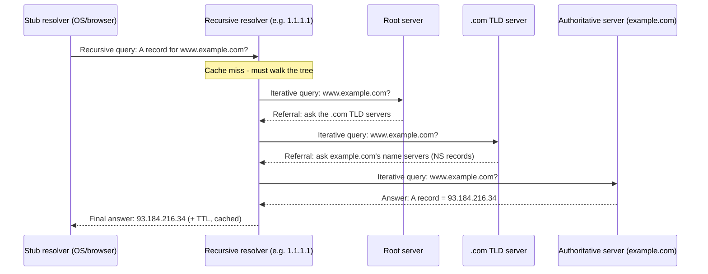

# DNS Deep: Resolution, Records, GeoDNS, Caching

*How a name like `www.example.com` becomes the IP address the previous topic taught you to route by — the very first thing that happens before almost any request on the internet.*

## Contents
- [What DNS is and why it exists](#what-dns-is-and-why-it-exists)
- [Where DNS sits on the stack](#where-dns-sits-on-the-stack)
- [The namespace and hierarchy](#the-namespace-and-hierarchy)
- [The resolution flow: recursive and iterative queries](#the-resolution-flow-recursive-and-iterative-queries)
- [Diagram: resolving www.example.com](#diagram-resolving-wwwexamplecom)
- [Record types](#record-types)
- [Caching and TTL](#caching-and-ttl)
- [GeoDNS and location-based answers](#geodns-and-location-based-answers)
- [DNS-based load balancing and traffic management](#dns-based-load-balancing-and-traffic-management)
- [Reliability and security notes](#reliability-and-security-notes)
- [Trade-offs and common confusions](#trade-offs-and-common-confusions)
- [How this connects onward](#how-this-connects-onward)
- [Check yourself](#check-yourself)
- [Real-world and sources](#real-world-and-sources)

## What DNS is and why it exists

**DNS (Domain Name System)** is a global, hierarchical, distributed, and heavily cached database that maps human-friendly names (`www.example.com`) to the machine-usable identifiers a network actually routes by — most commonly IPv4/IPv6 addresses, but also mail servers, service locations, and arbitrary text data (see [Record types](#record-types)).

**Why it exists:** the previous L1 topic established that every host is reached by an IP address, and that an address alone means nothing without its mask. But IP addresses are terrible for humans — `93.184.216.34` (or its IPv6 equivalent) is not memorable, is not stable if a company migrates infrastructure, and reveals nothing about intent. DNS exists to decouple the *name* a human or application uses from the *address* a network uses, so that:

- Names can stay constant while the underlying IP changes (server migration, failover, cloud provider switch) — you only update a DNS record, not every client.
- One name can map to many IPs (load distribution) or different IPs for different askers (see [GeoDNS](#geodns-and-location-based-answers)).
- The mapping problem is solved **once, centrally, per name**, instead of every application hardcoding addresses.

DNS is often called "the phonebook of the internet," but the more precise framing for this level is: **it is a globally distributed key-value lookup system, organized as a tree, where authority over each branch is delegated outward, and every layer aggressively caches answers.** All three of those properties (hierarchical, distributed/delegated, cached) reappear throughout the rest of this topic and are worth holding onto as you read.

## Where DNS sits on the stack

Referencing L1 topic 1's layered model: DNS is an **application-layer protocol** (like HTTP), but it is a piece of *infrastructure* that almost every other application-layer protocol depends on before it can even open a connection — a browser resolves a hostname to an IP before it can complete the TCP handshake (upcoming topic) to talk HTTP to it.

- **Transport:** DNS classically runs on **port 53**, primarily over **UDP** — a single query/response pair is small, and UDP's lack of handshake overhead (forward-ref TCP vs UDP topic) keeps resolution fast, which matters because DNS sits on the critical path of nearly every request. DNS falls back to **TCP** when a response is too large for a single UDP datagram (historically >512 bytes, extended by EDNS0) or for **zone transfers** between authoritative servers (bulk data, needs TCP's reliability).
- **Newer transports (forward reference):** because plain UDP/TCP DNS is unencrypted and visible to any on-path observer, two newer variants wrap DNS in an encrypted channel: **DoT (DNS over TLS)**, which runs DNS inside a dedicated TLS-encrypted connection (typically port 853), and **DoH (DNS over HTTPS)**, which tunnels DNS queries inside ordinary HTTPS traffic (port 443), making DNS lookups indistinguishable from other HTTPS traffic on the wire. Both address *confidentiality* of the query itself; neither is required to understand core resolution mechanics, so treat them as a forward reference to the TLS/HTTPS topics.

## The namespace and hierarchy

DNS names form an inverted tree, read right-to-left in terms of authority:

```
                    "." (root)
                   /    |    \
               .com   .org   .uk (ccTLD)
                /
          example.com          <- second-level domain (registered by an org)
           /        \
        www.example.com   api.example.com   <- subdomains
```

- **Root ("."):** the top of the tree. Every fully-qualified domain name technically ends with a trailing dot representing the root — `www.example.com.` — which is almost always omitted in everyday use but is what a resolver actually queries against internally. The root zone is served by **13 named root server letters (a.root-servers.net through m.root-servers.net)**; each letter is not a single physical machine but is served from many physical/anycast locations worldwide (forward-ref Anycast/BGP topic — this is one of the canonical uses of anycast).
- **TLD (Top-Level Domain):** the next level down — generic TLDs (`.com`, `.org`, `.net`), and **ccTLDs** (country-code TLDs like `.uk`, `.jp`). Each TLD is operated by a registry responsible for that zone.
- **Second-level domain:** the part an organization actually registers, e.g. `example` in `example.com`. This is the unit most people mean colloquially by "a domain name."
- **Subdomain:** any name prepended to a registered domain (`www.example.com`, `api.example.com`, `staging.api.example.com`) — subdomains can nest arbitrarily and each level can, in principle, be delegated to a different authority.
- **Zone and delegation:** a **zone** is a distinct, administratively-controlled chunk of the namespace that one authority is responsible for — it is not the same thing as a "domain" in casual speech; `example.com` might be one zone, or the owner might delegate `api.example.com` out as its own separate zone to a different provider. Delegation happens via **NS (Name Server) records**: the `.com` zone doesn't know the IP for `www.example.com` — it only knows *which name servers are authoritative for `example.com`*, and hands the question off to them. This delegation chain (root delegates TLD, TLD delegates the registered domain, the domain owner can further delegate subdomains) is what makes DNS administratively distributed: no single organization runs the whole tree, each zone owner only needs to manage their own slice and point to the next one down.

## The resolution flow: recursive and iterative queries

This is the mechanical core of the topic. Resolving a name involves several distinct actors, each with a different job:

1. **Stub resolver** — the tiny client-side piece built into your OS/browser. It does not know how to walk the DNS tree itself; it simply asks a configured **recursive resolver** (e.g. your ISP's resolver, or a public one like `8.8.8.8` or `1.1.1.1`) and waits for a final answer.
2. **Recursive resolver** — does the actual legwork. It receives the stub's query and takes on the job of fully resolving it, walking down the tree on the client's behalf, then returns one final answer. Critically, it also **caches** everything it learns along the way (see [Caching and TTL](#caching-and-ttl)), so most real-world queries never need the full walk below — they're served straight from this resolver's cache.
3. **Root server** — knows nothing about `example.com` specifically, but knows which servers are authoritative for the `.com` TLD, and refers the resolver there.
4. **TLD server** (for `.com`) — knows nothing about `www.example.com`'s IP, but knows which name servers are authoritative for `example.com` (from the domain's NS records), and refers the resolver there.
5. **Authoritative server** — the actual source of truth for the `example.com` zone; holds the real record (the A record for `www`) and returns it directly.

**Recursive vs iterative — the key distinction:**

- A **recursive query** is "give me the final answer, do whatever work is necessary" — this is what the stub resolver sends to the recursive resolver. The recursive resolver is *obligated* to keep working (querying other servers) until it has a final answer or a definitive failure; it cannot simply hand back "ask someone else."
- An **iterative query** is "give me the best answer you have right now, even if it's just a referral to someone else" — this is how the recursive resolver talks to root, TLD, and authoritative servers. Each of those servers answers with either the final record (if it's authoritative for it) or a referral ("I don't know, but here's who to ask next"), and the recursive resolver follows that referral itself.

So in the classic flow, exactly **one** recursive query happens (stub → recursive resolver), and everything downstream of that (recursive resolver → root → TLD → authoritative) is a chain of **iterative** queries, with the recursive resolver doing the walking and the stub resolver just waiting passively for one final answer.

## Diagram: resolving www.example.com



In practice, most of this is invisible on a warm cache: the recursive resolver already has `.com`'s TLD server addresses cached (they change rarely and have long TTLs), and often already has `example.com`'s own record cached from a recent lookup by another user of the same resolver — so a full root-to-authoritative walk is the *cold-cache* worst case, not the common case.

## Record types

DNS stores many kinds of data, not just IP addresses. A **resource record (RR)** always has a name, a type, a TTL, and type-specific data.

| Type | Purpose | Example |
|---|---|---|
| **A** | Maps a name to an **IPv4** address | `www.example.com A 93.184.216.34` |
| **AAAA** | Maps a name to an **IPv6** address | `www.example.com AAAA 2606:2800:220:1::` |
| **CNAME** | Maps a name to *another name* (an alias), which is then resolved again | `blog.example.com CNAME hosting-provider.net` |
| **NS** | Delegates a zone to authoritative name servers | `example.com NS ns1.example.com` |
| **MX** | Specifies mail servers for the domain, with priority | `example.com MX 10 mail.example.com` |
| **TXT** | Arbitrary text; commonly used for domain verification, SPF/DKIM email-authentication policies, and other machine-readable metadata | `example.com TXT "v=spf1 include:_spf.example.com ~all"` |
| **SOA** | Start of Authority — per-zone metadata: primary name server, admin contact, serial number, and timing values including a **negative-caching TTL** | one per zone |
| **PTR** | Reverse DNS: maps an IP address back to a name (used for mail server reputation checks, logging, etc.) | `34.216.184.93.in-addr.arpa PTR www.example.com` |
| **SRV** | Generalized service location: host + port for a named service | `_sip._tcp.example.com SRV 10 60 5060 sipserver.example.com` |
| **CAA** | Restricts which Certificate Authorities are allowed to issue TLS certificates for the domain (security control, forward-ref TLS topic) | `example.com CAA 0 issue "letsencrypt.org"` |

**Why CNAME can't coexist with other records at the same name, and why not at the apex:** a CNAME says "this name is *entirely* an alias for another name" — DNS resolution rules require that if a CNAME exists for a name, it must be the *only* record for that name (you can't also have an A record or TXT record at the same name, because the resolver wouldn't know whether to follow the alias or answer directly). This becomes a real practical constraint at the **zone apex** (the bare domain, `example.com` with no subdomain) because the apex is required to hold **NS** and often **SOA** records for the zone itself — so a CNAME can never legally sit at the apex, only on subdomains (`www.example.com` is fine; `example.com` itself is not). This is exactly why many DNS providers offer a proprietary workaround, often called **ALIAS or ANAME**: conceptually it behaves like a CNAME (points at another name, and the provider's server resolves that name on your behalf and serves back an A/AAAA record) but is implemented server-side by the DNS provider so it's technically still a plain A/AAAA record from the protocol's point of view, satisfying the "no CNAME at the apex" rule while still giving apex domains the flexibility of pointing at a name rather than a hardcoded IP. `verify: ALIAS/ANAME is a vendor-specific, non-standardized convention rather than an RFC-defined record type; behavior varies by provider.`

## Caching and TTL

Every layer in the resolution chain caches, because a full recursive walk on every single lookup would be both slow and would hammer root/TLD/authoritative infrastructure far beyond what it could sustain at global scale:

- **Browser cache** — many browsers keep their own short-lived DNS cache, independent of the OS.
- **OS/stub resolver cache** — the operating system caches recent lookups so repeated requests from different applications on the same machine don't even reach the network.
- **Recursive resolver cache** — the biggest lever at scale: a resolver used by thousands of clients (an ISP's resolver, a public resolver like `8.8.8.8`/`1.1.1.1`) caches an answer once and serves it to every subsequent asker until it expires, which is why cold-cache full walks are rare in aggregate even though they're the "textbook" flow.

**TTL (Time To Live)** is a value attached to every record (set by the zone's owner) specifying, in seconds, how long any cache is allowed to keep and reuse that answer before it must re-query. This is a direct **staleness vs load trade-off**:

| TTL choice | Effect |
|---|---|
| **Low TTL** (e.g. 60s) | Changes propagate to end users fast; but every cache expires quickly, so query volume against your authoritative servers (and the resolvers upstream of them) is much higher. |
| **High TTL** (e.g. 86400s / 1 day) | Much lower load on authoritative infrastructure and faster average lookups (more cache hits); but if you need to change the record (e.g. failover to a new IP), stale answers can persist in caches around the world for up to the full TTL. |

**The "propagation delay" misconception:** when people change a DNS record and say "wait for DNS to propagate," nothing is literally propagating outward — the authoritative record changes instantly. What actually happens is that every cache that already holds the *old* answer (browsers, OS, thousands of recursive resolvers globally) keeps serving that stale answer until its individually-held TTL expires. This is why operators **lower a record's TTL in advance** of a planned change (e.g. a migration) — shrinking the TTL well before the cutover ensures fewer caches are holding long-lived stale copies at the moment the record actually changes, minimizing the population still serving old data.

**Negative caching** applies the same idea to *failures*: if a name genuinely doesn't exist, the response is **NXDOMAIN** (non-existent domain), and resolvers are permitted to cache that "it doesn't exist" answer too, for a duration controlled by the **minimum field in the zone's SOA record**. This prevents repeatedly re-querying for names that are known not to exist, but has the same trade-off in reverse: if you just created a new record, some resolvers may have a cached NXDOMAIN for it and won't see the new record until that negative-cache entry expires.

## GeoDNS and location-based answers

**GeoDNS** (also called geo-based or latency-based DNS routing) is the practice of an authoritative server returning **different answers to the same query depending on where the asker appears to be located** — instead of one fixed IP for a name, the authoritative server holds several candidate IPs (typically one per region/data center) and picks which one to return per-query based on the presumed location of whoever is asking.

**Why this matters:** this is the DNS-layer mechanism that underlies proximity-based routing for CDNs and multi-region deployments (forward-ref CDN internals and load balancers) — by returning the IP of the nearest edge location or region, GeoDNS gets a client's very first connection headed toward low-latency infrastructure before any HTTP-level logic even runs.

**The core limitation — DNS sees the resolver, not the client:** the authoritative server doesn't actually see the end user's IP address at all; it only sees the IP address of the **recursive resolver** that forwarded the query. Normally this is a reasonable proxy (a resolver run by a regional ISP is usually geographically close to its users), but it breaks down whenever the resolver isn't close to the client — most notably when users route through a large public resolver (e.g. `8.8.8.8`, `1.1.1.1`) that may itself be answering from a location far from the actual user, or through a VPN. The mitigation is **EDNS Client Subnet (ECS)**, an extension where the recursive resolver forwards a *truncated portion* of the client's actual IP subnet along with the query, letting the authoritative server make a geo-decision based on the real client's approximate location rather than the resolver's. `verify: ECS adoption is inconsistent across public resolvers and has privacy trade-offs (partially exposing client subnet info to authoritative servers), which is why some large resolvers only partially support or restrict it.`

## DNS-based load balancing and traffic management

Because a single name can map to multiple IPs, DNS itself can be used as a crude load-distribution and failover mechanism, distinct from GeoDNS's location-awareness:

- **Round-robin DNS** — the authoritative server returns multiple A records for one name and rotates (or shuffles) the order returned to each query, spreading traffic roughly evenly across the pool over many independent client lookups.
- **Weighted DNS** — similar, but skews how often each IP is returned (e.g. 80/20 split) to send proportionally more traffic to a larger or newer pool of capacity.
- **Failover / health-checked DNS** — the DNS provider actively health-checks each candidate IP and stops returning IPs that are failing, answering only with healthy ones.
- **Latency-based DNS** — returns whichever candidate region/IP has historically shown the lowest latency to the asking resolver's location (a more dynamic cousin of GeoDNS).

**The fundamental limitation of all DNS-based load balancing: caching defeats fast reaction.** Because every answer is cached for its TTL at potentially many layers (browser, OS, recursive resolver, and any resolvers further upstream), a DNS-level failover cannot actually pull traffic off a dead IP faster than the **TTL floor** — clients holding a cached answer will keep hammering the dead IP until their individual cache entry expires, no matter how fast the authoritative server updates. This is fundamentally different from an actual **load balancer** (forward-ref upcoming L1 topic): a real L4/L7 load balancer sits in the live traffic path, inspects real connections/requests in real time, and can redirect or drop traffic to an unhealthy backend within milliseconds — there is no cache to wait out because it isn't a lookup that gets cached, it's an always-consulted intermediary. DNS-based traffic steering is best understood as a coarse, slow, "which region should this client generally head toward" decision, while a load balancer handles the fine-grained, low-latency "which specific healthy backend serves this specific request" decision — the two are commonly layered together (GeoDNS routes to a region, a regional load balancer then picks a healthy instance).

## Reliability and security notes

Kept proportionate to this level — deep mechanics belong to later, dedicated topics:

- **Anycast for availability** (forward-ref Anycast/BGP): root servers and many large authoritative/recursive DNS services are served via **anycast** — the same IP address is announced from many physically distributed locations, and network routing (BGP) delivers each query to the topologically-nearest instance. This is both a performance win (short round trips) and a resilience win (losing one physical site doesn't take the service down, since traffic simply routes to the next-nearest instance).
- **DNS as a DDoS target and amplification vector:** DNS is a frequent DDoS target because taking down the resolvers for a domain makes every service behind that domain unreachable, even if the actual servers are healthy — "the phonebook is down" is as damaging as "the servers are down." DNS has also historically been abused as a **reflection/amplification vector**: an attacker sends a small, spoofed-source-IP query to an open resolver requesting a large response type, and the (much larger) response is reflected to the spoofed victim, multiplying the attacker's effective bandwidth. `verify: modern amplification-factor numbers and current best-practice mitigations (response rate limiting, disabling open recursive resolvers to the public) are worth confirming against current sources rather than quoting fixed figures here.`
- **DNSSEC (authenticity, not confidentiality):** DNS Security Extensions add cryptographic signatures to records so a resolver can verify that an answer genuinely came from the zone's authoritative source and wasn't tampered with or spoofed in transit (defends against cache-poisoning-style attacks) — but DNSSEC does **not** encrypt anything; the query and answer are still plaintext and visible to anyone observing the traffic. That confidentiality gap is exactly what **DoH/DoT** (mentioned in [Where DNS sits on the stack](#where-dns-sits-on-the-stack)) address instead — DNSSEC and DoH/DoT are complementary, solving two different problems (authenticity vs privacy), not substitutes for each other.

## Trade-offs and common confusions

| Point | Why it matters |
|---|---|
| **"Propagation" is cache expiry, not literal propagation** | The authoritative record changes instantly; what you're actually waiting for is every existing cached copy, worldwide, to individually hit its TTL and expire. Lower TTL in advance of a planned change to shrink this window. |
| **Low TTL vs high TTL** | Low TTL = fast change propagation but higher query load and slightly higher average lookup latency (more cache misses); high TTL = efficient and fast on cache hits but slow to react to changes, including failover. |
| **CNAME cannot coexist with other records at the same name, and never at the zone apex** | The apex needs NS/SOA records, which is structurally incompatible with a CNAME's "this name is entirely an alias" rule; ALIAS/ANAME is a vendor workaround, not a standard record type. |
| **DNS-based load balancing vs a real load balancer** | DNS-based steering is coarse and slow (bounded by TTL, no real-time health awareness at the client's cache); a real L4/L7 load balancer is fine-grained and near-instant because it sits inline on every request rather than being cached ahead of time. |
| **DNS sees the resolver's location, not the client's** | GeoDNS accuracy depends on the recursive resolver being geographically close to the real client; large public resolvers and VPNs break this assumption unless EDNS Client Subnet is in use. |
| **UDP by default, TCP when needed** | UDP keeps typical lookups fast (no handshake); TCP is used for oversized responses and zone transfers, where reliability/ordering matters more than raw speed. |
| **DNSSEC secures authenticity; DoH/DoT secure privacy** | They solve different problems and are not interchangeable — a fully "secure" DNS setup in the modern sense typically wants both. |

> [!IMPORTANT]
> DNS is a hierarchical, delegated, aggressively-cached lookup system, not a single database: the recursive resolver does the work of walking root -> TLD -> authoritative on the client's behalf (iteratively), caches everything it learns, and every cache's TTL is a direct trade-off between how fresh an answer is and how much load the authoritative infrastructure bears.

## How this connects onward

- **Back-reference to L0's request lifecycle:** DNS resolution is step zero of nearly every network interaction — before a TCP handshake, before TLS, before any HTTP request, the client must first turn a name into an address.
- **Back-reference to this level's IP addressing topic:** DNS's entire output is exactly the IP address (and mask-free, since it returns a host address, not a block) that the previous topic taught you to route by.
- **Forward-reference to CDNs and load balancers:** GeoDNS and DNS-based traffic steering are the coarse, name-resolution-time half of "get the client to the nearest/healthiest infrastructure"; CDNs and real load balancers handle the finer-grained, connection-time half.
- **Forward-reference to Anycast/BGP:** root server and large-scale DNS resilience/performance both lean on anycast, which this topic only introduces at a conceptual level.
- **Forward-reference to TLS/HTTPS:** DoH/DoT wrap DNS in the same TLS machinery the upcoming TLS topic covers in depth; CAA records are a DNS-level control over which Certificate Authorities may issue certificates for a domain.
- **Classic interview framing:** "what happens when you type a URL into a browser and hit enter" always starts here — DNS resolution is the canonical first beat of that answer.

## Check yourself

- Walk through, in your own words, what happens on a *cold* cache (nothing cached anywhere) when a stub resolver asks for `api.example.com`'s A record. Which queries are recursive, and which are iterative?
- A company drops a record's TTL from 86400 seconds to 60 seconds, waits a day, then changes the record's IP. Why did they lower the TTL first, and what would have gone wrong if they hadn't?
- Why can't you put a CNAME record at the bare apex of a domain (e.g. `example.com` itself), and what workaround do most DNS providers offer instead?
- Explain why DNS-based failover cannot react as fast as a real load balancer, even if the authoritative DNS server itself updates instantly.
- What problem does DNSSEC solve, and what problem does it explicitly *not* solve? Which other technology fills that gap?

## Real-world and sources

**AWS Route 53 — routing policies as productized DNS-based traffic management.** Route 53 turns the mechanisms covered above into named, selectable policies: **latency-based routing** (the "latency-based DNS" from [DNS-based load balancing](#dns-based-load-balancing-and-traffic-management)) answers with whichever region gives the lowest measured latency to the asking resolver; **weighted routing** implements the round-robin/weighted split described above; and **failover routing** pairs a primary/secondary record set with active health checks, only answering with a healthy endpoint. Route 53 also implements the **ALIAS-record workaround** for the CNAME-at-apex problem described in [Record types](#record-types): an ALIAS record at the zone apex can point at, e.g., an ELB load balancer's DNS name, and Route 53 resolves it server-side and returns an A/AAAA record — satisfying the "no CNAME at the apex" rule exactly as this file predicts. Route 53 also explicitly supports combining latency-based routing (pick the region) with weighted routing inside that region (pick the instance) — the same "coarse-then-fine" layering this file describes for GeoDNS + load balancer. Current as of the AWS documentation (accessed 2026-07-07).

**Cloudflare's 1.1.1.1 — anycast recursive resolver at global scale.** Cloudflare's public resolver is a direct, verifiable instance of the anycast pattern this file introduces as a forward reference in [Reliability and security notes](#reliability-and-security-notes): the same IPv4 addresses (1.1.1.1 / 1.0.0.1) are announced from Cloudflare's global network, and Cloudflare states it enabled the resolver on **31 new data centers in a single month (March 2018)** as part of expanding that anycast footprint — each new site with zero client-side reconfiguration, since the anycast address itself doesn't change. Cloudflare also documents privacy engineering layered on top of the plain-DNS mechanics this file covers: it commits to never storing client IP addresses and deleting query logs within 24 hours, and supports **Query Name Minimization (RFC 7816)** alongside DoH/DoT (the encrypted-transport forward reference from [Where DNS sits on the stack](#where-dns-sits-on-the-stack)). Source: Cloudflare's own 2018 launch blog post (accessed 2026-07-07).

**Google Public DNS — EDNS Client Subnet (ECS) as the fix for "DNS sees the resolver, not the client."** Google's own developer documentation for its `8.8.8.8` resolver is a direct, citable instance of the ECS mitigation this file flags as a `verify` note in [GeoDNS and location-based answers](#geodns-and-location-based-answers): per **RFC 7871**, Google Public DNS can forward a truncated portion of the querying client's IP subnet to authoritative name servers so that CDNs and latency-sensitive services can return geo-accurate answers instead of geolocating the (potentially distant) public resolver. Google's documentation confirms this is opt-in per authoritative name server and that Google Public DNS actively monitors whether a given authoritative server implements ECS correctly before relying on it — concretely validating this file's note that ECS support and behavior is inconsistent across the ecosystem rather than universal.

**The 2016 Dyn DDoS attack — why DNS availability is a systemic reliability target.** On October 21, 2016, DNS provider Dyn suffered two large DDoS attacks (roughly 11:10-13:20 UTC and 15:50-17:00 UTC) driven primarily by the **Mirai botnet** of compromised IoT devices, sending malicious UDP and TCP traffic at Dyn's managed DNS infrastructure over port 53. Because many major sites (including Twitter, Spotify, Amazon, GitHub, and Netflix) used Dyn as their sole authoritative DNS provider, taking down Dyn's resolvers made those sites unreachable even though the sites' own application servers stayed healthy the entire time — a real-world confirmation of this file's claim in [Reliability and security notes](#reliability-and-security-notes) that "the phonebook is down" is as damaging as "the servers are down." Dyn's own post-incident statement also noted the attack generated **compounding recursive-resolver retry traffic**, which amplified load on top of the direct attack traffic — an illustration of how the caching/retry behavior this file describes as a resilience feature can also compound an outage when the authoritative layer itself is the thing failing. Sources: Dyn's official incident statement and contemporaneous reporting (accessed 2026-07-07).

### Sources / further reading

- AWS, "Choosing a routing policy" (Route 53 Developer Guide) — https://docs.aws.amazon.com/Route53/latest/DeveloperGuide/routing-policy.html
- AWS, "Values specific for latency alias records" — https://docs.aws.amazon.com/Route53/latest/DeveloperGuide/resource-record-sets-values-latency-alias.html
- AWS, "Active-active and active-passive failover" — https://docs.aws.amazon.com/Route53/latest/DeveloperGuide/dns-failover-types.html
- AWS, "Using latency and weighted records ... to route traffic to multiple EC2 instances" — https://docs.aws.amazon.com/Route53/latest/DeveloperGuide/TutorialLBRMultipleEC2InRegion.html
- Cloudflare, "Introducing DNS Resolver, 1.1.1.1" — https://blog.cloudflare.com/dns-resolver-1-1-1-1/
- Cloudflare, "What is Anycast DNS?" — https://www.cloudflare.com/learning/dns/what-is-anycast-dns/
- Google, "EDNS Client Subnet (ECS) Guidelines" (Public DNS docs) — https://developers.google.com/speed/public-dns/docs/ecs
- Dyn / Oracle, "Dyn Analysis Summary of Friday October 21 Attack" — https://dyn.com/blog/dyn-analysis-summary-of-friday-october-21-attack/
- Krebs on Security, "DDoS on Dyn Impacts Twitter, Spotify, Reddit" (Oct 2016) — https://krebsonsecurity.com/2016/10/ddos-on-dyn-impacts-twitter-spotify-reddit/
- RFC 7871, "Client Subnet in DNS Queries" (defines EDNS Client Subnet / ECS)
- RFC 7816, "DNS Query Name Minimisation to Improve Privacy"
