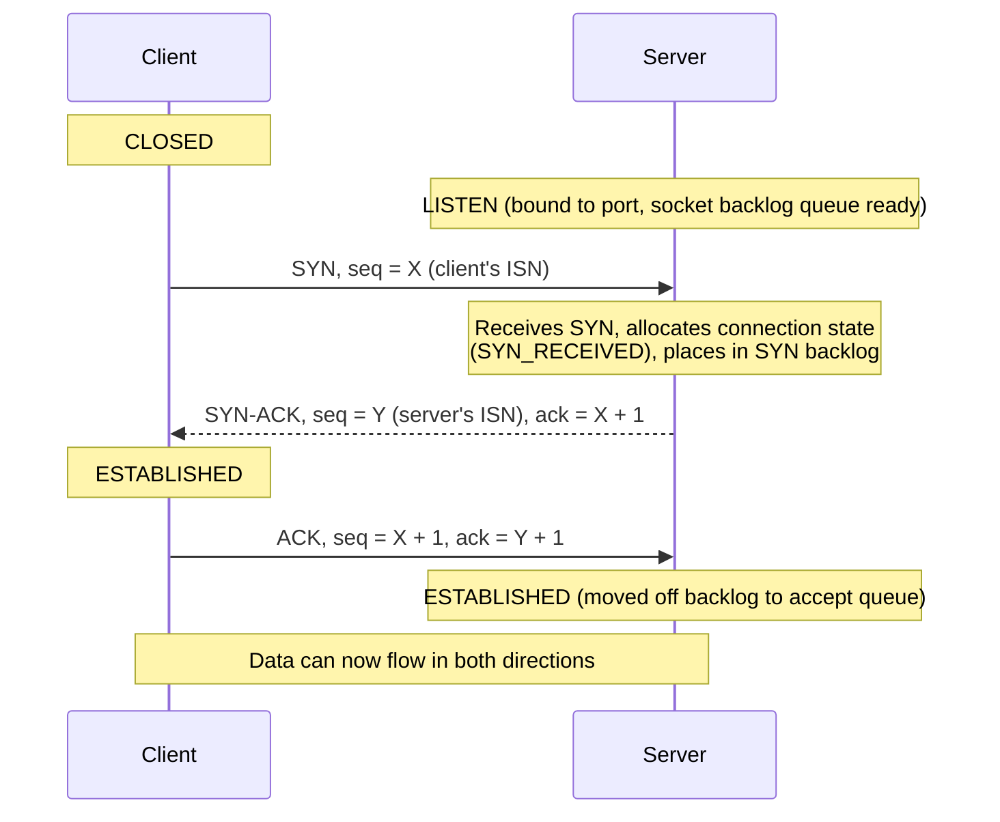

# TCP: Handshake, Flow Control, Congestion Control

*IP will happily drop, duplicate, reorder, or lose your packets and never tell you — TCP is the layer that turns that best-effort chaos into a reliable, ordered, full-duplex byte stream two programs can just read and write to like a file.*

## Contents
- [What TCP is and why it exists](#what-tcp-is-and-why-it-exists)
- [Where TCP sits and the 4-tuple](#where-tcp-sits-and-the-4-tuple)
- [The 3-way handshake](#the-3-way-handshake)
- [Reliability mechanics](#reliability-mechanics)
- [Flow control: protecting the receiver](#flow-control-protecting-the-receiver)
- [Congestion control: protecting the network](#congestion-control-protecting-the-network)
- [Modern congestion control: CUBIC and BBR](#modern-congestion-control-cubic-and-bbr)
- [Connection teardown](#connection-teardown)
- [Head-of-line blocking](#head-of-line-blocking)
- [Costs and trade-offs of TCP](#costs-and-trade-offs-of-tcp)
- [How this connects onward](#how-this-connects-onward)
- [Trade-offs and common confusions](#trade-offs-and-common-confusions)
- [Check yourself](#check-yourself)
- [Real-world and sources](#real-world-and-sources)

## What TCP is and why it exists

**TCP (Transmission Control Protocol)** is a **transport-layer (L4)** protocol that provides a **connection-oriented, reliable, ordered, full-duplex byte stream** between two endpoints, built entirely on top of IP — which, as L1 topic 2 established, guarantees none of that. IP is **best-effort**: a packet (IP calls it a datagram) can be dropped (router queue overflow, link failure), duplicated (retransmission somewhere in the path), reordered (packets taking different physical routes), or corrupted, and IP itself does nothing to detect or fix any of it. TCP exists specifically to sit on top of that unreliable substrate and manufacture the guarantees applications actually want.

**The precise guarantees TCP provides:**

- **Connection-oriented** — before any data flows, both sides explicitly establish shared state (the [3-way handshake](#the-3-way-handshake)) and explicitly tear it down when done. There's a defined "connection" object with a lifecycle, unlike IP where every datagram is independent.
- **Reliable delivery** — every byte sent is guaranteed to arrive, or the sender is told the connection has failed. Achieved through acknowledgements and retransmission (see [Reliability mechanics](#reliability-mechanics)).
- **In-order delivery** — bytes are delivered to the receiving application in exactly the order they were sent, even if the underlying IP packets arrived out of order. TCP buffers and resequences them before handing data up.
- **Byte-stream abstraction** — TCP does not preserve message boundaries. An application writes bytes; TCP does not promise that one `send()` call corresponds to one `recv()` call on the other side — it may coalesce, split, or batch the underlying segments however it likes. This is why application protocols (HTTP, etc.) must define their own framing (e.g. `Content-Length`, chunked encoding) on top of TCP's stream.
- **Full-duplex** — both sides can send and receive simultaneously, independently, over the same connection; there are effectively two independent byte streams (one per direction) sharing one connection's state.
- **Flow control** — a fast sender cannot overwhelm a slow receiver's buffer (see [Flow control](#flow-control-protecting-the-receiver)).
- **Congestion control** — a sender adapts its rate to avoid overwhelming the *network* path in between, not just the receiver (see [Congestion control](#congestion-control-protecting-the-network)).

**What TCP is NOT:** it is not a message protocol (no built-in framing), not inherently fast (it trades latency for reliability — see [Costs and trade-offs](#costs-and-trade-offs-of-tcp)), and not the only transport — the next L1 topic covers **UDP**, which deliberately gives up ordering, reliability, and congestion control to minimize latency and overhead. Every transport choice in system design is ultimately "do I need TCP's guarantees, or can I get away with (and benefit from) UDP's bare-bones datagram model." Keep that contrast in mind as a forward reference.

## Where TCP sits and the 4-tuple

TCP identifies a connection using a **4-tuple**: `(source IP, source port, destination IP, destination port)`. This is the single most important structural fact about how TCP multiplexes traffic:

- A **port** (introduced in L1 topic 1/2's stack discussion) is a 16-bit number identifying *which application* on a host a segment belongs to — a host has one IP but can run many services, each bound to its own port (e.g. `:443` for HTTPS, `:5432` for Postgres).
- A single **server port** (say, `:443`) can serve thousands of simultaneous clients concurrently, because each client connection is uniquely identified by the *full 4-tuple*, not the port alone. Two different clients connecting to the same server IP and port are two entirely distinct TCP connections, distinguished by differing source IP/port — the OS's TCP stack keeps a separate per-connection state block (a **Transmission Control Block**) for each 4-tuple.
- This is also why a client can open many connections to the same server: the OS picks a different **ephemeral source port** for each outgoing connection, making each 4-tuple unique even though destination IP and port are identical.
- This 4-tuple is exactly what the socket API (forward-ref) exposes as a "connected socket," and it's the same 4-tuple an **L4 load balancer** (forward-ref) hashes on to consistently route a given connection's packets to the same backend.

## The 3-way handshake

Before any data is exchanged, TCP requires both sides to agree on starting **sequence numbers** and confirm both directions of the path are working. This is the **3-way handshake**: SYN, SYN-ACK, ACK.

**Why sequence numbers, and why an Initial Sequence Number (ISN) instead of always starting at 0:** every byte in a TCP stream is numbered. The sequence number in a segment says "the first byte of this segment's payload is byte number X of the stream." This is what enables reordering, duplicate detection, and precise acknowledgement (see [Reliability mechanics](#reliability-mechanics)). Each side picks its own **ISN** — historically derived from a clock plus randomization, now required to be securely randomized — specifically so an off-path attacker (or a stale segment from a prior, already-closed connection reusing the same 4-tuple) can't easily guess valid sequence numbers and inject or replay data into the connection. `verify: exact modern ISN-generation algorithms/RFC guidance (RFC 9293 mandates unpredictable ISNs) are worth confirming if you need implementation-level detail.`

**Why three messages, not two:** TCP is full-duplex — each direction needs its own sequence-number agreement and its own confirmation that the other side is reachable and willing. Two messages (SYN, then ACK) would only prove the initiator can reach the responder; it wouldn't let the responder's own SYN (announcing *its* ISN for the reverse direction) be acknowledged. Three messages let both sides synchronize sequence numbers in both directions with the minimum number of round trips: the second message (SYN-ACK) cleverly combines "here's my SYN for my direction" and "here's my ACK for your SYN" into a single segment.

**State progression:** the server starts in `LISTEN` (bound to the port, waiting). On receiving a SYN it moves to `SYN_RECEIVED` and holds this half-open connection in the **SYN backlog** (a queue of connections that have sent SYN but not yet completed the handshake) while it waits for the final ACK. The client moves straight to `ESTABLISHED` after receiving the SYN-ACK (it already has everything it needs), while the server only reaches `ESTABLISHED` once the final ACK arrives.

**SYN backlog and SYN flood, at concept level (forward-ref security):** because the server must allocate state for every half-open connection sitting in `SYN_RECEIVED`, an attacker can send a flood of SYNs (often with spoofed source IPs so no real client ever completes the handshake) to exhaust that backlog and prevent legitimate connections from being accepted — a classic resource-exhaustion DoS. Mitigations like **SYN cookies** (encoding the connection state cryptographically into the SYN-ACK's sequence number itself, so the server doesn't need to store per-connection state until the final ACK proves the client is real) belong to the security topic in depth; the concept to hold onto here is simply that the handshake's *half-open* window is an inherent attack surface because it requires the server to commit state before it has proof the client is legitimate.

## Reliability mechanics

TCP achieves reliable, in-order delivery over an unreliable IP layer through a few cooperating mechanisms:

- **Sequence numbers** — every byte sent has a position in the stream (established at handshake time). This lets the receiver detect gaps (missing data), detect and discard duplicates, and reorder segments that arrived out of sequence before handing bytes to the application.
- **Acknowledgements (ACKs)** — the receiver tells the sender what it has successfully received. Classic TCP uses **cumulative ACKs**: an ACK with number N means "I have successfully received everything up to byte N-1, contiguously" — it says nothing about data received *after* a gap, even if later bytes did arrive out of order (they're buffered but not yet acknowledged as part of the contiguous stream).
- **Retransmission and RTO** — if the sender doesn't receive an ACK for a segment within its **Retransmission Timeout (RTO)**, it assumes the segment (or its ACK) was lost and retransmits. RTO is not a fixed constant — it's dynamically computed from measured **RTT (Round-Trip Time)**, typically via a smoothed-RTT and RTT-variance estimator (classically Jacobson's algorithm), so RTO adapts as network conditions (a Wi-Fi link vs a transcontinental fiber path) change. Set RTO too low and you get spurious retransmissions wasting bandwidth; too high and genuine loss takes a long time to be noticed.
- **Fast retransmit (duplicate ACKs)** — waiting for a full RTO timeout on every loss is slow. If the receiver gets segments out of order (a gap exists), it re-sends an ACK for the last contiguous byte it has *every time* another out-of-order segment arrives — these are **duplicate ACKs**. When the sender sees a threshold of duplicate ACKs (classically 3), it infers the segment right after that ACK'd point was probably lost and retransmits it immediately, without waiting for RTO to expire — a much faster loss-recovery path in the common case of a single lost segment amid otherwise-flowing traffic.
- **Selective Acknowledgement (SACK)** — plain cumulative ACK is coarse: if segments 1, 2, 4, 5 arrive but 3 is lost, cumulative ACK can only say "I have up through 2," even though 4 and 5 are already safely buffered — forcing the sender to potentially retransmit more than necessary. **SACK** (an extension, RFC 2018) lets the receiver explicitly tell the sender *which* non-contiguous ranges it has already received, so the sender only needs to retransmit the actual gap (segment 3), not everything after it. SACK is negotiated during the handshake and is standard in modern TCP stacks.

## Flow control: protecting the receiver

**The problem flow control solves:** a fast sender (e.g. a beefy server) could push data faster than a slow receiver (e.g. a phone on a weak connection, or an application that isn't reading its socket buffer fast enough) can consume it, overflowing the receiver's buffer and forcing it to drop data — even though the network path itself was perfectly capable of carrying that data.

**The mechanism — the receive window (rwnd) and sliding window:** every ACK the receiver sends includes a **window size**, called `rwnd` — "here is how much more buffer space I currently have available, so don't send me more than this without hearing from me again." The sender is not allowed to have more than `rwnd` bytes of unacknowledged data in flight at once. As the receiving application reads data out of its buffer, freeing space, subsequent ACKs advertise a larger window again, which is why this is described as a **sliding window** — the "window" of allowed in-flight, unacknowledged data slides forward along the byte stream as data is sent and acknowledged.

**Worked example:**

1. Receiver's buffer is 16 KB, currently empty. It advertises `rwnd = 16KB`.
2. Sender sends 16 KB of data without waiting for an ACK (this is allowed — the window is the *limit* on unacked data, not a requirement to send one segment at a time). Sender must now wait; it has hit the window limit.
3. Receiver's application hasn't read anything yet, so its buffer is now full. It ACKs the first 4 KB (application read 4 KB out) with `rwnd = 4KB` in that ACK.
4. Sender can now send up to 4 KB of new data — the window has "slid" forward by 4 KB.
5. If the receiving application stalls entirely (buffer stays full), the receiver eventually advertises `rwnd = 0` — a **zero window**. The sender must then stop sending entirely and periodically probe (a small "window probe" segment) until the receiver sends a **window update** announcing `rwnd > 0` again.

**Window scaling (forward-ref, brief):** the original TCP header only allocates 16 bits to the window field, capping the advertised window at 65,535 bytes — far too small for high-bandwidth, high-latency ("high-BDP") paths, where you want much more data in flight to keep the pipe full. **RFC 7323's window scaling option**, negotiated at handshake time, lets both sides agree on a scale factor so the effective window can be much larger. `verify: exact scale-factor bit width and negotiation mechanics if needed at implementation depth.`

## Congestion control: protecting the network

**The distinct problem congestion control solves — this is the single most-confused point with flow control, so hold it precisely:** flow control protects the *receiver's buffer*; congestion control protects the *network path in between* — the routers and links a connection's segments actually traverse, which the sender and receiver can't directly see or query. Even if the receiver has an enormous, always-empty buffer (`rwnd` is huge), a sender blasting data at line rate can still overwhelm a congested router's queue somewhere in the middle of the path, causing that router to drop packets — a failure invisible to the flow-control mechanism entirely, because flow control only knows about the receiver's stated capacity, not the path's.

**The congestion window (cwnd):** the sender maintains its own internal, *self-estimated* limit called `cwnd` — how much unacknowledged data it believes the network path can currently absorb without inducing loss. Critically, **the sender's actual allowed in-flight data is `min(cwnd, rwnd)`** — the smaller of what the network can handle and what the receiver can handle. This single formula is the resolution of the flow-control-vs-congestion-control confusion: two independent limits, sender takes whichever is more restrictive.

**Why cwnd must be *learned*, not told:** unlike `rwnd` (which the receiver just states outright in every ACK), no one tells the sender the network's capacity directly — there's no "network says: send at most N bytes." The sender has to *probe* for it, cautiously increasing its send rate and watching for loss (the classic, canonical signal that the path is saturated), then backing off. This probe-and-back-off dynamic is why congestion control unfolds in phases over the life of a connection rather than being a single fixed value.

**Classic phases (RFC 5681):**

- **Slow start** — a new connection starts conservatively (a small initial `cwnd`, historically a few segments, larger in modern default configurations) and **doubles `cwnd` roughly every RTT** (exponential growth) as long as ACKs keep confirming data is getting through cleanly. It's called "slow" only relative to sending everything at once — the growth itself is exponential and gets to a meaningful rate quickly. This continues until either loss is detected or `cwnd` reaches a threshold called **ssthresh** (slow-start threshold).
- **Congestion avoidance (AIMD)** — once past `ssthresh` (or after recovering from loss), the sender switches to much more cautious **linear growth**: roughly +1 segment's worth of `cwnd` per RTT, continuing to probe for more capacity but far more gently. This is the "additive increase" half of **AIMD (Additive Increase, Multiplicative Decrease)**. The "multiplicative decrease" half: on detecting loss, the sender doesn't creep down — it slashes `cwnd` sharply (classically halving it), because loss is treated as a strong signal that the path is already oversaturated and a large, immediate pullback is the responsible reaction. AIMD's asymmetry (cautious linear climb, sharp multiplicative drop) is specifically what makes many independent TCP flows sharing a bottleneck converge toward fairly sharing that bandwidth over time — a well-studied property of the algorithm, not an accident.
- **Fast recovery** — pairs with fast retransmit: rather than dropping all the way back to slow start's tiny initial `cwnd` on every loss (which would waste a lot of already-proven-good capacity), a sender that detects loss via duplicate ACKs (a more benign, partial signal than a full RTO timeout expiring) enters fast recovery — it cuts `cwnd` (multiplicative decrease) but resumes from around that reduced value in congestion avoidance rather than restarting from scratch. A loss detected by a full **RTO timeout**, on the other hand, is treated as a more severe signal and typically does drop back into slow start, since a timeout suggests something more seriously wrong than an isolated single-segment loss.

**Signal types, briefly framed for what comes next:** the classic model above is **loss-based** — it only reacts once a packet is actually dropped, which by definition means the network already had to shed data. Two other signal families exist: **delay-based** approaches watch for *rising RTT* as an early warning that a queue is filling up, before any packet is actually dropped, and try to back off pre-emptively; **model-based** approaches (see BBR below) attempt to directly estimate the path's actual available bandwidth and RTT and pace sending to match, rather than reactively probing via loss or delay at all.

## Modern congestion control: CUBIC and BBR

- **CUBIC** — the loss-based algorithm and the long-standing default congestion-control algorithm on Linux `verify: current default across the widest range of deployed Linux kernel versions`. It generalizes AIMD's congestion-avoidance growth curve into a **cubic function** of time since the last loss event, growing slowly right after backing off, then accelerating, then flattening again as it approaches the point where the previous loss occurred — designed to be more efficient than plain linear AIMD on high-bandwidth, high-latency paths (where linear +1-segment-per-RTT growth takes a very long time to reclaim lost capacity) while still backing off sharply on loss like classic AIMD. It is standardized in RFC 8312.
- **BBR (Bottleneck Bandwidth and Round-trip propagation time)** — a model-based algorithm developed by Google, deployed at Google and offered as a selectable Linux kernel congestion-control module `verify: current adoption breadth beyond Google's own infrastructure`. **The problem it specifically targets:** loss-based algorithms like CUBIC treat filling up network buffers as *normal and necessary* — they keep increasing `cwnd` until a router's queue actually overflows and drops a packet, which means they routinely fill buffers to the brim first. On links with deep buffers (a phenomenon called **bufferbloat**), this causes real, felt latency (packets queued for a long time before being dropped or delivered) even though throughput looks fine — loss is a lagging, high-latency-cost signal. BBR instead continuously estimates the path's actual **bottleneck bandwidth** (the narrowest link's capacity) and minimum **RTT** (the propagation delay with an empty queue), and paces its sending rate to match that estimate directly — aiming to fill the pipe's actual capacity without needlessly filling up (and inflating latency through) buffers along the way. This makes it attractive for high-bandwidth-delay-product (high-BDP) links (e.g. long-haul, high-throughput paths) where CUBIC's loss-triggered, buffer-filling behavior costs more in latency than necessary. `verify: version-specific behavioral differences (BBRv1 vs later revisions) and exact current deployment scope are evolving and worth confirming against current sources rather than treating as fixed.`

Both remain **congestion control**, not flow control — they only ever govern `cwnd`, the network-facing half of `min(cwnd, rwnd)`.

## Connection teardown

TCP closes a connection with a **4-way close** (FIN, ACK, FIN, ACK), because — same full-duplex logic as the handshake — each direction of the stream must be closed independently:

1. Side A, done sending, sends **FIN**.
2. Side B ACKs it. Side A's send direction is now closed, but B can still send data to A (a **half-closed** connection) if it isn't done yet.
3. When Side B is also done sending, it sends its own **FIN**.
4. Side A ACKs it. Both directions are now closed.

**TIME_WAIT — why it exists:** after sending the final ACK, the side that sent it (typically whichever side initiated the close) enters **TIME_WAIT** for a defined interval (classically twice the maximum segment lifetime) rather than immediately discarding connection state. Two reasons: first, if that final ACK is itself lost, the other side will retransmit its FIN, and the side in TIME_WAIT needs to still be able to respond with another ACK rather than having already forgotten the connection existed (responding with an unexpected RST instead would break clean teardown). Second, it prevents delayed, straggling packets from a just-closed connection from being misdelivered into a *new* connection that happens to reuse the exact same 4-tuple shortly after. The practical operational consequence — worth knowing at a systems level — is that a host closing very large numbers of connections in a short time (e.g. a busy server or an aggressive client) can accumulate a large number of sockets stuck in TIME_WAIT, which can exhaust available ephemeral ports or per-connection resources; this is one of the concrete motivations for connection reuse / keep-alive (back-ref forward to connection pooling in a later level) rather than opening and closing a fresh TCP connection per request.

**RST (reset):** an abrupt, non-graceful termination — sent when one side wants to immediately abort a connection (e.g. no listener on the destination port, an application-level error, or a security response to unexpected traffic), rather than politely draining and closing via FIN. Unlike the FIN sequence, an RST doesn't wait for acknowledgement of prior data and typically means "forget this connection existed, right now," and any data not yet delivered to the application may be discarded.

## Head-of-line blocking

Because TCP guarantees strict in-order delivery to the application, **one lost segment stalls delivery of every byte sent after it**, even if those later bytes have already physically arrived and are sitting in the receiver's buffer — the receiver's OS will not hand them to the application until the gap is filled by a retransmission. This is **TCP head-of-line (HOL) blocking**, and it's a structural consequence of the ordering guarantee, not a bug.

This matters a great deal once a single TCP connection is used to multiplex many independent logical streams — exactly what HTTP/2 does (forward-ref HTTP/2 topic): if HTTP/2 sends dozens of independent requests/responses multiplexed over one TCP connection and a single packet belonging to *any one* of them is lost, **every** multiplexed stream stalls until that one segment is retransmitted, even though the other streams' data has already arrived. This exact pain point is the core motivation behind **QUIC and HTTP/3** (forward-ref): QUIC runs over UDP specifically so it can implement its own multi-stream model where loss on one stream doesn't block delivery of unrelated streams — a direct architectural response to this TCP limitation.

## Costs and trade-offs of TCP

All of TCP's guarantees are earned, not free:

- **Handshake latency before any data** — a full RTT is spent completing the 3-way handshake before the first application byte can even be sent (and TLS, forward-ref, adds further round trips on top for a secure connection). For a client and server 150ms apart, that's 150ms spent purely on setup before useful work starts — which is exactly why connection reuse/keep-alive and connection pooling (back-ref/forward-ref to later levels) matter so much: paying that setup cost once and reusing the connection across many requests amortizes it away.
- **Per-connection state** — every open TCP connection consumes kernel memory (buffers, the Transmission Control Block, timers) on both ends, which is why servers care about total open-connection counts, not just request rate.
- **Head-of-line blocking** — as above, an inherent cost of strict ordering.
- **TIME_WAIT accumulation** — as above, a real operational constraint under high connection churn.
- **Not always "fast"** — reliability and ordering are achieved through waiting (for ACKs, for retransmissions, for the congestion window to grow) — TCP optimizes for correctness and fairness to the network, not for minimum possible latency on every single packet.

**When you'd reach for UDP instead (forward-ref):** if an application can tolerate occasional loss or reordering and values minimum latency more than perfect delivery — real-time voice/video, live gaming state, or protocols (like QUIC) that want to implement their own custom reliability/ordering logic above UDP rather than inherit TCP's — UDP's lack of handshake, ordering, and congestion-control overhead becomes an advantage rather than a liability. That trade-off is the entire subject of the next L1 topic.

## How this connects onward

- **Under HTTP/1.1 and HTTP/2 (forward-ref):** both run over TCP, inheriting its handshake latency and HOL-blocking behavior; HTTP/2's multiplexing is exactly what makes TCP's HOL blocking newly painful (many logical streams stalled by one lost segment), motivating HTTP/3/QUIC.
- **Under TLS (forward-ref):** the TLS handshake happens *after* the TCP handshake completes, adding its own round trip(s) on top — so a fresh HTTPS connection pays TCP's RTT *plus* TLS's RTT(s) before the first request byte is sent, another reason connection reuse matters so much in practice.
- **Load balancers (forward-ref):** the distinction between an **L4 load balancer** (routes based on the TCP 4-tuple, doesn't need to understand what's inside the stream) and an **L7 load balancer** (terminates TCP/TLS and reads the actual HTTP request to make routing decisions) rests directly on the 4-tuple concept from [Where TCP sits and the 4-tuple](#where-tcp-sits-and-the-4-tuple).
- **Sockets (forward-ref):** the socket API is the OS-level abstraction applications use to open, read from, write to, and close exactly the kind of connection this topic describes; a "connected socket" *is* one 4-tuple's worth of TCP state.
- **Connection pooling (back-ref to later levels, e.g. database connection pooling):** the entire reason connection pools exist is to avoid repeatedly paying TCP's (and TLS's) handshake latency — a pool keeps already-established connections warm and reuses them.

## Trade-offs and common confusions

| Point | Why it matters |
|---|---|
| **Flow control vs congestion control** | Flow control protects the *receiver's buffer* (`rwnd`, stated explicitly by the receiver); congestion control protects the *network path* (`cwnd`, self-estimated by the sender through probing). The sender's actual send limit is `min(cwnd, rwnd)`. |
| **cwnd is learned, rwnd is told** | The receiver directly states its buffer capacity every ACK; no one directly tells the sender the network's capacity — it must be inferred via loss, delay, or bandwidth modeling. |
| **Reliable does not mean fast** | TCP optimizes for correctness, ordering, and network fairness — not minimum latency on every packet. Handshake RTT, ACK waits, and congestion-window growth are all latency costs paid for those guarantees. |
| **Cumulative ACK vs SACK** | Plain cumulative ACK can only confirm the last contiguous byte received, potentially causing unnecessary retransmission of already-received data after a gap; SACK lets the receiver report exact received ranges so only the true gap is retransmitted. |
| **Fast retransmit (dup ACKs) vs RTO timeout** | Duplicate ACKs signal a more benign, likely-isolated loss and trigger fast recovery (partial cwnd cutback); a full RTO timeout signals a more severe problem and typically drops back into slow start. |
| **Loss-based (CUBIC) vs model-based (BBR)** | CUBIC intentionally fills buffers until a packet is dropped, which can inflate latency (bufferbloat) on deep-buffer links; BBR estimates actual bottleneck bandwidth/RTT directly and paces to avoid over-filling buffers in the first place. |
| **TCP's HOL blocking vs QUIC** | Strict in-order delivery means one lost segment blocks everything sent after it, even already-arrived data — a structural cost that motivated QUIC/HTTP3 to move stream multiplexing off of TCP entirely. |
| **Nagle's algorithm and delayed ACK** | Nagle's algorithm batches small outgoing writes to avoid sending many tiny segments; delayed ACK batches outgoing ACKs to piggyback on other traffic. The two can interact badly (each waiting on the other), historically causing noticeable latency in some request/response patterns — commonly worked around by disabling Nagle (`TCP_NODELAY`) for latency-sensitive applications. `verify: exact interaction conditions and current default behavior across OS TCP stacks.` |

> [!IMPORTANT]
> TCP builds reliability, ordering, and a byte-stream abstraction on top of IP's best-effort delivery using two *independent* adaptive limits on the sender — `rwnd` (told by the receiver, protecting its buffer) and `cwnd` (learned by the sender, protecting the shared network) — and the sender always obeys whichever is smaller. Everything else (handshake, ACKs, retransmission, slow start/AIMD, CUBIC/BBR) exists to make those two numbers converge to the right value as fast and fairly as possible.

## Check yourself

- A server has `rwnd` advertised as very large (its receive buffer is huge and empty), but the sender still isn't sending at full network speed. What's the most likely explanation, and which of the two windows is the binding constraint?
- Why does the TCP handshake need three messages instead of two, given that TCP is full-duplex?
- Explain, in your own words, why a single lost packet in an HTTP/2 connection (multiplexed over one TCP connection) stalls *every* logical stream on that connection, not just the one that lost data.
- What specific problem does BBR address that a purely loss-based algorithm like CUBIC does not, and why does filling network buffers to capacity (as CUBIC does before backing off) cause a latency problem even when throughput looks fine?
- Why does TIME_WAIT exist, and what operational problem can arise if a server closes an extremely high volume of connections in a short window?

## Real-world and sources

**CUBIC as the long-standing Linux default and BBR as Google's alternative — a live, ongoing trade-off, not a settled "winner."** Linux has shipped CUBIC as its default congestion-control algorithm across most modern kernel versions `verify: exact current default across the full range of actively-used kernel/distro versions`, making the classic loss-based, buffer-filling AIMD-descended model in [Modern congestion control](#modern-congestion-control-cubic-and-bbr) the one the overwhelming majority of internet TCP traffic actually runs. Google, motivated by the bufferbloat problem this file describes, developed and deployed BBR internally and made it available as a selectable Linux kernel module, illustrating the concrete, real engineering trade-off between "generalize the classic reactive, loss-triggered model" (CUBIC/RFC 8312) and "proactively model the path and avoid filling buffers in the first place" (BBR) rather than one being a strict, universally-agreed replacement for the other. `verify: current comparative deployment share and any newer revisions (e.g. BBRv2/v3) before citing specifics.`

### Sources / further reading

- RFC 9293, "Transmission Control Protocol (TCP)" (current core TCP specification, obsoletes RFC 793)
- RFC 793, "Transmission Control Protocol" (original 1981 specification, historical reference)
- RFC 5681, "TCP Congestion Control" (slow start, congestion avoidance, fast retransmit/fast recovery)
- RFC 2018, "TCP Selective Acknowledgment Options" (SACK)
- RFC 7323, "TCP Extensions for High Performance" (window scaling, timestamps)
- RFC 8312, "CUBIC for Fast Long-Distance Networks"
- Cardwell, Cheng, Gunn, Yeganeh, Jacobson, "BBR: Congestion-Based Congestion Control" (ACM Queue / CACM, describes Google's BBR algorithm and its bufferbloat motivation)
- W. Richard Stevens, "TCP/IP Illustrated, Volume 1" (classic, detailed mechanics reference for handshake, windows, and retransmission behavior)
