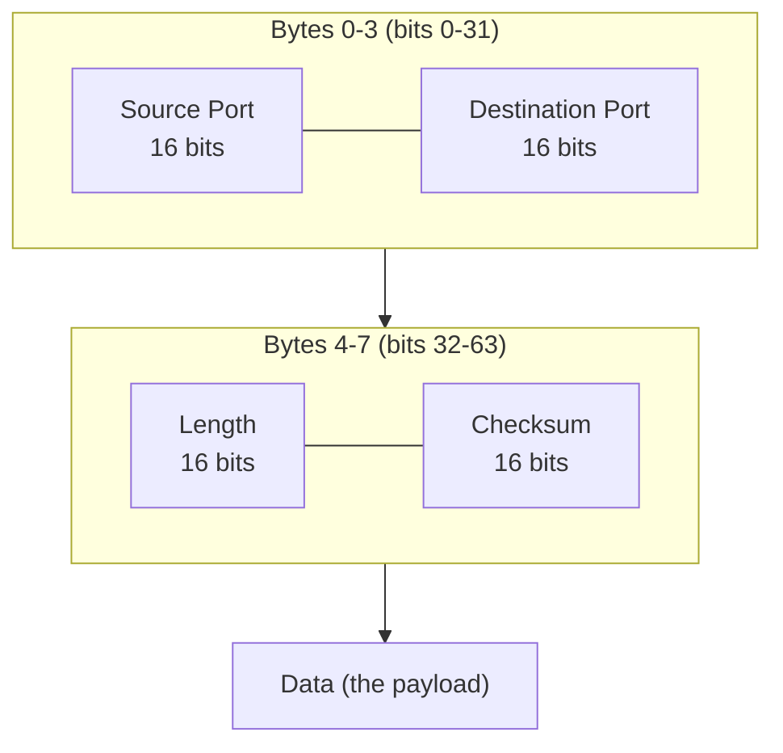

# UDP: The Bare-Bones Datagram Protocol

_TCP spends a round trip and a pile of state manufacturing guarantees before it will send your first byte — UDP just fires the datagram and gets out of the way, leaving every guarantee TCP gives you for free as something you either don't need or must build yourself._

## Contents

- [What UDP is and why it exists](#what-udp-is-and-why-it-exists)
- [The UDP header, byte by byte](#the-udp-header-byte-by-byte)
- [The checksum and the spseudo-header](#the-checksum-and-the-pseudo-header)
- [Connectionless, unreliable, unordered, message-oriented: precisely](#connectionless-unreliable-unordered-message-oriented-precisely)
- [What UDP does NOT do, and the consequences](#what-udp-does-not-do-and-the-consequences)
- [Datagram boundaries, size limits, and fragmentation](#datagram-boundaries-size-limits-and-fragmentation)
- [Spoofing and amplification risk](#spoofing-and-amplification-risk)
- [When UDP wins](#when-udp-wins)
- [Rebuilding reliability on top of UDP](#rebuilding-reliability-on-top-of-udp)
- [Worked example: a DNS query, and a lost packet under TCP vs UDP](#worked-example-a-dns-query-and-a-lost-packet-under-tcp-vs-udp)
- [Classic UDP users, and why each chooses it](#classic-udp-users-and-why-each-chooses-it)
- [Trade-offs: UDP vs TCP](#trade-offs-udp-vs-tcp)
- [Connects to](#connects-to)
- [Check yourself](#check-yourself)
- [Real-world and sources](#real-world-and-sources)

## What UDP is and why it exists

**UDP (User Datagram Protocol)** is a **transport-layer (L4)** protocol, a sibling to TCP, that provides essentially nothing beyond what IP already provides: it adds **ports** (so a datagram reaches the right process on a host, not just the right host) and an **optional checksum** (so basic corruption can be detected), and that is the entire feature list. Where TCP is a substantial engineering effort built to manufacture reliability, ordering, and flow/congestion control on top of IP's best-effort delivery (see [04-tcp.md](04-tcp.md)), UDP deliberately declines to build any of that. It hands your data to IP almost exactly as-is, wrapped in the thinnest possible header.

**Why it exists at all, rather than just using TCP everywhere:** every one of TCP's guarantees is bought with cost — a handshake round trip before data flows, retransmission delays when packets are lost, in-order delivery that stalls later data behind an earlier gap (head-of-line blocking), and a congestion window that throttles throughput to what the sender believes the network can absorb. Some applications don't want any of that trade: a live voice call doesn't want a 200ms-old audio frame retransmitted and delivered late — it wants the _next_ frame, now, and would rather drop the old one entirely. A one-shot DNS lookup doesn't want to pay a TCP handshake's RTT just to send one 40-byte question and get one small answer back. UDP exists precisely to serve applications where **minimum latency and/or explicit application-level control** matters more than automatic reliability — RFC 768 (1980), one of the oldest and shortest RFCs in the entire internet protocol suite, defines the whole thing.

**"Best-effort" and "datagram," defined precisely:** _best-effort_ means the network (IP, and by extension UDP riding directly on it) will try to deliver a packet but makes **no guarantee** — no promise of arrival, no promise of order, no promise of a single delivery only. _Datagram_ means a single, self-contained, independent unit of data carrying enough information (in UDP's case, source/destination port plus payload) to be routed and delivered on its own, with no dependency on any datagram before or after it — the opposite of a "stream," where data only makes sense as a continuous ordered sequence.

**What UDP is NOT:** it is not "broken TCP" or "TCP without the good parts by accident" — it is a deliberate, minimal design so that applications which don't need TCP's guarantees aren't forced to pay for them, and so that applications which need _different_ guarantees (my own custom ordering, my own custom retransmission policy, multicast delivery to many receivers at once) have a substrate to build on that doesn't fight them. It is also not connectionless in the sense of "insecure" or "layer 3" — it is still a proper L4 protocol with ports, still runs on top of IP, and can absolutely be secured (DTLS is literally "TLS for datagram transports") — connectionless just means no shared session state is established before data flows.

## The UDP header, byte by byte

UDP's header is **8 bytes, fixed size, four fields, each exactly 16 bits** — contrast with TCP's minimum 20 bytes (commonly 32+ with options) and its dozen-plus fields for sequence numbers, ack numbers, window size, flags, and options. UDP is deliberately this thin because it has nothing else to say: no sequence number (nothing is being tracked in order), no ack number (nothing is being acknowledged), no window (no flow control), no flags (no connection states to signal) — every field TCP carries that UDP lacks corresponds exactly to a guarantee UDP doesn't make.

- **Source port (16 bits)** — the sending process's port, exactly the same concept as TCP's source port (introduced in [04-tcp.md](04-tcp.md#where-tcp-sits-and-the-4-tuple)). It's technically optional in UDP's own semantics (RFC 768 allows it to be zero if no reply is expected), but in practice virtually every OS socket API fills it in so a reply can find its way back.
- **Destination port (16 bits)** — which process/service on the destination host should receive this datagram (e.g. `:53` for DNS, `:123` for NTP). This is the _only_ thing UDP does that IP alone couldn't already do — IP gets the datagram to the right **host**; the port gets it to the right **process** on that host.
- **Length (16 bits)** — the total length of the UDP datagram in bytes, **header plus data** (minimum value 8, i.e. an empty payload). This is technically redundant with information the IP header also carries (IP's own total-length field minus the IP header length would tell you the same thing) but is kept for historical/architectural reasons — layers are meant to be self-describing without depending on layers below them. Because it's a 16-bit field, a UDP datagram is capped at 65,535 bytes total (65,507 bytes of payload over IPv4, slightly more addressable over IPv6 with jumbograms) — though in practice payloads are kept vastly smaller, as covered in [Datagram boundaries, size limits, and fragmentation](#datagram-boundaries-size-limits-and-fragmentation).
- **Checksum (16 bits)** — a simple error-detection value computed over a **pseudo-header** (see next section) plus the UDP header plus the data. It can catch bit-corruption introduced anywhere along the path (not just on the wire — e.g. buggy hardware, memory errors) but is _not_ a security mechanism (it does nothing against a deliberate attacker) and is not strong enough to catch every possible corruption pattern (see next section for the mandatory-vs-optional distinction).

That's the entire header: two 16-bit port numbers, a 16-bit length, a 16-bit checksum — 8 bytes flat, always, no variable-length options, no flags. TCP's minimum header alone (20 bytes) is already 2.5x that, before counting any options (timestamps, SACK, window scaling) that push real-world TCP headers higher still. For a small, latency-sensitive datagram, that per-packet overhead difference is not trivial: on a 50-byte DNS query, an extra ~12+ bytes of TCP header (plus the handshake RTT, discussed later) is a meaningfully larger fraction of the wire cost.

## The checksum and the pseudo-header

**Why a pseudo-header at all:** the UDP checksum isn't computed over the UDP header and data alone — it's computed over a **pseudo-header** prepended just for the calculation (never actually transmitted) containing the source IP address, destination IP address, the protocol number (17, for UDP), and the UDP length. The purpose is to let UDP detect a class of error that its own header can't see: if a packet gets **misdelivered to the wrong host or the wrong protocol** somewhere in the network stack (e.g. a corrupted IP header field silently changes the destination address, or a bug delivers a UDP payload to something expecting a different protocol), the receiving UDP layer can catch it, because the checksum it computes locally (using the IP addresses and protocol number _it_ sees on the arriving packet) won't match the checksum the sender computed if any of that pseudo-header data differs from what the sender intended. In effect, the pseudo-header binds the UDP checksum to "this data was meant for exactly this source/destination IP pair, over exactly this protocol," even though IP addresses aren't literally part of UDP's own real header.

**Why the checksum is optional in IPv4 but mandatory in IPv6:** in IPv4, UDP's checksum can be set to all-zeros to mean "no checksum computed" (a deliberate escape hatch RFC 768 allows), historically justified because IPv4 already carries its own header checksum (protecting the IP header itself, though notably _not_ the payload) and because some latency- or CPU-sensitive applications on trusted local links chose to skip the extra computation, relying on lower-layer (e.g. Ethernet frame check sequence) or application-layer integrity checks instead. **IPv6 removed the IP-header checksum entirely** (a deliberate design simplification, since routers no longer had to recompute a header checksum at every hop as TTL/hop-limit decremented, and the assumption is that upper-layer or link-layer checks catch corruption instead) — which means for IPv6, UDP's checksum is the _only_ remaining check that a datagram wasn't corrupted end-to-end at the transport level, and RFC 2460/8200 accordingly makes the UDP checksum **mandatory** over IPv6 (a checksum of zero is not a valid "disable" signal there; it must be computed). `verify: exact current wording/edge cases across RFC 2460 vs RFC 8200 before citing precisely.`

**What the checksum does and doesn't protect against:** it catches accidental bit-flip corruption (a reasonably common real-world occurrence — faulty hardware, memory bit-flips, some wireless link noise) with decent but not perfect probability (it's a 1's-complement sum, a comparatively weak checksum algorithm by modern standards, `verify: exact collision/failure-rate figures if quoting precisely`). It provides **zero protection against a deliberate attacker** — anyone can compute a valid checksum for forged data, since there's no secret key involved. That's a security property, not an integrity one, and belongs to TLS/DTLS (forward-ref), not UDP.

## Connectionless, unreliable, unordered, message-oriented: precisely

These four words are UDP's entire semantic contract, and it's worth being exact about each, contrasted directly against TCP's opposite:

- **Connectionless** — there is no handshake, no shared session state established before data flows, and no "connection" object with a lifecycle. Every datagram is independent; the OS doesn't need to remember "am I mid-handshake, established, or closing" for a UDP socket the way it tracks a TCP state machine. A UDP "socket" is really just a local (IP, port) binding used to send/receive individual datagrams — calling `connect()` on a UDP socket (a real, common pattern) doesn't perform any network handshake at all; it just locks the socket to a fixed remote address/port locally, purely for the convenience of not having to specify it on every `send()` call, and lets the OS filter incoming datagrams to only that peer.
- **Unreliable** — "unreliable" here is a precise technical term, not a value judgment: UDP makes **no guarantee** that a sent datagram arrives at all. If a router queue overflows and drops it, if a link fails momentarily, if a checksum fails and the receiver silently discards it — the sender is never told. There's no ACK, no retransmission, nothing. The application either doesn't care, tolerates the loss, or must detect and handle it itself. Note precisely what "unreliable" does _not_ mean: it does not mean "usually fails" or "flaky in practice." Most UDP datagrams, on most networks, most of the time, arrive perfectly fine — "unreliable" describes the absence of a _guarantee_, not a poor track record.
- **Unordered** — datagrams sent in order 1, 2, 3 can arrive in order 2, 1, 3 (or any other order) if they take different network paths or experience different queueing delays, and UDP does nothing to reorder them before delivering them to the application. Each datagram is handed up to the receiving application in whatever order it physically arrives.
- **Message-oriented (datagram-preserving)** — this is UDP's one real structural gift, and it's the direct opposite of TCP's byte-stream model. Every `send()` call produces exactly one datagram, and every successful `recv()` call on the other end returns exactly that one datagram's payload, in full, as a single discrete unit — never merged with another `send()`'s data, never split across multiple `recv()` calls. See [Datagram boundaries](#datagram-boundaries-size-limits-and-fragmentation) below for exactly what this buys you.

## What UDP does NOT do, and the consequences

Enumerating the absence explicitly, because each missing piece is a deliberate design choice with a real consequence:

| Missing                      | Consequence                                                                                                                                                                                                                                                                                                                                                                                                          |
| ---------------------------- | -------------------------------------------------------------------------------------------------------------------------------------------------------------------------------------------------------------------------------------------------------------------------------------------------------------------------------------------------------------------------------------------------------------------- |
| **No handshake**             | Zero round trips before the first byte of data — a datagram can be sent the instant the application calls `send()`. Also means no shared "is the peer even there/listening" confirmation; a datagram sent to a port with nothing listening on it may (depending on OS/firewall) elicit an ICMP "port unreachable" message, but the sending application isn't obligated to check or receive it in any structured way. |
| **No connection state**      | The kernel keeps essentially no per-peer memory for UDP (unlike TCP's Transmission Control Block) — a UDP socket can send datagrams to thousands of different destinations without allocating any new state per destination.                                                                                                                                                                                         |
| **No retransmission**        | A lost datagram is simply gone. If the application needs it, the application must notice (e.g. via a sequence number it added itself) and ask for it again, or just accept the gap.                                                                                                                                                                                                                                  |
| **No ordering/resequencing** | Datagrams are delivered in arrival order, not send order. An application that cares about order must number datagrams itself and reorder (or discard late-arriving ones) in its own logic.                                                                                                                                                                                                                           |
| **No deduplication**         | If a datagram is duplicated somewhere in the network (rare, but IP doesn't forbid it) or the _application itself_ naively retransmits, UDP delivers every copy to the receiving application — it does not collapse duplicates the way TCP's sequence-number tracking does.                                                                                                                                           |
| **No flow control**          | A fast sender can blast datagrams at a receiver faster than its socket buffer can be drained; excess datagrams are simply dropped by the OS (silently, from the sender's perspective) once the receive buffer fills.                                                                                                                                                                                                 |
| **No congestion control**    | Nothing in UDP itself slows a sender down in response to network congestion. This is the most consequential omission at the _network_ level, not just the application level.                                                                                                                                                                                                                                         |

**The congestion-collapse danger, spelled out:** TCP's congestion control (see [04-tcp.md](04-tcp.md#congestion-control-protecting-the-network)) exists not just to protect one connection's own throughput but to make the _shared internet_ stable — every well-behaved TCP flow backs off when it detects loss, which is what prevents a congested link from being driven into a worse and worse state as everyone keeps retransmitting into an already-overloaded path (a failure mode literally named **congestion collapse**, observed and studied on the early internet). A UDP application that blasts data at a fixed, uncontrolled rate regardless of loss has no such brake — if enough such flows share a bottleneck, they can drive that link into sustained, severe congestion that never self-corrects the way cooperating TCP flows do. This is exactly why **RFC 8085 (the UDP Usage Guidelines)** strongly recommends that any UDP-based protocol carrying significant, sustained traffic implement its own congestion control loosely modeled on TCP's principles (this is precisely what QUIC does, forward-ref) — UDP not having congestion control built in doesn't mean the application is exempt from the _problem_, only that solving it is now the application's job, not the transport's.

## Datagram boundaries, size limits, and fragmentation

**Message boundaries preserved — the core practical payoff:** because one `send()` maps to exactly one datagram which maps to exactly one `recv()`, a UDP application never needs application-level framing to know where one message ends and the next begins — the transport already tells you. Contrast with TCP, where an application sending JSON messages over a raw TCP stream must invent its own framing (a length prefix, a delimiter) because TCP might deliver two small writes coalesced into one `read()`, or split one write across two `read()` calls — the stream has no concept of "your" message boundaries at all. If a request/response protocol's natural unit of work fits inside one datagram, UDP eliminates an entire class of framing bugs for free. This byte-stream-vs-message-oriented distinction is one of the most common points of confusion for anyone coming from TCP: TCP guarantees the _bytes_ arrive in order; it says nothing about how they're chunked into `send()`/`recv()` calls. UDP guarantees the opposite trade — each `send()` is preserved as an atomic unit, but there's no guarantee it arrives, or in what order relative to other datagrams.

**How big can a datagram actually be, and why applications keep it far smaller than the theoretical max:** the UDP length field theoretically allows up to 65,507 bytes of payload over IPv4. But the actual **Maximum Transmission Unit (MTU)** of the underlying link — the largest frame a given physical link (Ethernet, Wi-Fi, a cellular link, a VPN tunnel) can carry in one piece — is typically **1500 bytes** for Ethernet (`verify` exact figure varies by link/tunnel type; this is covered fully at a later networking level). If a UDP datagram (wrapped in its IP header) exceeds the path's MTU, **IP fragmentation** kicks in: the IP layer (either the sender, or historically routers, though modern routers mostly refuse to fragment and instead drop with an ICMP "fragmentation needed" message) splits the single IP packet into multiple fragments, each carrying its own IP header, sent as separate pieces that must **all** arrive and be reassembled at the destination before the receiver can hand the datagram up to UDP at all — losing even _one_ fragment discards the entire datagram, since UDP itself has no partial-delivery or fragment-level retry concept.

This makes fragmentation a real liability for UDP specifically: TCP can retransmit exactly the lost segment; a UDP datagram that got IP-fragmented and lost one fragment must be entirely resent by the application (if it even notices), and every fragment traveling separately multiplies the chances that _at least one_ piece is dropped somewhere along the path. This is exactly why latency-sensitive and reliability-conscious UDP-based protocols deliberately keep each datagram **well under the path MTU** so it travels as a single, unfragmented IP packet: a common safe practical ceiling is roughly **1200 bytes of UDP payload**, well clear of Ethernet's 1500-byte MTU once you subtract IP and UDP headers and leave margin for tunneling overhead (VPNs, PPPoE, and other encapsulations that shrink the effective MTU below the nominal 1500) — this exact number (1200 bytes) is the default maximum UDP datagram size **QUIC** targets for precisely this reason (forward-ref, next topic).

## Spoofing and amplification risk

Because UDP is connectionless — no handshake, no proof the source address is real before data flows — it is trivially easy to **spoof the source IP address** on a UDP packet: an attacker just writes an arbitrary source address into the IP header and sends it, and (absent network-level filtering) the receiving service has no built-in way to know the packet didn't really come from that address, unlike TCP where a spoofed SYN can't complete a handshake because the SYN-ACK goes to the (fake) source and the real attacker never sees it to send the final ACK. This underlies **UDP reflection/amplification attacks**: an attacker sends a small spoofed-source request to a UDP service (DNS, NTP, and several others have historically had queries whose _replies_ are much larger than the request, sometimes tens to hundreds of times larger `verify: current amplification-factor figures per protocol before citing`), and the service dutifully sends its (large) reply not to the attacker but to the spoofed victim address — turning a small attacker-controlled request into a much larger flood of traffic hitting an unwitting third party, a common building block of DDoS attacks (deeper mechanics belong to the security topic; the concept to hold here is that this class of attack is a direct structural consequence of UDP's connectionless, no-handshake, unauthenticated-source design). This is also worth stating plainly as a common confusion: **UDP being "unreliable" does not mean UDP is "insecure"** — the two are unrelated axes. UDP is simply _featureless_ with respect to security (no built-in encryption, no built-in source authentication), which is exactly why it's easy to spoof; a UDP-based protocol that wants security must add it explicitly (DTLS, or QUIC's integrated TLS 1.3), just as it must add explicitly whatever reliability it needs.

## When UDP wins

- **Latency matters more than perfect delivery.** No handshake RTT, no waiting for retransmission of stale data — the next datagram can just be sent immediately. For real-time media, an old, late-arriving packet is often _worse than useless_ (you can't play audio "a bit late" without it sounding wrong), so TCP's insistence on delivering everything, in order, even if delayed, is actively counterproductive.
- **Occasional loss is tolerable, or even preferable to delay.** Voice/video codecs are often designed to gracefully conceal a dropped frame (interpolate, or simply glitch briefly) rather than freeze waiting for a retransmit.
- **One-shot, small request/response exchanges.** If a query and its answer both fit in a single datagram each, TCP's handshake overhead (a full RTT before the request can even be sent) is pure waste relative to UDP's zero-RTT send. This is exactly DNS's classic case (see the worked example below).
- **Multicast and broadcast.** UDP (unlike TCP, which is strictly point-to-point/unicast) supports sending one datagram that's delivered to multiple receivers at once — IP multicast groups, or LAN broadcast — because there's no per-receiver connection state required. TCP's connection-oriented model has no equivalent; multicast is architecturally only sensible on a connectionless transport.
- **The application wants to build its own, different reliability/ordering model rather than inherit TCP's specific one.** This is the case for QUIC (forward-ref): rather than accept TCP's single-ordered-stream, one-lost-packet-blocks-everything model, QUIC builds reliability _and_ multiple independent streams on top of UDP, so loss on one stream never blocks delivery of another — something impossible to retrofit onto TCP itself, but straightforward to build fresh on top of UDP's blank slate.

## Rebuilding reliability on top of UDP

When an application needs some (but rarely _all_) of TCP's guarantees while still keeping UDP's low-overhead, low-latency, flexible-ordering substrate, it builds exactly what it needs at the application layer — the design principle here is to **push reliability to the layer that actually knows what it needs**, rather than accepting a one-size-fits-all guarantee bundle from the transport. Common ingredients:

- **Its own sequence numbers** in the payload, so the receiver can detect gaps, detect duplicates, and reorder if it chooses to (or deliberately _not_ reorder, if newest-data-wins is preferable, as in real-time media).
- **Its own ACKs**, sent back over UDP just like any other datagram, so the sender knows what arrived and can choose to retransmit specific lost data — but critically, the application decides _which_ losses matter enough to retransmit (e.g. retransmit a dropped game-state update but not a single audio frame that's already stale).
- **Forward error correction (FEC)** — rather than (or alongside) retransmission, some real-time protocols proactively send redundant/repair data alongside the original (e.g. extra parity data derived from a run of packets) so the receiver can _reconstruct_ a lost packet locally without waiting for a retransmit round trip at all — a technique especially valuable when the RTT itself is too long to wait for a retransmission before the data becomes useless (live audio/video).
- **Its own congestion control**, per RFC 8085's guidance, so the application doesn't become an unfair, uncontrolled flow on a shared network — this is exactly what QUIC does, running a congestion-control algorithm conceptually similar to TCP's (loss-based or BBR-style) entirely in user-space code on top of raw UDP datagrams.
- **Its own retransmission timers and pacing**, computed similarly to TCP's RTT-based RTO, but tunable to the application's actual tolerance for delay vs loss, and paced to avoid bursting datagrams faster than the path can absorb.

This is the direct bridge to the next topic: **QUIC** is precisely "take everything useful TCP does — reliability, ordering, congestion control, connection semantics — and reimplement it _in user space on top of UDP_, so you can redesign the parts (like head-of-line blocking across multiplexed streams) that TCP's original design got wrong for modern multiplexed HTTP." QUIC is the single clearest, most complete real-world demonstration that "UDP has no reliability" doesn't mean "you can't have reliability while using UDP" — it means the OS's transport layer won't give it to you for free, so a sufficiently important protocol builds its own, better-tailored version.

## Worked example: a DNS query, and a lost packet under TCP vs UDP

**A DNS query as a single datagram.** A client resolving `example.com` sends a UDP datagram to the resolver's port 53:

1. Client picks an ephemeral source port (e.g. `51234`), builds a DNS query message (~30-40 bytes: a header plus the question `example.com A?`), and calls `send()` once.
2. That single `send()` produces exactly one UDP datagram: 8-byte UDP header + ~40 bytes of DNS payload, wrapped in a ~20-byte IP header — around 68 bytes total, comfortably under any MTU concern, no fragmentation risk.
3. **Zero round trips are spent on setup.** The datagram leaves the instant the query is built — no SYN/SYN-ACK/ACK first, unlike a TCP-based exchange which would need a full extra RTT (plus, for HTTPS-style traffic, a TLS handshake on top) before the query itself could even be sent.
4. The resolver's UDP socket on port 53 receives the datagram, processes the query, and sends back a single reply datagram (typically similarly small) to the client's ephemeral port — again, no acknowledgement of a "connection," no teardown; the exchange is just two independent datagrams.
5. **The one thing DNS-over-UDP got tripped up on:** a UDP datagram is capped in practice around 512 bytes historically (the original DNS spec's expectation before **EDNS0** extended it), so if the _answer_ is unusually large (many records, DNSSEC signatures), DNS falls back to TCP for that one query specifically (`verify: exact modern EDNS0 practical size ceilings before citing specifics`) — a real, concrete illustration of "use UDP by default for the common small case, but be ready to fall back to TCP when a message genuinely won't fit."

**A lost packet under TCP vs UDP — a live voice call sending small audio frames every 20ms:**

Imagine the call is 3 seconds in, and the audio frame due at `t=3.00s` is dropped by a congested router queue somewhere along the path. The next frame, sent at `t=3.02s`, arrives fine.

|                                                   | Under TCP                                                                                                                                                                                                           | Under UDP                                                                                                                                                                                     |
| ------------------------------------------------- | ------------------------------------------------------------------------------------------------------------------------------------------------------------------------------------------------------------------- | --------------------------------------------------------------------------------------------------------------------------------------------------------------------------------------------- |
| The `t=3.00s` frame's segment/datagram is dropped | TCP detects the gap (via missing ACK/duplicate ACKs), retransmits the lost segment, and **withholds the already-arrived `t=3.02s` audio data from the application until the gap is filled** (head-of-line blocking) | The application never gets the `t=3.00s` datagram; nothing else is affected — the `t=3.02s` datagram arrives and is delivered to the application immediately, independent of the earlier loss |
| Perceived effect                                  | The whole call **stalls** momentarily waiting for retransmission + reordering, then delivers a burst of now-stale audio all at once — often worse for real-time perception than a brief gap                         | A brief audio glitch/silence for the one lost frame at `t=3.00s`; the call keeps flowing in real time from `t=3.02s` onward — generally the _preferable_ failure mode for live media          |
| Who decided this behavior                         | TCP's protocol design (ordering is non-negotiable, built into the transport)                                                                                                                                        | The application's own choice (it could add retransmission if it wanted to, but for real-time audio it typically doesn't, because retransmitted-but-late audio is not useful)                  |

This is the single clearest intuition for why real-time media almost never runs over raw TCP: TCP's strict ordering guarantee, which is exactly the right behavior for a file download or an API response, becomes actively harmful for a stream where late data is worthless data.

## Classic UDP users, and why each chooses it

- **DNS** — small, one-shot, latency-sensitive lookups (see worked example above); falls back to TCP only for larger responses or zone transfers.
- **DHCP** — a client requesting an IP address doesn't have one yet (that's the whole point of the exchange), so it can't establish an addressed TCP connection in the first place; DHCP also needs to broadcast its initial discovery to find a server on the local network, something only a connectionless, broadcast-capable transport supports.
- **NTP (Network Time Protocol)** — time synchronization wants a fast, simple, low-overhead request/response exchange with minimal added latency jitter from the transport itself (ironic, since jitter is exactly what would corrupt the timing measurement); TCP's handshake and retransmission delays would themselves distort the very round-trip-time measurements NTP depends on.
- **VoIP/RTP (Real-time Transport Protocol)** — live audio, as in the worked example: late data is useless data, occasional loss is tolerable (often concealed by the codec), and a stall-then-burst delivery pattern (TCP's HOL blocking) is worse for perceived quality than a brief, isolated glitch.
- **Live video/streaming and WebRTC** (forward-ref) — similar logic to VoIP for live, low-latency streaming protocols and real-time peer-to-peer media; recorded/on-demand video delivered over HTTP typically does use TCP (via HTTP/HTTPS) because a slight buffering delay is acceptable and full-file correctness matters more, illustrating that "live" vs "on-demand" is often the deciding factor, not "video" as a category.
- **Online gaming** — frequent small state updates (player position, input) where the newest update supersedes any stale one; a game client generally wants "give me the latest state, don't make me wait for a retransmitted old one," and often layers a thin custom reliability scheme only for the subset of messages that truly must not be lost (e.g. a "player fired a shot" event, vs a routine position tick).
- **QUIC/HTTP-3** (forward-ref, next topic) — deliberately builds its own reliability, ordering-per-stream, and congestion control on top of raw UDP specifically to escape TCP's single-ordered-stream head-of-line-blocking limitation while still achieving TCP-comparable reliability guarantees.
- **Observability/telemetry — syslog, StatsD, and similar metrics/log shipping** — many metrics pipelines intentionally accept "lose an occasional data point under load" in exchange for never letting telemetry shipping add backpressure or latency to the actual application; a dropped metric sample is a rounding error, but a metrics pipe that blocks the app because a TCP connection's window filled up would be a real production problem. (Not universal — some log shippers do use TCP/HTTP if they need guaranteed delivery; the point is UDP is a legitimate, common choice specifically because of this loss-tolerance trade-off.)

## Trade-offs: UDP vs TCP

|                           | TCP                                                                                            | UDP                                                                    |
| ------------------------- | ---------------------------------------------------------------------------------------------- | ---------------------------------------------------------------------- |
| **Connection setup**      | 3-way handshake, 1 RTT before data                                                             | None — send immediately, 0 RTT                                         |
| **Reliability**           | Guaranteed delivery via ACK + retransmission                                                   | None built in — loss is silent and permanent unless the app handles it |
| **Ordering**              | Strict, in-order byte stream                                                                   | None — delivered in arrival order                                      |
| **Duplication**           | Detected and discarded                                                                         | Not detected — duplicates (if any occur) are delivered                 |
| **Message boundaries**    | None (byte stream; app must frame its own messages)                                            | Preserved (1 send = 1 receive)                                         |
| **Flow control**          | Yes (`rwnd`)                                                                                   | None — receiver drops what it can't buffer                             |
| **Congestion control**    | Yes (`cwnd`, AIMD/CUBIC/BBR)                                                                   | None built in — app must implement its own if sending at volume        |
| **Header size**           | 20+ bytes                                                                                      | 8 bytes, fixed                                                         |
| **Head-of-line blocking** | Yes, structural (one loss blocks all later data)                                               | No — loss only affects that one datagram                               |
| **Multicast/broadcast**   | Not supported (point-to-point only)                                                            | Supported                                                              |
| **Checksum**              | Mandatory                                                                                      | Optional over IPv4, mandatory over IPv6                                |
| **Typical use**           | Web (HTTP/1.1, HTTP/2), databases, file transfer — anything needing complete, ordered delivery | DNS, DHCP, NTP, VoIP/RTP, live video, gaming, QUIC/HTTP-3, telemetry   |

> [!IMPORTANT]
> UDP is not "TCP minus reliability by accident" — it is IP's best-effort delivery plus just enough (ports, an optional checksum) to be usable by applications, deliberately leaving out handshake, ordering, retransmission, flow control, and congestion control so that latency-sensitive or custom-reliability applications aren't forced to pay for guarantees they don't want. The cost of that freedom is that the application inherits full responsibility for anything it _does_ need — including, per RFC 8085, its own congestion control if it sends at meaningful volume, to avoid destabilizing shared network paths. QUIC is the fullest expression of this: it rebuilds nearly everything TCP offers, from scratch, in user space, on top of UDP's blank slate — deliberately, to fix TCP's structural head-of-line-blocking limitation.

## Connects to

- **Back to [04-tcp.md](04-tcp.md)** — every property here is defined by direct contrast: connection-oriented vs connectionless, reliable vs unreliable, ordered byte-stream vs unordered message-oriented, flow/congestion-controlled vs neither. TCP's head-of-line blocking (covered there) is the specific pain point UDP's per-datagram independence avoids.
- **Back to [01-osi-and-tcp-ip-models.md](01-osi-and-tcp-ip-models.md)** — UDP sits at the same Transport (L4) layer as TCP, producing a **Datagram** PDU rather than a **Segment**, still addressed by port number on top of IP's host addressing.
- **Back to [03-dns-deep.md](03-dns-deep.md)** — DNS's default transport is UDP:53 for exactly the reasons in the worked example above (small, one-shot, latency-sensitive), falling back to TCP:53 only when a response won't fit in one datagram.
- **Forward to QUIC and HTTP/3** — QUIC is UDP plus a from-scratch reliability, multi-stream, and congestion-control layer built specifically to solve TCP's structural head-of-line blocking while keeping UDP's zero-setup-cost, per-datagram independence.
- **Forward to TLS / DTLS** — TLS assumes a reliable, ordered byte stream (TCP) underneath it; securing UDP traffic instead requires **DTLS (Datagram TLS)**, a variant designed to tolerate loss and reordering, or (in QUIC's case) TLS 1.3 integrated directly into QUIC's own record layer.
- **Forward to WebRTC** — real-time peer-to-peer audio/video/data channels are built on UDP (via SRTP for media and SCTP-over-DTLS for data channels) for exactly the latency-over-reliability reasons covered here.
- **Forward to load balancers** — an **L4 load balancer** can balance UDP just as it does TCP (hashing on the 4-tuple), but health checks and session affinity work differently without a handshake or connection state to observe; UDP-based services (e.g. DNS, QUIC-based HTTP/3) need L4/L7 balancing strategies aware of this connectionless nature.
- **Forward to NAT** — NAT traversal is harder for UDP than TCP precisely because there's no handshake or connection teardown for a NAT device to observe: a NAT must guess, via an idle timeout, when a UDP "flow" (really just a sequence of datagrams sharing a 4-tuple) is over, which is why long-lived UDP applications (VoIP, WebRTC, gaming) often need keep-alive datagrams and techniques like STUN/TURN/ICE to work reliably through NAT.
- **Forward to security (spoofing/amplification, DTLS, DDoS mitigation)** — the spoofing and amplification risks outlined above are a direct consequence of UDP's connectionless design and are covered in full at the security level.

## Check yourself

- A colleague says "UDP is unreliable, so it's risky to use in production." What's imprecise about that statement, and how would you correct it using the formal meaning of "unreliable"?
- Why does DNS default to UDP for ordinary queries but fall back to TCP for large responses or zone transfers? Tie your answer to both the historical ~512-byte practical ceiling and the general MTU/fragmentation risk of large UDP datagrams.
- A UDP-based application sends data at a fixed high rate regardless of network conditions. What network-level problem can this cause that wouldn't happen if the same application used TCP, and what does RFC 8085 recommend such an application do instead?
- Explain the difference between "byte-stream" (TCP) and "message-oriented" (UDP) in your own words, and describe one concrete bug class that message-orientation eliminates for free.
- Why is source-address spoofing structurally easier over UDP than over TCP, and how does that connect to amplification-based DDoS attacks?

## Real-world and sources

**DNS as the most universal real-world UDP deployment.** Every recursive DNS resolution a device performs (see [03-dns-deep.md](03-dns-deep.md)) defaults to a UDP datagram to port 53, precisely because the request and response are both small and the zero-RTT setup matters at the scale of billions of lookups per day across the internet — TCP is used only as DNS's fallback path for oversized responses and zone transfers.

**QUIC/HTTP-3, built entirely on UDP, as the most consequential recent real-world validation of "rebuild what you need on top of UDP."** Google originally developed QUIC and it was later standardized by the IETF as RFC 9000, with HTTP/3 (RFC 9114) running over it; the entire motivation (covered in the next topic) was to escape TCP's structural, kernel-level head-of-line blocking for multiplexed HTTP traffic by reimplementing reliability, ordering-per-stream, and congestion control in user space atop raw UDP datagrams — a live demonstration, at internet scale, that UDP's lack of built-in guarantees is a deliberate, buildable-around trade, not a dead end.

**Real-time communication (VoIP, video conferencing, WebRTC) as the classic "loss over delay" domain.** Protocols like RTP (carrying the actual audio/video payload) are built to run over UDP specifically because retransmitting a stale frame is worse than dropping it, matching the worked example above; WebRTC (forward-ref) packages this same reasoning into a full browser-native real-time media stack. `verify: any protocol-version-specific claims before citing precisely.`

### Sources / further reading

- RFC 768, "User Datagram Protocol" (the original, complete UDP specification)
- RFC 8085, "UDP Usage Guidelines" (recommendations on congestion control, message sizing, and reliability for UDP-based application protocols)
- RFC 8200, "Internet Protocol, Version 6 (IPv6) Specification" (defines the mandatory UDP checksum requirement over IPv6)
- RFC 9000, "QUIC: A UDP-Based Multiplexed and Secure Transport" (forward-ref: the canonical real-world example of rebuilding TCP-like guarantees on top of UDP)
- W. Richard Stevens, "TCP/IP Illustrated, Volume 1" (classic, detailed mechanics reference covering UDP alongside TCP for direct comparison)
