# HTTP/1.1, HTTP/2, HTTP/3: An Evolution Driven by Head-of-Line Blocking

_Every major HTTP revision exists to fix a specific, measurable performance wound the previous version couldn't avoid — and the deepest of those wounds, head-of-line blocking, is the same problem you already met at the transport layer, just resurfacing one layer up each time it gets "solved."_

## Contents

- [What HTTP is](#what-http-is)
- [HTTP/0.9 to HTTP/1.0: the primitive era](#http09-to-http10-the-primitive-era)
- [HTTP/1.1: persistent connections, and the pipelining that failed](#http11-persistent-connections-and-the-pipelining-that-failed)
- [The browser's workaround: 6 connections per origin, and the hacks it forced](#the-browsers-workaround-6-connections-per-origin-and-the-hacks-it-forced)
- [HTTP/2: one connection, multiplexed streams](#http2-one-connection-multiplexed-streams)
- [HTTP/2's remaining flaw: TCP-level head-of-line blocking](#http2s-remaining-flaw-tcp-level-head-of-line-blocking)
- [HTTP/3 and QUIC: moving multiplexing into the transport](#http3-and-quic-moving-multiplexing-into-the-transport)
- [Why userspace transport fixes ossification](#why-userspace-transport-fixes-ossification)
- [Comparison table: HTTP/1.1 vs HTTP/2 vs HTTP/3](#comparison-table-http11-vs-http2-vs-http3)
- [Trade-offs and when each version is used](#trade-offs-and-when-each-version-is-used)
- [Common confusions](#common-confusions)
- [Worked example: loading a page with 30 assets](#worked-example-loading-a-page-with-30-assets)
- [Connects to](#connects-to)
- [Check yourself](#check-yourself)
- [Real-world and sources](#real-world-and-sources)

## What HTTP is

**HTTP (HyperText Transfer Protocol)** is an **application-layer (L7)** protocol built around a simple contract: a client sends a **request** (a method like `GET`/`POST`/`PUT`/`DELETE`, a target resource path, a set of header key-value pairs, and an optional body), and a server sends back a **response** (a status code like `200`/`404`/`500`, its own headers, and an optional body). It is **stateless** — by design, the protocol itself carries no memory of a previous request; any "session" a web application appears to have is bolted on top via cookies, tokens, or server-side state keyed by something the client resends every time.

Where HTTP sits depends on the version: HTTP/1.1 and HTTP/2 both run as a layer directly on top of **TCP** (see [04-tcp.md](04-tcp.md)), inheriting everything TCP guarantees (and everything it costs). HTTP/3 breaks that pattern entirely and runs on top of **QUIC**, which itself rides on **UDP** (see [05-udp.md](05-udp.md)) — this single substitution is the spine of this whole topic. All three versions, whatever transport is underneath, still speak the same conceptual request/response vocabulary; a `GET /users/42` means the same thing to an application developer regardless of which HTTP version physically carried it. What changes across versions is not *what* HTTP says, but *how efficiently and safely the bytes that say it get moved* — which is exactly why HTTP version is largely invisible to REST/GraphQL/gRPC API design (forward-ref) sitting on top of it.

## HTTP/0.9 to HTTP/1.0: the primitive era

**HTTP/0.9 (1991)** was barely a protocol: a client opened a TCP connection, sent a one-line request (`GET /page.html`, no headers, no method other than GET, no status code), the server sent back raw HTML, and the connection closed. No headers meant no content-type negotiation, no metadata, nothing beyond "here is some HTML."

**HTTP/1.0 (1996)** added the machinery that made HTTP a real protocol: **status codes** (200, 404, 500...), **headers** (`Content-Type`, `Content-Length`, etc.), and support for methods beyond `GET`. But it kept 0.9's fatal habit: **one TCP connection per request**. Every single resource — the HTML, then each image, each stylesheet — required its own fresh TCP handshake (a full RTT before any data could even be requested) followed by, once HTTPS existed, a full TLS handshake on top of that (more RTTs) — and then the connection was torn down (another round of FIN/ACK) the moment the response finished. For a page with 20 images, that's roughly 20 separate handshake-connect-request-respond-teardown cycles, each paying TCP's connection-setup latency from scratch. This is precisely the cost model you already quantified in [04-tcp.md](04-tcp.md#the-three-way-handshake) — HTTP/1.0 simply paid it once *per resource* instead of once *per page*.

## HTTP/1.1: persistent connections, and the pipelining that failed

**HTTP/1.1 (1997, RFC 2068/2616, later RFC 723x)** fixed the worst of that with a handful of concrete mechanisms:

- **Persistent connections (`Connection: keep-alive`, default in 1.1)** — the TCP connection stays open after one request/response completes, so a second request can reuse it without paying another handshake. This alone eliminated the majority of HTTP/1.0's redundant connection-setup cost for multi-resource pages.
- **Chunked transfer encoding** — lets a server start streaming a response body before it knows the total length (useful for dynamically generated content), by sending the body as a series of length-prefixed chunks terminated by a zero-length chunk, instead of requiring an upfront `Content-Length`.
- **The `Host` header** — became mandatory, enabling **virtual hosting**: a single IP address (and single listening server) can now host many distinct domains, because the client tells the server *which* domain it's asking for in the request itself, rather than the server having to infer it purely from which IP address was contacted. This is a genuinely foundational shift — before this, one IP meant one website.

**Pipelining, and why it failed in practice.** HTTP/1.1 also specified **pipelining**: a client could send multiple requests back-to-back on one connection *without waiting for each response first* (`GET /a`, `GET /b`, `GET /c`, all sent immediately). This sounds like it should have solved the one-request-at-a-time problem — but pipelining requires the server to send responses back **in the exact same order the requests were sent** (`response-a`, then `response-b`, then `response-c`, strictly), because HTTP/1.1 has no mechanism to tag a response with which request it answers. If `/a` is slow to generate (say, it hits a slow database query) but `/b` and `/c` are instant, the server must still hold `response-b` and `response-c` back, queued behind the still-pending `response-a` — a single slow response blocks every response behind it on that connection, even though the *server* finished the later work long ago. This is **application-layer head-of-line blocking**: conceptually the same shape of problem as TCP's own HOL blocking (one stuck item blocks everything queued behind it), just occurring at the HTTP request/response level instead of the TCP segment level. In practice, pipelining also exposed serious real-world bugs — many proxies and servers handled it incorrectly (some genuinely corrupted responses, `verify: specific historical proxy bugs before citing`), so essentially no browser ever enabled it by default, and it was formally deprecated in later HTTP/1.1 revisions in favor of just... opening more connections.

## The browser's workaround: 6 connections per origin, and the hacks it forced

Since pipelining wasn't viable and one connection could only usefully carry one in-flight request at a time, browsers settled on a blunt-force workaround: open **multiple parallel TCP connections to the same origin** (historically 2, standardizing around **6 per origin** in most modern browsers, `verify` exact current per-browser figures) and spread requests across them. Six connections meant six requests genuinely in flight simultaneously — real, if crude, parallelism achieved by brute-forcing more TCP connections rather than fixing the underlying one-at-a-time limitation.

This workaround was expensive (six TCP handshakes, six TLS handshakes, six separate congestion-control ramp-ups each starting from a small initial window — see [04-tcp.md](04-tcp.md#congestion-control-protecting-the-network)) and still capped concurrency at a small, arbitrary number, so front-end engineering spent years building outright hacks around this ceiling:

- **Domain sharding** — deliberately serving assets from multiple subdomains (`img1.example.com`, `img2.example.com`, ...) purely so the browser's per-*origin* connection limit could be multiplied by the number of fake extra origins, buying more total parallel connections at the cost of extra DNS lookups and handshakes per new domain.
- **CSS spriting** — combining many small images into one large sprite sheet fetched with a single request, then using CSS `background-position` to display just the needed sub-region, purely to reduce request *count* since each request was expensive to parallelize.
- **Concatenation** — bundling many small JS/CSS files into one large file, again solely to turn many expensive requests into one, at the cost of losing per-file caching granularity (change one line, invalidate the whole bundle).
- **Inlining** — embedding small images as base64 data URIs directly inside HTML/CSS, or inlining critical CSS/JS directly into the HTML document, to avoid a separate request entirely for small assets.

Every one of these is a workaround for one root cause: **HTTP/1.1 could only usefully carry one request at a time per connection**, and connections themselves were expensive to multiply. HTTP/2 was designed explicitly to make every one of these hacks unnecessary.

## HTTP/2: one connection, multiplexed streams

**HTTP/2 (2015, RFC 7540, based on Google's earlier SPDY protocol)** solves HTTP/1.1's concurrency problem directly, at the protocol level, rather than by brute-forcing more connections. Its core mechanics:

- **Binary framing** — HTTP/2 replaces HTTP/1.1's human-readable, newline-delimited text format with a **binary framing layer**: every message is broken into small binary **frames** (a `HEADERS` frame, a `DATA` frame, etc.), each tagged with a stream identifier and a length, making the protocol much faster and less error-prone to parse than scanning text for delimiters, and — critically — allowing frames from *different* logical requests to be **interleaved** on the wire.
- **Streams and multiplexing** — a single TCP connection now carries many concurrent, independent logical **streams**, each one a full request/response exchange, identified by a stream ID. The client can fire off requests for `/a`, `/b`, and `/c` simultaneously on the *same* connection, and the server can send back frames for whichever response is ready first, in any interleaved order — `response-b`'s frames no longer have to wait behind a slow `response-a`. This single mechanism directly eliminates the *application-layer* HOL blocking that killed HTTP/1.1 pipelining, and eliminates the need for 6 parallel connections (one connection now does the job of many) — which in turn removes the entire motivation for domain sharding, since there's no small per-origin connection ceiling left to work around. Spriting/concatenation/inlining lost most of their justification too, since many small requests over one multiplexed connection are no longer inherently expensive.
- **HPACK header compression (RFC 7541)** — HTTP headers are extremely repetitive across requests on the same connection (the same `User-Agent`, `Cookie`, `Accept-Encoding`, etc. sent again and again), and HTTP/1.1 sent them as plain, uncompressed text every single time. HPACK maintains a **shared, dynamic table** of previously-seen header fields on both client and server, so a header seen before can be referenced by a small index instead of being resent verbatim, plus a **static table** of extremely common header/value pairs predefined by the spec, plus Huffman coding for anything not already in either table. The result is a large reduction in header overhead, which matters enormously given how many requests a modern page issues.
- **Server push (largely deprecated in practice, `verify`)** — HTTP/2 allowed a server to proactively send resources the client hadn't asked for yet (e.g. pushing `style.css` alongside `index.html` because the server knows the browser will need it next), skipping a round trip. In practice this turned out to interact poorly with browser caching (the server has no idea what the client already has cached, so push often wasted bandwidth pushing already-cached assets) and was hard to tune correctly; major browsers have deprecated or removed support for it, with cache-aware alternatives like `Link: rel=preload` headers or 103 Early Hints generally preferred instead — `verify` current per-browser support status precisely.
- **Stream prioritization** — a client can hint at the relative priority/dependency of its streams (e.g. "the CSS blocking render matters more than this background image"), letting a server allocate bandwidth/CPU order accordingly on the shared connection. In practice, prioritization schemes proved complex and inconsistently implemented; HTTP/2's original priority tree was largely reworked/simplified in later efforts (`verify` current standardized approach, e.g. RFC 9218 "Extensible Priorities").

```mermaid
flowchart TB
    subgraph H1["HTTP/1.1: 6 connections, one request in flight per connection"]
        direction TB
        subgraph HC1["Conn1"]
            direction LR
            a1["req A"] --> a2["resp A"] --> a3["req D"] --> a4["resp D"]
        end
        subgraph HC2["Conn2"]
            direction LR
            b1["req B"] --> b2["resp B"] --> b3["req E"]
        end
        subgraph HC3["Conn3"]
            direction LR
            c1["req C"] --> c2["resp C"]
        end
    end
    subgraph H2["HTTP/2: 1 connection, streams A-B-C interleaved, server sends whichever data is ready first"]
        direction LR
        f1["A: HEADERS"] --> f2["B: HEADERS"] --> f3["C: HEADERS"] --> f4["A: DATA"] --> f5["C: DATA"] --> f6["B: DATA"]
    end
```

## HTTP/2's remaining flaw: TCP-level head-of-line blocking

HTTP/2 solved head-of-line blocking *at the HTTP layer* — but it did so by piling every stream onto **one single TCP connection**, and that reintroduces the exact problem from underneath, at a layer HTTP/2 has no control over. Recall from [04-tcp.md](04-tcp.md#head-of-line-blocking): TCP guarantees strict in-order byte delivery to the application, so if **one TCP segment is lost**, the OS withholds *every byte that arrived after it* from the application — regardless of which logical stream that data belongs to — until the lost segment is retransmitted and the gap is filled.

Under HTTP/2, that means a single lost packet, even if it only contained a few bytes belonging to stream B, stalls the delivery of *all* streams multiplexed on that connection — stream A's and stream C's data may have arrived perfectly fine and be sitting in the OS's TCP receive buffer, but the kernel won't hand any of it up to the browser until stream B's gap is closed. This is precisely the type of head-of-line blocking HTTP/2 was designed to eliminate — HTTP/2 just moved it down one layer, from "one slow HTTP response blocks other HTTP responses" (fixed) to "one lost TCP packet blocks every HTTP stream sharing this connection" (not fixed, and arguably worse, because now *more* logical requests are riding on the one connection that can get stuck). On a network with any meaningful packet loss (mobile networks, congested Wi-Fi), this TCP-level HOL blocking can make a multiplexed HTTP/2 connection perform *worse* than several independent HTTP/1.1 connections would have, since a loss on any one of the independent connections in HTTP/1.1 only stalls that one connection's traffic, not everyone else's. This exact gap is what HTTP/3 was built to close.

## HTTP/3 and QUIC: moving multiplexing into the transport

**HTTP/3 (RFC 9114, standardized 2022)** keeps HTTP/2's conceptual model — one connection, many concurrent streams, header compression — but replaces the transport underneath entirely: instead of TCP, it runs over **QUIC** (RFC 9000), which itself is built on top of **UDP** (see [05-udp.md](05-udp.md#rebuilding-reliability-on-top-of-udp)). This is the single architectural move that fixes what HTTP/2 couldn't:

- **Independent streams at the transport level, so loss only stalls its own stream.** QUIC implements reliability, ordering, and flow control itself, in user space, and critically it does so **per stream**, not for the connection as a whole. If a UDP packet carrying stream B's data is lost, QUIC detects and retransmits just that piece, and streams A and C — whose packets arrived fine — are delivered to the application immediately, with zero blocking. Head-of-line blocking from packet loss is solved not by being clever about ordering at the HTTP layer (HTTP/2's approach, which failed because it couldn't see below TCP), but by **removing the shared, strictly-ordered single byte-stream that caused the problem in the first place**. Each QUIC stream is its own independently-ordered sequence; only cross-stream *dependencies* the application itself introduces (rare) can still cause delay.
- **TLS 1.3 built directly into QUIC, encryption mandatory, not optional.** QUIC does not run TLS *on top of* itself the way TCP-based HTTPS layers TLS on top of TCP as a separate step — TLS 1.3's handshake and record-protection machinery is integrated directly into QUIC's own connection-establishment and packet-protection design. Nearly the entire QUIC packet, including most transport-layer metadata, is encrypted, not just the HTTP payload — a meaningfully larger encrypted surface than TCP+TLS's model, where TCP's own header (sequence numbers, flags, ports) is sent in the clear. There is no unencrypted "plain QUIC" mode for general use, unlike TCP where TLS is a separate, optional layer that can be left off.
- **Faster connection setup: combined transport+crypto handshake, and 0-RTT resumption.** A fresh TCP+TLS 1.3 connection needs roughly **1 RTT for the TCP handshake, then 1 RTT for the TLS handshake** (TLS 1.3 reduced this from TLS 1.2's 2 RTTs, but it's still a second, separate round trip after TCP connects) — commonly summarized as ~2 RTTs before the first HTTP request byte can be sent on a brand-new connection. QUIC **merges transport and cryptographic handshaking into a single combined exchange**, bringing a fresh connection down to **1 RTT** before application data flows. For a client that has connected to this server recently and cached session state, QUIC supports **0-RTT resumption**: the client can send its first HTTP request *immediately*, in the very first flight of packets, before any handshake round trip completes at all. This 0-RTT data comes with a real caveat — because there's no fresh handshake confirming freshness/liveness first, 0-RTT requests are vulnerable to **replay attacks** (an attacker who captured the original 0-RTT packet can resend it, and the server may process it again), so 0-RTT is generally restricted to **idempotent** requests (safe to receive twice) unless the application takes explicit extra precautions — `verify` exact mitigation mechanisms and which request types are considered safe by current implementations.
- **Connection migration via connection IDs.** A TCP connection is identified by its 4-tuple (source IP, source port, destination IP, destination port, per [04-tcp.md](04-tcp.md#where-tcp-sits-and-the-4-tuple)) — if the client's IP address changes (switching from Wi-Fi to cellular, or getting a new IP from a mobile carrier), the 4-tuple changes, and the TCP connection is simply broken; every open TCP connection (and any TLS session state layered on it) must be torn down and fully re-established from scratch. QUIC instead identifies a connection by an explicit, application-chosen **connection ID**, independent of IP address and port — so if the client's network path changes mid-connection, it can keep using the *same* QUIC connection ID on packets sent from its new IP address, and the server recognizes it as the same logical connection and keeps serving it without a fresh handshake. This is a genuinely new capability TCP structurally cannot offer, since TCP's whole session identity is baked into the (now-changed) 4-tuple.
- **QPACK header compression (RFC 9204)** — HPACK (HTTP/2's header compression) assumes headers arrive on a single, strictly-ordered stream, which is exactly what QUIC no longer guarantees (per-stream ordering is independent, and streams can complete out of order relative to each other). QPACK is HPACK adapted for this reality: it still uses a shared dynamic table of previously-seen headers, but decouples the table's update instructions onto their own dedicated stream and adds explicit synchronization so a decoder never needs to block waiting for frames from an unrelated stream just to decode headers correctly, preserving HTTP/3's "one stream's loss doesn't stall another's" property even for header data.

## Why userspace transport fixes ossification

TCP is implemented in every operating system's kernel, and its wire format and core behavior have been effectively frozen for decades — not because no one has good ideas for improving it, but because **middleboxes** (firewalls, NAT devices, corporate proxies, some ISP equipment) across the entire internet have, over time, been built with hardcoded assumptions about exactly what a TCP packet looks like and how a TCP connection behaves, and they will silently mangle, drop, or reject anything that deviates. This is called **protocol ossification**: the installed base of middleboxes makes it practically impossible to evolve TCP's actual on-the-wire behavior, even though the *code* could in principle be changed, because you cannot simultaneously upgrade every kernel and every middlebox on the internet. QUIC sidesteps this entirely by being implemented as a **userspace library** (linked directly into the browser or server application, not the OS kernel) riding on top of UDP, whose own wire format is decades-old, extremely simple, and essentially never touched by middleboxes expecting complex per-flow behavior. Because QUIC's own logic lives in application code rather than the kernel, **it can be updated by simply shipping a new browser or server version** — no OS upgrade, no coordinated internet-wide middlebox update required — which is exactly how QUIC/HTTP-3 has been able to iterate and deploy new capabilities far faster than TCP itself ever could.

## Comparison table: HTTP/1.1 vs HTTP/2 vs HTTP/3

| | **HTTP/1.1** | **HTTP/2** | **HTTP/3** |
|---|---|---|---|
| **Transport** | TCP | TCP | QUIC (over UDP) |
| **Message format** | Text-based | Binary framed | Binary framed |
| **Multiplexing** | None (1 request/response in flight per connection; browsers open ~6 connections/origin as a workaround) | Yes, many streams on 1 TCP connection | Yes, many independent streams on 1 QUIC connection |
| **Head-of-line blocking** | Yes, at the HTTP layer (pipelining requires strict response order) | Solved at HTTP layer; **reintroduced at TCP layer** (one lost segment blocks all streams) | Solved at the transport layer (loss on one stream doesn't affect others) |
| **Header compression** | None (headers sent as plain repeated text) | HPACK | QPACK (HPACK adapted for out-of-order-safe delivery) |
| **Encryption** | Optional (HTTPS layers TLS on top separately) | Optional in spec, effectively mandatory in browsers (`verify` exact browser policy) | Mandatory, built directly into QUIC via TLS 1.3 |
| **Handshake RTTs (fresh connection)** | ~1 RTT (TCP) + ~1-2 RTT (TLS, depending on version) before first request | Same as HTTP/1.1 (still TCP + TLS underneath) | ~1 RTT combined transport+crypto; 0-RTT possible on resumption |
| **Connection migration (IP change survives)** | No — connection tied to 4-tuple | No — same TCP limitation underneath | Yes — via connection ID, independent of IP/port |
| **Server push** | No | Yes, spec-defined, but largely deprecated in practice (`verify`) | Spec allows it; adoption similarly limited (`verify`) |

## Trade-offs and when each version is used

| | ✅ Strengths | ❌ Weaknesses |
|---|---|---|
| **HTTP/1.1** | Simple, human-readable, universally supported, trivial to debug (plain text), zero extra transport complexity — still entirely adequate for low-traffic internal APIs, simple services, or anywhere multiplexing gains don't matter | No real multiplexing; wastes connections/bandwidth on header repetition; app-layer HOL blocking under any pipelining attempt |
| **HTTP/2** | Near-universal for browser HTTPS traffic today; multiplexing removes most of the historical front-end hacks (sharding, spriting, concatenation); HPACK meaningfully cuts header overhead; gRPC (forward-ref) is built directly on HTTP/2 to get native multiplexed bidirectional streaming | Still fundamentally bottlenecked by TCP's connection-wide HOL blocking on any packet loss; more complex to implement/debug than 1.1's plain text |
| **HTTP/3** | Solves TCP-level HOL blocking entirely; faster handshakes (1-RTT, or 0-RTT on resumption); connection migration is a genuine mobile-network win (Wi-Fi to cellular handoff without reconnecting); mandatory strong encryption | UDP can be blocked, deprioritized, or rate-limited by some corporate firewalls/middleboxes, requiring servers to support **fallback to HTTP/2** (advertised via the `Alt-Svc` header) when QUIC/UDP is unreachable; QUIC's per-packet userspace crypto and packet processing carries a higher CPU cost than kernel-optimized TCP stacks (`verify` current magnitude, as this continues to improve with kernel offload/optimization work); newer, so tooling/observability/middlebox familiarity lags TCP's decades of operational maturity |

HTTP/1.1 remains extremely common for simple internal service-to-service calls where multiplexing gains are irrelevant at low request volume. HTTP/2 is the practical default for public-facing HTTPS traffic today and underlies gRPC's binary streaming model. HTTP/3 adoption is real and growing, particularly for latency-sensitive, high-traffic, or mobile-heavy consumer-facing traffic, but is deployed *alongside* HTTP/2 as a fallback, not as a full TCP replacement, precisely because of UDP's uneven middlebox support (see the adoption figures in Real-world and sources below).

## Common confusions

- **"HTTP/2 solved head-of-line blocking."** Only partially — it solved *application-layer* HOL blocking (the pipelining problem), but reintroduced HOL blocking *at the TCP layer* because all streams still share one TCP connection. This is the single most commonly missed nuance about HTTP/2, and precisely the gap HTTP/3 exists to close.
- **"HTTP/2 server push is basically the same as SSE or WebSockets."** It is not — server push is the server proactively attaching *extra resources to a single HTTP request/response exchange the client already initiated* (e.g. push the CSS alongside the HTML it belongs to), a one-time bonus tied to one request. **Server-Sent Events (SSE)** and **WebSockets** (later topics) are entirely separate long-lived, ongoing communication channels the client explicitly opens for a stream of independent future messages, unrelated to any single request/response pair.
- **"The HTTP version determines the API style."** It does not — REST, GraphQL, and gRPC (forward-ref, L10) are all just conventions for *what the request/response bodies and semantics mean*; any of them can, in principle, run over HTTP/1.1, HTTP/2, or HTTP/3. gRPC specifically *requires* HTTP/2 (it depends on binary framing and native bidirectional streaming), but that's a gRPC design choice, not a rule about HTTP versions and API styles being coupled in general.
- **"HTTP/3 is just HTTP over raw UDP."** No — HTTP/3 is HTTP over **QUIC**, and QUIC over UDP. UDP alone provides none of QUIC's reliability, ordering-per-stream, congestion control, or encryption; QUIC is the substantial protocol layer built on top of UDP's blank slate (exactly as previewed in [05-udp.md](05-udp.md#rebuilding-reliability-on-top-of-udp)) that makes HTTP/3 possible at all.

## Worked example: loading a page with 30 assets

A page requests 1 HTML document, 10 images, 15 JS/CSS files, and 4 fonts — 30 total resources, same origin, over a network with a small amount of packet loss (say, 1 in every few hundred packets, typical of a congested Wi-Fi network).

- **Under HTTP/1.1:** the browser opens ~6 TCP connections (each paying its own handshake, and if HTTPS, its own TLS handshake) and serially issues requests down each one, roughly 5 resources per connection queued one after another. A packet lost on connection #3 stalls only the resources queued on connection #3; the other 5 connections proceed unaffected — but overall throughput is limited by only 6 things ever being truly in flight at once, and 6x the connection-setup overhead was paid upfront.
- **Under HTTP/2:** the browser opens **1** TCP connection (1 handshake, 1 TLS handshake) and fires requests for all 30 resources as separate streams, interleaved on that one connection — dramatically less setup overhead, and up to 30 things logically "in flight" at once. But now: if **one** TCP segment is lost anywhere in that single connection's traffic, **every one of the 30 streams** stalls until that one segment is retransmitted and the kernel can resume delivering data upward — the entire page's remaining loading, not just the one unlucky resource, pauses.
- **Under HTTP/3:** the browser opens **1** QUIC connection (1-RTT combined handshake, or 0-RTT if resuming), again multiplexing all 30 resources as independent streams. If one QUIC packet carrying data for, say, image #7 is lost, only image #7's stream stalls waiting for retransmission — the other 29 streams' data continues arriving and being delivered to the browser without interruption. On a lossy network, this is the concrete, measurable difference HTTP/3 is built to deliver over HTTP/2: the same single-connection efficiency, without paying HTTP/2's "one loss stalls everything" tax.

## Connects to

- **Back to [04-tcp.md](04-tcp.md#head-of-line-blocking)** — HTTP/2's core remaining weakness is a direct, unavoidable consequence of TCP's own HOL blocking; understanding TCP's ordering guarantee is a prerequisite for understanding exactly why HTTP/2 couldn't solve this itself no matter how cleverly it multiplexed streams.
- **Back to [05-udp.md](05-udp.md#rebuilding-reliability-on-top-of-udp)** — QUIC is the fullest real-world expression of "rebuild TCP-like guarantees from scratch on top of UDP," specifically to get per-stream independence that TCP's single ordered byte-stream architecturally cannot offer.
- **Forward to TLS/HTTPS handshake (L1/L9)** — HTTP/3 folding TLS 1.3 directly into QUIC's handshake is the deepest integration of transport security and connection establishment covered in this track; contrast with TCP+TLS's separate, sequential handshakes.
- **Forward to REST vs gRPC vs GraphQL (L10)** — gRPC is built specifically on HTTP/2 to get native binary framing and bidirectional streaming; HTTP version choice is otherwise largely orthogonal to API style.
- **Forward to load balancers and reverse proxies (L1)** — L7 load balancers and API gateways commonly terminate HTTP/2 or HTTP/3 at the edge and may speak a different HTTP version (or even convert to HTTP/1.1) to backend services, a very common architecture pattern.
- **Forward to CDNs (L1/L11)** — CDN edge nodes are typically the first place HTTP/3/QUIC gets terminated for a client, precisely because CDNs sit closest to end users where connection-setup latency and mobile network variability matter most.
- **Forward to WebSockets/SSE/long-polling (L1)** — these are separate, persistent-communication mechanisms layered on top of an HTTP connection (WebSockets upgrades from HTTP/1.1; separate native support patterns exist under HTTP/2 and HTTP/3), not alternate HTTP versions themselves.

## Check yourself

- Explain precisely why HTTP/1.1 pipelining failed in practice, and why that same failure mode is called "head-of-line blocking" even though it has nothing to do with TCP.
- A colleague says "HTTP/2 completely fixed head-of-line blocking." What's wrong with that claim, and what specific scenario (packet loss on a shared connection) proves it wrong?
- Why does 0-RTT resumption in QUIC come with a replay-attack caveat, and what kind of HTTP requests are generally considered safe to send in that first, unauthenticated-freshness flight?
- Explain why QUIC's connection ID (rather than the 4-tuple) is what makes connection migration possible, and describe a concrete scenario where that matters to a real user.
- Why does protocol ossification make it so much harder to evolve TCP itself than to evolve QUIC, even though both are "just code" in principle?

## Real-world and sources

**Google — QUIC's origin and the numbers that justified it (2012-2017).** Google designed and deployed QUIC internally years before IETF standardization, specifically to attack TCP-level head-of-line blocking and slow handshake latency for its own biggest properties, Search and YouTube. Google's SIGCOMM 2017 paper "The QUIC Transport Protocol: Design and Internet-Scale Deployment" reports that after global deployment across Chrome and YouTube, QUIC was already carrying roughly 7% of all Internet traffic, and quantifies exactly the two concepts taught above: **QUIC's 1-RTT/0-RTT handshake** cut Google Search latency by 3.6-8% (mobile to desktop), and **per-stream loss isolation** (no cross-stream HOL blocking) reduced YouTube video rebuffer rates by 15-18%. This is the concrete, measured payoff of "removing the shared, strictly-ordered single byte-stream" described in the HTTP/3 section above — not a theoretical benefit.

**Cloudflare — shipping HTTP/3 at the edge and tracking real adoption.** Cloudflare enabled HTTP/3 across its edge network (on by default for free-tier zones, opt-in for paid tiers) and publishes ongoing usage data. Its one-year retrospective reports HTTP/3's share of browser-served traffic grew from 23% (May 2022) to 28% (May 2023), with mobile Safari's HTTP/3 share rising from under 3% to about 18% over the same period — while crawler/bot traffic stayed near zero, illustrating that HTTP/3's benefits (faster handshakes, loss isolation) are concentrated in real interactive user traffic, exactly the "latency-sensitive, mobile-heavy consumer traffic" use case called out in the trade-offs table above. Cloudflare has also open-sourced its QUIC/HTTP-3 implementation (`quiche`, and more recently `tokio-quiche`), explicitly citing QUIC's userspace nature as what lets it iterate and ship protocol improvements without waiting on kernel or OS-level changes — a direct real-world instance of the ossification-avoidance argument made above.

**Fastly — edge support as further confirmation of the userspace-deployment story.** Fastly added HTTP/3 and QUIC support across its edge network in 2020, describing the same two headline benefits taught in this file: minimized head-of-line blocking and reduced handshake latency, plus faster video start-up/rebuffering. Fastly specifically notes that because QUIC runs in userspace rather than the kernel, it integrates directly with their existing tracing/logging tooling and let them iterate and run experiments faster than a kernel-level TCP change would allow — the same "ship a new server/browser version, not an OS upgrade" dynamic behind why HTTP/3 has evolved faster than TCP ever could.

### Sources / further reading

- Langley et al., ["The QUIC Transport Protocol: Design and Internet-Scale Deployment"](https://research.google/pubs/the-quic-transport-protocol-design-and-internet-scale-deployment/), Google Research / SIGCOMM 2017 — accessed 2026-07-07.
- Google Chromium Blog, ["Making Chrome QUICer"](https://blog.google/chromium/making-chrome-quicer/) — accessed 2026-07-07.
- Cloudflare Blog, ["Examining HTTP/3 usage one year on"](https://blog.cloudflare.com/http3-usage-one-year-on/) — accessed 2026-07-07.
- Cloudflare Blog, ["HTTP/3: the past, the present, and the future"](https://blog.cloudflare.com/http3-the-past-present-and-future/) — accessed 2026-07-07.
- Fastly, ["Fastly Announces HTTP/3 and QUIC Support to Improve Global Internet Performance"](https://www.fastly.com/press/press-releases/fastly-announces-http3-and-quic-support-improve-global-internet-performance) — accessed 2026-07-07.
- IETF RFC 9114, [HTTP/3](https://www.rfc-editor.org/rfc/rfc9114) — the current HTTP/3 standard.
- IETF RFC 9000, [QUIC: A UDP-Based Multiplexed and Secure Transport](https://www.rfc-editor.org/rfc/rfc9000).
- IETF RFC 9204, [QPACK: Field Compression for HTTP/3](https://www.rfc-editor.org/rfc/rfc9204).
- IETF RFC 9113, [HTTP/2](https://www.rfc-editor.org/rfc/rfc9113) (obsoletes the original RFC 7540).
- IETF RFC 7541, [HPACK: Header Compression for HTTP/2](https://www.rfc-editor.org/rfc/rfc7541).
