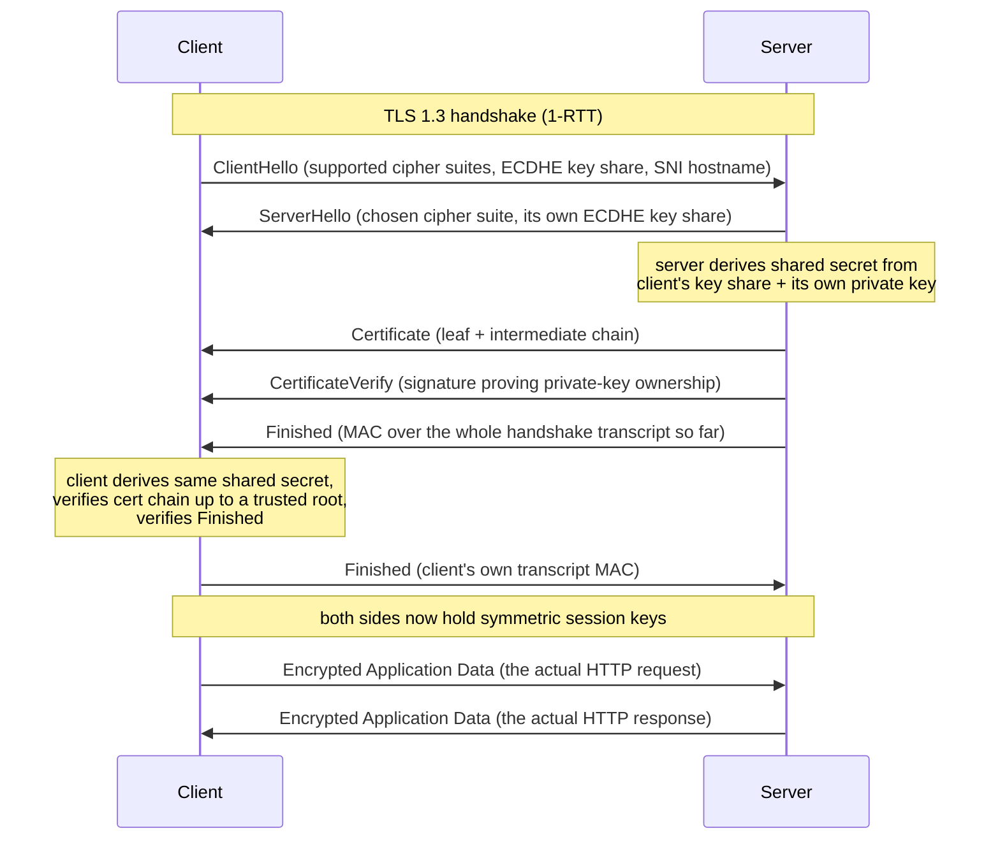

# HTTPS and the TLS Handshake

*Every RTT you have been counting so far (TCP's three-way handshake, HTTP/3's combined setup) was only half the cost of a real connection — TLS is the other half, and understanding exactly what it buys you is what turns "HTTPS is just HTTP but secure" into a precise, reasoned-from-primitives mental model.*

## Contents

- [What HTTPS and TLS are](#what-https-and-tls-are)
- [The three guarantees, and why TLS mixes two kinds of cryptography](#the-three-guarantees-and-why-tls-mixes-two-kinds-of-cryptography)
- [Certificates and PKI: the chain of trust](#certificates-and-pki-the-chain-of-trust)
- [The TLS 1.3 handshake, step by step](#the-tls-13-handshake-step-by-step)
- [TLS 1.2 vs TLS 1.3: why the newer handshake is faster](#tls-12-vs-tls-13-why-the-newer-handshake-is-faster)
- [0-RTT resumption and its replay caveat](#0-rtt-resumption-and-its-replay-caveat)
- [Where TLS gets terminated in real systems](#where-tls-gets-terminated-in-real-systems)
- [SNI: how one IP serves many HTTPS sites](#sni-how-one-ip-serves-many-https-sites)
- [Performance implications: stacking up the RTTs](#performance-implications-stacking-up-the-rtts)
- [mTLS in one paragraph](#mtls-in-one-paragraph)
- [Trade-offs and common confusions](#trade-offs-and-common-confusions)
- [Worked example: a fresh HTTPS request over TCP vs a resumed one over QUIC](#worked-example-a-fresh-https-request-over-tcp-vs-a-resumed-one-over-quic)
- [Connects to](#connects-to)
- [Check yourself](#check-yourself)
- [Real-world and sources](#real-world-and-sources)

## What HTTPS and TLS are

**HTTPS** is simply **HTTP running on top of TLS** instead of running directly on top of a bare transport connection. The HTTP semantics you already know (methods, status codes, headers, request/response) do not change at all — what changes is that every byte of the HTTP conversation is wrapped inside an encrypted, authenticated tunnel before it ever touches TCP (or, for HTTP/3, before it touches QUIC, which — as you saw in [06-http-versions.md](06-http-versions.md#http3-and-quic-moving-multiplexing-into-the-transport) — bakes TLS 1.3 directly into its own handshake rather than layering it on afterward).

**TLS (Transport Layer Security)** is the protocol that establishes that encrypted tunnel. It is the successor to **SSL (Secure Sockets Layer)** — SSL is deprecated and its last version (SSLv3) has been formally prohibited for years (`verify` exact deprecation dates per version); "SSL" survives today mostly as leftover terminology (SSL certificates, `openssl` the tool) even though the actual protocol running underneath is TLS. The current version in wide production use is **TLS 1.3 (RFC 8446, 2018)**; **TLS 1.2 (RFC 5246)** is still supported for compatibility but is being retired for anything security-sensitive.

**Where TLS sits.** As you saw in [01-osi-and-tcp-ip-models.md](01-osi-and-tcp-ip-models.md#points-of-confusion-and-trade-offs), TLS doesn't cleanly own one OSI layer — it conceptually matches **Presentation (Layer 6)** (it transforms the *format* of data — encrypting it — without caring about its *meaning*), but it's implemented as a library the application (or a proxy in front of it) calls, not as a separate OS kernel layer the way TCP is. The practical mental model: **TLS wraps the application data before handing it to TCP**, and unwraps it after receiving from TCP — it sits squarely between the transport and application layers in the TCP/IP model.

TLS gives a connection three concrete guarantees, and the rest of this file is essentially explaining how each one is delivered:

- **Confidentiality** — nobody eavesdropping on the wire can read the data (it's encrypted).
- **Integrity** — nobody can tamper with the data in transit without both sides detecting it.
- **Authentication** — the client can cryptographically verify it is really talking to the server it intended to reach, not an impostor.

## The three guarantees, and why TLS mixes two kinds of cryptography

Each guarantee maps to a specific cryptographic primitive:

- **Confidentiality → symmetric encryption.** A **symmetric cipher** uses the *same* secret key to encrypt and decrypt. It's computationally cheap and extremely fast — this is what actually encrypts every byte of your HTTP request/response bodies for the life of the connection. TLS 1.3 uses **AEAD (Authenticated Encryption with Associated Data)** ciphers exclusively — most commonly **AES-GCM** or **ChaCha20-Poly1305** — which do encryption and integrity-checking together in one operation, rather than as two separate steps (older TLS versions sometimes combined a cipher and a separate MAC, which was a historical source of subtle vulnerabilities like padding-oracle attacks, `verify` specific CVEs before citing).
- **Integrity → the "AD" in AEAD / MAC.** Every encrypted record carries an authentication tag computed over the ciphertext; if a single bit is altered in transit (by a bug, a misbehaving middlebox, or an attacker), the tag fails to verify and the receiver rejects the record outright rather than silently accepting corrupted data.
- **Authentication → asymmetric (public-key) cryptography, plus certificates.** An **asymmetric** scheme uses a *pair* of mathematically linked keys — a **public key** (shareable with anyone) and a **private key** (kept secret) — where data related via one key can only be meaningfully verified/unlocked using the other. This is what lets a server prove *"I possess the private key that matches the public key in this certificate, which a trusted authority vouches for"* without ever revealing that private key. TLS 1.3 uses **ECDHE (Elliptic-Curve Diffie-Hellman, Ephemeral)** for key agreement and typically RSA or ECDSA signatures inside the certificate for identity proof.

**The hybrid model — the single most important mechanical idea in this whole topic.** Asymmetric cryptography is 100-1000x more computationally expensive than symmetric cryptography (`verify` exact factor, it varies by algorithm/key size, but the gap is large and consistent across implementations) — using it to encrypt every byte of a multi-megabyte HTTP response would be painfully slow. So TLS never uses asymmetric crypto for the bulk data at all. Instead:

1. Asymmetric crypto (ECDHE key exchange, authenticated by the certificate's signature) is used **only once, briefly, at the start of the connection**, purely to let both sides agree on a shared secret without ever transmitting that secret in the clear.
2. That shared secret is then used to derive **symmetric session keys**, and every subsequent byte of actual application data (your HTTP request/response) is encrypted with fast symmetric AEAD ciphers using those keys.

This is exactly why "TLS is slow" is a myth about the *handshake*, not about ongoing encryption — once the symmetric keys are established, the cost of encrypting traffic is nearly negligible on modern CPUs (many even have hardware AES instructions). The handshake's round trips, not the encryption itself, are where TLS's latency cost actually lives.

## Certificates and PKI: the chain of trust

A certificate answers the authentication question: *how does the client know the public key it just received during the handshake really belongs to `example.com`, and not to an attacker who happens to be sitting in the middle of the connection?*

- **X.509 certificate** — the standard format for a digital certificate. At minimum it binds together: the **subject's identity** (the domain name(s) it's valid for), the subject's **public key**, a **validity period** (not-before/not-after dates), and a **digital signature** from whoever issued it, over all of the above. It says, in effect, "this public key belongs to this domain, and I — the issuer — vouch for that."
- **Certificate Authorities (CAs)** — trusted third-party organizations (`verify` current list of major public CAs) that issue certificates, but only after performing some level of verification that the requester actually controls the domain in question (**domain validation**, the baseline and most common level today) or, historically, the requester's organizational identity (**organization/extended validation**, largely fallen out of favor in modern browser UX, `verify`).
- **The chain of trust: root CA -> intermediate CA -> leaf (server) certificate.** CAs don't usually sign server certificates directly with their most sensitive key. Instead: a **root CA** certificate (self-signed, and pre-installed in every OS/browser's trusted **root store**) signs one or more **intermediate CA** certificates, and an intermediate signs the actual **leaf certificate** presented by the server you're connecting to. During the handshake, the server sends the leaf certificate plus the intermediate(s) needed to walk back up to a root the client already trusts; the client cryptographically verifies each signature in the chain, link by link, until it reaches a root already sitting in its trust store. If that chain doesn't validate — expired cert, wrong domain, untrusted root, broken link — the browser shows the "connection is not private" warning.
- **How the server proves it actually owns the private key** — not just that it has a copy of a certificate (certificates are public data, freely copyable). During the handshake, the server has to perform a cryptographic operation (signing the handshake transcript, or completing the ECDHE key exchange) that is only possible if it genuinely holds the private key matching the certificate's public key. An attacker who merely copied someone else's public certificate, without the private key, cannot complete this step and the handshake fails.

**What a certificate does NOT do.** A valid certificate proves *identity* ("this key belongs to `example.com`") — it says nothing about whether `example.com` is trustworthy, non-malicious, or well-run; a phishing site can perfectly legitimately hold a valid, correctly-issued certificate for its own look-alike domain. It also does not, by itself, encrypt anything — the certificate is just a signed statement; the actual encryption happens afterward using keys the handshake derives.

**Revocation** — what happens if a private key is compromised before the certificate expires. Mechanisms include **CRLs (Certificate Revocation Lists)** and **OCSP (Online Certificate Status Protocol)**, both used to let a client check "has this certificate been revoked early?" `verify` current adoption/reliability of these mechanisms and any modern replacements (e.g. OCSP stapling) — deep certificate lifecycle management is covered further in the L9 security level.

## The TLS 1.3 handshake, step by step

TLS 1.3's headline architectural win is that it completes in **1 round trip (1-RTT)** before either side can send encrypted application data — down from TLS 1.2's 2-RTT handshake (next section). Here is the flow:



Walking through it in plain language:

1. **ClientHello** — the client opens by proposing which cipher suites it supports, and critically, sends its **ECDHE key share** immediately (a guess-ahead optimization: TLS 1.3 assumes the server will pick one of a small set of standard key-exchange groups, so the client just sends a key share for the most likely one upfront instead of waiting to be told which to use). The ClientHello also carries the target hostname in cleartext via **SNI** (covered below).
2. **ServerHello** — the server picks a cipher suite, replies with its own ECDHE key share. At this point, **both sides can independently compute the same shared secret** (this is the core Diffie-Hellman property: each side combines its own private half with the other side's public key share to arrive at an identical shared value neither ever transmitted directly).
3. **Certificate + CertificateVerify + Finished** — the server sends its certificate chain, a signature proving it holds the matching private key, and a `Finished` message (a MAC over everything exchanged so far, proving neither message was tampered with in transit) — the server can actually send all of this **already encrypted** using keys derived from the just-established shared secret, since the shared secret exists after just one exchange.
4. **Client verification** — the client validates the certificate chain up to a trusted root in its store, checks the domain name matches, verifies the signature and the `Finished` MAC, then sends its own `Finished` message.
5. **Application data flows** — from this point, both sides hold identical symmetric session keys and every subsequent byte (the actual HTTP request/response) is encrypted with the fast AEAD cipher agreed on in step 2. Total cost: **1 RTT** before the first byte of real application data can be sent.

## TLS 1.2 vs TLS 1.3: why the newer handshake is faster

TLS 1.2's handshake required **2 full round trips** before application data could flow: one round trip to negotiate which cipher suite and key-exchange method to use at all (`ClientHello` -> `ServerHello` with the server's chosen parameters, only *then* proceeding to exchange keys), and a second round trip to actually perform the key exchange and certificate verification. TLS 1.3 collapses this into one round trip mainly by having the client **guess and send its key share speculatively in the very first message** (as described above) instead of waiting for the server to first announce which key-exchange group it wants — removing an entire negotiation-then-react round trip. TLS 1.3 also removed a long list of legacy, insecure options entirely (older ciphers, compression, renegotiation, non-forward-secret static RSA key exchange), which both simplifies the protocol and closes off a number of historical attack classes, `verify` complete list against RFC 8446 if citing specifics.

| | TLS 1.2 | TLS 1.3 |
|---|---|---|
| Handshake RTTs before app data | 2 RTT | 1 RTT |
| Resumption RTTs | 1 RTT (session tickets/IDs) | 0-RTT possible (with replay caveat, below) |
| Forward secrecy | Optional (depended on cipher suite chosen) | Mandatory (every handshake uses ephemeral ECDHE) |
| Allowed ciphers | Broad, including several since deprecated as insecure | Narrow, AEAD-only, modern |

## 0-RTT resumption and its replay caveat

If a client has connected to a server recently, it can cache a **pre-shared key (PSK)** derived from that earlier session. On a repeat connection, TLS 1.3 lets the client send **encrypted application data in the very first flight of packets**, bundled alongside the ClientHello, before any handshake round trip actually completes — this is the **0-RTT** mode you first met in [06-http-versions.md](06-http-versions.md#http3-and-quic-moving-multiplexing-into-the-transport) as part of QUIC's combined handshake.

**The catch: 0-RTT data is replayable.** Because there's no fresh, live round trip confirming the connection is genuine and current before this data is processed, an attacker who captures that first 0-RTT flight off the wire can **resend the exact same encrypted packet later**, and — absent extra server-side protection — the server may process it a second time, since from the server's perspective the ciphertext is valid and decrypts correctly (it's a replay, not a forgery; the attacker doesn't need to break the encryption, just resend it). 0-RTT data also lacks **forward secrecy** relative to that PSK for its very first flight in the way the rest of the connection has once the full handshake completes. For this reason, 0-RTT is generally considered safe only for **idempotent** requests (safe to receive and process more than once, e.g. a `GET` that just reads data) — sending a non-idempotent operation (e.g. "charge this card," "submit this order") as 0-RTT data risks it being executed twice if replayed. `verify` exact mitigation mechanisms (e.g. anti-replay caches, single-use tickets) and how strictly production servers enforce idempotency-only 0-RTT.

## Where TLS gets terminated in real systems

**TLS termination** means the point in the request path where the encrypted TLS connection is actually decrypted back into plain HTTP. In production, this is very often *not* the origin application server itself:

- **Termination at a load balancer / reverse proxy / CDN edge** (forward-ref dedicated load balancer, reverse proxy, and CDN topics) — the edge device holds the certificate and private key, completes the TLS handshake with the client, and then forwards the now-decrypted HTTP request onward, often over a plain or separately-encrypted connection to backend origin servers. This is extremely common because it **offloads the CPU cost of the handshake and encryption** away from application servers (letting them scale purely on business logic), centralizes certificate management to one place instead of every backend instance, and lets the edge inspect Layer 7 content (path-based routing, WAF rules, header rewriting) — which it structurally cannot do if the traffic stays encrypted past it.
- **End-to-end encryption to the origin** — some architectures re-encrypt (a fresh TLS session) between the edge and each backend, or run TLS all the way to the origin without terminating early at all, trading the CPU/simplicity win above for stronger guarantees that no internal hop ever sees plaintext — relevant for compliance-sensitive traffic (payments, health data) where "trust the internal network" is not an acceptable assumption.

## SNI: how one IP serves many HTTPS sites

Before TLS can even select which certificate to present, it needs to know *which* domain the client is trying to reach — because a single server (or, more commonly today, a single load-balancer IP) often hosts many unrelated HTTPS domains, each with its own certificate, the same way HTTP/1.1's `Host` header enabled virtual hosting for plaintext HTTP (see [06-http-versions.md](06-http-versions.md#http11-persistent-connections-and-the-pipelining-that-failed)). **SNI (Server Name Indication)** is a TLS extension that lets the client include the target hostname directly in the **ClientHello** — in cleartext, *before* encryption is established (it has to be readable pre-handshake, since the server needs it to decide which certificate to even offer). This is what lets a CDN or load balancer terminating thousands of distinct customer domains on one IP address route each incoming TLS handshake to the right certificate/backend before the connection is even encrypted.

The practical privacy implication: because classic SNI is sent unencrypted, anyone observing the network (an ISP, a network operator, an on-path attacker) can see *which hostname* a client is connecting to, even though they cannot see anything about the actual HTTP request/response content once the handshake completes. **Encrypted Client Hello (ECH)** is an evolving extension designed to close this specific gap by encrypting the SNI field itself — `verify` current standardization/deployment status, as adoption is still uneven across browsers and servers.

## Performance implications: stacking up the RTTs

This is where every prior L1 topic's RTT accounting comes together. For a brand-new HTTPS connection over TCP:

```
TCP handshake (1 RTT)  +  TLS 1.3 handshake (1 RTT)  =  ~2 RTTs before the first HTTP request byte is sent
```

(TLS 1.2 would make this ~3 RTTs total, given its 2-RTT handshake.) Over a mobile connection with, say, 50-100ms RTT to a nearby edge (numbers vary hugely by geography and network — `verify` before quoting as fact for any specific scenario), that's 100-200ms of pure setup latency paid *before any actual content is requested*, on every fresh connection.

Two things claw this cost back in practice:

- **Connection reuse / keep-alive** — pay the TCP + TLS handshake cost once, then reuse the same connection (and HTTP/2's or HTTP/3's multiplexing, per [06-http-versions.md](06-http-versions.md#http2-one-connection-multiplexed-streams)) for many subsequent requests, amortizing the setup cost across all of them.
- **TLS session resumption** (session tickets / PSK) and **0-RTT** — a returning client skips most or all of the handshake round trip on a repeat connection, as described above.

**QUIC/HTTP-3 collapses the whole picture further**: because TLS 1.3 is built directly into QUIC's own handshake rather than layered on afterward, a fresh QUIC connection needs only **~1 RTT total** for both transport and crypto setup combined (versus TCP+TLS's ~2 RTTs stacked sequentially), and 0-RTT resumption applies to the *entire* connection, not just the TLS portion — exactly the number you were given in [06-http-versions.md](06-http-versions.md#http3-and-quic-moving-multiplexing-into-the-transport) and can now fully explain the mechanics behind.

## mTLS in one paragraph

Everything above describes **one-way authentication**: the client verifies the server's certificate, but the server has no cryptographic proof of who the client is (application-level auth like passwords/tokens happens separately, at L7, after the TLS tunnel is already up). **mTLS (mutual TLS)** flips this around so *both* sides present certificates during the handshake — the server also verifies a client certificate before proceeding. This is rarely used for public browser-facing traffic (nobody wants end users managing personal certificates) but is a common pattern for **service-to-service authentication** inside a backend (microservice A proving its identity to microservice B without a shared secret token), frequently enforced automatically by a **service mesh** (forward-ref) and a common default for gRPC service-to-service calls. Deep mechanics of certificate issuance/rotation for mTLS at scale belong to the L9 security level.

## Trade-offs and common confusions

| Confusion | Reality |
|---|---|
| "HTTPS hides everything about my connection" | The SNI hostname (classic, non-ECH) and the destination IP address are still visible to network observers; only the HTTP content itself (path, headers, body) is encrypted |
| "A valid certificate means the site is safe" | A certificate proves *identity* (this key belongs to this domain), not trustworthiness — phishing sites can hold perfectly valid certificates for their own domains |
| "TLS is slow" | The ongoing symmetric encryption of bulk data is nearly free on modern CPUs; the actual cost is the handshake's round trips and the (comparatively expensive) asymmetric operations run once at setup |
| "TLS 1.2 and 1.3 are basically the same, just a version bump" | TLS 1.3 cut the handshake from 2 RTT to 1 RTT, made forward secrecy mandatory, and removed a long list of legacy insecure options — meaningfully different, and upgrading matters |
| "Terminating TLS at the edge/CDN is always fine" | It offloads CPU and enables L7 inspection, but means the edge (and anything between edge and origin) sees plaintext unless a second encrypted hop is added — a real trade-off for compliance-sensitive data |

✅ What TLS 1.3 buys you: 1-RTT handshakes, mandatory forward secrecy, a much smaller/safer set of allowed ciphers, optional 0-RTT for latency-critical resumed connections.
❌ What it costs: the handshake still adds real RTT-bound latency on every fresh connection (mitigated but not eliminated by resumption); 0-RTT trades some safety (replay risk) for speed and is only appropriate for idempotent operations; certificate lifecycle (issuance, rotation, revocation) is genuine ongoing operational overhead (forward-ref L9).

## Worked example: a fresh HTTPS request over TCP vs a resumed one over QUIC

A user opens an app for the first time today (fresh connection, no cached session) versus reopening it an hour later (server still has session state cached), both over a network with ~60ms RTT to the nearest edge:

- **First open, HTTP/2 over TCP+TLS 1.3:** TCP handshake (1 RTT, ~60ms) -> TLS 1.3 handshake (1 RTT, ~60ms) -> first HTTP request sent -> response arrives (1 more RTT, ~60ms). Total: **~180ms** before the user sees any data, purely from setup + one request/response round trip.
- **Reopen an hour later, same stack, TLS session resumed but no 0-RTT used:** TCP handshake (1 RTT, still required — TCP itself has no resumption) -> abbreviated TLS resumption using a cached PSK, but still needs its own round trip confirmation in a conservative deployment -> request/response (1 RTT). Cost is reduced (fewer asymmetric operations, no full certificate re-verification) but RTT count may only drop modestly depending on exact resumption mode used.
- **Reopen an hour later, HTTP/3 over QUIC with 0-RTT:** the client sends its first HTTP request **in the very first flight of packets**, using the cached PSK — server processes it (assuming it's an idempotent `GET`) and responds. Total: **as low as ~60ms** (essentially one RTT for the response), because transport setup, crypto handshake, and the first request are all collapsed into the same initial exchange. This is the concrete, three-way payoff of everything this file and [06-http-versions.md](06-http-versions.md) built up to: TCP+TLS's sequential ~2-3 RTT setup, shrunk to ~1 RTT fresh and effectively ~0 extra RTT on a 0-RTT resumed QUIC connection.

## Connects to

- **Back to [04-tcp.md](04-tcp.md)** — TLS's handshake stacks sequentially on top of TCP's own three-way handshake for HTTP/1.1 and HTTP/2; the RTT-counting habit from that topic is exactly what this file builds on.
- **Back to [06-http-versions.md](06-http-versions.md#http3-and-quic-moving-multiplexing-into-the-transport)** — HTTP/3's "TLS 1.3 built directly into QUIC" claim is now fully explained mechanically: this file *is* that mechanism.
- **Forward to load balancers, reverse proxies, and API gateways (L1)** — TLS termination is a core design decision made at exactly these components.
- **Forward to CDNs (L1/L11)** — CDN edge nodes are the most common real-world place both TLS and QUIC handshakes actually terminate closest to the user.
- **Forward to L9 (Security)** — authN/authZ built on top of an established TLS tunnel, certificate lifecycle/key management at scale, mTLS in service meshes, and deeper cryptographic attack/defense detail all live there; this file only covers transport-level mechanics.
- **Forward to gRPC (L10)** — gRPC commonly runs over HTTP/2 with TLS (and frequently mTLS) as its default secure transport.

## Check yourself

- Explain the hybrid crypto model in one sentence: why does TLS use asymmetric cryptography at all if it's so much slower than symmetric, and why doesn't it use asymmetric crypto for the whole session?
- A certificate chain fails to validate because the client's root store doesn't recognize the issuing CA. Walk through exactly which step of the TLS 1.3 handshake diagram this failure would be caught at, and what the client does next.
- Why is TLS 1.3's handshake 1-RTT while TLS 1.2's is 2-RTT — what specific change in the ClientHello made the difference?
- A payments API is considering enabling 0-RTT for a "resend receipt" endpoint versus a "charge card" endpoint. Which one is safe to serve over 0-RTT, and why?
- Why does terminating TLS at a CDN edge instead of the origin server help performance, and what security trade-off does a team accept by doing so?

## Real-world and sources

**Let's Encrypt / ISRG — PKI automation at internet scale (ties to "Certificates and PKI").** Let's Encrypt co-created and standardized the **ACME protocol (RFC 8555)** specifically to make domain-validated certificate issuance and renewal fully automatable instead of a manual per-server process. As of their 10-year retrospective (published December 2025), Let's Encrypt was issuing over **ten million certificates per day** (a milestone first hit in late September 2025), building on a trajectory of 1 million certificates issued by March 2016, 1 million/day by September 2018, and a cumulative 1 billion certificates by 2020 — concrete evidence that automating the "chain of trust" issuance step (rather than eliminating it) is what let HTTPS become the web-wide default rather than a manual, CA-by-CA bottleneck. *As of December 2025.*

**Cloudflare — 0-RTT in production and its replay mitigations (ties to "0-RTT resumption and its replay caveat").** Cloudflare's engineering blog on introducing 0-RTT confirms the exact mechanism this file describes — requests sent during 0-RTT resumption are replayable because the server has no live round trip to confirm freshness — and documents the concrete production mitigations layered on top: Cloudflare **only serves 0-RTT for GET requests without query parameters** (the idempotent case this file calls out), enforces size and replay-window limits on 0-RTT requests, and tags each 0-RTT request with a unique identifier (`Cf-0rtt-Unique`, derived from the PSK binder) so origins can detect duplicate replays themselves. This is a direct, verified illustration of "0-RTT is only appropriate for idempotent operations" being enforced as a hard platform rule, not just a recommendation.

**AWS Certificate Manager (ACM) — certificate issuance folded into edge/LB TLS termination (ties to "Where TLS gets terminated in real systems").** AWS's ACM documentation describes exactly the "termination at a load balancer / CDN edge" pattern: ACM provisions and automatically renews public TLS certificates (renewal begins up to 60 days before expiry) and deploys them directly onto **Elastic Load Balancers, CloudFront distributions, and API Gateway** — the edge/LB components that hold the private key and complete the client-facing handshake. AWS's own CloudFront/ALB docs state plainly that "the ALB terminates TLS at the load balancer... and forwards plain HTTP to your backend targets," matching this file's edge-termination-for-offload pattern; CloudFront's origin mTLS feature (backed by ACM-imported client certificates with an Extended Key Usage of TLS Client Authentication) is a concrete, documented case of the mutual-TLS pattern described above, applied to the edge-to-origin hop rather than end users.

### Sources / further reading

- [10 Years of Let's Encrypt Certificates](https://letsencrypt.org/2025/12/09/10-years) — Let's Encrypt, accessed 2026-07-07
- [RFC 8555 — Automatic Certificate Management Environment (ACME)](https://www.rfc-editor.org/rfc/rfc8555) — IETF
- [Introducing Zero Round Trip Time Resumption (0-RTT)](https://blog.cloudflare.com/introducing-0-rtt/) — Cloudflare Blog, accessed 2026-07-07
- [An overview of TLS 1.3 and Q&A](https://blog.cloudflare.com/tls-1-3-overview-and-q-and-a/) — Cloudflare Blog
- [RFC 8446 — The Transport Layer Security (TLS) Protocol Version 1.3](https://www.rfc-editor.org/rfc/rfc8446) — IETF
- [AWS Certificate Manager FAQs](https://aws.amazon.com/certificate-manager/faqs/) — AWS, accessed 2026-07-07
- [Certificate management with AWS Certificate Manager (CloudFront origin mTLS)](https://docs.aws.amazon.com/AmazonCloudFront/latest/DeveloperGuide/origin-certificate-management-certificate-manager.html) — AWS Docs, accessed 2026-07-07
