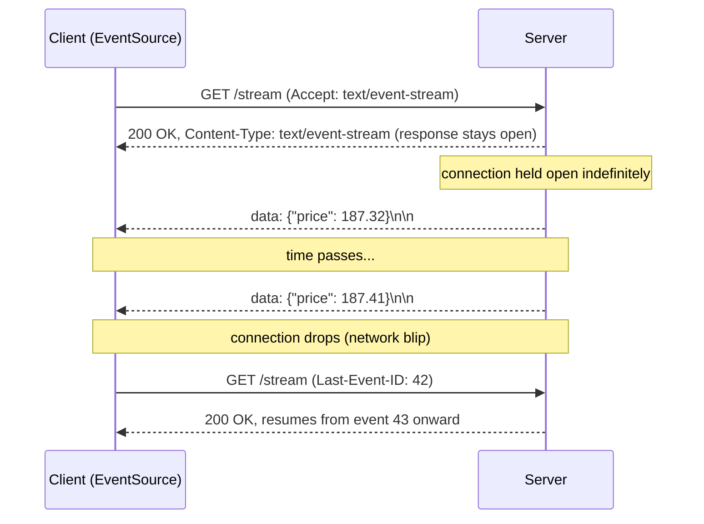
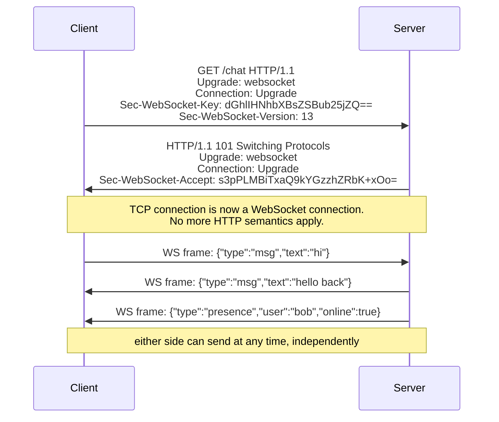

# WebSockets, SSE, and Long Polling: Making the Server Speak First

*Every request/response model you have studied so far shares one hard rule: the client must ask before the server can answer — this file is about the ladder of tricks and protocols built specifically to break that rule so a server can push data the instant it exists.*

## Contents

- [The core problem: HTTP cannot push](#the-core-problem-http-cannot-push)
- [Short polling: the naive baseline](#short-polling-the-naive-baseline)
- [Long polling: hold the request open](#long-polling-hold-the-request-open)
- [Server-Sent Events: a one-way stream over plain HTTP](#server-sent-events-a-one-way-stream-over-plain-http)
- [WebSockets: a real full-duplex channel](#websockets-a-real-full-duplex-channel)
- [Comparison table: choosing the right tool](#comparison-table-choosing-the-right-tool)
- [Scaling and operational reality](#scaling-and-operational-reality)
- [Adjacent mechanisms: gRPC streaming, HTTP/2 push, WebRTC](#adjacent-mechanisms-grpc-streaming-http2-push-webrtc)
- [Trade-offs and common confusions](#trade-offs-and-common-confusions)
- [Worked example: a chat message from Alice to Bob](#worked-example-a-chat-message-from-alice-to-bob)
- [Connects to](#connects-to)
- [Check yourself](#check-yourself)
- [Real-world and sources](#real-world-and-sources)

## The core problem: HTTP cannot push

Every version of HTTP you studied in [06-http-versions.md](06-http-versions.md) — 1.1, 2, 3 — shares one unbroken rule at the application-semantics level: it is **request/response**. The client sends a request; the server may only ever reply to that specific request. The server has no mechanism to spontaneously say "hey, something changed" unless the client has already asked and is still listening.

A few precise terms, since they get conflated constantly:

- **Pull** — the client initiates: "give me an update if there is one." This is all plain HTTP can natively do.
- **Push** — the server initiates: "here is an update," without the client having to ask again first. HTTP has no native concept of this; every technique in this file is a way of *simulating or genuinely achieving* push on top of a substrate that fundamentally does not have it.
- **Server-initiated** — synonym for push, emphasizing *who* starts the exchange.
- **Half-duplex** — data can flow in only one direction at a time on a given logical exchange (even if the underlying TCP connection is technically full-duplex at the packet level, the *application protocol* riding on it — classic HTTP request/response — only lets one side "talk" per exchange).
- **Full-duplex** — both sides can send data **independently and simultaneously**, with no strict turn-taking. This is what WebSockets adds that HTTP structurally lacks.
- **Real-time (as used here)** — low-latency push, i.e. "the user sees the update within a small, bounded number of milliseconds to a few seconds of it occurring on the server." This is *not* hard real-time in the embedded-systems sense (a guaranteed deadline enforced by the system) — it is a best-effort latency goal, not a guarantee.

Why does this matter? Think about the concrete problems this actually blocks: a chat app where Bob should see Alice's message the instant she sends it, a stock ticker that should update the second a price changes, a live sports score, a notification bell, or two people editing the same document simultaneously. None of these fit "client asks, server answers once" — the *event* that matters originates on the server (or on another client, relayed through the server) at an unpredictable time, and the receiving client has no way to know when to ask.

Every technique below is a rung on a ladder, each one getting closer to true, low-overhead, low-latency push — and each one paying a different cost to get there.

## Short polling: the naive baseline

The simplest possible answer: make the client ask over and over, on a timer.

```
Client                          Server
  |--- GET /messages/new ------->|
  |<-- 200 [] (nothing new) -----|
  (wait 3s)
  |--- GET /messages/new ------->|
  |<-- 200 [] (nothing new) -----|
  (wait 3s)
  |--- GET /messages/new ------->|
  |<-- 200 [{msg}] --------------|   <- update finally arrives, up to 3s late
```

**How it works:** the client sets an interval (e.g. `setInterval`, every 2-5 seconds) and issues a normal, ordinary HTTP request each time, asking "anything new since my last check?" The server answers immediately with either an empty result or whatever changed, and the connection closes (or is reused via keep-alive, but the request/response cycle itself completes instantly either way).

**Why it's tempting:** it requires zero special infrastructure. It's literally just repeated `GET` requests — works through every proxy, firewall, and corporate network ever built, trivial to implement, trivial to reason about, trivial to debug (it's just HTTP).

**The problem it leaves open:** two costs compound against each other and can't be tuned away simultaneously:

- **Latency is bounded by the poll interval** — if you poll every 5 seconds, a message can sit unseen for up to 5 seconds even in the best case, and the update only ever arrives *on the next scheduled tick*, never sooner. Poll more frequently and latency improves, but...
- **Load scales with clients x frequency, almost entirely wasted** — with 10,000 connected clients polling every 3 seconds, that's ~3,333 requests/second hitting the server *even when nothing has changed for the overwhelming majority of them*. Nearly every one of those responses is an empty "nothing new," yet each one still pays a full HTTP request's overhead (headers, TLS/TCP if a fresh connection, server-side routing and often a database lookup just to say "no update"). This is fundamentally wasteful: the server does real work to answer "no" far more often than it ever answers "yes."

Short polling never actually solves the push problem — it just resells the *pull* model at a finer time granularity, and you pay for that granularity in server load and network chatter regardless of whether anything happened. It remains genuinely fine for low-frequency, low-stakes needs (e.g. checking build status every 30 seconds), but chat, tickers, and presence need something structurally better.

## Long polling: hold the request open

The first real trick, and the classic pre-WebSocket fallback: instead of the server answering instantly with "nothing yet," it **holds the request open and delays the response** until there actually is something to say (or a timeout is hit).

```
Client                                  Server
  |--- GET /messages/poll -------------->|
  |         (server holds the request open, no response yet)
  |         ... time passes, nothing to send yet ...
  |         ... new message arrives! ...
  |<-- 200 [{msg}] -----------------------|   <- responds the instant data exists
  |--- GET /messages/poll -------------->|   <- client immediately reconnects
  |         (holds again...)
```

**How it works internally:** the client issues an ordinary HTTP request exactly like short polling, but the server, instead of checking a database and replying in milliseconds, **does not send a response right away**. The server-side request handler is parked (often on a dedicated thread, or registered as a callback/promise against some internal event source) waiting for either (a) new data to become available, at which point it immediately writes the response and the TCP connection's request/response cycle completes, or (b) an internal timeout (commonly 20-60 seconds, `verify` typical production values, tunable) expires, at which point the server sends an empty response anyway just to avoid an intermediary or client silently killing an indefinitely-idle connection. The instant the client receives any response — data or empty timeout — it immediately opens a brand new long-poll request to keep the cycle going.

**Why it's a genuine step forward:** compared to short polling, near-real-time delivery becomes possible — the client finds out about new data essentially the moment the server has it, not on the next scheduled tick — while still using nothing but plain HTTP requests, which is exactly why long polling became the classic universal fallback: it works through virtually any proxy, firewall, or ancient corporate network gear that has ever correctly implemented HTTP, unlike the newer mechanisms below which some old intermediaries mishandle.

**What it costs:**

- **A held connection per client, for the duration of each poll cycle** — the server must keep a request (and usually a thread, coroutine, or event-loop callback, plus whatever memory the framework allocates per in-flight request) parked open per connected client, for up to the whole timeout window. This is real, ongoing server-side resource pressure that scales with concurrently connected clients, not with message volume — the same *shape* of cost real push mechanisms have (see [Scaling and operational reality](#scaling-and-operational-reality)), just paid clumsily through repeated HTTP requests instead of one persistent connection.
- **Reconnect overhead on every single message** — each time data arrives, the current long-poll request completes, and the client must immediately establish a *new* HTTP request (a new TCP connection if not reusing keep-alive, headers resent from scratch, and if HTTPS, potentially a fresh TLS negotiation depending on connection reuse) before it can receive the *next* message. Under a burst of many rapid messages, this reconnect churn is a real, compounding cost that a genuinely persistent connection avoids entirely.
- **Ordering and gaps between reconnects** — there is a small window, between one long-poll response completing and the next one being established, during which the server could have new data with literally nobody listening yet. Production long-polling implementations have to carefully buffer/queue messages generated during that gap (and often pass some kind of cursor/sequence token, so the next poll can say "give me everything since sequence #4821") to avoid silently dropping updates. This is meaningfully trickier to get right than it first appears.

Long polling is the classic fallback used when a client or intermediary cannot support the newer mechanisms below — genuinely useful, still seen in production, but strictly a workaround built entirely out of ordinary HTTP request/response semantics, not a real push channel.

## Server-Sent Events: a one-way stream over plain HTTP

**Server-Sent Events (SSE)** is the first mechanism on this ladder that is a *real* streaming push channel rather than a repeated-request trick — but it is deliberately, structurally **one-way: server to client only**.

**What it is, precisely:** the client opens a single HTTP request (via the browser's built-in `EventSource` API, or manually), and the server responds with `Content-Type: text/event-stream` and then **never closes the response body** — instead it keeps the connection open and writes new events onto that same response stream as they occur, indefinitely. Each event is a simple, UTF-8 text format:

```
data: {"price": 187.32}

data: {"price": 187.41}
event: alert
data: {"msg": "price spike detected"}

```

(a blank line terminates each event; an optional `event:` field names the event type, and an optional `id:` field tags it with a resumption ID — see below.)



**Auto-reconnect and resumption are built into the browser's `EventSource` API itself**, not something the application has to hand-roll: if the connection drops, the browser automatically reissues the request after a short delay, and — if the server has been tagging events with an `id:` field — it automatically includes a `Last-Event-ID` header on the reconnect, so a well-built server can resume the stream exactly where it left off instead of the client silently missing whatever happened during the gap. This is a meaningfully better experience than long polling's hand-rolled reconnect-and-hope-you-didn't-miss-anything logic.

**Why it's genuinely good for its niche:** feeds, notifications, live scores, stock tickers, log-tailing dashboards — anything that is purely "server has updates, client just needs to receive them" fits SSE cleanly, using nothing more exotic than a long-lived plain HTTP/HTTPS response. It's simple to implement on the server (in many frameworks, just "don't close the response, keep writing to it"), simple to consume on the client (`new EventSource(url)`, listen for `message` events), and rides ordinary HTTP infrastructure, so it works through most proxies/load balancers without special configuration.

**Its real limits:**

- **One-way only.** SSE gives the server a channel to push to the client; if the client needs to send anything back (a chat message, a command), that still has to go over a completely separate, ordinary HTTP request. This is a very common point of confusion — SSE is *not* a general bidirectional real-time channel, it is specifically and only a server-to-client stream.
- **Text-only.** The `text/event-stream` format is UTF-8 text by design; if you need to push binary data (audio frames, compressed payloads), you must base64-encode it into text first, which is wasteful, or reach for WebSockets instead.
- **The old per-origin connection ceiling bites under HTTP/1.1.** As you saw in [06-http-versions.md](06-http-versions.md#the-browsers-workaround-6-connections-per-origin-and-the-hacks-it-forced), browsers historically cap concurrent connections to one origin at roughly 6. An SSE stream occupies one of those slots **for its entire lifetime**, so a page with several SSE streams open plus ordinary page requests can genuinely exhaust that ceiling and start blocking other requests to the same origin. This exact problem is solved by HTTP/2's multiplexing (one physical connection, many logical streams — see [06-http-versions.md](06-http-versions.md#http2-one-connection-multiplexed-streams)): serving SSE over an HTTP/2 (or HTTP/3) connection removes the per-origin ceiling entirely, since the long-lived SSE stream is just one multiplexed stream among many on the same connection, not a whole connection by itself.

## WebSockets: a real full-duplex channel

**WebSockets (RFC 6455)** is the answer when you genuinely need **both sides talking, at any time, with low overhead per message** — chat, multiplayer games, collaborative editing, trading interfaces, live cursors.

**What it is, precisely:** a WebSocket connection begins life as a completely ordinary HTTP/1.1 request, then **upgrades** into an entirely different, lightweight, message-framed protocol running on the *same* underlying TCP connection. After the upgrade completes, the two sides are no longer speaking HTTP at all — they exchange small binary or text **frames** directly over TCP, and **either side can send a frame at any moment**, independent of the other — genuine full-duplex.

**The Upgrade handshake, step by step:**



1. **The client sends a normal-looking `GET` request** but with a specific set of headers: `Upgrade: websocket`, `Connection: Upgrade`, a randomly generated `Sec-WebSocket-Key`, and a version number. This is a real HTTP request, and any intermediary that doesn't understand the Upgrade mechanism would just see an ordinary `GET`.
2. **The server responds `101 Switching Protocols`** (a status code that exists specifically for this purpose) rather than a normal `200`, echoing back a `Sec-WebSocket-Accept` value computed deterministically from the client's key (a simple hash-based proof that this server actually understood and honored the WebSocket handshake, not a security credential in the TLS sense).
3. **From this exact point, the connection is no longer HTTP at all.** The same TCP socket that carried the HTTP upgrade request is now repurposed to carry raw WebSocket frames — small binary-framed messages with a minimal header (a few bytes indicating frame type — text, binary, ping, pong, close — and payload length) and very little overhead compared to an HTTP request's headers. Because the connection stays open and both peers hold a live socket, **either side can write a frame at any time, without waiting to be asked** — this is the structural change that makes push (and full-duplex conversation generally) actually native, not simulated.
4. **`wss://`** is WebSocket over TLS, exactly analogous to `http://` vs `https://` — the TLS handshake happens first (per [07-https-tls.md](07-https-tls.md#the-tls-13-handshake-step-by-step)), and the Upgrade request/response above then travels encrypted, same as any other HTTPS traffic.
5. **Heartbeats (ping/pong frames)** are part of the WebSocket protocol itself and are commonly used to detect a silently-dead connection (a mobile client whose network vanished without a clean TCP close) — since the protocol is no longer classic HTTP with clear request/response cycles, the two sides need their own liveness check.

**Why it's the strongest tool here:** near-zero per-message overhead (a handful of bytes of framing versus a full set of HTTP headers per exchange), true bidirectionality, and low latency — once the connection is up, sending a message is just "write a frame," no request/response round trip structure at all.

**What it costs:**

- **It is a long-lived, stateful connection**, which is a fundamentally different operational shape than stateless HTTP request/response. A load balancer terminating a WebSocket connection must keep routing every subsequent frame on that connection to the *same* backend server for the connection's entire life — this is exactly the **sticky session** problem (forward-ref load balancers), and it is structurally harder to scale horizontally, drain gracefully during a deploy, or fail over than stateless request-per-call HTTP, because "just retry against any healthy server" doesn't work — the state (who is this socket, what room/channel are they in) lives on one specific server process.
- **You must build your own reconnect, heartbeat, and message-ordering/delivery-guarantee logic** on top of the raw protocol — unlike SSE's `EventSource`, which gives you auto-reconnect and `Last-Event-ID` resumption for free, WebSockets hand you a bare bidirectional pipe and nothing else; if the connection drops, detecting that, reconnecting, and figuring out what was missed is entirely the application's job.
- **Authentication has to be handled explicitly**, typically by passing a token during the initial HTTP Upgrade request (query parameter, header, or cookie) since there is no per-message request cycle afterward in which to reattach normal HTTP auth headers (deep mechanics in L9).
- **Not every intermediary handles the Upgrade cleanly.** Some older proxies, corporate firewalls, and load balancers either don't support the `Upgrade` header path at all or apply aggressive idle-connection timeouts designed for short-lived HTTP requests, which will silently kill a WebSocket connection that goes quiet for a while — heartbeats exist partly to keep such intermediaries from thinking the connection is dead.

## Comparison table: choosing the right tool

| | **Short polling** | **Long polling** | **SSE** | **WebSockets** |
|---|---|---|---|---|
| **Direction** | Client pull only | Client pull, held open (near-push) | Server -> client (one-way push) | Bidirectional (full-duplex) |
| **Transport** | Repeated plain HTTP requests | Repeated plain HTTP requests, held open | Single long-lived HTTP response (`text/event-stream`) | Upgraded TCP connection, own framed protocol |
| **Real-time-ness** | Bounded by poll interval (seconds) | Near-instant (limited by reconnect gap) | Near-instant | Near-instant, lowest overhead |
| **Overhead per update** | High (full HTTP request/response every poll, mostly empty) | Medium (full reconnect per message) | Low (tiny text frame on an already-open stream) | Very low (few bytes of binary framing) |
| **Complexity to implement** | Trivial | Moderate (timeout/reconnect/gap handling) | Low-moderate (browser gives auto-reconnect) | Higher (must build reconnect, heartbeat, auth yourself) |
| **Auto-reconnect** | N/A (each poll is independent) | Manual (application-driven) | Built into `EventSource` | Manual (application-driven) |
| **Binary support** | Yes (normal HTTP body) | Yes (normal HTTP body) | No (UTF-8 text only) | Yes (native binary frames) |
| **Works through old proxies/legacy infra** | Yes, universally | Yes, universally | Mostly (HTTP-based) | Not always (Upgrade not always supported) |
| **Typical use case** | Infrequent/low-stakes checks (build status) | Legacy fallback when nothing else is supported | Notifications, feeds, live scores, log tailing | Chat, multiplayer games, collaborative editing, trading |

**How to choose, as a quick heuristic:**

- Need **bidirectional**, low-latency, high-frequency messaging? -> **WebSocket**.
- Only need **server-to-client** updates, and never binary? -> **SSE** (simpler, gets auto-reconnect for free, and doesn't need the operational complexity of a stateful bidirectional protocol).
- Must work absolutely everywhere, including hostile legacy infrastructure, and near-real-time is good enough? -> **Long polling**.
- Updates are infrequent and staleness of a few seconds/minutes is fine? -> **Short polling** — don't over-engineer a trivial need.

## Scaling and operational reality

Everything above described the *protocol*. Running millions of these connections in production surfaces a different set of problems, at the concept level here (deep mechanics live in their forward-ref'd levels):

- **The C10K/C10M problem.** A stateless HTTP request completes in milliseconds and its resources are released immediately; a WebSocket or SSE connection is held open for minutes, hours, or an entire user session, meaning the server must keep **per-connection memory and state** (socket buffers, application-level session data, subscribed channels) alive for as long as the client stays connected. Serving 10,000 concurrent long-lived connections (C10K) and, further, 10 million (C10M) is a genuinely different engineering problem than serving 10,000 requests/second that each complete instantly — it's dominated by how efficiently the OS and application can hold many idle-but-open sockets (event-driven, non-blocking I/O architectures — `epoll`/`kqueue`-style designs — are what make this tractable at all; a naive thread-per-connection model runs out of memory long before it runs out of CPU).
- **Load balancers must support long-lived connections and, for WebSockets, sticky sessions.** An L7 load balancer terminating a WebSocket needs to keep the *entire* connection pinned to one backend for its whole life (forward-ref L1 load balancers — L4 vs L7, sticky sessions), unlike ordinary HTTP where any request can go to any healthy backend. SSE has a lighter version of the same constraint (the streaming response must stay pinned to whichever backend opened it), though it doesn't need bidirectional session affinity the way WebSockets do.
- **Fan-out needs a pub/sub backplane once you scale beyond one server.** If Alice's WebSocket connection is held open on server A, and Bob (whose message needs to reach Alice) is connected to server B, server B cannot write directly into a socket it doesn't own. The standard fix is a **pub/sub backplane** — a shared message broker (e.g. Redis pub/sub, or a full message queue, forward-ref L5/L6) that every server subscribes to: server B publishes "message for Alice" to the backplane, and whichever server actually holds Alice's live connection (server A) picks it up and writes it to her socket. This decouples "which server generated the event" from "which server holds the recipient's connection," which is the fundamental scaling primitive behind any multi-server chat/notification system.
- **Presence, heartbeats, reconnection, and backpressure** are all real, ongoing operational concerns for persistent connections that stateless HTTP simply doesn't have to think about: knowing whether a user is "online" requires tracking live connections and timing out ones that go silent (heartbeats); clients on flaky networks (mobile) need robust reconnect-and-resync logic; and a slow consumer (a client that can't keep up with the rate of messages being pushed to it) can make a server's outbound buffer for that connection grow unboundedly unless the system applies **backpressure** (slowing down, dropping, or batching messages) — a concern that barely exists in short-lived request/response HTTP.

## Adjacent mechanisms: gRPC streaming, HTTP/2 push, WebRTC

A few related mechanisms worth placing on the map, without going deep here (each is covered fully in its own topic/level):

- **gRPC streaming (forward-ref L10, REST vs gRPC vs GraphQL)** — gRPC, built on HTTP/2, natively supports **server-streaming**, **client-streaming**, and **bidirectional-streaming** RPCs as first-class protocol features, giving you something conceptually similar to WebSockets' full-duplex capability but wrapped in gRPC's typed, contract-based (Protocol Buffers) API model rather than a bare message frame.
- **HTTP/2 server push** — as noted in [06-http-versions.md](06-http-versions.md#http2-one-connection-multiplexed-streams), this is a *different* mechanism entirely: it lets a server attach extra resources to a single request/response exchange the client already initiated (e.g. "here's the HTML you asked for, and here's the CSS you'll need too"), largely deprecated in browsers in practice — it is not a general-purpose ongoing push channel for independent future events the way SSE/WebSockets are, and should not be confused with them.
- **WebRTC (upcoming L1 topic)** — a separate technology stack for real-time, low-latency **peer-to-peer** media and data (video calls, voice, P2P data channels), designed to let two clients exchange data directly without every byte routing through a server, unlike everything in this file, which is all client-server.

## Trade-offs and common confusions

| Confusion | Reality |
|---|---|
| "SSE and WebSockets are basically interchangeable" | SSE is one-way (server -> client only); WebSockets are full-duplex. Needing the client to send data back over the same channel means SSE is the wrong tool. |
| "Long polling is a form of streaming" | It's not — each long-poll cycle is a discrete, complete HTTP request/response; the connection closes and reopens for every message. True streaming (SSE, WebSockets) keeps one connection open indefinitely and writes to it over time. |
| "'Real-time' here means the same as hard real-time in embedded/control systems" | It means low-latency best-effort push (typically milliseconds to low seconds), not a guaranteed deadline enforced by the system — no delivery-time guarantee is being made. |
| "Polling is always the wrong choice" | For infrequent, low-stakes updates, short polling is simpler to build, operate, and reason about than maintaining persistent connections — don't add WebSocket complexity where staleness of a few seconds is genuinely fine. |
| "A WebSocket connection is still HTTP once it's open" | No — after the `101 Switching Protocols` response, the connection speaks the WebSocket framing protocol, not HTTP; no HTTP semantics (status codes, headers-per-message, methods) apply to the ongoing traffic. |

✅ **WebSockets** buy you: true bidirectional, low-overhead, low-latency messaging — at the cost of stateful connections that are harder to load-balance and scale, and you build reconnect/heartbeat/auth yourself.
✅ **SSE** buys you: simple, robust one-way push with free auto-reconnect and resumption — at the cost of being one-way and text-only.
❌ **Long/short polling** cost you: latency and/or wasted server load — but they buy you universal compatibility with zero special infrastructure.

## Worked example: a chat message from Alice to Bob

Alice and Bob are both connected to a chat service, on two different backend server instances (server A holds Alice's connection, server B holds Bob's), behind a load balancer, with a Redis pub/sub backplane connecting all backend instances.

1. Alice's browser holds an open WebSocket to server A (established via the Upgrade handshake above; the load balancer has pinned her connection to server A for its whole life).
2. Alice types "hey Bob" and hits send — her browser writes a WebSocket frame containing the message directly onto her already-open socket. No new HTTP request, no handshake, just a frame write — costing a few bytes of overhead and roughly one network RTT to server A.
3. Server A receives the frame, resolves that this message is addressed to Bob, and **publishes** it onto the shared Redis pub/sub channel for Bob's user ID — server A has no direct connection to Bob's socket, so it cannot write to him itself.
4. Server B, which holds Bob's live WebSocket connection, is subscribed to that channel, receives the published message almost instantly, and writes a WebSocket frame containing it directly onto Bob's open socket.
5. Bob's browser receives the frame and renders the message — no polling, no request from Bob's side was ever needed; the entire path from Alice's keystroke to Bob's screen was purely push, hopping through exactly one pub/sub fan-out step because the two users happened to be pinned to different backend servers.

Contrast this with what the same flow would require under long polling: Bob's client would need an already-in-flight long-poll request sitting on server B at the moment the message arrives (or it would have to wait for its next reconnect cycle to pick it up), and Alice's send would still need its own separate ordinary HTTP request to reach server A in the first place, since long polling only solves the *receiving* side, not the sending side, of a bidirectional conversation.

## Connects to

- **Back to [06-http-versions.md](06-http-versions.md#the-browsers-workaround-6-connections-per-origin-and-the-hacks-it-forced)** — SSE's per-origin connection-slot problem under HTTP/1.1 is solved the same way ordinary page-asset loading was: HTTP/2 multiplexing.
- **Back to [07-https-tls.md](07-https-tls.md#the-tls-13-handshake-step-by-step)** — `wss://` runs the WebSocket Upgrade handshake over an already-established TLS tunnel, exactly as `https://` does for ordinary requests.
- **Forward to load balancers (L1)** — sticky sessions and L4-vs-L7 handling of long-lived connections are the direct operational consequence of choosing WebSockets/SSE over stateless request/response.
- **Forward to message queues / pub-sub (L5/L6)** — the fan-out backplane needed to route a message to whichever server holds the recipient's live connection is a direct, practical application of pub/sub messaging.
- **Forward to REST vs gRPC vs GraphQL (L10)** — gRPC's native streaming modes are the typed-API-contract cousin of the raw bidirectional channel WebSockets provide.
- **Forward to WebRTC (L1)** — the peer-to-peer alternative for real-time media/data that bypasses the server entirely, unlike everything covered here.
- **Forward to applied system designs (chat systems, live feeds, collaborative editors)** — this file is the transport-layer foundation those designs build directly on top of.

## Check yourself

- Explain precisely why plain HTTP cannot let a server push data to a client on its own initiative, using the terms "pull," "push," and "half-duplex."
- A teammate proposes short polling every 500ms for a feature with 50,000 concurrently connected users. What's the concrete problem with this, expressed in terms of requests/second and mostly-wasted work?
- Walk through exactly what changes at the protocol level the moment a WebSocket's `101 Switching Protocols` response is received — is the connection still "speaking HTTP" afterward?
- Why is SSE the better fit than WebSockets for a live stock ticker, but the wrong fit for a chat application?
- In a horizontally-scaled chat backend, why can't server A just directly write to Bob's socket if Bob's connection lives on server B, and what's the standard fix?

## Real-world and sources

**Discord — the pub/sub-backplane fan-out pattern, at Erlang/Elixir scale.** Discord's WebSocket "Gateway" is the exact concept taught in [Scaling and operational reality](#scaling-and-operational-reality): a client holds one persistent WebSocket connection, which spins up a per-connection session process (a Erlang/Elixir GenServer); when an event is published inside a "guild" (a Discord server), it must fan out to every session subscribed to it, wherever in the cluster that session's process lives — the same "server A can't write to a socket held on server B" problem this file's worked example walks through. At ~5 million concurrent users, publishing an event to a single very large guild (30,000+ concurrent members, e.g. `/r/Overwatch`) originally took 900ms-2.1s because it required one Erlang inter-process message per remote node per fan-out; Discord's fix was a library called **Manifold** that batches sends so each node makes at most one call per remote node instead of one per remote process, cutting fan-out latency and network traffic dramatically. By 2020-2021 Discord reported crossing 12 million concurrent users and roughly 26 million WebSocket events/sec delivered to clients on this architecture, maintained by a small (~5-engineer) team. This is a direct, verified illustration of why a pub/sub backplane, not direct socket writes, is the standard fix for multi-server fan-out.
Source: [How Discord Scaled Elixir to 5,000,000 Concurrent Users](https://discord.com/blog/how-discord-scaled-elixir-to-5-000-000-concurrent-users) (Discord Engineering Blog, accessed 2026-07-07).

**Slack — a multi-tier Gateway/Channel-Server split for WebSocket fan-out, plus moving presence onto pub/sub.** Every Slack client keeps one persistent WebSocket connection open to a **Gateway Server (GS)** — a stateful, in-memory server holding that user's session and channel subscriptions — which is exactly the "sticky, stateful connection pinned to one backend" property from [WebSockets: a real full-duplex channel](#websockets-a-real-full-duplex-channel). A separate tier of **Channel Servers (CS)** holds channel history and message state, sharded by consistent hashing on channel ID; when a message arrives, the CS pushes it to every GS worldwide subscribed to that channel, and each GS then writes it to every one of its connected clients' sockets — a two-hop pub/sub fan-out, the same shape as the Alice/Bob Redis example in this file but with the broker split into two specialized tiers for global scale. Slack reports Channel Servers serving on the order of tens of millions of channels per host at peak and delivering messages worldwide in roughly 500ms; separately, Slack moved presence updates (a classic "background chatter" real-time feature named in [Scaling and operational reality](#scaling-and-operational-reality)) onto the same pub/sub model and measured a 5x reduction in presence events received per client.
Source: [Real-time Messaging](https://slack.engineering/real-time-messaging/) (Slack Engineering Blog, published 2023-04-11, accessed 2026-07-07).

**Cloudflare Durable Objects — solving the "must keep the connection pinned to one process, but that's wasteful when idle" cost with WebSocket Hibernation.** This directly extends the C10K/C10M discussion in [Scaling and operational reality](#scaling-and-operational-reality): a naive WebSocket server keeps state (and billable memory/compute) resident for the entire life of every open connection, even when nothing is being said for long stretches (e.g. a chat room that's quiet overnight). Cloudflare's **Hibernatable WebSockets API** lets the underlying compute object (a Durable Object) be evicted from memory while the TCP/WebSocket connection itself stays open at the edge; when a message eventually arrives on that socket, the runtime transparently re-instantiates the object and delivers it. This is a concrete, current example of the operational cost of long-lived connections named in this file being addressed at the platform level, rather than pushed entirely onto application code.
Source: [Build a WebSocket server with WebSocket Hibernation](https://developers.cloudflare.com/durable-objects/examples/websocket-hibernation-server/) and [Use WebSockets](https://developers.cloudflare.com/durable-objects/best-practices/websockets/) (Cloudflare Durable Objects docs, accessed 2026-07-07).

### Sources / further reading

- [RFC 6455 - The WebSocket Protocol](https://datatracker.ietf.org/doc/html/rfc6455) — the formal spec for the Upgrade handshake and frame format covered in [WebSockets: a real full-duplex channel](#websockets-a-real-full-duplex-channel).
- [WHATWG HTML Living Standard - Server-Sent Events](https://html.spec.whatwg.org/multipage/server-sent-events.html) — the formal spec for `text/event-stream`, `EventSource`, and `Last-Event-ID` resumption.
- [How Discord Scaled Elixir to 5,000,000 Concurrent Users](https://discord.com/blog/how-discord-scaled-elixir-to-5-000-000-concurrent-users) — Discord Engineering Blog.
- [Real-time Messaging](https://slack.engineering/real-time-messaging/) — Slack Engineering Blog, 2023-04-11.
- [Build a WebSocket server with WebSocket Hibernation](https://developers.cloudflare.com/durable-objects/examples/websocket-hibernation-server/) and [Use WebSockets](https://developers.cloudflare.com/durable-objects/best-practices/websockets/) — Cloudflare Durable Objects docs.

(No verifiable engineering-blog source was found specifically describing Stripe or another fintech company's client-facing WebSocket/SSE transport architecture as of this pass — Stripe's real-time push model for payment events is webhooks, a server-to-server callback mechanism distinct from the client-push transports covered in this file, so it was not forced in here to avoid misrepresenting the topic.)
