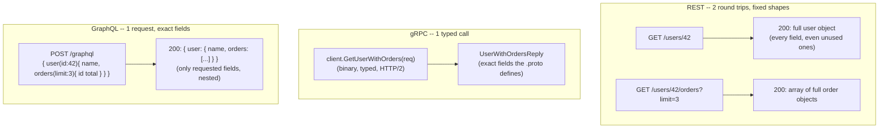

# REST vs gRPC vs GraphQL: Choosing the Shape of the Conversation

_TCP decides how bytes get there reliably, HTTP decides how a request/response is framed on the wire, TLS decides how it's kept private — but none of that tells a client how to actually ask a server for "a user and their last three orders." That's a separate decision, made one layer up, and it's this one: REST, gRPC, and GraphQL are three different answers to the same question._

## Contents

- [The framing: transport is settled, the contract isn't](#the-framing-transport-is-settled-the-contract-isnt)
- [Key terms before anything else](#key-terms-before-anything-else)
- [REST](#rest)
- [gRPC](#grpc)
- [GraphQL](#graphql)
- [Worked example: the same request, three ways](#worked-example-the-same-request-three-ways)
- [The decision table](#the-decision-table)
- [How to choose](#how-to-choose)
- [Common confusions, corrected](#common-confusions-corrected)
- [Connects to](#connects-to)
- [Check yourself](#check-yourself)
- [Real-world and sources](#real-world-and-sources)

## The framing: transport is settled, the contract isn't

By this point you know how a byte stream gets from a client to a server reliably (TCP, [04-tcp.md](04-tcp.md)), how that stream is framed into requests and responses with multiplexing (HTTP/1.1, HTTP/2, HTTP/3, [06-http-versions.md](06-http-versions.md)), and how it's encrypted and authenticated in transit (TLS, [07-https-tls.md](07-https-tls.md)). All of that answers "how do bytes move safely and efficiently." None of it answers a completely separate question: **once the pipe exists, what shape does a single conversation between a client and a server take?**

That shape is the **API (Application Programming Interface)** — the agreed-upon way a client asks a server to do something or return something. Three concrete decisions sit inside "what shape":

- **The contract / schema** — is there a machine-checkable definition of what requests look like, what fields exist, and what types they are? Or is it just documentation and convention?
- **The payload shape** — is the client stuck with whatever shape the server decided to send back, or can the client influence it?
- **Who controls what comes back** — the server (fixed responses), the client (exact field selection), or something negotiated per-method (typed RPC calls)?

REST, gRPC, and GraphQL are three different, deliberate answers. None is "the" API protocol — they're **paradigms**, and picking one is one of the most common real design decisions in building any networked system, because it determines coupling, latency characteristics, caching behavior, and how painful evolving the API will be later.

## Key terms before anything else

- **API (Application Programming Interface)** — the contract by which one piece of software (a client) invokes behavior or requests data from another (a server) without needing to know its internal implementation.
- **Contract / schema** — a formal, often machine-readable, description of what operations exist, what data they accept, and what they return (e.g. an OpenAPI spec, a `.proto` file, a GraphQL SDL file). A contract lets tooling generate client code, validate requests before they're sent, and catch a mismatch at compile time or lint time instead of at runtime in production.
- **Coupling** — how tightly a client's code depends on specifics of the server's implementation or response shape. Tighter coupling means a server-side change (renaming a field, restructuring nesting) is more likely to break clients. Every API style trades off ease-of-use against coupling in a different way.
- **Over-fetching** — the response contains more data than the client actually needs (e.g. a `GET /users/42` returns 40 fields when the client only wanted the name and avatar), wasting bandwidth and parse time, especially costly on mobile networks.
- **Under-fetching** — the response contains less than the client needs to render its view, forcing additional round trips (e.g. get a user, then a separate call per order, then a separate call per order's line items — the classic **N+1 problem**, worse under high-latency networks because every trip pays a full RTT).
- **RPC (Remote Procedure Call)** — the client calls a named function/method on the server (`GetUser(id)`) as if it were a local function; the API is organized around **actions/methods**, not around addressable pieces of data.
- **Resource-oriented** — the API is organized around **nouns** (data entities — a user, an order) each with its own address (URL), manipulated by a small, fixed set of generic verbs (GET/POST/PUT/PATCH/DELETE). REST's organizing principle.
- **Query-oriented** — the client sends a **query describing exactly what data it wants**, in one request, and the server figures out how to assemble it. GraphQL's organizing principle.

These three organizing principles — actions (RPC), nouns (resource-oriented), and declarative queries (query-oriented) — are exactly the three lenses REST, gRPC, and GraphQL apply, respectively.

## REST

**REST (Representational State Transfer)** is, formally, an **architectural style** for distributed hypermedia systems defined in Roy Fielding's 2000 doctoral dissertation — it is not a protocol, not a standard, and not synonymous with "HTTP + JSON." Fielding described a set of constraints a system can choose to satisfy: **client-server separation**, **statelessness** (each request contains everything needed to process it; the server holds no per-client session state between requests — ties directly to HTTP's own stateless design, [06-http-versions.md](06-http-versions.md)), **cacheability** (responses declare whether/how long they can be cached), a **uniform interface**, a **layered system** (proxies, gateways, load balancers can sit transparently between client and server, forward-ref), and (the constraint almost universally skipped in practice) **HATEOAS** — Hypermedia As The Engine Of Application State, meaning responses should include links describing what actions/resources are available next, so clients navigate the API dynamically rather than hard-coding URL structures.

**What "most REST APIs" actually are:** in practice, the overwhelming majority of APIs called "RESTful" implement resource-oriented URLs and HTTP verbs but skip HATEOAS entirely and are more accurately described as **"HTTP + JSON APIs."** Leonard Richardson's **Maturity Model** captures this as a spectrum: level 0 (a single URL, HTTP just as a tunnel — closer to RPC-over-HTTP), level 1 (multiple URLs per resource), level 2 (proper use of HTTP verbs and status codes — where most real "REST" APIs actually sit), level 3 (HATEOAS, full hypermedia-driven navigation — rare in practice, `verify` current adoption commentary before citing specifics). This distinction matters: when someone says "we have a REST API" they almost always mean level 2, not Fielding's full constraint set — worth knowing precisely so you're not caught flat-footed calling out the difference in an interview or a design doc.

**How it works, concretely:** resources are addressed as **nouns in URLs** (`/users/42`, `/users/42/orders`), and the action is expressed by the **HTTP verb**: `GET` (read, safe, idempotent), `POST` (create, not idempotent), `PUT` (replace, idempotent), `PATCH` (partial update), `DELETE` (remove, idempotent). The server responds with a representation of the resource (typically JSON, historically also XML) and an appropriate **HTTP status code** (`200`, `201 Created`, `404 Not Found`, `409 Conflict`, etc. — deep versioning/error-model conventions are covered fully in the API & Service Design level, forward-ref L10). Because it rides plain HTTP, REST inherits HTTP's caching machinery for free: `GET` responses can carry `Cache-Control`, `ETag`, and `Last-Modified` headers, letting browsers, CDNs, and intermediate proxies cache and reuse responses without contacting the origin server at all — a benefit no RPC-style binary protocol gets automatically.

**Strengths:**
- Simple, ubiquitous — every language has an HTTP client; every developer already understands GET/POST.
- **Cacheable** by ordinary HTTP infrastructure (browsers, CDNs, reverse proxies) with zero extra protocol work.
- Human-readable payloads (JSON) — easy to inspect with `curl`, a browser, or a REST client, easy to debug.
- Loose coupling to a specific client language; any HTTP-capable client can talk to it.
- The default choice for **public, third-party-facing APIs** where you don't control the client and want broad, low-friction accessibility.

**Weaknesses:**
- **Over-fetching / under-fetching** — the response shape for a given endpoint is fixed by the server; a mobile client that only needs a name and thumbnail still receives every field the endpoint returns, and a client needing nested related data (a user plus their recent orders) often needs multiple round trips, one per resource type, unless the server special-cases a combined endpoint (which then becomes its own maintenance burden and its own over-fetch problem for clients that don't need everything it returns).
- **No schema by default.** Fielding's REST doesn't mandate one; most real APIs bolt one on after the fact via **OpenAPI/Swagger**, which is valuable but optional and can drift out of sync with the actual implementation if not enforced by tooling.
- **Versioning churn** — because the contract is loose and conventions vary team to team, evolving a resource's shape without breaking existing clients (`/v1/`, `/v2/` URL versioning, header-based versioning, additive-only field changes) is a recurring, non-trivial design problem — the full treatment of versioning strategy belongs to L10.

## gRPC

**gRPC** is a **contract-first RPC framework**, originally developed at Google (open-sourced 2015) and now a CNCF project, in which the client calls a method on a service **as if it were a local function**, and the framework handles serializing the call, sending it over the network, and deserializing the response. The contract is defined up front, in a `.proto` file, using **Protocol Buffers (protobuf)** as the **Interface Definition Language (IDL)**:

```protobuf
service UserService {
  rpc GetUser(GetUserRequest) returns (UserReply);
}
message GetUserRequest { int64 id = 1; }
message UserReply { int64 id = 1; string name = 2; string email = 3; }
```

From this one file, protobuf's compiler (`protoc`) generates strongly typed client and server code in dozens of languages — the client gets a real, typed `GetUser(request)` function to call, not a URL string to assemble by hand.

**The wire format:** protobuf messages are serialized to a **compact binary** encoding (field numbers + wire-type tags + values, no field names repeated in every message, no whitespace, no quotes) — dramatically smaller than the equivalent JSON for the same data, and faster to parse because there's no text tokenizing/parsing step. gRPC runs this binary payload **over HTTP/2** ([06-http-versions.md](06-http-versions.md)), which is what gives it multiplexed, low-overhead calls over a single long-lived connection, HPACK header compression, and (critically) **native support for streaming**, because HTTP/2 frames are already stream-multiplexed at the protocol level.

**The four call types** (all defined per-method in the `.proto` file, so the contract itself declares which shape a given RPC uses):
- **Unary** — one request, one response; the default, ordinary RPC call shape, most similar to a REST request/response.
- **Server streaming** — one request, a **stream** of responses from the server (e.g. subscribe to a feed of price updates after one request) — conceptually parallel to SSE ([08-websockets-sse-long-polling.md](08-websockets-sse-long-polling.md)), but typed and multiplexed over the same HTTP/2 connection as other calls.
- **Client streaming** — the client sends a **stream** of requests, server responds once at the end (e.g. uploading chunks of a file, or a continuous sensor feed summarized into one result).
- **Bidirectional streaming** — both sides stream independently over the same call, each side reading and writing at its own pace — conceptually parallel to a WebSocket, but with a typed protobuf schema on every message instead of raw bytes/text.

**Strengths:**
- **Compact, fast binary payloads** — meaningfully lower bandwidth and CPU-per-request cost than JSON at high call volumes, which matters when a service makes thousands to millions of internal calls per second.
- **Strict typed schema with cross-language codegen** — the client and server literally cannot disagree about a field's type without a compile error, eliminating an entire class of integration bugs that loosely-typed JSON APIs are prone to.
- **Native bidirectional and streaming support**, without bolting anything extra on top — a direct benefit of riding HTTP/2's multiplexed streams.
- **Low latency per call**, well suited to chatty, high-volume **internal service-to-service** communication in a microservices architecture — this is gRPC's primary home.
- **Protobuf schema evolution rules** (a real strength, not just a footnote): fields are identified by number, not by position or name in the wire encoding, and old/new fields marked optional, so a server can add a new field or a client can be built against an older schema version and both sides remain **backward and forward compatible** as long as evolution rules are followed (never reuse a field number, never change a field's type incompatibly) — a discipline REST/JSON has no equivalent enforced mechanism for.

**Weaknesses:**
- **Not human-readable.** You cannot `curl` a gRPC endpoint and read the response; debugging requires gRPC-aware tooling (`grpcurl`, `bloomrpc`, or the gRPC reflection service) rather than a browser or a plain HTTP client.
- **Limited native browser support.** Browsers can't originate raw HTTP/2 trailers-based gRPC calls the way a backend service can; **gRPC-Web** exists as a JS-compatible subset, but it requires a proxy (e.g. Envoy) to translate gRPC-Web calls into full gRPC on the backend — you cannot point a browser directly at a gRPC service the way you can a REST endpoint.
- **HTTP caching doesn't apply the same way** — calls are typically `POST`-equivalent RPCs with binary bodies, so the ordinary browser/CDN/proxy HTTP caching machinery that REST gets for free (`Cache-Control`, `ETag` on `GET`) has no natural foothold; caching, if wanted, must be built at the application layer.
- **Steeper tooling and operational overhead** — protobuf compilation steps, generated code to manage across every language in use, and a less approachable on-ramp for teams used to plain JSON-over-HTTP.

## GraphQL

**GraphQL** is a **query language for APIs plus a server-side runtime for executing those queries**, created at Facebook (Meta) in 2012 internally and open-sourced in 2015 (`verify` exact internal-use start date before citing precisely), designed around a single core idea: instead of the server deciding a fixed response shape per endpoint, **the client specifies exactly which fields it wants**, in one request, and the server returns exactly that shape — nothing more, nothing less.

**How it works:** a GraphQL API typically exposes **one single endpoint** (commonly `/graphql`, called via `POST`), against a strongly typed **schema** written in **SDL (Schema Definition Language)** that declares every type, field, and how they relate:

```graphql
type User { id: ID!, name: String!, orders(limit: Int): [Order!]! }
type Order { id: ID!, total: Float!, items: [LineItem!]! }
```

A client sends a **query** selecting exactly the fields and nesting it needs:

```graphql
{ user(id: "42") { name, orders(limit: 3) { id, total } } }
```

The server's runtime walks the query and, for each requested field, invokes a **resolver function** responsible for fetching that specific piece of data (from a database, a REST service, another GraphQL API, or wherever it actually lives) — this is what lets GraphQL act as an aggregation layer over multiple backends, not just a thin wrapper over one data store.

**Three operation types**, all declared in the schema: **queries** (read data, side-effect-free, analogous to REST's `GET`), **mutations** (write/change data, analogous to `POST`/`PUT`/`PATCH`/`DELETE`, always execute serially per the spec so ordering side effects stay predictable), and **subscriptions** (a persistent, server-push stream of updates matching a query, typically transported over WebSockets — a direct real-time tie-back to [08-websockets-sse-long-polling.md](08-websockets-sse-long-polling.md), where GraphQL specifies *what* to subscribe to and WebSockets/SSE provide *how* the push actually travels).

**Strengths:**
- **Eliminates over-fetching and under-fetching by construction** — the client asks for exactly the fields it needs, nested to whatever depth in **one round trip**, instead of one call per resource type.
- **Strongly typed schema with introspection** — clients (and tooling: IDEs, codegen, API explorers like GraphiQL) can query the schema itself to discover every available type and field, enabling strong editor autocomplete and compile-time query validation on the client side.
- Well suited as a **BFF (Backend-For-Frontend, forward-ref)** aggregation layer in front of many backend services (REST APIs, gRPC services, databases), giving diverse clients (web, iOS, Android) each their own precisely-shaped queries against one unified schema, without the backend teams needing to hand-build a bespoke endpoint per client need.

**Weaknesses:**
- **Caching is structurally harder.** Because there's a single endpoint and requests are typically `POST` (queries can be large and don't fit cleanly in a URL), the ordinary HTTP-level caching REST gets for free (URL-keyed `GET` caching in browsers/CDNs) mostly doesn't apply; GraphQL clients (Apollo Client, Relay) instead implement their **own** normalized client-side caches keyed by object ID, and server-side caching requires deliberate extra work (persisted queries, response caching keyed by query+variables).
- **Server complexity shifts up.** The server must implement resolvers for every field, and a naive nested query causes the **N+1 resolver problem**: resolving `user.orders` for each of 100 users can trigger 100 separate database calls if not batched — solved by request-scoped batching/caching, canonically **DataLoader**, which coalesces resolver calls within one request tick into a single batched query.
- **Risk of expensive or abusive queries.** Because the client controls query shape, a maliciously or accidentally deeply-nested query can force the server to do enormous, unbounded work (a query that recursively expands relationships many levels deep); production GraphQL servers need **query depth limiting, complexity/cost analysis, and timeouts** to defend against this — a defense REST doesn't need in the same form, because each REST endpoint's cost is bounded by what the server author chose to implement, not by what the client asks for.
- **File uploads and some error semantics are awkward** — GraphQL's spec is built around JSON-shaped request/response bodies and doesn't natively define multipart file upload (community conventions like `graphql-multipart-request-spec` fill the gap, `verify` current adoption), and because a GraphQL response can be **partially successful** (some fields resolved, others errored) inside a single `200 OK` HTTP response, clients must inspect a response-level `errors` array rather than relying on the HTTP status code the way REST clients do.

## Worked example: the same request, three ways

**The task:** get a user and their last 3 orders — the canonical over-fetch/under-fetch example.



- **REST**: two separate HTTP requests, each hitting a fixed endpoint. `GET /users/42` returns the entire user object (address, settings, timestamps — all of it, whether or not this screen needs it: over-fetching); `GET /users/42/orders?limit=3` returns full order objects (possibly including fields like internal status codes the client doesn't render: more over-fetching). Two round trips, each paying a full RTT (mitigated somewhat by HTTP/2 multiplexing if both calls share a connection, [06-http-versions.md](06-http-versions.md), but still two logically separate request/response cycles and two response bodies to over-fetch from).
- **gRPC**: if the service was designed with this exact use case in mind, one method (`GetUserWithOrders`) returns precisely a `UserWithOrdersReply` message shaped for this call — one round trip, compact binary payload, but the shape is **fixed at the .proto level by whoever wrote the service**; if a different client needs a different combination of fields, someone must add a new RPC method or a new field, because the client cannot arbitrarily reshape the response the way a GraphQL client can.
- **GraphQL**: one HTTP request to the single `/graphql` endpoint, one query naming exactly `name` and the last 3 `orders` with just `id` and `total` — the response contains exactly those fields, nested exactly as asked, in one round trip, with no server code change needed even if a different client later wants a different subset of fields on the same types.

## The decision table

| Dimension | REST | gRPC | GraphQL |
|---|---|---|---|
| **Paradigm** | Resource-oriented (nouns + verbs) | RPC (call a named method) | Query-oriented (client declares fields) |
| **Payload format** | Text, typically JSON | Binary, Protocol Buffers | Text, typically JSON |
| **Transport** | HTTP/1.1 or HTTP/2, any verb | HTTP/2 only | HTTP (usually POST, single endpoint) |
| **Schema/typing** | Optional (OpenAPI/Swagger bolted on) | Strict, mandatory (`.proto` contract) | Strict, mandatory (SDL schema) |
| **Streaming** | Not native (needs SSE/WebSockets alongside) | Native: unary, server/client/bidi streaming | Subscriptions (via WebSockets under the hood) |
| **Browser-friendly** | Yes, natively | Limited (needs gRPC-Web + proxy) | Yes, natively |
| **HTTP caching** | Strong (native `GET` caching) | Weak/none (app-level only) | Weak (single endpoint, mostly POST) |
| **Coupling** | Loose (any HTTP client, evolving conventions) | Tight (generated typed clients, shared .proto) | Loose per-field (client picks shape), tight to schema |
| **Over/under-fetching** | Common (fixed response shapes) | Avoided per-method, but shape still fixed by server | Eliminated by design (client selects fields) |
| **Best fit** | Public/third-party APIs, cache-heavy reads | Internal, low-latency service-to-service, streaming | Diverse clients (mobile/web), BFF aggregation |

## How to choose

A quick, practical heuristic, since these are not mutually exclusive and real systems commonly run more than one at once:

- **Public or third-party-facing, cache-heavy, read-mostly** -> **REST**. Ubiquitous client support, and HTTP caching does real, free work at the CDN/proxy layer for a broad, uncontrolled client population.
- **Internal, low-latency, high-volume service-to-service calls, or anything needing native streaming** -> **gRPC**. Typed contracts across many internal services prevent an entire class of integration bugs at scale, and the binary payload plus HTTP/2 multiplexing pays off when you're making millions of internal calls.
- **Diverse client types (web, iOS, Android) each needing different slices of overlapping data, or aggregating several backend services into one client-facing API** -> **GraphQL**, often specifically as a **BFF (Backend-For-Frontend, forward-ref)** layer.

**They are routinely combined, not mutually exclusive**, in the same system: a common real architecture is GraphQL (or REST) at the public/client-facing edge, fanning out internally to a mesh of gRPC services doing the actual work — the edge layer optimizes for flexible, client-friendly shapes; the internal layer optimizes for speed and type safety between services that all belong to the same organization and can agree on shared `.proto` contracts.

## Common confusions, corrected

- **"REST" is not a synonym for "HTTP."** HTTP is the transport protocol; REST is an architectural style that happens to be commonly implemented over HTTP. You can (in principle) implement REST's constraints over a different protocol, and you can build a very non-RESTful (pure RPC-style, one URL, everything via POST) API entirely over HTTP. Most APIs people call "REST" in industry are really "HTTP + JSON, Richardson level 2" — precise enough to know the difference, loose enough that correcting someone mid-conversation is rarely worth it unless it matters to the design.
- **gRPC is not universally "faster."** It's faster for **internal, typed, high-volume calls** where binary serialization and connection reuse matter and there's no HTTP caching opportunity to lose anyway. For a **cacheable public read**, a REST `GET` served from a CDN edge cache with zero origin round trip can easily beat a gRPC call that must hit the origin service every time — the comparison depends entirely on whether the workload benefits from caching, not just raw serialization speed.
- **GraphQL doesn't make problems disappear, it relocates them.** Over-fetching moves from the client's problem to a server-side query-cost problem (unbounded query depth/complexity); the N+1 problem moves from "N+1 client round trips" (REST) to "N+1 resolver calls inside one request" (GraphQL) — solved differently (DataLoader batching) but not eliminated by magic. And GraphQL's single-endpoint, mostly-POST design **breaks the free HTTP caching** REST gets, trading a network-efficiency win (fewer round trips, right-sized payloads) for a caching-infrastructure cost.
- **Protobuf's schema evolution discipline is a real, structural strength**, not marketing — the field-number-based binary encoding is specifically designed so that old and new schema versions stay compatible if you follow the rules (add fields, never renumber, never repurpose a number), a guarantee JSON's textual, field-name-based, unenforced structure has no equivalent for.
- **These three don't cover API "design" in full** — pagination strategy, error-response conventions, idempotency keys for safe retries, and API versioning strategy are real, deep topics of their own, deliberately deferred to the **API & Service Design** level (forward-ref L10), which builds on top of whichever style(s) you pick here.

## Connects to

- **Back to [06-http-versions.md](06-http-versions.md)** — gRPC requires HTTP/2 specifically for its multiplexed, binary-framed streams; REST works over HTTP/1.1 or HTTP/2 interchangeably; GraphQL rides plain HTTP request/response semantics regardless of version.
- **Back to [07-https-tls.md](07-https-tls.md)** — all three are typically deployed over TLS in production; internal gRPC meshes commonly layer **mTLS** for service-to-service authentication, a preview of the service-mesh pattern covered at the security/reliability levels (forward-ref L9).
- **Back to [08-websockets-sse-long-polling.md](08-websockets-sse-long-polling.md)** — GraphQL subscriptions are typically transported over WebSockets; gRPC's server-streaming and bidirectional-streaming call types achieve a conceptually similar real-time push/duplex pattern, but natively within HTTP/2 rather than needing a protocol upgrade.
- **Forward to API Gateways** — a gateway commonly sits in front of a mixed-style backend, translating a public REST or GraphQL-facing API into internal gRPC calls, handling auth, rate limiting, and routing in one place (forward-ref, later networking/L11 topics).
- **Forward to load balancers** — an L7-aware load balancer must understand HTTP/2 framing and gRPC's use of trailers to balance gRPC traffic correctly (naive L4 connection-based balancing can starve some backend instances since gRPC prefers long-lived multiplexed connections over many short ones); REST/GraphQL over ordinary HTTP/1.1 or HTTP/2 balances more straightforwardly.
- **Forward to L10 (API & Service Design)** — versioning strategy, pagination patterns, error-response modeling, and idempotency keys build directly on top of whichever style is chosen here; this topic deliberately stops at "the style and its wire-level trade-offs," not full endpoint design practice.
- **Forward to BFF (Backend-For-Frontend) pattern** — GraphQL is commonly the technology behind a BFF layer, but the BFF pattern itself (one tailored backend layer per client type) is a broader architectural idea that can be implemented with REST or GraphQL alike.

## Check yourself

- A teammate says "gRPC is always faster than REST, so we should switch everything to it." What's wrong with that claim, and under what workload would a cacheable REST endpoint actually outperform an equivalent gRPC call?
- Explain, in your own words, the difference between over-fetching and under-fetching, and identify which of the three styles is structurally designed to eliminate each.
- Why does gRPC require HTTP/2 specifically, and what two HTTP/2 features (from the earlier topic) does it depend on most directly?
- What is the N+1 problem, and how does its cause and its fix differ between a REST API and a GraphQL API?
- A public-facing API needs to serve millions of cache-friendly reads to third-party developers you don't control. An internal fleet of 40 microservices needs to make several million low-latency calls to each other per minute. Which style fits each, and why?

## Real-world and sources

**Stripe (REST, fintech, public API) — the canonical cacheable resource-oriented public API.** Stripe's own API reference states: "The Stripe API is organized around REST. Our API has predictable resource-oriented URLs, accepts form-encoded request bodies, returns JSON-encoded responses, and uses standard HTTP response codes, authentication, and verbs." Every object returned has a consistent `id` + `object` type field, single-object operations only (no bulk updates), and a rolling, named-release versioning model (current major release "Clover," 2025-09-30, with additive monthly releases in between) — a concrete real-world instance of the versioning-churn trade-off this topic flags for REST. This is the pattern the concept section calls "the cache-heavy, third-party-facing sweet spot": broad client reach, human-debuggable JSON, HTTP semantics every SDK already understands. (Verified via [Stripe API Reference](https://docs.stripe.com/api), accessed 2026-07-07.)

**GitHub (REST v3 -> GraphQL v4) — moving to query-oriented specifically to kill over-fetching for diverse clients.** GitHub's own docs frame the shift directly in over/under-fetching terms: a REST call for organization members "returns far more information than needed," while "a GraphQL query returns only what you specify" — e.g. fetching just `number` and `mergeable` per pull request instead of each PR's full representation. GitHub's migration guide also gives the canonical under-fetching example this topic teaches: assembling a pull request with its commits, comments, and reviews takes **four separate REST calls** but **one GraphQL query with nested fields**. GitHub still runs REST v3 and GraphQL v4 side by side today — proof the two are not mutually exclusive, just fit for different client needs. (Verified via [About the GraphQL API](https://docs.github.com/en/graphql/overview/about-the-graphql-api) and [Migrating from REST to GraphQL](https://docs.github.com/en/graphql/guides/migrating-from-rest-to-graphql), accessed 2026-07-07.)

**Netflix (gRPC + protobuf, internal service-to-service) — the low-latency typed-contract case, plus a real refinement on top of plain gRPC.** Netflix's engineering blog post "Practical API Design at Netflix, Part 1: Using Protobuf FieldMask" describes Netflix Studio Engineering's heavy use of **gRPC for backend-to-backend communication**, and identifies a real cost of the fixed-response-per-method model this lesson's "gRPC weaknesses" section describes: some response fields are expensive to compute or require extra remote calls, adding latency, error surface, and bandwidth even when a caller doesn't need them. Their fix — a **protobuf FieldMask** field letting a caller specify which fields of a message it actually wants on a given RPC — is effectively a narrow, RPC-level answer to the same over-fetching problem GraphQL solves more generally at the schema level, without abandoning gRPC's binary, typed-contract model for internal traffic. (Netflix TechBlog, "Practical API Design at Netflix, Part 1," published 2021; content verified via search-indexed excerpts of `netflixtechblog.com/practical-api-design-at-netflix-part-1-using-protobuf-fieldmask-35cfdc606518`, accessed 2026-07-07 — direct fetch was blocked by a redirect loop, so `verify` by opening the URL directly if you want the full text.)

**UPI / NPCI (India) — a REST-adjacent, XML-based API at real-time-payments scale.** UPI (Unified Payments Interface), run by the National Payments Corporation of India (NPCI), is not gRPC or GraphQL and not a textbook Fielding-REST API either: its published technical specification uses **XML message payloads over HTTPS**, with a stateless, asynchronous request/callback pattern (a bank sends a `ReqXxx` API call, NPCI acknowledges receipt, then delivers the actual result via a separate `RespXxx` callback), and NPCI translates UPI's XML messages into ISO 8583 where needed for downstream bank-to-bank settlement. This is a useful contrast to the lesson's three paradigms: a huge, real fintech system choosing a resource-request/XML-schema style shaped by legacy banking interoperability and regulatory requirements rather than by REST's HTTP-caching benefits or gRPC's binary performance goals. On scale: NPCI's own May 2026 data (widely reported in Indian press) put UPI at roughly **23.2 billion transactions for the month**, work out to a daily average in the hundreds of millions of transactions — making UPI, per NPCI, the world's largest real-time retail payments system by volume as of mid-2026. (Verified via [NPCI UPI Procedural Guidelines / API Description PDF](https://s3-ap-southeast-1.amazonaws.com/he-public-data/NPCI%20API%20Descriptionsb9bceb7.pdf) for the API/XML/callback pattern, and [UPI Hits Record 23.2 Billion Transactions in May 2026 — NPCI data via Open magazine](https://openthemagazine.com/business/upi-hits-record-232-billion-transactions-in-may-2026-what-the-latest-npci-data-reveals) for the volume figure, both accessed 2026-07-07.)

### Sources / further reading

- [Stripe API Reference](https://docs.stripe.com/api) — REST design statement, resource/versioning conventions. Accessed 2026-07-07.
- [GitHub Docs: About the GraphQL API](https://docs.github.com/en/graphql/overview/about-the-graphql-api) — why GraphQL, field-selection model. Accessed 2026-07-07.
- [GitHub Docs: Migrating from REST to GraphQL](https://docs.github.com/en/graphql/guides/migrating-from-rest-to-graphql) — the 4-calls-vs-1-query pull request example. Accessed 2026-07-07.
- [GitHub Docs: Comparing GitHub's REST API and GraphQL API](https://docs.github.com/en/rest/about-the-rest-api/comparing-githubs-rest-api-and-graphql-api) — both APIs still run side by side. Accessed 2026-07-07.
- Netflix TechBlog, "Practical API Design at Netflix, Part 1: Using Protobuf FieldMask," `netflixtechblog.com/practical-api-design-at-netflix-part-1-using-protobuf-fieldmask-35cfdc606518` (2021) — gRPC for backend-to-backend, FieldMask as a per-call over-fetching fix. Content verified via indexed search excerpts, 2026-07-07; open directly to read in full.
- [NPCI UPI API Description / Procedural Guidelines PDF](https://s3-ap-southeast-1.amazonaws.com/he-public-data/NPCI%20API%20Descriptionsb9bceb7.pdf) — XML message format, async ReqAPI/RespAPI callback pattern, ISO 8583 translation. Accessed 2026-07-07.
- [UPI Hits Record 23.2 Billion Transactions in May 2026 — NPCI data](https://openthemagazine.com/business/upi-hits-record-232-billion-transactions-in-may-2026-what-the-latest-npci-data-reveals) — monthly transaction-volume figure. Accessed 2026-07-07.
