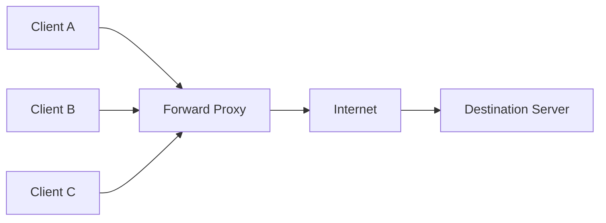
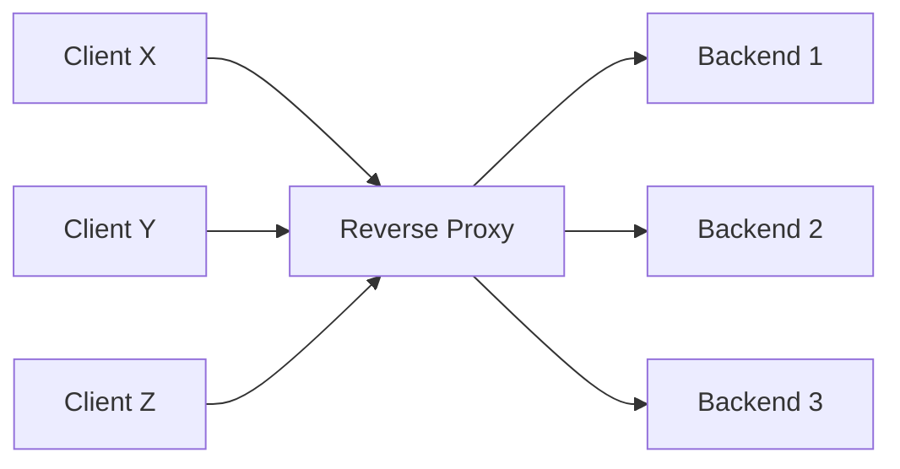

# Forward and Reverse Proxies: The Intermediary That Fronts One Side

_Every connection you've studied so far went client-to-server directly; a proxy is what happens when you deliberately insert a third party in between, and everything interesting about it comes down to one question: which side does it represent?_

## Contents

- [What a proxy is](#what-a-proxy-is)
- [Forward proxy: fronting the client](#forward-proxy-fronting-the-client)
- [Reverse proxy: fronting the server](#reverse-proxy-fronting-the-server)
- [The key mental model: side-by-side comparison](#the-key-mental-model-side-by-side-comparison)
- [How a proxy works internally](#how-a-proxy-works-internally)
- [Worked example: one request through a reverse proxy](#worked-example-one-request-through-a-reverse-proxy)
- [Why reverse proxies are foundational](#why-reverse-proxies-are-foundational)
- [Trade-offs and common confusions](#trade-offs-and-common-confusions)
- [Connects to](#connects-to)
- [Check yourself](#check-yourself)
- [Real-world and sources](#real-world-and-sources)

## What a proxy is

A **proxy** (from the same root as "proxy vote" — someone acting *on behalf of* someone else) is a piece of software (or a dedicated appliance) that sits **between a client and a server**, and instead of the client talking directly to the server, both sides talk to the proxy, which relays the conversation. The proxy is an **intermediary**: it does not just forward bytes blindly like a wire or a plain L1/L2 repeater — it can *see* the traffic, *understand* it (fully, if it's L7-aware), and choose to cache it, log it, modify it, block it, or route it somewhere else entirely.

**"On behalf of," defined precisely.** When you say a proxy acts "on behalf of" a party, you mean: from the perspective of the *other* party, the proxy's identity substitutes for the represented party's identity. Which party gets represented (hidden behind the proxy) versus which party is merely *served* by the proxy is the entire distinction between the two kinds of proxy this topic covers.

**The connection-level reality: two separate connections, not one pass-through wire.** This is the single most important internal fact to hold onto, and it follows directly from what you already know about TCP and sockets ([04-tcp.md](04-tcp.md), [10-sockets.md](10-sockets.md)): a proxy **terminates** one TCP connection (accepts it, completes the handshake, becomes an actual endpoint of it) and then **originates a second, entirely separate TCP connection** to the other side. There is no single end-to-end TCP connection running "through" a proxy the way a signal runs through a plain cable — the proxy is a real endpoint on both connections, with its own two sockets, its own two sets of TCP state (sequence numbers, congestion windows, buffers), doing application-level work to copy (or transform) data from one connection to the other. This is precisely what makes a proxy capable of everything a passive wire cannot do: reading a full HTTP request, deciding what to do with it, and only then deciding what (if anything) to send onward.

**What a proxy is NOT.** It is not a router (a router forwards IP packets at L3 based on destination address, without terminating any connection or understanding what's inside); it is not simply "a firewall" (though it can enforce firewall-like policy); and it is not a single fixed technology — "proxy" is a *role*, and the same software (nginx, HAProxy, Envoy) can be configured to play either role, or both at once in different parts of an architecture.

## Forward proxy: fronting the client

A **forward proxy** sits in front of a group of **clients**, representing *them* to the outside internet. The client is explicitly (or transparently) configured to send its outbound traffic through the proxy rather than directly to the destination server. From the destination server's point of view, the request came from the proxy's IP address — the server never sees the real client's address at all, unless the proxy chooses to reveal it in a header.

The clients know about (and are configured to use) the proxy; the destination server generally does **not** know a proxy was involved at all — from its perspective, it's just talking to one particular client IP (which happens to be the proxy's).

**Common uses of a forward proxy:**

- **Corporate egress control / content filtering** — an organization routes all employee outbound web traffic through a proxy so it can enforce policy (block certain sites/categories), log what employees access, and present a single, controllable point of egress rather than every workstation having unrestricted direct internet access.
- **Caching for a group of clients** — many clients behind the same proxy requesting the same popular resource can be served from the proxy's cache after the first fetch, saving repeated trips out to the origin — valuable in bandwidth-constrained environments (schools, ISPs historically).
- **Anonymity / privacy** — because the destination server only sees the proxy's IP, a forward proxy can hide the real client's identity/location from whatever it's talking to.
- **Bypassing geo-restrictions** — routing through a proxy located in a different region makes the request appear to originate there (the same underlying mechanism a VPN uses, though a VPN typically also encrypts the client-to-proxy leg and operates at a lower layer; a plain forward proxy may or may not encrypt that leg).
- **Access logging / auditing** — a single choke point through which all outbound traffic passes is a natural place to centrally log what was accessed, by whom, and when.

## Reverse proxy: fronting the server

A **reverse proxy** sits in front of a group of **servers** (a "backend pool" or "upstream pool"), representing *them* to the outside clients. The client sends its request to what it believes is the server (often the client has no idea a proxy is involved at all — no client-side configuration is required or even possible), and the reverse proxy decides which actual backend server handles the request, then relays the response back.

The client does not know (and does not configure) anything about the backends — it just has one address (a domain name, resolved via DNS to the proxy's IP) that it always talks to. The backends, likewise, may not even be reachable directly from the internet at all; the reverse proxy is the only public entry point.

**The big list of what a reverse proxy is used for** — this is exactly why reverse proxies matter so much in system design, because each of these is a cross-cutting concern that would otherwise have to be duplicated in every backend service:

- **TLS termination** — the reverse proxy holds the certificate/private key, terminates the client's HTTPS connection, and speaks plain (or re-encrypted) HTTP onward to the backend, so individual backend services don't each need their own certificate management (back-ref [07-https-tls.md](07-https-tls.md)).
- **Load balancing** — distributing incoming requests across multiple backend instances so no single instance is overwhelmed and the pool can scale horizontally (forward-ref to its own dedicated topic — a load balancer *is*, mechanically, a reverse proxy specialized for distributing load with health checks and balancing algorithms).
- **Caching / CDN behavior** — storing responses so repeat requests for the same resource can be answered without hitting the backend at all (forward-ref — a CDN is a *geographically distributed* reverse-proxy cache, pushed out to edge locations near clients rather than sitting centrally in front of one origin).
- **Compression** — compressing responses (e.g. gzip/brotli) on the fly at the proxy layer so backends don't each need to implement it.
- **Request routing / path-based routing** — sending `/api/*` to one backend service, `/static/*` to another, `/checkout/*` to a third, all from one public hostname, based on the URL path, host header, or other request attributes (this is L7-aware behavior, see below).
- **API gateway functions** — authentication checks, request/response transformation, protocol translation (forward-ref — an API gateway is a reverse proxy specialized for these API-specific cross-cutting concerns, typically sitting at the edge of a microservices architecture).
- **Security shielding** — hiding backend topology entirely (clients/attackers never learn how many backend instances exist, their IPs, or their internal architecture), absorbing/filtering malicious traffic before it reaches application servers (WAF functionality, DDoS absorption — forward-ref to the security level).
- **Health checks** — periodically probing each backend to see if it's alive and responsive, automatically pulling unhealthy instances out of rotation.
- **Request/response rewriting** — modifying headers, rewriting URLs, injecting or stripping cookies, before passing traffic along in either direction.
- **Centralized authentication** — validating a session/token once at the proxy layer before any backend even sees the request, rather than every backend re-implementing the same check.
- **Rate limiting** — throttling how many requests a given client/IP/API key can make, enforced centrally rather than per backend instance (forward-ref to reliability and security levels).

## The key mental model: side-by-side comparison

The single most common point of confusion with proxies is mixing up which one is which. The rule that resolves it every time: **ask which side is being hidden, and which side had to configure anything.**

- A **forward** proxy is configured **by the client side** and hides the **client** from the server. It **serves the clients'** interests (their privacy, their policy, their caching).
- A **reverse** proxy is set up **by the server side** and hides the **server(s)** from the client. It **serves the servers'** interests (their scalability, their security, their manageability) — even though it's the *client* that ends up talking to it.

| | Forward proxy | Reverse proxy |
|---|---|---|
| **Sits in front of** | The client(s) | The server(s) |
| **Who configures it** | The client (or the client's network admin) | The server operator |
| **Whose IP is hidden from the other side** | The client's real IP (server sees the proxy's IP) | The backend servers' real IPs (client sees the proxy's IP) |
| **Who it serves / protects** | The client | The server |
| **Does the client know it's there** | Yes — explicitly configured (or transparently intercepted on the client's network) | Usually no — the client believes it's talking directly to "the server" |
| **Does the server know it's there** | Usually no — sees only the proxy as "the client" | Yes — the backend is deliberately deployed behind it |
| **Typical uses** | Content filtering, egress policy, anonymity, geo-bypass, client-side caching | TLS termination, load balancing, caching/CDN, routing, security shielding, rate limiting |
| **Canonical software** | Squid, corporate web proxies, VPN clients (`verify` for current market specifics) | nginx, HAProxy, Envoy, Cloudflare edge |

Same underlying mechanism both times (an intermediary that terminates one connection and originates another) — the only thing that flips is **which side it fronts, and therefore whose identity is concealed from the other party.**

## How a proxy works internally

**Connection termination and re-origination.** As established above, a proxy is a genuine endpoint of two separate connections, not a pass-through. This is true whether it's a forward or reverse proxy — the only difference is which side (client-facing or server-facing) each connection is on.

**L4 (transport-level) vs L7 (application-level) proxying** (back-ref [01-osi-and-tcp-ip-models.md](01-osi-and-tcp-ip-models.md)):

- An **L4 proxy** operates at the TCP/UDP level — it sees IP addresses, ports, and raw bytes, but does not parse the application protocol riding on top. It can make routing/forwarding decisions based on the 4-tuple (source/dest IP, source/dest port) and can even do **TCP passthrough**, where it relays raw encrypted bytes without ever decrypting them, but it cannot read an HTTP path, a Host header, or a cookie, because it never parses HTTP at all. Faster and more transparent (lower CPU cost, works for any protocol) but with much less visibility and control (forward-ref to L4 load balancers).
- An **L7 proxy** operates at the application layer — for HTTP traffic, this means it actually parses the request line, headers, and (optionally) the body. Because it understands HTTP, it can do everything on the "big list" above: route by path, rewrite headers, inspect cookies, terminate TLS and re-encrypt, cache based on cache-control semantics, and so on. The cost is more CPU work per request (parsing, and often decrypting) and being protocol-specific (an L7 HTTP proxy doesn't help you proxy an arbitrary TCP protocol it doesn't understand) (forward-ref to L7 load balancers and API gateways).

**Preserving the original client identity: `X-Forwarded-For` and friends.** Because a reverse proxy terminates the client's connection and opens a *new* connection to the backend, the backend, left to its own devices, would only ever see the **proxy's** IP address as the "source" of every request — it has no native way to know who the real client was, since that information lived only in the now-closed client-to-proxy TCP connection, not in the new proxy-to-backend one. To solve this, L7 (HTTP-aware) reverse proxies conventionally add headers to the *forwarded* request that carry the original context:

- **`X-Forwarded-For`** — the original client's IP address (and, if the request already passed through other proxies upstream, a comma-separated chain of all of them).
- **`X-Forwarded-Proto`** — whether the original client-to-proxy connection was `http` or `https`, since the backend might now be receiving plain HTTP from the proxy even though the real client used HTTPS (a very common source of subtle bugs — e.g. a backend generating a redirect URL with the wrong scheme, because it thinks the request arrived as plain HTTP).
- **`Forwarded`** — a newer, standardized header (RFC 7239) intended to consolidate `X-Forwarded-For`/`-Proto`/`-Host` into one structured field, though the `X-Forwarded-*` headers remain far more widely used in practice `verify: current relative adoption`.

Without these headers, a backend behind a reverse proxy would log every request as coming from the same single IP (the proxy's), breaking per-client rate limiting, geolocation, and audit logs — which is precisely why every reverse proxy that expects backends to need real client context must be configured to add them, and why backends must be configured to trust and read them (see the trade-offs section for the spoofing gotcha this creates).

**TLS termination vs TLS passthrough vs re-encryption** (back-ref [07-https-tls.md](07-https-tls.md)):

- **TLS termination**: the proxy holds the certificate, completes the TLS handshake with the client, decrypts incoming traffic, and speaks plain HTTP to the backend over a (typically) trusted internal network. Cheapest for the backend, centralizes certificate management, but means the proxy-to-backend leg is unencrypted unless separately secured.
- **TLS re-encryption (TLS bridging)**: the proxy terminates the client's TLS connection, then opens a *new*, separate TLS connection to the backend (possibly with a different, internal certificate) — the backend still gets encrypted traffic, at the cost of a second TLS handshake and CPU overhead on the proxy for both legs.
- **TLS passthrough**: the proxy never decrypts at all — it operates at L4, forwarding the raw encrypted TCP bytes straight to a backend which itself terminates the TLS handshake. This preserves full end-to-end encryption but sacrifices L7 visibility (the proxy can't route by path or rewrite headers if it never decrypts, since path/headers only exist inside the encrypted payload) — it can typically still route based on the TLS **SNI** hostname, which is sent unencrypted during the handshake, but nothing deeper.

**Transparent vs explicit proxies.** An **explicit proxy** requires the client to be configured with the proxy's address (a browser's proxy settings, an OS-level proxy config) — the client actively sends its request *to* the proxy. A **transparent (intercepting) proxy** requires no client configuration at all — network infrastructure (a router, a gateway) silently redirects matching traffic into the proxy without the client's knowledge or consent, which is common for both corporate forward proxies (intercepting all outbound HTTP/HTTPS from a network segment) and reverse proxies (which are transparent to the client almost by definition, since the client never configures anything to reach a reverse proxy — it just resolves a domain name to the proxy's IP via DNS).

## Worked example: one request through a reverse proxy

Trace a single HTTPS request to `api.example.com/orders/42` sitting behind an nginx-style reverse proxy in front of three backend instances:

1. **DNS resolves** `api.example.com` to the reverse proxy's public IP (not any backend's IP — the backends may have no public IP at all). The client has no idea multiple backends exist.
2. **Connection 1 (client <-> proxy) is established and TLS terminates here.** The client completes a TCP handshake and then a TLS handshake with the proxy, which presents `api.example.com`'s certificate. The proxy decrypts the request: `GET /orders/42 HTTP/1.1`, `Host: api.example.com`, plus whatever cookies/auth headers the client sent.
3. **The proxy makes an L7-aware decision.** It reads the path (`/orders/42`) and Host header, matches it against its routing rules (e.g. "anything under `/orders/*` goes to the orders backend pool"), and consults its health-check state to pick one healthy instance, say Backend 2, out of the pool (a load-balancing decision — mechanics belong to the dedicated topic).
4. **The proxy rewrites the request before forwarding it.** It adds `X-Forwarded-For: <client's real IP>` and `X-Forwarded-Proto: https` (since the backend will now receive plain HTTP, or re-encrypted HTTP, and otherwise wouldn't know the original scheme).
5. **Connection 2 (proxy <-> Backend 2) is opened.** This is a *separate* TCP connection (possibly one already open and pooled from a prior request — reverse proxies commonly keep persistent connections to backends to avoid paying a fresh handshake per request). The rewritten request is sent over it.
6. **Backend 2 processes the request** entirely unaware of the real client's IP except via the `X-Forwarded-For` header it must explicitly read and trust; it returns `HTTP/1.1 200 OK` with the order JSON to the proxy.
7. **The proxy relays (and possibly caches) the response** back over Connection 1 to the client, re-encrypting it as part of the already-established TLS session, exactly as if the proxy itself had generated the answer. Optionally, if this response were cacheable, the proxy could store it and serve the next identical request without touching Backend 2 at all — a fourth connection never gets opened.

**What the backend actually sees:** a request from the proxy's internal IP, over the proxy-to-backend connection, with the real client's IP available only as a header value (`X-Forwarded-For`) that it must explicitly parse — it never sees the client's IP as the actual TCP source address, because that information lived only in the connection that was terminated at the proxy in step 2.

## Why reverse proxies are foundational

A reverse proxy is the single **choke point** at the edge of a system where you can centralize every cross-cutting concern — TLS, caching, routing, rate limiting, authentication, observability — so that every backend service behind it can stay simple and focus purely on its own business logic, instead of every one of potentially dozens of services separately implementing certificate management, its own rate limiter, its own logging format, and so on. This is precisely **why the next several topics in this level are all, mechanically, specialized reverse proxies**:

- A **load balancer** is a reverse proxy specialized for distributing traffic across a pool of backend instances based on an algorithm and health checks.
- An **API gateway** is a reverse proxy specialized for API-specific cross-cutting concerns (auth, request/response transformation, protocol translation, per-client rate limiting) sitting at the edge of a set of backend services.
- A **CDN** is a reverse proxy's caching behavior, taken and distributed geographically to many edge locations near clients, rather than sitting as one instance close to the origin.

Everything in this document — terminate one connection, originate another, optionally understand and act on what's inside — is the shared mechanical foundation all three specializations build on; what differs between them is *what policy* they apply once they're sitting in that position, not the underlying proxy mechanism itself.

## Trade-offs and common confusions

**Forward vs reverse — the #1 confusion, resolved by one rule:** ask "which side configured this, and which side is hidden from the other party?" If the *client* set it up and the *server* only ever sees the proxy's identity, it's forward. If the *server operator* set it up and the *client* only ever sees the proxy's identity, it's reverse.

**Proxy vs NAT vs gateway vs load balancer — clarifying overlapping terms:**

- **NAT** (forward-ref, next topic) rewrites IP addresses **at L3/L4** as packets pass through a device — it does not terminate a connection into two separate ones; the same single TCP connection's packets simply have their address fields rewritten in transit. A proxy, by contrast, genuinely terminates one connection and originates a distinct second one, and can act at L7. They achieve superficially similar outcomes (hiding an internal address from the outside world) through fundamentally different mechanisms.
- **Gateway** is a broader, looser term (an API gateway, a payment gateway, a network gateway) generally meaning "the entry/exit point between two different networks or systems" — an API gateway happens to be implemented as a reverse proxy, but "gateway" itself isn't a precise synonym for "proxy."
- **Load balancer** is, as covered above, a reverse proxy with a specific job (distribute load, health-check backends); every load balancer is a reverse proxy, but not every reverse proxy is doing load balancing (a single-backend reverse proxy doing only TLS termination and caching is still a reverse proxy).

**L4 vs L7 proxying trade-off:** L4 is faster and protocol-agnostic (no parsing overhead, works for anything running over TCP/UDP) but blind to application content (can't route by path, can't read cookies). L7 gives full visibility and control (routing, rewriting, caching, auth) at the cost of CPU (parsing, often decrypting) and being tied to understanding the specific protocol.

**A proxy adds a hop and is a potential bottleneck/single point of failure.** Every request now pays for an extra connection termination and (for L7) parsing/inspection, adding some latency (typically small — sub-millisecond to a few milliseconds for a well-tuned proxy doing simple work, more if it's doing TLS termination or complex logic) compared to a hypothetical direct client-to-backend connection. And because all traffic now funnels through it, the proxy itself becomes a concentration point: if it goes down, everything behind it becomes unreachable even if every backend is healthy. This is mitigated the same way any single point of failure is — by running the proxy tier itself redundantly (multiple proxy instances behind DNS round-robin or anycast, or fronted by yet another layer) — but it is a real cost that must be weighed against the centralization benefit.

**The `X-Forwarded-For` gotcha.** Because `X-Forwarded-For` is just a regular HTTP header, a malicious client talking directly to a backend (or to a misconfigured proxy that doesn't strip/overwrite client-supplied values) can simply **set that header itself** to any IP it wants, spoofing its apparent origin. A correctly configured reverse proxy must **overwrite** (or append to, in a trusted chain) the header itself rather than blindly relaying whatever the client sent, and backends must only trust `X-Forwarded-For` values that came from a known, trusted proxy hop — not from the raw client. This is a real, common security misconfiguration (forward-ref to the security level) and a direct consequence of the fact that a reverse proxy's job of "restoring" the client's identity to the backend is done entirely via an ordinary, otherwise-unauthenticated header, not via any cryptographic guarantee.

| | Benefit | Cost |
|---|---|---|
| Centralizing TLS, caching, auth, routing at the proxy | Backends stay simple; one place to patch/upgrade/secure | Proxy becomes a bottleneck/SPOF if not scaled redundantly |
| L7 (HTTP-aware) proxying | Full routing/rewriting/caching control | CPU cost of parsing (and often decrypting); protocol-specific |
| L4 (passthrough) proxying | Fast, protocol-agnostic, preserves end-to-end encryption | No visibility into or control over application content |
| `X-Forwarded-For` restoring client identity | Backends regain per-client logging/rate-limiting/geo | Spoofable if the proxy doesn't overwrite it and backends blindly trust it |

> [!IMPORTANT]
> A proxy is an intermediary that terminates one connection and originates a second, separate one, giving it the power to read, cache, modify, or reject traffic rather than merely relay bytes. A **forward proxy** fronts the **client**, hiding the client from the server, configured by and serving the client side. A **reverse proxy** fronts the **server(s)**, hiding the backend topology from the client, deployed by and serving the server side. Load balancers, API gateways, and CDNs are not separate mechanisms — they are all reverse proxies, specialized for a particular cross-cutting concern (distributing load, API policy, geographically-distributed caching, respectively).

## Connects to

- **Back to [04-tcp.md](04-tcp.md) and [10-sockets.md](10-sockets.md)** — a proxy's defining mechanical behavior (terminate one connection, originate a second) only makes sense once you understand that a TCP connection is a real, stateful, two-endpoint object, not a transparent pipe.
- **Back to [07-https-tls.md](07-https-tls.md)** — TLS termination, passthrough, and re-encryption at a reverse proxy directly reuse everything covered there about the TLS handshake and where it can be terminated.
- **Back to [01-osi-and-tcp-ip-models.md](01-osi-and-tcp-ip-models.md)** — the L4 vs L7 proxying distinction is exactly the OSI layering distinction applied to where a proxy chooses to stop understanding the traffic it relays.
- **Forward to load balancers (next topic)** — a reverse proxy specialized for distributing requests across a backend pool using an algorithm and health checks.
- **Forward to API gateways** — a reverse proxy specialized for API-specific cross-cutting concerns (auth, transformation, per-client rate limiting) at the edge of a microservices architecture.
- **Forward to CDNs** — a reverse proxy's caching function, distributed geographically to edge locations near clients rather than centralized near the origin.
- **Forward to NAT** — a contrasting mechanism that rewrites addresses in-place at L3/L4 without terminating and re-originating a connection, achieving a superficially similar "hide the internal address" outcome through a fundamentally different means.
- **Forward to service mesh and sidecars (later level)** — Envoy and similar sidecar proxies apply the reverse-proxy (and sometimes forward-proxy) pattern at the level of individual service-to-service calls inside a distributed system, not just at the system's public edge.
- **Forward to security / WAF and rate limiting** — the security-shielding and rate-limiting functions of a reverse proxy, and the `X-Forwarded-For` trust/spoofing issue, are developed in full depth at the security level.

## Check yourself

- A client's request never mentions or configures anything about a proxy, yet every request to a company's public API IP actually lands on a proxy that picks one of several backend servers. Is this a forward or reverse proxy, and what's the one-sentence rule that tells you which?
- Explain, in terms of TCP connections, why a backend server sitting behind a reverse proxy sees the proxy's IP address as the source of every request rather than the real client's IP — and name the mechanism reverse proxies use to restore that information.
- A team argues "we don't need X-Forwarded-For validation, since only our proxy talks to our backend." Why is trusting X-Forwarded-For without verifying its origin risky even in this setup, if the backend is ever reachable by any other path?
- Give one reason you'd choose TLS passthrough over TLS termination at a reverse proxy, and one capability you give up by choosing it.

## Real-world and sources

**Lyft — Envoy, born as a reverse proxy at the edge, then generalized into a service-to-service sidecar mesh.** When Lyft moved from a monolith to microservices, it found existing reverse proxies didn't give it enough application-level visibility into inter-service networking, so it built Envoy: "an L7 proxy and communication bus designed for large modern service oriented architectures." Lyft first deployed it purely as an **edge reverse proxy** (fronting inbound traffic the way this topic describes), then — because the same terminate-one-connection/originate-another mechanism works just as well between internal services as it does at the public edge — redeployed it as a **sidecar proxy** running alongside every service instance. By mid-2016 this formed a full mesh across "over a hundred services," transiting millions of requests per second, giving Lyft's engineers a single, trusted networking abstraction instead of having every service reimplement retries, timeouts, and observability itself. This is the "reverse proxy as choke point for cross-cutting concerns" idea taken to its logical extreme — pushed down to *every* service-to-service hop, not just the system's public entrance. Envoy is now a CNCF graduated project and the de facto standard data plane for modern service meshes.

**nginx — the canonical L7 reverse proxy, specialized into a load balancer.** nginx's own admin documentation describes reverse proxying in exactly the terms this topic uses: "proxying is typically used to distribute the load among several servers, seamlessly show content from different websites, or pass requests for processing to application servers over protocols other than HTTP" — i.e., load balancing, path/host-based routing to different backends, and protocol translation (proxying HTTP requests to non-HTTP upstream protocols like FastCGI or uwsgi) are documented as core reverse-proxy use cases, not add-ons. This directly confirms the topic's claim that a load balancer is, mechanically, a reverse proxy specialized for one of its many possible jobs.

**Cloudflare — reverse proxy as security shield and TLS-termination point for millions of origins.** Cloudflare describes itself in exactly this topic's terms: "a reverse proxy is a network of servers that sits in front of web servers and either forwards requests to those web servers, or handles requests on behalf of the web servers." Its documentation confirms two of the cross-cutting concerns from this topic's "big list" operating at internet scale: **TLS termination** ("a reverse proxy can be configured to decrypt all incoming requests and encrypt all outgoing responses, freeing up valuable resources on the origin server") and **security shielding** ("a web site or service never needs to reveal the IP address of their origin servers," making targeted attacks on the origin much harder, with Cloudflare's anycast network absorbing DDoS traffic before it reaches the origin at all). Because the client only ever resolves and connects to Cloudflare's IPs, the origin's real address and topology stay hidden — the same "backend topology is invisible to the client" property described earlier in this document, just deployed in front of millions of unrelated origins instead of one company's own backend pool.

### Sources / further reading

- Matt Klein (Lyft), ["Envoy joins the CNCF"](https://eng.lyft.com/envoy-joins-the-cncf-dc18baefbc22) — Lyft Engineering blog, on why Envoy was built and its evolution from edge proxy to service-mesh sidecar (accessed 2026-07-07).
- [Envoy official docs — "What is Envoy"](https://www.envoyproxy.io/docs/envoy/latest/intro/what_is_envoy) — definition as an L7 proxy, and its dual use as an edge proxy and a service-to-service sidecar (accessed 2026-07-07).
- [nginx official admin guide — "NGINX Reverse Proxy"](https://docs.nginx.com/nginx/admin-guide/web-server/reverse-proxy/) — canonical documentation of reverse-proxy use cases: load distribution, content aggregation, and protocol translation (accessed 2026-07-07).
- [Cloudflare Developer Docs — "How Cloudflare works"](https://developers.cloudflare.com/fundamentals/concepts/how-cloudflare-works/) — Cloudflare's own description of operating as a reverse proxy: TLS termination, hiding origin IPs, and DDoS absorption via anycast (accessed 2026-07-07).
