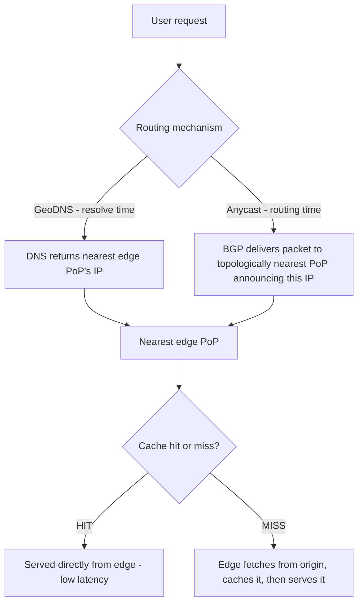
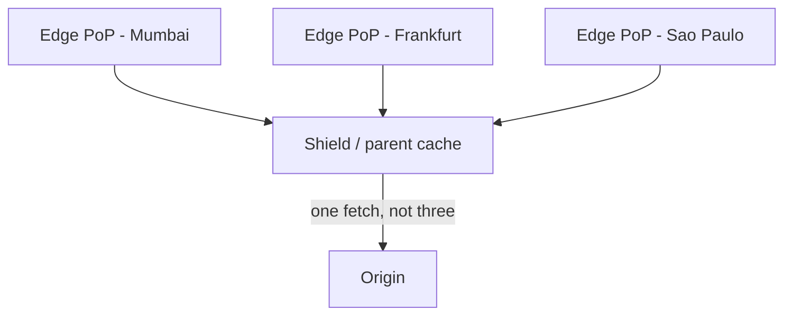

# CDN Internals: Edge Caching, Routing, and Origin Shielding

_Every trick from this level, applied geographically: a CDN is a reverse-proxy cache, cloned across the planet, that DNS/anycast points you at the nearest copy of._

`⏱️ ~10 min · 15 of 17 · L1 Networking`

## Contents

- [What a CDN is and why it exists](#what-a-cdn-is-and-why-it-exists)
- [How a user gets routed to the nearest edge](#how-a-user-gets-routed-to-the-nearest-edge)
- [Edge caching mechanics: the heart of a CDN](#edge-caching-mechanics-the-heart-of-a-cdn)
- [What CDNs cache: static, dynamic, video, and edge compute](#what-cdns-cache-static-dynamic-video-and-edge-compute)
- [Cache invalidation and content freshness](#cache-invalidation-and-content-freshness)
- [Origin shielding / tiered caching](#origin-shielding-tiered-caching)
- [Push vs pull CDNs](#push-vs-pull-cdns)
- [Key metrics](#key-metrics)
- [How a CDN connects to the rest of the edge stack](#how-a-cdn-connects-to-the-rest-of-the-edge-stack)
- [Trade-offs and common confusions](#trade-offs-and-common-confusions)
- [Check yourself](#check-yourself)
- [Real-world and sources](#real-world-and-sources)

## What a CDN is and why it exists

A **CDN (Content Delivery Network)** is a geographically distributed network of edge servers that cache and serve content from a location physically close to the requesting user, instead of every request traveling all the way to one distant **origin** server.

**Key vocabulary:**

- **Origin** — the server (or origin cluster) that holds the authoritative, original copy of the content. The CDN is a layer in front of it, not a replacement for it.
- **Edge server** — a server at the "edge" of the network, i.e. close to end users, that caches and serves content on the origin's behalf.
- **PoP (Point of Presence)** — a physical facility (or logical cluster of edge servers within a facility) at a given geographic location, run by the CDN provider. A large CDN operates hundreds of PoPs worldwide; a request from a user in Mumbai should ideally hit a PoP in or near Mumbai, not one in Virginia.
- **Edge vs origin** — "edge" refers to anything running at these distributed, near-user locations; "origin" refers to the single (or few) authoritative source location(s) the edge falls back to on a cache miss.

**Framing: a CDN is a distributed reverse-proxy cache at the edge.** [11-forward-and-reverse-proxies.md](11-forward-and-reverse-proxies.md) already established the reverse proxy pattern — sit in front of an origin, terminate the client connection, and add cross-cutting capability (caching, TLS termination, request shielding) without the client knowing. A CDN takes that exact pattern and clones it across dozens or hundreds of physical locations, so that "the reverse proxy nearest you" answers instead of always talking to one central instance.

**The four motivations, in order of how directly each maps to physics/economics:**

1. **Latency** — this is pure physics. Round-trip time is bounded below by distance / speed of light through fiber (back-ref L0 latency numbers): a user in Mumbai talking to an origin in Virginia pays roughly 150-200ms of RTT before a single byte of content is even requested, purely from propagation delay, on *every* connection setup step (TCP handshake, TLS handshake, then the request itself — back-ref [04-tcp.md](04-tcp.md), [07-https-tls.md](07-https-tls.md)). A nearby edge PoP might be 5-20ms away. Multiplied across a TCP handshake + TLS handshake + request/response, moving the server from 180ms away to 10ms away doesn't save 170ms once — it saves it on *every* round trip in the exchange.
2. **Origin offload** — every request an edge PoP can answer from cache is a request the origin never sees at all. At scale this is the difference between an origin sized for "all global traffic" versus an origin sized for "cache misses only," which for popular content can be a small fraction of total requests.
3. **Availability and shock absorption** — traffic spikes (a viral post, a product launch, a live event) and even malicious floods (DDoS) hit the edge first, spread across hundreds of geographically dispersed PoPs with enormous aggregate capacity, rather than slamming one origin. The origin is structurally insulated from most of the blast radius (forward-ref DDoS/WAF, L9).
4. **Bandwidth cost** — serving a byte from an edge PoP that's already paid for local peering/transit is typically cheaper than shipping that same byte across a long-haul link from the origin for every single request; caching turns "N requests = N long-haul transfers" into "N requests = 1 long-haul transfer (on the miss) + N-1 short local transfers."

## How a user gets routed to the nearest edge

Getting a client's request to the *nearest healthy* edge PoP, rather than a random or distant one, is a routing problem solved before any HTTP request logic runs at all. There are two canonical mechanisms, and large CDNs typically combine both.

**1. DNS-based routing (GeoDNS / latency-based DNS)** — back-ref [03-dns-deep.md](03-dns-deep.md#geodns-and-location-based-answers), which explicitly forward-referenced this topic. The CDN's authoritative DNS servers hold multiple candidate edge IPs and return a different answer depending on the resolver's apparent location — a user resolving `cdn.example.com` from India gets back the IP of an Indian (or nearest available) PoP; a user in Germany gets a different IP for the identical hostname. This decision is made once, at resolution time, and is then subject to DNS's usual caching/TTL behavior (back-ref topic 3): fast to implement, but reacting to a PoP outage takes as long as the record's TTL to propagate to clients holding a cached answer.

**2. Anycast** — forward-ref [16-anycast-and-bgp.md](#) (next topic covers this in full). The *same* IP address is announced from every PoP simultaneously, and normal internet routing (BGP) delivers each user's packets to whichever announcing location is topologically nearest, with no DNS-level decision involved at all. Failover is a routing-table event (withdraw the route from a dead PoP, traffic reconverges to the next-nearest one), not a TTL wait. This is why large CDNs (Cloudflare, and similar large-scale networks) lean heavily on anycast for their edge IP space — `verify` exact mix per provider.

Both mechanisms answer the same question ("which PoP should handle this user?") at different points in the connection lifecycle — DNS decides before a connection even opens; anycast decides on every packet via routing. Neither replaces the load-balancing and health-check machinery already covered in [13-load-balancers.md](13-load-balancers.md#where-load-balancers-sit-types-and-tiers): GSLB-style DNS routing and anycast are exactly the mechanisms that topic named for getting a client to the nearest *region*; a CDN is the same idea applied at a much finer geographic grain (dozens to hundreds of PoPs instead of a handful of regions).

## Edge caching mechanics: the heart of a CDN

Once a request lands at an edge PoP, the PoP behaves exactly like the reverse-proxy cache introduced in topic 11, just running at edge scale:

- **Cache HIT** — the requested object is already stored at this edge PoP and still considered fresh; it's served directly from the edge, with no trip to the origin at all.
- **Cache MISS** — the object isn't present (or has expired), so the edge fetches it from the origin (or a shield/parent cache — see below), stores a copy locally, and *then* serves it to the user. This first fetch pays full origin round-trip latency; every subsequent request for the same object from that PoP (until it expires or is evicted) is served as a hit.
- **Cache key** — what the edge uses to decide whether two requests are "the same object." Typically the request URL; sometimes extended with specific headers or query parameters if the origin's response genuinely varies by them (e.g. `Accept-Language`, or an image-resizing query parameter) — an over-broad cache key (including irrelevant headers) fragments the cache and tanks the hit ratio; an under-broad one risks serving the wrong variant to the wrong user.
- **Freshness governance** — exactly the HTTP caching headers from [06-http-versions.md](06-http-versions.md): `Cache-Control: max-age=N` (how long, in seconds, a response may be served from cache before it's considered stale), `s-maxage` (a variant that applies specifically to shared/proxy caches like a CDN edge, distinct from a browser's private cache), `Expires` (an older, absolute-time equivalent), and `ETag` (a validator letting a stale-but-present cached copy be revalidated with a cheap conditional request instead of a full re-fetch). The origin, via these headers, is the one telling the edge how long it may reuse a response without asking again.

**The deep mechanics of cache eviction policy (LRU/LFU), write-through/write-back strategies, and cache stampede handling get their own full treatment in the caching level (forward-ref L3)** — this topic's job is the edge-specific shape of caching: where it sits geographically, what triggers a miss, and how freshness is governed by HTTP headers.

### Worked example: first request (miss) vs. second request (hit)

A user in Mumbai requests `https://cdn.example.com/hero-image.jpg`, served by a CDN whose nearest PoP to Mumbai is 8ms away and whose origin lives in Virginia, roughly 190ms RTT from that same PoP.

**Request 1 (cold cache, miss):**

1. User's browser resolves/routes to the Mumbai edge PoP — ~8ms RTT to reach it.
2. Edge checks its cache: no entry for this URL. **Miss.**
3. Edge opens a connection to the origin in Virginia and fetches the object — ~190ms RTT for that fetch (plus the origin's own processing time).
4. Edge stores the response locally, tagged with whatever `Cache-Control: max-age` the origin returned (say, `max-age=86400`, one day).
5. Edge returns the object to the user.
6. **Total user-perceived latency for request 1:** roughly 8ms (user-to-edge) + ~190ms (edge-to-origin round trip) + origin processing ≈ **~200ms+**, dominated by the one-time trip to Virginia.

**Request 2, minutes later, from a different user in Mumbai, same URL:**

1. Routed to the same nearby edge PoP — ~8ms RTT.
2. Edge checks its cache: entry present, and `max-age=86400` hasn't elapsed. **Hit.**
3. Edge serves the cached bytes directly — no trip to the origin at all.
4. **Total user-perceived latency for request 2:** roughly **~8ms**, the round trip to the edge and nothing more.

That's better than a 20x latency improvement for every user after the first, and the origin only ever saw *one* request for this object no matter how many thousands of Mumbai users request it within the TTL window — this is origin offload and latency improvement happening from the exact same mechanism simultaneously.

## What CDNs cache: static, dynamic, video, and edge compute

- **Classic static assets** — images, CSS, JavaScript bundles, downloadable files, fonts. Highly cacheable because the same bytes are correct for every user and change infrequently — the original and still-dominant CDN use case.
- **Video streaming** — the largest volume of CDN traffic on the modern internet by a wide margin. Video is delivered as many small segments (a few seconds each, per protocols like HLS/DASH), and each segment is itself just a static, cacheable object with its own URL — so video streaming is, mechanically, static-asset caching applied to a very large number of small, sequential files, at very high aggregate bandwidth.
- **Dynamic content acceleration** — content that's technically unique per request or per user (API responses, personalized pages) is harder to cache wholesale, but a CDN can still help: by caching *safely cacheable fragments* of a dynamic response, by caching short-TTL API responses where slight staleness is acceptable, or by simply optimizing the path to the origin for genuinely uncacheable requests — keeping warm, persistent, already-TLS-established connections open between the edge and the origin so a user's "uncacheable" request still skips the connection-setup RTT cost even though it can't skip the origin round trip itself.
- **Edge compute** — running actual application code at the edge PoP (e.g. Cloudflare Workers, Lambda@Edge — `verify` current product names/architectures before citing specifics), rather than just caching bytes. This lets logic that used to require a round trip to the origin (auth checks, A/B test assignment, request rewriting, even full request handling) execute at the edge instead — a natural extension of "the edge is just a reverse proxy" into "the edge is a reverse proxy that can also run code." Full depth on this belongs to the cloud level (forward-ref L14).

**Common myth to retire explicitly:** "a CDN is just for static images." Modern CDNs are also DDoS/WAF shields, TLS termination points, dynamic-content accelerators, video delivery platforms, and edge compute platforms — caching static files is the historical starting point, not the ceiling.

## Cache invalidation and content freshness

"There are only two hard things in Computer Science: cache invalidation and naming things" — and a CDN is exactly where cache invalidation gets hard, because the cached copies are scattered across every PoP that has served the object, not sitting in one place.

**Three mechanisms, from passive to active:**

1. **TTL expiry (passive)** — the default. The response simply becomes stale once its `max-age`/`Expires` window elapses, and the *next* request for it triggers a fresh miss-and-refetch. Requires no action by anyone; the trade-off is baked into the TTL length chosen up front.
2. **Purge / invalidation (active)** — explicitly telling the CDN "this object is no longer valid, discard your cached copy everywhere," before its TTL would naturally expire. Granularities vary: **purge by URL** (invalidate one specific object), **purge by tag/surrogate key** (invalidate every cached object tagged with a given key — e.g. "everything related to product ID 4821" — in one call, without needing to enumerate every URL), or **purge-all** (nuclear option, invalidate everything at every PoP — expensive and disruptive, used sparingly). Purges have to propagate to every PoP that might hold a copy, which is itself a distributed-systems problem (it takes some nonzero, provider-specific propagation time — `verify` typical figures before citing).
3. **Cache versioning / cache-busting** — instead of invalidating an old URL, ship the new content under a *new* URL, typically by fingerprinting the filename with a content hash (`app.js` becomes `app.a1b2c3.js`; a new build produces `app.d4e5f6.js`). Old cached copies under the old URL simply become irrelevant (nobody references them anymore) rather than needing to be actively purged, and they're free to sit around with an effectively infinite TTL since the URL itself guarantees the content never changes underneath it. This is the standard approach for build-generated static assets specifically because it sidesteps invalidation entirely.

**The TTL length trade-off, stated plainly:**

| TTL length | Hit ratio / origin load | Freshness |
|---|---|---|
| Long TTL | High hit ratio, low origin load | Slower to reflect updates; users may see stale content until purge or expiry |
| Short TTL | Lower hit ratio, more origin traffic | Near-immediate freshness on every change |

**Stale-while-revalidate (brief, modern middle ground)** — the edge serves the *stale* cached copy immediately (so the user never waits), while asynchronously fetching a fresh copy from the origin in the background to update the cache for the *next* request. This decouples "fast response" from "always perfectly fresh," trading a bounded window of staleness for consistently low latency even right at the edge of TTL expiry — a good default when brief staleness is acceptable but a slow response is not.

## Origin shielding / tiered caching

Without shielding, a popular object's TTL expiring at the same moment across many independent edge PoPs creates an **origin stampede**: dozens or hundreds of PoPs, each seeing a miss simultaneously, all hit the origin at once for what is logically the same object (full stampede mechanics and mitigation get their deep treatment at L3, forward-ref).

**Origin shielding (tiered caching)** solves this by inserting a middle tier: a designated **shield** (or parent/regional) cache sits between the many edge PoPs and the single origin. Edge PoPs, on a miss, fetch from the shield rather than the origin directly; only the shield ever talks to the origin, and it can collapse many simultaneous edge misses for the same object into a single origin fetch.

This is the same "add a tier to reduce fan-in on the next tier down" idea that appeared as tiered load balancing in topic 13 — here applied to caching rather than traffic distribution, but solving a structurally identical problem: many front-line units otherwise pounding a single, expensive resource, tamed by an intermediate layer that absorbs the fan-in.

## Push vs pull CDNs

- **Pull (lazy)** — the default and by far the most common model. The edge does nothing proactively; the *first* request for an object is a miss, triggers a fetch from origin, and populates the cache from that point on. Simple to operate (the origin is the single source of truth, and the CDN never needs to be told about new content in advance) at the cost of that first request always being slow, everywhere, for every object independently until it's been requested once per PoP.
- **Push** — content is proactively uploaded to the CDN ahead of any user request (e.g. via an API or upload step), so it's already resident at edge PoPs before the first real user asks for it. Useful when you know exactly what needs to be available and want to guarantee zero "cold" first requests — e.g. a scheduled content release, or a fixed, known set of assets — at the cost of needing an explicit publish step and (in some architectures) managing storage/expiry proactively rather than letting pull-based caching handle it automatically.

Most general-purpose CDN usage today is pull-based; push is reserved for specific cases where a guaranteed-warm cache before first request matters enough to justify the extra publishing workflow.

## Key metrics

- **Cache hit ratio** — the headline number: what fraction of requests at the edge are served from cache (hits) versus requiring an origin fetch (misses). This is the number CDN/edge engineers optimize above nearly everything else, because it directly drives both of the CDN's core benefits simultaneously — a higher hit ratio means both lower average latency (hits are fast, misses are slow) and lower origin load (hits never reach the origin at all). Every other lever in this document — TTL length, cache key design, tiered shielding, versioning — ultimately exists to push this number up without sacrificing correctness.
- **Origin offload %** — the fraction of total traffic (by request count or by bytes) that never reaches the origin at all, i.e. was absorbed by the edge. Directly downstream of hit ratio.
- **Edge latency** — the response time observed at the edge, which is what matters to the end user; distinguished from origin latency, which only matters on the (ideally rare) miss path.
- **Bandwidth saved** — the volume of data served from edge caches instead of being transferred from the origin on every request; this is the direct driver of the bandwidth-cost motivation from the opening section.

## How a CDN connects to the rest of the edge stack

- **Back to [03-dns-deep.md](03-dns-deep.md#geodns-and-location-based-answers)** — GeoDNS is one of the two mechanisms (alongside anycast) that gets a user's request to the nearest edge PoP in the first place; this topic is the direct payoff of that forward-reference.
- **Forward to [16-anycast-and-bgp.md](#)** — anycast, the other routing mechanism, gets a full mechanical treatment (how BGP actually converges traffic to the nearest announcer) in the very next topic.
- **Back to [11-forward-and-reverse-proxies.md](11-forward-and-reverse-proxies.md)** — a CDN edge PoP is, structurally, exactly a reverse proxy: it terminates the client connection, can hide the origin's real IP from the public internet (the same shielding benefit already covered there), and adds caching as a cross-cutting capability.
- **Back to [13-load-balancers.md](13-load-balancers.md#where-load-balancers-sit-types-and-tiers)** — GSLB routes clients to the nearest healthy region/CDN the same way a CDN routes clients to the nearest PoP; both are the same "route by geography and health" idea at different granularities, and a CDN edge PoP itself typically load-balances across multiple servers within that PoP.
- **Back to [07-https-tls.md](07-https-tls.md#where-tls-gets-terminated-in-real-systems)** — CDN edge PoPs are one of the most common real-world places TLS (and HTTP/3's QUIC handshake) actually terminates, specifically because terminating close to the user avoids paying multiple-RTT handshake cost over a long-haul link; an edge PoP may then re-encrypt (or not) for the hop to origin, exactly the trade-off already covered there.
- **Back to [06-http-versions.md](06-http-versions.md)** — the `Cache-Control`/`ETag`/`max-age` machinery that governs edge freshness is the identical HTTP caching model already introduced; a CDN is the large-scale, geographically distributed application of it.
- **Forward to deep caching strategy (L3)** — eviction policies (LRU/LFU), write-through/write-back, and cache stampede mitigation in general get their full treatment there; this topic covered only the edge-specific shape of caching (geography, miss-triggered origin fetch, shielding).
- **Forward to object/blob storage (L3)** — origins backing large static-asset or video CDNs are very often blob/object stores rather than application servers; the storage side of that gets covered there.
- **Forward to DDoS mitigation and WAF (L9)** — absorbing volumetric attacks at the edge, briefly mentioned under "availability" above, is developed in full there.
- **Forward to edge compute (L14, cloud)** — running actual code at the edge (Workers/Lambda@Edge-style platforms), briefly introduced above, gets its full treatment there.
- **Relates to API gateways ([14-api-gateway.md](14-api-gateway.md))** — a CDN and an API gateway are both edge-sitting reverse-proxy specializations; a CDN specializes in geographic distribution and caching, an API gateway specializes in API cross-cutting concerns (auth, rate limiting, transformation) — real architectures often place a CDN in front of an API gateway, or use a CDN for static/media traffic while API traffic goes straight to the gateway.

## Trade-offs and common confusions

**"A CDN is just for images/static files."** Myth. Modern CDNs also accelerate dynamic/personalized traffic, deliver the majority of the internet's video traffic, run application code at the edge, terminate TLS near the user, and absorb DDoS/attack traffic — caching static assets is the historical starting point, not the whole story.

**Long TTL vs short TTL.** Longer TTLs mean a higher hit ratio and less origin load, at the cost of staler content and slower propagation of updates; shorter TTLs mean fresher content at the cost of more origin traffic and lower hit ratio. There's no universally "correct" TTL — it's a per-content-type decision (a versioned JS bundle can have a near-infinite TTL; a live leaderboard cannot).

**Push vs pull.** Pull is simpler and dominant (cache populates itself lazily on first request); push guarantees a warm cache before any user asks, at the cost of an explicit publish/upload workflow.

**Cache invalidation is genuinely hard, and that's not incidental complexity — it's structural**, because "correct" now depends on coordinating freshness across every PoP that might hold a stale copy, not just one server. Versioned/fingerprinted URLs sidestep the problem for build-generated assets; purge-by-tag mitigates it for everything else, but propagation still takes real time across a distributed set of PoPs.

**Dynamic/personalized content is trickier to cache than static content**, because "the same URL, same response for everyone" is exactly the assumption naive caching relies on, and personalization breaks it — hence cache-key design (varying by user-relevant headers only when truly necessary) and the narrower "accelerate the connection, don't cache the response" fallback for genuinely uncacheable requests.

| | Benefit | Cost |
|---|---|---|
| CDN overall | Lower latency (physics), origin offload, spike/attack absorption, bandwidth savings | Added infrastructure complexity, cost, cache-staleness risk |
| Pull CDN | Simple, no publish step, origin stays source of truth | First request per PoP per object is always slow |
| Push CDN | Guaranteed-warm cache, no cold first request | Requires an explicit publish workflow |
| Long TTL | High hit ratio, low origin load | Slow to reflect updates |
| Short TTL | Fresh content | Lower hit ratio, more origin load |
| Origin shielding | Collapses many simultaneous edge misses into one origin fetch, prevents stampede | Extra tier, extra hop on a true miss |
| Edge compute | Runs logic without an origin round trip | New failure/debugging surface distributed across many locations |

> [!IMPORTANT]
> A CDN is a geographically distributed reverse-proxy cache: DNS-based routing (GeoDNS) or anycast gets each user's request to the nearest edge PoP, and that PoP serves from cache on a hit or fetches-and-caches from the origin on a miss, governed by the same `Cache-Control`/`ETag` freshness rules already covered for HTTP. The entire benefit — lower latency, origin offload, spike/attack absorption, bandwidth savings — flows from that one mechanism, and the entire hard part is keeping cached copies, scattered across every PoP, correctly fresh: TTL expiry handles it passively, purge/invalidation handles it actively, and versioned URLs sidestep the problem for content that changes by getting a new name instead of overwriting an old one. Cache hit ratio is the number that matters most, because it's the single metric that simultaneously drives both latency and origin-load improvements.

## Check yourself

- A user in Mumbai requests an object for the first time from a CDN whose origin is in Virginia. Walk through why that first request is slow, and why the second request from a different Mumbai user is dramatically faster, in terms of which round trips are or aren't paid each time.
- What's the structural difference between GeoDNS and anycast as mechanisms for routing a user to the nearest edge PoP, and why does anycast recover from a PoP outage faster than a GeoDNS-only approach?
- A team ships a new version of their JavaScript bundle under the exact same filename/URL as before, relying on a long `max-age` for caching. What goes wrong, and what's the standard fix?
- Why does inserting a shield/parent cache tier between many edge PoPs and a single origin prevent an origin stampede that a purely edge-only cache topology would suffer from?
- Why is cache hit ratio considered the single most important CDN metric, rather than, say, raw origin latency?

## Real-world and sources

**Netflix Open Connect — push CDN embedded inside ISPs, origin offload at video scale.** Netflix runs its own purpose-built CDN rather than buying from a third party. Open Connect Appliances (OCAs) are shipped free of charge to partner ISPs (over a thousand of them) and physically embedded inside the ISP's own network, alongside 60+ Netflix-run data centers globally. Traffic direction is explicit: an embedded OCA only serves client IP ranges the ISP has advertised to it via BGP, and appliances are pre-filled with content during off-peak hours so the "push" happens before demand hits — the canonical real example of the push-CDN model and origin-offload-by-embedding-at-the-edge covered above, here at the scale of a large fraction of global evening internet traffic. Ties to: push vs pull CDNs; origin offload.

**Fastly — instant purge via surrogate keys, the active-invalidation mechanism at production speed.** Fastly's `Surrogate-Key` header lets an operator tag many cached objects (e.g. every page referencing a given product) with one or more keys, then purge all of them in a single API call instead of enumerating URLs — precisely the "purge by tag/surrogate key" granularity described above. Fastly's own engineering blog states purged copies begin disappearing at the nearest PoP within about 5ms, with worldwide purge propagation typically complete in around 150ms (almost always within 250ms) — close to the theoretical physical limit of roughly 65ms for a light-speed round trip of the globe. Ties to: active purge/invalidation, propagation-time trade-off.

**Cloudflare — anycast at global scale, the network-layer half of "nearest PoP" routing.** Cloudflare's network spans 337 cities across 100+ countries (as of the company's current network page, checked July 2026), with every service running in every location and 95% of the world's internet-connected population within 50ms of a Cloudflare data center. Concretely ties to the anycast-routing mechanism described above: the same IP is announced from every one of those cities and BGP/routing (not DNS) decides which PoP a given user's packets land on. Ties to: anycast routing to the nearest edge.

**AWS CloudFront Origin Shield — the tiered-caching / origin-shielding concept as a shipping product feature.** Origin Shield adds an explicit extra caching tier, built on CloudFront's regional edge caches, that sits between all of CloudFront's edge locations and the origin. AWS's own documentation states that with Origin Shield enabled, requests for an uncached object from every edge location and regional edge cache are consolidated so that "as few as one request" reaches the origin per object — the exact origin-stampede-collapsing mechanism this topic describes — and it also improves cache hit ratio by adding a caching layer in front of the origin. Ties to: origin shielding / tiered caching, origin stampede mitigation.

### Sources / further reading

- [Netflix Open Connect — overview](https://openconnect.netflix.com/en/) — accessed July 2026
- [Netflix Open Connect — requirements for deploying embedded appliances](https://openconnect.netflix.com/deployment-guide/requirements-for-deploying-embedded-appliances/) — accessed July 2026
- [Fastly — Is purging still the hardest problem in computer science?](https://www.fastly.com/blog/is-purging-still-the-hardest-problem-in-computer-science) — accessed July 2026
- [Fastly — Purging with surrogate keys (documentation)](https://www.fastly.com/documentation/guides/full-site-delivery/purging/purging-with-surrogate-keys/) — accessed July 2026
- [Cloudflare — Global Network / data center locations](https://www.cloudflare.com/network/) — accessed July 2026
- [AWS — Use Amazon CloudFront Origin Shield (documentation)](https://docs.aws.amazon.com/AmazonCloudFront/latest/DeveloperGuide/origin-shield.html) — accessed July 2026
- [AWS — Announcing Amazon CloudFront Origin Shield](https://aws.amazon.com/about-aws/whats-new/2020/10/announcing-amazon-cloudfront-origin-shield/) — accessed July 2026
