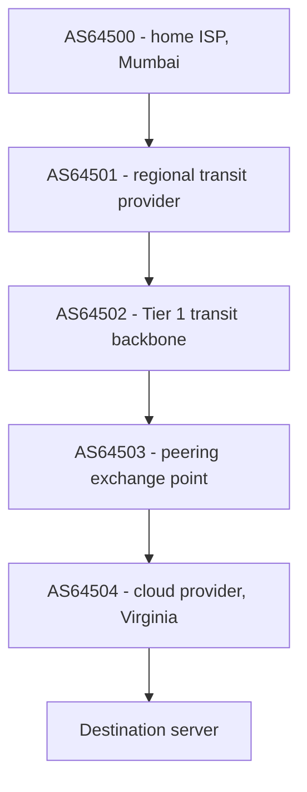
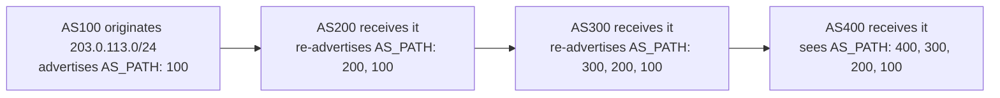
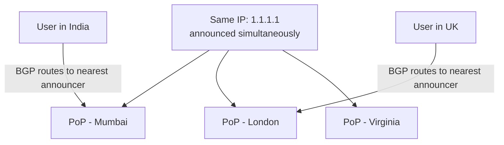

# Anycast and BGP Basics: How Traffic Finds Its Way Across the Internet

_The mechanism behind every forward-reference so far: how 1.1.1.1 answers from wherever you are, how a CDN edge finds you, and how a load balancer's VIP survives a data center dying._

`⏱️ ~11 min · 16 of 17 · L1 Networking`

## Contents

- [The gap this topic fills](#the-gap-this-topic-fills)
- [The internet is a network of networks](#the-internet-is-a-network-of-networks)
- [BGP: what it does and how routes propagate](#bgp-what-it-does-and-how-routes-propagate)
- [From BGP routes to an actual forwarded packet](#from-bgp-routes-to-an-actual-forwarded-packet)
- [The four delivery modes: unicast, broadcast, multicast, anycast](#the-four-delivery-modes-unicast-broadcast-multicast-anycast)
- [Anycast in depth: one IP, many places, nearest wins](#anycast-in-depth-one-ip-many-places-nearest-wins)
- [Why anycast matters for system design](#why-anycast-matters-for-system-design)
- [Anycast's caveat: stateless-friendly, stateful-tricky](#anycasts-caveat-stateless-friendly-stateful-tricky)
- [BGP fragility and security, briefly](#bgp-fragility-and-security-briefly)
- [How this connects to the rest of the stack](#how-this-connects-to-the-rest-of-the-stack)
- [Trade-offs and common confusions](#trade-offs-and-common-confusions)
- [Check yourself](#check-yourself)
- [Real-world and sources](#real-world-and-sources)

## The gap this topic fills

[02-ip-addressing-and-subnets.md](02-ip-addressing-and-subnets.md) established that every packet carries a destination IP, and that routers forward it using **longest-prefix match** against a routing table. But a real routing table doesn't get built by magic — and a packet leaving a phone in Mumbai bound for a server in Virginia crosses dozens of independently-owned networks (a home ISP, a regional carrier, a transit provider, a cloud provider's own network) before it arrives. None of those networks are under common ownership or management. This topic explains the protocol that makes that handoff work at all: **BGP**, and one of its most consequential side effects for system design: **anycast**.

Vocabulary to nail down first:

- **Autonomous System (AS)** — an independently-operated network with its own routing policy: an ISP, a cloud provider, a university, a large company. Each AS decides internally how it routes packets and externally what it's willing to tell (and accept from) other ASes.
- **AS Number (ASN)** — a globally unique number identifying an AS (e.g. `AS15169` for Google, `verify` current assignment), used as the "who" in every routing conversation between networks.
- **Route / route advertisement** — a statement of the form "I (this AS) can deliver packets to this IP prefix." Advertising a route means telling your neighboring ASes about it so they, in turn, can route traffic toward you.
- **Inter-domain vs intra-domain routing** — *intra-domain* is routing **within** one AS (that AS's own internal routers, using an **Interior Gateway Protocol** like OSPF or IS-IS — name only, out of scope here); *inter-domain* is routing **between** ASes, which is exclusively BGP's job. This topic is about the inter-domain layer.
- **Peering vs transit** — two commercial/technical relationships between ASes. **Peering** is a (often settlement-free) agreement where two networks directly exchange traffic destined for each other's customers, with no money changing hands, because it benefits both roughly equally. **Transit** is a paid relationship: a smaller AS pays a larger upstream provider to carry its traffic to the rest of the internet — i.e. buying reachability to everything the upstream can already reach. Most real ASes have a mix of both.

## The internet is a network of networks

There is no single "the internet router." The internet is, structurally, tens of thousands of independently-operated **autonomous systems** stitched together by bilateral and multilateral agreements (peering and transit), with **BGP (Border Gateway Protocol, RFC 4271)** as the shared language every AS uses to tell its neighbors what it can reach.

Nothing here requires a single central authority. Each AS only needs to agree with its immediate neighbors on what to advertise and accept — global reachability emerges from the sum of many local, bilateral BGP conversations, the same way the internet as a whole has no single owner.

## BGP: what it does and how routes propagate

BGP is a **path-vector protocol**. Each route advertisement doesn't just say "here's a prefix" — it carries the entire list of ASes the route has already traversed, called the **AS_PATH**. As a route propagates outward from its origin, every AS that re-advertises it to a further neighbor prepends its own ASN to that list.

This single mechanism buys two things at once:

- **Loop avoidance** — if an AS ever sees its own ASN already present in an incoming route's AS_PATH, it knows accepting that route would create a loop, and discards it.
- **A crude cost signal and policy hook** — the AS_PATH length (number of AS hops) is one input into choosing the "best" route, and because the full path is visible, an AS can also apply policy based on *which* ASes appear in it (e.g. "prefer routes through my paid transit provider over a peer," or "never route through this AS at all").

**Route selection is policy-driven, not purely shortest-path.** When an AS learns multiple routes to the same prefix from different neighbors, it runs a **best-path selection** process. Shorter AS_PATH is a common, well-known tie-breaker, but in practice **local preference** (an operator-configured ranking of neighbors, e.g. "always prefer my free peering links over my paid transit link, regardless of path length") and other attributes typically dominate the decision before AS_PATH length is even consulted — BGP is fundamentally a policy engine that networks use to express *business* routing preferences (cost, contracts, capacity), not just a shortest-path calculator. `verify` the exact full attribute-precedence order before citing it in detail; the point that matters here is that it's policy-first, not distance-first.

**Trust-based, by design.** BGP has no built-in mechanism that verifies an AS advertising a prefix actually has the right to do so — an AS advertisement is essentially an unverified claim, "trust me, I can deliver packets to this range." This was a reasonable assumption when BGP was designed for a small number of cooperating research/academic networks; at internet scale, with tens of thousands of independently-operated ASes, it's the single root cause of BGP's best-known failure mode (covered below).

By the time the advertisement reaches AS400, it carries the full breadcrumb trail back to the origin, and AS400 now knows both *that* it can reach `203.0.113.0/24` and *via which chain of networks* — information it can use for both loop detection and policy.

## From BGP routes to an actual forwarded packet

BGP's job ends at building each AS's **routing table**: a list of IP prefixes and, for each, the best next-hop AS to forward toward. Actually moving a packet is the same mechanism already covered in topic 2, just fed by BGP-learned entries instead of only local/static ones:

1. A router receives a packet addressed to some destination IP.
2. It looks through its routing table for every prefix that contains that destination IP.
3. It picks the **longest matching prefix** (the most specific match — back-ref [02-ip-addressing-and-subnets.md](02-ip-addressing-and-subnets.md#longest-prefix-match)) among the candidates.
4. That entry's next-hop tells the router which neighboring AS (and which physical interface) to forward the packet toward.
5. Repeat at every hop until the packet reaches an AS that owns the destination prefix directly.

So the routing table entries a border router consults for inter-domain traffic are populated by BGP; the *mechanics* of matching a destination IP against them are identical longest-prefix match already learned. BGP answers "which prefixes exist and how do I reach them"; longest-prefix match answers "given this packet, which of my known routes actually applies."

## The four delivery modes: unicast, broadcast, multicast, anycast

IP addressing supports four distinct delivery models, distinguished by **how many recipients a single packet is meant to reach**:

| Mode | Delivery pattern | Typical use |
|---|---|---|
| **Unicast** | One sender to exactly **one** specific receiver | The overwhelming default — a normal client-to-server connection, an HTTP request, a TCP connection |
| **Broadcast** | One sender to **all** hosts on a local network segment | ARP requests, DHCP discovery — inherently local, doesn't cross routers by default |
| **Multicast** | One sender to a **subscribed group** of interested receivers, wherever they are | IPTV-style live-stream distribution, some routing protocol chatter — receivers opt in to a multicast group |
| **Anycast** | One sender's packet delivered to **whichever one** of several receivers announcing the *same* address is topologically **nearest** | DNS root/recursive resolvers (1.1.1.1, 8.8.8.8), CDN edge PoPs, anycast load-balancer VIPs |

Unicast, broadcast, and multicast are all classic, textbook IP delivery concepts. Anycast is the one that matters most for modern system design, and it works differently from the other three — it isn't really a separate *packet* format at all, it's a **routing trick**: the same IP address is simply valid at multiple physical locations simultaneously, and ordinary unicast routing (via BGP) is what decides, per-router, which of those locations a given packet actually goes to.

## Anycast in depth: one IP, many places, nearest wins

**Anycast is a routing-layer illusion**: the *identical* IP address (or prefix) is announced into BGP from **multiple, geographically distinct physical locations** at the same time. Every router that receives these advertisements just sees several candidate routes to the same prefix, each with a different path, and applies its ordinary best-path selection (as covered above) to pick one — which in practice tends to favor whichever origin is topologically closest, because a closer origin usually arrives with a shorter AS_PATH and better link metrics. The result: a user in Mumbai and a user in London can both send a packet to `1.1.1.1`, and normal BGP best-path routing independently delivers each one to a *different* physical server, without either user's device knowing anything special happened.

Nothing about the packet itself is special — no new header field, no extra flag. The trick is entirely that BGP naturally converges each router's traffic toward whichever announcing origin looks "best" by its own path-selection logic, and "best" usually correlates strongly with "physically/topologically nearest," because network distance (fewer AS hops, better peering) tends to track physical distance reasonably well, though not perfectly (`verify` — topological and geographic distance can diverge, e.g. a peering relationship might make a farther-but-well-connected PoP look "closer" in BGP terms than a nearer-but-poorly-peered one).

## Why anycast matters for system design

Three concrete, forward-referenced benefits, now fully explained:

1. **Automatic nearest-edge routing, at the network layer.** This is exactly the mechanism that CDNs ([15-cdn-internals.md](15-cdn-internals.md#how-a-user-gets-routed-to-the-nearest-edge)) and anycast DNS resolvers ([03-dns-deep.md](03-dns-deep.md)) rely on to route users to the nearest PoP: no DNS lookup decision is even needed to pick the "right" server, because the *same address* simply routes differently depending on where the request originates. A user resolving `1.1.1.1` always gets back the literal same IP everywhere on Earth — the routing fabric, not DNS, decides which physical machine actually answers.
2. **Built-in high availability and fast failover.** If a PoP goes down (crashes, loses power, gets disconnected), it simply stops announcing its route into BGP. Neighboring routers notice the route is withdrawn, recompute their best path, and reconverge onto the next-nearest surviving PoP still announcing the same IP — a routing-table event that typically happens on the order of seconds, not a DNS TTL wait of minutes (back-ref [13-load-balancers.md](13-load-balancers.md#high-availability-of-the-load-balancer-itself), where this exact mechanism was forward-referenced for load-balancer VIP high availability).
3. **DDoS absorption by dilution.** An attack flooding traffic at an anycast IP doesn't concentrate on one machine — BGP naturally spreads that flood across *every* PoP announcing the address, roughly in proportion to how much attack traffic originates near each PoP, turning one machine's worth of attack volume into many machines' worth of aggregate absorption capacity (full DDoS-mitigation depth forward-ref [L9](../../../lessons/backend/L9)).

**Anycast vs GeoDNS — the two ways to route to the nearest edge, contrasted.** [03-dns-deep.md](03-dns-deep.md) and [15-cdn-internals.md](15-cdn-internals.md#how-a-user-gets-routed-to-the-nearest-edge) already introduced GeoDNS as the DNS-layer alternative. They solve the identical problem ("get this user to their nearest PoP") at different points in the stack:

| | GeoDNS | Anycast |
|---|---|---|
| **Layer the decision is made at** | DNS resolution time | Every-packet routing time (network layer) |
| **Mechanism** | Authoritative DNS returns a different IP based on resolver location | Same IP announced from every PoP; BGP delivers each packet to the nearest announcer |
| **Failover speed** | Bounded by DNS record TTL and resolver caching (can be minutes) | Bounded by BGP reconvergence (typically seconds) |
| **Client visibility** | Different users get literally different IPs for the same hostname | Every user gets the identical IP everywhere |
| **Granularity of control** | Fine — can route by resolver geolocation, weighting, health, business logic | Coarser — governed by whatever BGP's path selection naturally does |

Neither replaces the other outright; many large-scale edge networks combine both (GeoDNS for coarse, policy-rich decisions; anycast underneath for fast failover and network-layer nearest-routing) — exactly what [15-cdn-internals.md](15-cdn-internals.md#how-a-user-gets-routed-to-the-nearest-edge) already noted when it forward-referenced this topic.

## Anycast's caveat: stateless-friendly, stateful-tricky

Anycast works cleanly when every request is short and independent, because BGP's routing decision only needs to be "reasonably good," not "identical on every single packet forever." This is exactly why anycast is the default for **DNS** (each query is one small, independent UDP round trip) and works well for short **HTTP** request/response exchanges served from cache at the edge.

It gets genuinely trickier for **long-lived, stateful connections** — most notably a long TCP connection. If BGP's best path recomputes mid-connection (a router reconverges, a link flaps, a route gets withdrawn), packets belonging to an *already-established* connection can suddenly start arriving at a **different** physical PoP than the one that has the connection's state (its TCP sequence numbers, its TLS session, its application-level session data) — and that new PoP has no idea the connection exists, so it typically just resets it. `verify` the specifics of how frequently this actually happens in production and what mitigations (e.g. keeping BGP announcements deliberately stable, session affinity tricks, or falling back to unicast/GeoDNS for long sessions) large anycast operators use in practice — but the structural nuance itself is real and worth internalizing: **anycast's "nearest wins" guarantee is a per-packet routing decision, not a per-connection guarantee**, which is precisely why it's such a good fit for UDP/DNS and short HTTP, and needs deliberate care for long-lived TCP.

## BGP fragility and security, briefly

Because BGP is fundamentally **trust-based** — an AS announces what it *claims* to be able to reach, with no protocol-level proof — a misconfigured or malicious AS can announce a prefix it has no right to serve:

- **BGP hijacking** — an AS announces someone else's IP prefix (accidentally or maliciously), and because that announcement can look just as valid as the legitimate one to any neighboring router doing ordinary best-path selection, traffic meant for the real owner can get misdirected toward the hijacking AS instead — anywhere from a full outage (if the hijacker just black-holes the traffic) to interception (if the hijacker actually forwards it on, after inspecting or tampering with it).
- **Route leaks** — an AS advertises routes it learned from one neighbor onward to a party it shouldn't (e.g. a customer's routes leaked out to the wrong upstream), against the originating network's intended policy, without necessarily being malicious — just a configuration mistake with real, sometimes internet-wide, consequences.

There have been well-documented, internet-scale outages and traffic-interception incidents attributed to BGP hijacks and leaks over the years — a canonical, verified one is walked through in the enrichment section below.

**Mitigation, by name only (full depth forward-ref [L9 Security](../../../lessons/backend/L9)):** **RPKI (Resource Public Key Infrastructure)** and **Route Origin Validation (ROV)** let a prefix owner cryptographically attest which AS is authorized to originate it, so participating networks can reject bogus announcements before accepting them into their routing tables. Adoption is real but not universal — `verify` current adoption figures before citing them.

## How this connects to the rest of the stack

- **Back to [02-ip-addressing-and-subnets.md](02-ip-addressing-and-subnets.md#longest-prefix-match)** — BGP is what *populates* the inter-domain routing table; longest-prefix match is the mechanism that *uses* it to forward any individual packet, at every hop.
- **Back to [03-dns-deep.md](03-dns-deep.md)** — anycast recursive DNS resolvers (1.1.1.1, 8.8.8.8) and GeoDNS are the two nearest-edge mechanisms first introduced there; this topic supplies anycast's full internal mechanics.
- **Back to [13-load-balancers.md](13-load-balancers.md#high-availability-of-the-load-balancer-itself)** — anycast VIPs for load-balancer HA, forward-referenced there, now have their full explanation: BGP route withdrawal on failure, reconvergence to the next-nearest instance.
- **Back to [15-cdn-internals.md](15-cdn-internals.md#how-a-user-gets-routed-to-the-nearest-edge)** — this topic is the direct mechanical payoff of that forward-reference: how BGP actually converges each user's traffic onto the nearest announcing PoP.
- **Relates to Maglev-style anycast load balancers (introduced in [13-load-balancers.md](13-load-balancers.md#real-world-and-sources))** — announcing a load balancer's service IP via BGP anycast, combined with a consistent-hashing scheduler behind it, is exactly how large anycast-fronted load-balancer fleets make "any instance can answer, and failing one out is a route withdrawal" true simultaneously.
- **Forward to DDoS mitigation and WAF ([L9 Security](../../../lessons/backend/L9))** — anycast's traffic-dilution property, and RPKI/Route Origin Validation as a hijack defense, both get their full treatment there.
- **Forward to multi-region and disaster recovery ([L7/L8 Reliability](../../../lessons/backend/L7))** — anycast-based failover is one concrete mechanism among a broader set of multi-region failover strategies covered in depth there.
- **Forward to WebRTC (next topic, [17])** — WebRTC's peer-to-peer connection establishment operates *above* this layer entirely (it deals with NAT traversal and per-application connectivity, back-ref [12-nat.md](12-nat.md)), but every packet it sends still rides on the same BGP-routed internet fabric described here.

## Trade-offs and common confusions

**"Anycast means many servers share one IP, like a load-balancer pool."** Close, but the mechanism is different: a load balancer's backend pool is invisible to the network — routers only ever see the LB's one VIP. Anycast, by contrast, *is itself a routing-layer phenomenon* — the "many machines, one IP" behavior emerges directly from BGP route selection across physically separate announcement points, not from a single in-path device forwarding to a pool behind it.

**Anycast vs GeoDNS are not competitors to pick one over the other** — they operate at different layers (DNS-resolution-time vs every-packet-routing-time) and large-scale edge networks commonly layer both.

**"BGP always picks the shortest path."** Not reliably true in practice — local preference and other policy attributes typically override raw AS_PATH length; BGP is a policy engine expressing business/contractual routing preferences first, distance second.

**Anycast is not magic for every workload.** It shines for short, stateless, or cache-servable request/response traffic (DNS, CDN cache hits); long-lived stateful TCP connections need extra care because a mid-connection re-route can land packets at a PoP with no knowledge of that connection.

**BGP's trust model is a feature and a liability simultaneously** — it's *why* the internet scales without central coordination (every AS just announces what it has and trusts its neighbors), and it's *why* hijacks and leaks are structurally possible at all.

| | Benefit | Cost |
|---|---|---|
| BGP overall | Lets tens of thousands of independent networks interoperate with no central authority | Trust-based — no built-in verification of who's allowed to announce what |
| Anycast | Nearest-edge routing "for free," fast BGP-speed failover, DDoS traffic dilution | Coarser control than GeoDNS; risky for long-lived stateful connections |
| GeoDNS | Fine-grained, policy-rich control over which users get which IP | Failover bounded by DNS caching/TTL, can be slow |
| Policy-first best-path selection | Lets operators express real business/cost preferences, not just distance | Makes "why did my traffic take that path" much harder to predict from AS_PATH length alone |

> [!IMPORTANT]
> The internet has no central router — it's tens of thousands of independently-run **autonomous systems**, and **BGP** is the trust-based, policy-driven, path-vector protocol they use to tell each other what IP prefixes they can reach, building the routing tables that longest-prefix match then uses to forward every individual packet. **Anycast** is what happens when the *same* IP is announced from many physical locations at once: ordinary BGP best-path selection, applied independently by every router, naturally delivers each user's traffic to whichever announcing location looks nearest — which is the exact mechanism under anycast DNS resolvers, CDN edge routing, and anycast load-balancer HA, giving automatic nearest-edge routing and BGP-speed failover essentially for free, at the cost of being a coarser, harder-to-fine-tune, and stateful-connection-unfriendly tool compared to GeoDNS.

## Check yourself

- Explain, in one sentence each, the difference between what BGP does and what longest-prefix match does, and how the two work together to forward a single packet across the internet.
- A user in Mumbai and a user in London both send a request to the exact same IP address, `1.1.1.1`, and end up talking to two different physical servers. What made that happen, and at which layer was the decision made?
- Why is anycast's fast, BGP-speed failover a better fit for DNS and CDN cache-hit traffic than for a long-lived WebSocket connection?
- What structural property of BGP (not a specific incident) makes route hijacking possible in the first place, and name the modern mitigation (by name only) that lets a network cryptographically verify who's allowed to originate a given prefix.
- Contrast anycast and GeoDNS as two different answers to "route this user to their nearest edge PoP" — which layer does each operate at, and which one recovers faster from a PoP outage, and why?

## Real-world and sources

**Cloudflare's 1.1.1.1 and CDN network — anycast as the whole network's routing model.** Cloudflare announces the same IP prefixes (e.g. `1.1.1.0/24`) from every one of its data centers via BGP, so ordinary best-path selection is what lands each user on their nearest PoP — "no DNS-based geo-routing, no GeoIP lookups in your app." Cloudflare's own primer states they "can take an entire data center offline and traffic will automatically flow to the next closest data center" without manual failover, and that a distributed DDoS flood against an anycast IP gets naturally split so "a distributed botnet will have a portion of its denial of service traffic absorbed by each of our data centers" — the direct real-world instance of this file's "nearest-edge routing" and "DDoS dilution" points. Ties to: anycast = same IP from many PoPs routed to nearest; DDoS dilution.

**Google Public DNS (8.8.8.8) — anycast at trillion-query scale.** Google's own FAQ states plainly: "Anycast routing directs your queries to the closest Google Public DNS server," and that clients querying `8.8.8.8`, `8.8.4.4`, or the IPv6 addresses under `2001:4860:4860::` "are routed to the nearest location advertising the anycast address used," served from Google's Edge PoPs and Core data centers. A second, independent large-scale confirmation that a single anycast IP resolving to "nearest physical machine" is standard practice, not a Cloudflare-specific trick. Ties to: anycast = one-to-nearest routing at the network layer, no DNS-layer decision needed.

**The 13 DNS root server letters — the canonical, oldest large-scale anycast deployment.** Each of the 13 root server "letters" (A through M) is a single logical IP, but root-servers.org reports (as of 2026-07-09) that the root server system runs **2,003 operational anycast instances** worldwide, operated by 12 independent root server operators — with instance counts varying wildly per letter (e.g. F-root alone historically runs hundreds of instances, while others run only a handful). This is the textbook illustration of "same IP, many physical locations, BGP decides which one wins" predating CDN-style anycast by years. Ties to: anycast = same IP, many PoPs, nearest wins.

**The October 2021 Facebook outage — BGP's trust-based fragility, illustrated by a self-inflicted withdrawal (not a hijack).** Per Cloudflare's incident writeup, at 15:39-15:58 UTC on October 4, 2021, Facebook's own network stopped announcing the BGP routes to its DNS server prefixes during a maintenance operation that accidentally disconnected its backbone; Facebook's DNS servers were themselves designed to withdraw their BGP announcements if they lost connectivity to Facebook's data centers, so once the backbone dropped, the DNS prefixes vanished from the global routing table too, and every resolver on earth started returning SERVFAIL for facebook.com, WhatsApp, and Instagram. Routes were restored and DNS resolvable again by roughly 21:05-21:20 UTC — a ~5.5 hour outage. This wasn't a malicious hijack, but it's a clean, verified illustration of the same structural fact this file makes about BGP: reachability is entirely a function of what's currently announced, with no independent verification layer, so a route withdrawal (accidental or deliberate) is immediately and globally believed. Ties to: BGP's trust-based fragility; route withdrawal as the mechanism behind both intentional failover and accidental catastrophic outages.

### Sources / further reading

- Cloudflare, "A Brief Anycast Primer" — https://blog.cloudflare.com/a-brief-anycast-primer/ (accessed 2026-07-09)
- Cloudflare, "What is Anycast? How does Anycast Work?" — https://www.cloudflare.com/learning/cdn/glossary/anycast-network/ (accessed 2026-07-09)
- Google for Developers, Public DNS FAQ (anycast routing statement) — https://developers.google.com/speed/public-dns/faq (accessed 2026-07-09)
- Root Server Technical Operations Association, live instance count — https://root-servers.org (accessed 2026-07-09)
- Cloudflare, "Understanding how Facebook disappeared from the Internet" (Oct 2021 outage postmortem) — https://blog.cloudflare.com/october-2021-facebook-outage/ (accessed 2026-07-09)
- Cloudflare, "What happened on the Internet during the Facebook outage" — https://blog.cloudflare.com/during-the-facebook-outage/ (accessed 2026-07-09)
