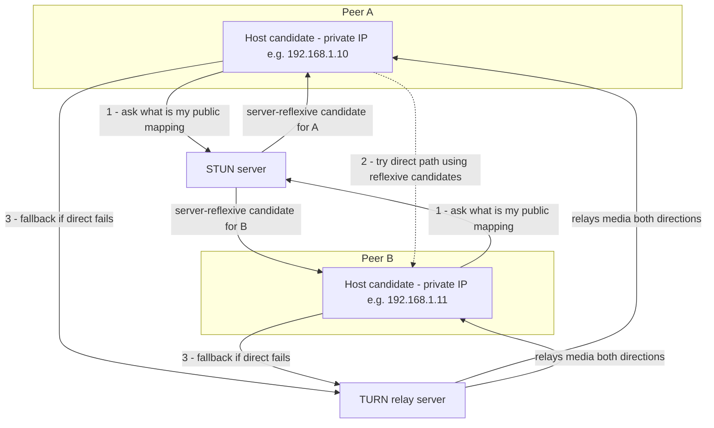
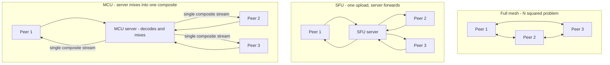

# WebRTC: Peer-to-Peer Media and Data Straight Between Browsers

*Every real-time mechanism you have studied so far -- WebSockets, SSE, long polling -- shares one property: the server is always in the middle. This is the topic where that assumption finally breaks: two browsers, each sitting behind their own NAT, learn to talk directly to each other.*

`⏱️ ~8 min · 17 of 17 · L1 Networking`

## Contents

- [What WebRTC is and why](#what-webrtc-is-and-why)
- [The core APIs, conceptually](#the-core-apis-conceptually)
- [Why it's hard: the connectivity problem](#why-its-hard-the-connectivity-problem)
- [Signaling: the part WebRTC does not define](#signaling-the-part-webrtc-does-not-define)
- [ICE, STUN, and TURN in depth](#ice-stun-and-turn-in-depth)
- [What flows once connected: media vs data](#what-flows-once-connected-media-vs-data)
- [Scaling beyond 1:1: mesh, SFU, and MCU](#scaling-beyond-11-mesh-sfu-and-mcu)
- [How WebRTC connects to the rest of L1](#how-webrtc-connects-to-the-rest-of-l1)
- [Trade-offs and common confusions](#trade-offs-and-common-confusions)
- [Worked example: a two-person video call, start to finish](#worked-example-a-two-person-video-call-start-to-finish)
- [Closing note: the L1 arc](#closing-note-the-l1-arc)
- [Check yourself](#check-yourself)
- [Real-world and sources](#real-world-and-sources)

## What WebRTC is and why

**WebRTC (Web Real-Time Communication)** is an open standard, developed jointly by the W3C (the browser-facing APIs) and the IETF (the underlying protocols), that lets two clients -- most commonly two web browsers, but also native mobile and desktop apps via the same underlying libraries -- exchange **real-time audio, video, and arbitrary data directly with each other**, with no browser plugin required. Google open-sourced its own implementation (`libwebrtc`) early in the project's life, and that codebase (or a fork of it) is what powers the large majority of production WebRTC deployments across browsers and native apps today.

**The one-line definition:** WebRTC is a browser-native standard for low-latency, peer-to-peer audio, video, and data, secured by default, that browsers can use without installing anything extra.

**The key departure from everything else in L1.** [08-websockets-sse-long-polling.md](08-websockets-sse-long-polling.md) built up an entire ladder of real-time mechanisms -- short polling, long polling, SSE, WebSockets -- and every single one of them is **client-server**: a browser talks to a server, and if two browsers need to reach each other, the server relays every byte between them. WebRTC breaks that assumption. When it can, WebRTC sends media **directly** between the two peers -- browser to browser, with no application server sitting in the data path at all. This is the reason the topic exists: nothing else covered in L1 does true peer-to-peer.

**Why peer-to-peer, specifically:**

- **Lowest possible latency.** Every extra hop through a server adds queuing, processing, and geographic detour. A direct path is, by definition, the shortest path available.
- **No server bandwidth cost for the media itself.** A video call between two people can carry several megabits per second in each direction; if that traffic goes point-to-point, the application provider pays nothing to carry it. Compare this to relaying every user's video through a server, which would require provisioning server bandwidth proportional to the number of concurrent calls -- expensive at scale.

**Real-time media, precisely.** "Real-time" here means the same thing it meant when [05-udp.md](05-udp.md) introduced it: freshness matters more than completeness. A video frame that arrives late is often useless -- by the time it's retransmitted and arrives, the call has moved on. This is exactly why WebRTC's media path is built on UDP rather than TCP, a decision explained fully below.

## The core APIs, conceptually

WebRTC exposes three JavaScript APIs in the browser (native apps use equivalent library calls). Understanding what each one is *for*, conceptually, is enough at this level -- the exact method signatures are an implementation detail outside L1's scope.

| API | What it's for |
|---|---|
| **`getUserMedia()`** | Asks the browser for permission to capture local audio/video from the user's camera and microphone (or screen, via a sibling API), producing a local media stream to send. |
| **`RTCPeerConnection`** | The actual connection object -- this is where ICE candidate gathering, the SDP offer/answer exchange, and the encrypted media/data transport all live. This is the heart of WebRTC. |
| **`RTCDataChannel`** | A channel, opened on top of an `RTCPeerConnection`, for sending arbitrary application data (not audio/video) directly between peers -- game state, file chunks, chat text, anything. |

The whole rest of this topic is really an explanation of what `RTCPeerConnection` has to do internally to make a direct connection exist at all.

## Why it's hard: the connectivity problem

[12-nat.md](12-nat.md#nat-traversal-the-hard-part-for-peer-to-peer) already introduced the core obstacle in full: the overwhelming majority of real devices -- laptops, phones -- sit behind **NAT**, with a private IP address that nothing on the public internet can dial into directly. A NAT device only builds a translation-table entry from *outbound* traffic; an unsolicited inbound packet from a peer who has never been talked to before has no matching entry and gets silently dropped.

Now put two such devices on either side of a video call. Alice is behind her home router's NAT; Bob is behind his mobile carrier's NAT. Neither has a public IP the other can simply connect to. Neither can be "the server" in the ordinary client-server sense, because neither is reachable from the outside without help. This is precisely the NAT-traversal problem from topic 12, now faced by an application that specifically needs a **direct, low-latency, bidirectional** path -- not just an occasional request/response.

WebRTC's entire connectivity machinery -- everything in the next two sections -- exists to solve exactly this problem: get two NAT'd peers to find a path to each other, direct if at all possible, relayed if not.

## Signaling: the part WebRTC does not define

Before Alice and Bob's browsers can even attempt to connect, they need to exchange some metadata:

- **Session descriptions (SDP -- Session Description Protocol)**: a text blob each side generates describing what it's offering -- what media it wants to send (audio, video, codecs it supports, resolution constraints) and (once ICE gathering starts) what data channels it wants. One side generates an **SDP offer**; the other replies with an **SDP answer**.
- **ICE candidates**: as covered in detail below, a list of addresses (IP:port pairs) each peer might be reachable at.

**Both of these have to travel from Alice's browser to Bob's browser somehow, before any direct connection exists between them** -- and this is the single most important thing to internalize about WebRTC: **the WebRTC standard deliberately does not define how that exchange happens.** It defines the *format* of the messages (SDP, ICE candidates) but leaves the *transport* -- the **signaling channel** -- entirely up to the application.

**Why leave it undefined?** Different applications already have their own server infrastructure and their own ideas about identity, presence, and room management (who's calling whom, is the callee online, is this a group call) -- forcing one specific signaling protocol on every WebRTC application would be redundant and restrictive. Instead, WebRTC assumes you already have *some* way to get a small blob of text from one browser to another and lets you reuse whatever you have.

**In practice, almost everyone reaches for the same tool: a WebSocket server** ([08-websockets-sse-long-polling.md](08-websockets-sse-long-polling.md#websockets-a-real-full-duplex-channel)) -- both browsers hold an open, bidirectional connection to an application server, and that server simply relays the offer/answer/candidate messages between them. (Some applications use HTTP long polling, SIP, or even a completely out-of-band channel like a phone call reading out a code, but WebSocket is by far the most common shape in production.)

**The critical distinction: the signaling server brokers the introduction, but once (and if) a direct connection forms, media does NOT flow through it.** The signaling server's entire job is done the moment both peers have exchanged enough information to attempt a direct connection -- it never sees a single audio or video frame in the pure peer-to-peer case. This is genuinely easy to miss on first exposure: people sometimes assume "there's a server involved, so it must be relaying everything," but the server's role here is introduction only, not transport.

```mermaid
sequenceDiagram
    participant A as Peer A - browser
    participant Sig as Signaling server - e.g. WebSocket
    participant B as Peer B - browser

    Note over A,B: Neither peer can reach the other directly yet
    A->>Sig: SDP offer
    Sig->>B: relay SDP offer
    B->>Sig: SDP answer
    Sig->>A: relay SDP answer
    A->>Sig: ICE candidates - as gathered
    Sig->>B: relay ICE candidates
    B->>Sig: ICE candidates - as gathered
    Sig->>A: relay ICE candidates
    Note over A,B: Both sides now try candidate pairs
    A->>B: direct media and data path forms - DTLS-SRTP over UDP
    Note over A,Sig,B: Signaling server is no longer in the media path
```

## ICE, STUN, and TURN in depth

[12-nat.md](12-nat.md#nat-traversal-the-hard-part-for-peer-to-peer) introduced STUN, TURN, and ICE as the general NAT-traversal toolkit and explicitly forward-referenced WebRTC as their main real-world consumer. This is that payoff, in depth.

**ICE (Interactive Connectivity Establishment, RFC 8445)** is the overall *framework*: it doesn't establish a connection by itself, it **gathers every plausible address ("candidate") each peer might be reachable at, exchanges those lists via signaling, and then systematically tries pairs of candidates until it finds one that actually works** -- preferring the cheapest, lowest-latency option and falling back progressively.

**Candidate types, in the order ICE prefers to try them:**

1. **Host candidate** -- the device's own local IP address (e.g. `192.168.1.10`). Works only if both peers happen to be on the same local network (rare across the open internet, common on a LAN or hotspot).
2. **Server-reflexive candidate** -- discovered via **STUN**. A peer sends a request to a public STUN server; the STUN server replies with the (IP, port) it observed the request arrive *from* -- i.e., what the peer's NAT mapped its outbound traffic to. The peer now knows its own public-facing address and offers it as a candidate. This is cheap (a STUN server does almost no work per request, no ongoing state, no relaying) and it is what makes **direct** peer-to-peer connectivity possible for the large majority of NAT configurations.
3. **Relay candidate** -- provided by **TURN**. If no direct path between any host or server-reflexive candidate pair succeeds (most commonly because one or both peers sit behind a **symmetric NAT**, which assigns a *different* public port for every distinct destination, defeating the simple "tell each other my address and send directly" trick), the peers instead each send their media to a TURN relay server, which forwards it between them.

**Why TURN is the last resort, not the default.** The moment a call uses TURN, it is genuinely no longer peer-to-peer -- every byte of audio, video, and data flows through a third-party relay server, which must be provisioned with enough bandwidth to carry the full media stream of every relayed call, for the entire duration of the call. This is expensive to run at scale (bandwidth cost scales with concurrent relayed calls, not just with signaling load, unlike a STUN server) and adds one extra hop of latency. It exists purely because connectivity has to work even for the peers that direct hole-punching cannot reach -- a meaningful fraction of real-world calls end up needing a TURN relay (exact percentage varies heavily by network population and is highly environment-dependent, `verify` before citing a specific figure).



**ICE's actual algorithm, briefly.** Each side gathers all of its candidates (host, then server-reflexive via STUN, then a TURN relay candidate as insurance) and sends the full list to the other peer over signaling. ICE then forms every candidate *pair* (one from each side), assigns each pair a priority favoring direct/host/reflexive over relay, and tries connectivity checks on pairs in priority order until one succeeds. This is why WebRTC connections have a brief "connecting" delay after signaling completes -- ICE is actively probing candidate pairs, not instantaneously picking one.

## What flows once connected: media vs data

Once ICE has selected a working candidate pair, two different kinds of traffic can flow over the resulting connection, and they use different underlying protocols for good reason.

**Media (audio/video) -- SRTP over UDP.**

- **RTP (Real-time Transport Protocol)** is the underlying packet format for streaming audio/video -- it carries timestamps and sequence numbers so the receiver can reconstruct timing and detect loss, but it makes no delivery or ordering guarantee itself.
- **SRTP (Secure RTP)** is RTP with mandatory encryption and authentication layered on -- this is what WebRTC actually sends; there is no unencrypted RTP option in WebRTC.
- It rides on **UDP**, for exactly the reason [05-udp.md](05-udp.md) established: real-time media is loss-tolerant and latency-intolerant. A dropped video frame from half a second ago is worthless even if perfectly retransmitted -- better to skip it and keep playing forward than to have TCP's retransmission-and-in-order-delivery guarantee stall the entire stream waiting for one lost packet.
- Codecs are named here only, since deep codec mechanics are outside L1's scope: **Opus** is the standard audio codec; video commonly uses **VP8, VP9, H.264, or the newer AV1** (`verify` current default/negotiated choice, which varies by browser and by what both peers support).

**Data (arbitrary application data) -- RTCDataChannel over SCTP over DTLS over UDP.**

- **RTCDataChannel** is for anything that isn't audio/video: game state updates, file transfer chunks, chat messages, low-latency application signaling.
- Underneath, it runs **SCTP (Stream Control Transmission Protocol)** tunneled inside **DTLS**, itself over UDP. [07-https-tls.md](07-https-tls.md) introduced DTLS as "TLS for datagrams" -- the same handshake and cryptographic guarantees as TLS, adapted to work over an unreliable, unordered transport (UDP) instead of TCP's reliable stream.
- The genuinely useful property here: **RTCDataChannel is configurable** between reliable-and-ordered (behaves like TCP: guaranteed delivery, guaranteed order) and unreliable-and-unordered (behaves like raw UDP: fire-and-forget, lowest latency) -- or anywhere between, per-channel. A multiplayer game might want unreliable/unordered for fast-changing position updates (a stale one is useless anyway) but reliable/ordered for a chat sidebar on the same connection.

**Encryption is mandatory, full stop.** Every WebRTC connection -- media or data -- is encrypted via DTLS-SRTP; there is no code path in the standard for sending unencrypted WebRTC traffic. This is a deliberate design decision, unlike plain HTTP where TLS is optional and layered on separately (topic 7) -- WebRTC simply has no "insecure mode."

## Scaling beyond 1:1: mesh, SFU, and MCU

Everything above describes a two-person call, where pure peer-to-peer is the ideal case. Group calls break this ideal.

**The N-squared mesh problem.** The naive extension of P2P to a group call is a **full mesh**: every participant opens a direct `RTCPeerConnection` to every other participant. With `N` participants, each one must **upload** its own audio/video stream separately to all `N-1` others simultaneously -- so total upload bandwidth demanded of each participant's device scales linearly with `N`, and the total number of connections in the system scales as roughly `N^2` (technically N(N-1)/2 pairwise connections). A 3-person mesh call is already asking each participant to upload 2 full video streams at once; by 6-8 participants, most consumer upload bandwidth and CPU (encoding the same stream multiple times, or juggling multiple encoder outputs) simply cannot keep up. Mesh does not scale past a small handful of participants.

**SFU (Selective Forwarding Unit) -- the dominant modern architecture for group calls.** Instead of connecting to every other peer, each participant sends **exactly one** upstream connection to a central server (the SFU). The SFU does not decode, mix, or transcode anything -- it simply **forwards** (selectively -- e.g. skipping a stream a given viewer hasn't subscribed to, or dropping a viewer down to a lower-resolution simulcast layer if their connection is weak) each incoming stream out to the other participants who need it. Each participant now uploads once and downloads `N-1` streams, instead of uploading `N-1` times. Because the SFU does no heavy media processing (no decode/re-encode), it is comparatively cheap to run at scale and is the architecture behind the overwhelming majority of production group video calling today.

**MCU (Multipoint Control Unit) -- the older, heavier alternative.** An MCU actually **decodes every incoming stream, mixes them into a single composite** (e.g. one video frame with everyone tiled into a grid, one mixed audio track), and sends each participant a single already-composed stream. This is far lighter on the client (one incoming stream to decode, no client-side layout logic) but extremely heavy on the server, since it must transcode potentially dozens of simultaneous streams -- a real CPU/GPU cost that scales with both participant count and stream quality. MCUs remain relevant for specific cases (e.g. producing a single recorded/broadcast composite stream, or interoperating with legacy hardware video-conferencing endpoints that expect one simple incoming stream), but SFU is the default choice for scalable group calling today.



**The important nuance: at this point, "pure P2P" is no longer literally true.** For a 1:1 call, the P2P ideal from earlier in this file holds -- media genuinely goes device to device. For any group call at real scale, media flows **through a server** (the SFU), same as everything else in L1. WebRTC's peer-to-peer identity survives as the *transport protocol* (SRTP/DTLS, ICE-negotiated connections) even when the topology is no longer literally peer-to-peer -- the SFU is itself just another WebRTC endpoint from each participant's point of view, one that happens to forward rather than originate or consume media. Designing a full video-calling system end to end (SFU placement, simulcast, recording, bandwidth adaptation, scaling the SFU fleet itself) is an applied system-design problem, covered in L15.

## How WebRTC connects to the rest of L1

WebRTC is a genuine capstone -- it is the one L1 topic that cannot be explained without every other one:

- **[05-udp.md](05-udp.md)** -- WebRTC's media path chooses UDP specifically because real-time media is loss-tolerant and latency-intolerant, exactly the trade-off that topic established.
- **[07-https-tls.md](07-https-tls.md)** -- DTLS, introduced there as "TLS for datagrams," is the mandatory encryption layer under both SRTP (media) and the data channel (SCTP-over-DTLS). WebRTC has no unencrypted mode.
- **[08-websockets-sse-long-polling.md](08-websockets-sse-long-polling.md)** -- the usual signaling channel is a WebSocket connection, and that topic explicitly forward-referenced WebRTC as the peer-to-peer counterpoint to everything client-server it covered. This topic is that counterpoint: WebRTC's media doesn't route through the application server the way every WebSocket/SSE message does.
- **[12-nat.md](12-nat.md)** -- STUN, TURN, and ICE were introduced there in general terms specifically because WebRTC is their canonical real-world consumer; this topic is the promised payoff in full depth.
- **Forward to L9 (security)** -- deeper cryptographic mechanics of DTLS-SRTP key exchange and identity verification live there.
- **Forward to L15 (applied system design)** -- designing a video-calling product end to end (SFU fleet scaling, recording, bandwidth adaptation, global signaling infrastructure) is covered as an applied design problem.

## Trade-offs and common confusions

| | ✅ Benefit | ❌ Cost |
|---|---|---|
| **Peer-to-peer (1:1 case)** | Lowest possible latency; zero server bandwidth cost for media | Requires the full NAT-traversal machinery (STUN, often TURN) just to establish a connection |
| **STUN** | Cheap (no ongoing per-call state or relaying), enables direct connectivity for most real-world NAT types | Does not help at all against symmetric NAT -- direct connection still fails, and there's no STUN fallback for that case |
| **TURN** | Makes connectivity work almost universally, regardless of NAT type | Expensive -- relays every byte of media, adds a hop of latency, and is genuinely no longer peer-to-peer |
| **Full mesh (group calls)** | Simplest possible topology, no server needed in the media path at all | Upload bandwidth and connection count both scale with N, unusable past a handful of participants |
| **SFU** | Scales to large group calls with modest server cost (no transcoding) | Media now flows through a server -- the "pure P2P" property is gone for group calls |
| **MCU** | Lightest possible client (single incoming stream, no client-side compositing) | Heavy server-side CPU/GPU cost to decode and re-encode every stream |

**Common confusions worth flagging explicitly:**

- **"WebRTC includes signaling."** It does not -- this is probably the single most common surprise for anyone first building with WebRTC. The standard defines the SDP/ICE-candidate message formats but deliberately leaves the transport of those messages (the signaling channel) entirely up to the application, almost always built as a thin layer on top of a WebSocket server.
- **"If there's a server involved, it must be relaying the call."** Not necessarily -- a signaling server brokers the introduction (offer/answer/candidates) and then, in the successful direct-connection case, is completely out of the media path. Only a TURN relay or an SFU actually carries media through a server.
- **"WebRTC is just for video calling."** It's also a general peer-to-peer data transport -- `RTCDataChannel` is used for multiplayer game state sync, peer-to-peer file transfer, and any other low-latency data exchange that benefits from a direct connection, with no audio or video involved at all.
- **Media transport vs data-channel transport are genuinely different stacks** -- SRTP over UDP directly for media (loss-tolerant, no per-packet reliability), versus SCTP tunneled in DTLS over UDP for the data channel (configurable reliability, from fully unreliable/unordered to fully reliable/ordered). Don't assume they behave the same way under packet loss.

> [!IMPORTANT]
> WebRTC is the one L1 topic that is genuinely peer-to-peer: two browsers, each likely behind NAT, use ICE (trying host, then STUN-discovered server-reflexive, then TURN-relay candidates in that order of preference) to find a direct path to each other, after exchanging SDP offer/answer and ICE candidates over a signaling channel that WebRTC deliberately does not define (almost always a WebSocket). Once connected, media flows as encrypted SRTP over UDP and arbitrary data flows as SCTP-over-DTLS over UDP -- both mandatorily encrypted, no exceptions. The peer-to-peer ideal holds cleanly for 1:1 calls; group calls abandon literal P2P for an SFU (or, less often, an MCU) specifically because a full mesh's bandwidth and connection count scale as roughly N-squared.

## Worked example: a two-person video call, start to finish

Alice opens a video-call link and Bob joins from his phone, both on their home/mobile networks, both behind NAT, neither having talked to the other's browser before.

1. Alice's and Bob's browsers each connect to the application's **signaling server** over a WebSocket, as established practice for a real-time channel.
2. Alice's browser calls `getUserMedia()`, capturing her camera/mic into a local media stream, and creates an `RTCPeerConnection`.
3. Alice's `RTCPeerConnection` generates an **SDP offer** describing what she wants to send/receive, and simultaneously begins **ICE candidate gathering**: her local host address, then a request to a STUN server yielding her server-reflexive (public NAT-mapped) address, then a TURN relay address held in reserve.
4. The offer and, as they trickle in, Alice's ICE candidates are sent over the WebSocket to the signaling server, which relays them to Bob.
5. Bob's browser does the mirror-image work: captures his media, creates his own `RTCPeerConnection`, generates an **SDP answer**, gathers his own host/STUN/TURN candidates, and sends the answer plus his candidates back through signaling to Alice.
6. Both sides now have each other's full candidate lists. ICE forms candidate pairs and tries them in priority order -- host pairs first (fails, they're on different networks), then the STUN-discovered reflexive pair. Suppose both are behind ordinary (non-symmetric) NAT: the reflexive pair succeeds, and a **direct UDP path** is established between Alice's and Bob's devices.
7. A DTLS handshake runs over that UDP path, deriving the keys used for SRTP (media) and, if a data channel is opened, for the SCTP-over-DTLS data path too.
8. From this point, Alice's and Bob's encrypted audio/video frames travel **directly** between their two devices -- the signaling server is completely out of the loop for media, exactly as shown in the sequence diagram earlier in this file.
9. If instead Bob had been behind a symmetric NAT (common on some mobile carrier networks) and every direct candidate pair had failed connectivity checks, ICE would have fallen back to the TURN relay candidate pair -- the call would still connect and work, but every frame would now be relayed through the TURN server, at the cost of one extra hop of latency and relay bandwidth paid by whoever operates that TURN infrastructure.

## Closing note: the L1 arc

This is the last topic in L1, and it's worth naming the arc explicitly. L1 started with the OSI/TCP-IP layer map -- an abstract way to think about "bytes travelling." From there: IP gave bytes an address, DNS gave addresses a name, TCP and UDP gave two different reliability/speed trade-offs for moving bytes, HTTP gave bytes application-level meaning, TLS made them secret and tamper-evident, WebSockets/SSE made servers able to speak first, REST/gRPC/GraphQL shaped how services ask each other for things, sockets exposed the programming interface underneath all of it, proxies and NAT and load balancers and API gateways and CDNs and anycast/BGP were the edge machinery that makes the whole thing fast, shareable, and resilient at internet scale -- and WebRTC closes the loop by showing what happens when two endpoints skip the middleman entirely and talk straight to each other, using nearly every mechanism from every topic before it (UDP, DTLS, NAT traversal, signaling over WebSockets) in the process. Every later level that builds a real system -- chat, video calling, payments, feeds -- is standing on this foundation.

## Check yourself

- A teammate says "WebRTC doesn't need a server at all, it's fully peer-to-peer." What's wrong with this claim, and under what two circumstances does media actually flow through a server?
- Walk through, in order, the three types of ICE candidates and explain specifically why STUN cannot help a peer behind a symmetric NAT the way it helps a peer behind a simple NAT.
- Why does WebRTC's media path use UDP (SRTP) while its data channel can be configured for TCP-like reliability? What underlying protocol makes that configurability possible?
- A group video call has 8 participants. Explain, in terms of upload bandwidth and total connections, why a full mesh breaks down here and what an SFU changes about that picture.
- WebRTC is described as having "mandatory encryption." What specifically is encrypted, and is there any way to send WebRTC media or data unencrypted?

## Real-world and sources

**Google -- the reference implementation everyone builds on.** WebRTC is a joint W3C/IETF standard, but in practice almost every browser and native app ships the same underlying engine: `libwebrtc`, developed by Google and used internally to power Google Meet, then open-sourced and adopted (in original or forked form) by Chrome, Firefox, Safari, and Edge. This is the real-world payoff of "the standard defines message formats, not one required implementation" -- the industry converged on a shared codebase anyway, the same way most of the HTTP/TLS stack converges on a handful of libraries. Google explicitly maintains webrtc.org and the `webrtc.googlesource.com/src` repository as the canonical open-source implementation, with Apple, Microsoft, and Mozilla also listed as supporting organizations.

**Discord -- the N-squared mesh problem, solved with a custom SFU, at real scale.** Discord's voice/video backend is a two-layer model: a signaling component (manages stream IDs, encryption keys, speaking indicators) plus a purpose-built, C++ **SFU** that forwards -- never decodes or mixes -- audio/video within a channel. Discord's own published reasoning for not using mesh P2P mirrors exactly the N-squared argument in this file: "peer-to-peer networking becomes prohibitively expensive as the number of participants increases," and routing through their servers additionally hides each user's IP from other participants (preventing DDoS via a leaked address) and enables moderation. As of the September 2018 published figures, Discord's voice infrastructure served **2.6 million concurrent voice users** across **850+ voice servers in 13 regions**, sustaining **220+ Gbps of egress traffic** and **120+ million packets/second** -- concrete evidence of why the SFU model, not mesh, is what group calling looks like in production at scale. (Note: Discord builds its C++ media engine on the WebRTC native library but layers in some non-standard optimizations, e.g. Salsa20 encryption instead of standard DTLS-SRTP in places -- so it is "WebRTC-based," not a byte-for-byte standard deployment; figures are from 2018 and have grown substantially since.)

**Cloudflare -- pushing the SFU itself to the network edge.** Cloudflare Calls (announced 2022, with deeper architecture detail published later) reframes the standard "one central SFU" picture from this file: instead of every participant connecting to one SFU in one location, each participant connects to their *nearest* Cloudflare data center, and Cloudflare's anycast network stitches those local connections together so the whole network behaves like one giant, geographically distributed "super peer." This is a direct evolution of the plain SFU concept covered above -- same "one upload, server forwards selectively" idea, but the single SFU box is replaced by a globally interconnected mesh of edge SFUs, addressing the latency cost of a group call whose participants are spread across continents.

**mediasoup and LiveKit -- the open-source reference architecture for "SFU" as a concept.** Both are widely used open-source SFU implementations and are useful as a canonical, vendor-neutral description of exactly what an SFU does and does not do: mediasoup's own documentation states it "cannot transcode or decode media -- it only manages packet forwarding and retransmission" (matching this file's claim that an SFU is comparatively cheap because it skips the MCU's transcoding cost), and describes scaling by distributing many independent SFU processes (each handling on the order of hundreds of consumers) across workers and hosts rather than one giant box. LiveKit's docs describe the same core model -- publishers send media once, the SFU forwards per-subscriber copies without touching the underlying packets, and only tracks with active subscribers are forwarded at all, i.e. the "selective" in Selective Forwarding Unit.

### Sources / further reading

- [WebRTC official project site](https://webrtc.org/) -- Google-maintained, open-source status, browser support (accessed 2026-07-09)
- [WebRTC native source repository](https://webrtc.googlesource.com/src/) -- the `libwebrtc` codebase (accessed 2026-07-09)
- [Discord: "How Discord Handles Two and a Half Million Concurrent Voice Users using WebRTC"](https://discord.com/blog/how-discord-handles-two-and-half-million-concurrent-voice-users-using-webrtc) -- published September 10, 2018; SFU architecture, scale figures (accessed 2026-07-09)
- [Cloudflare: "Build real-time video and audio apps on the world's most interconnected network"](https://blog.cloudflare.com/announcing-cloudflare-calls/) -- Cloudflare Calls announcement, September 27, 2022 (accessed 2026-07-09)
- [Cloudflare: "Cloudflare Calls: millions of cascading trees all the way down"](https://blog.cloudflare.com/cloudflare-calls-anycast-webrtc/) -- anycast/edge SFU architecture detail (accessed 2026-07-09)
- [mediasoup: Scalability documentation](https://mediasoup.org/documentation/v3/scalability/) -- open-source SFU internals, per-worker limits (accessed 2026-07-09)
- [LiveKit SFU internals documentation](https://docs.livekit.io/reference/internals/livekit-sfu/) -- publisher/subscriber forwarding model (accessed 2026-07-09)
