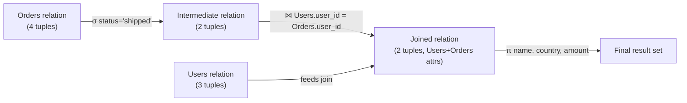
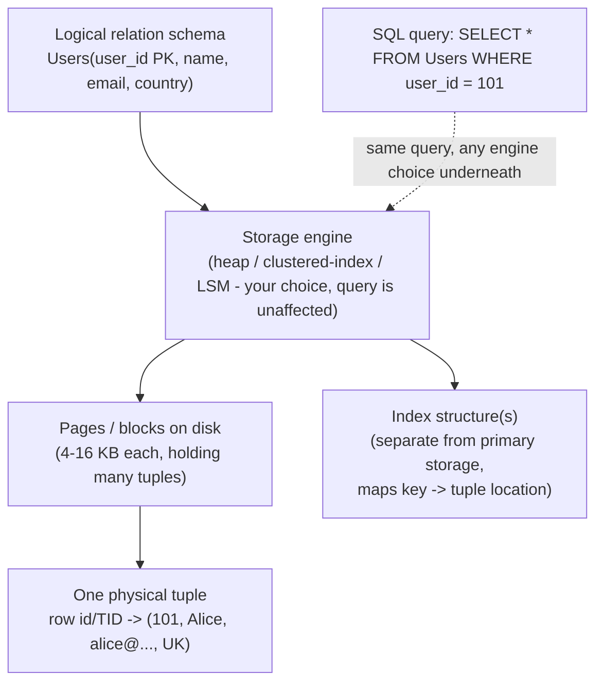

# The Relational Model

_A mathematical way of saying "data is just sets of rows with columns" — rigid enough that a machine can prove queries correct and optimize them automatically, and that rigidity is exactly why it won._

## Contents

- [What a relation actually is](#what-a-relation-actually-is)
- [Schema vs instance](#schema-vs-instance)
- [Relational algebra: the operations a relation supports](#relational-algebra-the-operations-a-relation-supports)
- [Relational algebra vs relational calculus vs SQL](#relational-algebra-vs-relational-calculus-vs-sql)
- [Keys](#keys)
- [Integrity constraints](#integrity-constraints)
- [Worked example: algebra and SQL side by side](#worked-example-algebra-and-sql-side-by-side)
- [Why the relational model won: Codd's contribution](#why-the-relational-model-won-codds-contribution)
- [From logical relation to physical storage](#from-logical-relation-to-physical-storage)
- [Trade-offs](#trade-offs)
- [How this connects](#how-this-connects)
- [Check yourself](#check-yourself)
- [Real-world and sources](#real-world-and-sources)

## What a relation actually is

**A relation is a set of tuples that all share the same set of named, typed attributes.** That single sentence contains every formal building block of the model; the rest of this section just unpacks each word.

- **Attribute** — a named "slot" with a declared **domain**: the set of legal, **atomic** (indivisible) values it may hold. `email` might have domain "strings up to 255 characters"; `age` might have domain "non-negative integers." "Atomic" is doing real work here — the classical relational model assumes an attribute holds one single value, never a list or a nested record. (This assumption is precisely what **first normal form** formalizes as a rule; that gets its own full treatment in the next topic, normalization.)
- **Tuple** — one assignment of a value (drawn from the right domain) to every attribute. Informally: a row.
- **Relation** — a **set** of tuples that all conform to the same attributes/domains. Informally: a table.
- **Degree** — the number of attributes in a relation (how many columns).
- **Cardinality** — the number of tuples currently in a relation (how many rows, right now).
- **Relation schema** — the structural description: a name plus its attributes and their domains, e.g. `Users(user_id: int, name: varchar, email: varchar, country: varchar)`. This is what you write in `CREATE TABLE`.

Formally, a relation is a subset of the **Cartesian product** of its attributes' domains: `R ⊆ D1 × D2 × ... × Dn`. Not every combination of values that could exist actually needs to appear — a relation is whichever subset of all possible tuples is actually true/present, which is exactly why cardinality changes constantly (`INSERT`/`DELETE`) while the schema (the domains, the degree) stays comparatively fixed.

**What a relation is *not*, precisely — three common gaps between the theory and SQL practice:**

| Formal relation (theory) | SQL table (practice) |
|---|---|
| A **set** of tuples — no duplicates, by definition | Allows literal duplicate rows unless you add a uniqueness constraint |
| **No inherent tuple order** — a set has no sequence | Has a physical storage order, and SQL result order is undefined unless you `ORDER BY` |
| Attributes have **no inherent left-to-right order** either — a tuple is a mapping from attribute name to value | Columns have a fixed positional order in `CREATE TABLE` and in `SELECT *` |
| Every attribute value must be **atomic** | Some SQL databases allow array/JSON columns, which formally breaks first normal form |

None of these gaps are bugs — SQL is a pragmatic engineering realization of the model, not a line-for-line implementation of the math. But knowing the gap matters: e.g. relying on "rows come back in insertion order" without an `ORDER BY` is relying on an accident of the current storage engine, not a property the relational model promises you.

**Common misconception worth correcting up front:** the model is called "relational" because of the mathematical term **relation** (= a set of tuples), **not** because tables have relationships (foreign keys) to each other. Foreign keys and "relationships" between tables are a real and important part of relational database *design*, but the name of the model itself predates and is independent of that usage — it comes straight from set theory.

## Schema vs instance

- The **schema** is the relatively stable structural contract: relation names, attribute names, domains (types), and the constraints declared on them (keys, foreign keys, checks — all covered below). It's what a `CREATE TABLE` statement, or a migration, changes.
- The **instance** is the actual set of tuples present at a given moment — it changes on every `INSERT`, `UPDATE`, `DELETE`, constantly, while the schema underneath it stays the same.

Keeping these separate is what lets you reason about a database at two different speeds: the schema is designed once (and evolves rarely, deliberately, via migrations); the instance mutates continuously as the application runs. Every constraint discussed later in this document (keys, referential integrity) is a rule about which *instances* are legal for a given *schema* — the schema defines the space of valid worlds, the instance is which particular world currently holds.

## Relational algebra: the operations a relation supports

**Relational algebra is a small, closed set of operators that take one or two relations as input and produce a relation as output.** "Closed" is the important word: because the output of every operator is itself a relation, operators can be **composed** — the output of a selection can feed into a projection, whose output can feed into a join, and so on, building up an arbitrarily complex query as a tree of these operators. This closure property is exactly what lets a query optimizer (forward-ref, query planning/optimization topic) treat a SQL query as an algebra expression it can algebraically rewrite into an equivalent, cheaper expression before executing it — the mathematical foundation is what makes automatic optimization possible at all, instead of relying on the programmer to hand-write an efficient access path.

Codd's original algebra (plus the extensions virtually every real system adds) maps almost one-to-one onto SQL clauses:

| Operator | Symbol | What it does | SQL equivalent |
|---|---|---|---|
| **Selection** | σ (sigma) | Keep only the tuples matching a predicate | `WHERE` |
| **Projection** | π (pi) | Keep only certain attributes (columns), drop the rest | `SELECT <columns>` |
| **Union** | ∪ | All tuples in either of two union-compatible (same attributes) relations, duplicates removed | `UNION` |
| **Set difference** | − | Tuples in the first relation but not the second | `EXCEPT` (`MINUS` in Oracle) |
| **Intersection** | ∩ | Tuples present in both relations | `INTERSECT` |
| **Cartesian product** | × | Every tuple of relation A paired with every tuple of relation B (all combinations) | `CROSS JOIN` |
| **Rename** | ρ (rho) | Give a relation or attribute a new name, without changing its content | `AS` |
| **Join (theta/equi/natural)** | ⋈ | A Cartesian product, filtered down to only the combinations satisfying a condition | `JOIN ... ON` |
| **Division** | ÷ | Find values in A that pair with *every* value in B (an "for all" query) | Usually written by hand as `NOT EXISTS` / `GROUP BY ... HAVING COUNT(...) = (SELECT COUNT(*) FROM B)` |

A few of these deserve unpacking:

- **Join is not a separate primitive so much as a convenient shorthand.** A **theta join** `A ⋈θ B` is formally defined as `σθ(A × B)` — take the full Cartesian product of every row in A with every row in B, then apply a selection to keep only the pairs satisfying condition θ. An **equijoin** is a theta join where θ is strictly equality comparisons. A **natural join** is an equijoin that automatically matches on all attributes with the same name in both relations, and additionally drops the duplicate attribute from the output. This composition — "join is really just product-then-selection" — is a concrete example of the algebra's closure and composability at work, and it's exactly the kind of equivalence a query optimizer exploits: it can choose to never materialize the full, often enormous Cartesian product at all, and instead compute the equivalent, far smaller filtered result directly (e.g. with a hash join or a merge join), because algebra guarantees the two are the same relation.
- **Outer joins are an extension beyond the original closed algebra.** A plain (inner) join only keeps pairs that match; a **left outer join** additionally keeps every unmatched row from the left relation, padding the missing right-side attributes with `NULL`. This is genuinely an extension of Codd's original eight operators (which are closed over relations with no nulls) — nulls, and the three-valued logic they introduce into predicate evaluation, are a well-known wrinkle in the otherwise clean theory, `verify` exact historical point at which outer join and null-handling were formalized into the standard.
- **Aggregation (`GROUP BY`, `SUM`, `COUNT`, ...) is likewise not one of the original eight operators** — Codd extended the algebra with aggregate/summarize operators later, and every SQL dialect has its own such extension. Full treatment of aggregation, subqueries, and window functions is a forward-ref to the next topic in this level, SQL depth.
- **Division answers a distinctive class of question** ("which students are enrolled in *every* course in the Computer Science department?") that selection/projection/join cannot answer directly, because it's inherently a "for all," not a "there exists," condition. It's rarely provided as a literal SQL keyword; it's usually hand-written via `NOT EXISTS (SELECT ... WHERE NOT EXISTS (...))` double-negation or a `GROUP BY`/`HAVING COUNT` comparison — worth recognizing by pattern even though the algebra operator itself rarely appears by name in day-to-day SQL.

## Relational algebra vs relational calculus vs SQL

Two mathematically equivalent ways of specifying "what result I want" existed from the start, and SQL borrows the readable parts of both:

- **Relational algebra is procedural** — you specify a sequence of operations (select this, then project that, then join with this) that produces the answer; it describes *how* to derive the result, step by step, even though it says nothing about physical execution.
- **Relational calculus is declarative** — you write a logical predicate describing the properties the result tuples must satisfy (e.g. "the set of all tuples `t` such that `t` is in Orders and `t.status = 'shipped'`"), without specifying any sequence of steps to get there. There are two variants: **tuple relational calculus** (variables range over tuples) and **domain relational calculus** (variables range over individual attribute values); both are grounded directly in first-order predicate logic.
- Codd proved that (safe) relational calculus and relational algebra have exactly the same expressive power — any query expressible in one is expressible in the other. A query language that can express anything either can is called **relationally complete**, and this was historically used as the bar for judging whether a new query language was "as powerful as the model requires."
- **SQL's `SELECT ... FROM ... WHERE` structure is a deliberate hybrid**: the `FROM`/`JOIN` clauses read like algebra (naming which relations and how they combine), while the `WHERE` predicate reads like calculus (a declarative condition on the result, not a sequence of steps). This is a large part of why SQL feels natural to both "list the tables, then join them" thinkers and "describe what I want" thinkers — it deliberately took the more readable half of each.

## Keys

A **key** is what lets a relation's tuples be uniquely identified — a load-bearing concept for both integrity constraints (next section) and for how foreign keys establish connections between relations.

- **Superkey** — any set of attributes whose values are guaranteed unique across every tuple in the relation. It can contain extra, unnecessary attributes (e.g. `{user_id, email}` is a superkey of `Users` even though `email` alone would already suffice).
- **Candidate key** — a **minimal** superkey: remove any single attribute from it and it stops being unique. A relation can have more than one candidate key (e.g. both `user_id` and `email` might independently, uniquely identify a user).
- **Primary key** — the one candidate key the designer chooses as the relation's main identifier. This choice is a design decision, not a mathematical necessity — any candidate key would technically work, but exactly one is designated, and the DBMS enforces entity integrity (below) specifically on it.
- **Alternate key** — any candidate key that exists but was *not* chosen as the primary key (e.g. if `user_id` is chosen as primary key, `email` — still unique — is an alternate key, typically still enforced via a `UNIQUE` constraint).
- **Composite key** — a key made of more than one attribute together (e.g. `(order_id, line_number)` uniquely identifying one line item within an order, where neither column alone is unique).
- **Foreign key** — one or more attributes in one relation (the "child"/"referencing" relation) whose values must match the primary key (or another declared unique key) of some tuple in another relation (the "parent"/"referenced" relation) — or, if the column allows it, be `NULL`. This is the actual mechanism that creates a real, enforced connection between two relations, and is what most people colloquially mean by "relationships between tables" (again, distinct from where the model's *name* comes from).
- **Surrogate key vs natural key** — a design choice for what a primary key's values actually mean:
  - A **natural key** is built from real-world, business-meaningful attributes (e.g. a national ID number, an email address, a composite of `(country, license_plate)`). Pro: no extra column, and the value carries meaning. Con: business data has a habit of changing, turning out not to be as unique as assumed, or being large/composite — all of which are painful once other tables have foreign-keyed against it.
  - A **surrogate key** is a system-generated identifier with no business meaning at all — an auto-incrementing integer or a UUID. Pro: stable forever (it's never "the customer's new phone number," it's just an opaque ID), typically small and fast to index. Con: an extra column, and it doesn't stop you from still needing a separate `UNIQUE` constraint on the natural-key attributes if uniqueness there still matters to the business.
  - Most production schemas default to surrogate primary keys for exactly this stability reason, while still declaring `UNIQUE` constraints on whichever natural attributes (email, external reference numbers) genuinely need uniqueness enforced.

## Integrity constraints

Integrity constraints are rules the DBMS itself enforces on every instance of a schema, so that "the database is a faithful, consistent model of the real thing it represents" is not left to application code to remember. Codd's model defines three canonical categories, plus SQL adds general-purpose ones:

- **Domain integrity** — every attribute value must belong to its declared domain (correct type, correct format, within any declared range/check). A `CHECK (age >= 0)` constraint, or simply declaring a column `INTEGER` rather than free text, is domain integrity in action.
- **Entity integrity** — the primary key of a relation can never be `NULL`, and must be unique across all tuples. The reasoning is direct: if the whole point of a primary key is "the thing that uniquely identifies this tuple," a `NULL` or duplicate primary key would mean some tuple isn't uniquely identifiable at all, which breaks the very idea of addressing a specific row.
- **Referential integrity** — every foreign key value must either be `NULL` (if the column permits it) or must match an existing primary/unique key value in the referenced relation. This is precisely what prevents a **dangling reference** — an `Orders` row pointing at `user_id = 9999` when no such user exists. Because real applications need to delete or update referenced rows sometimes, referential integrity is paired with **referential actions** that say what happens to the child rows when that happens: `CASCADE` (propagate the delete/update to children), `RESTRICT`/`NO ACTION` (refuse the operation while children still reference it), `SET NULL` (null out the child's foreign key), `SET DEFAULT`. Choosing among these is a real design decision with real consequences — `CASCADE` on a delete can silently wipe out large amounts of dependent data if misapplied.
- **User-defined constraints** — SQL generalizes beyond Codd's three canonical categories with `NOT NULL`, `UNIQUE`, `CHECK (arbitrary boolean expression)`, and, in some systems, triggers — letting the schema encode business rules ("balance must never go negative," "start_date must be before end_date") directly, rather than trusting every piece of application code to re-check them correctly and consistently.

The unifying idea across all four: **the database refuses to enter (or transition into) a state that violates a declared rule**, which means the guarantee holds no matter which application, script, or person is writing to it — a property that becomes critical the moment more than one application shares the same database, and directly foreshadows why **ACID** (a forthcoming L2 topic) treats "consistency" as a first-class transactional guarantee.

## Worked example: algebra and SQL side by side

Two relations:

```
Users(user_id PK, name, country)
user_id | name    | country
101     | Alice   | UK
102     | Ben     | US
103     | Chidi   | NG

Orders(order_id PK, user_id FK -> Users.user_id, amount, status)
order_id | user_id | amount | status
5001     | 101     | 40.00  | shipped
5002     | 102     | 15.50  | pending
5003     | 101     | 22.00  | shipped
5004     | 103     | 9.99   | cancelled
```

**Step 1 - Selection**: find shipped orders.

```
σ(status = 'shipped')(Orders)          -- algebra
SELECT * FROM Orders WHERE status = 'shipped';   -- SQL
```

Result:

```
order_id | user_id | amount | status
5001     | 101     | 40.00  | shipped
5003     | 101     | 22.00  | shipped
```

**Step 2 - Projection**: from that result, keep only `user_id` and `amount`.

```
π(user_id, amount)( σ(status='shipped')(Orders) )   -- algebra, composed
SELECT user_id, amount FROM Orders WHERE status = 'shipped';   -- SQL
```

Result:

```
user_id | amount
101     | 40.00
101     | 22.00
```

Notice this is exactly the closure property in action: the output of selection (still a relation, with the same attributes as `Orders`) became the input to projection, without any special glue.

**Step 3 - Join**: bring in the customer's name and country for each shipped order.

```
Users ⋈(Users.user_id = Orders.user_id) σ(status='shipped')(Orders)   -- algebra

SELECT u.name, u.country, o.amount
FROM Users u
JOIN Orders o ON u.user_id = o.user_id
WHERE o.status = 'shipped';    -- SQL
```

Result:

```
name  | country | amount
Alice | UK      | 40.00
Alice | UK      | 22.00
```

Mechanically, this join is `σ(Users.user_id = Orders.user_id)(Users × Orders)` — every Users row paired with every Orders row (12 pairs total from 3 Users x 4 Orders, before the status filter), then filtered down to only the pairs where the ids actually match and the order shipped. No real database engine actually materializes all 12 pairs and then filters — a query optimizer recognizes this algebraic equivalence and instead executes it as, say, a hash join that never builds the full product — but the *result* is provably identical to naively doing so, which is exactly the guarantee that lets the optimizer take the shortcut safely.



## Why the relational model won: Codd's contribution

**Edgar F. Codd**, a researcher at IBM, published *"A Relational Model of Data for Large Shared Data Banks"* in *Communications of the ACM* in 1970. Before that paper, the two dominant ways of organizing shared, persistent data were:

- **The hierarchical model** (commercialized as **IBM IMS**, 1966) — data is organized as a tree: each record type has at most one parent, and children hang off parents in strict one-to-many links. Natural for genuinely hierarchical data, but representing a real many-to-many relationship (e.g. a student enrolled in many courses, each course having many students) requires either duplicating data across multiple tree branches or awkward workarounds, and navigating the data means the application must walk the tree structure explicitly, record by record.
- **The network model** (standardized by **CODASYL**, late 1960s, commercialized as e.g. **IDMS**) — a generalization of the hierarchical model into a graph: a record can now have multiple parents ("owner" sets with multiple "members"), which fixes the many-to-many representation problem. But it's still **navigational**: application code retrieves data one record at a time by explicitly following pointer chains ("get the next member of this set," "find the owner of this record") — the programmer has to know, and hand-code, the physical/logical path to the data they want.

**Codd's central innovation was separating *what data you want* from *how to physically get it*** — what he called **data independence**, split into two forms:

- **Logical data independence** — application queries are written against the logical schema (relation names and attributes), and can keep working even if the logical schema is extended (e.g. a new column added) without needing to be rewritten for unrelated changes.
- **Physical data independence** — the physical storage layout (which pages data sits in, which indexes exist, how tuples are laid out on disk) can change completely without the SQL/algebra query needing to change at all, because the query only ever names relations and describes conditions declaratively — it never names a storage path. A query optimizer, not the programmer, is responsible for deciding the actual, efficient physical access path (forward-ref, query planning/optimization topic) for a given declarative request.

This is precisely the difference the worked example above demonstrates: a SQL `JOIN ... WHERE` states *what* result is wanted; a network-model program would instead have had to explicitly walk pointers record-by-record to *get* that same result, hardcoding one specific navigation path that breaks if the physical structure ever changes.

Codd later published **Codd's 12 rules** (1985, in a two-part *ComputerWorld* article, numbered 0 through 12) as a checklist for what counts as a "genuinely" relational database system — covering things like the information rule (all data represented only as values in relations, nothing hidden in some other structure), guaranteed access via table name + primary key + column name, systematic treatment of nulls, and a comprehensive data sublanguage — largely written because vendors of the era were marketing non-relational products as "relational" once the term became popular, `verify` full rule text/enumeration before citing any individual rule in detail.

**Why this actually won, concretely:**

- **Declarative, set-based queries collapsed application complexity.** A JOIN + WHERE replaced hand-written, record-at-a-time pointer-chasing code — the same query worked regardless of physical layout, and non-specialist application developers could write correct queries without deeply understanding storage internals.
- **A rigorous mathematical foundation enabled automatic query optimization.** Because algebra is closed and has provable equivalences (as shown with the join-as-filtered-product example above), a query optimizer can safely rewrite a query into a cheaper, equivalent one — a capability navigational systems, where the programmer directly specified the access path, structurally couldn't offer, since there was nothing declarative to *re*-optimize.
- **Integrity constraints and later, transactions (ACID, a forthcoming L2 topic) gave one, DBMS-enforced source of truth** for consistency rules, rather than trusting every application to reimplement them correctly.
- **Standardization.** SQL became an ANSI/ISO standard (first ANSI SQL standard, 1986), which created a portable skill set, a large competitive vendor ecosystem (IBM's System R prototype fed directly into DB2; Oracle shipped one of the first commercial relational products), and a large body of shared tooling — network reinforcement further speeding adoption once the ecosystem existed.

**Where the older models didn't vanish, and how NoSQL fits historically:** hierarchical and network-model systems didn't disappear overnight — IMS in particular is still cited as running in some legacy mainframe environments today, `verify` current prevalence — but essentially all *new* general-purpose database development moved to the relational model from the 1980s onward. The NoSQL movement (forward-ref, L4) that emerged in the 2000s is best understood as a reaction to a *different* problem — the relational model's difficulty scaling horizontally across many cheap machines under very large write/read volume, and the rigidity of a fixed schema for certain fast-evolving or highly denormalized workloads — not a return to navigational, pointer-chasing access; most NoSQL systems still expose set-based, largely declarative query interfaces of their own (Cassandra's CQL, DynamoDB's PartiQL) rather than reverting to record-at-a-time navigation.

## From logical relation to physical storage

Everything above is deliberately *logical* — a relation is defined by what it means (its tuples, attributes, constraints), never by where or how the bytes actually sit on disk. That's the whole point of physical data independence. But something concrete does eventually have to store the data, and understanding the shape of that gap sets up the next several L2 topics without requiring their full depth yet.

- A relation is typically stored as a collection of **pages** (also called blocks — commonly 4-16 KB, `verify` exact default per engine), each page holding some number of **tuples** packed into it along with a small header/slot directory that tracks where each tuple starts within the page.
- Each stored tuple has some internal physical address — often called a **row ID** or **tuple ID (TID)** — that the storage engine uses internally to locate it; this is separate from, and invisible to, any logical key you defined (a primary key is a logical/declared uniqueness guarantee; a row ID is a physical location, and the two serve entirely different purposes).
- Different **storage engines** make genuinely different physical layout choices for the *exact same logical schema* — a heap-organized table (rows stored in no particular physical order, e.g. classic PostgreSQL heap tables), an index-organized/clustered table (rows physically sorted by primary key, e.g. MySQL InnoDB's clustered index), or an LSM-tree-based engine (writes buffered and later merged in sorted runs, common in Cassandra/RocksDB-backed systems) — and this is exactly what physical data independence promises you never have to notice from the query side: the same `SELECT * FROM Users WHERE user_id = 101` is valid, and returns the same logical answer, no matter which of these an engine chose underneath.
- **Indexes** are additional, separate physical structures (not the table's primary storage itself) that map key values to tuple locations, so the engine can find a needed tuple without scanning every page — introduced here only as "this exists and is what a query optimizer will reach for," with full B-tree/LSM-tree mechanics reserved for a forthcoming L2 topic.
- The **write-ahead log (WAL)**, **MVCC**, and **locking** (all forthcoming L2 topics) exist specifically to let this physical storage be mutated safely, durably, and concurrently by many simultaneous transactions while still preserving every integrity constraint defined above as a logical guarantee — the logical model says *what* must always remain true; those mechanisms are *how* the engine keeps it true under real, concurrent, potentially-crashing conditions.



## Trade-offs

| Relational model | Benefit | Cost |
|---|---|---|
| Fixed, declared schema + constraints | DBMS-enforced consistency; every writer obeys the same rules automatically | Schema changes need explicit migrations; less natural for rapidly-varying or deeply nested data shapes |
| Declarative algebra/SQL | Optimizer can automatically choose an efficient plan; queries survive physical/storage changes unmodified | The optimizer's choices are sometimes opaque/hard to predict without inspecting the actual plan (forward-ref, query planning) |
| Strong normalization-friendly structure | Minimizes redundancy and update anomalies (fully developed next topic) | Normalized data often requires joins across several relations to reconstruct one real-world object |
| Set-based, no built-in physical navigation | Frees the programmer from hand-coding access paths | Historically harder to scale by simply "adding more machines" than some NoSQL designs purpose-built for that (forward-ref, L4) |
| Vs. hierarchical/network (historical) | Represents many-to-many relationships naturally; no application-level pointer-chasing | Losing direct physical control an experienced navigational programmer had over exact access paths |

## How this connects

- **Forward to normalization forms** (next L2 topic) — the "atomic values only" assumption baked into a relation's domains is exactly what first normal form formalizes; the higher normal forms are precisely about eliminating the redundancy/anomaly costs listed in the trade-offs table above, using the same relation/key/functional-dependency vocabulary defined here.
- **Forward to SQL depth** — this document covers algebra's core operators (selection, projection, join, set operators) and their direct SQL mapping; aggregation, subqueries, and window functions extend beyond Codd's original algebra and get their own full treatment there.
- **Forward to ACID** — the "entity integrity / referential integrity always holds" guarantee described here is the **C (consistency)** piece of ACID; ACID additionally covers what happens when integrity must be preserved across multiple statements executed together as one unit, and under concurrent, possibly-failing execution.
- **Forward to indexing, WAL, storage engines** — all three were previewed in the physical-storage section above specifically so this topic could set up, without fully explaining, why a relation's logical guarantees need real machinery (durable logs, auxiliary lookup structures, concurrency control) to hold true on physical disks under concurrent load.
- **Forward to query planning and optimization** — the algebra's closure and provable equivalences (e.g. "a join is a filtered Cartesian product") are the exact mathematical basis an optimizer relies on to rewrite a query into a cheaper, provably-equivalent execution plan.
- **Forward to L4, NoSQL and data at scale** — the relational model is the baseline every NoSQL family is defined *in contrast to*: fixed schema and strong constraints vs. flexible/schema-less modeling, ACID transactions vs. BASE/eventual consistency, and vertical/single-node-oriented historical scaling vs. designs built from the ground up for horizontal partitioning. Understanding this document precisely is what makes that later contrast meaningful rather than a list of buzzwords.

## Check yourself

- A colleague says "it's called the relational model because tables have relationships via foreign keys." Explain precisely what's wrong with that statement and where the name actually comes from.
- Given `Orders(order_id PK, user_id FK, amount, status)`, write the relational-algebra expression (using σ, π, ⋈) for "the names and amounts of every UK customer's cancelled orders," assuming a `Users(user_id PK, name, country)` relation, and then write the equivalent SQL.
- Why does the closure property of relational algebra (every operator's output is itself a relation) matter for query optimization, concretely?
- Explain the difference between a candidate key, a primary key, and a superkey using a relation with two independently-unique columns.
- Why did Codd's separation of logical and physical data independence represent a genuine improvement over the network model's record-at-a-time navigation, rather than just a different syntax for the same capability?
- A table has no declared primary key and allows fully duplicate rows. Which specific integrity guarantee is missing, and what concrete problem does that cause for anything trying to reference one specific row?

## Real-world and sources

Three verified, varied perspectives on how production systems lean on — or deliberately move away from — the relational model's core ideas (relations, keys, constraints, double-entry-style integrity):

- **Stripe — modeling money movement as accounts, events, and double-entry integrity (fintech).** Stripe's internal **Ledger** system is the canonical example of applying relational-model discipline to a domain where correctness is non-negotiable. Its data model is explicitly relational in spirit even where the storage isn't SQL: "Accounts are buckets of money distinguished by their type (e.g., `charge_unsubmitted`) and properties (e.g., `id`, `business`). Events move money between accounts," and the system is "based on double-entry bookkeeping, a standard method for guaranteeing that all money in a system is fully accounted for by balancing credits and debits." Ledger relies on the identifier pair `(business, id)` to keep fund flows accurate "even when events arrive out of order or from different sources" — a direct real-world instance of this document's key/identity concepts (a composite identifying key) being used to guarantee entity integrity for financial events, and of a schema-level invariant (debits must balance credits) standing in for a declared integrity constraint. Notably, Stripe's underlying storage is a custom document database (DocDB, built on MongoDB) rather than a classic RDBMS — a useful nuance: the *relational modeling discipline* (typed accounts, keys, invariants that must always hold) is treated as essential even when the physical engine underneath isn't a traditional relational one, echoing this document's logical-vs-physical distinction. Source: [Ledger: Stripe's system for tracking and validating money movement, Stripe Dot Dev Blog](https://stripe.dev/blog/ledger-stripe-system-for-tracking-and-validating-money-movement) (fetched 2026-07-09).

- **Figma — staying on Postgres specifically *because* the relational model was load-bearing (SaaS/design-collaboration).** As Figma scaled its database layer roughly 100x, the team explicitly considered and rejected moving to NoSQL, for reasons that map directly onto this document's trade-offs table: "We have a very complex relational data model built on top of our current Postgres architecture and NoSQL APIs don't offer this kind of versatility," and "We wanted to keep our engineers focused on shipping great features and building new products instead of rewriting almost our entire backend application; NoSQL wasn't a viable solution." Rather than abandon the relational model to scale, Figma horizontally sharded Postgres while deliberately preserving relational guarantees where they mattered most: their design specifically allows "cross-table joins and full transactions when restricted to a single sharding key," i.e., they engineered around the model's historical horizontal-scaling weakness (noted in the trade-offs table above) without giving up joins, foreign-key-shaped relationships, or transactional integrity for co-located data. Source: [How Figma's Databases Team Lived to Tell the Scale, Figma Blog](https://www.figma.com/blog/how-figmas-databases-team-lived-to-tell-the-scale/) (fetched 2026-07-09).

- **AWS — contrasting relational-ledger modeling with a purpose-built ledger database (fintech infrastructure).** AWS's writeup on building core banking systems is a useful counter-perspective: it describes a bank ledger built on classic **double-entry accounting** ("The transactions in the ledger are based on double-entry accounting methods, and are added throughout the business day from actions taken by the bank") and then argues that doing this *on a relational database* traditionally required architects to build "a separate journal in the database to record modifications to data" and "additional mechanisms to verify that data has not been inadvertently changed or modified, thus increasing cost and complexity" — extra application-level machinery layered on top of the relational model's declared constraints to get full auditability. This is a genuinely varied perspective from the other two: rather than "the relational model scaled fine" (Figma) or "relational-style discipline was kept even off classic SQL" (Stripe), AWS's framing is "for immutable, cryptographically-verifiable ledgers specifically, some core banking teams now reach for a purpose-built ledger database instead of building that auditability by hand on top of a relational schema" — a concrete, verified illustration of where practice has evolved past a pure relational approach for one narrow use case (tamper-evident financial history), even as double-entry, keys, and integrity-style thinking remain the conceptual backbone either way. Source: [Building a core banking system with Amazon Quantum Ledger Database, AWS Industries Blog](https://aws.amazon.com/blogs/industries/building-a-core-banking-system-with-amazon-quantum-ledger-database/) (fetched 2026-07-09).

`verify` note: a fourth angle was actively sought — India's UPI/NPCI ledger and reconciliation architecture, per this repo's standing priority on UPI as a canonical payments example — but the available verified engineering write-ups on UPI (e.g. system-design explainers of NPCI's switch/routing role) describe *transaction routing and settlement reconciliation* at a high level without documenting the relational schema, key, or constraint design actual participant banks use internally; those internal core-banking schemas are not publicly published in a fetch-verifiable source. Rather than fabricate schema details, UPI is intentionally omitted from this specific topic's case studies; it remains a strong candidate for later L2 topics (e.g. ACID, distributed transactions) where its verified reconciliation-and-settlement architecture is directly on-topic.

**Sources / further reading**

- [Ledger: Stripe's system for tracking and validating money movement — Stripe Dot Dev Blog](https://stripe.dev/blog/ledger-stripe-system-for-tracking-and-validating-money-movement) (fetched 2026-07-09)
- [How Figma's Databases Team Lived to Tell the Scale — Figma Blog](https://www.figma.com/blog/how-figmas-databases-team-lived-to-tell-the-scale/) (fetched 2026-07-09)
- [Building a core banking system with Amazon Quantum Ledger Database — AWS Industries Blog](https://aws.amazon.com/blogs/industries/building-a-core-banking-system-with-amazon-quantum-ledger-database/) (fetched 2026-07-09)
