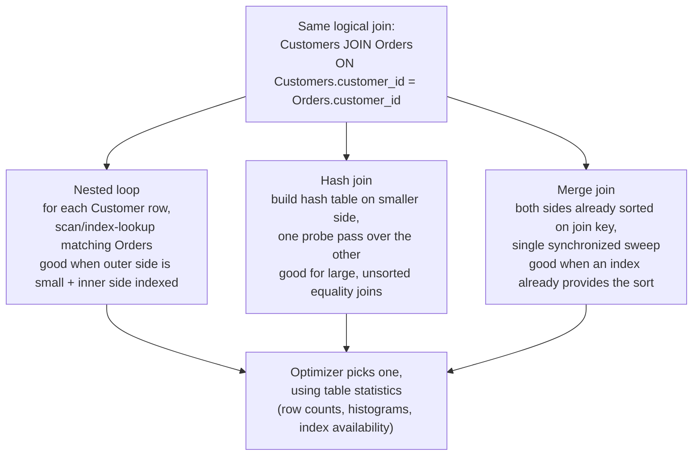
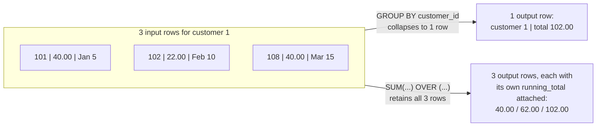

# SQL Depth: Joins, Aggregation, Subqueries, Window Functions

_The relational algebra covered "select, project, join" as closed, composable operators - SQL layers four more powerful, everyday tools on top: ways to combine rows, collapse them into summaries, nest one query inside another, and compute per-row running numbers without collapsing anything at all._

`⏱️ ~10 min · SQL depth · L2 Storage and Relational Databases`

> [!TIP] The gist
> A **join** combines rows from two relations. **Aggregation** (`GROUP BY`) collapses many rows into one summary row per group. A **subquery** nests one query inside another, and its cost depends entirely on whether it's re-run per outer row (correlated) or once, independently (non-correlated). A **window function** computes an aggregate _per row_ while keeping every row - the one capability plain `GROUP BY` structurally cannot offer.

## Contents

- [Where this picks up from the relational model](#where-this-picks-up-from-the-relational-model)
- [Joins: matching rows across relations](#joins-matching-rows-across-relations)
- [How the engine actually executes a join](#how-the-engine-actually-executes-a-join)
- [Aggregation: collapsing rows into summaries](#aggregation-collapsing-rows-into-summaries)
- [Subqueries: nesting one query inside another](#subqueries-nesting-one-query-inside-another)
- [Window functions: per-row aggregates without collapsing rows](#window-functions-per-row-aggregates-without-collapsing-rows)
- [Worked example: Customers and Orders end to end](#worked-example-customers-and-orders-end-to-end)
- [Trade-offs and common performance pitfalls](#trade-offs-and-common-performance-pitfalls)
- [How this connects](#how-this-connects)
- [Check yourself](#check-yourself)

## Where this picks up from the relational model

The [relational model](01-relational-model.md#relational-algebra-the-operations-a-relation-supports) covered joins as a formal composition of Cartesian product plus selection (`⋈ = σθ(A × B)`), and flagged aggregation, subqueries, and window functions as extensions Codd's original eight operators never covered. This topic is that promised full treatment - the four tools that turn "a closed algebra of relations" into the SQL you actually write every day. All four assume the [keys and constraints](01-relational-model.md#keys) and the [normalized shape](02-normalization-forms.md) already established; reconstructing one real-world object out of several correctly-normalized relations is, mechanically, exactly what a join is for.

## Joins: matching rows across relations

**A join combines rows from two (or more) relations based on a condition, most commonly equality between a foreign key and the primary/unique key it references.** Every join variant below answers the same underlying question - "for a given condition, which combinations of rows from A and B do I keep?" - differently.

| Join type                               | What it returns                                                                                                                                                | Typical use                                                                                                                                                                   |
| --------------------------------------- | -------------------------------------------------------------------------------------------------------------------------------------------------------------- | ----------------------------------------------------------------------------------------------------------------------------------------------------------------------------- |
| **Inner join** (`JOIN` / `INNER JOIN`)  | Only rows where the condition matches on _both_ sides; unmatched rows from either side are dropped entirely                                                    | "Give me orders that have a real customer"                                                                                                                                    |
| **Left (outer) join** (`LEFT JOIN`)     | Every row from the left table, plus matching right-side rows where they exist; unmatched left rows get `NULL` for every right-side column                      | "Give me every customer, whether or not they've ordered anything"                                                                                                             |
| **Right (outer) join** (`RIGHT JOIN`)   | The mirror image of left join - every row from the right table, `NULL`-padded on the left where unmatched                                                      | Rarely used in practice; almost always rewritable as a left join by swapping table order, so most style guides standardize on left join only                                  |
| **Full outer join** (`FULL OUTER JOIN`) | Every row from _both_ sides - matched rows combined, plus unmatched left rows (`NULL`-padded right) and unmatched right rows (`NULL`-padded left)              | Reconciliation-style queries: "show me every customer and every order, including orphans on either side"                                                                      |
| **Cross join** (`CROSS JOIN`)           | The full Cartesian product - every row of A paired with every row of B, no condition at all; if A has _n_ rows and B has _m_ rows, the result has _n × m_ rows | Deliberately generating every combination (e.g. a customer × status report scaffold); almost always a bug when it happens _accidentally_ from a missing/forgotten `ON` clause |
| **Self-join**                           | A table joined to itself (via two aliases), used when a row references another row in the _same_ relation                                                      | "Who referred this customer?", "who is this employee's manager?" (`employees.manager_id → employees.employee_id`)                                                             |

A self-join is not a distinct algebra operator - it's an ordinary join where both operands happen to be the same relation under two different aliases, which is exactly why SQL requires aliasing (`Customers AS c JOIN Customers AS r ON ...`): without two names, the engine (and the reader) cannot tell which occurrence of a column is meant.

**NULL and three-valued logic matter here.** Join conditions, like `WHERE` predicates, use SQL's three-valued logic (`TRUE`/`FALSE`/`UNKNOWN`). `NULL = NULL` evaluates to `UNKNOWN`, not `TRUE` - so two rows that both happen to have a `NULL` in the join column are _not_ considered a match by an equality join. This single fact is why guest/orphan rows with a `NULL` foreign key never accidentally "match" each other, and it resurfaces below in both the full outer join and the subquery sections.

## How the engine actually executes a join

The join _types_ above are purely about which logical rows the result contains - they say nothing about how the engine physically finds those matches. A query optimizer chooses among (at least) three physical algorithms to execute the _same_ logical join, and the choice can change the query's cost by orders of magnitude on large tables.

- **Nested loop join** - for each row in the "outer" table, scan the "inner" table for matching rows. Conceptually: `for each row in A: for each row in B: if condition matches, emit`. Without an index on the inner side's join column, this costs `O(|A| × |B|)` - every outer row triggers a full scan of the inner table. With a usable index on the inner table's join column, each inner lookup drops to roughly `O(log |B|)` (B-tree) or `O(1)` (hash index), so the total becomes closer to `O(|A| × log |B|)`. **Best when the outer side is small** and the inner side has a good index to drive into - e.g. joining 5 customers against an indexed `orders.customer_id` column.
- **Hash join** - build an in-memory hash table on the join key from the smaller ("build") side, then make a single pass over the larger ("probe") side, looking up each row's join key in the hash table. Cost is roughly `O(|A| + |B|)` - no sorting, no index required on either side, just enough working memory to hold the build side's hash table. This is the usual default for **large, unsorted, unindexed equality joins**. If the build side doesn't fit in memory, the engine falls back to a **grace hash join** (partition-and-spill-to-disk), which costs more but degrades gracefully instead of failing.
- **Merge join (sort-merge join)** - if both inputs are already sorted on the join key (because of an index, or because a prior step in the plan already sorted them), the engine does one synchronized sweep down both sorted lists, advancing whichever pointer is behind - `O(|A| + |B|)` after sorting. If the inputs _aren't_ already sorted, the engine must sort both sides first (`O(|A| log |A| + |B| log |B|)`), which usually makes hash join cheaper unless that sort order was already "free" (e.g. both tables are clustered/indexed on the join column already).

The optimizer picks an algorithm (and a **join order** - which table drives the loop, which side is the hash build side) using cardinality estimates from table statistics (row counts, histograms, index availability) collected ahead of time - not by re-deriving cost from first principles at query time. This is exactly why the same logical `JOIN` can run fast or slow purely based on whether a helpful index exists, or whether statistics are stale: the SQL you write states _what_ to join, but the plan actually executed is chosen by the optimizer based on the physical reality underneath (forward-ref, query planning/optimization).



## Aggregation: collapsing rows into summaries

**`GROUP BY` partitions a relation's rows into groups sharing the same value(s) in the grouping column(s), then computes one aggregate result per group** - the group, not the individual row, becomes the unit the rest of the query operates on. This is exactly the "collapsing" behavior that window functions (below) deliberately avoid.

- **Aggregate functions**: `COUNT`, `SUM`, `AVG`, `MIN`, `MAX` (and engine-specific extras like `STRING_AGG`/`ARRAY_AGG`) each reduce a whole group's worth of values down to one value. `COUNT(*)` counts rows including `NULL`s; `COUNT(column)` counts only non-`NULL` values in that column - a common, easy-to-miss discrepancy.
- **`WHERE` vs `HAVING` - the crucial distinction is _when_ each filter runs.** `WHERE` filters individual rows _before_ grouping/aggregation happens at all - it can only reference raw column values, never an aggregate result, because no aggregate exists yet at that stage. `HAVING` filters _groups_, after aggregation has already produced one row per group - it's the only place you can write a predicate on an aggregate function's result (`HAVING SUM(amount) > 100`), because that value simply doesn't exist until grouping has run. A practical consequence: always push a filter into `WHERE` when it doesn't depend on an aggregate - it shrinks the row set _before_ the (often more expensive) grouping step, rather than after.
- **`GROUPING SETS` / `ROLLUP` / `CUBE`** compute _several_ levels of grouping in a single pass instead of running several separate `GROUP BY` queries and `UNION`-ing them. `GROUP BY GROUPING SETS ((customer_id), ())` produces one row per customer's subtotal _and_ one grand-total row (grouped by nothing) in one query - useful for reporting subtotals-plus-total without a second round trip. `ROLLUP` and `CUBE` are shorthand for common patterns of grouping sets (hierarchical subtotals, and every combination of subtotals, respectively).

## Subqueries: nesting one query inside another

A **subquery** is a complete `SELECT` nested inside another query. Where it's placed changes what it's allowed to return and what it's used for:

- **Subquery in `WHERE`** - most common; used to filter rows using a set or single value computed by another query.
- **Subquery in `SELECT`** - a **scalar subquery**, must return exactly one row and one column; its single value is used like a computed column, once per outer row.
- **Subquery in `FROM`** - a **derived table**: the subquery's entire result is treated as if it were a table for the rest of that query, and must be given an alias.
- **CTE (`WITH ... AS (...)`)** - names a subquery upfront so it can be referenced (by name) later in the main query, exactly like a derived table but written before the main query instead of nested inside its `FROM` clause, and usable more than once by name if needed. Some engines (e.g. PostgreSQL from version 12 onward, `verify` exact version) can **inline** a non-recursive CTE the same way they'd inline an ordinary subquery unless the query explicitly forces materialization (`WITH x AS MATERIALIZED (...)`); earlier versions treated every CTE as an "optimization fence" the planner couldn't see through. A **recursive CTE** (`WITH RECURSIVE`) can reference itself, the standard way to walk a tree/graph (e.g. an org chart of `manager_id` self-references) in pure SQL.

**Correlated vs non-correlated is the distinction that matters most for cost.**

- A **non-correlated subquery** stands entirely on its own - it references no column from the outer query, so the engine can evaluate it exactly once, independent of how many outer rows there are, and reuse that one result. `WHERE amount > (SELECT AVG(amount) FROM Orders)` - the inner `AVG` is computed once, globally.
- A **correlated subquery** references a column from the _outer_ query inside its own `WHERE` clause, so its result can differ per outer row. `WHERE o.amount > (SELECT AVG(o2.amount) FROM Orders o2 WHERE o2.customer_id = o.customer_id)` - the inner average is a _different_ number for every customer, so conceptually the subquery must be re-evaluated once per outer row. This is structurally the same shape as a **nested loop join**: outer row drives, inner query (playing the role of the inner table) re-runs per outer row. Many modern optimizers can algebraically rewrite ("decorrelate") a correlated subquery into an equivalent join or semi-join and avoid literally re-running it per row - but this rewrite isn't guaranteed for every shape of subquery or every engine/version (`verify` specific decorrelation coverage per engine), which is exactly why this pattern is worth recognizing and checking with `EXPLAIN` rather than assuming it's free.

**`EXISTS` vs `IN`:**

- `EXISTS (subquery)` is a **semi-join** - it only asks "does at least one matching row exist," never materializes or compares actual returned values, and can short-circuit on the first match. It handles `NULL`s cleanly because it never actually compares a value equal to anything - it just checks presence.
- `IN (subquery)` compares the outer value against every value the subquery returns. This is usually fine - but `NOT IN` has a well-known trap: **if the subquery's result set contains even one `NULL`, `NOT IN` returns zero rows for every outer row**, because SQL evaluates `x NOT IN (a, b, NULL)` as `x <> a AND x <> b AND x <> NULL`, and `x <> NULL` is `UNKNOWN`, which poisons the whole `AND` chain to `UNKNOWN` (never `TRUE`). `NOT EXISTS` (or filtering `NULL`s out of the subquery explicitly) doesn't have this problem and is the standard fix - the worked example below shows this failing concretely with real numbers.

## Window functions: per-row aggregates without collapsing rows

**A window function computes an aggregate over a set of rows related to the current row - a "window" - while returning one output row per _input_ row, not one row per group.** This is the single structural difference from `GROUP BY`: aggregation collapses N rows into (at most) N groups' worth of rows; a window function keeps all N rows and attaches a computed value to each one.

- **Syntax**: `<function>(...) OVER (PARTITION BY <cols> ORDER BY <cols>)`. `PARTITION BY` divides rows into windows exactly like `GROUP BY` divides rows into groups - but instead of collapsing each partition into one row, every row keeps its own identity and gets the partition's aggregate attached alongside it. `ORDER BY` inside `OVER` additionally makes the window **ordered**, which is what unlocks running/rolling behavior and `LAG`/`LEAD`.
- **Ranking functions** - `ROW_NUMBER()` assigns a strictly increasing, unique number within each partition (ties broken arbitrarily by physical/whatever order unless the `ORDER BY` fully disambiguates them); `RANK()` gives tied rows the _same_ rank and then **skips** the next rank number(s) by the size of the tie (1, 1, 3, ...); `DENSE_RANK()` gives tied rows the same rank but does **not** skip afterward (1, 1, 2, ...). The skip-vs-no-skip distinction is the entire difference between the two, and is easiest to see with an actual tie (worked below).
- **Running/rolling aggregates** - `SUM(...) OVER (PARTITION BY ... ORDER BY ...)` (with no explicit frame) defaults, per the SQL standard, to a **running total** from the start of the partition up through the current row (`RANGE BETWEEN UNBOUNDED PRECEDING AND CURRENT ROW`). An explicit frame like `ROWS BETWEEN 2 PRECEDING AND CURRENT ROW` instead gives a fixed-size **rolling window** (e.g. a trailing 3-row moving average) rather than an ever-growing running total.
- **`LAG`/`LEAD`** - `LAG(column, n)` reaches back `n` rows _before_ the current row within its ordered partition; `LEAD(column, n)` reaches forward `n` rows _after_ it. Both return `NULL` when there's no such row (e.g. `LAG` on the very first row of a partition). This is the standard tool for "compare this row to the previous/next one" - a day-over-day delta, time-between-events, or period-over-period change - without a self-join.

Window functions are, structurally, "aggregation that refuses to throw rows away" - which is exactly why they're the natural fix for several correlated-subquery pitfalls covered next: anywhere a correlated subquery recomputes a per-group value once per row, a window function computes that same per-partition value in one pass while keeping every original row intact.

## Worked example: Customers and Orders end to end

Two relations (`referred_by` and a nullable `customer_id` on `Orders` are included specifically to demonstrate self-joins and outer/full joins below):

```
Customers(customer_id PK, name, country, referred_by FK -> Customers.customer_id)
customer_id | name  | country | referred_by
1           | Ava   | UK      | (null)
2           | Ben   | US      | 1
3           | Chidi | NG      | (null)
4           | Dana  | US      | 2
5           | Eve   | UK      | (null)     -- has never ordered anything

Orders(order_id PK, customer_id FK -> Customers.customer_id (nullable), order_date, amount, status)
order_id | customer_id | order_date | amount | status
101      | 1           | 2026-01-05 | 40.00  | shipped
102      | 1           | 2026-02-10 | 22.00  | shipped
103      | 2           | 2026-01-15 | 15.50  | pending
104      | 3           | 2026-01-20 | 9.99   | cancelled
105      | 2           | 2026-03-01 | 60.00  | shipped
106      | 4           | 2026-03-05 | 12.00  | shipped
107      | (null)      | 2026-03-10 | 5.00   | pending    -- guest checkout, no customer
108      | 1           | 2026-03-15 | 40.00  | shipped    -- ties order 101's amount
```

**Joins.**

Inner join - customers matched with their actual orders:

```sql
SELECT c.name, o.order_id, o.amount
FROM Customers c
JOIN Orders o ON o.customer_id = c.customer_id;
```

7 rows come back (3 for Ava, 2 for Ben, 1 for Chidi, 1 for Dana); Eve is excluded (no matching order), and the guest order 107 is excluded (no matching customer).

Left join - every customer, including Eve:

```sql
SELECT c.name, o.order_id, o.amount
FROM Customers c
LEFT JOIN Orders o ON o.customer_id = c.customer_id;
```

Same 7 rows, plus one more: `Eve | NULL | NULL` - 8 rows total.

Full outer join - every customer _and_ every order, orphans on both sides included:

```sql
SELECT c.name, o.order_id, o.amount
FROM Customers c
FULL OUTER JOIN Orders o ON o.customer_id = c.customer_id;
```

The 8 rows above, plus `NULL | 107 | 5.00` - the guest order, unmatched on the left - 9 rows total. Note `c.customer_id = o.customer_id` never matches Eve's row to order 107's row even though both involve a "missing" customer - Eve's `customer_id` is `5`, not `NULL`, so there's no `NULL = NULL` situation here at all; the two are simply two independently unmatched rows.

Self-join - each customer's referrer, by name:

```sql
SELECT c.name AS customer, r.name AS referred_by
FROM Customers c
LEFT JOIN Customers r ON c.referred_by = r.customer_id;
```

```
customer | referred_by
Ava      | (null)
Ben      | Ava
Chidi    | (null)
Dana     | Ben
Eve      | (null)
```

Cross join, briefly - `Customers CROSS JOIN (SELECT DISTINCT status FROM Orders)` pairs all 5 customers with all 3 distinct statuses (`shipped`, `pending`, `cancelled`), producing 5 × 3 = 15 rows with no condition at all. This is genuinely useful as a **report scaffold** - left-joined against actual counts, it lets a per-customer-per-status report show explicit zero rows for combinations that never occurred, instead of silently omitting them. It's also the most common _accidental_ bug in SQL: forgetting a join's `ON` clause silently turns an intended equi-join into a cross join, multiplying row counts and usually returning obviously-wrong (much larger) result sets.

**Aggregation - `WHERE` vs `HAVING`, concretely.**

```sql
SELECT customer_id, COUNT(*) AS num_orders, SUM(amount) AS total_spent
FROM Orders
WHERE status <> 'cancelled'
GROUP BY customer_id
HAVING SUM(amount) > 20;
```

`WHERE status <> 'cancelled'` removes order 104 _before_ grouping. Grouping the remaining 7 rows gives: customer 1 → 3 orders / $102.00; customer 2 → 2 orders / $75.50; customer 4 → 1 order / $12.00; `NULL` (the guest) → 1 order / $5.00. `HAVING SUM(amount) > 20` then drops the two low-total groups, so only customers 1 and 2 survive:

```
customer_id | num_orders | total_spent
1           | 3          | 102.00
2           | 2          | 75.50
```

A `GROUPING SETS` extension of the same query - per-customer subtotal _and_ a grand total in one pass:

```sql
SELECT customer_id, SUM(amount) AS total
FROM Orders
WHERE status <> 'cancelled'
GROUP BY GROUPING SETS ((customer_id), ());
```

Adds one extra row, `NULL | 194.50` (the grand total, `102.00 + 75.50 + 12.00 + 5.00`), grouped by nothing at all - no `UNION` of two separate queries required.

**Subqueries - non-correlated, correlated, EXISTS, the `NOT IN` trap, and a CTE rewrite.**

Non-correlated - filter against one globally-computed value:

```sql
SELECT order_id, amount FROM Orders WHERE amount > (SELECT AVG(amount) FROM Orders);
```

The global average across all 8 orders is `204.49 / 8 = 25.56` (rounded). Orders exceeding it: 101 (40.00), 105 (60.00), 108 (40.00). The inner `AVG` is computed exactly once, independent of any outer row.

Correlated - filter against _each customer's own_ average (a genuinely different number per row):

```sql
SELECT o.order_id, o.customer_id, o.amount
FROM Orders o
WHERE o.amount > (
  SELECT AVG(o2.amount) FROM Orders o2 WHERE o2.customer_id = o.customer_id
);
```

Per-customer averages: customer 1 → `(40+22+40)/3 = 34.00`; customer 2 → `(15.50+60)/2 = 37.75`; customer 3 → `9.99`; customer 4 → `12.00`; the guest order's `customer_id` is `NULL`, so `o2.customer_id = NULL` is `UNKNOWN` for every row, the inner query returns no rows, its `AVG` is `NULL`, and `5.00 > NULL` is `UNKNOWN` - the guest order is excluded, not by special-case logic, but purely by three-valued-logic falling out of the `NULL` comparison. Result: orders 101 (40 > 34), 108 (40 > 34), and 105 (60 > 37.75) - three rows. **These happen to be the same three orders as the non-correlated query above; that's a coincidence of this small dataset, not a general equivalence** - a global average and a per-group average are genuinely different filters that would diverge on a larger, less symmetric dataset.

The window-function rewrite of that same correlated subquery, computing every partition's average once and comparing per row instead of re-running the subquery per outer row:

```sql
SELECT order_id, customer_id, amount, customer_avg
FROM (
  SELECT order_id, customer_id, amount,
         AVG(amount) OVER (PARTITION BY customer_id) AS customer_avg
  FROM Orders
) t
WHERE amount > customer_avg;
```

Same three rows (101, 108, 105) come back, but the average is computed once per partition in a single pass over the data, rather than conceptually re-running an `AVG` query once per outer row.

`EXISTS` - customers with at least one shipped order:

```sql
SELECT c.name FROM Customers c
WHERE EXISTS (SELECT 1 FROM Orders o WHERE o.customer_id = c.customer_id AND o.status = 'shipped');
```

Shipped orders belong to customers 1, 2, and 4 → result: Ava, Ben, Dana.

The `NOT IN` / `NULL` trap, and its fix:

```sql
-- BUGGY: returns zero rows for everyone
SELECT c.name FROM Customers c
WHERE c.customer_id NOT IN (SELECT customer_id FROM Orders WHERE status = 'pending');

-- CORRECT: returns Ava, Chidi, Dana, Eve
SELECT c.name FROM Customers c
WHERE NOT EXISTS (
  SELECT 1 FROM Orders o WHERE o.customer_id = c.customer_id AND o.status = 'pending'
);
```

Pending orders are 103 (`customer_id = 2`) and 107 (`customer_id = NULL`). The subquery's result set for `NOT IN` is therefore `{2, NULL}`, and because it contains a `NULL`, `customer_id NOT IN (2, NULL)` evaluates to `UNKNOWN` for every single customer (even ones with no relation to pending orders at all) - the buggy version returns **zero rows**. `NOT EXISTS` sidesteps the whole issue by never comparing a value against `NULL` in the first place, correctly returning everyone except Ben (customer 2, who genuinely has a pending order): Ava, Chidi, Dana, Eve.

A CTE rewrite of the correlated-average query - same result, computed as two explicit steps instead of one nested query:

```sql
WITH customer_avg AS (
  SELECT customer_id, AVG(amount) AS avg_amount
  FROM Orders
  GROUP BY customer_id
)
SELECT o.order_id, o.customer_id, o.amount, ca.avg_amount
FROM Orders o
JOIN customer_avg ca ON o.customer_id = ca.customer_id
WHERE o.amount > ca.avg_amount;
```

`customer_avg` is computed once, grouped, in a single pass; the outer query then joins against it instead of re-running an `AVG` per row. (The guest order's group, keyed by `NULL`, still never joins back to `o.customer_id = NULL` for the same three-valued-logic reason as every other `NULL = NULL` case above - consistent with the correlated version.)

The correlated **scalar subquery in `SELECT`** pattern, and its join-based fix, side by side - this is the clearest illustration of the "N+1-style" cost this document keeps referring to:

```sql
-- Conceptually re-runs the inner COUNT once per outer Customers row (5 times)
SELECT c.name,
       (SELECT COUNT(*) FROM Orders o WHERE o.customer_id = c.customer_id) AS order_count
FROM Customers c;

-- Same result, computed with one join + one GROUP BY pass instead
SELECT c.name, COUNT(o.order_id) AS order_count
FROM Customers c
LEFT JOIN Orders o ON o.customer_id = c.customer_id
GROUP BY c.customer_id, c.name;
```

Both return `Ava: 3, Ben: 2, Chidi: 1, Dana: 1, Eve: 0` - but the first form is a correlated subquery re-evaluated per customer row (5 separate `COUNT` executions, conceptually), while the second computes every customer's count in one combined pass. Notice the join+`GROUP BY` version **collapses** rows (one output row per customer, exactly like the aggregation section above) - that's the right rewrite whenever you actually want a summary. Not every correlated subquery should be collapsed, though: the earlier `customer_avg` example needed every original order row _kept_, just annotated with its own group's average - that's precisely the case a window function is the right rewrite for, not a `GROUP BY`.

**Window functions - ranking, running totals, and `LAG`.**

Ranking within a partition, using customer 1's three orders (which include the deliberate tie at $40.00):

```sql
SELECT order_id, amount,
  ROW_NUMBER() OVER (ORDER BY amount DESC) AS rn,
  RANK()       OVER (ORDER BY amount DESC) AS rnk,
  DENSE_RANK() OVER (ORDER BY amount DESC) AS drnk
FROM Orders WHERE customer_id = 1;
```

```
order_id | amount | rn | rnk | drnk
101      | 40.00  | 1  | 1   | 1
108      | 40.00  | 2  | 1   | 1
102      | 22.00  | 3  | 3   | 2
```

`ROW_NUMBER` breaks the 101/108 tie arbitrarily but still assigns unique numbers 1, 2, 3. `RANK` gives both tied rows rank 1, then **skips** to 3 for the next row (because two rows already occupied ranks 1 and "2"). `DENSE_RANK` also gives both tied rows rank 1, but the next distinct value gets rank 2, with **no gap**. This gap-vs-no-gap behavior is the entire difference between the two functions, and it only becomes visible once there's an actual tie.

Running total and period-over-period change, same customer, ordered by date:

```sql
SELECT order_id, order_date, amount,
  SUM(amount) OVER (ORDER BY order_date) AS running_total,
  LAG(amount) OVER (ORDER BY order_date) AS prev_amount,
  amount - LAG(amount) OVER (ORDER BY order_date) AS change
FROM Orders WHERE customer_id = 1;
```

```
order_id | order_date | amount | running_total | prev_amount | change
101      | 2026-01-05 | 40.00  | 40.00         | (null)      | (null)
102      | 2026-02-10 | 22.00  | 62.00         | 40.00       | -18.00
108      | 2026-03-15 | 40.00  | 102.00        | 22.00       | +18.00
```

Every input row is still present (three rows in, three rows out) - nothing collapsed - and note the final `running_total`, `102.00`, exactly matches the `GROUP BY`-computed `total_spent` for customer 1 earlier: a running total's last value and a plain aggregate's total are the same number, computed two structurally different ways (one keeps every row, one collapses to a single summary row).



## Trade-offs and common performance pitfalls

| Construct                       | Right tool when                                                                                                                                                          | Common pitfall                                                                                                                                                                                                                                                                                 |
| ------------------------------- | ------------------------------------------------------------------------------------------------------------------------------------------------------------------------ | ---------------------------------------------------------------------------------------------------------------------------------------------------------------------------------------------------------------------------------------------------------------------------------------------- |
| Join                            | Reconstructing one real-world object from correctly normalized relations; the standard way to combine rows across tables in a single pass                                | Join order and physical algorithm (nested loop/hash/merge) depend on indexes and up-to-date statistics - the same logical `JOIN` can silently regress from milliseconds to seconds if a helpful index is missing or dropped                                                                    |
| `GROUP BY` / `HAVING`           | You genuinely want _one row per group_ as the final answer (a summary, a report row, a count)                                                                            | Putting an aggregate-dependent predicate in `WHERE` (illegal - the aggregate doesn't exist yet there) instead of `HAVING`; or the reverse mistake of putting a cheap row-level filter in `HAVING` instead of `WHERE`, forcing the engine to aggregate rows it could have discarded first       |
| Non-correlated subquery         | The inner value is genuinely independent of the outer row (a global threshold, a fixed list)                                                                             | None specific - cost is a single extra query, evaluated once                                                                                                                                                                                                                                   |
| Correlated subquery             | Small outer row counts, or when the engine's optimizer reliably decorrelates the specific shape you wrote (verify with `EXPLAIN`)                                        | The "N+1 pattern": conceptually re-evaluated once per outer row, structurally identical in cost shape to an unindexed nested loop join - the fix is usually a join (if you want rows collapsed/summarized) or a window function (if you want every row kept, annotated with a per-group value) |
| `IN` / `NOT IN` with a subquery | `IN` is safe in general                                                                                                                                                  | `NOT IN` silently returns zero rows if the subquery's result set contains any `NULL` - use `NOT EXISTS`, or explicitly filter `NULL`s out of the subquery, instead                                                                                                                             |
| `EXISTS` / `NOT EXISTS`         | Checking presence/absence of at least one matching row; handles `NULL`s correctly without special-casing                                                                 | None specific - this is generally the safer default over `IN`/`NOT IN` for "does a match exist" checks                                                                                                                                                                                         |
| CTE (`WITH`)                    | Readability - naming an intermediate result so a complex query reads top-to-bottom instead of nested inside-out                                                          | On older optimizer versions, an unindexed assumption that a CTE is "just like a subquery" performance-wise may be wrong if the engine materializes it as an opaque, unoptimizable block (`verify` per specific engine/version)                                                                 |
| Window function                 | You need a per-row value derived from a group (rank, running total, delta from previous row) _while keeping every row_ - the one thing `GROUP BY` structurally cannot do | Using a window function when you actually wanted a collapsed summary (extra unnecessary rows in the output) - or the reverse, hand-rolling a correlated subquery to simulate what a window function does natively, and paying the per-row re-execution cost for it                             |
| Cross join                      | Deliberately generating combinations (a report scaffold, a date × store grid)                                                                                            | Almost always a bug when accidental - a forgotten/mistyped `ON` clause silently turns an intended equi-join into a row-count explosion                                                                                                                                                         |

## How this connects

- **Back to the relational model and normalization** - every join here reconstructs relationships this level's [normalization](02-normalization-forms.md) deliberately split apart; the cost of "a join across several relations" flagged there as normalization's trade-off is exactly the execution cost analyzed above.
- **Forward to indexing** (next L2 topic) - nested loop and merge join both lean directly on an index existing (or not) on the join column; understanding _why_ an index changes a join's complexity class here is the direct motivation for how B-tree/LSM indexes are actually built and chosen.
- **Forward to query planning and optimization** - this document treats the optimizer's choice among join algorithms as a given; a forthcoming topic covers _how_ it estimates cost and picks a plan, including reading and interpreting `EXPLAIN` output for the exact pitfalls flagged above.
- **Forward to transactions, MVCC, isolation levels** - a window function or aggregate query reads a consistent snapshot of rows; what "consistent" means under concurrent writes, and which isolation level guarantees it, is a forthcoming L2 topic this document assumes but doesn't cover.
- **Forward to OLTP vs OLAP and real-time analytics** - window functions and heavy aggregation are the bread and butter of analytical queries; systems purpose-built for that workload (ClickHouse, Druid, Pinot) are optimized specifically to make the aggregation/window patterns here fast over huge, wide, denormalized fact tables.
- **Forward to L4, NoSQL and data at scale** - many NoSQL engines deliberately don't support arbitrary joins across partitions at all (the "embed vs reference" trade-off previewed in normalization); the join-execution costs analyzed here are a large part of _why_ - a cross-partition nested loop or hash join has to move data across the network, not just across memory/disk on one machine.

## Check yourself

- A query joins two large, unindexed tables on equality. Which physical join algorithm is the optimizer likely to prefer, and why is it usually cheaper here than a nested loop?
- Rewrite `SELECT * FROM t WHERE x NOT IN (SELECT y FROM u)` to be safe against `NULL` values in `u.y`, and explain precisely why the original can silently return zero rows.
- Given `Orders(order_id, customer_id, amount)`, write a query that returns every order along with what percentage of its customer's total spend it represents - and explain why this requires a window function rather than `GROUP BY` alone.
- A correlated subquery in a `WHERE` clause is checking, for each order, whether it's the customer's most expensive order. Rewrite it as a window-function query, and explain in terms of execution cost why the rewrite is often (though not always) faster.
- Explain the practical difference between `RANK()` and `DENSE_RANK()` using a concrete three-row example that includes a tie.
