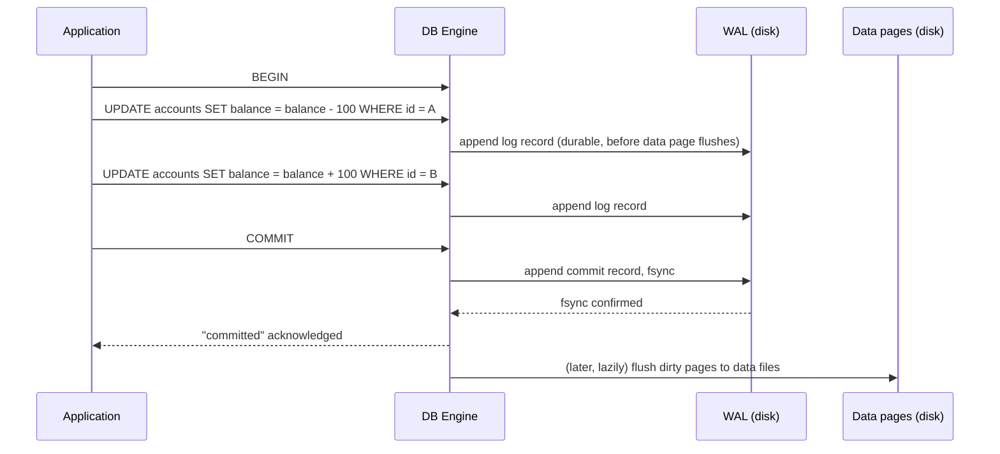
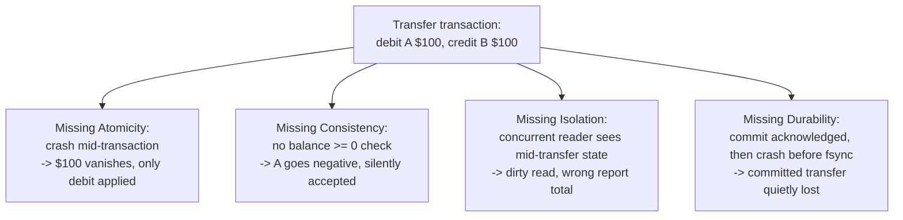

# ACID: Atomicity, Consistency, Isolation, Durability

_Four promises a database makes about every transaction - that it happens completely or not at all, that it never leaves declared rules broken, that it doesn't see or leak partial work from other transactions running at the same time, and that once it says "done," that's permanent even if the machine loses power a millisecond later._

## Contents

- [What a transaction is](#what-a-transaction-is)
- [Why four guarantees, and why together](#why-four-guarantees-and-why-together)
- [Atomicity: all-or-nothing](#atomicity-all-or-nothing)
- [How atomicity is actually implemented](#how-atomicity-is-actually-implemented)
- [Consistency: declared and undeclared invariants hold](#consistency-declared-and-undeclared-invariants-hold)
- [Isolation: concurrent transactions behave as if run one at a time](#isolation-concurrent-transactions-behave-as-if-run-one-at-a-time)
- [Durability: once committed, it survives a crash](#durability-once-committed-it-survives-a-crash)
- [Why atomicity and durability share the same machinery](#why-atomicity-and-durability-share-the-same-machinery)
- [Worked example: a bank transfer, and what breaks without each letter](#worked-example-a-bank-transfer-and-what-breaks-without-each-letter)
- [Trade-offs: full ACID vs relaxed guarantees](#trade-offs-full-acid-vs-relaxed-guarantees)
- [How this connects](#how-this-connects)
- [Real-world & sources](#real-world--sources)
- [Check yourself](#check-yourself)

## What a transaction is

**A transaction is a sequence of one or more operations (reads and writes) that the database treats as a single logical unit of work** - bounded by `BEGIN`/`START TRANSACTION` and ending in exactly one of two outcomes: `COMMIT` (make every change permanent) or `ROLLBACK`/abort (discard every change as if none of it happened). There is no third outcome, and no partial commit of "half the statements" - that binary all-or-nothing outcome is precisely what the next section (Atomicity) formalizes.

A transaction typically groups statements that must succeed or fail together because they jointly represent one real-world action that doesn't make sense half-done - the canonical example, reused throughout this document, is a bank transfer: debit account A, credit account B. Neither statement alone is a meaningful, safe action; only both together (or neither) is.

## Why four guarantees, and why together

The term **ACID** was coined by Theo Härder and Andreas Reuter in 1983, formalizing transaction properties that Jim Gray had described in his earlier (1981) work on transaction processing systems (`verify` exact publication details). The motivating problem in all four cases is the same: **a real database is shared by many concurrent clients, runs on hardware that can crash mid-operation, and enforces rules about what data is allowed to mean** - and application code cannot be trusted to get all of that right by hand, every time, for every write path. ACID is the database engine's contract that it will handle these problems itself, so the same guarantee holds regardless of which application, script, or person is writing.

Each letter answers a different failure mode:

| Letter          | The failure it prevents                                                                              |
| --------------- | ---------------------------------------------------------------------------------------------------- |
| **Atomicity**   | A crash or error leaves a transaction "half-applied" - some of its writes took effect, others didn't |
| **Consistency** | A transaction's result violates a rule the schema (or the application) declared must always hold     |
| **Isolation**   | A concurrently-running transaction sees another transaction's partial, uncommitted work              |
| **Durability**  | A transaction is reported as successfully committed, then a crash makes it disappear anyway          |

These are independent failure modes - a database can satisfy any subset of them without the others - which is exactly why they need to be named and reasoned about separately, even though real transactions need all four simultaneously to be trustworthy.

## Atomicity: all-or-nothing

**Formal:** for a transaction T consisting of operations `{op1, op2, ..., opn}`, either the effects of all n operations are reflected in the database, or the effects of none of them are - there is no database state in the operations' history in which only some prefix of T's writes are visible as permanent.

**Plain language:** a transaction is indivisible. If a transfer's debit succeeds but the credit fails (a constraint violation, a deadlock, the process getting killed, the disk filling up), the debit must be undone too - the database cannot be left in a state where money vanished from account A without ever reaching account B.

Atomicity is what makes `ROLLBACK` meaningful at all: rolling back isn't just "stop running more statements," it's "erase every effect already applied by the statements that did run in this transaction," including effects already written to disk pages before the failure occurred.

## How atomicity is actually implemented

The mechanism nearly every engine relies on is the **write-ahead log (WAL)**, combined with either **undo logging** or **multi-version tuple retention**, depending on the engine:

- **The write-ahead rule**: before a data page in memory is ever flushed to disk, the log record describing that change must already be durably written to the log first. This is the "write-ahead" the name refers to - the log always knows about a change before the data file does, which is precisely what makes recovery from a mid-write crash possible: the log is a reliable, ordered record of intent that the engine can replay or reverse.
- **Undo logging / rollback segments** (MySQL's InnoDB, Oracle): every row modification also writes a _before-image_ - enough information to reconstruct the row's prior value. On `ROLLBACK`, or on crash recovery for a transaction that never committed, the engine walks the undo log backward and reapplies the before-images, physically restoring the exact pre-transaction state.
- **MVCC-based rollback** (PostgreSQL): rather than writing an explicit undo log, an uncommitted transaction's new tuple versions are simply never made _visible_ to any other transaction (visibility is decided per-tuple by transaction ID bookkeeping, previewed further below and covered fully in the MVCC topic). Aborting just means the new versions are marked dead and later reclaimed by `VACUUM` - the "undo" is really "never let anyone see it, then garbage-collect it," a different physical mechanism reaching the identical logical guarantee.
- **Crash recovery (ARIES-style, the algorithm most engines base recovery on)** runs in three phases after a restart: **analysis** (scan the log to determine which transactions were still in-flight, and which data pages were "dirty" - modified in memory but not yet flushed - at the moment of the crash), **redo** (replay the log forward, reapplying _every_ logged change, committed or not, so data pages are restored to exactly the state they were in the instant before the crash - this is often summarized as "repeating history"), then **undo** (roll back the effects of only the transactions that never reached a commit record, using the undo information above). Redo-then-undo, in that order, is what lets one shared log serve both Atomicity (the undo phase) and Durability (the redo phase) at the same time - expanded on below.



## Consistency: declared and undeclared invariants hold

**Formal:** a transaction takes the database from one **consistent state** to another consistent state, where "consistent" means every integrity rule declared on the schema - domain, entity, and referential integrity, plus `CHECK`/`NOT NULL`/`UNIQUE` constraints and triggers (all covered in the [relational model](01-relational-model.md#integrity-constraints)) - holds both before the transaction starts and after it commits.

**Plain language, and the crucial nuance:** Consistency is the one ACID letter that is _not_ solely an engine-implemented mechanism the way the other three are. It has two layers:

- **Schema-declared, DB-enforced consistency** - `CHECK (balance >= 0)`, a foreign key that must reference a real row, a `NOT NULL` column. The engine checks these automatically at the end of each statement (or, if deferred, at commit) and - this is where Atomicity re-enters - if any check fails, the engine forces the whole transaction to abort and roll back rather than commit a state that violates a declared rule.
- **Application-level invariants the schema never declared** - "the sum of debits must equal the sum of credits across a double-entry ledger," "a seat can't be sold twice," "the total amount of money in the system doesn't change during an internal transfer." The database has no way to know these rules exist unless they're expressed as an explicit constraint; it can only guarantee that _whatever_ the transaction's logic does, it does so atomically and in isolation from other transactions. If the application's transaction logic is buggy - e.g., it credits the wrong account - the database will faithfully, durably, atomically commit a business-invalid result, because nothing declared that invariant to it.

Put differently: **Consistency in ACID is best understood as an outcome the other three properties make possible, not a fourth independent mechanism** - Atomicity ensures a constraint violation can be fully undone rather than partially applied; Isolation ensures one transaction's in-progress work doesn't let another transaction observe (and act on) a temporarily-inconsistent intermediate state; Durability ensures a consistent committed state, once reached, stays that way. This is a genuine and well-known critique of the acronym (see, e.g., Martin Kleppmann's _Designing Data-Intensive Applications_, which calls Consistency "the odd one out" among the four) - worth knowing precisely because it clarifies that Consistency's _guarantee_ is real, but its _enforcement mechanism_ is really "declared constraints, checked by the engine, backstopped by atomicity" rather than a standalone piece of machinery like a lock manager or a WAL.

**A separate, important disambiguation: ACID's "C" is not CAP's "C."** ACID consistency is about a single database's declared invariants holding true for one transaction's before/after states. The CAP theorem's "Consistency" (forward-ref, distributed systems theory) is about whether every replica in a distributed system agrees on the most recent write - a property about agreement _across nodes_, unrelated to schema constraints. The two concepts share an English word and nothing else; conflating them is one of the most common terminology mistakes in system design discussions, and it's worth fixing the distinction here before CAP is introduced later, precisely so it doesn't get silently merged with this one.

## Isolation: concurrent transactions behave as if run one at a time

**Formal:** the standard correctness criterion is **serializability** - the outcome of executing several transactions concurrently must be equivalent to _some_ serial (one-after-another, no overlap) ordering of those same transactions. Isolation is the guarantee that concurrency is invisible from the outside: whatever interleaving of reads/writes the engine actually used internally to run transactions in parallel, the observable result must match one of the possible non-concurrent orderings.

**Plain language:** two transactions running at the "same time" must not see each other's uncommitted, in-progress writes, and - depending on how strict the isolation level is - must be protected from a range of subtler concurrency effects too (a row changing value between two reads within the same transaction, new rows appearing that match a previous query's filter, and so on).

This document deliberately previews the mechanisms only briefly, because the vocabulary for naming _which specific anomalies_ are and aren't prevented (dirty read, non-repeatable read, phantom read) and the isolation levels built around them (read uncommitted, read committed, repeatable read, serializable) is the entire subject of the next topic, and the precise mechanics of how a database implements the most common approach is the topic after that:

- **Pessimistic concurrency control (locking)** - a transaction acquires a shared (read) or exclusive (write) lock on the rows it touches before touching them, and (under strict **two-phase locking**, 2PL) holds every lock until commit/abort, only releasing them all at the end. This guarantees serializability if applied fully, at the cost of blocked transactions and possible deadlocks.
- **Optimistic concurrency control (MVCC - multi-version concurrency control)** - instead of blocking, each transaction reads a consistent **snapshot** of the database as of some point in time (its writes create _new_ row versions rather than overwriting in place), so readers never block writers and writers never block readers; conflicts between concurrent writers are instead detected at commit time.

Full anomaly definitions, the standard isolation-level table, and MVCC's snapshot/visibility mechanics are the next two topics' job; the point to take forward from here is narrower but load-bearing: **Isolation specifies _what must never be observable_ across concurrent transactions - it does not, by itself, say how the engine achieves that**, and different engines make genuinely different default trade-offs (e.g., PostgreSQL and Oracle default to read committed; MySQL/InnoDB defaults to repeatable read) between correctness strictness and concurrent throughput.

## Durability: once committed, it survives a crash

**Formal:** once a transaction's commit has been acknowledged to the client, its effects must persist through any subsequent failure - power loss, OS crash, process kill, even (with appropriate replication) the total loss of the machine the transaction ran on.

**Plain language:** "committed" is a promise, not a suggestion - the database is not allowed to say "done" and then lose the work.

**How it's implemented:**

- **fsync before acknowledging commit** - the write-ahead rule from the Atomicity section is reused here in the opposite direction: the engine will not tell the client "committed" until the commit's log record has been forced to stable storage (`fsync`, or the storage-engine-specific equivalent), specifically so that even a crash the instant _after_ acknowledgment can still recover the transaction by replaying the log.
- **Group commit** - fsyncing the disk on every single commit is expensive (a physical disk flush has real latency); most engines batch several transactions' commit records into one fsync call, trading a small amount of added commit latency for dramatically higher commit throughput under concurrent load.
- **Synchronous replication** - fsyncing to one disk protects against process/OS crashes but not against that single machine's disk actually failing. Systems that need durability against whole-node loss additionally require a commit to be acknowledged by one or more replicas (e.g., PostgreSQL's `synchronous_commit = remote_apply`/`on` settings, or a quorum write in a distributed system, `verify` exact default per engine/version) before telling the client the transaction is durable. **Asynchronous replication trades durability for lower commit latency** - the primary acknowledges commit immediately and ships the log to replicas afterward, meaning a primary-node failure can lose the last few committed-but-not-yet-replicated transactions; this exact trade-off resurfaces heavily at L5 (replication, consistency models) and L11-L12 (multi-region, PACELC).

## Why atomicity and durability share the same machinery

It's worth stating explicitly why the same write-ahead log serves two letters that sound unrelated: **the WAL is, at its core, a durable, ordered record of intent**, and both guarantees are really just two different things you want to do with that record after a crash.

- **Durability needs redo** - for every transaction that _did_ commit, replay its logged changes forward so nothing committed is ever lost, even if the corresponding data pages hadn't been flushed to disk yet at the moment of the crash.
- **Atomicity needs undo** - for every transaction that _did not_ commit, reverse any of its changes that had already been applied, so nothing half-finished survives.

A single log, read once during crash recovery, answers both questions in one pass (redo everything, then undo whatever wasn't committed) - which is exactly the ARIES analysis/redo/undo sequence described above. This is also precisely why Atomicity and Durability are frequently implemented, taught, and tested together, while Isolation (locking/MVCC) and Consistency (constraint checking) are comparatively separate subsystems.

## Worked example: a bank transfer, and what breaks without each letter

A transaction moving $100 from account A (starting balance $500) to account B (starting balance $200), with a declared constraint `CHECK (balance >= 0)` on both accounts:

```sql
BEGIN;
UPDATE accounts SET balance = balance - 100 WHERE account_id = 'A'; -- A: 500 -> 400
UPDATE accounts SET balance = balance + 100 WHERE account_id = 'B'; -- B: 200 -> 300
COMMIT;
```

**Without Atomicity:** the engine crashes after the first `UPDATE` commits its effect to a data page but before the second `UPDATE` runs. Recovery does not undo the first statement. Result: A now has $400, B still has $200 - $100 has simply vanished from the system. Correct behavior instead: on crash recovery, the undo phase reverses A's debit because the transaction's commit record was never written, restoring A to $500.

**Without Consistency (i.e., the `CHECK` constraint didn't exist or wasn't enforced):** suppose A only had $50. `balance - 100` would leave A at `-50`. With the constraint enforced, the second `UPDATE` (or the first, depending on which the engine evaluates first) fails the check, and - because of Atomicity - the whole transaction rolls back, leaving A at its original $50. Without the constraint, the database would happily commit A at `-50`, a state that is atomic, isolated, and durable, yet violates a rule the business actually needed enforced - precisely illustrating that Consistency depends on a rule being declared at all.

**Without Isolation:** a second, concurrent transaction reads A's balance _between_ the two `UPDATE`s of the transfer - after the debit (`400`) has been applied in memory/on a page, but before the credit and the commit. If that second transaction is a "print today's total balance across all accounts" report, it sees A at $400 and B still at $200 (not yet $300) - a **dirty read** of an uncommitted, partial transfer - and reports a total that is $100 short of reality, purely because it peeked mid-transaction. Correct isolation prevents that second transaction from seeing A's debited balance until the whole transfer transaction has committed (or, under snapshot isolation, the reader simply keeps seeing the pre-transfer snapshot until its own transaction starts fresh).

**Without Durability:** the client receives "COMMIT successful" - but the engine had only applied the change in memory and had not yet fsynced the log record to disk when the machine loses power a moment later. On restart, that log record never existed on stable storage, so recovery has no way to redo it: the transfer that was reported as completed to the client is simply gone, and both accounts show their pre-transfer balances. This is exactly the gap synchronous fsync-before-acknowledgment closes.



## Trade-offs: full ACID vs relaxed guarantees

Full ACID isn't free - locking/MVCC bookkeeping, synchronous fsyncs, and cross-node coordination for distributed transactions all cost latency and throughput. This is exactly the trade-off that motivated the **BASE** model (**B**asically **A**vailable, **S**oft state, **E**ventually consistent) many NoSQL systems (forward-ref, L4) are built around instead:

|                                                 | Full ACID                                                                                                                                                                                                                                                  | Relaxed / BASE-style                                                                                                                                                                                                                                                                                                                                                                      |
| ----------------------------------------------- | ---------------------------------------------------------------------------------------------------------------------------------------------------------------------------------------------------------------------------------------------------------- | ----------------------------------------------------------------------------------------------------------------------------------------------------------------------------------------------------------------------------------------------------------------------------------------------------------------------------------------------------------------------------------------- |
| **Guarantee**                                   | Every transaction is atomic, leaves declared invariants intact, is isolated from concurrent transactions, and survives crashes once committed                                                                                                              | The system stays available and responsive even during partial failures; data may be briefly inconsistent across replicas but converges ("eventually consistent") once updates propagate                                                                                                                                                                                                   |
| **Typical mechanism**                           | WAL + undo/MVCC, lock manager or snapshot isolation, synchronous commit/replication                                                                                                                                                                        | Asynchronous replication, conflict resolution on read (last-write-wins, vector clocks, CRDTs), no cross-partition locking                                                                                                                                                                                                                                                                 |
| **Cost**                                        | Coordination overhead grows with the number of nodes/partitions involved in a transaction (cross-shard transactions especially, forward-ref L12); synchronous fsync/replication adds commit latency                                                        | Applications must tolerate and reason about temporarily stale or conflicting reads; correctness of business invariants (the Consistency piece) shifts more heavily onto application logic                                                                                                                                                                                                 |
| **When it's the right choice**                  | Money movement, inventory counts, anything where a half-applied or silently-lost write is a real financial/legal/correctness problem - e.g., core banking ledgers, order/payment processing                                                                | High-write-throughput, horizontally-partitioned workloads where a few seconds of replica staleness is an acceptable cost for availability and low latency - e.g., a social feed's like-count, a product catalog view count                                                                                                                                                                |
| **Real systems (illustrative, not exhaustive)** | PostgreSQL, MySQL/InnoDB, Oracle - full ACID by default for single-node transactions; increasingly, distributed SQL systems (e.g., Spanner-style designs, `verify` per system) extend ACID guarantees across nodes using synchronous replication/consensus | Cassandra (tunable consistency, historically eventual by default), early DynamoDB (BASE by design; DynamoDB later added opt-in ACID transactions across items, `verify` exact version/scope) - the point being many NoSQL stores now offer _some_ ACID-like guarantees as an explicit, opt-in mode layered on top of a BASE-first architecture, rather than either extreme being absolute |

The deeper point every one of these systems reflects: **ACID vs BASE isn't a binary choice made once for a whole company - it's a per-workload decision.** The same organization commonly runs strict ACID transactions for its billing/ledger tables and a BASE-style, eventually-consistent store for its activity feed or recommendation cache, because the cost of a stale read is completely different in each case.

## How this connects

- **Back to the relational model and normalization** - the [integrity constraints](01-relational-model.md#integrity-constraints) (entity, referential, domain, user-defined) covered there are exactly the schema-declared half of Consistency here; ACID adds the machinery (atomicity, isolation) that makes those constraints reliable under concurrent, potentially-failing execution, not just when a single statement runs alone.
- **Forward to transactions and isolation levels** (next L2 topic) - this document deliberately stopped at "isolation means serializable-equivalent behavior, via locking or MVCC"; the next topic names the concrete anomalies (dirty read, non-repeatable read, phantom read, lost update) and the standard isolation-level ladder (read uncommitted / read committed / repeatable read / serializable) that trades some of these off against concurrency for throughput.
- **Forward to MVCC** - the snapshot-based mechanism briefly previewed under Isolation, and the "abort without an explicit undo log" mechanism previewed under Atomicity, are the same underlying machinery; that topic covers version chains, visibility rules, and how `VACUUM`/garbage collection reclaims old versions.
- **Forward to L4, NoSQL and data at scale** - BASE, eventual consistency, and per-system tunable consistency knobs (Cassandra's read/write quorum settings, DynamoDB's eventually-consistent vs strongly-consistent reads) are the direct continuation of the trade-off table above, applied to horizontally-partitioned systems where full ACID across partitions is expensive or, in some designs, deliberately not offered at all.
- **Forward to L5, distributed systems theory** - the ACID-C vs CAP-C disambiguation made explicit above sets up CAP/PACELC cleanly; distributed/cross-shard transactions (two-phase commit, the Saga pattern) are the direct extension of "how do you keep Atomicity when a transaction spans multiple independent nodes."
- **Forward to L12, scalability patterns** - cross-shard transactions are exactly where full ACID gets expensive at scale, motivating patterns like Sagas (a sequence of local ACID transactions plus compensating actions) as a deliberately weaker but more scalable alternative to a single giant distributed transaction.

## Real-world & sources

**Stripe - idempotency keys as an application-level atomicity/exactly-once layer on top of an ACID database.** Stripe's mutating (`POST`) API endpoints accept an `Idempotency-Key` header; the server saves the resulting status code and body of the first request made for a given key and returns that same cached result for any retry with the same key, "regardless of whether it succeeds or fails" - so a network failure that makes a client unsure whether a charge went through can be safely retried without double-charging. Stripe's own explanation of the design ties this directly back to ACID: an operation is only safe to retry wholesale once "the previous operation was successfully rolled back by way of an ACID database" - i.e., the idempotency layer is deliberately built _on top of_ the database's own Atomicity guarantee (a failed attempt must have left no partial state behind) rather than replacing it. Per Stripe's API reference, idempotency keys are retained for **at least 24 hours**; a key reused after that window is pruned is treated as a brand-new request. This is a clean real-world illustration of a point the Consistency section makes above: the database enforces atomicity per-transaction, but "don't charge the same payment twice across a retried HTTP request" is an application-level invariant the schema itself has no way to express, so Stripe layers dedicated machinery (the idempotency key store) on top.
Sources: [Designing robust and predictable APIs with idempotency - Stripe Blog](https://stripe.com/blog/idempotency) (fetch-verified); [Idempotent requests - Stripe API Reference](https://docs.stripe.com/api/idempotent_requests) (fetch-verified, 24-hour retention quote).

**India's UPI (NPCI) - atomicity and rollback across independent banks, at national scale.** UPI transactions are cross-institution by nature (payer's bank, NPCI's central switch, and payee's bank are three separate systems), which makes Atomicity a distributed problem rather than a single-database one: if the payee's bank fails to acknowledge a credit, NPCI instructs the payer's bank to reverse (roll back) the debit instantly, so a transaction is never left half-applied - money debited from the payer with no confirmed credit to the payee. Because real-time settlement across every bank for every transaction isn't practical at UPI's volume, individual UPI payments are confirmed to users immediately while interbank money settlement itself happens in **periodic batch cycles**, reconciled afterward using transaction extracts each bank receives covering the settlement cycle. `verify`: the specific rollback/reconciliation description here is drawn from secondary engineering write-ups and a vendor (Oracle Banking) reconciliation-extract document rather than an official NPCI/RBI engineering publication - no primary NPCI engineering blog or whitepaper describing internal ACID/database implementation was found in this search; treat the mechanism as directionally accurate but not verbatim-sourced from NPCI itself, and flag this gap if precise internal architecture detail is needed later.
Sources: [Deep Dive: System Design of UPI - Medium](https://medium.com/@avinashkariya05910/deep-dive-system-design-of-upi-unified-payments-interface-eff3b0334b0d) (rollback description); [UPI Reconciliation Extraction - Oracle Banking Payments Cloud Service docs](https://docs.oracle.com/en/industries/financial-services/banking-payments-cloud-service/14.8.1.0.0/pcupi/upi-reconciliation-extraction.html) (settlement-cycle reconciliation extracts, fetch-verified via search).

**Uber - Postgres's WAL as the concrete Atomicity+Durability mechanism, and why it became a scaling constraint.** Uber's own engineering write-up on migrating core datastores from Postgres to a custom MySQL-backed system (Schemaless) states plainly that "the WAL allows the atomicity and durability aspects of ACID" - i.e., confirming in production terms exactly the shared-machinery point made earlier in this document (one log serving both letters). Uber's article focuses mainly on operational costs of that machinery at their scale (replication lag from write-heavy workloads, the difficulty of horizontally sharding a single strongly-consistent Postgres primary, and connection/vacuum overhead) rather than detailing what, if anything, was given up on the transactional side when they moved core ride/trip data onto a MySQL-backed system - the trade-off is real but the source itself is not explicit about the resulting isolation/consistency posture of the new system, so treat "what ACID guarantees Schemaless does or doesn't preserve" as `verify`/not covered by this source.
Sources: [Why Uber Engineering Switched from Postgres to MySQL - Uber Engineering Blog](https://www.uber.com/en-US/blog/postgres-to-mysql-migration/) (fetch-verified, WAL/ACID quote and replication-lag/scaling discussion).

## Check yourself

- A transaction debits account A and, before it can credit account B, the process is killed. Walk through, in order, what the ARIES-style recovery process does on restart, and name which ACID letter each phase is restoring.
- Explain, precisely, why "Consistency" in ACID is not implemented by a dedicated subsystem the way Atomicity (WAL/undo) and Isolation (locks/MVCC) are - what does it actually depend on instead?
- A colleague says "our system is CP under CAP, so it's basically ACID." Explain what's wrong with equating those two, using the specific difference between what each "C" refers to.
- Why does durability specifically require the commit's log record to be fsynced _before_ the client is told "committed," rather than after? What could go wrong with acknowledging first and flushing afterward?
- Give a concrete example of a business invariant that a `CHECK` constraint could enforce, and one that it structurally cannot - and explain why the second one still relies on ACID (just not on the Consistency letter's constraint-checking mechanism) to stay correct.
