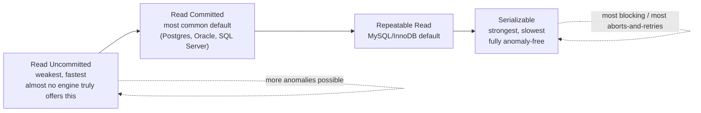
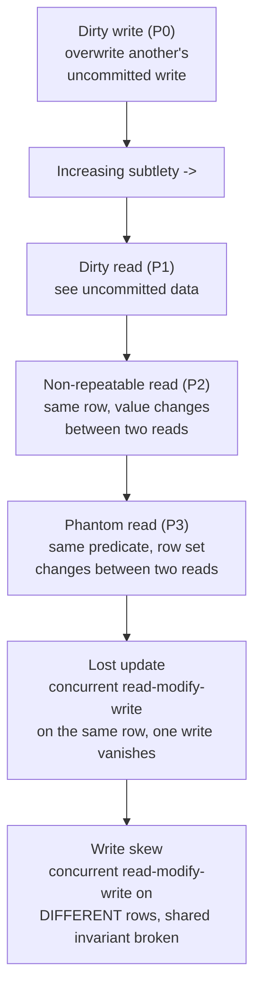
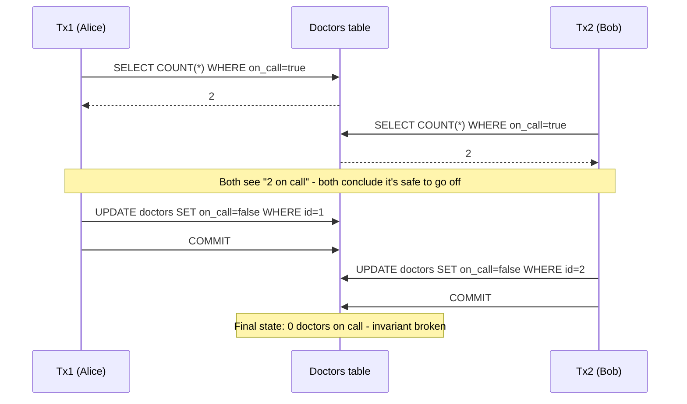

# Transactions and Isolation Levels

_ACID's "I" said concurrent transactions must behave as if run one at a time - this topic is the menu of exactly how strictly a database actually enforces that, the specific bugs ("anomalies") that leak through at each weaker setting, and why every real engine ships more than one setting instead of just always running everything fully serially._

## Contents

- [What a transaction is, precisely](#what-a-transaction-is-precisely)
- [Why isolation levels exist as a spectrum](#why-isolation-levels-exist-as-a-spectrum)
- [The anomalies concurrent transactions can produce](#the-anomalies-concurrent-transactions-can-produce)
- [The standard isolation levels](#the-standard-isolation-levels)
- [Worked example: write skew - the on-call doctors](#worked-example-write-skew---the-on-call-doctors)
- [SQL standard vs how real engines diverge](#sql-standard-vs-how-real-engines-diverge)
- [Trade-offs: stricter isolation vs concurrency and throughput](#trade-offs-stricter-isolation-vs-concurrency-and-throughput)
- [How this connects](#how-this-connects)
- [Check yourself](#check-yourself)
- [Real-world & sources](#real-world--sources)

## What a transaction is, precisely

A [transaction](04-acid.md#what-a-transaction-is) is a sequence of reads/writes bounded by `BEGIN`...`COMMIT`/`ROLLBACK` that the database treats as one indivisible logical unit. Isolation is the ACID letter that governs a narrower, sharper question than the other three: **not "does this transaction's own work survive and apply completely" (that's Atomicity/Durability), but "what is this transaction allowed to see and be affected by, given that other transactions are running against the very same data at the very same time."**

Two facts make isolation a genuinely hard problem rather than a formality:

- **Transactions overlap in wall-clock time.** A production database routinely has hundreds or thousands of transactions in flight simultaneously, each reading and writing rows that other in-flight transactions are also touching. Nothing about "one transaction at a time" is true physically - it only needs to be true *observably*.
- **The gold-standard correctness criterion is serializability**: the result of running transactions concurrently must be equivalent to *some* serial (non-overlapping, one-after-another) ordering of those same transactions - not necessarily the order they were issued in, just *some* valid ordering. A database that is serializable is, by definition, immune to every concurrency anomaly this document describes, because none of those anomalies can occur in any purely serial execution. Every isolation level weaker than serializable is a deliberate, named exception to this gold standard, traded for concurrency.

**A transaction's isolation level is a per-transaction setting**, not a global database setting - `SET TRANSACTION ISOLATION LEVEL ...` (or a connection/session default) is chosen independently for each transaction, and a single database instance routinely runs transactions at different isolation levels side by side depending on what each one needs.

## Why isolation levels exist as a spectrum

If serializability is unambiguously the correct answer, why does every mainstream engine also offer three or more weaker levels, and default to one of the weaker ones? Because **true serializability has a real, measurable cost**, and that cost is exactly what the next two L2 topics (MVCC and Locking) exist to manage:

- **Pessimistic (locking) implementations** of serializability must hold locks - including, critically, **range locks/predicate locks** that block not just rows that exist today but rows that *could be inserted* matching a query's condition - for the full duration of every transaction under strict two-phase locking. More transactions touching overlapping data means more blocking, more lock waits, and a materially higher chance of deadlock.
- **Optimistic (MVCC-based) implementations** of serializability (e.g., PostgreSQL's Serializable Snapshot Isolation, previewed below and covered in depth in the MVCC topic) instead let transactions proceed without blocking and detect conflicts at commit time - but detecting *every* possible serialization conflict requires extra bookkeeping per transaction and a real, non-zero rate of transactions being aborted and forced to retry, purely because the engine can't prove their interleaving was safe, even when the actual values touched didn't collide.
- Either mechanism, applied to *every* transaction, costs throughput that many workloads simply don't need to pay for, because many transactions don't actually share data with enough other concurrent transactions for the weaker anomalies to ever manifest in practice.

This is why isolation levels form a **spectrum of "how many correctness guarantees do you buy, at how much concurrency cost"** rather than a single on/off correctness switch - and the entire practical skill (and a recurring interview question) is knowing which anomalies a given weaker level still allows through, so you can decide, per workload, whether that's an acceptable risk or a serious bug waiting to happen.



## The anomalies concurrent transactions can produce

The original ANSI SQL-92 standard defined isolation levels in terms of three "phenomena" it permits or forbids. A 1995 paper, **Berenson et al., "A Critique of ANSI SQL Isolation Levels,"** pointed out that the ANSI definitions were ambiguous and incomplete, and formalized a cleaner set of phenomena (**P0-P3**) plus named two further anomalies (**lost update**, **write skew**) that the original standard's wording didn't even capture properly - which is exactly why "repeatable read" and "serializable" mean subtly different things across real engines today, covered in the divergence section below.

- **Dirty write (P0)** - Transaction A writes a row, and before A commits or rolls back, transaction B overwrites that same, still-uncommitted write. If A then rolls back, B's write is based on a value that never should have existed - and worse, A's rollback may now incorrectly undo B's write too. This is considered so fundamentally broken that **every isolation level, including the weakest, prevents it** - it's the one guarantee that's never on the table as an option.

- **Dirty read (P1)** - Transaction B reads a row that transaction A has modified but not yet committed. If A subsequently rolls back, B has acted on data that, from the database's authoritative point of view, never existed.
  - *Example:* `Tx1: UPDATE accounts SET balance = balance - 100 WHERE id = 'A';` (A: 500 -> 400, not yet committed) then `Tx2: SELECT balance FROM accounts WHERE id = 'A';` reads **400**. `Tx1` then hits an error and `ROLLBACK`s, restoring A to 500 - but Tx2 already computed a report, or worse, approved a second withdrawal, using a balance that was never real.

- **Non-repeatable read / fuzzy read (P2)** - Within a single transaction, the *same* row is read twice, and the value differs between the two reads, because another transaction committed a change to that row in between.
  - *Example:* `Tx2: SELECT balance FROM accounts WHERE id = 'A';` reads `500`. Concurrently, `Tx1: UPDATE accounts SET balance = 450 WHERE id = 'A'; COMMIT;`. `Tx2` reads the same row again later in the *same* transaction: `SELECT balance FROM accounts WHERE id = 'A';` now reads `450`. Tx2 never touched a row it shouldn't have seen (Tx1's write was committed, so no dirty read occurred) - the bug is that the *same logical transaction* got two different answers to the identical question, which breaks any logic in Tx2 that assumed the value was stable for its whole duration.

- **Phantom read (P3)** - Within a single transaction, the *same predicate/filter* is re-run twice, and the *set of rows matching it* changes, because another transaction inserted or deleted a row matching that predicate in between. This is the row-existence analogue of a non-repeatable read: not a value that changed, but a row that appeared or disappeared out of a range/count query.
  - *Example:* `Tx2: SELECT COUNT(*) FROM orders WHERE status = 'pending';` returns `12`. Concurrently, `Tx1: INSERT INTO orders (status, ...) VALUES ('pending', ...); COMMIT;`. `Tx2` re-runs the identical `COUNT(*)` query later in the same transaction and now gets `13` - a row that "phantom"-appeared inside a range Tx2 had already queried once. Critically, this cannot be fixed by simply locking the rows that existed at the first read, because the offending row didn't exist yet when Tx2 first read - preventing this requires locking (or otherwise accounting for) the *predicate/range itself*, which is exactly why phantom-prevention is mechanically harder than dirty/non-repeatable-read prevention (previewed here, covered fully as predicate/next-key locking in the Locking topic).

- **Lost update** - Two transactions concurrently read the *same* row, each independently computes a new value based on what it read, and each writes its result back - and one write silently clobbers the other's, with no error, no conflict signal, and no trace that an update was ever lost.
  - *Example:* `inventory.count = 10` for a product. `Tx1` and `Tx2` both run `SELECT count FROM inventory WHERE product_id = 'X';`, both read `10`, both decide to sell one unit and compute `count = 9`, both run `UPDATE inventory SET count = 9 WHERE product_id = 'X';` and commit. The real, correct answer after two sales is `8` - one sale's decrement is silently lost, and the database now shows one more unit of stock than physically exists.

- **Write skew** - The generalization of lost update to *disjoint* rows: two transactions each read an overlapping set of rows to check some multi-row invariant, each independently decide (based on that read) to write to a *different* row than the other transaction wrote to, and both commits succeed - yet the combined effect violates an invariant that depended on the rows *together*, even though no single row was written by both transactions. This is strictly harder to catch than lost update precisely because no individual row was ever concurrently written by both transactions - there is no literal overwrite to detect, only a violated cross-row invariant. Fully walked through below because it's the anomaly most people get wrong first.



## The standard isolation levels

The SQL standard defines four levels purely in terms of which of the ANSI phenomena (P1/P2/P3) each one still permits - **lost update and write skew are deliberately absent from the official ANSI matrix**, which is itself a well-known gap the Berenson et al. critique highlighted, and part of why "Repeatable Read" and "Serializable" behave differently across real engines (next section).

| Isolation level | Dirty write (P0) | Dirty read (P1) | Non-repeatable read (P2) | Phantom read (P3) | Lost update | Write skew |
| --- | --- | --- | --- | --- | --- | --- |
| **Read Uncommitted** | Prevented | **Possible** | **Possible** | **Possible** | Possible | Possible |
| **Read Committed** | Prevented | Prevented | **Possible** | **Possible** | Possible | Possible |
| **Repeatable Read** | Prevented | Prevented | Prevented | **Possible (per ANSI SQL-92 wording)** | Prevented (with locking) / depends on engine | Possible |
| **Serializable** | Prevented | Prevented | Prevented | Prevented | Prevented | Prevented |

Reading this table correctly matters more than memorizing it: **each level is defined by what it still permits, not by a positive list of mechanisms** - the standard says nothing about *how* an engine must achieve a given row of guarantees (locking vs MVCC snapshots vs conflict detection are all valid, and different engines genuinely choose differently, covered next).

- **Read Uncommitted** - the weakest level: a transaction may see other transactions' uncommitted writes. In practice this level is close to theoretical - very few production engines actually let a reader see truly uncommitted data (see PostgreSQL below), because the cost savings versus Read Committed are marginal while the risk (acting on data that might vanish on rollback) is severe.
- **Read Committed** - a transaction only ever sees data that was committed *at the time each individual statement runs* - two different statements in the same transaction can each see a different, newer committed snapshot. This is the most common real-world default (PostgreSQL, Oracle, SQL Server all default here, `verify` exact SQL Server default) precisely because it eliminates the worst anomaly (dirty reads) at comparatively low cost, while still permitting non-repeatable/phantom reads within one transaction.
- **Repeatable Read** - a transaction sees a single consistent view of the data fixed at the *start* of the transaction (not per-statement); once a row has been read once, re-reading it within the same transaction is guaranteed to return the same value. Per the ANSI table, phantom reads are technically still allowed at this level - though, as the divergence section below explains, several real engines exceed the standard's minimum bar here and prevent phantoms too.
- **Serializable** - the only level that is anomaly-free by construction: the observable result of any concurrent execution must be equivalent to some serial ordering of the involved transactions. This is the level that write skew specifically requires, since neither Read Committed nor plain Repeatable Read (nor snapshot isolation, see below) is sufficient to prevent it.

## Worked example: write skew - the on-call doctors

This is the canonical example (popularized by Kleppmann's *Designing Data-Intensive Applications*) precisely because it demonstrates why write skew is the anomaly people most often miss: **neither transaction violates any single-row constraint, and neither transaction's *own* read set is stale by the time it writes** - the bug only exists when you look at both transactions' effects together.

Schema and rule: a hospital requires **at least one doctor on call at all times** - an application-level invariant (not a schema `CHECK`, because it spans multiple rows and can't be expressed as a single-row constraint):

```sql
-- doctors(id, name, on_call)
-- id=1 Alice, on_call=true
-- id=2 Bob,   on_call=true
```

Both Alice and Bob want to go off call. Each runs their own transaction, both under **Repeatable Read / Snapshot Isolation** (not full Serializable):

```sql
-- Tx1 (Alice's request)                      -- Tx2 (Bob's request), concurrently
BEGIN;                                        BEGIN;
SELECT COUNT(*) FROM doctors                  SELECT COUNT(*) FROM doctors
  WHERE on_call = true;  -- reads 2              WHERE on_call = true;  -- reads 2
-- 2 >= 2, safe for Alice to go off call       -- 2 >= 2, safe for Bob to go off call
UPDATE doctors SET on_call = false            UPDATE doctors SET on_call = false
  WHERE id = 1;                                 WHERE id = 2;
COMMIT;                                        COMMIT;
```

Both transactions read `COUNT(*) = 2` from the same consistent snapshot (each one taken before either write happened), each independently concludes "there are 2 on-call doctors, so I alone going off call still leaves 1 - safe," and each writes to a **different row** (Alice writes row 1, Bob writes row 2). Neither write conflicts with the other at the row level, so no lost-update detection mechanism catches anything, and both commits succeed. Result: **zero doctors on call**, violating the invariant, even though every individual statement executed correctly against the data it read.



**Why weaker fixes fail, and what actually fixes it:**

- Row-level locking on the rows *read* wouldn't help by default, because a plain `SELECT` doesn't take a write lock - both transactions' reads proceed unblocked, and by the time either writes, it's writing a row the other transaction never touched.
- `SELECT ... FOR UPDATE` (an explicit, application-added lock on the read) *would* fix this specific case, by forcing Tx2's read to block until Tx1's transaction (which now holds a lock on the rows it read) commits or rolls back - but this requires the application developer to recognize the invariant depends on multiple rows and manually request the stronger lock; nothing about Repeatable Read forces this by default.
- **True Serializable isolation is the only level that prevents this without the application having to hand-pick which reads need locking** - a fully serializable execution is, by definition, equivalent to running Tx1 and Tx2 one after the other, and in *either* serial ordering, the second transaction to run would read `COUNT(*) = 1` (because the first already committed its change), correctly conclude going off call is unsafe, and be forced to abort or block. PostgreSQL's `SERIALIZABLE` level (Serializable Snapshot Isolation, SSI) detects exactly this kind of read-write dependency cycle across concurrent transactions and aborts one of them with a serialization-failure error, forcing the application to retry - the detection mechanics are the MVCC topic's job, not this one's.

## SQL standard vs how real engines diverge

The standard specifies *what must be true* per level; it says nothing about *how* to implement it, and real engines differ in materially important ways:

- **PostgreSQL** offers only three distinct behaviors even though it accepts four level names: requesting `READ UNCOMMITTED` is silently treated as `READ COMMITTED`, because PostgreSQL's MVCC design (each transaction only ever sees committed row versions per its visibility rules, previewed in the [ACID isolation section](04-acid.md#isolation-concurrent-transactions-behave-as-if-run-one-at-a-time) and covered fully in the MVCC topic) makes true dirty reads structurally impossible to produce - there's no code path that ever exposes an uncommitted tuple to another transaction, so the weakest level simply has nothing weaker to fall back to. PostgreSQL defaults to **Read Committed**. Its **Repeatable Read** is implemented as **snapshot isolation** - the transaction reads from one fixed, consistent snapshot taken at its start - which, as a side effect, already prevents phantom reads too (stronger than the bare ANSI minimum for this level), but snapshot isolation alone still permits write skew, exactly as demonstrated above. Since version 9.1, PostgreSQL's `SERIALIZABLE` is implemented via **Serializable Snapshot Isolation (SSI)** - an optimistic, MVCC-based mechanism that monitors for dangerous read-write dependency patterns between concurrent transactions and aborts one of them rather than blocking upfront, giving true serializability without falling back to full two-phase locking.
- **MySQL/InnoDB** supports all four standard levels and defaults to **Repeatable Read** - a well-known divergence from PostgreSQL/Oracle's Read Committed default, and a common source of surprising behavior for engineers moving between the two. InnoDB's Repeatable Read additionally uses **next-key locking** (a combination of a record lock plus a gap lock covering the space *between* index records) specifically so that locking reads close the phantom-read gap that a pure MVCC snapshot mechanism would otherwise still leave open - meaning InnoDB's Repeatable Read, in practice, prevents more phantom scenarios than the bare ANSI standard requires at that level, though the exact guarantee differs between plain (non-locking) consistent reads and explicit locking reads (`SELECT ... FOR UPDATE`) (`verify` precise scope of which read types get gap-lock protection in current InnoDB versions). MySQL's `SERIALIZABLE` is implemented by implicitly converting every plain `SELECT` into a locking read (as if `SELECT ... LOCK IN SHARE MODE` had been added), i.e. it reaches serializability through **pessimistic locking** rather than PostgreSQL's optimistic conflict-detection approach - the same target guarantee, two structurally different mechanisms, which is exactly the locking-vs-MVCC fork the next two L2 topics cover in full.
- **Oracle** supports **Read Committed** (its default) and **Serializable**, but does not offer distinct `READ UNCOMMITTED` or `REPEATABLE READ` levels in the standard sense (`verify` exact terminology/version); Oracle's own "Serializable" is itself implemented as snapshot isolation rather than full 2PL-based serializability, meaning it is - like PostgreSQL's Repeatable Read - still theoretically exposed to write skew unless the application adds explicit locking (`verify` Oracle's precise write-skew exposure at its Serializable level, since vendor documentation on this specific point is easy to state imprecisely).

The consistent, load-bearing pattern across all three: **"Serializable" and "Repeatable Read" are standard *names* for a guarantee, not a guarantee of a specific mechanism** - an engine can satisfy the same named contract via locking, via MVCC snapshots, or via optimistic conflict detection, and knowing which one a given engine actually uses is exactly what determines whether it's vulnerable to write skew, how much it blocks under contention, and how it behaves under high concurrency - the two questions the next two topics answer in full.

## Trade-offs: stricter isolation vs concurrency and throughput

| | Weaker isolation (Read Uncommitted / Read Committed) | Stronger isolation (Repeatable Read / Serializable) |
| --- | --- | --- |
| **Concurrency / throughput** | Higher - readers rarely block, less lock/version bookkeeping overhead | Lower - more blocking (locking approach) or more forced aborts-and-retries (MVCC/SSI approach) under contention |
| **Correctness guarantee** | Application must tolerate or explicitly guard against dirty/non-repeatable/phantom reads, lost updates, and write skew | Progressively fewer anomalies possible; Serializable alone is provably anomaly-free |
| **Application burden** | Higher - the application logic must be written defensively (e.g., re-check conditions, use explicit row locks like `SELECT ... FOR UPDATE`) wherever an anomaly would matter | Lower - the engine's guarantee covers cases the developer might not think to defend against, at the cost of needing to handle serialization-failure retries at Serializable |
| **Typical use case** | High-volume, low-contention reads where a slightly stale or transiently inconsistent view is an acceptable cost - dashboards, analytics reads, most single-row CRUD | Multi-row invariants that must hold exactly (inventory counts, seat/ticket allocation, financial ledgers, the on-call-doctors class of constraint) |
| **Real defaults** | PostgreSQL/Oracle: Read Committed | MySQL/InnoDB: Repeatable Read (default); PostgreSQL Serializable via SSI is opt-in per transaction, not the default |

The practical rule this table exists to teach: **the default isolation level most engines ship with (Read Committed or Repeatable Read) is a deliberate bet that most transactions in most applications don't actually collide on the same rows or the same cross-row invariant often enough to justify paying Serializable's cost everywhere** - and the engineering skill is recognizing the specific transactions in a system (typically: anything enforcing a multi-row business invariant, like the doctors example, seat inventory, or double-entry balance checks) that need an explicit, deliberate upgrade to a stronger level or an explicit lock, rather than assuming the database-wide default silently protects them.

## How this connects

- **Back to ACID's Isolation letter** - this document is the direct expansion of the [isolation section](04-acid.md#isolation-concurrent-transactions-behave-as-if-run-one-at-a-time) in the ACID topic, which deliberately deferred exactly this vocabulary (the named anomalies and the four standard levels) to here.
- **Forward to MVCC** (next L2 topic) - "read from a consistent snapshot," "PostgreSQL's Repeatable Read never sees uncommitted or newer-committed data," and "Serializable Snapshot Isolation detects dangerous read-write dependencies at commit time" were all previewed by name here without explaining the underlying version-chain, visibility-rule, and conflict-detection mechanics - that's the next topic's entire job.
- **Forward to Locking** (topic after MVCC) - `SELECT ... FOR UPDATE`, gap/next-key locking, and MySQL's lock-based path to Serializable were all introduced here as named mechanisms without explaining how a lock manager actually grants, queues, and detects deadlocks among them - that mechanical detail is the Locking topic's job.
- **Forward to indexing** - next-key locking (mentioned under MySQL above) is a lock taken on ranges *within an index structure*, which will make considerably more sense once B-tree index internals (a later L2 topic) are covered.
- **Forward to L5, distributed systems theory** - "serializability" here is defined for a single database instance; L5's **linearizability vs serializability** topic distinguishes this single-node correctness criterion from the cross-node, real-time-ordering guarantee linearizability adds, and generalizes the "isolation vs throughput" trade-off in this document to distributed transactions and multi-region replication.
- **Forward to L12, scalability patterns** - the throughput cost of strict isolation discussed in the trade-offs table above is exactly why cross-shard/distributed transactions are treated as expensive and often avoided in favor of Sagas at scale - the single-node version of that same cost-benefit calculation is what this document teaches first.

## Check yourself

- A transaction reads `balance = 500`, then later in the same transaction reads it again and gets `450`, with no error in between. Name the anomaly, and name the weakest standard isolation level that would have prevented it.
- Explain precisely why the on-call-doctors write-skew example cannot be fixed by ordinary row-level locking on the rows each transaction *writes* - what would need to be locked instead, and why does that make it structurally different from a lost update?
- A colleague says "MySQL and PostgreSQL both support Repeatable Read, so they behave identically at that level." Give one concrete way they diverge, and explain the mechanism difference that causes it.
- Why are lost update and write skew absent from the official ANSI SQL isolation-level table, even though both are real, well-documented anomalies? What does that gap tell you about relying on the standard's wording alone when choosing an isolation level for a real system?
- If Serializable isolation is provably free of every anomaly in this document, why doesn't every transaction just default to it?

## Real-world & sources

- **Fintech - Stripe-pattern idempotency keys, implemented with Postgres `SERIALIZABLE` transactions.** Brandur Leach's widely-referenced writeup of how to safely implement Stripe-style idempotency keys shows the concrete mechanism: the "atomic phase" of processing a request (checking for an existing idempotency key and inserting a new one if none exists) is "wrapped in a `SERIALIZABLE` transaction. If two different transactions both try to lock any one key, one of them will be aborted by Postgres" - i.e. two concurrent retries of the *same* logical request race to create the same idempotency-key row, and Serializable isolation is exactly what turns that race into a clean "one wins, one gets a serialization error and retries/returns the cached result" outcome instead of a duplicate-write anomaly. This is a direct, practical illustration of this topic's core lesson: the default isolation level (Read Committed) is deliberately *not* strong enough to make this safe on its own, and choosing Serializable for this one specific, narrow, low-volume transaction (not the whole application) is the correct, deliberate trade-off the trade-offs table above describes. Stripe's own public engineering post on idempotency ([stripe.com/blog/idempotency](https://stripe.com/blog/idempotency), fetch-verified) explains the idempotency-key *concept* and API contract but does not itself specify the isolation level used internally - so the isolation-level mechanics above are sourced to Brandur's Postgres-implementation writeup rather than to Stripe's own blog post; treat the specific "Stripe uses this exact mechanism internally" claim as `verify` even though Brandur is a former Stripe engineer describing the same pattern Stripe popularized.
  Source: [Implementing Stripe-like Idempotency Keys in Postgres - brandur.org](https://brandur.org/idempotency-keys) (fetch-verified 2026-07-10); concept source: [Designing robust and predictable APIs with idempotency - Stripe Engineering Blog](https://stripe.com/blog/idempotency) (fetch-verified 2026-07-10, does not itself describe isolation-level internals).

- **Uber (fintech-adjacent: payments ledger) - deliberate, per-index consistency/isolation trade-off in LedgerStore.** Uber's LedgerStore, the system of record for "any financial event or data movement at Uber" handling tens of billions of financial transactions, explicitly offers two different consistency modes for its secondary indexes rather than one default: **strongly consistent indexes**, built with "a 2-phase commit to ensure that the index is always strongly consistent with the record" (the write path does an index-intent write before the record write, then commits the intents only if the record write succeeded - so "a write failure of any one of the index intents implies the whole write should be failed"), versus **eventually consistent indexes**, "built in the background by a separate process that is completely isolated from the online write path." This is the same "correctness guarantee vs throughput/availability" trade-off this document's table describes, just applied at the level of choosing which indexes on a financial ledger need the stronger (and more failure-prone-to-write) guarantee versus which can tolerate lag.
  Source: [How LedgerStore Supports Trillions of Indexes at Uber - Uber Engineering Blog](https://www.uber.com/blog/how-ledgerstore-supports-trillions-of-indexes/) (fetch-verified 2026-07-10).

- **CockroachDB (distributed SQL, production Serializable-by-default engine) - write skew explained and prevented via Serializable Snapshot Isolation.** CockroachDB's engineering blog gives a from-first-principles walkthrough of exactly the anomaly this document's worked example demonstrates: "two transactions read the same data, make independent updates, and commit without detecting each other's changes," which Snapshot Isolation alone cannot prevent because it only blocks concurrent transactions whose *write sets* overlap, not the read-write ("rw") dependency cycles that cause write skew. CockroachDB's implementation of Serializable Snapshot Isolation "tracks whether [each transaction] is involved in a rw-dependency on either side, and if it is on both ends of an rw dependency, it (or its successor, or its predecessor) gets aborted" - the same commit-time conflict-detection strategy PostgreSQL's `SERIALIZABLE` uses (per the SQL-standard-divergence section above), corroborating that this is a general SSI technique, not a PostgreSQL-specific quirk. Notably, CockroachDB runs **Serializable as its only isolation level** (no weaker option is offered), the opposite default-choice from PostgreSQL/MySQL/Oracle - a useful counterpoint showing that "weaker-by-default" is a common engineering choice, not a universal law.
  Source: [What write skew looks like - Cockroach Labs Blog](https://www.cockroachlabs.com/blog/what-write-skew-looks-like/) (fetch-verified 2026-07-10).

- **India's UPI/NPCI:** no citable official NPCI/RBI engineering source discussing transaction isolation levels specifically was found during this sweep (only third-party/unofficial explainer blogs turned up, which do not meet this repo's sourcing bar for NPCI claims) - flagged as missing research rather than included. UPI's widely-known two-leg debit/credit design (debit-then-async-credit-with-compensation) is a distributed-transactions/Saga-pattern topic more than a single-node isolation-level one; it is better sourced for the later distributed-transactions/Sagas topics (L5/L12) than for this one.
