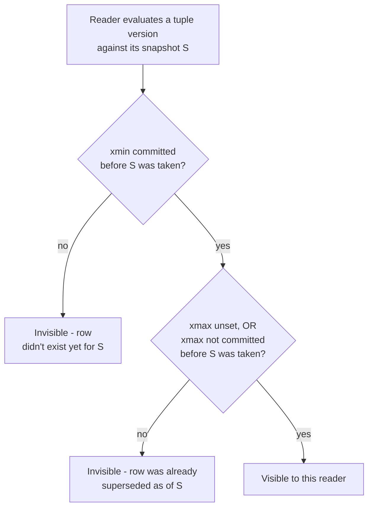

# MVCC: Multi-Version Concurrency Control

_The previous topic named the guarantees ("snapshot," "Read Committed sees the latest committed data," "Repeatable Read/Serializable Snapshot Isolation reads one fixed view") without explaining how a database actually produces a consistent snapshot while dozens of other transactions are concurrently reading and writing the same rows - this topic is that mechanism, in full._

## Contents

- [What MVCC is and why it exists](#what-mvcc-is-and-why-it-exists)
- [The core idea: versions, not overwrites](#the-core-idea-versions-not-overwrites)
- [Visibility rules: xmin/xmax and the snapshot test](#visibility-rules-xminxmax-and-the-snapshot-test)
- [Worked example: a version chain walked through two concurrent transactions](#worked-example-a-version-chain-walked-through-two-concurrent-transactions)
- [Two physical implementations: PostgreSQL vs MySQL/InnoDB](#two-physical-implementations-postgresql-vs-mysqlinnodb)
- [MVCC still needs locks: writer-writer conflicts](#mvcc-still-needs-locks-writer-writer-conflicts)
- [Garbage collection: VACUUM, bloat, and transaction ID wraparound](#garbage-collection-vacuum-bloat-and-transaction-id-wraparound)
- [What MVCC does and doesn't prevent](#what-mvcc-does-and-doesnt-prevent)
- [Trade-offs: MVCC vs pure locking](#trade-offs-mvcc-vs-pure-locking)
- [How this connects](#how-this-connects)
- [Check yourself](#check-yourself)
- [Real-world & sources](#real-world--sources)

## What MVCC is and why it exists

**Multi-Version Concurrency Control (MVCC)** is a concurrency-control mechanism in which a write never modifies a row in place for other transactions to immediately see - instead, the engine keeps **multiple versions of the same logical row** simultaneously, and each transaction is handed the specific version (or reconstructed view) that is correct for its own point in time. It is the mechanism, not a new isolation guarantee: MVCC is _how_ an engine delivers the "snapshot" behavior that [Read Committed and Repeatable Read](05-transactions-isolation-levels.md#the-standard-isolation-levels) promise by name, and it is the mechanism [previewed under ACID's Isolation letter](04-acid.md#isolation-concurrent-transactions-behave-as-if-run-one-at-a-time) as "optimistic concurrency control."

**The problem MVCC exists to solve** is the central cost of the alternative, pure lock-based (pessimistic) concurrency control: under strict two-phase locking, a reader takes a shared lock and a writer takes an exclusive lock, and shared/exclusive locks on the same row are mutually incompatible - so **a long-running writer blocks every reader of that row, and a long-running reader blocks every writer**, even though a reader that only wants a point-in-time view and a writer that is producing a _new_ value don't actually need to fight over the same physical bytes. MVCC's core insight is that this contention is avoidable: **if a write creates a new version instead of destroying the old one, a reader can keep reading the old version for as long as it needs to, completely undisturbed, while the writer proceeds independently** - the two guarantees this buys, stated precisely, are:

- **Readers never block writers.** A `SELECT` never has to wait for an in-progress `UPDATE`/`INSERT`/`DELETE` on the same rows to finish, because it simply reads whichever version was current as of its own snapshot.
- **Writers never block readers.** An `UPDATE` in progress does not have to wait for concurrent readers to finish looking at the row, because those readers are looking at a version the writer isn't touching.

This is exactly why PostgreSQL, MySQL/InnoDB, Oracle, SQL Server (with snapshot isolation enabled), CockroachDB, and most other serious OLTP engines all use some form of MVCC as their default concurrency-control mechanism rather than pure locking - contention between readers and writers is the single most common concurrency pattern in real workloads (dashboards reading while orders are being written, reports running while inventory updates), and MVCC removes it as a source of blocking entirely.

## The core idea: versions, not overwrites

Concretely, MVCC means every row (a "tuple" in PostgreSQL's terminology) carries hidden bookkeeping beyond its visible columns, recording **which transaction created this version and, if it's no longer current, which transaction superseded it**. An `UPDATE` is therefore never a true in-place overwrite from the storage engine's perspective - conceptually, it always produces a _new_ version, and the _old_ version isn't deleted immediately; it is simply marked as no longer the current one, and kept around until it's certain no transaction anywhere in the system could still legitimately need to see it.

A **snapshot** is the record a transaction takes - at a moment determined by its isolation level - of exactly which other transactions' writes should count as "already happened" from its point of view. Concretely this is implemented as a small data structure recording something like: the highest transaction ID assigned so far, and the set of transaction IDs that were still in-progress (not yet committed or aborted) at that instant. Every subsequent read within that transaction re-uses the _same_ snapshot (Repeatable Read/Serializable) or takes a _fresh_ one per statement (Read Committed) - which is precisely the mechanical difference between those two levels that the previous topic named but didn't explain.

- **Read Committed** = a new snapshot taken at the start of _each statement_ - so two statements in the same transaction can see two different, both-valid, both-committed views.
- **Repeatable Read / Snapshot Isolation** = one snapshot taken at the start of the _transaction_, reused for every statement in it - so the same row read twice always returns the same answer, and even a `COUNT(*)` predicate query returns the same row set both times, which is exactly why (as the previous topic noted) PostgreSQL's snapshot-isolation-based Repeatable Read incidentally also blocks phantom reads, a stronger guarantee than the bare ANSI minimum requires at that level.

## Visibility rules: xmin/xmax and the snapshot test

PostgreSQL's concrete implementation makes the abstract idea above precise, and is the canonical MVCC design to learn deeply because most other engines' visibility logic is a variation on the same theme. Every tuple carries two hidden system columns:

- **`xmin`** - the transaction ID (`xid`) of the transaction that inserted this tuple version.
- **`xmax`** - the transaction ID of the transaction that deleted or superseded this tuple version (via `DELETE`, or via `UPDATE`, which internally is "insert a new version, then set the old version's `xmax`"). A live, current version has `xmax` unset (0/null).

A tuple is **visible** to a transaction T reading under snapshot S if and only if, informally:

1. The tuple's `xmin` transaction **committed**, and it committed **before S was taken** (i.e., `xmin` is not in S's in-progress set, and `xmin`'s xid is not newer than S's horizon) - otherwise the row didn't exist yet as far as S is concerned, or its creator is still uncommitted/aborted and the row should be invisible.
2. **AND** either `xmax` is unset, **or** the `xmax` transaction has **not** committed before S was taken (didn't happen yet, is still in-progress, or aborted) - otherwise the row was already deleted/superseded as far as S is concerned, and the _newer_ version (not this one) is the one S should see instead.

This single test is the entire mechanism behind "a transaction only sees committed data as of its snapshot" - there is no separate code path that ever exposes an uncommitted tuple to a different transaction, which is exactly why (as the previous topic noted) PostgreSQL cannot produce a true dirty read even if `READ UNCOMMITTED` is requested: the visibility rule above structurally forbids it regardless of the requested level name.



## Worked example: a version chain walked through two concurrent transactions

Table `accounts`, row `id = 'A'`, starting `balance = 500`, originally inserted long ago by transaction `100` (already committed):

| Tuple         | balance | xmin            | xmax |
| ------------- | ------- | --------------- | ---- |
| v1 (original) | 500     | 100 (committed) | -    |

**Transaction 150** begins under **Repeatable Read**. Its snapshot S150 is taken now: it records "xid 100 is committed and old, no transactions currently in progress that matter here." Tx150 runs `SELECT balance ...`: v1's `xmin=100` is committed-and-old (visible), `xmax` is unset (visible) -> **Tx150 reads 500.**

Concurrently, a brand-new **transaction 151** starts, runs `UPDATE accounts SET balance = 400 WHERE id = 'A';`, and commits. Physically, this does **not** overwrite v1. It creates a second version and stamps the first:

| Tuple         | balance | xmin                | xmax                |
| ------------- | ------- | ------------------- | ------------------- |
| v1 (original) | 500     | 100 (committed)     | **151 (committed)** |
| v2 (new)      | 400     | **151 (committed)** | -                   |

**Tx150 now re-reads the same row, later in the same transaction** (still using snapshot S150, taken _before_ 151 even started):

- v2: `xmin = 151`. Was 151 committed **before S150 was taken**? No - 151 didn't exist yet at that moment. -> **v2 is invisible to Tx150.**
- v1: `xmin = 100` (visible, as before). `xmax = 151` - but per the same rule, 151 hadn't committed as of S150, so as far as S150 is concerned the deletion "hasn't happened yet" either. -> **v1 is still visible to Tx150.**

**Tx150 reads 500 again** - the identical answer as its first read, despite Tx151 having fully committed a change to the same row in between. This is precisely how a repeatable read is delivered mechanically: not by locking the row against Tx151's write (Tx151 was never blocked), but by Tx150 continuing to walk past the newer version because its snapshot says that version doesn't count yet.

Meanwhile, a **fresh transaction 152** that begins _after_ Tx151 commits takes a new snapshot S152, under which 151 **is** committed-and-old: v2 is now visible, and v1's `xmax = 151` is committed-and-old too, so v1 is now filtered out as dead. **Tx152 reads 400.** Same table, same instant, two transactions, two different correct answers - because "correct" is defined relative to each transaction's own snapshot, which is the entire point of MVCC.

```mermaid
sequenceDiagram
    participant Tx150 as Tx150 (Repeatable Read)
    participant Table as accounts row A (version chain)
    participant Tx151 as Tx151
    participant Tx152 as Tx152

    Tx150->>Table: snapshot S150 taken; SELECT balance
    Table-->>Tx150: reads v1, balance=500
    Tx151->>Table: UPDATE balance=400 (creates v2, sets v1.xmax=151)
    Tx151->>Table: COMMIT
    Tx150->>Table: SELECT balance (same snapshot S150)
    Table-->>Tx150: v2 invisible (151 not in S150) -> still reads v1, balance=500
    Tx152->>Table: snapshot S152 taken (after 151 committed); SELECT balance
    Table-->>Tx152: v1 now dead (xmax 151 committed-before-S152) -> reads v2, balance=400
```

## Two physical implementations: PostgreSQL vs MySQL/InnoDB

Both engines implement the same MVCC _contract_ (readers see a consistent past snapshot without blocking writers) with genuinely different physical storage strategies - a frequent point of confusion because "MVCC" is often taught as if it were one specific data structure rather than a family of designs:

- **PostgreSQL: append full new tuple versions directly in the table (heap).** As shown above, an `UPDATE` inserts a brand-new physical tuple in the same heap file and stamps `xmax` on the old one; the table itself becomes a chain of versions per logical row over time. Every index on the table must also, in general, gain a new index entry pointing at the new tuple's physical location (a well-known PostgreSQL cost, sometimes mitigated by the **Heap-Only Tuple, HOT** optimization when no indexed column changed, `verify` exact current HOT eligibility rules). Old versions are reclaimed later, out of band, by `VACUUM` (below).
- **MySQL/InnoDB: update in place, and reconstruct old versions on demand from undo logs.** InnoDB rows carry hidden `DB_TRX_ID` (the transaction that last modified the row) and `DB_ROLL_PTR` (a pointer into a **rollback segment/undo log**) fields. A write physically overwrites the row's current copy in place, but _before_ doing so, it pushes the row's prior image onto the undo log, chained to any earlier prior image via `DB_ROLL_PTR`. A reader whose snapshot needs an older view doesn't find a second live tuple sitting in the table - it finds the one current row, sees its `DB_TRX_ID` is "too new" for its snapshot, and **walks the undo chain backward, applying undo records, to reconstruct what the row looked like at the reader's snapshot time.**

The practical consequence of this split: PostgreSQL's cost of MVCC is paid mainly as **heap and index bloat** that must be cleaned up asynchronously (`VACUUM`), while InnoDB's cost is paid mainly as **undo-log/history-list growth** that must be purged by a background **purge thread** once no transaction's read view still needs those old images - both are the same underlying problem (old versions must be retained until nothing can need them, and reclaimed once nothing does) wearing two different operational names, and both bite hardest under the exact same failure pattern: a **long-running open transaction** that pins the oldest version anything might still need to see, preventing cleanup of everything created after it started, no matter how much has since been committed and superseded.

## MVCC still needs locks: writer-writer conflicts

A common oversimplification is "MVCC means no locking" - this is only true for **reader-vs-writer** contention. **Writer-vs-writer** contention on the _same row_ still requires blocking, because two transactions cannot both be allowed to create the "next" version of the same logical row from the same starting point without one of them knowing about the other:

- If Tx A begins updating a row (creating a new version, setting the old version's `xmax` to A, uncommitted), and Tx B concurrently tries to update the **same row**, B cannot simply create a third version off the original - it must first find out whether A's write succeeds. PostgreSQL and InnoDB both make B **block**, waiting for A to commit or abort, exactly as a lock-based system would for this one specific case.
- Once A resolves: if A **aborted**, B proceeds as if A's write never happened. If A **committed**, what happens next depends on B's isolation level and the engine's conflict rule - PostgreSQL uses **first-updater-wins**: under Read Committed, B re-evaluates its `WHERE` clause and its `SET` expression against A's now-committed new version and proceeds (the `EvalPlanQual` mechanism, `verify` exact internal name across versions); under Repeatable Read/Serializable, B instead gets a **serialization failure** (`ERROR: could not serialize access due to concurrent update`) and must retry the whole transaction, because B's snapshot is fixed at transaction start and can't legitimately be re-based on a row version that didn't exist when B's snapshot was taken.

This is the direct segue into the next L2 topic: **row-level write locks, lock modes (shared/exclusive), and how a lock manager grants, queues, and detects deadlocks among waiting transactions** are exactly what resolve the writer-vs-writer case above - MVCC narrows locking down to only the contention that genuinely can't be avoided, but does not eliminate it.

## Garbage collection: VACUUM, bloat, and transaction ID wraparound

Because old versions are never deleted at write time, every MVCC engine needs a **garbage-collection pass** to reclaim space once a version is provably dead to every present and future reader - and getting this pass wrong is one of the most common real operational failure modes in production MVCC databases.

- **PostgreSQL's `VACUUM`** scans a table's heap for dead tuples (`xmax` committed and older than every transaction's snapshot horizon still active in the system), marks their space reusable, updates the visibility map and free space map, and removes now-dangling index entries pointing at them. **`autovacuum`** is a background daemon that triggers this automatically per table once a configurable fraction of rows have been modified/deleted - but it is not instantaneous or free, and a table that autovacuum can't keep up with (very high write/update rate, or vacuum configured too conservatively) accumulates **bloat**: dead tuples inflate the table and index files far beyond the size of the live data, which degrades performance because every sequential scan and index lookup now has to skip past far more physical pages than the live row count would suggest, and disk usage grows for no logical-data reason.
- **The single most common cause of severe bloat in production**: a **long-running or "idle in transaction"** session. Because visibility is defined relative to the _oldest_ snapshot any transaction anywhere might still be using, a transaction left open (even idle, doing nothing) for hours pins the vacuum horizon at its own start time - **nothing created or superseded after that transaction began can be reclaimed**, no matter how many newer transactions have since committed. This is a well-documented, frequently-hit-in-practice Postgres/MVCC operational trap, and exactly why connection poolers and application code are expected to keep transactions short and never leave one open (e.g., waiting on a slow external API call mid-transaction).
- **Transaction ID wraparound**: PostgreSQL's transaction IDs (`xid`) are a 32-bit counter, so they wrap around after roughly 4 billion transactions. Because visibility comparisons are relative ("is this `xid` older or newer than my snapshot"), a naive wraparound would make old, long-committed rows look like they were written in the future and vanish from view. PostgreSQL avoids this by periodically **freezing** old tuples - rewriting their `xmin` to a special `FrozenXID` sentinel meaning "always visible, regardless of xid arithmetic" - as part of routine (and, if neglected, increasingly aggressive, eventually connection-refusing) vacuum activity; letting a database run without vacuuming for long enough that wraparound becomes imminent is a genuine, documented Postgres failure mode, not a theoretical concern.
- **InnoDB's parallel concern** is the **history list length** (the size of the undo log the purge thread hasn't yet been able to reclaim) - it grows under the identical trigger (a long-open transaction holding back the oldest read view the purge thread must respect) and produces the analogous symptom: growing undo tablespace size and, in extreme cases, measurably slower reads that have to walk a longer undo chain to reconstruct an old version.

## What MVCC does and doesn't prevent

MVCC's snapshot mechanism, by construction, prevents **dirty reads** (a snapshot only ever includes committed data) and, in the transaction-scoped-snapshot form used for Repeatable Read, prevents **non-repeatable reads** and, as a side effect, **phantom reads** too (the worked example above and the previous topic's PostgreSQL note both demonstrate this). What it does **not**, by itself, prevent is the anomaly the previous topic spent a full worked example on: **write skew** - because the visibility test above only ever answers "is this exact row visible," it has no mechanism for detecting that two transactions' _independent, non-overlapping_ writes jointly violate a cross-row invariant neither one alone could see was broken. This is precisely why plain snapshot isolation (PostgreSQL's Repeatable Read, and Oracle's "Serializable," which is itself snapshot isolation under a stronger-sounding name) is formally weaker than true serializability, and why PostgreSQL's actual `SERIALIZABLE` level layers **Serializable Snapshot Isolation (SSI)** on top of the exact machinery in this document: SSI additionally tracks read-write ("rw") dependency edges between concurrently active transactions and aborts one of them (with a serialization-failure error the application must retry) whenever it detects a dependency cycle that proves the observed execution couldn't correspond to any valid serial ordering - conflict _detection_ bolted onto the same version-chain/snapshot substrate, rather than a different concurrency-control mechanism.

## Trade-offs: MVCC vs pure locking

|                                        | MVCC (PostgreSQL, InnoDB, Oracle, most modern OLTP engines)                                                                                                              | Pure 2PL / lock-based only                                                                                                                                                                                                                                                      |
| -------------------------------------- | ------------------------------------------------------------------------------------------------------------------------------------------------------------------------ | ------------------------------------------------------------------------------------------------------------------------------------------------------------------------------------------------------------------------------------------------------------------------------- |
| **Reader vs writer contention**        | None - readers never block writers, writers never block readers                                                                                                          | Readers (shared locks) and writers (exclusive locks) directly block each other                                                                                                                                                                                                  |
| **Writer vs writer (same row)**        | Still blocks (first-updater-wins / first-committer-wins)                                                                                                                 | Blocks (standard lock queueing)                                                                                                                                                                                                                                                 |
| **Storage cost**                       | Extra: multiple row versions must be stored until garbage-collected (heap bloat or undo-log growth)                                                                      | None extra - one physical copy of each row                                                                                                                                                                                                                                      |
| **Cleanup mechanism required**         | Yes - `VACUUM`/autovacuum (Postgres) or purge thread (InnoDB); neglecting it degrades performance and, for Postgres, risks xid wraparound                                | Not needed                                                                                                                                                                                                                                                                      |
| **Serializability without extra work** | No - plain MVCC snapshot isolation alone still permits write skew; true Serializable needs SSI (conflict detection) or an added locking layer on top                     | Yes, if strict 2PL with predicate/range locks is fully applied                                                                                                                                                                                                                  |
| **Best fit**                           | Read-heavy or mixed OLTP workloads where reporting/analytics reads must not stall writers, and vice versa - the overwhelming majority of production relational workloads | Workloads where every transaction's read set and write set are small, short, and disjoint enough that lock contention is genuinely rare, or where every transaction must be provably serializable and the abort-and-retry cost of optimistic conflict detection is unacceptable |

## How this connects

- **Back to ACID's Isolation letter and the previous topic** - this document is the promised mechanical explanation of "optimistic concurrency control" ([previewed in ACID](04-acid.md#isolation-concurrent-transactions-behave-as-if-run-one-at-a-time)) and of exactly how PostgreSQL's Read Committed/Repeatable Read/Serializable, and MySQL's Repeatable Read, actually deliver the guarantees the [isolation-levels topic](05-transactions-isolation-levels.md#sql-standard-vs-how-real-engines-diverge) named without explaining.
- **Forward to Locking** (next L2 topic) - the writer-vs-writer blocking case above, first-updater-wins conflict resolution, and `SELECT ... FOR UPDATE` (introduced by name in the write-skew worked example) are exactly where MVCC hands off to an explicit lock manager; that topic covers lock modes, granularity (row/page/table), two-phase locking mechanics, and deadlock detection in full.
- **Forward to the write-ahead log (WAL)** - PostgreSQL's append-new-version behavior and InnoDB's undo-log-based reconstruction are both themselves logged through the same WAL machinery covered under [Atomicity](04-acid.md#how-atomicity-is-actually-implemented); the WAL topic later in L2 covers how the log record format and checkpointing interact with MVCC's version bookkeeping.
- **Forward to Storage engines and Indexing** - PostgreSQL's heap-bloat-and-vacuum cost and InnoDB's clustered-index-plus-undo-log design are directly shaped by each engine's underlying storage engine choice (heap-organized tables vs a B-tree-clustered primary key); those later L2 topics revisit version-chain cost from the storage-layout angle.
- **Forward to L4/L5** - "snapshot," "read view," and "conflict detected at commit time" all reappear, generalized to multiple nodes, in distributed engines (e.g., CockroachDB's and Google Spanner-style systems' MVCC-plus-timestamp designs, `verify` exact per-system mechanics) and in L5's linearizability/serializability and Hybrid Logical Clocks topics, where the single-node snapshot idea gets extended with cross-node time ordering.

## Check yourself

- A row's tuple has `xmin = 200` (committed) and `xmax = 205` (committed). Transaction 203's snapshot was taken while transaction 205 was still in progress. Is this tuple visible to transaction 203? Walk through both halves of the visibility test to justify your answer.
- Explain concretely why a `SELECT` in PostgreSQL never blocks on a concurrent `UPDATE` to the same row, but two concurrent `UPDATE`s to the same row do block each other.
- A production PostgreSQL table has ballooned to 10x the size its live row count would suggest, and a query on it that used to take 5ms now takes 200ms. Give the single most likely root cause discussed in this document, and the specific application-level habit that typically causes it.
- Why does plain snapshot isolation (PostgreSQL's Repeatable Read) prevent phantom reads but not write skew, given that both anomalies are about a query's result changing due to a concurrent transaction? What does PostgreSQL's actual `SERIALIZABLE` level add on top of snapshot isolation to close that gap?
- A colleague says "InnoDB doesn't really use MVCC the way Postgres does, because it updates rows in place." Explain why this is a description of a different _physical mechanism_, not a different _guarantee_ - what does InnoDB do instead to let a concurrent reader still see an older version of an in-place-updated row?

## Real-world & sources

- **Uber - MVCC's version-chain cost was a real driver behind moving core datastores off Postgres.** Uber's engineering team documented that every `UPDATE` under Postgres's append-new-tuple MVCC design forces a **new physical row version plus a new entry in every index** on that table ("write amplification" - a single-field update on a row covered by, say, 12 indexes must propagate into all 12), and that this write amplification cascades into **replication amplification** (a far more verbose WAL stream, expensive to ship cross-datacenter). They also documented a distinct MVCC-related replica problem: because Postgres (at the time of writing) lacked true "replica MVCC," a long-running read transaction on a streaming replica could block incoming replicated updates to the rows it held open, and Postgres would eventually kill that transaction to unblock replication - causing replicas to "routinely lag seconds behind master" and read transactions to be aborted unpredictably. This is a directly verified, first-party account of the exact heap-bloat/index-update cost this document describes under "Two physical implementations," reported as a genuine operational driver at large scale rather than a theoretical concern. - [Why Uber Engineering Switched from Postgres to MySQL, Uber Engineering Blog](https://www.uber.com/en-US/blog/postgres-to-mysql-migration/) (accessed 2026-07-10)
- **GitLab - a real, numbers-backed instance of the VACUUM/wraparound failure mode this document warns about.** GitLab's public production database runbook states their `autovacuum_freeze_max_age` threshold (200,000,000 transactions) is currently being reached in **under 3 days on average**, meaning GitLab.com routinely runs the aggressive, connection-refusing-risk "vacuum to prevent wraparound" path described in this document's Garbage Collection section, not merely as a hypothetical edge case. The same runbook attributes a documented production performance incident - a Web apdex (response-time SLO) drop on 2022-01-21 - to **bloated tables and indexes** from insufficient vacuuming, and separately notes that PostgreSQL 13's B-tree deduplication measurably cut vacuum duration on their workload (roughly 18 min → 8 min for a table vacuum, and roughly 13 min → 3.5 min for index vacuuming in their benchmark), illustrating that bloat/vacuum cost is an active, monitored operational line item at scale, not a one-time tuning exercise. - [PostgreSQL VACUUM, GitLab Runbooks](https://runbooks.gitlab.com/patroni/postgresql-vacuum/) (accessed 2026-07-10)
- **Fintech angle - Postgres's `SERIALIZABLE` (SSI, built directly on this document's snapshot/version machinery) used to make concurrent idempotency-key writes safe.** Brandur Leach, a former Stripe/Heroku infrastructure engineer, published a concrete implementation of Stripe's public idempotency-key API pattern in Postgres that wraps the "look up or create an idempotency-key record" step in a `SERIALIZABLE` transaction specifically so that two concurrent requests racing to use the _same_ idempotency key cannot both proceed as if they were first: one of them gets Postgres's serialization-failure error (`Sequel::SerializationFailure` in his Ruby example) - the exact writer-vs-writer conflict-detection behavior this document describes under "MVCC still needs locks" and "What MVCC does and doesn't prevent" - and the application maps that failure to a `409 Conflict` (or a retry) rather than allowing a duplicate side effect. Note: this is a third-party implementation guide modeled on Stripe's publicly documented idempotency-key API design, not an official Stripe engineering blog post disclosing Stripe's own internal database code - flagged here for precision. Stripe's own official post on idempotency ([Designing robust and predictable APIs with idempotency, Stripe Blog](https://stripe.com/blog/idempotency), accessed 2026-07-10) explains the concept and its ACID-backed guarantee at a high level but does not detail the underlying database isolation mechanism. - [Implementing Stripe-like Idempotency Keys in Postgres, brandur.org](https://brandur.org/idempotency-keys) (accessed 2026-07-10)
- **Not included - India's UPI/NPCI.** A search for a credible engineering write-up specifically tying NPCI/UPI's transaction processing to PostgreSQL/MySQL MVCC internals did not turn up a reputable first-party or well-sourced technical account (public material found was limited to general-audience architecture overviews on Medium/LinkedIn describing UPI's use of Cassandra/HBase for lookups, with no verifiable, specific MVCC/concurrency-control detail) - flagged here openly per this repo's sourcing standard rather than included on weak evidence.
