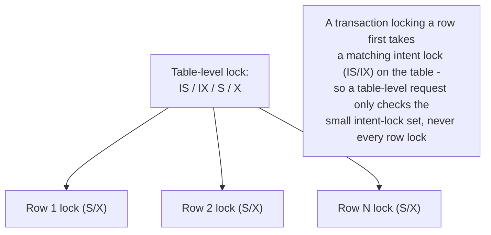
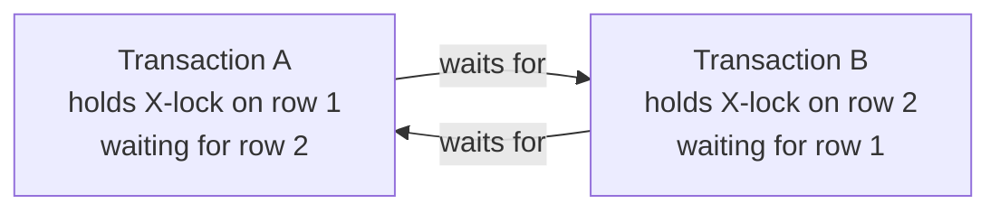

# Locking: Row/Table Granularity, Pessimistic vs Optimistic

_MVCC solved reader-vs-writer contention by never making a reader wait on a writer or vice versa - but it explicitly handed one problem back unsolved: writer-vs-writer contention on the same row, and range-based anomalies like phantoms, still need mutual exclusion. This topic is that other mechanism - the one MVCC-based engines still reach for, and the one some engines and some workloads use instead of MVCC entirely._

## Contents

- [What locking is, and why MVCC alone isn't enough](#what-locking-is-and-why-mvcc-alone-isnt-enough)
- [Lock modes: shared vs exclusive](#lock-modes-shared-vs-exclusive)
- [Lock granularity: row, page, table](#lock-granularity-row-page-table)
- [The intent-lock hierarchy: making coarse and fine locks coexist](#the-intent-lock-hierarchy-making-coarse-and-fine-locks-coexist)
- [Pessimistic locking: SELECT FOR UPDATE and two-phase locking](#pessimistic-locking-select-for-update-and-two-phase-locking)
- [Optimistic locking: version/timestamp checks at commit](#optimistic-locking-versiontimestamp-checks-at-commit)
- [Worked example: a classic deadlock, step by step](#worked-example-a-classic-deadlock-step-by-step)
- [Deadlocks: detection, prevention, and timeouts](#deadlocks-detection-prevention-and-timeouts)
- [Phantom prevention: gap locks and next-key locking](#phantom-prevention-gap-locks-and-next-key-locking)
- [Real engine specifics: InnoDB and PostgreSQL locking in practice](#real-engine-specifics-innodb-and-postgresql-locking-in-practice)
- [Trade-offs: pessimistic vs optimistic locking](#trade-offs-pessimistic-vs-optimistic-locking)
- [How this connects](#how-this-connects)
- [Check yourself](#check-yourself)

## What locking is, and why MVCC alone isn't enough

**Locking is a concurrency-control mechanism in which a transaction must acquire permission (a "lock") on a piece of data before operating on it, and other transactions requesting an incompatible permission on the same data must wait until it's released.** It is the pessimistic counterpart to MVCC's optimistic, version-based approach: instead of letting transactions proceed unimpeded and reconciling conflicts after the fact (MVCC's snapshot visibility test, or commit-time conflict detection), a lock manager prevents the conflicting access from happening at all, by making one side block.

The [previous topic](06-mvcc.md#mvcc-still-needs-locks-writer-writer-conflicts) already established the load-bearing fact that motivates this one: **MVCC eliminates only reader-vs-writer blocking.** It does nothing for two structurally different problems that locking is what actually solves in every mainstream engine, MVCC-based or not:

- **Writer-vs-writer contention on the same row.** Two transactions cannot both be allowed to compute the "next" version of the same logical row independently - one must find out about the other before proceeding. PostgreSQL and InnoDB both make the second writer **block** on a row-level lock, exactly as a pure lock-based system would, before applying MVCC's first-updater-wins or first-committer-wins resolution once the first writer resolves.
- **Phantom prevention via range/predicate locks.** A plain MVCC snapshot test only ever answers "is this specific row visible" - it has no way to lock "the set of rows that don't exist yet but would match this predicate," which is exactly what's needed to stop a concurrent `INSERT` from being invisible-then-visible across two reads of the same query. InnoDB closes this gap with **next-key locking** (below); this is a genuinely locking-based mechanism bolted onto an MVCC engine, not an MVCC mechanism at all.

So even a fully MVCC-based engine is, underneath, also running a **lock manager** at all times - just one whose scope is deliberately narrowed to the contention MVCC can't avoid. Some engines (older MySQL MyISAM, and any engine's `SERIALIZABLE` implemented via locking rather than conflict detection, covered below) instead use locking as the *primary* concurrency-control mechanism for reads too, not just writes - which is the "other way to control concurrent access" this topic is named for.

## Lock modes: shared vs exclusive

Every lock has a **mode**, and the two foundational modes exist because reads and writes have fundamentally different compatibility requirements:

- **Shared lock (S)** - held by a reader that wants to guarantee the data it read won't change underneath it before it's done. Multiple transactions can hold an S lock on the *same* object simultaneously - reads don't conflict with other reads.
- **Exclusive lock (X)** - held by a writer. An X lock is incompatible with *every* other lock on the same object, including another X and even an S - a writer must have sole access, because nothing else may see or act on data mid-write.

| Requested \ Held | S (shared) | X (exclusive) |
| --- | --- | --- |
| **S (shared)** | Granted (compatible) | Blocks |
| **X (exclusive)** | Blocks | Blocks |

This two-mode system is the minimum needed to express "readers can share, writers can't share with anyone" - the intent-lock hierarchy below extends it to let locks at *different granularities* coexist without every lock request needing to scan every finer-grained lock in the system.

## Lock granularity: row, page, table

**Granularity** is the size of the object a lock covers, and it is a direct trade-off between **concurrency** (finer granularity lets more unrelated transactions proceed at once) and **overhead** (finer granularity means more individual locks to track, check, and potentially escalate).

- **Row-level locking** - the finest common granularity: a lock covers exactly one row (InnoDB's row locks, PostgreSQL's tuple-level locks). Maximizes concurrency - two transactions updating two different rows in the same table never contend - at the cost of needing one lock-manager entry per locked row, which is real (if usually small) memory and CPU overhead per transaction, and means the engine must check row locks for every read/write instead of one lock for the whole object.
- **Page-level locking** - a lock covers an entire disk page (a fixed-size block, e.g. 8KB in PostgreSQL, 16KB in InnoDB) containing potentially many rows. Historically used to reduce per-row bookkeeping cost (older engines and some legacy systems used page locks as their finest granularity, `verify` exact historical engines), but it means two transactions updating two *unrelated* rows that happen to physically live on the same page still block each other - a form of **false contention** purely from physical layout, not logical conflict. Modern mainstream OLTP engines (InnoDB, PostgreSQL) do not use page-level locks as their transactional row-locking mechanism today; page-level locking survives mainly as a legacy/lower-tier concurrency mode in some engines and as an internal, non-transactional **latch** (a much shorter-held, non-queued mutex protecting a page's in-memory structure during a physical read/write, distinct from the transactional lock manager entirely, `verify` exact latch/lock terminology per engine).
- **Table-level locking** - a lock covers the entire table, blocking *every* row in it regardless of which rows are actually touched. Cheapest to track (one lock, not thousands), but it collapses concurrency to nothing for anything that needs the whole table exclusively. Real engines still use table-level locks deliberately for specific operations where row-level granularity wouldn't be safe or wouldn't help anyway: schema changes (`ALTER TABLE`), bulk loads, and certain maintenance operations (e.g. `TRUNCATE`, which physically deallocates the whole table and therefore needs to be certain nothing else is touching any row of it).

The engineering rule this trade-off produces: **default to the finest granularity that's still cheap enough to track, and reach for a coarser lock only when an operation's semantics genuinely require exclusivity over the whole object** - which is precisely the problem the intent-lock hierarchy exists to make efficient to check.

## The intent-lock hierarchy: making coarse and fine locks coexist

A hard problem falls out of mixing granularities in the same engine: if transaction A holds row-level X locks on 200 rows of a table, and transaction B wants a table-level X lock (say, to run `ALTER TABLE`), how does B's request get checked efficiently? Scanning all 200 of A's individual row locks on every coarse-lock request would be far too slow to do on every table-level lock attempt.

**Intent locks** solve this by requiring a transaction to announce its intent at the *coarser* level before it acquires a *finer* lock underneath it. A transaction that wants row-level locks inside a table must first take a matching intent lock on the table itself:

- **IS (Intent Shared)** - "I am about to (or already do) hold S locks on some rows within this table."
- **IX (Intent Exclusive)** - "I am about to (or already do) hold X locks on some rows within this table."
- **S / X** - the ordinary table-level shared/exclusive locks, unchanged in meaning.

Now a table-level lock request only ever has to check against the *small, fixed set* of intent/table locks other transactions hold at the table level - never against the (potentially huge) set of individual row locks - because any transaction holding a row-level S or X lock is, by construction, also holding the matching IS or IX at the table level:

| Requested \ Held | IS | IX | S | X |
| --- | --- | --- | --- | --- |
| **IS** | Grant | Grant | Grant | Block |
| **IX** | Grant | Grant | Block | Block |
| **S** | Grant | Block | Grant | Block |
| **X** | Block | Block | Block | Block |

Reading this matrix: two transactions can both hold IX on the same table at once (they're each free to X-lock *different* rows underneath), which is exactly what lets thousands of concurrent single-row writes proceed against the same table without ever fighting over a table-level lock - but the moment anyone requests an actual table-level **X** (e.g., `ALTER TABLE`), it correctly blocks against *any* IS/IX/S/X already held, because some other transaction is (or might be) mid-write on some row it doesn't know about yet.



Some engines add a fifth, composite mode - **SIX (Shared + Intent Exclusive)** - held by a transaction that scans and shares the whole table (S) while also planning to exclusively update a few specific rows within it (IX) - one lock instead of holding S and IX separately (`verify` exact engines exposing SIX by that name; PostgreSQL's own table lock-mode set, covered below, is a related but differently-named hierarchy). InnoDB implements exactly the IS/IX/S/X four-mode hierarchy described above at the table level, layered under its row-level record locks.

## Pessimistic locking: SELECT FOR UPDATE and two-phase locking

**Pessimistic locking** assumes conflicts are likely enough to be worth preventing outright: a transaction takes a lock *before* touching data, and holds it until the engine is sure no other transaction can invalidate its work.

- **`SELECT ... FOR UPDATE`** - the standard SQL mechanism for a read that also wants to prevent concurrent writers. An ordinary `SELECT` takes no lock at all in an MVCC engine (it just reads a snapshot); `SELECT ... FOR UPDATE` instead takes an **X (or InnoDB's equivalent) row lock** on every row it reads, so that any other transaction trying to update or delete those same rows must block until this transaction commits or rolls back. This is exactly the fix the [MVCC topic's write-skew example](06-mvcc.md#what-mvcc-does-and-doesnt-prevent) named but deferred: the on-call-doctors invariant can be made safe under plain Repeatable Read by having each transaction `SELECT ... FOR UPDATE` the rows its invariant depends on, forcing the second transaction to block until the first commits, rather than both reading a stale, pre-write snapshot independently. `SELECT ... FOR SHARE` (PostgreSQL) / `LOCK IN SHARE MODE` (older MySQL syntax) is the read-only equivalent - taking an S lock so the read row can't be modified by others but can still be read by others.
- **Two-Phase Locking (2PL)** - the classical, formally-provable protocol for achieving full serializability via locking, first formalized by Eswaran, Gray, Lorie, and Traiger (1976, `verify` exact citation). Every transaction is divided into exactly two phases:
  - **Growing phase** - the transaction may *acquire* new locks, but may never release any.
  - **Shrinking phase** - the transaction may *release* locks, but may never acquire any new ones.
  - The theorem 2PL rests on: if every transaction in a schedule obeys this rule, the resulting schedule is guaranteed to be **conflict-serializable** - equivalent to some serial ordering of the transactions. Note precisely what 2PL does *not* by itself claim: it says nothing about *when* locks are released relative to commit, only that acquisition and release never interleave within one transaction.
- **Strict 2PL** - the version essentially every real database actually implements: all locks (in practice, at minimum every *write/exclusive* lock) are held until the transaction **commits or aborts**, with none released early in a separate shrinking phase before that point. This closes a real gap plain 2PL leaves open: if Tx A released a lock early (technically still legal under plain 2PL, in its shrinking phase, as long as it acquires nothing new afterward) and Tx B then read or wrote the now-unlocked data and committed, but Tx A subsequently aborted, B's committed work would be based on data that logically never existed - a **cascading abort**, forcing B to be rolled back too, potentially cascading further. Strict 2PL prevents this structurally: nothing another transaction touched can have been released before the holder's own commit/abort is final, so there is never a window where a transaction's effects, still possibly-undoable, have already been read and acted on by a committed peer.

This is precisely the mechanism silently underneath every `SELECT ... FOR UPDATE`, every plain row-level write lock InnoDB/PostgreSQL take for ordinary `UPDATE`/`DELETE` statements, and every lock-based `SERIALIZABLE` implementation (MySQL's, covered below): acquire the lock the first time the row is touched, hold it, release everything only at commit/abort.

## Optimistic locking: version/timestamp checks at commit

**Optimistic locking** is a deliberately different bet from pessimistic locking: assume conflicts are *rare*, so don't pay any locking cost during the transaction at all - instead, check at the moment of writing whether the data changed since it was read, and reject the write if so.

Concretely, this is usually implemented at the **application/ORM layer**, not inside the database's own lock manager, using an explicit version or timestamp column:

```sql
-- Read (no lock taken):
SELECT id, name, price, version FROM products WHERE id = 42;
-- app reads: price = 19.99, version = 7
-- ... user thinks for 30 seconds, edits price in a form ...

-- Write, guarded by the version the row had when it was read:
UPDATE products
SET price = 21.99, version = version + 1
WHERE id = 42 AND version = 7;
-- If another transaction already updated this row (version is now 8, not 7),
-- this UPDATE matches zero rows. The application checks the affected-row count:
-- 0 rows updated => conflict detected => reject or retry, don't silently overwrite.
```

This is the exact pattern behind Hibernate/JPA's `@Version` annotation, ActiveRecord's optimistic locking, and Django's equivalent - all standard, named ORM features rather than a niche technique. **It is worth being precise about a distinction that's easy to blur:** MVCC's per-engine, internal version chains (xmin/xmax, undo logs) are also sometimes called "optimistic concurrency control" in textbooks, but that's the *database engine's own* internal mechanism for delivering snapshot reads without blocking. **Application-level "optimistic locking" (the version-column pattern above) is a separate, coarser technique layered on top**, typically used specifically to guard **long, human-paced read-modify-write cycles** - a user opening an edit form, thinking for a while, then saving - where holding an actual database row lock (pessimistic) for the entire time a person is looking at a screen would be a serious concurrency and connection-pool liability, but leaving the gap completely unguarded risks the **lost update** anomaly (the [previous topic's anomaly list](05-transactions-isolation-levels.md#the-anomalies-concurrent-transactions-can-produce) covers this by name): two edits of the same record silently overwriting each other with no error.

The trade-off this buys: no blocking and no held connection/lock resource during the "think time," at the cost of the losing transaction finding out about the conflict only at write time and having to handle it explicitly (retry the whole read-edit-write cycle, or surface a "someone else already changed this" error to the user) - there is no automatic serialization-failure-and-retry machinery the way PostgreSQL's SSI provides; the application itself must detect the zero-rows-affected case and decide what to do.

## Worked example: a classic deadlock, step by step

Two rows, `accounts` table, `id = 1` (balance 500) and `id = 2` (balance 300). Two transactions each need to touch *both* rows, but acquire their locks in **opposite order**:

```sql
-- Tx A                                          -- Tx B, concurrently
BEGIN;                                           BEGIN;
UPDATE accounts SET balance = balance - 50       UPDATE accounts SET balance = balance - 20
  WHERE id = 1;   -- Tx A now holds X lock on 1     WHERE id = 2;   -- Tx B now holds X lock on 2
                                                  
UPDATE accounts SET balance = balance + 50       UPDATE accounts SET balance = balance + 20
  WHERE id = 2;   -- BLOCKS: Tx B holds X on 2      WHERE id = 1;   -- BLOCKS: Tx A holds X on 1
```

At this point neither statement can ever complete: Tx A is waiting for a lock Tx B holds, and Tx B is waiting for a lock Tx A holds - a **circular wait**, the defining condition of a deadlock. Neither transaction will time out into progress on its own; something external must break the cycle.



This exact two-statement, opposite-order pattern is the textbook deadlock case and the single most common one seen in production: it typically arises not from a deliberately adversarial schedule, but from ordinary application code where two different code paths update the same two tables/rows in a different order (e.g., a "transfer" function that always debits-then-credits, racing against a "refund" function that credits-then-debits the same two accounts).

## Deadlocks: detection, prevention, and timeouts

A **deadlock** is any cycle of transactions each waiting for a lock held by the next one in the cycle, such that none can ever proceed without intervention. Formally, it requires all four **Coffman conditions** simultaneously: mutual exclusion (locks are exclusive), hold-and-wait (a transaction holds some locks while waiting for others), no preemption (a lock can't be forcibly taken from its holder), and circular wait (the cycle itself) - real database lock managers don't try to eliminate any of the first three (they're inherent to how locking must work), so they instead focus on detecting or preventing the fourth.

- **Detection via wait-for graph.** The lock manager maintains, conceptually, a directed graph where each node is a transaction and an edge `A -> B` means "A is blocked, waiting for a lock B currently holds." A **cycle** in this graph is a deadlock, by definition - and detecting one is exactly a graph cycle-detection problem. Real engines run this check either continuously (on every new lock wait) or periodically:
  - **InnoDB** builds and checks the wait-for graph as soon as a transaction is about to block on a lock (`innodb_deadlock_detect`, on by default); if a cycle is found, InnoDB immediately picks a **victim** - by default the transaction that has modified the fewest rows (cheapest to roll back) - and rolls it back with a deadlock error, letting the survivor proceed. At very high concurrency, continuously walking the wait-for graph on every lock wait becomes measurable overhead in its own right; MySQL documents disabling `innodb_deadlock_detect` as an option under heavy contention, relying instead on `innodb_lock_wait_timeout` (default **50 seconds**) so a stuck transaction eventually times out rather than being detected via graph analysis (`verify` exact recommended thresholds and current default, since tuning guidance has shifted across MySQL versions).
  - **PostgreSQL** takes a different default trade-off: rather than checking the wait-for graph on every single lock wait, it waits until a transaction has been blocked for **`deadlock_timeout`** (default **1 second**) before running the (comparatively expensive) cycle-detection check at all - a bet that most lock waits are ordinary, short contention that resolves on its own well before a second passes, and only the rare, genuinely-stuck cases are worth paying the graph-walk cost for. If a cycle is found, PostgreSQL aborts one transaction with a `deadlock_detected` error.
- **Prevention/avoidance, structurally.** The most effective fix is often not detection at all but eliminating the possibility of a cycle up front: **always acquire locks on multiple rows/tables in a single, consistent global order** (e.g., always lock the lower `id` first, regardless of which "direction" a transfer is logically going) - this alone makes a circular wait impossible, because every transaction that needs both locks will queue behind the same first-lock-holder rather than each grabbing a different one first. This is a pure application/schema-design discipline, not an engine feature, and it is the single most reliable production fix for the worked example above.
- **Timeout as a blunt fallback.** Any lock wait can also be bounded by a plain timeout (InnoDB's `innodb_lock_wait_timeout`, or an application-level statement timeout) independent of whether a true cycle exists - this is cruder than graph detection (it can abort a transaction that was merely slow, not actually deadlocked) but is cheap to implement and serves as a safety net even when deadlock detection is disabled or when the "deadlock" is really just one transaction taking pathologically long, e.g., waiting on a slow external call while holding a lock.
- **Timestamp-ordering avoidance schemes** (**wait-die** and **wound-wait**) are an alternative family that avoids building a wait-for graph at all, by assigning each transaction a timestamp at start and using it to decide, whenever a conflict is detected, whether the requester should wait or be forced to abort (younger transactions die/are wounded in favor of older ones, in a way that provably cannot cycle). These are more associated with distributed lock managers and older textbook treatments than with mainstream single-node relational engines today (`verify` current real-world usage); InnoDB and PostgreSQL both use detection, not avoidance, in practice.

## Phantom prevention: gap locks and next-key locking

Ordinary row locks only ever protect **rows that already exist** - they say nothing about the *space between* existing rows, which is exactly where a phantom `INSERT` sneaks in undetected. The [isolation-levels topic](05-transactions-isolation-levels.md#the-anomalies-concurrent-transactions-can-produce) named this precisely: preventing phantoms requires locking the **predicate/range itself**, not the rows a query happened to return.

- **Gap lock** - a lock on the *gap between* two consecutive index records (or before the first / after the last), rather than on any specific row. A gap lock doesn't block another transaction from locking or modifying the *existing* rows on either side of the gap - it only blocks another transaction from **inserting a new row into that gap**.
- **Next-key lock** - InnoDB's actual mechanism, defined as **a record lock on an index row, combined with a gap lock on the gap immediately before it** - together, this covers "this row, plus the range of values between it and the previous indexed value," closing exactly the space a phantom insert would otherwise slip into unnoticed. A locking read (`SELECT ... FOR UPDATE`, or any write) under InnoDB's Repeatable Read acquires next-key locks across the range it scans, which is precisely why (as the isolation-levels topic noted) InnoDB's Repeatable Read prevents more phantom scenarios in practice than the bare ANSI standard requires at that level - it's a locking mechanism doing work MVCC's snapshot alone can't.
- **Insert intention lock** - a special, narrower kind of gap lock that an `INSERT` takes just before inserting into a gap, specifically so that *multiple* concurrent inserts into different points within the *same* gap don't need to block each other (only inserts that would collide on the exact same value do) - without this refinement, ordinary gap locks alone would over-serialize unrelated concurrent inserts into the same range.
- **Predicate locking** (the general theoretical form, from early System R-era serializability research, `verify` exact origin) would lock the *condition itself* (`WHERE status = 'pending'`) so that anything matching it, present or future, is covered - but evaluating whether two arbitrary predicates could ever conflict is expensive in the general case, which is why real engines approximate it with **index-range locking** (next-key locks tied to a specific index's key order) rather than implementing literal predicate locks, and why phantom prevention is only as complete as the index the locking read actually uses to scan (a locking read that does a full table scan with no usable index may end up next-key-locking the *entire* table's index, a well-known InnoDB gotcha, `verify` exact scope in current versions).

## Real engine specifics: InnoDB and PostgreSQL locking in practice

- **InnoDB** implements the full stack described above: table-level **IS/IX/S/X** intent locks, row-level **record locks** (S/X on a specific index record), **gap locks**, and **next-key locks** (the record+gap combination used by default under Repeatable Read). `SELECT ... FOR UPDATE` and `SELECT ... FOR SHARE` are the explicit pessimistic-locking reads; ordinary `SELECT` remains a lock-free MVCC snapshot read. Deadlocks are detected via wait-for-graph analysis (`innodb_deadlock_detect`, default on) with a victim chosen by least-rows-modified, backstopped by `innodb_lock_wait_timeout` (default 50s). `SHOW ENGINE INNODB STATUS` surfaces the most recent detected deadlock, including both transactions' held/waited-for locks - the standard first tool reached for when diagnosing a production deadlock.
- **PostgreSQL** exposes a richer set of **row-level lock strengths** than the plain S/X model, introduced specifically to reduce false blocking between ordinary updates and foreign-key checks: `FOR UPDATE` (strongest - blocks all other lockers), `FOR NO KEY UPDATE` (taken automatically by an `UPDATE` that doesn't touch any column referenced by a foreign key or unique constraint - deliberately weaker so it doesn't unnecessarily block concurrent `FOR KEY SHARE` lockers), `FOR SHARE`, and `FOR KEY SHARE` (weakest - taken by foreign-key-check machinery, specifically so that concurrent updates to *unrelated* columns of a referenced row don't block a dependent foreign-key check unnecessarily). At the **table level**, PostgreSQL defines eight named lock modes forming its own compatibility hierarchy, from weakest to strongest: `ACCESS SHARE` (plain `SELECT`), `ROW SHARE` (`SELECT ... FOR UPDATE/SHARE`), `ROW EXCLUSIVE` (`UPDATE`/`DELETE`/`INSERT`), `SHARE UPDATE EXCLUSIVE` (`VACUUM`, `CREATE INDEX CONCURRENTLY` - deliberately weak enough to coexist with ordinary reads/writes, since these run in the background), `SHARE`, `SHARE ROW EXCLUSIVE`, `EXCLUSIVE`, and `ACCESS EXCLUSIVE` (`DROP TABLE`, most forms of `ALTER TABLE`, `TRUNCATE` - blocks everything, including plain reads). Deadlock detection runs after a lock has been waited on for `deadlock_timeout` (default 1s), aborting one transaction with a `deadlock_detected` error if a wait-for cycle is confirmed. PostgreSQL also maintains a separate, lower-level **latch/pin** mechanism protecting in-memory buffer pages during physical I/O - a much shorter-lived mutual-exclusion primitive than the transactional lock manager described in this document, and not something application code ever interacts with directly (`verify` precise latch terminology and scope, since it's an internal implementation detail rather than a documented user-facing feature).

## Trade-offs: pessimistic vs optimistic locking

| | Pessimistic locking (2PL, `SELECT ... FOR UPDATE`) | Optimistic locking (version/timestamp check) |
| --- | --- | --- |
| **When conflict cost is paid** | Upfront - blocks at the moment of contention | Late - only discovered at write time |
| **Best fit** | High-contention data, short transactions (financial ledgers, inventory decrement at checkout, seat allocation) | Low-contention data, long "think time" between read and write (form edits, collaborative documents) |
| **Failure mode under misuse** | Blocking, lock waits, and deadlocks if lock order isn't disciplined | Silent-looking but explicit conflict at write time - application must handle "0 rows affected" and retry/surface an error |
| **Resource held during wait** | An actual database lock (and often an open connection/transaction) for the whole hold duration | Nothing - no lock, no held connection, between read and write |
| **Where it typically lives** | Inside the database engine's own lock manager | Usually in the application/ORM layer (a version column), on top of whatever the database's own default locking/MVCC already does |
| **Interacts with isolation level** | Directly - 2PL is *how* lock-based `SERIALIZABLE` is achieved (MySQL's approach: converting reads into locking `S`-mode reads) | Independent of the database's isolation level - it's an application-level guard layered on top of whatever level is already in effect |

## How this connects

- **Back to MVCC** - this topic is the direct continuation of ["MVCC still needs locks"](06-mvcc.md#mvcc-still-needs-locks-writer-writer-conflicts): the writer-vs-writer blocking behavior described there, and `SELECT ... FOR UPDATE` (first introduced in the write-skew worked example), are exactly the locking mechanics detailed in full here.
- **Back to transactions and isolation levels** - MySQL's lock-based path to `SERIALIZABLE` (converting every plain read into a locking `S`-mode read, [named in that topic](05-transactions-isolation-levels.md#sql-standard-vs-how-real-engines-diverge)) is strict 2PL applied to every statement; PostgreSQL's `SERIALIZABLE` (SSI) instead detects conflicts optimistically on top of MVCC - the same two mechanisms this document and that one both describe, now shown as genuine engineering alternatives for reaching the identical named guarantee.
- **Forward to Indexing (B-tree, hash, LSM-tree)** - next-key locking is a lock taken on *ranges within a specific index's key ordering*; the mechanics of gap locking will make considerably more concrete sense once B-tree index structure (nodes, key ordering, leaf traversal) is covered as the next L2 topic.
- **Forward to the write-ahead log (WAL)** - lock acquisition/release itself isn't logged the way data changes are, but every write a lock protects still goes through the same WAL machinery covered under [Atomicity](04-acid.md#how-atomicity-is-actually-implemented) - locking and logging are complementary, not competing, mechanisms.
- **Forward to L3, Caching** - the version/timestamp-column pattern under optimistic locking reappears as one of the standard cache-invalidation strategies (an `ETag` or version number used to detect a stale cached copy is the same idea applied to a cache instead of a row).
- **Forward to L5, distributed systems theory** - single-node deadlock detection (wait-for graphs) generalizes, with real added difficulty, to **distributed deadlock detection** across multiple nodes holding locks on different machines, and to **distributed locking** (e.g., a lock service like Chubby/ZooKeeper, or Redis-based locks with fencing tokens) where "who holds the lock" itself becomes a consensus problem.
- **Forward to L12, scalability patterns** - lock contention on a single "hot" row (e.g., a popular product's inventory counter, a viral post's like-count) is exactly the **hot-key problem** L12 covers, and probabilistic/sharding techniques there exist specifically to reduce how often many transactions fight over one lock.

## Check yourself

- Two transactions each need to update rows 1 and 2, but Tx A locks 1-then-2 while Tx B locks 2-then-1. Walk through why this produces a deadlock, and give the one schema/application-level discipline that would prevent it structurally, without relying on the engine's deadlock detector at all.
- Explain, precisely, why plain 2PL (release locks whenever you like, as long as you never acquire after releasing) is not what any mainstream production engine actually implements - what specific anomaly does strict 2PL (hold everything until commit/abort) close that plain 2PL leaves open?
- A colleague says "our ORM's optimistic locking is basically the same thing as the database's MVCC." Explain precisely what's different: who implements each one, and what problem each one is actually solving.
- Why can't an ordinary row-level exclusive lock, by itself, prevent a phantom read? What does InnoDB's next-key lock add on top of a plain record lock to close that gap?
- PostgreSQL waits `deadlock_timeout` (default 1 second) before checking for a deadlock cycle, while InnoDB checks the wait-for graph as soon as a transaction blocks. What's the trade-off each default is making, and under what workload characteristic would you want to tune either one differently from its default?

