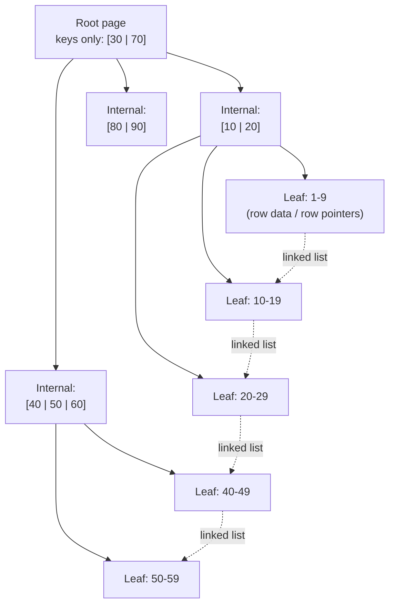
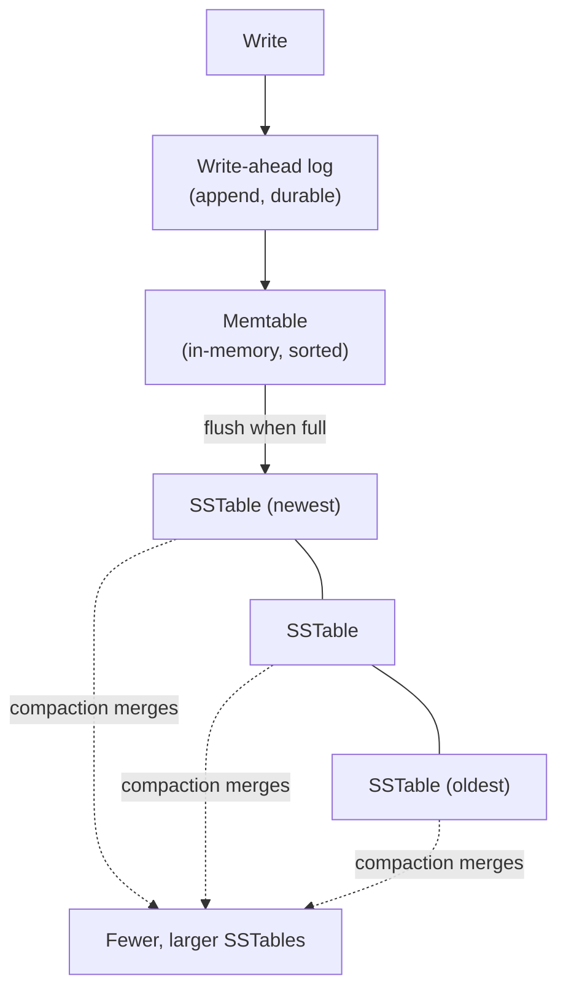

# Indexing: B-tree, Hash, LSM-tree

_Every topic so far in L2 has assumed a query can find the rows it needs. This is the topic where that assumption gets examined: without an index, "find the row where id = 42" means reading every row in the table, in order, until one matches. Indexing is the family of data structures that make that search fast - and, like every other mechanism in this level, it does so by making a deliberate trade-off, not by getting something for free._

## Contents

- [What an index is, and the trade-off it makes](#what-an-index-is-and-the-trade-off-it-makes)
- [B-tree indexes](#b-tree-indexes)
  - [Why a B-tree, not a binary tree, for disk-backed storage](#why-a-b-tree-not-a-binary-tree-for-disk-backed-storage)
  - [Structure: B+ tree, the variant every real engine actually uses](#structure-b-tree-the-variant-every-real-engine-actually-uses)
  - [Clustered vs non-clustered (secondary) indexes](#clustered-vs-non-clustered-secondary-indexes)
  - [Point lookups and range queries](#point-lookups-and-range-queries)
  - [Insert, delete, and rebalancing costs](#insert-delete-and-rebalancing-costs)
- [Hash indexes](#hash-indexes)
- [LSM-tree indexes](#lsm-tree-indexes)
  - [Structure: memtable, SSTables, compaction](#structure-memtable-sstables-compaction)
  - [Why LSM-trees are write-optimized](#why-lsm-trees-are-write-optimized)
  - [Read amplification, write amplification, space amplification](#read-amplification-write-amplification-space-amplification)
  - [How this connects to the write-ahead log](#how-this-connects-to-the-write-ahead-log)
- [Composite (multi-column) indexes and why column order matters](#composite-multi-column-indexes-and-why-column-order-matters)
- [Covering indexes](#covering-indexes)
- [Choosing an index type](#choosing-an-index-type)
- [How this connects](#how-this-connects)
- [Check yourself](#check-yourself)
- [Real-world & sources](#real-world--sources)

## What an index is, and the trade-off it makes

**An index is an auxiliary data structure, stored alongside a table, that maps values in one or more columns to the physical location of the rows that hold them - built specifically so a query can find matching rows without scanning every row in the table.** Without one, any lookup ("find the user with `email = 'a@b.com'`") degrades to a **full table scan**: read every page, check every row, discard the ones that don't match. For a table of 10 million rows, that's 10 million comparisons and (depending on how much fits in the buffer pool) potentially millions of disk reads, every single time the query runs.

An index fixes this by pre-sorting or pre-hashing the values of interest into a structure that can be searched in far fewer steps - a B-tree index on `email` turns "scan 10 million rows" into "read 3-4 pages," a difference of many orders of magnitude. But this speed is not free, and the cost it imposes is the single most important trade-off in this entire topic:

- **Reads get faster.** A query that filters, sorts, or joins on an indexed column can skip straight to the relevant rows instead of examining all of them.
- **Writes get slower.** Every `INSERT`, `UPDATE`, or `DELETE` that touches an indexed column must also update *every index* built on that column, not just the underlying table (the "heap," in engines that separate the two - see [clustered vs non-clustered](#clustered-vs-non-clustered-secondary-indexes) below). A table with five secondary indexes pays the write cost of maintaining six structures (the table itself plus five indexes) for every write that touches an indexed column.
- **Storage grows.** Each index is its own physical structure, occupying its own disk space - often a significant fraction of the base table's size, sometimes larger than the table itself for a wide composite index.

This is why indexing is a design decision, not a default: **index the columns your read patterns actually filter, join, or sort on, and no more** - an unused index is pure write-amplification and storage cost with no offsetting read benefit. Everything below is different ways of implementing that trade-off, each shaped for a different read/write balance.

## B-tree indexes

### Why a B-tree, not a binary tree, for disk-backed storage

A binary search tree gives O(log₂ N) lookups by halving the search space at every node - in memory, where visiting a node costs a few nanoseconds, that's an excellent trade. On disk, it's a poor one, for a reason that has nothing to do with the math and everything to do with hardware: **the dominant cost of a disk-backed lookup is not comparing keys, it's the number of separate disk pages fetched**, and a classic binary tree with millions of keys is dozens of levels deep, meaning dozens of separate (and, on a spinning disk, seek-bound) page reads per lookup.

A B-tree (and its near-universal real-world variant, the B+ tree, below) restructures the problem around that cost: instead of one key per node, **each node holds many keys and many child pointers - as many as fit in one disk page** (a **fixed-size storage engine block**, e.g. PostgreSQL's 8KB page, InnoDB's 16KB page). This is a direct application of a fact from [F's disks and filesystems topic](../F/f-computing-fundamentals.md#disks-and-filesystems): I/O happens in whole pages regardless of how much data within the page you actually need, so a structure that packs hundreds of keys into a single page turns "one comparison per level" into "hundreds of comparisons per level for the price of one disk read."

**Worked example - why this collapses tree height so dramatically:** take an InnoDB page (16 KB) holding index entries of a `BIGINT` key (8 bytes) plus a child-page pointer (6 bytes) plus per-entry overhead (`verify` exact InnoDB byte accounting, but ~15 bytes/entry is a standard approximation) - roughly **1,000 entries fit in one internal page**. A B+ tree with a branching factor (fanout) of 1,000 needs only:

| Tree height | Rows addressable (1000ʰ) |
| --- | --- |
| 1 level (root = leaf) | 1,000 |
| 2 levels | 1,000,000 |
| 3 levels | 1,000,000,000 |
| 4 levels | 1,000,000,000,000 |

A table with **one billion rows** needs a B+ tree only **3 levels deep** - meaning any point lookup costs at most 3-4 page reads (3 internal levels plus the leaf), almost all of which are cached in the buffer pool after the first access, regardless of whether the table has one million or one billion rows. This is the entire reason the structure exists: **minimize disk I/O by maximizing fanout per page**, which is precisely what a wide, shallow tree (a B-tree) does and a narrow, deep tree (a binary tree) does not.

### Structure: B+ tree, the variant every real engine actually uses

Nearly every production relational engine (InnoDB, PostgreSQL's default `btree` access method, SQL Server, Oracle) implements a **B+ tree**, a specific refinement of the classical B-tree with one structural difference that matters enormously in practice:

- **Internal (non-leaf) nodes store only keys and child pointers** - no row data - which is exactly what maximizes the fanout calculated above by keeping each internal-node entry as small as possible.
- **All actual data (or, for a secondary index, the pointer to the actual data) lives in the leaf nodes, and only in the leaf nodes.** A plain B-tree, by contrast, can store data in internal nodes too, which bounds how many keys fit per page and therefore reduces fanout.
- **Leaf nodes are linked together in a doubly-linked list, in sorted key order.** This is what makes range scans cheap (below): once a scan finds the starting leaf via a single top-down traversal, it walks sideways along the leaf-level linked list rather than re-traversing the tree for every subsequent row.



### Clustered vs non-clustered (secondary) indexes

This is where the "pointer to the actual data" in a leaf node becomes a genuinely consequential design choice, and the two major open-source engines make **opposite** choices:

- **Clustered index (InnoDB's default and only option for the primary key).** The table's rows are physically stored *in* the primary key's B+ tree - the leaf nodes of the PK index *are* the rows, in primary-key order. There is no separate "heap" file; the clustered index and the table are the same physical structure. This means a primary-key lookup is a single B+ tree traversal straight to the row data.
  - Every **secondary index** in InnoDB (any index that isn't the primary key) stores, at its leaf level, not a direct pointer to the row's physical location but **the primary key value** of the matching row. Looking up a row via a secondary index is therefore **two B+ tree traversals**: one down the secondary index to find the PK value, then a second down the clustered (PK) index using that value to fetch the actual row - a pattern InnoDB documentation and MySQL literature call a **bookmark lookup**. This is precisely the cost that [covering indexes](#covering-indexes) exist to eliminate.
- **Heap + non-clustered indexes (PostgreSQL's approach).** PostgreSQL stores every table as an unordered **heap** file, and every index - including one built on the primary key - is a separate structure whose leaves hold a **TID** (tuple identifier: page number + offset within the page) pointing at the row's physical location in the heap. There is no structural difference between a "primary key index" and any other index in PostgreSQL; the primary key is simply enforced via a unique index, exactly like any other unique constraint. (PostgreSQL's `CLUSTER` command can physically reorder the heap to match a chosen index's order **once, as a one-time maintenance operation** - but this ordering is not maintained automatically as new rows are inserted, unlike InnoDB's continuously-clustered PK.)

The practical consequence: in InnoDB, choosing a good primary key (see [insert costs](#insert-delete-and-rebalancing-costs) below) affects physical row layout and every secondary-index lookup's cost; in PostgreSQL, the choice of primary key has no equivalent physical-clustering effect by default.

### Point lookups and range queries

- **Point lookup** (`WHERE id = 42`): descend from the root, using the keys in each internal node to pick the one child pointer whose key range contains `42`, until a leaf is reached - exactly `tree height` page reads (3-4 for a billion-row table, per the worked example above).
- **Range query** (`WHERE created_at BETWEEN '2026-01-01' AND '2026-01-31'`): descend once to find the leaf containing the range's starting value, then **walk forward along the leaf-level linked list**, reading each subsequent leaf in sorted order, until a value past the range's end is reached. This is why the B+ tree's leaf-linked-list refinement matters so much in practice: a range scan touching 10,000 rows costs one top-down descent plus a sequential walk across however many leaf pages hold those 10,000 rows - not 10,000 independent tree descents.
- **Ordering "for free"**: because the leaves are already stored in sorted key order, `ORDER BY` on an indexed column can often be satisfied by simply walking the leaf chain, letting the engine skip an explicit sort step entirely - a detail that becomes directly relevant once query planning (a later L2 topic) is covered.

### Insert, delete, and rebalancing costs

- **Insert.** The engine descends to the correct leaf (same as a point lookup) and inserts the new key there. If the leaf has room, this is cheap - one page write. If the leaf is full, it **splits**: the leaf's contents are divided across two pages, and a new key/pointer pair is inserted into the parent to reference the new leaf - which can itself overflow and split, propagating upward. In the overwhelmingly common case this propagation stops after one or two levels, because a high-fanout tree (branching factor ~1,000, per the worked example) only needs a split to reach the root after roughly 1,000 leaf-level splits have happened directly under it; root splits, which increase the tree's height by one level, are correspondingly rare events.
- **Delete.** The engine descends to the leaf, removes the key. Classical B-tree theory calls for **merging** an under-full leaf with a sibling (or **borrowing** a key from one) to keep every node at least half full - but real engines are deliberately lazier than the textbook algorithm: InnoDB and most production B+ tree implementations tolerate leaves well below 50% full rather than merging on every delete, specifically to avoid **thrashing** - a table with alternating inserts and deletes near a page boundary would otherwise split then immediately merge then immediately split again, burning I/O on structural churn instead of actual data changes. Space is reclaimed later via background maintenance (`OPTIMIZE TABLE` in MySQL, `VACUUM`/`REINDEX` in PostgreSQL) rather than eagerly on every delete.
- **Insert order matters enormously for a clustered index.** Because InnoDB physically stores rows in primary-key order, a **monotonically increasing** primary key (an auto-increment integer, or a time-ordered key like UUIDv7) means every new row is appended to the **rightmost leaf** - a cheap, localized, mostly-sequential write pattern. A **random** primary key (a plain random UUIDv4, a hash) means each insert lands at an unpredictable point in the middle of the tree, forcing scattered page splits across many different leaves, poor buffer-pool locality (the "hot" page for the next insert is different every time), and a physically fragmented table over time. This is precisely why "don't use random UUIDs as a clustered primary key in InnoDB" is standard, widely-repeated MySQL performance guidance, and why time-ordered ID schemes (UUIDv7, Snowflake IDs, ULIDs) exist as a deliberate compromise: globally unique like a random UUID, but monotonic enough to preserve sequential-insert locality.

## Hash indexes

**A hash index maps a key to a bucket via a hash function, and stores in that bucket a pointer to the matching row(s)** - trading away everything a B-tree offers *except* equality lookup, in exchange for the best possible equality-lookup performance:

- **O(1) average-case lookup.** Compute `hash(key)`, jump directly to the corresponding bucket, done - no multi-level traversal at all, in contrast to a B-tree's O(log_B N).
- **Cannot support range queries, ordering, or prefix matching.** This is structural, not an implementation gap: a hash function is deliberately designed to scatter similar keys to unrelated buckets (that's what makes it a good hash function), so there is no way to ask "give me everything between X and Y" - values between X and Y could be in any bucket, in any order. `WHERE price > 100`, `ORDER BY name`, and `WHERE name LIKE 'Smith%'` are all impossible to satisfy efficiently with a hash index; they need a B-tree's sorted structure instead.
- **Collision handling.** Two distinct keys hashing to the same bucket is inevitable (pigeonhole principle, and unavoidable at scale even with a good hash function) - real implementations handle it either by **chaining** (each bucket holds a linked list of all entries that hashed there; lookup hashes to the bucket, then linearly scans the (hopefully short) chain for the exact key) or **open addressing** (on collision, probe a deterministic sequence of alternate buckets until an empty one or the matching key is found). PostgreSQL's `hash` index type uses buckets with **overflow pages** appended to a bucket that's collected more entries than fit in its primary page - conceptually a form of chaining at the page level.
- **In practice, used far less than B-tree indexes** inside mainstream relational engines: PostgreSQL's `hash` index exists and has been WAL-logged (crash-safe) since version 9.6/10, but a B-tree's equality-lookup performance is already close enough to O(1) in practice (3-4 page reads, mostly served from a warm buffer-pool cache) that few workloads pay the cost of maintaining a second index type purely to shave that difference, especially since it comes at the total loss of range/sort support. Hash indexing shows up more prominently in **pure key-value engines built around exactly this trade-off**: Bitcask (the storage engine behind Riak) keeps an **in-memory hash index** mapping every key directly to a byte offset in an on-disk append-only log file, giving O(1) reads at the cost of requiring the entire keyspace's index to fit in memory; Redis's core keyspace is itself a hash table (`dict`), which is exactly why Redis excels at key lookups and range-like operations (`ZRANGE` on a sorted set, `LRANGE` on a list) are handled by entirely separate data structures per type, not the top-level hash table.

## LSM-tree indexes

### Structure: memtable, SSTables, compaction

The **Log-Structured Merge-tree (LSM-tree)** starts from a different premise than a B-tree entirely: instead of finding the right page and updating it in place (which means a random disk write for every change), **buffer writes in memory and flush them to disk sequentially, resolving the "many small updates" problem later, as a background process, instead of on the write's critical path.**

- **Memtable.** All writes first go into an in-memory sorted structure (commonly a skip list or a balanced tree) called the **memtable**. Writes here are pure in-memory operations - fast, and already sorted by key, since the structure maintains sort order as entries are inserted.
- **SSTable (Sorted String Table).** Once the memtable reaches a size threshold, it is **flushed** to disk as an immutable, sorted file - an SSTable. "Immutable" is load-bearing: once written, an SSTable is never modified in place; it is only ever read from, and eventually deleted once compaction (below) has merged its contents elsewhere. A new, empty memtable takes over for subsequent writes.
- **Multiple SSTables accumulate over time**, each representing a batch of writes flushed at a different point in time, each internally sorted but with overlapping key ranges and possibly conflicting versions of the same key (an update, or a **tombstone** marking a delete) across different SSTables.
- **Compaction** is the background process that merges multiple SSTables into fewer, larger ones: it reads several sorted SSTables, merges them (an efficient operation precisely because each input is already sorted - a k-way merge), keeps only the newest version of each key, drops any key whose newest version is a tombstone past the point it's safe to discard, and writes the result out as new, larger SSTables, deleting the old ones.
  - **Size-tiered compaction** (Cassandra's historical default): merge SSTables of similar size together once enough of them accumulate, producing progressively larger tiers.
  - **Leveled compaction** (LevelDB's and RocksDB's default): organize SSTables into levels of exponentially increasing size (each level typically ~10x the previous, `verify` exact ratio is tunable), merging a level's SSTables into the next level once it exceeds its size budget - bounds how many SSTables a read must check (one per level, roughly) at the cost of more total rewriting during compaction.



### Why LSM-trees are write-optimized

A B-tree write means: find the correct leaf page (possibly several disk reads to traverse there if it isn't cached), modify it in place, write the modified page back - a **random** I/O pattern, since the "correct" page for any given key is wherever it happens to live on disk, unrelated to where the previous write went.

An LSM-tree write means: append to the WAL (sequential), insert into the in-memory memtable (no disk I/O at all), done. The random-write cost is deferred entirely to background compaction, which itself writes **sequentially** (merging sorted inputs into sorted output, streamed to disk start to finish) rather than doing random in-place updates. Sequential I/O is dramatically cheaper than random I/O on spinning disks (avoiding seek time) and meaningfully cheaper on SSDs too (better write amplification at the device/flash-translation-layer level, larger write batches). This is the entire reason LSM-trees are the default choice for **write-heavy workloads**: Cassandra, HBase, RocksDB, LevelDB, ScyllaDB, and Bigtable (the design LSM-trees were popularized from) are all built around this structure specifically to sustain very high write throughput.

### Read amplification, write amplification, space amplification

The write-optimization above is not free - it is paid for on the read side and in extra background I/O, and these three named costs are the standard vocabulary for that payment:

- **Read amplification** - a single logical read may require checking **multiple** physical structures: the memtable, then potentially every SSTable (from newest to oldest, since the newest version of a key wins), until the key is found or every SSTable has been checked. Without mitigation, a key that was written long ago and never touched since could require scanning through many SSTables to confirm it isn't in any of the newer ones. This is mitigated with a **Bloom filter** per SSTable - a compact probabilistic structure (covered in full in L12) that can say "this key is definitely not in this SSTable" with zero false negatives, letting a read skip SSTables that don't contain the key without an actual disk read, at the cost of occasionally saying "maybe present" for a key that turns out not to be there (a false positive, which just costs one wasted read, never an incorrect answer).
- **Write amplification** - the same logical write is physically written to disk multiple times over its lifetime: once on initial flush from the memtable, then again every time compaction merges the SSTable containing it into a new, larger one. Leveled compaction in particular can produce substantial write amplification - RocksDB deployments commonly cite figures in the **10-30x** range (`verify` exact figures, workload-dependent) - meaning 1 MB of logical writes can produce 10-30 MB of actual disk writes over the data's lifetime as it's repeatedly rewritten across levels.
- **Space amplification** - at any given moment, disk usage exceeds the logical data size, because obsolete versions of updated keys and not-yet-purged tombstones for deleted keys still physically occupy space until a future compaction pass reclaims them. A key updated 100 times before compaction runs occupies roughly 100x its logical size until compaction catches up.

This three-way trade-off (an LSM-tree favors write speed, at a cost paid in read amplification and background compaction I/O) is the mirror image of a B-tree's trade-off (favors stable, single-structure read/write cost, at the cost of in-place random writes) - which is exactly why storage-engine choice, the next L2 topic, is largely a choice between these two families for a given workload's read/write balance.

### How this connects to the write-ahead log

An LSM-tree's memtable is **not yet durable** - it lives in memory, and a crash before it's flushed to an SSTable would lose every write currently sitting in it. This is why every LSM-tree implementation pairs the memtable with a **write-ahead log**: each write is appended to the WAL (a simple, sequential, durable append) *before* or *alongside* being inserted into the memtable, exactly the same durability contract [ACID's atomicity/durability mechanics](04-acid.md#how-atomicity-is-actually-implemented) established for B-tree engines. On crash recovery, the engine replays the WAL to reconstruct whatever memtable contents hadn't yet been flushed to a durable SSTable - the WAL is what makes the memtable's in-memory speed safe rather than reckless. This is precisely the mechanism the next L2 topic (Write-ahead log) covers in full generality, since B-tree engines rely on an equivalent WAL for the identical reason (an in-place page modification in the buffer pool isn't durable until the WAL record for it is flushed), just applied to a different in-memory structure.

## Composite (multi-column) indexes and why column order matters

A **composite (multi-column) index** is a single B+ tree keyed on the **concatenation** of two or more columns, sorted first by the first column, then by the second column within each value of the first, and so on - `CREATE INDEX ON employees (last_name, first_name)` produces a tree ordered exactly like a phone book: all the `last_name = 'Adams'` entries together, sorted by `first_name` within that group, then all the `last_name = 'Baker'` entries, and so on.

This ordering produces the single most important rule for composite indexes, the **leftmost-prefix rule**: an index on `(a, b, c)` can efficiently serve a query that filters on `a` alone, on `a` and `b`, or on `a`, `b`, and `c` together - but **not** a query that filters on `b` alone or `c` alone, because skipping the leading column means the remaining columns aren't contiguously sorted with respect to each other; entries with `b = 5` are scattered across every distinct value of `a`, not grouped together anywhere in the tree.

**Worked example:**

```sql
CREATE INDEX idx_status_created ON orders (status, created_at);

-- Efficient - uses the full index: equality on the leading column,
-- range on the second, exactly the pattern a composite B+ tree is built for
SELECT * FROM orders WHERE status = 'pending' AND created_at > '2026-07-01';

-- Efficient - uses only the leading column, which is still a valid prefix
SELECT * FROM orders WHERE status = 'pending';

-- Cannot use idx_status_created at all - created_at isn't the leftmost column
SELECT * FROM orders WHERE created_at > '2026-07-01';
```

The corollary rule of thumb for choosing column order: **put equality-filtered columns before range-filtered columns.** Once the engine hits a range condition (`created_at > ...`) while descending the tree, every subsequent column in the composite key stops being usefully sorted for that query - within the range of matching `created_at` values, rows aren't grouped by any later column at all. So `(status, created_at)` lets the engine jump straight to all `pending` rows and then scan forward through them in `created_at` order (one efficient contiguous range); the reverse order `(created_at, status)` would force scanning every row in the date range and filtering `status` afterward, unable to use the index to narrow the search past the first range condition. A composite index can only ever apply **one** genuinely useful range condition, and it must be the last column actually used in the search.

## Covering indexes

**A covering index is an index that contains every column a query needs, so the engine can answer the query entirely from the index itself, never touching the underlying table (heap or clustered index) at all.** This directly eliminates the InnoDB **bookmark lookup** cost named [above](#clustered-vs-non-clustered-secondary-indexes): normally, a secondary-index lookup finds a primary-key value, then does a *second* traversal into the clustered index to fetch the actual row data - but if every column the query needs is already present in the secondary index's leaf entries, that second traversal is unnecessary.

```sql
-- Base index: leaf entries hold (email, <primary key>)
CREATE INDEX idx_email ON users (email);

-- Needs the bookmark lookup: name/created_at aren't in idx_email,
-- so after finding the PK via idx_email, InnoDB must fetch the full row
SELECT name, created_at FROM users WHERE email = 'a@b.com';

-- Covering index: leaf entries now also carry name and created_at,
-- so the query is answered from idx_email_covering alone
CREATE INDEX idx_email_covering ON users (email) INCLUDE (name, created_at);
SELECT name, created_at FROM users WHERE email = 'a@b.com';
```

PostgreSQL calls the resulting execution plan an **index-only scan**, and offers the `INCLUDE` clause specifically to add "payload" columns to an index's leaf entries without making them part of the sortable key itself (they're not usable for filtering or leftmost-prefix ordering, only carried along to avoid the heap fetch). The trade-off is the same one every index makes, amplified: a covering index is wider (more bytes per leaf entry, since it's carrying extra columns) and therefore costs more to store and more to maintain on every write that touches any of its columns - worth paying specifically for hot, read-heavy queries where eliminating the second lookup matters, not as a default habit for every index.

## Choosing an index type

| Workload characteristic | Right fit | Why |
| --- | --- | --- |
| General-purpose OLTP table: point lookups, range scans, sorting, joins | **B-tree** | The only structure of the three that supports range/order natively; this is why it's the default index type in essentially every relational engine |
| Pure equality lookup, no range/sort ever needed, extremely high lookup rate | **Hash** | O(1) average case beats B-tree's O(log_B N), though the practical gap is small once a B-tree is warm in cache - most engines don't bother unless it's a purpose-built KV store |
| Write-heavy, append-mostly workloads at large scale (time-series ingestion, event logging, IoT telemetry, wide-column stores) | **LSM-tree** | Converts random writes into sequential ones, sustaining far higher write throughput than in-place B-tree updates; pays for it in read amplification, mitigated with Bloom filters and compaction |
| Read-heavy, latency-sensitive point lookups where storage engine choice is fixed by the surrounding system (e.g. a relational engine already committed to InnoDB) | **B-tree**, plus a covering index on the hottest query shapes | Stable, predictable read cost; covering indexes remove the secondary-lookup tax on the queries that matter most |

The deeper point underneath this table: **this same B-tree-vs-LSM-tree choice is not just an index-level decision - it is the storage-engine-level decision**, since a storage engine's fundamental on-disk layout for the *entire table*, not just a supplementary index, is typically built around one structure or the other (InnoDB's tables are B+ trees; RocksDB-backed engines like MyRocks store tables as LSM-trees). That distinction, and engines (like WiredTiger) that support both, is exactly the next L2 topic.

## How this connects

- **Back to locking** - [gap locks and next-key locking](07-locking.md#phantom-prevention-gap-locks-and-next-key-locking) are locks taken on ranges *within a specific index's key ordering*; that mechanism now has a concrete structure to attach to - a gap lock locks the space between two adjacent leaf entries in exactly the B+ tree structure described here.
- **Back to MVCC and ACID** - the buffer pool pages an index lives in, and the WAL records protecting them, are the same machinery [ACID's durability](04-acid.md#how-atomicity-is-actually-implemented) and [MVCC's undo/version chains](06-mvcc.md) already rely on; an index update is itself a WAL-logged, atomic operation like any other write.
- **Forward to the write-ahead log** - covered here only as much as needed to explain memtable durability; the next topic covers WAL mechanics (log records, checkpointing, crash recovery, group commit) in full, for both B-tree and LSM engines.
- **Forward to storage engines** - B-tree vs LSM-tree, covered here at the index level, is the same decision restated at the whole-engine level (InnoDB vs MyRocks/RocksDB, WiredTiger's B-tree and LSM modes), plus how storage engines handle the rest of a table's physical layout beyond just indexing.
- **Forward to query planning and optimization** - which index (if any) the planner chooses for a given query, how it estimates whether an index scan beats a full table scan, and how composite-index column order interacts with the query planner's cost estimates, are all covered once table/index statistics are introduced.
- **Forward to L3, Caching** - the buffer pool that caches hot B-tree pages (keeping that 3-4-page-read cost mostly in memory rather than on disk) is a caching layer in exactly the sense L3 covers generally, just specific to page-structured storage.
- **Forward to L4, NoSQL and data at scale** - the LSM-tree, introduced here as an index structure, is also the storage foundation of entire database families: Cassandra, HBase, and ScyllaDB (wide-column stores) are LSM-trees end to end, not relational engines with an LSM index bolted on.
- **Forward to L12, scalability patterns** - Bloom filters, named here as the standard mitigation for LSM read amplification, are covered in full as one of L12's probabilistic structures (alongside HyperLogLog and Count-Min Sketch), reused across many systems beyond just LSM-tree reads.

## Check yourself

- A table has 1 billion rows and a B+ tree with branching factor ~1,000. Explain, in terms of disk I/O rather than big-O notation, why a point lookup costs about 3-4 page reads regardless of whether the table has 1 million or 1 billion rows.
- Why does InnoDB pay a "bookmark lookup" cost for secondary-index queries but not for primary-key queries? What does a covering index change about that cost?
- A colleague wants to use a random UUIDv4 as an InnoDB primary key. Explain, in terms of the B+ tree's physical structure, what this does to insert locality and page-split behavior - and what a time-ordered ID scheme (UUIDv7, Snowflake ID) changes about it.
- You have a composite index on `(customer_id, order_date)`. Explain why a query filtering only on `order_date` can't use this index, and why a query filtering on `customer_id` with a range on `order_date` can.
- Why is an LSM-tree write close to O(1) regardless of how large the dataset already is, while a naive in-place update on disk is not? What specific cost does the LSM-tree defer to later, and to which background process?
- A read against an LSM-tree-backed store might have to check the memtable and several SSTables before finding (or ruling out) a key. What structure is used to avoid an actual disk read for the SSTables that don't contain the key, and what kind of error can it produce (and in which direction) if it's wrong?

## Real-world & sources

**Stripe - zero-downtime index changes as a first-class engineering problem (fintech).** Stripe's open-source `pg-schema-diff` tool generates Postgres schema migrations specifically designed to avoid ever leaving a query unindexed or a table locked. For index changes it always uses `CREATE INDEX CONCURRENTLY` (a `SHARE UPDATE EXCLUSIVE` lock, so `INSERT`/`UPDATE`/`DELETE` keep flowing while the new index builds - unlike plain `CREATE INDEX`'s `SHARE` lock, which blocks writes for the build's full duration). When an index's *definition* changes (not just adding a new one), it does **online index replacement**: rename the old index to a temporary name, concurrently build the new index under the real name, then drop the old one only once the new one is live - so there is never a window where a hot query loses its backing index mid-migration. This is a direct, production-grade illustration of the B+ tree insert-cost material above: building or rebuilding a large index is expensive I/O, and doing it safely under live write traffic is itself a distinct engineering problem, not just "run `CREATE INDEX`."
Source: [stripe/pg-schema-diff (GitHub)](https://github.com/stripe/pg-schema-diff), fetched 2026-07-12.

**Uber - the InnoDB "bookmark lookup" as a deciding factor in choosing MySQL over Postgres.** Uber's engineering blog on migrating core services from Postgres to MySQL walks through exactly the clustered-vs-heap trade-off covered above: InnoDB's secondary indexes store the primary-key value (not a direct row pointer), so a secondary-index lookup costs two B+ tree traversals - "a slight disadvantage to Postgres when doing a secondary key lookup, since two indexes must be searched with InnoDB compared to just one for Postgres." Uber's counterpoint is the write side: because InnoDB secondary indexes point to a row via its primary key (a stable logical reference) rather than a physical location, an `UPDATE` only has to touch the indexes on the columns that actually changed, whereas Postgres, which stores a physical tuple identifier (TID) per index, must update every index pointing at a row whenever the row moves (e.g. on `UPDATE`, which in Postgres creates a new physical tuple version) - a real illustration of how the same clustered/heap distinction taught above cuts both ways depending on read vs. write mix.
Source: [Why Uber Engineering Switched from Postgres to MySQL](https://www.uber.com/en-US/blog/postgres-to-mysql-migration/), fetched 2026-07-12.

**Discord - LSM-tree compaction at trillion-row scale, and why they moved off Cassandra.** Discord's messages table grew from 12 Cassandra nodes (2017) to 177 nodes (early 2022) storing trillions of messages, and the LSM-tree's background compaction became an operational bottleneck: falling behind on compacting SSTables degraded read latency, and Discord's team routinely had to pull nodes out of traffic rotation ("gossip dance") just to let compaction catch up, compounded by JVM garbage-collection pauses. Migrating the storage engine to ScyllaDB (same LSM-tree/SSTable/compaction model as Cassandra, but a C++ implementation with no GC and a shard-per-core architecture that isolates hot partitions) cut p99 historical-message-fetch latency from 40-125ms to a steady 15ms and p99 insert latency from 5-70ms to a steady 5ms, while shrinking the cluster from 177 nodes to 72. This is a direct, at-scale illustration of the read/write/space-amplification trade-offs named above: the LSM-tree's write-friendliness is only sustainable if compaction keeps pace, and compaction scheduling/implementation quality - not just the abstract data structure - is what determined Discord's real-world latency.
Source: [How Discord Stores Trillions of Messages](https://discord.com/blog/how-discord-stores-trillions-of-messages), fetched 2026-07-12.

### Sources

- [stripe/pg-schema-diff (GitHub)](https://github.com/stripe/pg-schema-diff) - Stripe's zero-downtime Postgres schema/index migration tool.
- [Why Uber Engineering Switched from Postgres to MySQL](https://www.uber.com/en-US/blog/postgres-to-mysql-migration/) - Uber Engineering blog, on InnoDB clustered/secondary index trade-offs vs. Postgres.
- [How Discord Stores Trillions of Messages](https://discord.com/blog/how-discord-stores-trillions-of-messages) - Discord's official engineering blog, Cassandra-to-ScyllaDB LSM-tree/compaction migration with latency and node-count figures.
