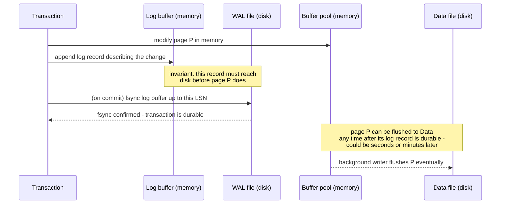
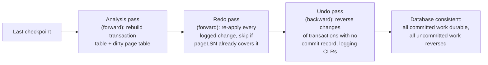

# Write-Ahead Log (WAL)

_ACID's Durability and Atomicity letters both named the write-ahead log as their shared mechanism, and the previous MVCC topic promised a later look at how version bookkeeping and the log interact - this topic makes good on both: what actually gets written to the log, in what order, how it is flushed to disk without stalling every transaction on its own private fsync, how a crash mid-write is recovered from without losing committed work or leaving half-finished work behind, and why nearly every serious storage engine (relational or not) is built around this exact idea._

## Contents

- [What a WAL is and why it exists](#what-a-wal-is-and-why-it-exists)
- [The write-ahead invariant, precisely](#the-write-ahead-invariant-precisely)
- [Log records and log sequence numbers (LSNs)](#log-records-and-log-sequence-numbers-lsns)
- [The log buffer, fsync, and group commit](#the-log-buffer-fsync-and-group-commit)
- [Steal and no-force: what the WAL buys the buffer pool](#steal-and-no-force-what-the-wal-buys-the-buffer-pool)
- [Checkpointing](#checkpointing)
- [Crash recovery: analysis, redo, undo (ARIES, at a high level)](#crash-recovery-analysis-redo-undo-aries-at-a-high-level)
- [Worked example: recovering from a crash, LSN by LSN](#worked-example-recovering-from-a-crash-lsn-by-lsn)
- [How the WAL interacts with MVCC and locking](#how-the-wal-interacts-with-mvcc-and-locking)
- [Trade-offs: durability vs latency, the WAL as a bottleneck, size and retention costs](#trade-offs-durability-vs-latency-the-wal-as-a-bottleneck-size-and-retention-costs)
- [The WAL as a replication stream](#the-wal-as-a-replication-stream)
- [How this connects](#how-this-connects)
- [Real-world & sources](#real-world--sources)
- [Check yourself](#check-yourself)

## What a WAL is and why it exists

**A write-ahead log (WAL) is an append-only, sequential, durable record of every change a database makes, written *before* the corresponding change is applied to the actual data pages on disk.** [ACID's Atomicity section](04-acid.md#how-atomicity-is-actually-implemented) already named the rule this enforces - "before a data page in memory is ever flushed to disk, the log record describing that change must already be durably written to the log first" - and [Durability](04-acid.md#durability-once-committed-it-survives-a-crash) already named the reason: an engine won't tell a client "committed" until the commit's log record has been forced to stable storage. This topic is what sits underneath both of those statements: the concrete record format, how the log is buffered and flushed without paying one disk fsync per write, how a crash is actually recovered from, and how the log interacts with the buffer pool, MVCC, and locking machinery already covered.

The problem the WAL solves has a name every storage engine shares: **a data page is large, and modifying it is not atomic with respect to a crash.** A B+ tree page (8 KB in PostgreSQL, 16 KB in InnoDB, per [indexing](08-indexing.md#why-a-b-tree-not-a-binary-tree-for-disk-backed-storage)) might be updated in place by a transaction, and the machine can lose power, the process can be killed, or the storage device can only guarantee a smaller atomic write unit (a 512-byte or 4 KB sector) than the page itself - any of which can leave that page **torn**: partially old, partially new, internally inconsistent, on disk. Without a separate record of *what was being done* to that page, there is no way to know, after a crash, whether the page reflects a completed change, a half-completed change, or a change that should never have happened at all (because the transaction that made it never committed). The WAL exists to answer exactly that question during recovery: a small, sequential, append-only log record is far cheaper to make durable and far easier to reason about than the large, randomly-located, in-place page it describes.

## The write-ahead invariant, precisely

Stated most precisely, the invariant is: **a log record describing a change to page P must be durable (on stable storage) before page P itself, carrying that change, is allowed to reach stable storage.** This is a partial order, not a strict "log everything first, then ever write pages" rule - pages are still written back to disk lazily, in the background, on the engine's own schedule (this is exactly the **steal** policy [below](#steal-and-no-force-what-the-wal-buys-the-buffer-pool)); the invariant only constrains the *relative* order of a specific log record versus the specific page it describes, nothing more.



This ordering is what makes recovery possible in the first place: if a crash happens after the log record is durable but before the data page is flushed, recovery can **redo** the change from the log. If a crash happens before the log record itself is durable, the change was never really "in flight" as far as the durable record is concerned, so there's nothing to redo *or* undo - it simply never happened, exactly as if the write had never been issued.

## Log records and log sequence numbers (LSNs)

Every entry appended to the log is a **log record**, and every log record is identified by a **log sequence number (LSN)** - a monotonically increasing value (PostgreSQL uses a 64-bit byte offset into the logical WAL stream, formatted for display as two hex numbers like `16/B374D848`; InnoDB uses a similarly monotonic 64-bit byte-offset LSN) that plays two distinct roles:

- **It orders the log.** Because the LSN is exactly the byte position a record occupies in the append-only stream, "LSN 100 happened before LSN 200" is not an inference from a timestamp or a counter that could theoretically be reordered - it is a direct statement about physical position in a file that is only ever appended to.
- **It tags data pages, tying them back to the log.** Every data page, in nearly all WAL-based engines, carries its own hidden field recording the LSN of the *last* log record that modified it - conventionally called the **pageLSN**. This single field is what lets recovery answer, page by page, "does this page already reflect this log record, or not?" without re-applying a change that's already present (which for a non-idempotent operation, like "append this value to a list," would corrupt the page) - a comparison used constantly during the redo phase [below](#crash-recovery-analysis-redo-undo-aries-at-a-high-level).

A log record itself is a small, structured entry - conceptually similar across engines, though exact binary layouts differ:

```text
LSN: 1042
Type: UPDATE
Transaction ID: 501
Page ID: (relation=accounts, block=17)
Before-image (undo data): balance = 500
After-image (redo data): balance = 400
Prev LSN (this transaction's previous log record): 1030
```

Real engines log more record *kinds* than a single generic "UPDATE," each describing a specific operation: page inserts/deletes/updates, index-structure changes (a B+ tree page split is itself logged, since it changes multiple pages atomically from the tree's point of view), transaction begin/commit/abort records, and - specific to recovery, [below](#crash-recovery-analysis-redo-undo-aries-at-a-high-level) - **compensation log records (CLRs)**, which record the *undoing* of an earlier record so that undo itself never needs to be redone from scratch if a second crash interrupts recovery.

A closely related, easily-confused mechanism deserves a name here because it protects against exactly the "torn page" scenario named above: **full-page writes** (PostgreSQL's `full_page_writes`, on by default; InnoDB has an analogous **doublewrite buffer**). The *first* time a page is modified after a checkpoint, the engine writes the page's **entire contents**, not just the changed bytes, into the WAL. This looks wasteful, but it exists for a precise reason: a partial (torn) write to that page, caused by a crash mid-write, can otherwise leave the page in a state where even the log's before/after-image deltas can't reconstruct a valid page, because the delta assumes a known-good starting point that a torn write has destroyed. A full-page image in the log gives recovery an unambiguous, complete replacement for that page, sidestepping the torn-page problem entirely, at the cost of a WAL volume spike right after every checkpoint (the first touch to each hot page re-logs the whole page again).

## The log buffer, fsync, and group commit

Log records are not written to disk one at a time as they're generated - they are first appended to an **in-memory log buffer**, and only forced to stable storage (`fsync`, or the storage-engine-specific equivalent syscall) at specific, deliberate points, the most important of which is **commit**: a transaction is not acknowledged as committed until its commit record - and everything before it in the log, by the append-only ordering - has been fsynced.

[Durability](04-acid.md#durability-once-committed-it-survives-a-crash) already named **group commit** as the fix for the obvious problem this creates (one physical disk flush per commit is expensive, and a busy system commits constantly) - the mechanism deserves its full mechanics here:

- A transaction ready to commit appends its commit record to the shared log buffer and then **waits**, rather than immediately issuing its own `fsync`.
- The engine (or the first transaction to arrive) triggers a single `fsync` that flushes the log buffer **up to whatever LSN is currently at its tail** - which, if several other transactions committed in the same narrow window, includes all of their commit records too.
- Every transaction whose commit record was covered by that one `fsync` is released as committed **simultaneously**, having paid for a fraction of one flush instead of a whole flush each.

The trade-off group commit makes explicit: a single transaction with no concurrent commits pays the *same* latency as without batching (nothing to batch with) - but under concurrent load, throughput rises sharply because the number of physical flushes stops scaling with the number of committing transactions and instead scales with how many can be grouped per flush window. This is precisely why commit latency in a WAL-based engine is highly load-dependent: a lightly loaded system sees each commit pay a full fsync's latency (commonly single-digit milliseconds on a spinning disk, sub-millisecond to low single-digit milliseconds on an SSD with a capacitor-backed write cache, `verify` exact figures are hardware-dependent), while a heavily loaded system amortizes that same fsync cost across dozens or hundreds of simultaneously-committing transactions, and per-transaction commit overhead effectively drops.

Both major open-source engines expose an explicit knob for trading durability against this exact cost, because not every workload needs every commit to survive an OS crash: PostgreSQL's `synchronous_commit = off` and MySQL's `innodb_flush_log_at_trx_commit = 0` or `2` skip or delay the fsync, acknowledging commit as soon as the record is in the log buffer (or handed to the OS's own write cache) rather than durably on disk - trading "a crash in the last ~1 second could lose a handful of recently-committed transactions" for materially higher commit throughput, a trade-off some workloads (high-volume analytics ingestion, non-financial event logging) accept deliberately and financial-transaction workloads virtually never do.

## Steal and no-force: what the WAL buys the buffer pool

This is the piece that ties the WAL directly back to buffer-pool management, and it's worth naming explicitly because it's the textbook (and ARIES) framing of exactly why the write-ahead rule matters as much as it does. A buffer-pool policy is described along two independent axes:

- **Steal / no-steal** - may an uncommitted transaction's dirty page be written to disk before that transaction commits? A **no-steal** policy forbids this (simple, but forces every dirty page a long transaction touches to stay pinned in memory until commit - impractical for transactions that touch more data than fits in RAM). A **steal** policy allows it.
- **Force / no-force** - must every page a transaction touched be flushed to disk *before* the transaction is allowed to commit? A **force** policy requires this (guarantees durability trivially, but makes every commit pay for however many random page writes that transaction touched - often the majority of a transaction's total I/O cost). A **no-force** policy does not require it.

Nearly every real engine (PostgreSQL, InnoDB, and the ARIES design they both descend from) chooses **steal + no-force** - the combination that gives the *best* performance (dirty pages can be written back opportunistically whenever convenient, and commit never has to wait on data-page I/O) but also, without something else in place, the *worst* correctness properties: steal means an uncommitted change might already be sitting on disk when the transaction aborts (needs **undo**), and no-force means a committed change might *not yet* be on disk when the machine crashes (needs **redo**). **The WAL is precisely what makes steal + no-force safe**: because every change is durably logged before or alongside being applied, both problems reduce to "replay the log correctly during recovery" rather than "never allow the risky scenario to occur in the first place." This is the direct, mechanical reason the write-ahead log exists as a distinct subsystem rather than being folded into simpler buffer-pool rules: it is specifically what lets the buffer pool behave as freely (steal, no-force) as it does, which is also exactly why atomicity and durability - the two guarantees steal/no-force respectively puts at risk - are the two ACID letters implemented by this one shared mechanism, as [ACID's own explanation](04-acid.md#why-atomicity-and-durability-share-the-same-machinery) already stated.

## Checkpointing

If recovery always had to replay the *entire* log from the very beginning of the database's history, recovery time would grow without bound as the database aged - clearly untenable. A **checkpoint** exists to bound this: it is a periodic operation that records "everything logged before this point has been durably applied to disk (or is provably not needed for redo anymore)," giving recovery a safe, much more recent starting point instead of the log's true beginning.

Real engines use a **fuzzy checkpoint** (not a stop-the-world one): rather than pausing all activity, flushing every dirty page, and then declaring "checkpoint complete," a fuzzy checkpoint:

1. Notes the current LSN (or the oldest LSN still needed by any not-yet-flushed dirty page) as the **checkpoint's redo point**.
2. Begins flushing currently-dirty buffer-pool pages to disk in the background, **without blocking new transactions** from continuing to read, write, and generate new log records concurrently.
3. Once that flush completes, writes a **checkpoint record** to the log, which recovery can later use as its starting point: nothing before the recorded redo point can still be un-flushed, so redo never needs to look earlier than that.

This is a direct trade-off, not a free bound: checkpointing more **frequently** shortens potential recovery time (less log to replay after a crash) but costs more background I/O and can produce latency spikes as a burst of dirty pages gets flushed; checkpointing less frequently reduces that background I/O cost but means a crash has to redo further back in the log, and means the WAL itself must be **retained on disk for longer** (nothing before the oldest still-needed checkpoint's redo point can be safely deleted) - directly inflating disk usage. PostgreSQL exposes this trade-off through `checkpoint_timeout` (time-based trigger) and `max_wal_size` (size-based trigger, "checkpoint once this much WAL has accumulated since the last one"); InnoDB's analogous knobs govern its redo log file size and checkpoint age.

## Crash recovery: analysis, redo, undo (ARIES, at a high level)

[ACID's Atomicity section](04-acid.md#why-atomicity-and-durability-share-the-same-machinery) already named the sequence - "redo everything, then undo whatever wasn't committed" - as the ARIES design (Mohan et al., IBM Research, the algorithm nearly every modern engine's recovery logic descends from, `verify` exact lineage per engine). At the level this topic covers, recovery runs in three distinct passes over the log, starting from the most recent checkpoint:

- **Analysis.** Scan forward from the checkpoint record to the end of the log (the point the crash interrupted), reconstructing two pieces of bookkeeping purely from what the log records say happened: the **transaction table** (which transactions were still active - neither committed nor aborted - at the moment of the crash) and the **dirty page table** (which pages might have had unflushed changes, and the earliest LSN each one needs for correct redo). Nothing is applied to data yet in this pass - it's purely reconstructing "what was going on" from the log's own record of it.
- **Redo.** Starting from the earliest LSN the dirty page table says is needed, replay the log **forward**, re-applying every logged change - for *every* transaction, committed or not, this is the "repeating history" idea ARIES is known for, and it's deliberately indiscriminate: it is cheaper and simpler to redo everything and then undo the losers than to first figure out which transactions committed and selectively redo only those. For each record, the pageLSN check named [above](#log-records-and-log-sequence-numbers-lsns) decides whether re-applying is even necessary: if the page's on-disk pageLSN is already `>=` the log record's LSN, that change is already durably reflected on the page (it was flushed before the crash) and redoing it would double-apply a non-idempotent operation - so it's skipped. If the page's pageLSN is older, the record's change is re-applied and the page's pageLSN is advanced to match.
- **Undo.** After redo, the database is back to *exactly* the state it was in at the instant of the crash - including the effects of transactions that never committed. The undo pass now walks the log **backward**, for every transaction the analysis pass found still-active (i.e., a "loser" - it never got to write a commit record), reversing its changes using the before-images stored in its log records - the same undo-logging idea [ACID already introduced](04-acid.md#how-atomicity-is-actually-implemented). Every undo action is itself logged as a **compensation log record (CLR)**, specifically so that if a *second* crash interrupts recovery mid-undo, the next recovery attempt's redo pass will redo the undo actions already performed (via their CLRs) rather than risk re-undoing an already-reversed change - recovery itself is crash-safe, recursively, by the same logging discipline it's applying to ordinary transactions.



## Worked example: recovering from a crash, LSN by LSN

A simplified log fragment, with the crash occurring right after LSN 1042:

```text
LSN 1000  CHECKPOINT (redo point)
LSN 1010  BEGIN   txn 501
LSN 1020  UPDATE  txn 501, page P1, balance 500 -> 400
LSN 1030  BEGIN   txn 502
LSN 1035  UPDATE  txn 502, page P2, status 'pending' -> 'shipped'
LSN 1040  COMMIT  txn 502
LSN 1042  UPDATE  txn 501, page P3, balance 200 -> 300
--- CRASH ---
```

**Analysis** scans 1000 -> 1042 and concludes: txn 502 committed (has a COMMIT record) - a **winner**. Txn 501 has no COMMIT record - a **loser**. Dirty page table: P1, P2, P3 all potentially unflushed.

**Redo** replays 1010 -> 1042 forward, for *both* transactions, regardless of the fact that 501 will be undone a moment later: P1's balance is set to 400, P2's status is set to `'shipped'`, P3's balance is set to 300 - each conditioned on the pageLSN check (if, say, P2 had already been flushed to disk with pageLSN >= 1035 before the crash, that specific redo is skipped as already-applied). After redo, the database - transiently - shows txn 501's half-finished transfer as if it had happened, exactly matching the state at the instant of the crash.

**Undo** now walks backward specifically for txn 501 (the only loser): reverses LSN 1042 (P3's balance 300 -> 200, using the before-image logged there) and LSN 1020 (P1's balance 400 -> 500), each reversal itself written as a CLR. Txn 502's changes are never touched by undo - it committed, so nothing about it is a candidate for reversal.

**End result:** P1 = 500, P2 = `'shipped'`, P3 = 200 - txn 502's committed shipment update survives the crash intact (Durability), and txn 501's half-finished transfer is fully reversed, as if it had never been attempted (Atomicity) - the exact worked example [ACID's own bank-transfer scenario](04-acid.md#worked-example-a-bank-transfer-and-what-breaks-without-each-letter) described in outcome, now shown as the specific log-record-level mechanism that produces it.

## How the WAL interacts with MVCC and locking

- **MVCC's version-creating writes are themselves WAL records, not a separate mechanism.** [MVCC's two implementations](06-mvcc.md#two-physical-implementations-postgresql-vs-mysqlinnodb) both produce changes that must survive a crash exactly like any other write: PostgreSQL's "insert a new tuple version, stamp the old one's `xmax`" is logged as ordinary heap-insert/heap-update WAL records (protected by the same full-page-write mechanism on first touch after a checkpoint); InnoDB's "update in place, push the prior image to the undo log" logs *both* the in-place page change *and* the undo-log page's own growth through its redo log, since the undo log itself lives in pages that need the identical torn-page and crash-recovery protection as any other data page. There is no separate "MVCC log" - version bookkeeping rides on the same write-ahead machinery as every other change, which is exactly why recovering a crashed InnoDB instance also correctly restores its undo-log chains (needed for any transaction whose snapshot still requires an older version) rather than just its current-row values.
- **Locks are never logged, and don't need to be.** [Locking's own "how this connects" note](07-locking.md#how-this-connects) already flagged this: lock acquisition and release are purely in-memory, ephemeral bookkeeping inside the lock manager. This is a deliberate, not incidental, omission - a lock's entire purpose is to coordinate *currently running* transactions, and after a crash there are no currently running transactions left to coordinate; every transaction that was active is, by the recovery process above, either fully redone-then-confirmed-committed or fully undone-as-a-loser. Recovery reconstructs exactly the data state a correct lock schedule would have produced, without ever needing to know what the lock manager's internal queue looked like at the moment of the crash.
- **The recovery-time transaction table (Analysis pass) plays the same role MVCC's snapshot bookkeeping plays live.** Both are answering a structurally similar question - "which transactions are committed and which are not, as of a given point" - one live, using xmin/xmax and in-progress-transaction sets ([per MVCC's visibility test](06-mvcc.md#visibility-rules-xminxmax-and-the-snapshot-test)), the other reconstructed from a cold log after a crash. Neither needs the other's data structures directly, but they're solving the same underlying problem: distinguishing "this write is real and permanent" from "this write should be treated as if it never happened."

## Trade-offs: durability vs latency, the WAL as a bottleneck, size and retention costs

| Dimension | What the WAL costs | What it buys | The lever |
| --- | --- | --- | --- |
| **Commit latency** | Every commit waits on at least one `fsync` (or a shared one, via group commit) | Durability that survives a process crash and, with `fsync`, an OS crash | Group commit batches concurrent commits into fewer flushes; `synchronous_commit=off` / `innodb_flush_log_at_trx_commit != 1` skip the wait entirely, at the cost of a small window of possible data loss on crash |
| **Throughput ceiling** | The log is fundamentally a **single, ordered, append-only stream** - every transaction's commit record must be assigned a position in that one stream, which structurally serializes at least the log-append step across all concurrent writers | A total order over all changes, which is exactly what makes deterministic, repeatable recovery possible | Group commit and a well-tuned log buffer reduce, but don't eliminate, this serialization point; it's a commonly cited reason a single Postgres/MySQL primary has a hard write-throughput ceiling regardless of CPU/RAM headroom elsewhere in the system |
| **Disk space / retention** | WAL segments can't be deleted until a checkpoint proves they're no longer needed for crash recovery **and** no replica or replication slot still needs them | Bounded recovery time, and a replayable stream for replicas ([below](#the-wal-as-a-replication-stream)) | Tuning `max_wal_size`/`checkpoint_timeout` more aggressively; monitoring replication slots so a disconnected/lagging replica doesn't pin WAL retention indefinitely - an operationally real failure mode: an inactive PostgreSQL replication slot can fill the primary's disk with retained WAL it's obligated to keep |
| **Checkpoint I/O** | Flushing accumulated dirty pages produces a background I/O burst, and the first write to each page after a checkpoint re-logs a full-page image, spiking WAL volume | Bounds recovery time to "since the last checkpoint," not "since the database was created" | More frequent checkpoints trade steady, smaller I/O costs for shorter recovery; less frequent checkpoints trade a longer worst-case recovery for less overall background I/O |

## The WAL as a replication stream

Because the WAL is already a complete, ordered, replayable record of every physical change made to the database, the most natural way to keep a **replica** in sync is to simply **ship it the same log bytes and let it run the identical redo logic, continuously, forever** rather than stopping at the most recent checkpoint the way crash recovery does. PostgreSQL's **physical (streaming) replication** works exactly this way: a replica connects to the primary, requests WAL starting from a given LSN, and applies each incoming record via the same redo machinery [described above](#crash-recovery-analysis-redo-undo-aries-at-a-high-level) - a replica is, in a real sense, a process perpetually replaying redo against a stream that never ends. **Replication slots** are the mechanism that ties this back to the retention trade-off just discussed: a slot tells the primary "don't recycle any WAL past this LSN until my replica has consumed it," which guarantees a replica can never fall permanently out of sync for lack of the WAL bytes it needs - but is precisely why a replica that goes offline for an extended period, while its slot remains registered, can grow the primary's retained WAL without bound and fill its disk.

MySQL splits this into two genuinely separate logs, a distinction worth being precise about since it's a common source of confusion: the **InnoDB redo log** is the physical, page-level WAL this entire topic has described, used purely for crash recovery within one instance; the **binary log (binlog)** is a *separate*, logical (statement- or row-based) log used specifically for replication and point-in-time recovery, and is not what a replica replays against for InnoDB's own crash-recovery purposes. Because these are two independent logs recording the same underlying transaction, MySQL runs an internal **two-phase commit between the InnoDB redo log and the binlog** specifically so a crash between "redo log says committed" and "binlog says committed" can't leave the two disagreeing about what actually happened - a direct, concrete illustration of why keeping two logs consistent with each other is itself a distinct engineering problem, not an automatic consequence of each log independently working correctly.

The same "ship the log, replay it elsewhere" idea, generalized past physical page-level records into a decoded, logical stream of row-level changes, is exactly what **change data capture (CDC)** tools (Debezium reading MySQL's binlog or PostgreSQL's logical replication slots) are built on, and what PostgreSQL's `wal_level = logical` setting exists to support - a forward pointer worth naming here even though CDC itself is covered in later material, since the mechanism underneath it is the same log this topic has fully explained.

## How this connects

- **Back to ACID** - this topic is the full mechanical detail behind [Atomicity's write-ahead rule and undo logging](04-acid.md#how-atomicity-is-actually-implemented) and [Durability's fsync-before-acknowledgment rule and group commit](04-acid.md#durability-once-committed-it-survives-a-crash), including the ARIES redo/undo sequence [both letters share](04-acid.md#why-atomicity-and-durability-share-the-same-machinery).
- **Back to MVCC** - delivers on [MVCC's own forward reference](06-mvcc.md#how-this-connects) to "how the log record format and checkpointing interact with MVCC's version bookkeeping": both PostgreSQL's new-tuple-version writes and InnoDB's undo-log writes are ordinary WAL records, protected and recovered by the identical machinery as any other page change.
- **Back to Locking** - confirms [locking's own note](07-locking.md#how-this-connects) that lock state is never logged, and explains precisely why that omission is safe: recovery reconstructs the only thing that matters (committed vs. uncommitted data state), never needing to know what any lock manager's queue looked like at crash time.
- **Back to Indexing** - a B+ tree page split, named as a multi-page structural change in [indexing's insert-cost discussion](08-indexing.md#insert-delete-and-rebalancing-costs), is itself a WAL-logged operation spanning several pages, recovered atomically by the same redo/undo logic as a single-page update.
- **Forward to Storage engines** (next L2 topic) - this topic covered the WAL as a durability/recovery mechanism in general; the next topic covers how a storage engine's *on-disk data layout itself* (B-tree page files vs. LSM-tree SSTables, [both introduced under indexing](08-indexing.md#how-this-connects-to-the-write-ahead-log)) is organized around exactly this WAL-plus-page-flush relationship, including how an LSM-tree's memtable durability depends on the identical WAL discipline described here.
- **Forward to Query planning** - largely independent of WAL mechanics day to day, but checkpoint-driven I/O spikes and WAL-bound commit throughput are exactly the kind of system behavior a query planner's cost model does *not* capture and an operator must reason about separately when diagnosing why an otherwise well-planned workload is commit-latency-bound rather than query-latency-bound.
- **Forward to L4/L5** - the "ship the log, replay it elsewhere" idea generalizes directly into distributed replication protocols (Raft's replicated log, primary-replica log shipping in NoSQL engines) and into change-data-capture pipelines built on binlog/logical-decoding streams, both covered as this same core idea scaled across multiple nodes.

## Real-world & sources

Three systems make different bets on the same write-ahead invariant - one keeps the classic single-node redo log but streams it as-is for replication (PostgreSQL), one turns the log itself into the primary source of truth for a whole distributed storage tier (Amazon Aurora), and one shows what goes wrong when two independent write-ahead logs (a consensus log and a storage-engine log) end up duplicating the same durability work (CockroachDB).

- **PostgreSQL - the WAL byte stream *is* the replication protocol, and a replication slot is a durable promise.** Per the official streaming replication protocol docs, a standby issues `START_REPLICATION [SLOT slot_name] [PHYSICAL] XXX/XXX` to begin receiving WAL from a given LSN, and "if a slot's name is provided..., it will be updated as replication progresses so that the server knows which WAL segments...are still needed by the standby." This is the exact mechanism [described above](#the-wal-as-a-replication-stream): the same redo machinery crash recovery uses is what a replica runs, indefinitely, against a live stream - and the slot's `restart_lsn` is literally what stops the primary from recycling WAL a replica hasn't consumed yet, which is why a disconnected replica with a registered slot is a real, documented way to fill a primary's disk. Verified via [PostgreSQL 18 docs - Streaming Replication Protocol](https://www.postgresql.org/docs/current/protocol-replication.html) (fetched 2026-07-12).

- **Amazon Aurora - pushes the "log is the database" idea further than a single-node engine ever does: only the redo log crosses the network.** Aurora's compute node never sends data pages to storage at all - the AWS Database Blog states plainly that "one of the reasons Amazon Aurora can write so much faster than other engines is that it only sends log records to the storage nodes," and each of the (six, three-AZ-replicated) storage nodes independently turns that log into pages itself: records first land in an in-memory queue for de-duplication, are "hardened to disk in the hot log," then pushed into an "update queue where log records are...coalesced and...used to create data pages," with a write acknowledged once 4 of 6 storage nodes confirm. This is the steal/no-force + WAL-first idea from earlier in this topic taken to its logical extreme - the redo log isn't just *ahead of* the data pages, it's the only thing that travels over the network, and page materialization becomes entirely the storage layer's problem, off the transaction's critical path. Verified via [AWS Database Blog - Introducing the Aurora Storage Engine](https://aws.amazon.com/blogs/database/introducing-the-aurora-storage-engine/) (fetched 2026-07-12).

- **CockroachDB - a cautionary tale of two write-ahead logs stacked on top of each other.** CockroachDB's storage layer originally ran its Raft consensus log and its applied key-value state through the *same* underlying RocksDB/Pebble engine, meaning a single write was durably logged twice over: once as a Raft log entry, once again as that engine's own WAL entry for the applied state. The project's own GitHub issue on the topic states the redundancy directly - "a write-ahead log is meant to provide control over durability and atomicity of writes, but the Raft log already serves this purpose" - and notes the write amplification this caused, since the same bytes traversed both the Raft log's WAL and the data engine's WAL (and their respective LSM memtables) before being applied once. The fix under discussion was to separate the Raft log onto its own storage path with its own narrower WAL, so durability is only paid for once instead of twice. This is a useful real-world edge case of the write-ahead invariant this topic covers: the invariant itself ("log before page") doesn't say anything about *how many* logs a layered system should have, and stacking two independently-durable logs on the same write path is exactly how a system silently doubles its fsync/flush cost without doubling its actual safety guarantee. Verified via [cockroachdb/cockroach GitHub issue #38322](https://github.com/cockroachdb/cockroach/issues/38322), "storage: skip Pebble write-ahead log during Raft entry application" (fetched 2026-07-12).

`verify` No fintech-specific engineering write-up on WAL/durable-logging internals turned up in this sweep (Stripe's public engineering blog covers idempotency keys and ledger design, not WAL mechanics specifically) - flagging the gap rather than forcing a weak fit. No UPI/NPCI source specifically discussing WAL-level durable logging was found either; UPI's public engineering write-ups focus on the payment-switch/settlement layer rather than storage-engine internals, so it's omitted here rather than forced.

## Check yourself

- State the write-ahead invariant precisely - not "log before writing," but exactly what must be durable before exactly what, and why a fuzzy checkpoint doesn't violate it even though it flushes dirty pages in the background while transactions keep running.
- A page's pageLSN is 1035. A redo-pass log record for that page has LSN 1030. Should recovery re-apply that record? Why - what would go wrong if it did, for a non-idempotent operation like "increment this counter"?
- Explain, in terms of the steal/no-force buffer-pool policy, why "steal" creates a need for undo and "no-force" creates a need for redo - and why the WAL is what lets an engine safely use the fastest possible policy (steal + no-force) instead of a slower, simpler one (no-steal + force).
- Walk through why ARIES redoes the changes of a transaction that will be undone a moment later, instead of skipping straight to undoing losers and redoing only winners. What does this buy in terms of recovery logic simplicity?
- A PostgreSQL replica's replication slot has been registered for a replica that's been offline for six hours. What specifically happens to the primary's disk as a result, and why - tie the answer back to what a replication slot promises the replica it will always be able to get.
- Why does MySQL need a two-phase commit between the InnoDB redo log and the binary log, given that both are supposed to record the same committed transaction?
