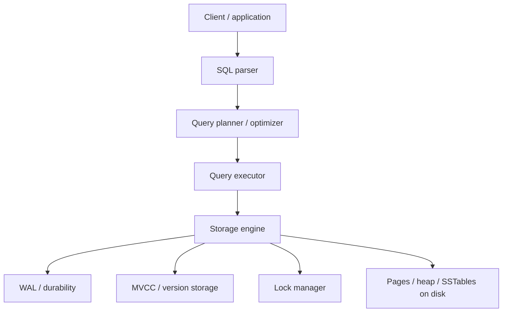
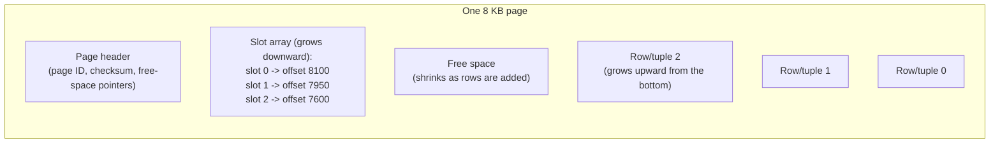

# Storage Engines

_Every mechanism covered so far in L2 - B-tree and LSM-tree indexing, the write-ahead log, MVCC, locking - has been described as if it belonged to "the database." This topic names the actual component all of them live inside: the storage engine, the layer that decides how rows and indexes are physically laid out on disk, how a write actually reaches durable storage, and how a read actually finds bytes. Indexing already covered B-tree vs LSM-tree as data structures; this topic covers the same split one level up, as the architecture of an entire engine - what it costs in write amplification, read amplification, and space amplification to run a whole database on one design versus the other, and how WAL, MVCC, and locking each plug into that engine's write path._

## Contents

- [What a storage engine is](#what-a-storage-engine-is)
- [Pluggable vs fixed: MySQL's engine architecture vs PostgreSQL's single engine](#pluggable-vs-fixed-mysqls-engine-architecture-vs-postgresqls-single-engine)
- [Pages, slots, tuples: the physical unit of storage](#pages-slots-tuples-the-physical-unit-of-storage)
- [Heap files vs index-organized tables](#heap-files-vs-index-organized-tables)
- [B-tree storage engines: the write path and read path end to end](#b-tree-storage-engines-the-write-path-and-read-path-end-to-end)
- [LSM-tree storage engines: the write path and read path end to end](#lsm-tree-storage-engines-the-write-path-and-read-path-end-to-end)
- [Write, read, and space amplification, restated at the whole-engine level](#write-read-and-space-amplification-restated-at-the-whole-engine-level)
- [Compaction strategies in depth](#compaction-strategies-in-depth)
- [How WAL, MVCC, and locking plug into the write path](#how-wal-mvcc-and-locking-plug-into-the-write-path)
- [Buffer pool, page cache, dirty pages, checkpointing](#buffer-pool-page-cache-dirty-pages-checkpointing)
- [Tuning knobs: compression, block size, and the write/read/space trade-off](#tuning-knobs-compression-block-size-and-the-writeread-space-trade-off)
- [Choosing a storage engine](#choosing-a-storage-engine)
- [How this connects](#how-this-connects)
- [Check yourself](#check-yourself)
- [Real-world & sources](#real-world--sources)

## What a storage engine is

**A storage engine is the software layer inside a database that decides how data is physically represented on disk, and how it is read from and written to that representation - it sits directly below the query executor and directly above the raw filesystem/block device.** When a query planner decides "scan this index, then fetch these rows," it is the storage engine that actually executes "read page 4,271 from disk (or the buffer pool), find the row at that slot, return its bytes" - the planner reasons about *what* to fetch; the storage engine is the only layer that knows *how* those bytes are actually arranged and retrieved.

Concretely, a storage engine owns:

- **The on-disk layout** - whether rows live in fixed-size pages updated in place (B-tree family) or in immutable, append-only sorted files merged over time (LSM-tree family, [both introduced at the index level already](08-indexing.md#b-tree-indexes)).
- **The write path** - what happens, mechanically, between "a transaction issues an `UPDATE`" and "that change is durable and eventually reflected in the primary data structure."
- **The read path** - what happens between "a query asks for a row" and "the bytes for that row are returned," including which in-memory caches are checked first.
- **Concurrency control primitives** - how MVCC snapshots and lock manager state are represented and maintained, since these are engine-specific implementation details, not something the SQL layer manages directly (this is *why* [MVCC's two implementations](06-mvcc.md#two-physical-implementations-postgresql-vs-mysqlinnodb) differ so much between PostgreSQL and InnoDB - each engine bakes its own MVCC strategy into its own page format).
- **Durability and recovery** - the WAL format and crash-recovery logic, [covered in full generality in the previous topic](09-write-ahead-log.md), is itself a storage-engine-owned subsystem, not a separate service.

Everything *above* the storage engine - SQL parsing, the relational model, query planning, isolation-level semantics as observed by an application - is, in principle, engine-agnostic: the same `SELECT ... WHERE ... JOIN ...` should produce the same logical result regardless of which physical engine executes it. Everything *at or below* the storage engine is where the physical trade-offs this topic covers actually live.

## Pluggable vs fixed: MySQL's engine architecture vs PostgreSQL's single engine

This is a genuine architectural fork between the two most widely used open-source relational databases, and it is worth being precise about because it changes what "choosing a storage engine" even means in each system:

- **MySQL has a pluggable storage engine architecture.** The SQL layer (parser, optimizer, replication, `CREATE TABLE` handling) is a separate component from the storage layer, connected through a defined internal API (the `handler` interface). Different tables in the *same* MySQL instance - even the same database - can use different storage engines simultaneously: **InnoDB** (the default since MySQL 5.5, a B+-tree engine with full ACID transactions, row-level locking, MVCC, foreign keys, and crash recovery via its own redo log), **MyISAM** (MySQL's older default, table-level locking only, no transactions, no crash-safe redo log - it can still be faster for read-mostly, no-transaction workloads specifically because it skips all of InnoDB's transactional bookkeeping, but a crash can leave a MyISAM table corrupted in a way InnoDB is specifically designed to prevent), **MEMORY** (pure in-memory, non-durable, useful for temp tables), and **MyRocks** (Facebook/Meta's RocksDB-backed engine, storing MySQL tables as an LSM-tree instead of InnoDB's B+ tree - see [below](#lsm-tree-storage-engines-the-write-path-and-read-path-end-to-end)). `ALTER TABLE ... ENGINE=InnoDB` changes a specific table's physical storage engine without touching the SQL layer above it at all.
- **PostgreSQL has exactly one storage engine, built into the core server, with no engine-swapping mechanism in mainstream use.** Every PostgreSQL table is a heap file plus B-tree (or other access-method) indexes, using the single MVCC and WAL implementation [already covered](06-mvcc.md#two-physical-implementations-postgresql-vs-mysqlinnodb). PostgreSQL does expose a **pluggable table access method API** (`CREATE ACCESS METHOD ... TYPE TABLE`, introduced in PostgreSQL 12) and a small number of alternative table access methods exist as extensions (e.g. `verify` `zheap`/undo-log-based storage was an experimental effort to reduce PostgreSQL's bloat problem by storing updates via an undo log instead of new heap tuples, similar in spirit to InnoDB's approach, though it has not shipped as a mainstream production option) - but in practice, essentially every production PostgreSQL table runs on the one built-in heap engine, in sharp contrast to MySQL's routine multi-engine use.

The practical consequence: a MySQL-specific decision ("should this table be InnoDB or MyRocks?") has no direct PostgreSQL equivalent - the engine-level trade-offs this whole topic describes are, in PostgreSQL, decisions about which *database product* to run (PostgreSQL vs. a different engine entirely) rather than a per-table configuration choice within one running instance.

## Pages, slots, tuples: the physical unit of storage

Both storage-engine families ultimately write to disk in fixed-size **pages** (also called blocks) - 8 KB in PostgreSQL, 16 KB in InnoDB by default, [already introduced as the unit that makes B+ tree fanout work](08-indexing.md#why-a-b-tree-not-a-binary-tree-for-disk-backed-storage). A page is the atomic unit of I/O: the engine never reads or writes less than one whole page, because the underlying storage device (and OS page cache) is itself organized around fixed-size blocks.

Within a page, individual rows are stored via a **slotted page** layout - the near-universal scheme both PostgreSQL and InnoDB use:

- **Slots** are a small, fixed-size array of pointers (offset + length) stored near the top of the page, growing downward as rows are added.
- **Tuples/rows** are the actual variable-length row data, stored near the bottom of the page, growing upward.
- A row is addressed by a **tuple identifier (TID)** in PostgreSQL, or an equivalent physical locator in InnoDB - conventionally `(page number, slot number)`. This one extra indirection (pointer through a slot, rather than a direct byte offset) is exactly what lets a row move *within* a page (e.g. after an in-place update that needs more space) without every index pointing at it having to be rewritten - only the slot entry changes, not every reference to that TID.
- Free space within a page is reclaimed and reused as rows are updated or deleted; when a page fills up, the engine allocates a new page and links or references it as needed (a B+ tree leaf split, [as covered under indexing](08-indexing.md#insert-delete-and-rebalancing-costs), is exactly this happening at the index-leaf level; a heap page filling up simply means the next inserted row goes into a different page entirely).

## Heap files vs index-organized tables

[Indexing already drew this exact line](08-indexing.md#clustered-vs-non-clustered-secondary-indexes) at the level of "how does a secondary index find a row" - here it is restated as the storage engine's foundational layout decision for the *entire table*, not just one index:

- **Heap file (PostgreSQL's only mode).** The table's rows live in an unordered collection of pages, in no particular order relative to any column's values - a new row simply goes wherever there's free space (or a newly allocated page at the end). Every index, including the primary key's, is a *separate* structure whose leaves store TIDs pointing back into this heap. Insert is cheap (append to whichever page has room, no ordering to maintain), but every index lookup costs one traversal down the index plus a second, essentially random, heap fetch to retrieve the row itself.
- **Index-organized table / clustered table (InnoDB's only mode for the primary key).** There is no separate heap file at all - the table's rows are stored directly in the leaf nodes of the primary key's B+ tree, in primary-key order. A primary-key lookup is therefore a single B+ tree traversal straight to the row; a secondary-index lookup costs two traversals (secondary index -> PK value -> clustered index), the "bookmark lookup" cost [already named under indexing](08-indexing.md#clustered-vs-non-clustered-secondary-indexes).

This is a whole-table architectural choice, not a per-index one: it determines how *every* row in the table is physically arranged, which is why InnoDB requires every table to have a primary key (it synthesizes a hidden 6-byte row ID as the clustering key if none is declared) - a table has to be clustered by *something*, since there is no heap fallback in InnoDB's design.

## B-tree storage engines: the write path and read path end to end

Tying together everything covered separately across ACID, MVCC, locking, indexing, and WAL, here is what a single `UPDATE` actually does, mechanically, in a B-tree engine (InnoDB, concretely):

**Write path:**

1. The lock manager acquires the necessary row lock (or, in a pure MVCC read path, no lock is needed for readers at all - [see locking](07-locking.md) and [MVCC](06-mvcc.md) for the full mechanics).
2. The target page is located - either already resident in the **buffer pool** ([below](#buffer-pool-page-cache-dirty-pages-checkpointing)), or read in from disk if not (a cache miss, costing a real disk I/O).
3. Before the row's old value is overwritten, InnoDB copies the old version into its **undo log** (its MVCC mechanism, [already covered](06-mvcc.md#two-physical-implementations-postgresql-vs-mysqlinnodb)) so concurrent readers under an older snapshot can still see the prior value.
4. The page is modified **in place**, in memory, inside the buffer pool - the row's bytes are directly overwritten at their existing slot (or the slot is updated to point at a new location within the same page, if the row grew).
5. A WAL (redo log) record describing this change is appended to the log buffer; on commit, that record - and everything before it - is fsynced, [exactly as the WAL topic described](09-write-ahead-log.md#the-write-ahead-invariant-precisely).
6. The modified page is now **dirty** (in memory, not yet reflected on disk) and is flushed back to disk lazily, in the background, at some later point - the **no-force** policy [already named](09-write-ahead-log.md#steal-and-no-force-what-the-wal-buys-the-buffer-pool).

**Read path:** locate the correct leaf page via the B+ tree traversal [described under indexing](08-indexing.md#point-lookups-and-range-queries) - checking the buffer pool first, falling back to a disk read on a miss - then read the row directly out of that page's slot, applying the MVCC visibility check against the current transaction's snapshot to decide whether the current in-place value or an undo-log-reconstructed older version is the one that should be returned.

The defining physical characteristic of this whole path: **every update is, eventually, a random write to whatever page on disk happens to hold that row** - "eventually," because the buffer pool defers the actual disk write, but the write, when it happens, lands at an arbitrary page location determined by where that row physically lives, not by write order. This is the direct cause of the amplification figures [below](#write-read-and-space-amplification-restated-at-the-whole-engine-level).

## LSM-tree storage engines: the write path and read path end to end

The same walkthrough for an LSM-tree engine (RocksDB, or MyRocks running inside MySQL, or Cassandra's storage layer), building on [the memtable/SSTable/compaction structure already covered under indexing](08-indexing.md#structure-memtable-sstables-compaction):

**Write path:**

1. The write is appended to the WAL - sequential, cheap, exactly [the same durability contract](09-write-ahead-log.md#what-a-wal-is-and-why-it-exists) as a B-tree engine's redo log, just protecting a different in-memory structure.
2. The write is inserted into the **memtable** (an in-memory sorted structure - a skip list in RocksDB's default implementation) - no disk I/O for the data itself, only the WAL append.
3. The write is now durable (via the WAL) and visible to reads, without ever having touched the table's main on-disk structure.
4. Once the memtable reaches a size threshold, it is **flushed** as a new, immutable SSTable - a single large sequential write, not a random one.
5. **Compaction** runs as a background process, independent of any single transaction's critical path, merging multiple SSTables into fewer, larger ones, discarding obsolete versions and tombstoned (deleted) keys as it goes.

**Read path:** check the memtable first (newest data, in memory); if not found, check each SSTable from newest to oldest, using a **Bloom filter** per SSTable to skip files that provably don't contain the key ([already covered under indexing's read-amplification discussion](08-indexing.md#read-amplification-write-amplification-space-amplification)) - so a single logical read can, in the worst case, touch several physical files before resolving.

The defining physical characteristic here is the mirror image of the B-tree path: **every write is sequential and cheap at write time**, and the cost of consolidating scattered updates into an efficiently-readable form is deferred to background compaction - paid later, in bulk, rather than on each write's own critical path.

## Write, read, and space amplification, restated at the whole-engine level

[Indexing introduced these three terms](08-indexing.md#read-amplification-write-amplification-space-amplification) for a single LSM-tree index; here they describe the *entire engine's* disk I/O behavior, and it is useful to state the B-tree side of the same three metrics explicitly, since indexing's LSM-focused treatment didn't need to:

| Metric | B-tree engine (InnoDB) | LSM-tree engine (RocksDB/Cassandra) |
| --- | --- | --- |
| **Write amplification** | Moderate and fairly constant: one WAL append (small) plus, eventually, one full-page rewrite per dirty page flushed - a single-row update to an already-cached page costs roughly "one page write" regardless of how many times that page is touched before its next flush (multiple updates to the same page before it's flushed are absorbed into a single write-back) | Can be substantial and workload-dependent: the same logical byte is rewritten every time a compaction pass merges the SSTable containing it into the next level - RocksDB deployments commonly report **10-30x** write amplification with leveled compaction (`verify` exact figures are workload- and configuration-dependent) |
| **Read amplification** | Low and predictable: 3-4 page reads for a point lookup via the B+ tree ([per the worked example under indexing](08-indexing.md#why-a-b-tree-not-a-binary-tree-for-disk-backed-storage)), regardless of how many times the row has been updated - there is only ever one current physical copy of a row (plus, if MVCC needs an older version, a bounded undo-log chain) | Can require checking the memtable plus multiple SSTables per read, mitigated by Bloom filters and leveled compaction's bound of "check at most one SSTable per level" - but structurally higher than a B-tree's single-current-copy model |
| **Space amplification** | Low: an in-place update overwrites the old value, so disk usage tracks logical data size fairly closely (plus index overhead and any MVCC undo-log/version-chain overhead for not-yet-vacuumed old versions) | Can be high transiently: obsolete versions and tombstones physically occupy disk space until a compaction pass reclaims them - a key updated many times before compaction catches up occupies roughly that many times its logical size in the meantime |

The underlying reason this table comes out this way is the same one [indexing already stated at the index level](08-indexing.md#read-amplification-write-amplification-space-amplification): a B-tree pays its cost predictably and continuously (every write does a small amount of extra work: undo-log write, WAL append, in-place page modification), while an LSM-tree defers its cost and pays it in bursts (writes are nearly free up front; compaction pays the accumulated bill later, in the background) - which is exactly why LSM-tree write throughput looks dramatically better in a synthetic write-only benchmark, but real production LSM-tree deployments live or die on whether compaction can keep pace with the write rate, [as Discord's Cassandra-to-ScyllaDB migration illustrated concretely under indexing's real-world section](08-indexing.md#real-world--sources).

## Compaction strategies in depth

[Indexing named the two dominant strategies](08-indexing.md#structure-memtable-sstables-compaction) briefly; here is the engine-level trade-off each one makes, since compaction strategy is one of the single biggest tuning levers an LSM-tree-backed system exposes:

- **Size-tiered compaction (STCS)** - Cassandra's historical default. SSTables of roughly similar size are merged together once enough of them (a configurable threshold, historically 4 by default) accumulate at a given size tier, producing a new SSTable roughly the combined size, which then becomes a candidate for the next tier up. **Trade-off:** lower write amplification (each SSTable is rewritten relatively few times over its life), but higher space amplification (multiple same-tier SSTables can all exist simultaneously, each holding a full copy of any row updated within that window) and worse read amplification in the worst case (more SSTables can accumulate at any one time before they're compacted together, especially under uneven write patterns).
- **Leveled compaction (LCS)** - LevelDB's and RocksDB's default. SSTables are organized into levels of exponentially increasing total size (each level typically ~10x the size of the previous one, `verify` exact multiplier is tunable per RocksDB deployment); within a level, SSTables have **non-overlapping key ranges**, so a compaction merges one SSTable from level N into the (at most a handful of) overlapping SSTables in level N+1. **Trade-off:** much better read amplification (at most one SSTable per level needs checking, since key ranges don't overlap within a level) and much better space amplification (obsolete data is reclaimed more promptly, level by level), at the cost of *higher* write amplification - the same logical byte gets rewritten every time it's promoted through a level, which is exactly the source of RocksDB's commonly-cited 10-30x figure.
- **Time-window compaction (TWCS)** - a Cassandra-specific strategy for time-series/append-mostly workloads (metrics, event logs, IoT telemetry), where data naturally partitions by write time and old data is rarely updated: SSTables are grouped into fixed time windows and compacted only *within* a window, never across windows, which matches how such workloads are typically queried (recent data) and deleted (via TTL, whole old windows dropped entirely rather than rewritten). This sidesteps STCS's and LCS's general-purpose compaction cost entirely for the specific case where "does this key still need merging with a much older SSTable" essentially never happens.

The practical tuning question this reduces to: **STCS/TWCS favor lower write amplification for workloads that can tolerate looser read/space guarantees (or, for TWCS, workloads whose access pattern is inherently time-windowed); LCS favors predictable, bounded read/space amplification at the cost of higher total background rewrite volume** - which is why RocksDB (used as an embedded engine inside latency-sensitive services) defaults to leveled compaction, while Cassandra's historical STCS default reflected its original write-throughput-above-all design point, with TWCS added later once time-series workloads became common enough to warrant a dedicated strategy.

## How WAL, MVCC, and locking plug into the write path

This topic's job is not to re-explain any of these three mechanisms - each has its own dedicated lesson - but to be explicit about exactly where each one attaches inside the storage engine, since the previous sections referenced this connective tissue in passing:

- **WAL is the engine's durability boundary, and it is identical in spirit across both families, applied to different in-memory structures.** A B-tree engine's WAL protects **dirty buffer-pool pages** that haven't yet been flushed; an LSM-tree engine's WAL protects the **memtable**, which is equally volatile until flushed to an SSTable. [The write-ahead invariant itself](09-write-ahead-log.md#the-write-ahead-invariant-precisely) - "the log record for a change must be durable before the change itself reaches stable storage" - is completely engine-agnostic; only *what* "the change itself" refers to (a page vs. a memtable) differs.
- **MVCC is where the two families diverge the most, because it dictates how the engine handles the *same physical row* having multiple logical versions.** A B-tree engine (InnoDB) keeps exactly one current physical copy of a row in its page, plus a separate **undo log** of prior versions for readers under an older snapshot ([per MVCC's InnoDB implementation](06-mvcc.md#two-physical-implementations-postgresql-vs-mysqlinnodb)) - old versions are reconstructed on demand, not stored inline with current data. An LSM-tree engine has no separate undo mechanism at all: because SSTables are immutable and a key can appear in several of them, **multiple versions of the same key are simply multiple entries scattered across the memtable and SSTables**, disambiguated by a sequence number/timestamp attached to each write, with the newest version winning on read and older versions physically removed only once compaction merges past them. This is why an LSM-tree engine's MVCC "just falls out of" its append-only design, while a B-tree engine has to build a dedicated undo-log subsystem to get the same property.
- **Locking attaches at the row (or gap, or page) level inside whichever engine holds the current data**, and is purely in-memory bookkeeping in the lock manager regardless of which storage family sits underneath it - [locking's own mechanics](07-locking.md) don't change based on B-tree vs. LSM-tree storage, since a lock coordinates *concurrent transactions in flight*, not the physical layout of what they're modifying. The one place storage architecture does interact with locking is gap/next-key locking specifically: [gap locks lock ranges *within a B+ tree's key ordering*](08-indexing.md#how-this-connects), which presumes the sorted, page-addressable structure a B-tree provides - a pure LSM-tree engine without a B-tree index layer has no equivalent native concept of "the gap between two adjacent keys" to lock, which is one reason phantom-read prevention looks different (and is less commonly implemented at all) in LSM-tree-backed systems.

## Buffer pool, page cache, dirty pages, checkpointing

Every B-tree storage engine keeps a large, dedicated in-memory cache of recently-used pages, called the **buffer pool** (InnoDB's term; PostgreSQL calls its equivalent **shared buffers**) - this is the single most important tuning target in a B-tree engine's deployment, since [indexing's entire fanout argument](08-indexing.md#why-a-b-tree-not-a-binary-tree-for-disk-backed-storage) assumed a warm cache ("almost all of which are cached in the buffer pool after the first access").

- **Why a dedicated buffer pool, not just the OS page cache?** The engine has information the OS filesystem cache doesn't: which pages are index roots (accessed constantly, should almost never be evicted), which pages belong to a transaction's undo log (needed only briefly), and which pages are being sequentially scanned once (shouldn't evict everything else out of the cache). InnoDB's buffer pool uses a modified **LRU** with a "young" and "old" sublist specifically to prevent a single large sequential scan (a full table scan, a backup job) from flushing every genuinely hot page out of cache - new pages enter the "old" sublist first and only get promoted to "young" if accessed again shortly after, so a one-time scan's pages age out without displacing the working set.
- **Dirty pages** are buffer-pool pages that have been modified in memory but not yet written back to their on-disk location - the direct consequence of the **no-force** policy [the WAL topic named](09-write-ahead-log.md#steal-and-no-force-what-the-wal-buys-the-buffer-pool): a transaction can commit long before its modified pages are physically flushed, because the WAL record already guarantees the change can be redone if a crash happens first.
- **The background flush/writer process** flushes dirty pages to disk continuously, on its own schedule, independent of any individual transaction's commit - InnoDB's dedicated page-cleaner threads and PostgreSQL's background writer both exist specifically so that flushing dirty pages never blocks a foreground query or transaction.
- **Checkpointing**, [covered in full mechanics under WAL](09-write-ahead-log.md#checkpointing), is the buffer pool's own bound on how much dirty, unflushed data can accumulate before recovery time grows unacceptably - the same fuzzy-checkpoint mechanism already described applies here without modification; this topic's contribution is simply naming that checkpointing exists specifically *because* the buffer pool is allowed to hold dirty pages for a while (steal + no-force), not as an independent design choice.

An LSM-tree engine's equivalent cache target is somewhat different in shape: RocksDB maintains a **block cache** (caching decompressed data blocks read from SSTables) separately from the memtable (which is itself already fully in memory by construction, not a "cache" of something on disk), plus an optional **row cache** for whole-record caching - the underlying goal (keep hot, frequently-accessed data in memory rather than re-reading from disk on every access) is identical to a buffer pool's, just applied to immutable SSTable blocks rather than mutable pages.

## Tuning knobs: compression, block size, and the write/read/space trade-off

Both storage-engine families expose real, commonly-tuned knobs that trade among the same three amplification axes:

- **Block/page size.** A larger page (or SSTable block) amortizes per-I/O overhead across more data - fewer, larger reads for a sequential scan - but wastes more space on a single small-row point lookup (reading a whole 64 KB block to fetch one 200-byte row) and increases the cost of a single random write (rewriting a larger unit for a small change, in a B-tree engine's in-place model). InnoDB's default 16 KB page balances OLTP point-lookup efficiency against range-scan efficiency; RocksDB's default block size (`verify` commonly 4 KB, configurable) trades a similar balance for LSM read/decompression cost per lookup.
- **Compression.** Both families support page/block-level compression (InnoDB's page compression, RocksDB's per-level compression, often configured to use lighter/faster compression - e.g. `verify` LZ4/Snappy - on lower, more frequently re-read levels and heavier compression - e.g. `verify` Zstd - on higher, rarely-touched levels). Compression directly reduces space amplification and the volume of physical I/O per logical byte, at the cost of CPU spent compressing on write and decompressing on read - a trade that is almost always favorable on modern hardware, where CPU is comparatively abundant and I/O is comparatively scarce, which is why compression is on by default in most production deployments of both families.
- **Compaction throttling and level sizing (LSM-specific).** RocksDB and Cassandra both expose knobs to limit how much I/O bandwidth compaction is allowed to consume relative to foreground traffic, and how large each level is allowed to grow before triggering the next compaction - directly trading "compaction keeps up better, less read amplification accumulates" against "compaction steals I/O bandwidth from foreground reads/writes, causing latency spikes," precisely the operational tension [Discord's Cassandra scaling story illustrated](08-indexing.md#real-world--sources).
- **Fill factor / page padding (B-tree specific).** PostgreSQL's `fillfactor` setting deliberately leaves some percentage of each page empty on initial insert, reserving room for future in-place updates to the same page (relevant specifically to PostgreSQL's **HOT** - Heap-Only Tuple - update optimization, which can avoid writing a new index entry for an update if the new row version fits in the same page as the old one) - a direct space-for-write-amplification trade at the page level.

## Choosing a storage engine

| Workload characteristic | Right fit | Why |
| --- | --- | --- |
| General-purpose OLTP: mixed reads/writes, point lookups, joins, strong consistency needs | **B-tree** (InnoDB, PostgreSQL's engine) | Stable, predictable read cost; MVCC via undo log keeps exactly one current physical copy per row, keeping space amplification low; mature tooling for online schema/index changes |
| Extremely high, sustained write throughput: event logging, metrics ingestion, wide-column data at large scale | **LSM-tree** (RocksDB, Cassandra, ScyllaDB, MyRocks) | Converts random writes into sequential ones, sustaining far higher write throughput than in-place updates can - at the cost of read amplification (mitigated by Bloom filters) and compaction overhead that must be actively managed and monitored |
| Read-heavy, latency-sensitive workload with a moderate write rate | **B-tree**, tuned with a large buffer pool and covering indexes | Read cost is stable and cache-friendly; there's no compaction-driven latency variance to manage, unlike an LSM-tree under write pressure |
| Mixed OLTP + occasional heavy write bursts, wanting engine flexibility per table without switching database products | **MySQL's pluggable architecture** (InnoDB for most tables, MyRocks for specific high-write, storage-constrained tables) | Only MySQL's handler-API architecture allows this per-table choice within one running instance; PostgreSQL's single fixed engine means this kind of per-table swap isn't available without adopting an entirely different system |
| Storage-space-constrained, very large dataset, write-heavy | **LSM-tree with leveled compaction and compression** | Leveled compaction bounds space amplification better than size-tiered; compression further reduces the physical footprint per logical byte, at an accepted CPU and write-amplification cost |

## How this connects

- **Back to indexing** - this topic is the whole-engine version of [indexing's B-tree-vs-LSM-tree section](08-indexing.md#b-tree-indexes), and directly resolves [indexing's own forward pointer](08-indexing.md#how-this-connects) to "how storage engines handle the rest of a table's physical layout beyond just indexing" - heap files, clustered tables, and pages are exactly that missing piece.
- **Back to the write-ahead log** - this topic named precisely where WAL protection attaches for each engine family (dirty buffer-pool pages for B-tree engines, the memtable for LSM-tree engines), fulfilling [the WAL topic's own forward reference](09-write-ahead-log.md#how-this-connects) to "how a storage engine's on-disk data layout itself is organized around exactly this WAL-plus-page-flush relationship."
- **Back to MVCC and locking** - restated, at the engine-architecture level, why InnoDB needs an undo log (one current physical copy per row) while an LSM-tree's MVCC falls out "for free" from its append-only, multi-version-by-construction design; and why gap locking presumes a B+ tree's sorted structure specifically.
- **Forward to query planning and optimization** - the next L2 topic covers how the query planner decides *which* index or scan strategy to use for a given query, including how it estimates whether an index scan beats a full table (or heap) scan - a decision made entirely above the storage engine, but whose cost estimates (page reads, I/O cost) are only meaningful because of the physical structures this topic just described.
- **Forward to connection pooling** - independent of storage-engine architecture, but the buffer pool named here is a *storage-level* cache; connection pooling is a completely separate, *connection-level* resource-management concern the next-but-one L2 topic covers.
- **Forward to L3, Caching** - the buffer pool/block cache distinction drawn here is itself an instance of the general caching patterns L3 covers (eviction policies, cache warming, hit-ratio tuning), just specific to page- or block-structured storage.
- **Forward to L4, NoSQL and data at scale** - MyRocks, Cassandra, and ScyllaDB, all named here as LSM-tree engines, are the concrete storage foundation of several NoSQL families L4 covers in depth; this topic's write/read/space-amplification framework is the vocabulary L4 will reuse directly when comparing NoSQL storage engines against each other.
- **Forward to OLTP vs OLAP** - the B-tree-vs-LSM-tree engine choice covered here is one axis of a broader distinction the next-but-two L2 topic draws between transactional (OLTP) and analytical (OLAP) storage and query patterns, including column-oriented storage layouts neither B-tree nor LSM-tree engines (as covered here) natively provide.

## Check yourself

- A colleague says "PostgreSQL doesn't have a storage engine, only MySQL does." What's wrong with that statement, and what's the more precise distinction between the two systems?
- Explain, in terms of physical page/row layout, why InnoDB requires every table to have a primary key (synthesizing a hidden one if none is declared) while PostgreSQL does not.
- Walk through what happens, step by step, when a single `UPDATE` runs against an InnoDB table - name where the lock manager, the undo log, the buffer pool, and the WAL each get involved, and in what order.
- Why does an LSM-tree engine's approach to MVCC not need a separate undo log the way InnoDB's does? What replaces it?
- A team is choosing between size-tiered and leveled compaction for a new Cassandra-backed service. Their workload has a moderate write rate but very latency-sensitive reads. Which would you recommend, and why - name the specific amplification trade-off that drives the choice.
- Why is the buffer pool's LRU implementation in InnoDB more complex than a plain LRU list, and what specific access pattern is it designed to protect against?

## Real-world & sources

**Meta: building MyRocks to replace InnoDB for the social graph.** Facebook built MyRocks - RocksDB (its own LSM-tree key-value engine, itself built at Facebook originally for storing internal data efficiently on flash) wired into MySQL as a storage engine - specifically to cut the storage footprint and flash-write volume of its UDB tier, the sharded MySQL fleet holding the social graph. In production, migrating this tier from compressed InnoDB to MyRocks used **50% less storage for the same data**; in Facebook's own LinkBench-based benchmarks, a MyRocks instance came out **3.5x smaller than uncompressed InnoDB and 2x smaller than compressed InnoDB**, and MyRocks wrote "orders of magnitude" less to flash than InnoDB did (the post does not give one precise write-amplification multiplier for that specific benchmark, so treat the exact ratio as `verify`; the commonly cited industry figure - also echoed in the VLDB paper on MyRocks - is roughly a **10x reduction in bytes written to flash** versus InnoDB, worth `verify`-flagging as a rounded figure rather than a single controlled measurement). The trade-off Meta accepted: MyRocks favors write/space efficiency at some cost to read latency and to InnoDB's more mature secondary-index/read-path tooling - exactly the "B-tree for reads, LSM-tree for writes-and-space" split this lesson describes, playing out at whole-fleet scale.
Source: [Migrating a database from InnoDB to MyRocks - Engineering at Meta](https://engineering.fb.com/2017/09/25/core-infra/migrating-a-database-from-innodb-to-myrocks/) (accessed 2026-07-12); [MyRocks: A space- and write-optimized MySQL database - Engineering at Meta](https://engineering.fb.com/2016/08/31/core-infra/myrocks-a-space-and-write-optimized-mysql-database/) (accessed 2026-07-12).

**Uber: migrating Schemaless and Docstore from InnoDB to MyRocks, and where it didn't pay off.** Uber's Storage Platform team migrated all Schemaless instances (its MySQL-backed append-only datastore) and some Docstore instances to MyRocks starting in 2019, reporting **over 30% disk space savings** on Schemaless - with larger savings still on Docstore, since that data wasn't pre-compressed the way Schemaless already was. Uber is candid about the cost side of the same trade-off this lesson's amplification table predicts: the migration came with **higher CPU usage and increased disk I/O utilization** on some instances, meaning MyRocks wasn't a blanket win - only workloads that were storage-bound (not CPU- or IOPS-bound) were good migration candidates, a concrete instance of "LSM-tree write/space efficiency is bought with extra background compaction work that has to be actively managed," not a free upgrade.
Source: [MySQL to MyRocks Migration in Uber's Distributed Datastores - Uber Engineering Blog](https://www.uber.com/us/en/blog/mysql-to-myrocks-migration-in-uber-distributed-datastores/) (accessed 2026-07-12).

**Fintech angle: Stripe runs its core financial data on a document database, not a classic B-tree/LSM SQL engine.** Stripe's DocDB - a MongoDB-Community-based, custom-built database-as-a-service layer - serves over 5 million queries per second across 5,000+ collections and 2,000+ database shards for Stripe's core financial data, according to Stripe's own engineering blog. `verify` the specific underlying storage engine (MongoDB's default is WiredTiger, itself a B-tree-based engine with document-level MVCC) is not confirmed from the sources checked for this sweep, so treat "which storage engine DocDB's nodes actually run" as unverified here rather than asserted; the scale and shard-count figures themselves are as stated on Stripe's own blog. Flagging this rather than fabricating an InnoDB/RocksDB-specific fintech claim, since no verifiable Stripe engineering post naming a B-tree-vs-LSM storage-engine decision (of the InnoDB/MyRocks kind) was found in this sweep.
Source: [How Stripe's document databases supported 99.999% uptime with zero-downtime data migrations - Stripe Dot Dev Blog](https://stripe.dev/blog/how-stripes-document-databases-supported-99.999-uptime-with-zero-downtime-data-migrations) (accessed 2026-07-12).

**Sources**
- [Migrating a database from InnoDB to MyRocks - Engineering at Meta](https://engineering.fb.com/2017/09/25/core-infra/migrating-a-database-from-innodb-to-myrocks/)
- [MyRocks: A space- and write-optimized MySQL database - Engineering at Meta](https://engineering.fb.com/2016/08/31/core-infra/myrocks-a-space-and-write-optimized-mysql-database/)
- [MySQL to MyRocks Migration in Uber's Distributed Datastores - Uber Engineering Blog](https://www.uber.com/us/en/blog/mysql-to-myrocks-migration-in-uber-distributed-datastores/)
- [How Stripe's document databases supported 99.999% uptime with zero-downtime data migrations - Stripe Dot Dev Blog](https://stripe.dev/blog/how-stripes-document-databases-supported-99.999-uptime-with-zero-downtime-data-migrations)
