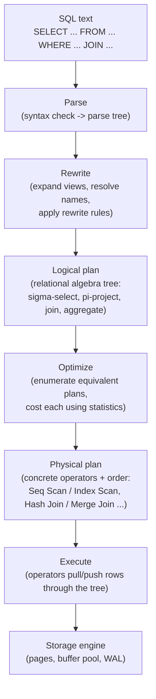

# Query Planning and Optimization

_Every mechanism covered so far in L2 - B-tree and LSM-tree indexes, heap files and clustered tables, the buffer pool, WAL - is a piece of physical machinery the database *could* use to answer a query. This topic covers the component that actually decides, for a given `SELECT`, which pieces to use and in what order: the query planner (also called the optimizer). It is the layer that turns "what result do I want" into "which specific sequence of physical operations - this scan, that join algorithm, this order - will produce it fastest," and it is the reason two logically identical queries can run in 2 milliseconds or 2 minutes depending on choices the planner made without the caller ever seeing them._

## Contents

- [Why a planner exists: SQL is declarative](#why-a-planner-exists-sql-is-declarative)
- [The query execution pipeline](#the-query-execution-pipeline)
- [Rule-based vs cost-based optimization](#rule-based-vs-cost-based-optimization)
- [The cost model: what it estimates and how](#the-cost-model-what-it-estimates-and-how)
- [Statistics: histograms, cardinality estimation, and staleness](#statistics-histograms-cardinality-estimation-and-staleness)
- [Access path selection: scan types and selectivity](#access-path-selection-scan-types-and-selectivity)
- [Join algorithms: nested loop, hash join, merge join](#join-algorithms-nested-loop-hash-join-merge-join)
- [Join ordering and the combinatorial explosion](#join-ordering-and-the-combinatorial-explosion)
- [Logical rewrites: pushdown and other transformations](#logical-rewrites-pushdown-and-other-transformations)
- [Reading an actual query plan: EXPLAIN vs EXPLAIN ANALYZE](#reading-an-actual-query-plan-explain-vs-explain-analyze)
- [Worked example: choosing between two access paths](#worked-example-choosing-between-two-access-paths)
- [Query hints: overriding the optimizer](#query-hints-overriding-the-optimizer)
- [How this connects](#how-this-connects)
- [Check yourself](#check-yourself)

## Why a planner exists: SQL is declarative

SQL is a **declarative** language: a query states *what* result is wanted (`SELECT name FROM users WHERE country = 'IN' ORDER BY created_at`), not *how* to obtain it. This is a deliberate design choice, in sharp contrast to an **imperative/procedural** approach - a hand-written loop that opens the `users` file, checks each row's `country` field, collects matches, and sorts them - where the programmer, not the system, decides the exact sequence of steps.

Because SQL only specifies the *what*, there is, for almost any non-trivial query, more than one **semantically equivalent** way to compute the answer: scan the whole table and filter, or use an index on `country` and skip straight to matching rows; join two tables by nested loop, by building a hash table, or by merging two sorted streams; filter before joining, or join before filtering (the results are identical, the cost is not). All of these produce the exact same rows - relational algebra guarantees it, since each is a different physical realization of the same logical transformation - but their costs, on real hardware with a real data distribution, can differ by orders of magnitude.

**The query planner (optimizer) is the component whose entire job is searching this space of equivalent plans and picking the one it estimates will be cheapest.** This is only possible, and only necessary, *because* SQL is declarative: an imperative language wouldn't need a planner, because the programmer already committed to one specific execution strategy - and it wouldn't offer one, because there'd be nothing left for a planner to choose between. The trade the relational model made back in [the relational-model topic](01-relational-model.md) - give up manual control over the access path, in exchange for a much simpler, non-procedural way to state what you want - is exactly what makes this whole topic exist.

## The query execution pipeline

A SQL statement passes through a fixed sequence of stages between the text the client sends and the rows the client receives back:



- **Parse.** The SQL text is checked for syntactic correctness and turned into a **parse tree** - a structural representation of the statement's grammar, with no understanding yet of whether the referenced tables or columns actually exist.
- **Rewrite.** Views are expanded into their underlying query, column and table names are resolved against the schema catalog, and any rewrite rules (e.g. PostgreSQL's rule system, used internally to implement views) are applied. The output is a validated, name-resolved representation of the query.
- **Logical plan.** The query is expressed as a tree of **relational algebra** operators - selection (σ, a filter), projection (π, a column list), join (⋈), aggregation (γ), sort, union - describing *what* transformation happens at each step, with no commitment yet to *how* any operator is physically implemented. This is the same relational algebra that gives the relational model its formal semantics, restated here as the optimizer's internal working representation.
- **Optimization.** The optimizer explores a space of logically equivalent trees (reordered joins, pushed-down filters, alternative access paths) and, for each candidate, estimates a numeric **cost** using table/index statistics - covered in full [below](#the-cost-model-what-it-estimates-and-how). It keeps the cheapest plan (or, for very large join sets, the cheapest one it found within a bounded search, [below](#join-ordering-and-the-combinatorial-explosion)).
- **Physical plan.** Each logical operator is replaced with a concrete, executable one: a join (⋈) becomes a nested loop, hash join, or merge join; a table reference becomes a sequential scan, index scan, index-only scan, or bitmap scan; a sort becomes an in-memory quicksort or an external merge sort. This is the tree an `EXPLAIN` actually shows.
- **Execution.** The executor walks the physical plan tree - in most engines (PostgreSQL, MySQL, SQL Server) via the classic **Volcano/iterator model**: every operator exposes a `next()` call that pulls one row at a time from its child operator(s), so a `LIMIT 10` on top of a huge join can stop after pulling just 10 rows without ever materializing the rest - and each leaf operator reads through the storage engine covered in the [previous topic](10-storage-engines.md).

## Rule-based vs cost-based optimization

There are two fundamentally different strategies an optimizer can use to pick among candidate plans:

- **Rule-based optimization (RBO).** A fixed set of heuristics is applied regardless of the actual data: "always prefer an index scan over a sequential scan if one exists on the filtered column," "always join in the order tables appear in the `FROM` clause," and similar static priority rules. RBO is cheap to run (no statistics to gather or cost to compute) and fully predictable (the same query always produces the same plan), but it can be **provably wrong** for data it wasn't tuned for: "always use the index" is an excellent rule when a predicate matches 0.01% of a table and a terrible one when it matches 60% of it, because at high selectivity the random I/O of chasing an index outweighs the cost of just reading the table sequentially ([worked out concretely below](#worked-example-choosing-between-two-access-paths)). Oracle shipped a rule-based optimizer as its default through the 1990s and formally deprecated it in favor of its cost-based optimizer starting with Oracle 10g (`verify` exact version/year), precisely because RBO's static rules degraded badly as data volumes and skew grew beyond what the original rule set anticipated.
- **Cost-based optimization (CBO).** Every candidate plan is assigned a numeric estimated cost, computed from table and index statistics ([next section](#the-cost-model-what-it-estimates-and-how)), and the optimizer picks the plan with the lowest estimated cost. This is what every mainstream production optimizer does today - PostgreSQL, MySQL/InnoDB, SQL Server, Oracle (since its RBO deprecation) - because it adapts to the *actual* data: the same query against a lightly-skewed table and a heavily-skewed one can (and should) produce different plans, and only a cost model that consults real statistics can make that distinction.

CBO's own weakness is the mirror image of RBO's strength: it is only as good as its **statistics and cost model**. Stale statistics, a cost model that mis-estimates I/O for the actual hardware, or a cardinality estimate that assumes independence between correlated columns can all cause a CBO to confidently pick a bad plan - which is exactly why [statistics staleness](#statistics-histograms-cardinality-estimation-and-staleness) and [reading a plan to spot a bad estimate](#reading-an-actual-query-plan-explain-vs-explain-analyze) are load-bearing skills, not optional extras, for anyone operating a database at scale.

## The cost model: what it estimates and how

A CBO's cost is not "milliseconds" - it's an internal, unitless number computed from a small set of per-unit costs, calibrated (loosely) to reflect relative expense, and combined with **cardinality estimates** (how many rows flow through each step). PostgreSQL's cost model is a concrete, well-documented example of what every relational CBO is doing in spirit:

| Cost constant | Default value | What it represents |
| --- | --- | --- |
| `seq_page_cost` | 1.0 | Cost of fetching one page via sequential I/O |
| `random_page_cost` | 4.0 | Cost of fetching one page via random I/O (`verify` this default assumes spinning-disk-era seek cost; many modern deployments on SSD tune it down toward 1.1-2.0, since SSDs have far less random-vs-sequential penalty than spinning disks) |
| `cpu_tuple_cost` | 0.01 | CPU cost of processing one row (heap tuple) |
| `cpu_index_tuple_cost` | 0.005 | CPU cost of processing one index entry |
| `cpu_operator_cost` | 0.0025 | CPU cost of evaluating one operator/function call (e.g. one comparison in a `WHERE` clause) |

(`verify` exact default figures against the currently installed PostgreSQL major version - these values have been stable for a long time but are always tunable per-cluster.)

The optimizer combines these into a total estimated cost for every candidate physical operator, bottom-up: a scan's cost is (pages touched × the relevant page cost) + (rows touched × the relevant per-row CPU cost); a join's cost builds on its children's already-computed costs plus the join algorithm's own per-row work; a plan's total cost is the cost of its root operator, which recursively includes everything beneath it. Three categories of estimate feed every one of these calculations:

- **I/O cost** - how many pages must be fetched, and whether the fetch pattern is sequential (cheap) or random (expensive, by roughly the `random_page_cost`/`seq_page_cost` ratio - 4x by PostgreSQL's stock defaults, though real cost depends heavily on the storage medium and how much of the working set is already warm in the [buffer pool](10-storage-engines.md#buffer-pool-page-cache-dirty-pages-checkpointing), which the basic cost model does not track per-query).
- **CPU cost** - how many rows or index entries must actually be evaluated (a comparison, a hash computation, a function call) once the relevant pages are in memory.
- **Cardinality** - how many rows come *out* of each operator. This is the single most consequential estimate in the whole model, because it's not just used for that operator's own cost - it is fed as the *input* row count to every operator above it in the tree. A cardinality estimate that's wrong by 100x at the bottom of the tree doesn't just make one operator's cost estimate wrong; it can make every join algorithm choice above it wrong too, since (for example) a hash join's build-side choice and a nested loop's viability both depend directly on how many rows the optimizer *thinks* are coming from below.

## Statistics: histograms, cardinality estimation, and staleness

Cardinality estimates come from statistics the engine collects about each table and column, not from the optimizer inspecting the actual data at query time (which would defeat the purpose - the whole point is to decide a plan *before* paying the cost of executing it). PostgreSQL's `ANALYZE` (run automatically by `autovacuum`'s analyze process, or manually) samples a table's rows and stores, per column, in `pg_statistic`/`pg_stats`:

- **Most-common values (MCV) list** - the N most frequent distinct values in the column, each with its exact observed frequency. This handles skewed data precisely: if `status = 'active'` covers 40% of rows and `status = 'archived'` covers 2%, the MCV list captures both frequencies exactly rather than averaging them away.
- **Histogram** - the remaining (non-MCV) values are divided into **equi-depth buckets** (each bucket covering roughly the same number of rows, with varying value-range width, as opposed to an equi-width histogram which fixes the range width and lets row counts per bucket vary) - so the optimizer can estimate "what fraction of rows fall between X and Y" for a range predicate without storing every individual value.
- **Null fraction and distinct-value count (`n_distinct`)** - used for cardinality estimates on `IS NULL` and equality/`GROUP BY` predicates on values not in the MCV list, respectively (an estimate not a listed exact frequency, so a highly skewed long tail can under- or over-estimate here).
- **Correlation** - how closely a column's physical row order on disk matches its logical sort order (1.0 = perfectly correlated, e.g. an append-only, monotonically-inserted timestamp column; near 0 = essentially random physical order relative to value). This feeds directly into [access path cost](#access-path-selection-scan-types-and-selectivity), since a well-correlated column lets an index scan fetch heap pages in something close to sequential order instead of scattered random order.

**Selectivity** is the fraction of a table's rows a predicate is expected to match, and it's the number every cardinality estimate ultimately reduces to: `estimated_rows = total_rows × selectivity`. For a single predicate, selectivity comes straight from the MCV list or histogram; for multiple predicates combined with `AND`, the default (and most consequential simplifying assumption in the entire model) is **attribute-value independence** - multiply the individual selectivities together, e.g. `WHERE country = 'IN' AND status = 'active'` estimates as `selectivity(country='IN') × selectivity(status='active')`. This is exactly right when the two columns are genuinely independent, and can be badly wrong when they're correlated (e.g. `WHERE city = 'Mumbai' AND country = 'IN'` - `city` and `country` are strongly correlated, so multiplying their independent selectivities badly *underestimates* the true combined selectivity, since almost every `Mumbai` row is already an `IN` row). PostgreSQL's `CREATE STATISTICS` (extended statistics, since PostgreSQL 10) exists specifically to let an operator declare "these columns are correlated, track their joint distribution" and correct for exactly this blind spot.

**Statistics go stale** because they are a point-in-time snapshot, not a live view of the table: `autovacuum`'s analyze threshold triggers a re-`ANALYZE` only after a configurable fraction of a table's rows have changed since the last one (`autovacuum_analyze_scale_factor`, default 0.1 - i.e. after roughly 10% of rows have been inserted/updated/deleted, `verify` exact default and whether it's combined additively with `autovacuum_analyze_threshold`). Between analyze runs, the optimizer is working from an increasingly out-of-date picture. This matters enormously in two common real situations: a **bulk load** (e.g. loading a new day's data into a previously near-empty table) can leave the optimizer thinking the table is still small right after the load, until the next analyze runs and it "discovers" the table is actually large - during that window it may pick plans (nested loops, no index) suited to the wrong table size entirely; and a table whose value distribution **shifts over time** (a `status` column that used to be mostly `'pending'` and is now mostly `'completed'`) can silently drift the real selectivity of a predicate away from what the last histogram recorded, degrading plan quality gradually rather than all at once. This is precisely the kind of problem [reading a query plan](#reading-an-actual-query-plan-explain-vs-explain-analyze) is designed to catch: a large gap between the optimizer's *estimated* row count and the *actual* row count returned is the direct fingerprint of stale (or otherwise wrong) statistics.

## Access path selection: scan types and selectivity

For a single table, the optimizer chooses among several physical **access paths**, each a direct consequence of the storage structures already covered:

- **Sequential (full table) scan.** Read every page of the table's heap in physical order, checking each row against the predicate. Cost is essentially `pages × seq_page_cost + rows × cpu_tuple_cost` - no index traversal, no random I/O, but every row is examined regardless of how few actually match.
- **Index scan.** Traverse the relevant B+ tree ([per the indexing topic](08-indexing.md#point-lookups-and-range-queries)) to find matching keys, then, for each match, fetch the corresponding heap page (the "bookmark lookup" pattern, [also already covered](08-indexing.md#clustered-vs-non-clustered-secondary-indexes)). Cost is dominated by however many *distinct heap pages* must be fetched to retrieve matching rows - and because those pages can be scattered across the table (unless the column is well-correlated), each fetch is often a random-I/O page read, at `random_page_cost` rather than `seq_page_cost`.
- **Index-only scan.** If every column the query needs is present in the index itself - a **covering index**, [already covered under indexing](08-indexing.md#covering-indexes) - the heap fetch is skipped entirely (subject, in PostgreSQL, to the **visibility map** confirming the relevant heap page has no rows requiring an MVCC visibility check against the current snapshot). This is the cheapest access path that still uses an index, because it eliminates the random heap I/O that a plain index scan pays.
- **Bitmap index scan + bitmap heap scan (PostgreSQL-specific, and conceptually present in similar form elsewhere).** For a moderate number of matches - too many for a plain index scan's per-row heap fetch to stay cheap, but still fewer than a full scan would justify - PostgreSQL first walks the index building an in-memory **bitmap of matching heap pages** (not rows), then fetches those pages in **physical page order**, converting what would have been scattered random access into a single sorted pass over only the pages that actually contain a match. This sits deliberately between a plain index scan (best for very few matches) and a sequential scan (best for very many matches).

**Selectivity is what decides among these**, and the crossover is a direct consequence of the cost constants above: as the fraction of matching rows grows, an index scan's random-page cost (paid per matching page) eventually exceeds a sequential scan's flat, sequential cost (paid once, for the whole table, regardless of how many rows match) - the exact point depends on the table's size, its correlation, and the `random_page_cost`/`seq_page_cost` ratio, but a commonly cited rule of thumb for spinning-disk-era defaults is that once a predicate matches somewhere around **5-10% or more of a table's rows** (`verify` - genuinely workload-, hardware-, and correlation-dependent, not a fixed law), a sequential scan starts winning. This is exactly the RBO failure mode named above, made numerically concrete, and it's worked through step by step in the [worked example below](#worked-example-choosing-between-two-access-paths).

## Join algorithms: nested loop, hash join, merge join

For a two-table join, the optimizer chooses among three physical algorithms, each with a different cost shape:

| Algorithm | How it works | Cost shape | Best suited for |
| --- | --- | --- | --- |
| **Nested loop join** | For each row in the outer (driving) relation, scan the inner relation for matches - a plain scan if no index exists, or a direct index lookup if the join column is indexed (**index nested loop join**) | `O(outer_rows × inner_scan_cost)`; with an index on the inner side, ≈ `O(outer_rows × log(inner_rows))` | Small outer relation (few rows to drive the loop), especially when the inner side has an index on the join column - the single most common join shape in OLTP point-lookup-style queries |
| **Hash join** | Build an in-memory hash table on the smaller relation's join key (the **build** side), then scan the other relation (the **probe** side), probing the hash table for each row. If the build side doesn't fit in available memory (`work_mem` in PostgreSQL), it spills to disk in partitions - a **grace hash join** | ≈ `O(build_rows + probe_rows)` when the build side fits in memory | Large, unsorted equi-joins with no useful index - the default choice for joining two large tables on equality with no supporting index on either side |
| **Merge join (sort-merge join)** | Both inputs are sorted (or already arrive sorted, e.g. via an index scan on the join key) on the join column, then merged in a single linear pass, like merging two sorted lists | ≈ `O(n log n)` if an explicit sort is needed, ≈ `O(n)` if both inputs are already sorted | Both sides already sorted (e.g. both accessed via an index on the join key), or the result needs to be sorted anyway for a later `ORDER BY`/`GROUP BY`, letting the sort be reused instead of paid twice |

The optimizer picks among these using exactly the cardinality estimates and cost constants above: given estimated row counts for both sides, available indexes, whether either side is already sorted, and how much memory is available for a hash table or sort, it computes each algorithm's estimated cost and keeps the cheapest. A frequent, diagnosable failure mode is the optimizer choosing a **nested loop** because it *underestimated* the outer relation's row count (expecting, say, 100 rows, when the true count is 100,000) - nested loop cost grows linearly with the outer row count, so a 1,000x cardinality underestimate can turn a plan that should have been a hash join into one that's catastrophically slower in practice; this is exactly the kind of divergence [EXPLAIN ANALYZE](#reading-an-actual-query-plan-explain-vs-explain-analyze) is built to expose.

## Join ordering and the combinatorial explosion

Joining more than two tables reintroduces the same "many equivalent plans" problem one level up: joins are associative and commutative (`A ⋈ B ⋈ C` can be computed as `(A ⋈ B) ⋈ C`, `A ⋈ (B ⋈ C)`, `(B ⋈ A) ⋈ C`, and so on - all logically equivalent, all potentially very different in cost), and the number of distinct ways to order and shape a join tree grows combinatorially with the number of tables.

For `N` tables, the number of distinct **left-deep** join orderings alone (a chain-shaped tree where each join adds one new table to a running result, ignoring the additional freedom of **bushy trees** that join two intermediate results together) is `N!`:

| Number of tables (N) | N! (left-deep orderings alone) |
| --- | --- |
| 5 | 120 |
| 8 | 40,320 |
| 10 | 3,628,800 |
| 15 | ~1.3 trillion |

Choosing an optimal join order for an arbitrary set of tables and join predicates is a well-known **NP-hard** problem (`verify` exact citation - commonly attributed to foundational work on join-ordering complexity from the 1980s), meaning no known algorithm solves it exactly in polynomial time as `N` grows - exhaustively costing every one of the `N!` (or more, counting bushy shapes) orderings is infeasible well before `N` reaches double digits. Two different strategies exist for coping with this in practice:

- **Dynamic programming (System R-style), for small-to-moderate N.** Rather than enumerate full orderings directly, build up the cheapest plan for every *subset* of the tables, bottom-up: start with the best access path for each single table, then compute the best way to join every pair, then every valid join of every triple built from an already-computed pair-plus-single, and so on - memoizing the cheapest plan found *for each subset*, so a subset's cost is looked up (not recomputed) whenever it recurs inside a larger subset's evaluation. This bounds the work to roughly `2^N` subset evaluations rather than `N!` full orderings - still exponential, but tractable for the join counts (single digits to a dozen or so tables) typical of real OLTP queries. The classic System R optimizer (Selinger et al., 1979, `verify` exact citation) additionally tracks not just the single cheapest plan per subset but the cheapest plan *for each "interesting" output order* too (e.g. a slightly more expensive plan that happens to already be sorted on the next join's key, or on the final `ORDER BY` column, can beat the cheapest unsorted plan once a downstream merge join or sort is accounted for) - a refinement still present in spirit in modern optimizers. PostgreSQL uses this exhaustive/DP-style search by default, bounded by `join_collapse_limit` and `from_collapse_limit` (default 8, `verify` exact default), meaning explicit joins and `FROM`-list entries beyond that count stop being exhaustively reordered.
- **Heuristic search, for large N.** Beyond the DP-feasible threshold, PostgreSQL switches to **GEQO (Genetic Query Optimizer)** once the number of tables exceeds `geqo_threshold` (default 12, `verify` exact default) - a genetic algorithm that represents each candidate join ordering as a "chromosome," maintains a population of candidate orderings, and evolves it across generations (mutation, crossover, cost-based selection of survivors) to converge on a good - not guaranteed optimal - ordering in roughly polynomial rather than exponential time. Other engines use comparable escape hatches for large joins: greedy heuristics (repeatedly join in whichever pair currently has the lowest estimated cost, without ever reconsidering the choice) are a common simpler alternative, and MySQL historically bounds its own exhaustive search via `optimizer_search_depth`, falling back to a greedy strategy beyond it (`verify` exact MySQL mechanism and defaults). The practical upshot for anyone writing queries: a join across a couple dozen tables (common in some reporting/BI-style queries, less common in OLTP) may not get the truly optimal plan, and rewriting it as a narrower set of joins, or restructuring via subqueries/CTEs, can sometimes help the optimizer reason about it more effectively than throwing the whole thing at a heuristic search.

## Logical rewrites: pushdown and other transformations

Before (and sometimes instead of) choosing physical operators, the optimizer applies a set of **logically equivalence-preserving rewrites** to the plan tree - transformations that change *where* work happens without changing the result, purely to reduce how much data flows through expensive downstream operators:

- **Predicate pushdown.** Move a `WHERE` filter as far down the tree as possible - ideally to the scan itself, or (for a query against a foreign data wrapper / federated source) all the way down to the remote system - so rows are eliminated before they ever reach a join or aggregation. `SELECT * FROM orders o JOIN customers c ON o.customer_id = c.id WHERE o.status = 'refunded'` gains nothing from filtering `status` *after* the join; pushing that filter below the join means the join itself only ever processes the (typically much smaller) set of already-`refunded` orders.
- **Projection pushdown.** Push down *which columns* are actually needed by the final result, so scans and intermediate operators only carry the columns required downstream, not entire rows. In a row-oriented engine this mainly saves memory and tuple-copy overhead per intermediate step; it is the same idea that becomes dramatically more consequential once column-oriented storage (the [OLTP vs OLAP topic](#how-this-connects) covers this next) lets a scan skip reading unneeded columns' bytes from disk entirely, not just drop them in memory afterward.
- **Subquery flattening / unnesting.** A correlated subquery (`WHERE customer_id IN (SELECT id FROM customers WHERE country = 'IN')`) can often be rewritten into an equivalent join (specifically a **semi-join** - "does at least one matching row exist," without duplicating the outer row per match) that the optimizer's join-ordering and access-path machinery can then reason about directly, rather than executing the subquery as an isolated, unoptimized black box once per outer row.
- **Constant folding and view inlining.** Expressions with constant inputs are evaluated once at plan time rather than once per row (`WHERE price > 10 + 5` folds to `WHERE price > 15`); a query against a view is expanded to reference the view's underlying base tables directly, so the optimizer can apply pushdown and join reordering across the view boundary instead of treating the view as an opaque, separately-optimized unit.

## Reading an actual query plan: EXPLAIN vs EXPLAIN ANALYZE

- **`EXPLAIN`** shows the **estimated** physical plan the optimizer chose - which operators, in what order, along with the optimizer's estimated cost and estimated row count for each node - **without actually running the query**. This is safe to run against any query, including a destructive one, since nothing executes.
- **`EXPLAIN ANALYZE`** **actually executes** the query (this matters: an `EXPLAIN ANALYZE` on an `UPDATE`/`DELETE` really performs the write, unless wrapped in a transaction that's then rolled back) and additionally reports the **actual** elapsed time and **actual** row count at every node, alongside the same estimates `EXPLAIN` alone would have shown. This side-by-side estimated-vs-actual view is the single most useful diagnostic tool for query performance, because it directly exposes where the optimizer's model of the data diverged from reality.

Concrete things to look for when reading a plan:

- **A large gap between estimated and actual row counts** at any node (e.g. `rows=120` estimated, `rows=340000` actual) is the direct fingerprint of stale or otherwise wrong statistics, and it's important because that error **compounds upward**: a bad estimate at a low-level scan feeds a bad join-algorithm choice above it, which feeds a bad estimate into the join above *that*, and so on.
- **A sequential scan on a large table with what looks like a highly selective filter** suggests either a missing index on the filtered column, or - if an index does exist - that the optimizer's selectivity estimate (or the actual data's correlation/selectivity) genuinely favored a seq scan; check the estimated selectivity against reality before assuming "missing index" is the fix.
- **A nested loop join where both actual row counts are large** is a strong signal the optimizer underestimated one side's cardinality - nested loop cost scales linearly with the outer row count, so a nested loop that should have been a hash join, chosen because the optimizer expected far fewer outer rows than actually arrived, is a very common source of a query that "usually" runs fine and occasionally runs catastrophically slowly as data volume or skew shifts.
- **A sort operation that spills to disk** - PostgreSQL's `EXPLAIN ANALYZE` reports this explicitly (`Sort Method: external merge  Disk: 184320kB`, for example) when the sort's working set exceeds `work_mem`, meaning the engine had to perform a slower, disk-based external sort instead of an in-memory one - a direct, actionable signal to either raise `work_mem` for that workload or reduce the row/column volume feeding the sort (e.g. via better predicate/projection pushdown further down the plan).

## Worked example: choosing between two access paths

Table `orders` holds **100,000,000 rows**, average row size (with per-row overhead) ≈ 200 bytes, on 8 KB pages holding ≈ 40 rows each → **2,500,000 pages** total. An index exists on `orders(status)`. Assume, for this worked trace, PostgreSQL's stock cost constants (`seq_page_cost = 1.0`, `random_page_cost = 4.0`, `cpu_tuple_cost = 0.01`, `cpu_index_tuple_cost = 0.005`) and - for simplicity - a `status` column with essentially no correlation to physical row order (each matching row plausibly lands on its own distinct heap page, a worst-case assumption for the index path; `verify` real PostgreSQL uses a more refined interpolation, commonly attributed to the Mackert-Lohman cost formula, that accounts for the `correlation` statistic directly rather than assuming either extreme).

**Sequential scan cost (same for both queries below, since it doesn't depend on selectivity at all):**

```
cost = pages x seq_page_cost + rows x cpu_tuple_cost
     = 2,500,000 x 1.0 + 100,000,000 x 0.01
     = 2,500,000 + 1,000,000
     = 3,500,000 cost units
```

**Query A - highly selective predicate:** `WHERE status = 'refunded'`, estimated (from the MCV list) at 0.1% selectivity → **100,000 matching rows**.

```
index descent: ~4 pages x random_page_cost   = 4 x 4.0        =        16
heap fetches:  100,000 matching rows, worst case
               one distinct page per row (100,000 << 2,500,000
               total pages, so no page-count cap applies)
               100,000 x random_page_cost     = 100,000 x 4.0  =   400,000
cpu cost:      100,000 x (cpu_index_tuple_cost + cpu_tuple_cost)
               = 100,000 x 0.015              =                     1,500
                                                       -------------------
                                               total  ~   401,516 cost units
```

Index scan (~401,516) beats sequential scan (3,500,000) by roughly **8.7x** - the optimizer picks the index. (In practice PostgreSQL would likely choose a **bitmap index scan + bitmap heap scan** here rather than a plain index scan, specifically to fetch those 100,000 scattered pages in sorted physical order instead of one-at-a-time random order - cheaper still than the plain-index-scan estimate above, but directionally the same conclusion: use the index.)

**Query B - low selectivity predicate:** `WHERE status = 'shipped'`, estimated at 90% selectivity → **90,000,000 matching rows**.

```
heap fetches: bounded by total pages, not matching rows -
              at 90% of all rows matching, virtually every one
              of the table's 2,500,000 pages contains at least
              one match, so distinct pages fetched -> 2,500,000
              (not 90,000,000 - the fetch count cannot exceed
              the number of pages that physically exist)
              2,500,000 x random_page_cost = 2,500,000 x 4.0  = 10,000,000
cpu cost:     90,000,000 x 0.015 (index+tuple)                  1,350,000
                                                     ---------------------
                                             total   ~     11,350,000 cost units
```

Sequential scan (3,500,000) beats the index path (~11,350,000) by roughly **3.2x** - the optimizer picks the sequential scan, despite an index existing and being usable.

Same table, same index, same query shape - opposite access-path choice, driven entirely by the **estimated selectivity** feeding the cost model. This is exactly why a rule like "always use the index when one exists" (rule-based optimization) is unsound in general, and why the cardinality estimates feeding this calculation being **stale or wrong** (per the [statistics staleness discussion](#statistics-histograms-cardinality-estimation-and-staleness)) can flip the optimizer's decision to the more expensive path without anyone changing a single line of SQL.

## Query hints: overriding the optimizer

Some engines expose explicit **query hints** - syntax that forces a specific plan choice regardless of what the cost model would otherwise pick: Oracle's `/*+ INDEX(table idx) */` comment-embedded hints, MySQL's optimizer hints (`/*+ JOIN_ORDER(...) */`, index hints via `USE INDEX`/`FORCE INDEX`), and SQL Server's `WITH (INDEX(...))`/`OPTION` query hints. **PostgreSQL deliberately does not ship hint syntax as a core feature** - the project's stated philosophy is that a wrong plan is a bug in the statistics or cost model, and the fix belongs there, not in a per-query workaround baked into application SQL (an unofficial extension, `pg_hint_plan`, exists for teams that want hints anyway, but it is not part of core PostgreSQL).

The case *for* a hint: the optimizer is provably and persistently choosing a worse plan than a known-better alternative, despite correct, freshly-gathered statistics - often because of a fundamental blind spot in the cost model (the independence assumption on correlated columns, a data distribution the histogram genuinely can't represent well, a query shape the optimizer's heuristics handle poorly). In that narrow situation, a targeted, documented override can be the pragmatic fix.

The risks that make hints a last resort rather than a first move:

- **A hint freezes a decision that stops being correct as data changes.** A hint chosen when a table has 10,000 rows (where an index scan is clearly right) can quietly become the wrong choice once the table grows to 10,000,000 rows and crosses the selectivity threshold worked out above - but the hint keeps forcing the old choice regardless, since it bypasses the cost model that would otherwise have adapted automatically.
- **Hints mask the real problem instead of fixing it.** If the underlying issue is stale statistics or a missing index, a hint papers over the symptom on one specific query while leaving every other query touching the same table exposed to the same root cause.
- **Hints accumulate maintenance burden.** Each one is a piece of tuning knowledge that has to be revisited every time the schema, data distribution, or engine version changes - and, unlike the cost model itself, hints don't self-correct; someone has to notice they've gone stale.

The generally preferred alternative, in roughly this order: fix the statistics (run `ANALYZE`, add [extended statistics](#statistics-histograms-cardinality-estimation-and-staleness) for correlated columns), fix the schema (add a missing index, add a covering index), fix the cost constants if they're genuinely miscalibrated for the hardware (e.g. lowering `random_page_cost` for an all-SSD deployment) - and reach for a targeted hint only once those levers are exhausted and the plan is still wrong.

## How this connects

- **Back to indexing** - the entire [access path selection](#access-path-selection-scan-types-and-selectivity) section is the planner-level payoff of [indexing's B-tree, composite-index, and covering-index material](08-indexing.md): the planner is the component that actually decides *whether* a given index gets used, and the leftmost-prefix rule, covering indexes, and index-only scans are all inputs to that decision, not decisions in themselves.
- **Back to storage engines** - the cost model's page-read and buffer-pool assumptions are only meaningful because of the [heap/clustered-table layout and buffer pool mechanics](10-storage-engines.md#buffer-pool-page-cache-dirty-pages-checkpointing) already covered; a plan's *estimated* cost assumes a cold cache in the simple model above, while its *actual* runtime (visible via `EXPLAIN ANALYZE`) reflects however warm the buffer pool actually was - one reason estimated and actual costs can diverge even when cardinality estimates are accurate.
- **Back to MVCC and locking** - an index-only scan's dependence on the visibility map (whether a heap page's rows are known-visible to every possible snapshot without a per-row MVCC check) ties directly back to [MVCC's version-visibility mechanics](06-mvcc.md); the planner otherwise treats concurrency control as the executor's concern, not something it reasons about during plan selection.
- **Forward to connection pooling** - planning itself is not free (parsing, statistics lookups, and - for large joins - potentially expensive search all cost real CPU time before a single row is fetched), which is exactly why **prepared statements** exist to cache a parsed/planned query across executions; how long a connection (and its prepared-statement cache) lives, and how many connections a pool maintains, is the very next L2 topic's concern.
- **Forward to OLTP vs OLAP** - everything in this topic (row-at-a-time iterator execution, nested loop/hash/merge join algorithms, B-tree/heap access paths) is shaped by an OLTP, row-oriented storage model; the next-but-one L2 topic covers how OLAP engines change the physical operator set entirely (vectorized, columnar execution, column-chunk pruning as an even more aggressive form of projection pushdown) while keeping the same underlying ideas - statistics-driven cardinality estimation, cost-based join ordering - as the reasoning framework.
- **Forward to L3, Caching** - a **plan cache** (reusing a previously planned query for a prepared statement or parameterized query) is a caching layer in exactly the general sense L3 covers, just caching a *plan* rather than a *result*; a **materialized view** is the analogous idea one level up, caching an actual result set.
- **Forward to L4, NoSQL and data at scale** - most NoSQL systems (DynamoDB, Cassandra) deliberately have **no general-purpose cost-based optimizer** at all: query patterns are constrained up front to match the partition/sort key design, precisely because there's no optimizer available to rescue a query that doesn't fit the key layout the way a relational planner can rescue an unindexed filter by falling back to a (merely slower, not impossible) sequential scan.
- **Forward to L5/L12** - everything here reasons about a single node's plan; a **distributed query planner** (deciding not just which access path and join algorithm, but which physical node executes which fragment of a join, and how intermediate results move across the network) extends this same cost-based framework with network cost as an additional term - covered as part of distributed query processing and scalability patterns further along the roadmap.

## Check yourself

- Explain why SQL being declarative is the precondition for a query planner existing at all - what would change if SQL required specifying the exact access path and join algorithm in every query?
- A colleague suggests always adding a rule "prefer an index scan whenever an index exists on the filtered column." Using the worked example's numbers, explain a case where that rule produces a worse plan than the cost-based choice.
- Why does the optimizer's cardinality estimate for one low-level scan matter for every join above it in the plan tree, not just for that scan's own cost?
- A table has just been bulk-loaded with 50 million new rows, and `autovacuum` hasn't run `ANALYZE` yet. Explain, in terms of the cost model, what kind of plan the optimizer might wrongly choose in this window, and why.
- Why is optimal join ordering for many tables NP-hard, and what two different strategies do real optimizers use to avoid an exhaustive search once the number of joined tables grows large?
- You run `EXPLAIN ANALYZE` and see `rows=200` estimated but `rows=850000` actual at a nested loop join's outer side. What does this suggest went wrong, and what join algorithm would likely have been chosen instead if the estimate had been accurate?
- Why does PostgreSQL not ship built-in query hints as a core feature, and what is the recommended alternative before reaching for a hint anyway?

## Real-world & sources

**CockroachDB - rebuilding the optimizer from scratch when heuristics stopped scaling.** Through v2.0, CockroachDB relied on a rule-based/heuristic planner, and the team found the rule set itself became the bottleneck: "every new heuristic rule we added had to be examined with respect to every heuristic rule already in place," which stopped scaling as query complexity grew. Starting with v2.1 they replaced it with a genuine cost-based optimizer built on a **memo data structure** - a compact "forest of plan trees" that exploits redundancy across the enormous number of logically equivalent plans, so the search doesn't have to materialize each candidate separately - combined with a transformation library (160+ rules by the 2.1 release, expressed in a DSL called Optgen that compiles to Go) and cost estimation driven by table statistics. This is the same underlying problem this topic covers (rule-based optimization degrading as data and query shape diversify, versus a cost model that adapts) playing out as a multi-year real engineering effort in a modern distributed SQL database, not just a legacy-era (Oracle RBO) story. Later releases (through 20.1) kept adding transformation rules and features like lookup-join planning and query-plan caching (to amortize the CBO's higher planning cost across repeated executions of the same query shape).
Source: [How we built a cost-based SQL optimizer - Cockroach Labs](https://www.cockroachlabs.com/blog/building-cost-based-sql-optimizer/) (fetched 2026-07-14).

**Citus (Postgres) - a concrete, numeric case of the independence-assumption blind spot this topic already flags.** Citus Data's engineering blog walks through the exact failure mode this file names in the [statistics section](#statistics-histograms-cardinality-estimation-and-staleness): on a 10-million-row table where one column is functionally derived from another (`col2 = col1 / 10`), Postgres's default per-column statistics multiply the two predicates' selectivities independently and estimate **100 rows**, when the real answer is **10,000 rows** - a 100x underestimate. That bad cardinality estimate cascaded into the optimizer choosing a disk-based external sort over a hash aggregation, roughly doubling the query's runtime (4.5s vs 2.4s). Running `CREATE STATISTICS` (functional-dependency and n-distinct extended stats, the same PostgreSQL 10 feature named in this file) and re-`ANALYZE` fixed the estimate and let the planner pick the cheaper hash aggregation. This is a directly verified, numeric instance of exactly the mechanism the concept file describes abstractly.
Source: [The Postgres 10 feature you didn't know about: CREATE STATISTICS - Citus Data](https://www.citusdata.com/blog/2018/03/06/postgres-planner-and-its-usage-of-statistics/) (fetched 2026-07-14).

**pganalyze - a war story on choosing query rewriting over hints when the optimizer misestimates by orders of magnitude.** Postgres monitoring vendor pganalyze documents a real customer case (Spacelift): a query taking 20 seconds because the planner estimated **2 million matching rows** on a generic `IS NOT NULL` filter when only **42 rows** actually matched, driving it into an inefficient index-scan plan. Rather than reaching for `pg_hint_plan` (the unofficial hint extension this topic names) or a statistics fix, the team rewrote the query with a nested sub-`SELECT` so the planner's index scan could terminate early once enough rows were found - cutting runtime from 20s to ~100ms (~200x). The same post references a separate case (Affinity) where fixing the underlying statistics with `CREATE STATISTICS` on correlated columns produced a ~3000x speedup instead - concretely illustrating this file's stated preference order (fix statistics/schema first, reach for a hint only as a last resort) by showing two different real fixes, neither of which was a hint.
Source: [5mins of Postgres E1: Using Postgres statistics to improve bad query plans, pg_hint_plan extension - pganalyze](https://pganalyze.com/blog/5mins-postgres-statistics-bad-query-plans-pghintplan) (fetched 2026-07-14).

**Fintech/UPI angle - flagged as not found.** A search for a Stripe-specific query-optimizer/EXPLAIN-plan war story turned up only Stripe's DocDB scaling story (a MongoDB-based document store handling 5M+ queries/sec via sharding and B-tree insertion-order tuning for write throughput) - a genuine, verifiable Stripe engineering result, but it is about horizontal scaling and physical write layout, not cost-based SQL query planning/EXPLAIN, so it is not included here to avoid overreach. No good UPI/NPCI angle was found either: UPI's public engineering write-ups focus on transaction throughput, idempotency, and settlement, not relational-optimizer internals, and this is a mechanical single-node planner topic where that angle doesn't naturally fit - consistent with the note that this topic's real-world coverage should stay to genuine query-optimizer/EXPLAIN sources rather than being forced.
