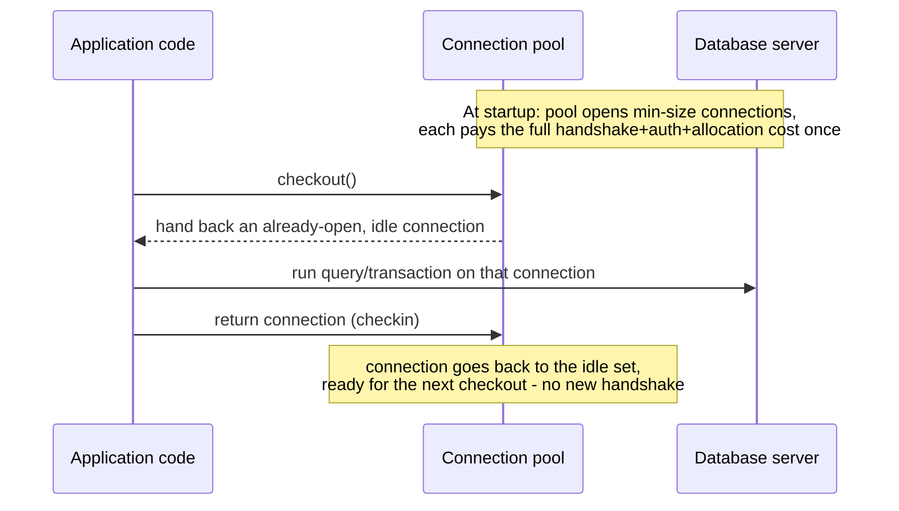
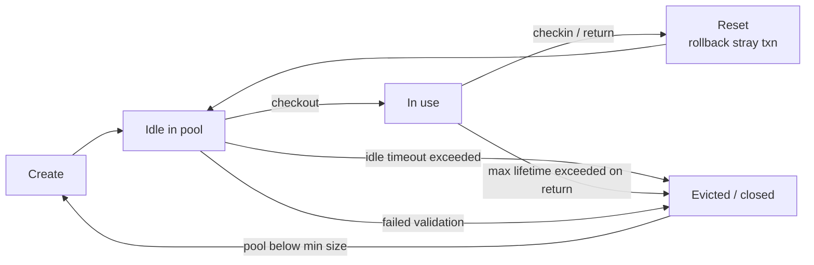
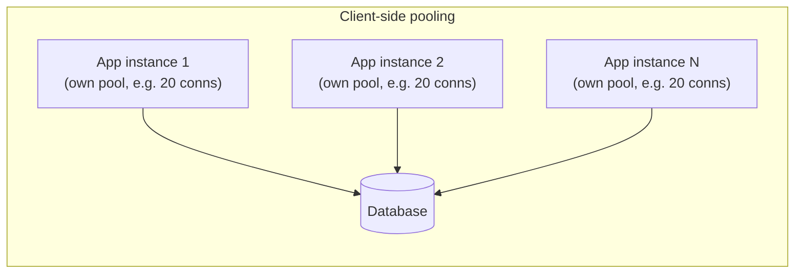
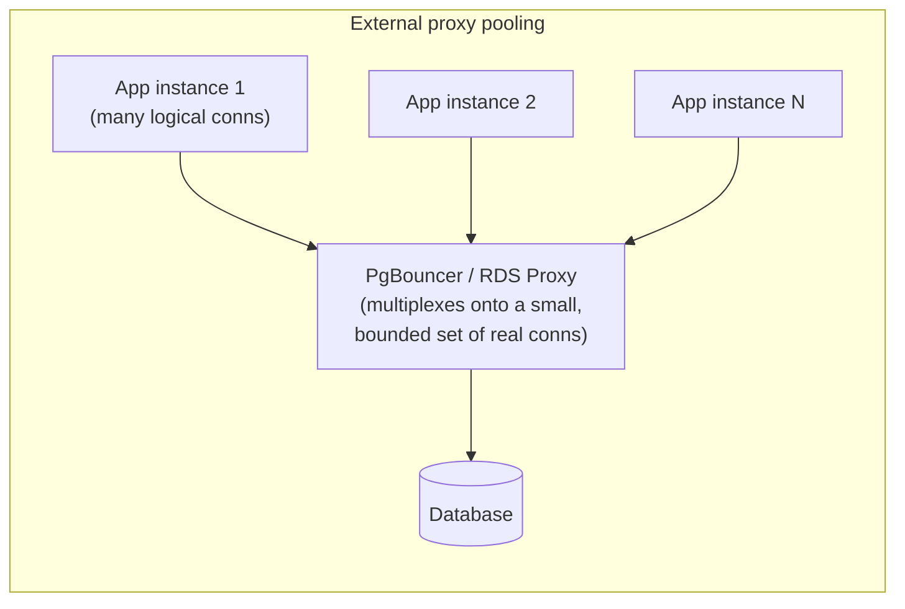

# Connection Pooling

_Every previous L2 topic - transactions, MVCC, locking, WAL, storage engines, query planning - assumed a connection to the database already exists and asked what happens once a query arrives on it. This topic asks the question underneath that assumption: what does it actually cost to establish that connection in the first place, why does paying that cost per request collapse a system under load long before the query logic itself becomes the bottleneck, and what machinery - client-side pools, external proxies, and the modes they operate in - exists to make a connection a reused, shared resource instead of a disposable one._

## Contents

- [The problem: a database connection is not free](#the-problem-a-database-connection-is-not-free)
- [What a connection actually costs, step by step](#what-a-connection-actually-costs-step-by-step)
- [The core idea: a pool of reusable connections](#the-core-idea-a-pool-of-reusable-connections)
- [Connection lifecycle inside a pool](#connection-lifecycle-inside-a-pool)
- [Pool sizing: min, max, and what happens at exhaustion](#pool-sizing-min-max-and-what-happens-at-exhaustion)
- [Where pooling lives: client-side vs external/proxy pools](#where-pooling-lives-client-side-vs-externalproxy-pools)
- [Pooling modes: session, transaction, statement](#pooling-modes-session-transaction-statement)
- [Sizing the pool relative to the database](#sizing-the-pool-relative-to-the-database)
- [The multiplication problem: N app replicas x pool size](#the-multiplication-problem-n-app-replicas-x-pool-size)
- [Failure modes](#failure-modes)
- [Serverless: why client-side pooling stops working](#serverless-why-client-side-pooling-stops-working)
- [Worked example: sizing a pool for a real deployment](#worked-example-sizing-a-pool-for-a-real-deployment)
- [Trade-offs](#trade-offs)
- [How this connects](#how-this-connects)
- [Check yourself](#check-yourself)
- [Real-world & sources](#real-world--sources)

## The problem: a database connection is not free

Every earlier L2 topic quietly assumed a connection was already open before a transaction began - `BEGIN`, an `UPDATE`, a `COMMIT` all happen *on* a connection, and nothing about isolation levels, MVCC snapshots, or locking says anything about how that connection came to exist. **Opening a connection is itself a nontrivial, multi-step, network-and-process-level operation**, and it is completely separate machinery from anything a query planner or storage engine does - a connection has to exist before there's anything for the rest of L2 to operate on.

The naive design - open a new connection for every incoming request, run one query or transaction on it, close it - is exactly what a web framework's default, un-pooled database client does if nothing else is configured, and it is the design this entire topic exists to replace. At low request rates the cost is invisible; at real production request rates it becomes the dominant source of latency and, past a point, the reason the database refuses new connections outright.

## What a connection actually costs, step by step

A single new database connection pays a sequence of distinct costs before the first query can even be sent, and each one is real, measurable latency and resource consumption - not a rounding error:

1. **TCP handshake.** A three-way handshake (SYN, SYN-ACK, ACK) between client and server, costing roughly **one network round-trip (RTT)** before any application data can flow. On a same-datacenter connection this might be sub-millisecond; across regions or through several network hops it can be tens of milliseconds - and this cost is paid again for every new connection, no matter how fast the query that follows will be.
2. **TLS handshake, if the connection is encrypted (as most production database connections are).** A full TLS 1.2 handshake costs roughly **two additional RTTs** (client/server hello, certificate exchange, key exchange, then a finished message on each side); TLS 1.3 reduces this to roughly **one RTT** for a fresh handshake (and can do **0-RTT** for a resumed session, at the cost of some replay-attack caveats that make 0-RTT data unsuitable for non-idempotent requests, `verify` exact RTT counts per TLS version and cipher suite, since they vary by handshake shape). This is on top of the TCP handshake, not instead of it - a fresh, encrypted connection can easily cost 2-3 RTTs of pure network round-tripping before a single byte of SQL is sent.
3. **Database authentication handshake.** After the transport is established, the database's own wire protocol runs a login exchange - PostgreSQL's protocol negotiates an authentication method (commonly SCRAM-SHA-256 since PostgreSQL 10) and exchanges challenge/response messages; MySQL's protocol does an equivalent handshake. This is additional round-trip latency and CPU work (password hashing/verification) layered on top of the transport-level handshakes above.
4. **Server-side connection/session allocation.** This is the cost that differs most sharply between engines, and it is the one most often underestimated:
   - **PostgreSQL forks a brand-new OS process per connection.** Every connection gets its own dedicated **backend process** - not a thread, an actual `fork()` of the postmaster - which means process creation overhead (page table setup, copying relevant process state) plus a fixed per-connection memory footprint for that process's own local state (on top of whatever `work_mem`/`temp_buffers` it may later allocate lazily per query). A commonly cited rough figure is on the order of a few megabytes of baseline overhead per idle backend process, growing well beyond that once a connection is actively running queries that need sort/hash memory (`verify` exact baseline figure - it depends heavily on PostgreSQL version, compiled options, and workload, but the *shape* of the cost - one OS process per connection, not a lightweight handle - is a stable, well-documented architectural fact). This is exactly why PostgreSQL's `max_connections` (default **100**, `verify` exact default across versions) is a hard, deliberately conservative ceiling: every connection above it isn't just "one more file descriptor," it's one more OS process the postmaster and OS scheduler have to manage, and pushing this number into the thousands directly degrades performance for *every* connection, not just the new ones, well before any query-level bottleneck shows up.
   - **MySQL/InnoDB uses one thread per connection** (in the traditional thread-per-connection model; MySQL's newer thread pool plugin, `verify` exact version and availability, multiplexes connections across a smaller thread pool instead) - lighter-weight than a full process fork, but still real allocation: thread stack memory, per-connection session state, and scheduler overhead that scales with connection count.
   - In both cases, opening a connection also means allocating session-level state: the connection's default schema/search path, session variables, prepared-statement cache, and (for MVCC engines) whatever snapshot bookkeeping the first transaction on that connection will need - none of which exists until the connection itself exists.

None of these four costs is enormous in isolation - a connection might come up in single-digit to double-digit milliseconds end to end - but multiplied across a request rate of hundreds or thousands per second, opening a fresh connection **per request** means paying this entire multi-step cost on the hot path of every single one, and means the database server is constantly forking/allocating and tearing down processes or threads instead of spending its resources answering queries. This is the concrete, mechanical reason "one connection per request, opened and closed each time" does not scale - independent of anything about the query itself.

## The core idea: a pool of reusable connections

**A connection pool is a managed set of already-established, already-authenticated database connections that are held open and handed out to callers on demand, then returned to the pool - rather than closed - when the caller is done, so the next caller can reuse the same already-open connection instead of paying the full setup cost again.**

This is precisely the same idea as reusing a TCP connection via HTTP keep-alive instead of opening a new one per HTTP request, applied one layer down, to the database connection itself. The pool amortizes the cost worked out above (handshakes, auth, server-side allocation) across many logical requests, so that cost is paid once per connection's entire lifetime, not once per query or transaction.



## Connection lifecycle inside a pool

A pooled connection moves through a well-defined set of states, and understanding each transition is what makes pool configuration (below) meaningful rather than arbitrary:

- **Create.** The pool opens a physical connection - full TCP + TLS + auth handshake, exactly the cost worked out above - and adds it to its managed set. This happens at pool startup (up to the configured minimum) and again whenever the pool needs to grow toward its maximum or replace an evicted connection.
- **Checkout (borrow).** An idle connection is handed to the calling code. Well-implemented pools (HikariCP is the commonly cited reference here) validate the connection isn't already known-dead before handing it out, and mark it as in-use so no other caller can be handed the same physical connection concurrently.
- **Validate on borrow (health-check).** Before (or, in some pools, periodically instead of on every borrow, to avoid paying a round-trip on every single checkout) handing out a connection, the pool can run a lightweight test query (e.g. `SELECT 1`) to confirm the underlying TCP connection is still genuinely alive and the server hasn't silently dropped it. This exists specifically to catch the [stale/dead-connection failure mode](#failure-modes) below before the caller's real query hits a broken connection and fails.
- **Use.** The caller runs one or more statements - a single query, or a full `BEGIN ... COMMIT` transaction - on the connection. Everything from the [transactions/isolation-levels topic](05-transactions-isolation-levels.md) onward happens entirely inside this window: whatever locks are held, whatever MVCC snapshot is open, are scoped to exactly this checkout-to-checkin period.
- **Return (checkin).** The caller hands the connection back to the pool instead of closing it. The pool typically runs a reset step here (rolling back any transaction the caller forgot to commit/rollback, so the connection isn't handed to the next caller mid-transaction) and marks the connection idle again, available for the next checkout.
- **Idle timeout.** A connection sitting idle in the pool for longer than a configured threshold is proactively closed and removed, on the reasoning that an idle connection is pure overhead (the server-side process/thread and its memory) with no offsetting benefit if nothing is actually using the pool at that volume right now - this lets a pool shrink back toward its minimum size during quiet periods rather than permanently holding peak-load capacity open.
- **Max lifetime.** Even a connection that's actively, healthily reused is typically closed and replaced after a configured maximum age (HikariCP's `maxLifetime`, for example), regardless of whether anything is wrong with it - this exists to smooth out connection retirement (avoiding every connection expiring at once, a self-inflicted [thundering herd](#failure-modes)) and to bound how long any single connection can live, since a very long-lived connection is more likely to eventually hit a silently-dropped state (a [stale connection](#failure-modes), or a database-side session parameter drifting from what the pool assumes) that only a fresh connection resets cleanly.
- **Eviction.** The general term for the pool actively closing and discarding a connection - because it failed validation, exceeded idle timeout or max lifetime, or was flagged broken after a failed query - and, if the pool is below its minimum size as a result, opening a replacement.



## Pool sizing: min, max, and what happens at exhaustion

Every pool implementation exposes at minimum a **minimum pool size** (how many connections to keep open even when idle, so a burst of traffic doesn't have to pay full connection-creation cost on the hot path) and a **maximum pool size** (a hard ceiling on how many physical connections this pool will ever hold open at once, protecting the database server from being overwhelmed by a single application instance).

**Connection warm-up** is the practice of establishing the minimum-size set of connections at application startup rather than lazily on first use, so the very first requests an instance serves don't each pay a full handshake+auth cost - this trades a slightly slower application startup for consistently low latency on early requests.

**What happens when every connection is checked out and a new request arrives (pool exhaustion):** the requesting thread/coroutine **queues** - it blocks, waiting for some other caller to return a connection - up to a configurable **connection acquisition timeout**. If a connection becomes available before the timeout, the waiting request gets it and proceeds; if the timeout expires first, the pool raises an explicit error (HikariCP throws a `SQLTransientConnectionException`, for example) rather than waiting forever. This queuing behavior is deliberate and important: without it, a pool at its maximum would either reject new requests immediately (worse for a brief traffic spike that would have resolved itself) or grow unboundedly (defeating the entire purpose of a maximum). The queue turns a hard capacity limit into graceful backpressure, at the cost of added latency for whoever is waiting - and, if the queue itself grows long enough, into the [head-of-line blocking failure mode](#failure-modes) below.

## Where pooling lives: client-side vs external/proxy pools

Pooling can be implemented at two structurally different points in the request path, and the choice has real consequences for how many *physical* database connections actually exist:

- **Client-side / in-process pools** live inside the application process itself, as a library. **HikariCP** (the de facto standard JVM connection pool, used by default in Spring Boot) and equivalent pools bundled with most database drivers (Go's `database/sql` built-in pooling, Python's SQLAlchemy `QueuePool`, Node's `pg-pool`) all work this way: each application instance maintains its own pool of physical connections to the database, entirely within that instance's memory, invisible to any other instance. This is simple (no extra infrastructure to run) and fast (no extra network hop between the application and the database), but it means each running instance of the application independently holds its own set of physical connections open - which is exactly the setup for the [multiplication problem](#the-multiplication-problem-n-app-replicas-x-pool-size) below.
- **External / proxy pools** run as a separate process or service sitting between the application (which may still have its own thin client-side pool, or may connect directly per request) and the actual database, multiplexing many client connections onto a smaller set of real backend connections. **PgBouncer** (PostgreSQL) and **ProxySQL** (MySQL) are the standard self-hosted examples; **RDS Proxy** (AWS-managed, for RDS/Aurora Postgres and MySQL) is the standard managed equivalent. Because the proxy is a single, shared chokepoint that every application instance connects through, it can enforce a database-facing connection ceiling that is independent of how many application instances or client-side pools exist upstream of it - this is precisely the architectural fix for the multiplication problem, and it is why external poolers matter specifically at scale (many application instances) or in [serverless deployments](#serverless-why-client-side-pooling-stops-working) where client-side pooling doesn't function at all.





## Pooling modes: session, transaction, statement

This distinction matters most for PgBouncer, which exposes it explicitly as a configuration choice, but the underlying concept - **at what granularity is a physical backend connection handed to a client and then taken back** - applies to any external pooler:

- **Session pooling.** A client is assigned a physical backend connection for the **entire duration of its session** (from the client's `connect` until it disconnects), exactly as if it had connected directly to the database with no pooler in between. This is the safest mode - every session-scoped feature works exactly as expected, because the client genuinely has exclusive, continuous use of one real connection - but it provides the *least* multiplexing benefit: N connected clients still tie up N real backend connections, just with the handshake/auth cost paid once at the pooler instead of per query.
- **Transaction pooling.** A physical backend connection is assigned to a client only for the duration of **one transaction** (`BEGIN` through `COMMIT`/`ROLLBACK`, or a single autocommit statement if no explicit transaction is open) and returned to the pool the instant that transaction ends - a different client's next transaction may then be served by that same physical connection, or a different one entirely. This is the mode almost always meant by "connection pooling at scale," because it lets a small number of real backend connections serve a much larger number of concurrently-connected clients, as long as no single client's transactions are so long-running that they starve the shared pool.
- **Statement pooling.** The narrowest mode: a physical connection is returned to the pool after every single **statement**, even outside of any explicit transaction. This maximizes multiplexing but is the most restrictive and the least commonly used in practice - PgBouncer's own statement pooling mode does not support multi-statement transactions at all, since there is no guarantee two statements of the same intended transaction land on the same backend connection (`verify` current PgBouncer support/deprecation status for statement mode across recent versions, since this mode is documented as rarely appropriate).

**What breaks under transaction and statement pooling**, and why: anything that depends on **session-scoped server state persisting across statements that might now be served by *different* physical connections**:

| Feature | Why it breaks under transaction/statement pooling |
| --- | --- |
| **Prepared statements** | A statement prepared on one physical connection (`PREPARE foo AS ...`) may not exist on whichever physical connection serves the *next* statement referencing it, since that could be a different backend connection entirely. Some pools/drivers work around this with per-connection re-preparation caches (`verify` current PgBouncer prepared-statement handling, since support here has improved in recent versions but historically this was a well-known gap). |
| **Session-level settings (`SET ...`)** | A `SET search_path = ...` or `SET statement_timeout = ...` issued by one client can leak into a *different* client's next transaction if it lands on the same physical connection right after, unless the pooler explicitly resets session state on every return-to-pool - a real correctness hazard, not just a performance one. |
| **Advisory locks (`pg_advisory_lock`)** | Session-level advisory locks are tied to the physical connection/session that took them; if that connection is handed to another client between the lock and unlock, the "session" the lock logically belongs to no longer maps to a single, continuously-held client session. |
| **`LISTEN`/`NOTIFY`** | Requires a client to hold a persistent, dedicated connection to receive asynchronous notifications - fundamentally incompatible with a connection being reassigned to other clients between the client's statements. |
| **Temporary tables** | Scoped to the session/connection that created them; a later statement from the same *client* but a *different* physical connection simply won't see them. |

The practical rule this produces: **transaction pooling is the standard, recommended default for scaling read/write OLTP traffic through PgBouncer**, and applications that need any of the session-scoped features above either avoid them, isolate them onto a separately-configured session-pooled connection, or use a pooler version with explicit support for reconciling them (RDS Proxy, for instance, automatically detects certain session-state-setting statements and "pins" that client's connection to a specific physical backend for the rest of its session rather than multiplexing it, trading away multiplexing for correctness only for the specific clients that need it, `verify` exact pinning triggers and current behavior).

## Sizing the pool relative to the database

There is no universally correct pool size - the right number depends on the database server's actual concurrency capacity, not on how many requests the application wants to serve at once. A widely cited starting heuristic, popularized by HikariCP's own sizing guidance, is:

```
connections = ((core_count * 2) + effective_spindle_count)
```

where `core_count` is the number of CPU cores available to the database server and `effective_spindle_count` is a rough stand-in for how much I/O concurrency the storage can additionally absorb beyond what pure CPU-bound work would use (historically meant literally as spinning-disk spindle count; on an all-SSD or fully-cached-in-buffer-pool deployment this term is often just treated as small or zero, `verify` how this term is commonly reinterpreted for modern flash/NVMe storage). The reasoning behind the shape of the formula: **a connection pool exists to let the database's actual hardware concurrency stay saturated but not oversubscribed** - once every CPU core has a query actively using it, adding more concurrently-active connections doesn't do more useful work in parallel, it just adds context-switching and lock-contention overhead while queries wait behind each other anyway; queuing that wait *in the pool* (where it's cheap) is strictly better than queuing it *inside the database* (where a waiting query still occupies a full backend process/thread and its memory).

**This formula is explicitly a starting point, not a law** - HikariCP's own documentation frames it as something to benchmark from, not trust blindly, precisely because real workloads vary in how much time each query spends waiting on network I/O, lock contention, or an external call mid-transaction versus doing genuine CPU/storage-I/O work; a workload with many short, CPU-light queries can often run well with a pool noticeably smaller than naive intuition suggests, while a workload with occasional slow queries or long-held locks may need to size around avoiding starvation rather than around raw core count at all. The one number this formula deliberately does **not** try to reason from is the application's own request rate or thread count - a very common, very unhelpful sizing mistake is picking a pool size to match how many application threads exist, which has no necessary relationship to how much concurrent work the *database* can actually execute usefully at once.

## The multiplication problem: N app replicas x pool size

A pool size chosen sensibly for *one* application instance stops being sensible the moment that instance is horizontally scaled, because **client-side pool sizes are per-instance, and PostgreSQL's `max_connections` (or any equivalent ceiling) is per-database-server, shared across every instance connecting to it.**

Concretely: if a client-side pool is sized at 20 connections per instance, and the application runs behind 10 replicas (a modest, entirely realistic count for a horizontally-scaled service), that's **200 physical connections demanded against a database whose `max_connections` might default to 100** - already double the ceiling before counting any other service, migration job, or ad-hoc admin connection that also needs a slot. Scaling the replica count further (an autoscaler responding to load by adding more instances, precisely when the database is *also* under the most pressure) makes this worse in exactly the situation where it matters most: connection demand and database load both spike together, and the naive per-instance pool sizing model has no mechanism to notice that the *sum* across instances has blown past what the database can host.

This is the concrete, load-bearing reason external poolers exist at any real scale: **an external pooler/proxy is the one place that can see and bound the total connection demand across every application instance**, because every instance connects *through* it rather than each independently opening its own slice of `max_connections`. PgBouncer or RDS Proxy sitting in front of the database lets each of those 10 replicas open however many logical connections its own client-side pool wants, while the proxy multiplexes all of that demand onto a bounded, database-sized set of real backend connections (transaction pooling mode, above, is what makes this multiplexing actually effective rather than just moving the same 1:1 connection count one hop over).

## Failure modes

- **Pool exhaustion.** Every connection is checked out and in use, and new requests queue (or fail, once the acquisition timeout above expires). This is the pool functioning as designed under legitimate load - the failure is upstream, in whatever is holding connections too long or sizing the pool too small for real concurrency - but it manifests to callers exactly like an outage: requests time out waiting for a connection that never comes free.
- **Connection leaks.** Application code that checks a connection out and never returns it - a missing `finally`/`close()`, an exception path that skips cleanup, a forgotten `COMMIT`/`ROLLBACK` that leaves a transaction (and its connection) open indefinitely. A leak is functionally indistinguishable from legitimate exhaustion from the pool's point of view; the practical difference is that a leak's checked-out count only ever grows, permanently shrinking the pool's effective capacity until every connection is leaked and the pool is entirely unusable, which is exactly why leak detection (HikariCP logs a warning when a connection is held checked-out longer than a configured `leakDetectionThreshold`) is a standard, load-bearing operational feature rather than a nice-to-have.
- **Thundering herd on pool refill.** If many connections are evicted at once - all hitting the same max lifetime simultaneously because they were all created at the same startup moment, or a network blip dropping every connection in the pool at once - the pool tries to re-establish all of them at once, and that burst of simultaneous handshake+auth+backend-allocation cost (worked out at the top of this document) hits the database server all at once, right when it's least equipped to absorb a burst (having just had every existing connection drop). This is exactly why pools stagger max-lifetime expiry (adding jitter so connections don't all expire at the identical instant) rather than using one fixed lifetime for every connection created together.
- **Stale/dead connections (silently dropped TCP).** A firewall, load balancer, or NAT device sitting between the application and the database can silently drop an idle TCP connection's state after its own configured idle timeout, without either endpoint being told - the connection looks alive to both the pool and the database until someone actually tries to use it, at which point the write either hangs (waiting on a dead peer that will never respond) or fails outright. TCP keepalives (small periodic no-op packets that also refresh the intermediate device's idle-timeout tracking) and the pool's own [validate-on-borrow health check](#connection-lifecycle-inside-a-pool) both exist specifically to catch this before a real query is what discovers the connection is dead.
- **Head-of-line blocking when every connection is busy.** If the connections that *are* checked out are themselves stuck - a slow query, a long-running transaction, a lock wait - every request queued behind them for the same finite pool waits regardless of how fast that particular request's own query would otherwise run. A pool has no way to prioritize a fast, cheap query ahead of requests queued earlier for a slow one; from the pool's perspective, capacity is capacity, and one slow occupant of a connection slot blocks everyone waiting for that same slot, exactly the way one slow request at the front of any FIFO queue delays everything behind it.

## Serverless: why client-side pooling stops working

Client-side, in-process pooling assumes something serverless/FaaS platforms (AWS Lambda and equivalents) don't reliably provide: **a long-lived process that persists across many requests, inside which a pool of connections can be built up once and reused.** A Lambda function invocation runs inside a container that may be freshly created for that invocation (a **cold start**, with no pool yet - every cold invocation that touches the database pays the full connection-establishment cost from scratch) or may reuse a warm container from a previous invocation (in which case an in-process pool built during the earlier invocation *can* still be reused) - but under real concurrent load, a platform can and does spin up many simultaneous container instances to handle many simultaneous invocations, each with its own independent, empty-or-small pool, which reproduces the [multiplication problem](#the-multiplication-problem-n-app-replicas-x-pool-size) in its most extreme form: potentially thousands of concurrent function instances, each wanting at least one database connection, against a database whose `max_connections` was never designed to host thousands of connections at once.

This is the concrete reason **RDS Proxy**, **PgBouncer** deployed as a shared external service, and comparable tools (Prisma's Data Proxy / Accelerate, Neon's built-in connection pooler for its serverless Postgres offering, `verify` current product names and positioning since this space has moved quickly) exist specifically to serve serverless workloads: the pooler is the one long-lived thing in the whole architecture, sitting outside every ephemeral function invocation, multiplexing a large number of short-lived, bursty client connections from Lambda-style invocations onto a small, bounded, database-sized set of real backend connections - transaction pooling mode, exactly as described above, is what makes this work, and it's precisely why the mode's limitations (prepared statements, session state, advisory locks, `LISTEN`/`NOTIFY`) matter disproportionately for serverless applications that have no other realistic way to keep connection counts bounded.

## Worked example: sizing a pool for a real deployment

A service runs on **10 application instance replicas**, backed by a PostgreSQL database with `max_connections = 200` (raised from the default 100 for this deployment) on a machine with **8 CPU cores**, all-SSD storage.

**Step 1 - a single-instance starting point, via the heuristic:**

```
connections per instance (naive, ignoring replica count)
  = (core_count x 2) + effective_spindle_count
  = (8 x 2) + 0        (SSD storage - spindle term treated as ~0)
  = 16
```

**Step 2 - the multiplication problem, made concrete:** if each of the 10 replicas independently opens a client-side pool of 16 connections, sized as if it alone owned the database:

```
total physical connections demanded = 10 replicas x 16 = 160
```

That's within the raised `max_connections = 200` ceiling here, with 40 connections of headroom for migrations, admin/monitoring tools, and replication connections - but note this only worked because `max_connections` was deliberately raised well above its default, and because there happen to be only 10 replicas; the moment either the replica count grows (an autoscaling event doubling to 20 replicas during a traffic spike) or another service starts connecting to the same database, this naive per-instance sizing blows straight through the ceiling: 20 replicas x 16 = 320, against a 200-connection limit, with no single component aware that the sum has been exceeded until the database itself starts rejecting new connections.

**Step 3 - the external-pooler fix:** placing PgBouncer in front of the database in **transaction pooling mode**, each of the 10 (or 20, or however many) replicas can keep a similarly-sized client-side pool for low-latency local reuse, but PgBouncer itself is configured with a bounded pool of, say, **40 real backend connections to PostgreSQL** - comfortably under the 200-connection ceiling regardless of how many replicas exist upstream, because every replica's logical connections are multiplexed through PgBouncer's much smaller, fixed-size backend pool rather than each replica separately claiming its own slice of `max_connections`. Replica count can now scale up or down without ever renegotiating the database's own connection budget - exactly the property the multiplication problem showed the naive per-instance design lacks.

## Trade-offs

| | Client-side / in-process pool (HikariCP, driver pools) | External / proxy pool (PgBouncer, ProxySQL, RDS Proxy) |
| --- | --- | --- |
| **Extra network hop** | None - application talks directly to the database | Yes - an additional hop through the proxy, typically sub-millisecond in the same datacenter but real, nonzero latency |
| **Multiplexing across instances** | None - each instance's pool is independent; connection count scales linearly with replica count | Yes - many logical client connections multiplexed onto a small, bounded set of real backend connections |
| **Operational footprint** | Zero extra infrastructure - it's a library inside the app | An additional service to deploy, monitor, and keep highly available (a proxy outage takes down every client behind it) |
| **Session-scoped feature support** | Full - a real, dedicated connection per session, so prepared statements, advisory locks, `LISTEN`/`NOTIFY`, temp tables all behave exactly as if connecting directly | Depends on pooling mode - session mode: full support, little multiplexing benefit; transaction/statement mode: high multiplexing, several session-scoped features break or need special handling |
| **Fit for serverless/FaaS** | Poor - no persistent process to hold the pool across invocations at scale | Good - the intended, standard fix; the proxy is the one long-lived component in the architecture |
| **Who bounds total DB connection count** | Nobody, structurally - the sum across instances can exceed `max_connections` with no single component aware of the total | The proxy itself, by construction - every client connects through it |

## How this connects

- **Back to transactions and isolation levels** - a checked-out connection is exactly the scope over which [a transaction's locks and MVCC snapshot](05-transactions-isolation-levels.md) are held; a client that checks out a connection and then leaves a transaction open for an unusually long time (an idle-in-transaction session waiting on a slow external API call, a forgotten interactive debugging session) is simultaneously starving the pool of a connection *and* holding whatever locks/snapshot that transaction acquired - the two problems compound, since other transactions may now be queuing both for the lock and for a free connection.
- **Back to locking and MVCC** - an "idle in transaction" connection (checked out, but not actively running a statement, with an uncommitted transaction still open) keeps holding row locks and an old MVCC snapshot exactly as covered in the [locking](07-locking.md) and [MVCC](06-mvcc.md) topics; in PostgreSQL this also blocks `VACUUM` from reclaiming dead tuples visible to that old snapshot, which is why monitoring for long-idle-in-transaction connections is a standard operational practice, not a niche one.
- **Back to storage engines** - each physical connection corresponds to real server-side resource consumption exactly as [storage engines](10-storage-engines.md) describes it: a dedicated OS process (PostgreSQL) or thread (MySQL/InnoDB) with its own memory footprint, which is precisely why connection count is a hardware-capacity concern, not just a software-configuration one.
- **Back to query planning** - as [query planning's own forward-reference to this topic](11-query-planning-optimization.md#how-this-connects) named, planning a query isn't free, which is exactly why prepared statements exist to cache a parsed/planned query across executions on the *same* connection - and exactly why [transaction/statement pooling breaking prepared statements](#pooling-modes-session-transaction-statement) is a genuine cost, not just an edge-case inconvenience: losing prepared-statement reuse means re-paying planning cost that connection reuse was supposed to help amortize away.
- **Forward to OLTP vs OLAP** - the next L2 topic's high-concurrency, short-transaction OLTP workload is exactly the shape connection pooling is built for (many small, fast, independent transactions); a long-running OLAP/analytical query held open on a connection for minutes is a poor fit for a pool tuned around fast turnover, which is one of several reasons OLAP workloads are commonly routed to a separate connection pool (or a separate database/warehouse entirely) from OLTP traffic.
- **Forward to L3, Caching** - a connection pool is itself a cache, in the general sense L3 covers: a cache of expensive-to-create resources (established connections) rather than of query results, with its own eviction policy (idle timeout, max lifetime) and its own version of a cache-stampede risk (the thundering-herd-on-refill failure mode above).
- **Forward to L5, distributed systems theory / L12, scalability patterns** - the multiplication problem this topic works through in detail (N replicas x pool size vs a fixed `max_connections`) is a specific, concrete instance of the general pattern L12 covers under scaling a shared, bounded resource across a growing fleet of stateless callers - the same shape of problem reappears with rate limits, shared caches, and any other fixed-capacity backend a horizontally-scaled fleet all depends on.

## Check yourself

- Walk through the four distinct costs paid when opening a brand-new database connection, and explain why PostgreSQL's one-process-per-connection model makes the fourth cost qualitatively different from MySQL's thread-per-connection model.
- A pool is sized using `connections = (core_count * 2) + effective_spindle_count` for a single application instance, then that same per-instance pool size is used unchanged after the service is scaled from 2 replicas to 20. What breaks, and why does an external pooler like PgBouncer fix it structurally rather than just numerically?
- Explain why transaction pooling mode breaks `LISTEN`/`NOTIFY` and session-level advisory locks, but does not break an ordinary `BEGIN ... UPDATE ... COMMIT` transaction.
- A production incident report says "the connection pool was exhausted, but our monitoring shows normal request volume." What are two structurally different root causes (one about how long connections are held, one about how many are leaked) that would both produce this exact symptom?
- Why does client-side, in-process connection pooling provide little to no benefit in a high-concurrency AWS Lambda deployment, and what architectural piece is typically added to fix it?
- A connection has been sitting idle in the pool for 40 minutes, and a firewall between the application and the database silently drops idle connections after 30 minutes. Explain what the validate-on-borrow health check is checking for here, and what would happen to a request that skipped that check entirely.

## Real-world & sources

- **Figma - outgrew PgBouncer and built its own pooler ("PGKeeper").** Figma ran PgBouncer in front of its sharded Postgres fleet, but hit PgBouncer's structural ceilings at scale: its single-threaded architecture capped vertical scaling, it had no way to prioritize critical traffic over background jobs during overload, and it lacked safeguards against rapid connection churn (naive reconnection storms could re-overwhelm the database during recovery from an incident). Figma replaced it with PGKeeper, a multi-threaded, Go-based pooler with priority-based admission control and rate-limited connection creation/teardown - since full rollout, Figma reports it prevented 20+ incidents in a single quarter (Q4 2025) while holding a 99.99% database SLO. This is a strong illustration of *why* an external pooler's own architecture becomes the bottleneck once you're past PgBouncer's original design envelope, not just the database's `max_connections`.
  Source: [PGKeeper: Building the Bouncer We Needed for Postgres - Figma Blog](https://www.figma.com/blog/pgkeeper-building-the-bouncer-we-needed-for-postgres/) (fetched 2026-07-14).

- **Notion - the N-replicas x pool-size multiplication problem, one layer up (PgBouncer instances x per-shard connections).** While re-sharding Postgres from 32 to 96 logical databases, Notion had to reason about ~100 PgBouncer instances, each opening up to 6 connections per shard - 600 real backend connections per shard in the existing topology. Naively mapping 96 new shards onto the same 32 physical databases during migration would have tripled per-shard connection demand (roughly 18 connections per PgBouncer instance per shard), risking saturating the database - a direct instance of this topic's multiplication problem, just occurring between the pooler fleet and the database rather than between app replicas and a single pooler. Notion's fix was to split one large PgBouncer cluster into four smaller clusters (each fronting a subset of the databases), which both capped per-shard connection growth during the migration and had the side benefit of blast-radius isolation (a PgBouncer cluster issue now affects ~25% of the fleet instead of all of it).
  Source: [The Great Re-shard: adding Postgres capacity (again) with zero downtime - Notion Blog](https://www.notion.com/blog/the-great-re-shard) (fetched 2026-07-14).

- **Neon - transaction-mode PgBouncer as the standard fix for serverless connection churn.** Neon (serverless Postgres) runs PgBouncer in front of every database endpoint in **transaction pooling mode** by default, accepting up to 10,000 client connections (`max_client_conn`) while sizing the real backend pool per user/database pair at roughly 90% of `max_connections` (`default_pool_size = 0.9 * max_connections`). This is presented explicitly as the fix for serverless/edge workloads - Lambda-style functions, edge workers - that would otherwise each open a fresh, short-lived connection and exhaust Postgres's connection ceiling under concurrent invocations; the documented trade-off matches this topic's pooling-modes section exactly: session-level features (`SET`, `LISTEN`/`NOTIFY`) aren't safe over the pooled connection string, so Neon tells users to use a separate direct (unpooled) connection string for migrations/admin work.
  Source: [Connection pooling - Neon Docs](https://neon.com/docs/connect/connection-pooling) (fetched 2026-07-14).

- **Gap flagged:** no verified fintech-specific (Stripe/PayPal/Plaid/Coinbase) or UPI/NPCI engineering writeup specifically about database connection pooling was found in this sweep. A widely-circulated "Stripe March 2022 connection-pool config drift" incident story exists online (e.g. on Medium), but it cites no official Stripe source and could not be verified as an authentic Stripe postmortem - it is excluded here as unverifiable rather than included as fact. Heroku's own documentation on PgBouncer-based "Connection Pooling for Heroku Postgres" (general availability announcement) is a good general reference but describes the product/feature rather than a specific at-scale incident, so it's noted here rather than written up as a full case study: [Connection Pooling for Heroku Postgres Is Now Generally Available - Heroku Blog](https://www.heroku.com/blog/connection-pooling/) (fetched 2026-07-14).
