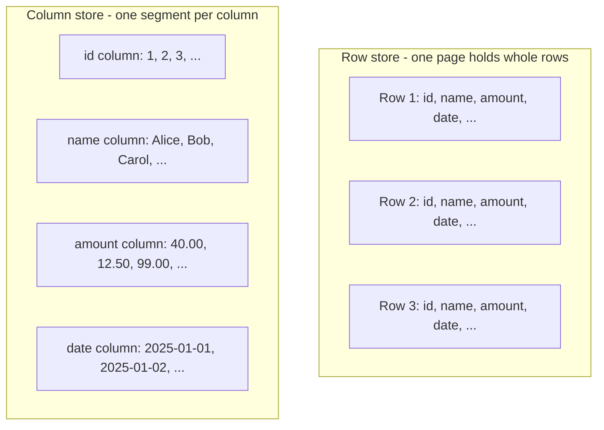
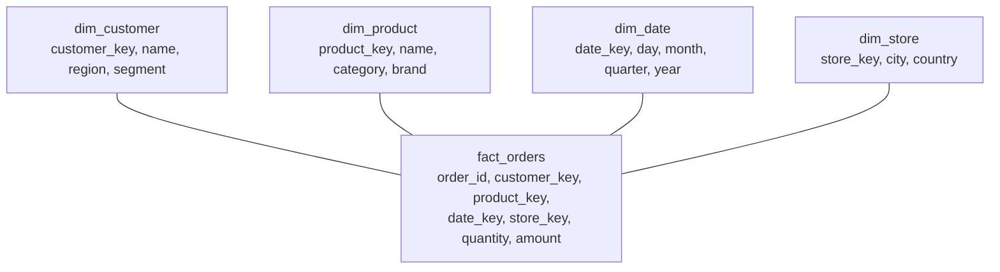

# OLTP vs OLAP

_Every prior L2 topic - the relational model, normalization, ACID, MVCC, locking, indexing, WAL, storage engines, query planning, connection pooling - was implicitly describing one shape of workload: many concurrent, short transactions reading and writing small slices of a database's current state. This topic names that shape explicitly (OLTP), contrasts it against a structurally different one (OLAP: few, large, scan-and-aggregate queries over historical or derived data), and works out - from first principles, not just by definition - why that difference in workload shape forces different answers to every physical question L2 has already raised: row-oriented or column-oriented storage, normalized or denormalized schema, write-optimized or scan-optimized engine. It is the last L2 topic because it is the synthesis: the same primitives (pages, indexes, WAL, MVCC, storage engines) recombine differently once the workload itself is different._

## Contents

- [What OLTP and OLAP are](#what-oltp-and-olap-are)
- [Why the distinction exists: workload shape drives physical design](#why-the-distinction-exists-workload-shape-drives-physical-design)
- [Row-oriented vs column-oriented storage](#row-oriented-vs-column-oriented-storage)
- [Inside a column store: compression, data skipping, vectorized execution](#inside-a-column-store-compression-data-skipping-vectorized-execution)
- [Schema modeling: normalized OLTP vs star/snowflake OLAP](#schema-modeling-normalized-oltp-vs-starsnowflake-olap)
- [Write-optimized vs scan-optimized engines](#write-optimized-vs-scan-optimized-engines)
- [Getting data from OLTP to OLAP: ETL, ELT, CDC, the warehouse](#getting-data-from-oltp-to-olap-etl-elt-cdc-the-warehouse)
- [Worked example: one aggregate query, row store vs column store](#worked-example-one-aggregate-query-row-store-vs-column-store)
- [Trade-offs](#trade-offs)
- [How this connects](#how-this-connects)
- [Check yourself](#check-yourself)
- [Real-world & sources](#real-world--sources)

## What OLTP and OLAP are

**OLTP (Online Transaction Processing)** is a database workload consisting of **many concurrent, short-lived transactions, each reading or writing a small amount of data, against the current, authoritative state of the business** - "what is customer 4,821's balance right now," "insert this one order," "decrement this one item's inventory count by one." OLTP is the workload every prior L2 topic was built around: ACID guarantees, MVCC snapshots, row/gap locking, B-tree/LSM indexes on primary and foreign keys, and a write-ahead log all exist to make many small, concurrent, correctness-sensitive transactions against shared mutable state both fast and safe.

**OLAP (Online Analytical Processing)** is a database workload consisting of **fewer, much larger queries that scan and aggregate over large volumes of historical or derived data to answer a business question** - "what was total revenue by region, by month, for the last two years," "how many distinct users completed a purchase after viewing this product." OLAP queries typically touch millions to billions of rows, often the *entire* contents of one or more large tables, and reduce that volume down to a small result (a handful of aggregated numbers, a chart's worth of data points), rather than pinpointing one row.

**The core distinction is workload shape**, and everything else in this topic follows from it:

| | OLTP | OLAP |
| --- | --- | --- |
| Query count | Very high (thousands-millions/sec at scale) | Low (seconds-minutes between queries, or scheduled) |
| Rows touched per query | A handful | Millions to billions |
| Columns touched per query | Usually most/all of a row (a full customer record, a full order) | Usually a small subset of a wide table's columns |
| Operation type | Point lookup, small range scan, single-row insert/update/delete | Full/partial table scan, aggregation (`SUM`, `COUNT`, `AVG`, `GROUP BY`), join across few large + several small tables |
| Data currency | The current, live, single source of truth | A historical or periodically/continuously refreshed copy, often minutes to hours behind the source |
| Concurrency shape | Many concurrent writers and readers of overlapping data | Mostly read-only against data already loaded; writes arrive in bulk, not from many independent concurrent transactions |

Note the phrase "historical or derived data" in OLAP's definition is doing real work: an OLAP system is very often *not* the system of record. It is a separate copy of data that originated in one or more OLTP systems, reshaped and loaded specifically to make large scan-and-aggregate queries fast - [how that copy gets there](#getting-data-from-oltp-to-olap-etl-elt-cdc-the-warehouse) is its own section below.

## Why the distinction exists: workload shape drives physical design

Nothing about "OLTP" or "OLAP" is an arbitrary label - each name describes a physical-design *conclusion* forced by the access pattern above, and every design choice traces back to one root cause: **OLTP needs to find and mutate a small number of specific rows, cheaply, over and over, concurrently, correctly; OLAP needs to read a small number of specific columns across a huge number of rows, as fast as raw I/O and CPU throughput allow, and rarely needs to mutate anything at query time at all.**

This single difference in access pattern cascades into every physical decision this topic covers:

- **Storage layout** - a workload that fetches whole rows wants row-oriented storage (all of a row's columns physically adjacent, one disk read gets the whole record); a workload that scans one or two columns across millions of rows wants column-oriented storage (only the touched columns are read from disk at all). [Detailed below](#row-oriented-vs-column-oriented-storage).
- **Indexing strategy** - OLTP leans on [B-tree/LSM indexes](08-indexing.md) built specifically to make point lookups and small range scans on selective predicates fast, at the cost of extra write overhead per index maintained on every insert/update. OLAP queries are frequently *not* selective at all (a `GROUP BY region` touches every row) - a traditional secondary index that helps find "the one row with `order_id = 4821`" does nothing to speed up "aggregate all 100 million rows," so OLAP systems favor block-level metadata (zone maps, min/max ranges) over row-level indexes, [covered below](#inside-a-column-store-compression-data-skipping-vectorized-execution).
- **Schema shape** - OLTP normalizes (already covered in [normalization](02-normalization-forms.md)) specifically to avoid update anomalies on the frequent, small writes that define the workload: change a customer's address once, in one place, and every order referencing that customer sees the update. OLAP denormalizes into a [star/snowflake schema](#schema-modeling-normalized-oltp-vs-starsnowflake-olap) specifically because its writes are infrequent bulk loads (anomalies from a badly-timed partial write are a pipeline-correctness problem to solve once, not a per-transaction concern) while its reads are frequent, large joins that a normalized schema would make disproportionately expensive.
- **Engine design** - OLTP engines (InnoDB, PostgreSQL's heap engine, [already covered](10-storage-engines.md)) are tuned to make a single row's write durable and visible fast, under concurrent access from many other transactions. OLAP engines are tuned to maximize scan throughput over data that, once loaded, is read far more often than it is modified - [covered below](#write-optimized-vs-scan-optimized-engines).

None of this is "OLAP is better" or "OLTP is outdated" - they are answers to two different questions, and a system tuned to answer one answers the other badly. A columnar OLAP engine asked to do 10,000 single-row point updates per second will perform far worse than InnoDB at that job; an OLTP row-store engine asked to `SUM()` one column across a billion-row table will read many times more bytes from disk than a column store would, for reasons made precise in the [worked example](#worked-example-one-aggregate-query-row-store-vs-column-store) below.

## Row-oriented vs column-oriented storage

**A row store (row-oriented storage) physically lays out data on disk one full row at a time** - all of a row's columns, stored contiguously, packed into [pages](10-storage-engines.md#pages-slots-tuples-the-physical-unit-of-storage) alongside other whole rows. This is what PostgreSQL's heap, InnoDB's clustered B+-tree, and essentially every mainstream OLTP engine already covered in this level does. Fetching one entire row (all columns) - the shape of an OLTP point lookup - costs roughly one page read regardless of how many columns the row has, because everything needed is already sitting together in that page.

**A column store (column-oriented storage) physically lays out data one column at a time** - every value belonging to a given column, across all rows, stored contiguously in its own file or segment, separate from every other column. Fetching *one column's* values across many rows is now cheap (sequential read of exactly that column's data, nothing else); fetching one *entire row* (every column for a single record) is now expensive, since its values are scattered across as many separate column segments as the table has columns.



This single layout choice is *the* structural reason OLTP engines default to row stores and OLAP engines default to column stores: OLTP's dominant access pattern (fetch/update one whole record) is exactly what row layout is optimized for, and OLAP's dominant access pattern (aggregate a couple of columns across every row) is exactly what column layout is optimized for. Running the "wrong" layout against a workload means paying for I/O the workload didn't ask for - a row store scanning for one column's aggregate still has to read every other column sitting in the same page; a column store fetching one full record has to open every column's segment and stitch a row back together, which is why pure column stores are a poor fit for OLTP's point-lookup/point-update pattern.

## Inside a column store: compression, data skipping, vectorized execution

Column-oriented layout doesn't just save I/O by skipping untouched columns - it unlocks three further mechanisms, each of which independently makes analytical scan-and-aggregate queries faster, and each of which depends specifically on values of the *same column* (hence the same type, and usually a narrower range of actual values) being physically adjacent:

- **Compression.** Values within one column are far more homogeneous than values within one row (a row mixes an integer ID, a string name, a decimal amount, a timestamp; a column is *only* integers, or *only* timestamps), and homogeneous data compresses dramatically better than mixed data. Common column-store encodings:
  - **Dictionary encoding** - a low-cardinality column (a `status` column with values like `pending`/`shipped`/`delivered`) is stored as a small dictionary of distinct values plus a compact array of integer codes referencing that dictionary, shrinking repeated strings down to a few bits each.
  - **Run-length encoding (RLE)** - a column that is sorted or naturally clustered (a `date` column loaded in arrival order, a `country` column after sorting) stores each repeated run of the same value once, plus a count, instead of storing the value once per row.
  - **Delta encoding** - a sorted or monotonically-increasing column (timestamps, auto-incrementing IDs) stores only the *difference* from the previous value, which is usually small and packs into far fewer bits than the full value.
  - **Bit-packing** - values known to fit in fewer bits than their nominal type (a column of small integers stored in a 64-bit type) are packed down to only the bits actually needed.
  Column stores routinely achieve 5-10x compression and sometimes substantially more on well-suited columns (`verify` exact ratios, since they are heavily data- and encoding-dependent) - directly cutting the bytes that must be read from disk and decompressed per query, on top of the "only read the touched columns" saving above.
- **Data skipping via zone maps / min-max metadata.** Because column values are stored in contiguous blocks (often sorted or clustered by a chosen key), the engine can cheaply keep, per block, a small amount of metadata - the block's minimum and maximum value for that column (a **zone map**, also called min-max index or block index). A query with a selective predicate (`WHERE order_date >= '2025-06-01'`) can check each block's zone map first and skip reading the block entirely if its max value is below the filter's lower bound - no row-level index lookup needed, because the check happens at the much coarser granularity of "does this whole block possibly contain a match," which is nearly free compared to actually decompressing and scanning it.
- **Vectorized execution.** A classic row-oriented query executor processes one row at a time (the "Volcano"/iterator model: each operator's `next()` call produces a single row, pulled up through the operator tree one row at a time), which means per-row interpretation overhead (a function call, a type dispatch, a branch) is paid once per row. A column-oriented engine instead processes a **batch ("vector") of values from one column at once** - commonly on the order of 1,024-4,096 values per batch (`verify` exact default batch sizes across engines, since they vary by implementation) - running one tight, type-specialized loop over the whole batch (e.g. summing 1,024 doubles) rather than one interpreted step per row. This is both cache-friendlier (the batch is a contiguous run of memory, matching how the column is already stored) and friendlier to CPU **SIMD** (single-instruction-multiple-data) execution, where one CPU instruction can operate on several values in one register at once - neither optimization is available to a row-at-a-time executor pulling scattered, mixed-type values out of whole-row pages.

Together, these three mechanisms are *why* a column store "crushes" an aggregate query relative to a row store: it reads fewer bytes (only touched columns), reads even fewer of those bytes after skipping whole blocks that can't match, and processes what remains with far less per-value overhead than a row-at-a-time engine can achieve.

## Schema modeling: normalized OLTP vs star/snowflake OLAP

OLTP schemas [normalize](02-normalization-forms.md) to eliminate update anomalies on frequent small writes - a customer's address lives in exactly one row of one `customers` table, referenced by foreign key from every order, so updating it once is correct and cheap. This is the right trade for a workload dominated by many small, concurrent writes to current state.

OLAP schemas commonly use a **star schema** instead: one large **fact table** at the center, holding one row per business event (an order line item, a page view, a payment) - mostly foreign keys plus numeric **measures** (quantity, amount, duration) - surrounded by several much smaller **dimension tables**, each holding descriptive, largely static attributes about one axis of analysis (`dim_customer`, `dim_product`, `dim_date`, `dim_store`).



A **snowflake schema** is the same idea with dimension tables *further* normalized (e.g. `dim_product` splitting into `dim_product` -> `dim_category` -> `dim_department`), trading some storage and denormalization back for normalized dimensions - at the cost of extra joins per query, which is exactly the cost a star schema is designed to avoid. Star schemas are the far more common default in practice specifically because dimension tables are small (thousands to low millions of rows, not billions) and rarely change, so the storage/anomaly cost normalization would save is minor, while the join-avoidance benefit at query time (aggregating a billion-row fact table against a handful of small, easily-broadcast dimension tables - the "star join" pattern most analytical query engines specifically recognize and optimize for) is large.

One more modeling concept specific to fact tables: **grain** - the precise level of detail one fact row represents (e.g. "one row per order line item," not "one row per order," not "one row per customer per day"). Choosing the grain correctly up front is the single most consequential OLAP modeling decision, since every measure and every dimension in the fact table must be true *at that grain* - mixing grains in one fact table (some rows at order level, others at line-item level) breaks every aggregate query built on top of it.

## Write-optimized vs scan-optimized engines

The engine families [already covered in Storage Engines](10-storage-engines.md) - [B-tree](10-storage-engines.md#b-tree-storage-engines-the-write-path-and-read-path-end-to-end) and [LSM-tree](10-storage-engines.md#lsm-tree-storage-engines-the-write-path-and-read-path-end-to-end) - are both **write-optimized, row-oriented** designs: B-trees update pages in place to keep point lookups fast; LSM-trees buffer writes in memory and flush/compact them to keep random writes cheap. Both are built around the OLTP assumption that individual rows are inserted, updated, and looked up constantly and unpredictably.

Column stores form a third, **scan-optimized** engine family, and they make a structurally different trade: writes typically arrive in **large, infrequent batches** (a bulk load, a scheduled ETL/CDC job flushing minutes or hours of accumulated changes at once - see the [next section](#getting-data-from-oltp-to-olap-etl-elt-cdc-the-warehouse)) rather than one row at a time from many independent concurrent transactions. This lets a column engine organize storage around **large, immutable, sorted column segments** - not unlike an LSM-tree's immutable SSTables, but partitioned by column rather than by row, and typically merged/compacted on a much slower cadence since new data arrives in batches, not a continuous trickle of single-row writes. Because a single incoming row's values must be split across every column's segment on write, and a single point update would require rewriting compressed, immutable segments rather than modifying one page in place, column stores are comparatively expensive at exactly the operation (fast, frequent, single-row point writes) that B-tree/LSM engines are built around - which is the mechanical reason a column store is a poor OLTP engine, and a row-oriented B-tree/LSM engine is a poor fit for billion-row aggregate scans.

## Getting data from OLTP to OLAP: ETL, ELT, CDC, the warehouse

Since OLAP commonly runs on historical/derived data rather than the live system of record, something has to move data from the OLTP source into the OLAP system - this section connects the concept just enough to bridge into where it's covered in depth (L11 for pipelines/lakehouse, L4 for real-time OLAP), without duplicating that material here:

- **ETL (Extract, Transform, Load)** - data is extracted from the OLTP source, **transformed** in a separate processing step (cleaned, reshaped into the star/snowflake schema above, aggregated) *before* being loaded into the target warehouse. The transform step happens outside the destination system, historically because the destination's own compute was the scarce/expensive resource.
- **ELT (Extract, Load, Transform)** - the same raw data is extracted and **loaded first**, in its raw or near-raw form, directly into the destination warehouse, and transformation happens *afterward*, using the warehouse's own (typically abundant, elastic, columnar) compute. ELT has become the more common pattern as cloud OLAP warehouses made in-warehouse transform compute cheap and easy to scale up temporarily.
- **CDC (change data capture)** - rather than periodically re-extracting a full or incremental batch (a nightly dump), CDC tails the OLTP database's own [write-ahead log or binlog](09-write-ahead-log.md) (PostgreSQL logical replication slots, MySQL's binlog via a tool like Debezium) to stream every committed row-level change continuously to downstream consumers, closing the gap between "the OLTP source changed" and "the OLAP copy reflects it" from a batch window (hours) down to seconds - the mechanism underlying most modern real-time/near-real-time analytics pipelines.
- **The data warehouse** itself is the OLAP-side destination system these pipelines feed - typically modeled with the star/snowflake schemas above, and queried by BI tools and analysts rather than application code. Full treatment of pipeline architecture, lakehouse table formats, and warehouse internals is deferred to **L11 (data pipelines/lakehouse)**; real-time OLAP engines built to keep this gap small are deferred to **L4 (Pinot, Druid, ClickHouse)**.

## Worked example: one aggregate query, row store vs column store

A 20-column `orders` table holds **100 million rows**, average row width **200 bytes** (so ~20 GB of raw table data). The query is:

```
SELECT SUM(amount) FROM orders WHERE order_date >= '2025-06-01';
```

only two of the table's twenty columns (`amount`, `order_date`) matter to this query.

**Row store, no covering index (a full table scan):**

```
bytes read = row_count x row_width
           = 100,000,000 x 200 bytes
           = 20,000,000,000 bytes  (~20 GB)
```

Every one of the 20 columns in every row is read from disk/buffer pool, because a row store's pages hold whole rows - there is no way to read `amount` and `order_date` without also reading the other 18 columns physically packed into the same page alongside them.

**Column store, same query:**

```
amount column:      100,000,000 rows x 8 bytes (double)  = 800,000,000 bytes (~800 MB)
order_date column:   100,000,000 rows x 4 bytes (date)     = 400,000,000 bytes (~400 MB)
raw bytes touched (2 of 20 columns only)                   = ~1.2 GB
```

Already roughly **17x less data read** than the row store's full 20 GB, purely from skipping the 18 untouched columns. Layer on the two further column-store mechanisms:

- **Compression** - a sorted or clustered `order_date` column compresses well under delta/RLE encoding (`verify` exact ratio, data-dependent), and `amount` compresses moderately under standard numeric encodings; a combined 2-4x reduction on the already-reduced 1.2 GB is a realistic ballpark, landing actual bytes read somewhere in the **300-600 MB** range.
- **Data skipping via zone maps** - if the table's blocks are sorted or clustered by `order_date`, every block whose max `order_date` falls before `2025-06-01` can be skipped entirely without decompressing it at all, cutting the *effective* scan volume further depending on what fraction of the table's date range the filter actually selects.

Net effect: a query that reads roughly **20 GB** in a row store reads somewhere on the order of a few hundred MB to low GB in a column store for the identical logical result - a difference of one to two orders of magnitude, before even counting the throughput advantage of [vectorized execution](#inside-a-column-store-compression-data-skipping-vectorized-execution) summing the surviving `amount` values in batches instead of one row at a time. This is the concrete, mechanical reason "just run the analytics query against the production row-store database" scales poorly as data volume grows, and why OLAP systems exist as a physically different kind of engine rather than just "the same database, but with a bigger box."

## Trade-offs

| | OLTP | OLAP |
| --- | --- | --- |
| **Consistency needs** | Strong - full ACID, [MVCC](06-mvcc.md)/[locking](07-locking.md) to correctly serialize many concurrent writers on shared current state | Looser - typically single-writer bulk loads, not many concurrent transactional writers; freshness (how stale the copy is) matters more than serializability |
| **Query pattern** | Point lookups, small range scans, single-row inserts/updates/deletes | Full/partial scans, `GROUP BY`/aggregation, joins of one large fact table against several small dimension tables |
| **Latency target** | Milliseconds, per query, at very high query rates | Seconds to minutes per query, at low query rates |
| **Storage layout** | Row-oriented ([heap/B-tree/LSM](10-storage-engines.md)) - whole-row locality | Column-oriented - per-column locality, compression, zone maps |
| **Schema shape** | Normalized (3NF), [avoids update anomalies](02-normalization-forms.md) | Star/snowflake - denormalized fact + dimension tables, modeled around a chosen grain |
| **Indexing** | Heavy use of B-tree/LSM indexes on PK/FK/selective predicates | Minimal row-level indexing; relies on block-level zone maps and sort/partition keys instead |
| **Write pattern** | Many small, concurrent, low-latency writes | Infrequent large batch loads (ETL/ELT/CDC-fed) |
| **Scale characteristic** | Scales by adding read replicas, sharding by key, [connection pooling](12-connection-pooling.md) for high concurrency | Scales by adding scan/compute nodes (MPP), partitioning/clustering large fact tables |
| **Typical technology** | PostgreSQL, MySQL/InnoDB, Oracle, DynamoDB | Redshift, Snowflake, BigQuery, ClickHouse, Druid, Pinot |

## How this connects

- **Back to ACID and MVCC** - [ACID](04-acid.md) and [MVCC](06-mvcc.md) exist specifically to make many concurrent, small, correctness-sensitive writers on shared current state safe - exactly OLTP's shape. OLAP's read-mostly, single-bulk-writer pattern needs far less of this machinery at query time, which is part of why OLAP systems can spend their engineering budget on compression and vectorization instead.
- **Back to indexing** - [B-tree/LSM secondary indexes](08-indexing.md) earn their write-overhead cost by making OLTP's *selective* point lookups fast; an OLAP `GROUP BY` touching every row gets little benefit from a row-level index and instead relies on the [zone maps/data skipping](#inside-a-column-store-compression-data-skipping-vectorized-execution) covered above - a different tool for a workload with a fundamentally different selectivity profile.
- **Back to storage engines** - row-oriented [B-tree and LSM engines](10-storage-engines.md) are OLTP's write-optimized engine family; the column store described in this topic is best understood as a third engine family, evaluated against the same write/read/space-amplification lens storage engines already introduced, just optimized for the opposite end of that trade-off.
- **Back to connection pooling** - [as connection pooling itself named forward](12-connection-pooling.md#forward-to-oltp-vs-olap), a pool tuned around OLTP's fast, high-turnover transactions is a poor fit for a long-running analytical query holding a connection open for minutes, which is one concrete reason OLAP workloads are commonly routed through a separate pool, or a separate system entirely.
- **Forward to L4 (real-time OLAP, NoSQL & data at scale)** - engines like **Druid**, **Pinot**, and **ClickHouse** exist specifically to shrink the gap this topic describes between "OLTP writes happen" and "OLAP query sees them," offering near-real-time ingestion alongside fast columnar analytical queries; **HTAP** (hybrid transactional/analytical processing) systems go further, attempting to serve both workload shapes from one system (often via a row-oriented delta store for fresh writes plus background conversion into columnar storage for scans).
- **Forward to L11 (data pipelines / lakehouse)** - the [ETL/ELT/CDC](#getting-data-from-oltp-to-olap-etl-elt-cdc-the-warehouse) mechanisms sketched here to move data from OLTP into OLAP get full architectural treatment there, including lakehouse table formats (Parquet, Iceberg, Delta Lake) that generalize the columnar-storage idea beyond a single warehouse product.
- **Forward to L13 (real-time analytics)** - extends the OLAP side of this topic into streaming/continuous analytical processing, building on the CDC and real-time OLAP concepts introduced here.

## Check yourself

- A table has 30 columns and a query aggregates just one of them across every row. Explain, in terms of physical page/segment layout, why a row store must read all 30 columns' worth of bytes while a column store reads roughly 1/30th as much - and name two further column-store mechanisms that shrink that further.
- Why does a star schema's fact table get denormalized while its dimension tables stay small and separate, instead of just normalizing everything (OLTP-style) or flattening everything into one giant table?
- A column store's writes typically arrive as large, infrequent batches rather than continuous single-row writes. Explain why this engine design choice makes column stores a poor fit for OLTP's point-update workload.
- What does a zone map (min-max index) let an OLAP engine skip, and why doesn't it require maintaining a traditional B-tree secondary index to do it?
- Explain the difference between ETL and ELT in terms of *where* the transform step's compute happens, and why CDC closes the OLTP-to-OLAP freshness gap further than either.

## Real-world & sources

**Stripe (fintech) - real-time OLAP replacing batch lag.** Stripe Billing's original analytics pipeline recomputed subscription/invoice metrics in batch, giving customer-facing dashboards "a 24-hour average lag." Stripe rebuilt it as an event-driven pipeline: **Apache Flink** consumes a stream of subscription/invoice change events and incrementally maintains a compressed subscription-history state (with **Apache Spark** used once to backfill that state from historical events), feeding an **Apache Pinot** v2 OLAP store that supports flexible windowed aggregations without pre-aggregating every metric offline. Result: most updates are visible in well under a minute (with a stated worst case around 15 minutes), and user-facing dashboard queries return in under 300ms. This is a clean real-world instance of the OLTP-to-OLAP freshness gap this topic describes (["Getting data from OLTP to OLAP"](#getting-data-from-oltp-to-olap-etl-elt-cdc-the-warehouse)) being closed with streaming CDC-style ingestion plus a purpose-built real-time OLAP engine, rather than nightly batch ETL into a traditional warehouse.
Source: [How we built it: Real-time analytics for Stripe Billing - Stripe Dot Dev Blog](https://stripe.dev/blog/how-we-built-it-real-time-analytics-for-stripe-billing) (fetched 2026-07-14).

**Uber - the canonical "OLTP MySQL fleet + separate OLAP warehouse, connected by CDC" evolution.** Uber's OLTP layer today is **2,300+ independent MySQL clusters** (`verify` current exact count, self-reported and likely to change over time) serving live transactional traffic; row-level changes are captured off each cluster's binlog by an in-house tool (**Storagetapper**), streamed through **Apache Kafka**, and landed in **Apache Hive** for analytics - a direct, named example of the [CDC pattern](#getting-data-from-oltp-to-olap-etl-elt-cdc-the-warehouse) this topic describes. Uber's separate "Big Data Platform" writeup traces the OLAP side's own evolution: pre-2014, analytics ran ad hoc, directly against scattered OLTP MySQL/PostgreSQL databases holding "a few terabytes"; Uber then stood up **Vertica** (chosen for its columnar, scan-optimized design) as a dedicated warehouse fed by ETL jobs, which grew to "tens of terabytes" within months; by the next generation this moved to a Hadoop-based lake (ingestion via Uber's open-source **Marmaray**) reaching "100+ petabytes" of analytical data served through **Presto** (interactive ad hoc SQL), **Spark** (programmatic access), and **Hive** (very large batch queries) - entirely isolated from the OLTP clusters. This is a good worked illustration of [why a column-oriented, scan-optimized OLAP system is a separate piece of infrastructure](#write-optimized-vs-scan-optimized-engines) rather than just "a bigger OLTP database."
Sources: [MySQL at Uber - Uber Blog](https://www.uber.com/en/blog/mysql-at-uber/) and [Uber's Big Data Platform: 100+ Petabytes with Minute Latency - Uber Blog](https://www.uber.com/us/en/blog/uber-big-data-platform/) (both fetched 2026-07-14).

**The Postgres + ClickHouse pattern as today's de facto default.** ClickHouse's own engineering write-up on unifying OLTP/OLAP frames the industry's converged pattern as "separate OLTP and OLAP systems connected by data pipelines" - a transactional store (commonly PostgreSQL) paired with a columnar OLAP engine (ClickHouse), synchronized by CDC, with modern CDC replication latency down to roughly 10 seconds (down from the hours-long batch windows of older ETL). The piece names several companies actually running this pattern in production, including **Ashby** (migrated from Postgres read replicas to ClickHouse via CDC, moving analytics queries from "minutes" to "under a second") and **Syntage** (CDC-migrated a 30 TB Aurora Postgres database into the same architecture). Note this source is vendor-published (ClickHouse) rather than independent, though the named customer case studies and the general "OLTP + OLAP + CDC" pattern it documents are consistent with the Stripe and Uber examples above - it's included as a third, differently-sourced perspective on the same architectural pattern, not as a substitute for a first-party engineering post from each named company.
Source: [Unifying OLTP and OLAP - ClickHouse Engineering Resource Hub](https://clickhouse.com/resources/engineering/unifying-oltp-and-olap) (fetched 2026-07-14).

**On India's UPI/NPCI:** no first-party NPCI engineering blog post describing an explicit OLTP-vs-OLAP system split was found in this sweep. A secondary write-up (ZenML's LLMOps case-study database) describes NPCI's fraud-detection platform running transactional Kafka event streams alongside parallel stream/batch analytics paths into object storage queried via Apache Superset, with figures like 240,000 requests/sec and 24 billion transactions/month - but since it is a third-party interpretation rather than NPCI's own technical documentation, those specifics are flagged `verify`/unconfirmed rather than cited as established fact here. If a first-party NPCI/RBI source surfaces later, this section should be revisited.
