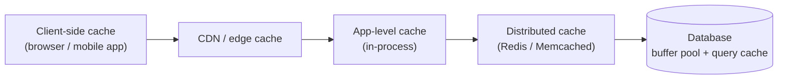
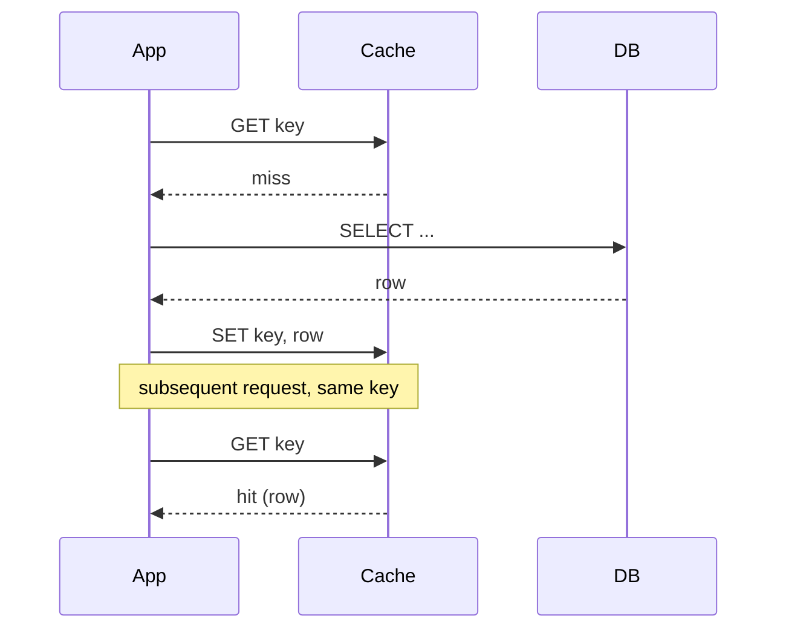
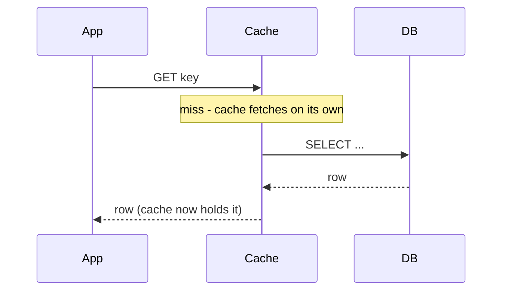
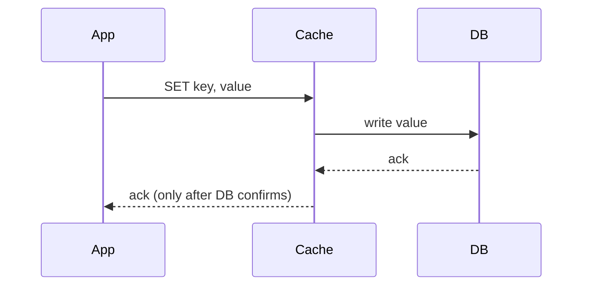
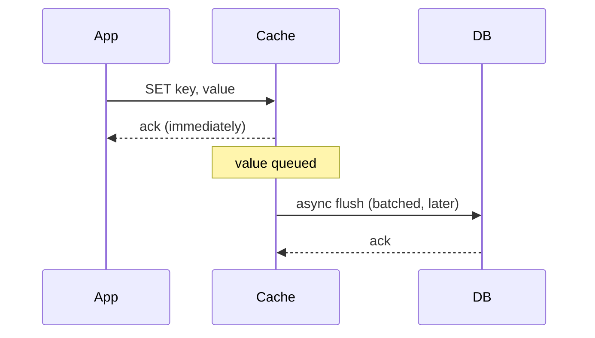

# Caching Layers and Strategies

_This is the opening topic of L3 (Caching and Data Access), and it sits directly on top of L2's storage-engine material: a database's own buffer pool - covered there as the in-memory page cache every B-tree/LSM engine keeps in front of disk - is itself one instance of the general idea this topic names precisely. Every later L3 topic (eviction policies, Redis vs Memcached, cache stampede, cache coherence/invalidation) is a refinement of a question this topic raises first: once you decide to keep a copy of data somewhere faster than the source of truth, where does that copy live, and who is responsible for keeping it correct?_

## Contents

- [What a cache is, and why it exists](#what-a-cache-is-and-why-it-exists)
- [Cache hits, misses, and hit ratio](#cache-hits-misses-and-hit-ratio)
- [The caching layers: where a cache sits in a request path](#the-caching-layers-where-a-cache-sits-in-a-request-path)
- [Client-side caching](#client-side-caching)
- [CDN / edge caching](#cdn--edge-caching)
- [Application-level caching: in-process vs. distributed](#application-level-caching-in-process-vs-distributed)
- [Database-level caching: buffer pool and query cache](#database-level-caching-buffer-pool-and-query-cache)
- [The four population/consistency strategies](#the-four-populationconsistency-strategies)
- [Cache-aside (lazy loading)](#cache-aside-lazy-loading)
- [Read-through](#read-through)
- [Write-through](#write-through)
- [Write-back (write-behind)](#write-back-write-behind)
- [Combining strategies in practice](#combining-strategies-in-practice)
- [Worked example: one request, every layer](#worked-example-one-request-every-layer)
- [Trade-offs](#trade-offs)
- [How this connects](#how-this-connects)
- [Check yourself](#check-yourself)
- [Real-world & sources](#real-world--sources)

## What a cache is, and why it exists

A **cache** is a smaller, faster storage layer that holds a copy of data normally kept in a slower, larger, authoritative **backing store** (the **source of truth** - usually a database, but it could be another service, a filesystem, or a computed result). The point of a cache is never to replace the source of truth; it exists purely to **shortcut the trip to it** for data that's likely to be requested again soon.

The reason this shortcut is worth the added complexity is a hard physical fact about computing, not a design preference: every layer of storage between a CPU register and a remote database is roughly **one to three orders of magnitude slower and one to three orders of magnitude larger** than the layer above it.

| Layer | Rough access latency | Rough capacity |
| --- | --- | --- |
| CPU register / L1 cache | ~1 ns | Kilobytes |
| Main memory (RAM) | ~100 ns | Gigabytes |
| Local SSD | ~50-150 us | Terabytes |
| Same-datacenter network round trip (e.g. to Redis) | ~0.5-2 ms | - |
| Local spinning disk seek | ~5-10 ms | Terabytes |
| Cross-region network round trip | ~50-150 ms | - |

(`verify` exact figures vary by hardware generation and network path; the orders-of-magnitude relationship between the rows is the durable fact, not any single number.)

A request that can be satisfied from RAM (a distributed cache, or even a database's own buffer pool) instead of from disk, or from a nearby cache instead of a cross-region database call, is not "a bit faster" - it is often **10-1000x faster**, and it also means the backing store never sees that request at all. That second effect matters as much as latency: a database that would fall over at 100,000 reads/sec can comfortably serve 100,000 reads/sec of *cache hits* plus only the much smaller trickle of cache misses that actually need it. Caching is therefore a **three-way trade**, not just a latency trick:

- **Latency** - a cache hit is answered from a faster medium than the source of truth.
- **Throughput** - every hit is a request the backing store never has to process, raising the system's effective capacity without adding backing-store hardware.
- **Cost** - fast memory (RAM) is far more expensive per byte than disk, and a distributed cache is another piece of infrastructure to run, monitor, and pay for - so caching only earns its cost when a meaningful fraction of requests actually re-request the same data.

That last point is the reason caching isn't free lunch: a cache holding data that's almost never requested twice is pure overhead - the write-then-evict churn costs memory and complexity for a benefit that never materializes. Whether a cache is worth having at all is answered by the next section's central metric.

## Cache hits, misses, and hit ratio

- **Cache hit** - the requested data was found in the cache; the request is satisfied without touching the backing store.
- **Cache miss** - the requested data was not in the cache (never cached, expired, or evicted); the system must fall back to the backing store, and - depending on the [strategy in use](#the-four-populationconsistency-strategies) - usually takes that opportunity to populate the cache so the *next* request for the same key is a hit.
- **Hit ratio** - `hits / (hits + misses)`, expressed as a percentage. This is the single number that tells you whether a cache is doing its job: a 99% hit ratio means only 1% of requests ever reach the backing store, a huge load-shedding effect; a 40% hit ratio means the cache is barely helping and may not be worth its cost and failure surface.

Hit ratio is driven by two things working together, and it's worth separating them because they call for different fixes:

- **Access-pattern skew** - real-world request distributions are rarely uniform (a small "hot set" of keys - a trending product, a celebrity's profile, this week's payroll run - receives a disproportionate share of requests; a classic 80/20-shaped, or Zipfian, distribution). A cache only needs to hold the hot set to capture most of the traffic; caching the long tail buys almost nothing per byte of memory spent.
- **Cache capacity and eviction** - if the cache is too small to hold the hot set, or evicts entries that are still hot (the subject of the next L3 topic, [eviction policies](#how-this-connects)), hit ratio suffers even though the underlying access pattern would otherwise support a high one.

Production caches at companies operating at scale routinely report hit ratios **above 99%** on well-tuned hot-path lookups (see Uber's example in [Real-world & sources](#real-world--sources)) - a useful benchmark for "this cache is earning its keep," versus a cache sitting in the 50-70% range, which is often a sign the wrong data is being cached, the TTL is miscalibrated, or the cache is simply too small for its working set.

## The caching layers: where a cache sits in a request path

"Caching" is not one thing bolted onto a system in one place - a single end-to-end request can pass through **five distinct layers**, each caching the same conceptual data at a different point between the client and the database, each trading off differently on latency, freshness, and how many other requests share the copy.

Each layer that can answer a request means the layers to its right never see that request at all - the whole point of stacking caches is that most traffic gets absorbed well before it reaches the slowest, most contended, hardest-to-scale layer: the database itself.

### Client-side caching

The cache lives **on the requesting device** - a browser's HTTP cache (governed by `Cache-Control`/`ETag` response headers), a mobile app's local on-disk or in-memory cache, or a browser's `localStorage`/`IndexedDB`. This is the only layer that can avoid the network entirely: a hit here costs zero round trips. It is also the layer with the **least central control** - the server can suggest a TTL via response headers, but ultimately each client decides independently whether to honor it, and the operator has no way to force an immediate invalidation across every device that cached a value (a stale value sits on a phone until its TTL expires or the app is opened again with a network path available to revalidate). Best suited to data that changes rarely relative to how often it's read (static assets, a user's own profile picture, app configuration) and where a short window of staleness after a server-side change is acceptable.

### CDN / edge caching

A **content delivery network** caches responses at points-of-presence (PoPs) physically distributed near end users, so a request that would otherwise cross a continent to reach an origin server instead round-trips to a nearby edge location. This is the layer most naturally suited to content that is identical for many users (static assets, images, video segments, and increasingly - with care around personalization - full API responses), because one cached copy at one edge location serves every nearby client, unlike client-side caching where every device holds its own separate copy. CDN caching, its invalidation mechanisms, and its interaction with origin servers get full treatment in **L1 (network fundamentals)**; it's named here only to complete the picture of where a cache can sit in a request's path.

### Application-level caching: in-process vs. distributed

This is the layer application code interacts with most directly, and it splits into two meaningfully different shapes:

- **In-process (local) cache** - a plain in-memory data structure (a hash map, an LRU-backed library) living inside a single running application process. This is the **fastest possible cache** available to application code - no network hop at all, just a memory access measured in the same tens-to-hundreds of nanoseconds as any other in-process memory read. Its defining limitation: it is **private to that one process**. If an application runs 50 instances behind a load balancer, each instance builds and holds its own separate copy of the same logical cache - meaning 50x the total memory footprint for the same hot set, and no way for one instance's write or invalidation to be seen by the other 49 without an extra mechanism (a pub/sub invalidation broadcast, a shared TTL short enough that staleness self-heals, or moving that data to a distributed cache instead).
- **Distributed cache** - a shared caching service (Redis, Memcached) that every application instance talks to over the network as a separate system, so there is exactly **one logical copy** of a given cached value regardless of how many app instances are running. This costs a network round trip per access (typically sub-millisecond to a few milliseconds within the same datacenter) compared to an in-process cache's near-zero cost, but it buys **consistency across instances** (all 50 instances see the same cached value, and one instance's write/invalidation is immediately visible to the rest) and **shared capacity** (the hot set is held once, not once per instance). Redis and Memcached specifically - their internal designs and when to choose one over the other - are the subject of a dedicated later L3 topic.

The two are not mutually exclusive: a common production pattern is a small in-process cache in front of a distributed cache (an "L1/L2" cache hierarchy, directly analogous to CPU cache levels), trading a little consistency risk for shaving off the distributed cache's network hop on the very hottest keys.

### Database-level caching: buffer pool and query cache

The database engine itself caches, one layer below everything above:

- **Buffer pool** - the in-memory cache of disk **pages** that every mainstream storage engine (InnoDB, PostgreSQL's shared buffers) maintains, already covered in L2's [storage engines](../L2/10-storage-engines.md) topic. A page already resident in the buffer pool means a query is satisfied from RAM instead of issuing a disk read; this is the reason database performance often degrades sharply once a working set no longer fits in available buffer-pool memory - the gap between "resident" and "not resident" is exactly the RAM-vs-disk gap from the latency table above.
- **Query cache** - a cache of complete query *result sets*, keyed on the literal query text (or an equivalent normalized form), so an identical repeated query can be answered without re-executing it at all. This is a narrower, higher-risk tool than the buffer pool: any write to a table invalidates every cached result depending on it, which under a write-heavy workload can mean the cache is invalidated faster than it's ever reused - MySQL's built-in query cache became infamous for exactly this failure mode under concurrent writes and was removed entirely in MySQL 8.0 in favor of caching at the application/distributed-cache layer instead (`verify` MySQL 8.0 removal is well-documented; framing it as "infamous" is this document's characterization, not a quoted claim).

This layer sits closest to the source of truth, and unlike every layer above it, is entirely managed by the database engine rather than by application code - which is exactly why it's out of scope for the [four strategies](#the-four-populationconsistency-strategies) below: those describe choices *application-level and distributed* caches force on you, because the database's own buffer pool makes that choice internally and transparently.

## The four population/consistency strategies

Every layer above the database can be populated and kept consistent with its backing store in one of four ways. These four strategies are the actual engineering decision behind "add a cache" - they answer **who moves data between cache and backing store, and at what point in a read or write does that movement happen** - and the same four apply regardless of which layer (app-level in-process, distributed, or even a CDN with custom origin-fetch logic) is in use.

### Cache-aside (lazy loading)

**How it works.** The application owns all cache logic explicitly:

On a read, the application checks the cache first. On a miss, the application itself queries the backing store, and the application itself writes the result into the cache before returning it. On a write, cache-aside says nothing about the cache at all by default - the application writes the database directly, and separately decides whether to invalidate (delete) or update the now-stale cache entry.

**Who owns cache-population logic.** The application. The cache is a dumb key-value store with zero knowledge of the database schema, the query that produced a value, or when that value might have changed - every decision about what to cache, for how long, and when to refresh it lives in application code (or a thin library wrapping the same logic).

**Consistency and durability.** The cache is fully **disposable** - if it's lost entirely (a restart, a crash, a cold deploy), no data is lost, because the cache never held anything the database didn't already have durably; reads simply get slower (all misses) until the cache warms back up. The consistency risk is different in kind: between "the database was written" and "the cache entry was invalidated/updated," there is a **window where a stale value can still be served** to a concurrent reader.

**Failure mode - the read-write race.** The canonical cache-aside race: thread A reads a stale value from the database (say, during a concurrent write by thread B) and is about to write that stale value into the cache; meanwhile thread B's write completes and invalidates the cache entry; then thread A's delayed cache-write lands *after* the invalidation, leaving the **stale** value cached with no pending invalidation to correct it - a stale value that now sits in the cache until its TTL expires. This is why cache-aside deployments almost always still set a TTL even when using cache-aside primarily for latency rather than expiry, purely as a self-healing backstop against exactly this race.

### Read-through

**How it works.** Functionally, the same net effect as cache-aside from the caller's point of view, but the responsibility moves:

The application only ever talks to the cache - never directly to the database on the read path. On a miss, the **caching layer itself** (a library, a sidecar, or the cache server's own configured loader function) knows how to reach the backing store, fetches the value, populates the cache, and returns it - the application code never sees a miss as a distinct code path.

**Who owns cache-population logic.** The caching layer/library, not scattered application code. This centralizes the "how do I fetch this on a miss" logic in one place instead of duplicating it at every call site that might need the same data - valuable when many different services or code paths need the same cached entity and you don't want each one reimplementing its own miss-handling.

**Consistency, durability, and failure modes.** Identical to cache-aside in substance (same staleness window between a backing-store write and a cache update, same disposability), because a read-through cache is really cache-aside with the population code relocated from the application into the cache library. The practical trade-off is closer to convenience and consistency-of-implementation than to any different guarantee: read-through requires a caching layer smart enough to know how to reach the backing store itself (a real dependency on the specific cache library/product supporting a configurable loader), whereas cache-aside works with the dumbest possible cache, at the cost of that logic being duplicated wherever it's needed.

### Write-through

**How it works.** Every write is routed through the cache, which synchronously forwards it to the backing store before acknowledging the caller:

The application never writes the database directly - it writes the cache, and the cache is responsible for propagating that write to the backing store *before* telling the application the write succeeded.

**Who owns cache-population logic.** The cache/caching layer, on both the read and write side - the application's entire interaction is "read from cache" / "write to cache," with the cache layer handling backing-store synchronization transparently in both directions.

**Consistency and durability.** Strong: because the write is only acknowledged after the database confirms it, the cache and the backing store are **never observably out of sync** from any other reader's perspective - there's no window where a stale cached value and a newer database value can coexist, unlike cache-aside's invalidation-window race. The cost is paid in write latency: every write pays for **both** the cache write and the synchronous database write, back-to-back, rather than either alone.

**Failure mode.** If the synchronous database write fails or times out, the cache write must be rolled back or never committed in the first place (most implementations design this as "commit to cache only after DB ack," making the cache-side risk closer to "no worse than not caching at all" rather than a new failure mode) - the real cost here is latency and coupling (every write now depends on both systems being available), not silent data loss the way write-back below risks.

### Write-back (write-behind)

**How it works.** The write is acknowledged from the cache immediately, and the database is updated **asynchronously**, often batched, some time later:

The application gets the fastest possible write acknowledgment - as fast as the cache write itself, with the database entirely off the critical path. The cache accumulates a backlog of not-yet-flushed writes and pushes them to the backing store on its own schedule, frequently coalescing multiple writes to the same key into one database write (a further throughput win under hot, frequently-updated keys).

**Who owns cache-population logic.** The cache layer owns both the write buffering and the eventual flush - the application has no visibility into, or control over, exactly when a given write actually reaches the database.

**Consistency and durability.** The weakest of the four on both counts, and deliberately so, in exchange for the lowest possible write latency: the cache is now **ahead of** the database by design, for however long a write sits in the unflushed backlog. If the cache process crashes, is evicted under memory pressure, or the node hosting it is lost **before that backlog is flushed**, every write in the backlog is **lost permanently** - the database never received it, and the cache (the only place that ever held it) is gone. This is the sharpest failure mode among the four strategies, and it's why write-back is reserved for workloads that can tolerate that specific risk (write-heavy counters, analytics event ingestion, telemetry) rather than data whose loss is unacceptable (a financial ledger entry, an order confirmation).

## Combining strategies in practice

The four strategies are not mutually exclusive across a system's read and write paths - in fact, the most common production shape **mixes** them: **cache-aside reads paired with a write path that synchronously invalidates or updates the cache**, rather than picking one strategy and using it symmetrically for every read and write.

Why this combination is so common: cache-aside's simplicity and disposability make it the default for reads (most reads, most of the time, want the cheapest possible cache with the least coupling to the database engine). But cache-aside's *default* write behavior - write the database, then separately invalidate/update the cache - leaves the classic staleness window described above. Production systems close that gap by making the *invalidation* step of an otherwise cache-aside setup synchronous and tightly coupled to the write transaction (invalidate or update the cache entry as part of the same write path, rather than as an independent best-effort step after it) - borrowing write-through's "never let the cache get stale" guarantee, without paying write-through's full cost of routing every write *through* the cache as an intermediary. Uber's CacheFront (detailed in [Real-world & sources](#real-world--sources)) is a concrete, well-documented example of exactly this hybrid: cache-aside reads, plus a custom mechanism that makes cache invalidation synchronous and precise as part of every write.

## Worked example: one request, every layer

A user opens a product page on an e-commerce site they've visited before, on a device with no relevant client-side cache warm yet (first visit today):

1. **Client-side cache** - miss (nothing cached locally yet for this product). Request goes out over the network.
2. **CDN / edge** - the product page's static assets (images, CSS) are cache hits at the nearest edge PoP - maybe 5-20 ms round trip instead of 100+ ms to origin. The dynamic product-price/stock data is *not* cacheable at the CDN (it's personalized/frequently changing), so that part of the request continues to origin.
3. **App instance (in-process cache)** - the app server checks its own local in-memory cache for this product's data. Miss (this particular instance hasn't served this product recently, or another instance last cached it - in-process caches don't share).
4. **Distributed cache (Redis)** - the app queries Redis using cache-aside: `GET product:8214`. Hit - another instance's earlier read already populated Redis, sub-millisecond response. The database is never touched for this request at all.
5. **Database buffer pool** - not consulted this time, because step 4 already returned data - illustrating the point of stacking layers: each layer that hits means every layer to its right, including the database's own buffer pool, does zero work for this request.

Total cost for this request: a CDN hit (a few milliseconds) plus a Redis hit (under a millisecond) - versus what an all-miss path would have cost: CDN miss to origin, in-process miss, Redis miss, a database query that itself might be a buffer-pool miss requiring an actual disk read (5-10 ms) - a difference easily in the 10-100x range end to end, which is the concrete payoff caching is bought for.

## Trade-offs

| Strategy | Read latency | Write latency | Consistency | Data-loss risk | Complexity | Best for |
| --- | --- | --- | --- | --- | --- | --- |
| **Cache-aside** | Fast on hit; miss pays full backing-store cost, done in app code | Unaffected (writes go straight to DB); cache updated/invalidated separately | Staleness window between DB write and cache invalidation; race condition possible | Low - cache is fully disposable | App code owns population logic on every call site | Default, general-purpose read-heavy workloads |
| **Read-through** | Same as cache-aside | Usually paired with write-through or cache-aside-style writes | Same staleness window as cache-aside, centralized in the cache layer | Low | Population logic centralized in cache library, not app code | Many call sites needing the same cached entity without duplicating fetch logic |
| **Write-through** | Fast once populated (identical read path to the others) | Slow - pays for cache write **and** synchronous DB write, every time | Strong - cache and DB never observably diverge | Low - DB always has confirmed data before ack | Cache layer owns both read and write population | Correctness-critical writes that must be immediately reflected in subsequent reads |
| **Write-back (write-behind)** | Fast once populated | Fastest - acked from cache before DB write happens at all | Cache deliberately ahead of DB for the unflushed window | Highest - unflushed writes lost if cache fails before flush | Cache layer owns write buffering, batching, and flush scheduling | Write-heavy paths (counters, telemetry, event ingestion) tolerant of bounded data loss |

## How this connects

- **Back to L2 (storage engines)** - a database's [buffer pool](../L2/10-storage-engines.md#pages-slots-tuples-the-physical-unit-of-storage) is itself a cache (of disk pages, managed transparently by the engine) sitting one layer below everything this topic describes; the same latency-hierarchy logic that motivates an application-level cache (RAM is faster than disk) is exactly why the buffer pool exists inside the database in the first place.
- **Forward to eviction policies (LRU, LFU, TTL)** - every cache in this topic is finite; when it's full, something has to be evicted to make room for a new entry. Which entry gets evicted, and how TTL expiry interacts with that choice, is the very next L3 topic.
- **Forward to Redis vs. Memcached** - the [distributed cache](#application-level-caching-in-process-vs-distributed) layer named generically here gets a full comparison of the two dominant products, their internal data-structure and persistence differences, and when to choose one over the other.
- **Forward to cache stampede / dogpile / thundering herd** - this topic's [cache-aside race condition](#cache-aside-lazy-loading) is a narrow instance of a broader failure mode: what happens when a hot key expires or is evicted and many concurrent requests all miss at once and all hammer the backing store simultaneously - covered in depth as its own L3 topic.
- **Forward to cache coherence and invalidation** - the staleness window this topic flags for cache-aside/read-through, and the "who tells other caches a value changed" question implicit in the [in-process vs. distributed](#application-level-caching-in-process-vs-distributed) split, are generalized into their own topic covering invalidation protocols across multiple cache copies.
- **Forward to negative caching and CDN caching** - CDN/edge caching is introduced here only as a layer in the request path; its own mechanisms (cache-control headers, origin shielding, purge/invalidation) are a dedicated later L3 topic, as is caching the *absence* of data (negative caching) to protect against repeated misses for keys that don't exist.

## Check yourself

- Explain, using the latency-hierarchy numbers, why a distributed cache hit and a database buffer-pool miss can differ in cost by two to three orders of magnitude - and why that gap is the entire economic justification for caching.
- A team adds a distributed cache but observes a 45% hit ratio and no meaningful improvement in database load. Name two distinct root causes (one about the access pattern, one about the cache itself) that could each independently explain this.
- Walk through the cache-aside race condition step by step: which two operations interleave, and why does a TTL - even when caching isn't primarily being used for expiry - act as a backstop against it?
- Why is write-through's consistency guarantee strictly stronger than cache-aside's, and what latency cost is paid for that guarantee on every single write, not just some?
- A telemetry ingestion pipeline needs the lowest possible write latency and can tolerate losing a few seconds of data on a crash; a payment ledger cannot tolerate losing a single write. Which of the four strategies fits each, and why would swapping them be a mistake?
- An application has 50 instances behind a load balancer, each with its own in-process cache of the same lookup table. Describe the specific problem this creates that a distributed cache does not have, and name one mechanism that could mitigate it without giving up the in-process cache entirely.

## Real-world & sources

- **Uber - cache-aside reads + a custom synchronous write-invalidation protocol (CacheFront).** Uber's Docstore-backed CacheFront layer fronts MySQL with Redis using a textbook **cache-aside** read path: the query engine tries Redis first, and on a miss reads the storage engine directly and writes the row back into Redis. What makes it a real hybrid, not pure cache-aside, is the write path: Uber's storage engine was modified to return the exact set of row keys it changed (using strictly monotonic transaction timestamps), and the query engine uses that to synchronously invalidate the corresponding Redis entries as part of the write - closing the classic cache-aside staleness window that a simple "invalidate-then-hope" delete leaves open. This let Uber move from ~40M reads/sec to over **150M reads/sec** on the same underlying databases, with cache hit rates **above 99.9%** on many tables (some using a 24-hour TTL) and negligible staleness as measured by their internal "Cache Inspector" tool. This is a strong illustration of the "cache-aside reads + write-through-style writes" combination this topic calls out as the common production hybrid - just implemented at Uber's scale with a custom invalidation protocol rather than the textbook version. Source: [How Uber Serves over 150 Million Reads per Second from Integrated Cache with Stronger Consistency Guarantees](https://www.uber.com/en-IN/blog/how-uber-serves-over-150-million-reads/) (Uber Engineering Blog, accessed 2026-07-14).

- **Netflix - cache-aside (look-aside) via EVCache, with asynchronous cross-region write replication.** Netflix's EVCache (built on Memcached, tens of thousands of instances globally) is explicitly a **cache-aside** pattern: the application checks the cache, and on a miss fetches from the backing store and populates the cache itself - the cache library has no built-in knowledge of the database, matching this topic's definition exactly. Netflix layers an additional write concern on top for its multi-region deployment: a write to the local region's cache also publishes key metadata to Kafka, which a Replication Relay uses to asynchronously fetch the value and push it to other regions' caches - deliberately accepting **eventual consistency across regions** in exchange for keeping the hot path (local cache-aside reads/writes) fast. At Netflix's scale this handles peak traffic of roughly **30 million requests/sec** and just under **2 trillion requests/day** globally. Source: [Caching for a Global Netflix](https://netflixtechblog.com/caching-for-a-global-netflix-7bcc457012f1) (Netflix Technology Blog, accessed 2026-07-14).

- **Stripe - cache-aside-style response caching for idempotent payment retries.** Stripe's own engineering blog describes its idempotency-key mechanism in cache-aside terms without naming the specific backing store: a client-supplied idempotency key lets the server "correlate it with the state of the request," and on a retried request "the server simply replies with a cached result of the successful operation" rather than re-executing the charge - i.e., populate on first success, serve the cached response on every subsequent identical request, exactly the read-repopulate shape of cache-aside applied to write-safety rather than read latency. `verify`: the blog post itself does not confirm the storage backend (commonly reported elsewhere as Redis-backed) or an exact TTL, so this example is included for the *strategy pattern* (cache-aside-shaped idempotent response caching) rather than as confirmation of Stripe's specific infrastructure. Source: [Designing robust and predictable APIs with idempotency](https://stripe.com/blog/idempotency) (Stripe Engineering Blog, accessed 2026-07-14).

- **India's UPI/NPCI - skipped for this topic.** UPI's VPA (Virtual Payment Address)-to-account resolution is a highly plausible read-heavy caching use case at NPCI's scale, but no NPCI/RBI-published or reputable engineering source describing the actual caching strategy (cache-aside vs. write-through, TTLs, invalidation) could be found - only third-party/tutorial-style write-ups speculating about a Redis layer, none traceable to NPCI itself. Flagging this as an open gap rather than including an unverified claim.
