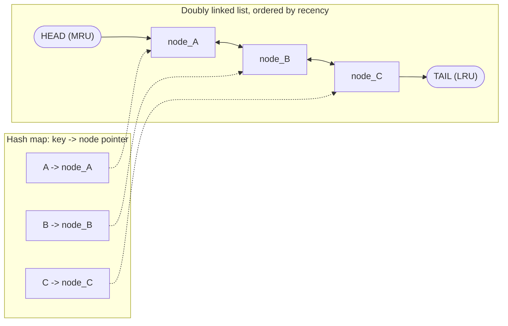
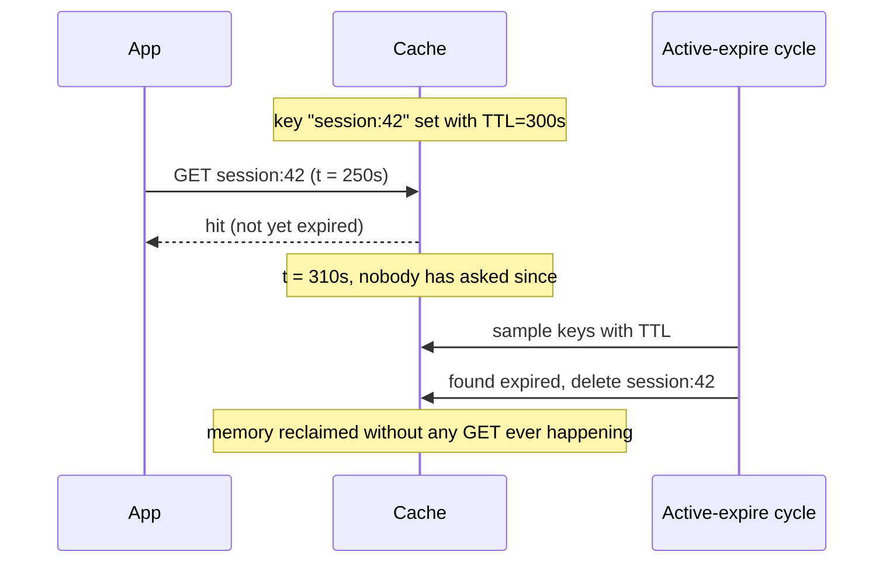

# Cache Eviction Policies

_This topic assumes [caching layers and strategies](01-caching-layers-strategies.md): you already know what a cache is, where it sits in a request path, and the four ways it can be populated/kept consistent (cache-aside, read-through, write-through, write-back). This topic answers the question that topic raised but didn't answer: every cache in that discussion is finite - so when it's full and a new entry needs room, **who gets evicted, and why**?_

## Contents

- [What eviction is, and why bounded caches need a policy](#what-eviction-is-and-why-bounded-caches-need-a-policy)
- [LRU: Least Recently Used](#lru-least-recently-used)
- [LFU: Least Frequently Used](#lfu-least-frequently-used)
- [TTL: time-based expiration](#ttl-time-based-expiration)
- [Thundering herd: mass expiry and the stampede risk](#thundering-herd-mass-expiry-and-the-stampede-risk)
- [Eviction meets the write strategies](#eviction-meets-the-write-strategies)
- [FIFO, Random, ARC, and Segmented LRU - briefly](#fifo-random-arc-and-segmented-lru---briefly)
- [Real systems: Redis and Memcached internals](#real-systems-redis-and-memcached-internals)
- [Worked example: a size-4 cache under mixed policies](#worked-example-a-size-4-cache-under-mixed-policies)
- [Trade-offs](#trade-offs)
- [How this connects](#how-this-connects)
- [Check yourself](#check-yourself)
- [Real-world & sources](#real-world--sources)

## What eviction is, and why bounded caches need a policy

A cache is deliberately **smaller than the backing store it fronts** - that's the whole reason it's fast (a cache that could hold everything the database holds would need as much memory as the database has disk, at RAM prices). "Smaller" means **finite capacity**, which means at some point the cache fills up: every slot holds a value, and a new key needs to be written in. Something has to give up its slot. **Eviction** is the act of removing an existing entry from a full cache to make room for a new one, and an **eviction policy** is the rule that decides *which* entry loses that slot.

This isn't an edge case to handle defensively - it's the *normal steady state* of any long-running cache with bounded memory and an ever-growing key space (every user ID, every product ID, every session ever created is a potential key). Once a cache reaches its configured memory limit, it stays at that limit essentially forever, evicting roughly one entry for every new entry admitted. The eviction policy is therefore not a rarely-exercised corner of the system - it's running continuously, and it is the single biggest lever on **hit ratio** (introduced in topic 01) short of just buying more memory: the same cache, same size, same workload can swing from a 95% hit ratio to a 60% hit ratio purely based on which entries the policy chooses to keep.

It's worth naming the one alternative to picking a policy at all: **refuse to evict**. Redis's actual default (`noeviction`) does exactly this - once memory is full, writes are rejected with an out-of-memory error instead of silently evicting anything, while reads keep working against whatever is already cached. That's a legitimate choice when *silently losing an entry* is worse than *a write failing loudly* (more on this in [eviction meets the write strategies](#eviction-meets-the-write-strategies)) - but for the overwhelming majority of caches, whose entire purpose is to keep absorbing new hot keys as old ones cool off, an active eviction policy is what makes the cache useful at all.

Every eviction policy is really answering one question with a different heuristic: **which entry is least likely to be requested again soon?** Evict that one, and you free a slot at the lowest possible cost to future hit ratio. No policy can know the *actual* future access pattern (that would require an oracle, and "evict whichever key won't be needed for the longest time" - Belady's optimal algorithm - is used only as an offline benchmark to grade real policies against, never as a real-time algorithm, since it requires knowing the future). Every real policy below is an approximation built on a different signal: **recency** (LRU), **frequency** (LFU), or **an explicit expiration deadline** (TTL) - and, as this topic will stress, these are not three competing choices to pick exactly one from; TTL in particular composes *with* LRU or LFU rather than replacing it.

## LRU: Least Recently Used

**The heuristic.** Recently accessed data is likely to be accessed again soon - a working-set assumption borne out by most real access patterns (a user actively browsing a product keeps re-requesting that same product's page for the next few minutes; a stock ticker's current price is read far more in the next second than a symbol nobody has queried in an hour). LRU evicts whichever entry has gone the **longest without being accessed** - not the oldest by insertion time, but the oldest by *last use*.

**How it works internally.** LRU's defining property is that both `get` and `put` run in **O(1)** time, achieved by combining two data structures that compensate for each other's weakness:

- A **hash map** from key to a pointer/reference into the second structure - gives O(1) lookup by key (a plain hash map's strength), but a hash map alone has no concept of order, so it can't answer "which entry was used longest ago" without a full scan.
- A **doubly linked list** ordered by recency, most-recently-used at the head and least-recently-used at the tail - gives O(1) insertion/removal/reordering *given a pointer to the node* (a linked list's strength: unlink and relink four pointers, no shifting), but a linked list alone has no O(1) way to find a given key's node without scanning.

Neither structure alone is O(1) for both operations; together, the hash map gets you to the node in O(1), and the node's own pointers let the linked list reorder in O(1) - that's the entire trick.

- **`get(key)`**: hash map lookup finds the node (O(1)); unlink the node from its current position (O(1), just pointer surgery) and re-insert it at the head (O(1)) - "used" always means "move to the front." Return the value.
- **`put(key, value)`**: if the key exists, update its value and move its node to the head (same as a `get`). If the key is new and the cache is at capacity, evict the **tail** node (the least-recently-used entry) - remove it from both the hash map and the list in O(1) - then insert the new key at the head in both structures.

Every operation touches a bounded, constant number of pointers - no scanning, no shifting, no re-sorting - which is exactly why LRU is the default choice when a policy needs to run on every single cache access at production request volumes.

**Weakness: scan pollution.** LRU's recency signal has one well-known failure mode: a single pass over many keys that are each touched exactly once (a full-table backup scan, a batch export job, a one-off analytics query sweeping every user record) pushes every one of those cold, one-touch keys to the head of the list - evicting the entire genuinely-hot working set to make room for data that will *never be asked for again*. LRU has no way to distinguish "just accessed, about to be accessed again" from "just accessed, once, never again" - recency alone can't tell them apart. This is the specific problem [Segmented LRU](#fifo-random-arc-and-segmented-lru---briefly) exists to fix.

## LFU: Least Frequently Used

**The heuristic.** Instead of "when was this last used," LFU asks "**how often** has this been used" - evicting the entry with the lowest access **count**, on the theory that an item requested 500 times is more likely to be requested again than one requested twice, regardless of which was touched more recently. This directly fixes LRU's scan-pollution weakness: a one-time batch scan touches each key exactly once, so every scanned key has the *lowest possible* frequency count and is evicted first, never displacing the genuinely popular entries sitting at a much higher count.

**How it works internally.** The naive approach - a frequency counter per key plus a scan to find the minimum on every eviction - is O(n) per eviction, unacceptable at scale. A production-grade O(1) LFU design (the standard "LFU cache" structure) uses:

- A **hash map** from key to `(value, frequency)`, same role as in LRU - O(1) lookup.
- A second hash map from **frequency count to a doubly linked list of keys currently at that frequency** - so "all keys with frequency 3" is its own list, "all keys with frequency 7" is a different list.
- A tracked **minimum frequency** pointer, updated only when necessary (when the current minimum-frequency list becomes empty because its last member was just promoted to a higher frequency).

On a `get` or `put` that touches an existing key: look up its current frequency, remove it from that frequency's list, increment the count, insert it into the new (count+1)'s list - all O(1) pointer operations, no scanning. On eviction: go to the list for the current minimum frequency and evict from *that* list (not a global scan) - which raises the question the naive description glosses over.

**Tie-breaking.** Multiple keys can easily share the same minimum frequency (in the scan-pollution example above, potentially thousands of keys all sit at frequency 1). LFU alone doesn't specify which of them to evict first - a real implementation needs a secondary rule, and the standard choice is to make **each frequency bucket itself an LRU list**: within the minimum-frequency bucket, evict the least-recently-used among the tied keys. This is why production LFU is usually described as "LFU with LRU tie-breaking," not pure frequency-only - frequency picks the *candidate pool*, recency picks *within* it.

**The aging/decay problem.** A pure frequency counter has a structural flaw: it only ever goes up, and it never forgets. A key that was genuinely viral last month - accessed 50,000 times - keeps a frequency count of 50,000 forever, long after nobody requests it anymore, while a key that's *actually* hot right now but is new (say, frequency 200) looks far colder by comparison and gets evicted first even though it's the one currently worth keeping. This is sometimes called **cache pollution by historical popularity**: old winners squat on cache slots indefinitely based on a count that no longer reflects reality. The fix is some form of **decay/aging**: periodically reduce all frequency counts (commonly by halving them on a schedule, or decrementing based on elapsed time since last increment) so that a count reflects *recent* frequency, not lifetime frequency - letting currently-hot-but-newer keys compete on a level footing with formerly-hot keys. Redis's concrete implementation of this is covered in [real systems](#real-systems-redis-and-memcached-internals) below.

## TTL: time-based expiration

**The heuristic is different in kind from LRU/LFU.** LRU and LFU are both **access-pattern-driven**: they decide what to evict by observing how a key is being used. TTL (**time to live**) is **schedule-driven**: the application or cache client attaches an explicit expiration deadline to a key when it's written (`SET key value EX 300` - expire in 300 seconds), and once that deadline passes, the entry is **no longer valid**, independent of how recently or how often it was accessed. A key hammered every millisecond is still gone the instant its TTL lapses.

TTL answers a question LRU/LFU can't: **"is this data still correct?"** rather than **"is this data still wanted?"** - a session token that must not be usable after 30 minutes, a price quote that must not be served after the quoting window closes, a rate-limit counter that must reset every fixed window - all of these need to disappear at a specific moment regardless of how popular they've been, which recency/frequency-based eviction has no mechanism to express at all.

**Two mechanisms for actually removing an expired key**, and both are typically present together, covering each other's gap:

- **Lazy (passive) expiration.** The cache doesn't proactively hunt for expired keys; instead, every time a key is *looked up*, the cache first checks its stored expiry timestamp against the current time - if it's past, treat it as a miss (and physically delete it) before returning anything. This is cheap (zero background cost) and guarantees correctness for anything actually accessed after expiry (nobody can ever read a stale value past its TTL), but has a gap: a key that expires and is **never looked up again** just sits in memory forever, never reclaimed, because lazy expiration only fires on access. Left alone, this leaks memory on any key set-and-forgotten with a TTL that outlives its own relevance.
- **Active (proactive) expiration.** A background process periodically scans (or samples) keys that have a TTL set and deletes any that have already passed their deadline, whether or not anyone has requested them recently. This reclaims memory that lazy expiration would never touch, at the cost of ongoing background CPU work. Because scanning *every* TTL'd key on every cycle doesn't scale at large key counts, real systems (Redis, covered below) usually **sample** a random subset per cycle rather than doing an exhaustive sweep.

**TTL composes with LRU/LFU - it doesn't replace them.** This is the point most worth internalizing: TTL and access-based eviction answer *orthogonal* questions and a production cache almost always runs both simultaneously, because each covers a case the other misses entirely:

- A key can be **evicted by LRU/LFU long before its TTL expires**, purely because the cache is under memory pressure and this key hasn't been touched (or touched enough) recently - the TTL never even gets a chance to fire; recency/frequency pressure removed it first.
- A key can **expire via TTL while still being the most-recently-used entry in the whole cache** - it was accessed a second ago, but its deadline (a session timeout, a quote validity window) has nothing to do with how recently it was used, and it disappears anyway.
- Together, they express two independent constraints a cache entry must satisfy to stay valid: *"still fits within capacity, given how hot everything else is"* (LRU/LFU's job) **and** *"hasn't reached its explicit correctness deadline"* (TTL's job). A cache with only TTL and no memory-pressure eviction policy can still run out of memory if too many not-yet-expired keys are written; a cache with only LRU/LFU and no TTL support has no way to express "this must be gone after exactly 5 minutes regardless of traffic."

Redis makes this composability explicit and configurable rather than implicit: its `maxmemory-policy` setting lets an operator choose whether memory-pressure eviction considers **only** keys that have a TTL set (`volatile-*` policies) or **every** key regardless of TTL (`allkeys-*` policies) - detailed in [real systems](#real-systems-redis-and-memcached-internals) below.

## Thundering herd: mass expiry and the stampede risk

TTL's schedule-driven nature creates a failure mode LRU/LFU's access-driven eviction doesn't: because expiration is tied to **wall-clock time** rather than individual request timing, it's easy to accidentally cause **many keys to expire at (or very near) the exact same moment** - a batch job that writes 100,000 cache entries all with the same fixed TTL (`EX 3600`, all set within the same second by the same script) will see all 100,000 expire within the same second, an hour later. Or more narrowly: a *single* very hot key (a homepage banner, a leaderboard, a trending product's price) expires, and every one of the thousands of concurrent requests that were relying on it now misses **at once**.

Either way, the result is the same shape of problem: a burst of simultaneous cache misses that all fall through to the backing store **simultaneously**, at a moment the backing store did not choose and cannot smooth out - a **cache stampede** (also called the "thundering herd" problem or "dogpile effect"). Unlike ordinary miss traffic, which is naturally spread out across time by however requests happen to arrive, mass-expiry misses are correlated by the shared expiration deadline, turning what should be gradual load into a synchronized spike that can be severe enough to overload or crash the very backing store the cache exists to protect - the opposite of the load-shedding effect caching was introduced for in topic 01.

This topic names the problem because it's a direct consequence of how TTL expiration works, but the mitigations (TTL jitter to desynchronize expiry times, request coalescing/single-flight locking so only one request repopulates a missing key while others wait, probabilistic early refresh, stale-while-revalidate) are substantial enough to be their own dedicated L3 topic rather than covered in depth here - flagged in [how this connects](#how-this-connects).

## Eviction meets the write strategies

Eviction doesn't happen in a vacuum - it interacts directly with which of the four write strategies from topic 01 populated the entry being evicted, and the consequences differ sharply:

- **Cache-aside / read-through.** Eviction is not just safe here - it's the *intended* mechanism these strategies rely on to recycle capacity. The database is always the durable source of truth and the cache holds only a disposable copy, so evicting any entry (LRU, LFU, or TTL-driven) costs nothing more than a future cache miss that re-fetches from the database. This is the easy case, and it's why cache-aside is the default pairing with any of the eviction policies above.
- **Write-through.** Also safe by construction: a write-through entry is only ever acknowledged to the caller *after* the database write is confirmed, so by the time an entry sits in the cache at all, the database already durably has the same (or newer) data. Evicting it loses nothing - the next read simply misses and re-populates from a database that was never behind.
- **Write-back (write-behind) - the dangerous combination.** This is where eviction and write strategy genuinely collide. Recall from topic 01 that write-back acknowledges a write from the cache *immediately* and flushes to the database **asynchronously**, meaning the cache is, by design, sometimes the *only* place holding the latest value for a key (a "dirty" entry not yet flushed). If an eviction policy - LRU, LFU, or a TTL sweep - removes that entry **before the async flush completes**, the write is **lost permanently**, exactly the same failure mode topic 01 flagged for a crash, except now the trigger is routine memory-pressure eviction rather than a process failure. A cache that doesn't know or care which entries are "dirty" (unflushed) will happily evict one under normal LRU/LFU pressure the moment it looks cold by the policy's signal, with no awareness that doing so silently destroys data the database never received.

  Because of this, a correctly built write-back cache must treat "dirty" and "clean" entries differently for eviction purposes: **dirty entries are pinned (excluded from normal eviction) until flushed**, or the eviction policy is made flush-aware (evicting a dirty entry forces a synchronous flush first, effectively downgrading that one eviction to write-through behavior on the way out). Either way, this is additional engineering write-back must carry that cache-aside/read-through/write-through never have to think about - one more reason write-back is reserved for workloads (counters, telemetry, analytics ingestion) that can tolerate the residual risk, rather than data whose loss is unacceptable.

## FIFO, Random, ARC, and Segmented LRU - briefly

These four round out the space, each addressing a specific gap in LRU/LFU rather than displacing them as the default:

- **FIFO (First-In-First-Out).** Evict whichever entry was **inserted** longest ago, full stop - no regard for how recently or how often it's been accessed since. Simplest possible policy (a plain queue, O(1) trivially), but this simplicity is also its weakness: FIFO treats a key accessed constantly since insertion exactly the same as one touched once and forgotten - it has no concept of "still hot," so it can evict genuinely popular data purely because it happened to arrive first. Rarely chosen over LRU when LRU costs the same O(1) and captures recency for free.
- **Random.** Evict a uniformly random entry - no bookkeeping of order or frequency at all, which makes it the cheapest possible policy in both memory overhead (zero extra structure per key) and CPU (no list maintenance on every access). Counterintuitively, it performs reasonably under some workloads specifically *because* it has no systematic blind spot the way FIFO/LRU do (it can't be defeated by a sequential scan pattern the way LRU can, since there's no "oldest" position to game) - but it also can't exploit real recency/frequency skew the way LRU/LFU do when that skew exists, so it generally loses to them on typical Zipfian access patterns. Redis's own "approximated LRU" (below) is best understood as a deliberate middle ground between Random and true LRU.
- **ARC (Adaptive Replacement Cache).** Maintains **two** LRU lists - one tracking entries seen only once recently (a recency list, LRU-like) and one tracking entries seen more than once (a frequency list, LFU-like) - plus two "ghost" lists recording the keys of *recently evicted* entries from each list (without their values, just enough to detect "we evicted this and it just got requested again"). By watching hits against the ghost lists, ARC continuously and automatically shifts the split point between the recency and frequency lists toward whichever signal has actually been predicting misses better lately - self-tuning between LRU-like and LFU-like behavior without an operator having to pre-choose one. Used inside ZFS's page cache (`verify` ARC's original IBM patent status; broadly reported as expired, but the exact date is worth confirming before citing it as a fact). The cost is real: two live lists plus two ghost lists per cache is meaningfully more bookkeeping than LRU's single list.
- **Segmented LRU (SLRU) / LRU-2.** Directly targets [LRU's scan-pollution weakness](#lru-least-recently-used) by splitting the cache into two segments: a smaller **probationary** segment holding entries seen exactly once, and a larger **protected** segment holding entries that have been re-accessed at least once *while still resident*. A new key always enters probationary; only a *second* hit while it's still there promotes it into protected. A one-time batch scan floods the probationary segment (and evicts only within it) but can never displace the protected segment's genuinely repeat-accessed keys, because entries only move into protected by proving they were requested more than once - solving exactly the pollution scenario plain LRU can't. RocksDB's block cache and several production LSM-tree read caches use this shape for precisely this reason (`verify` specific product claims before citing in the real-world section).

## Real systems: Redis and Memcached internals

These illustrate the *mechanisms* above concretely - not the required web-verified real-world section (that follows separately), just how two widely-used caches actually implement eviction.

**Redis - `maxmemory-policy`, and *approximated* LRU/LFU.** Redis exposes eviction as an explicit, named configuration choice rather than a fixed built-in behavior:

| Policy | Behavior |
| --- | --- |
| `noeviction` (default) | Never evict; reject writes with an out-of-memory error once the memory limit is hit; reads still work. |
| `allkeys-lru` | Evict the least-recently-used key from the **entire** keyspace, regardless of whether it has a TTL. |
| `volatile-lru` | Evict the least-recently-used key, but **only** consider keys that have a TTL set; if no such key exists, behaves like `noeviction`. |
| `allkeys-lfu` | Evict the least-frequently-used key from the entire keyspace. |
| `volatile-lfu` | Same, restricted to keys with a TTL set. |
| `volatile-ttl` | Evict the key with the **nearest expiration deadline** among keys that have a TTL - a direct, explicit TTL-as-eviction-signal policy, distinct from LRU/LFU entirely. |
| `allkeys-random` / `volatile-random` | Evict a uniformly random key (from all keys, or from TTL'd keys only). |

The `volatile-*` vs `allkeys-*` split is exactly the LRU/LFU-composes-with-TTL point made earlier, made concrete and operator-selectable: `volatile-lru` says "among the keys I've explicitly marked as expirable, evict by recency," reserving keys with no TTL from ever being evicted for memory pressure at all (only `noeviction`-style rejection would apply to them once TTL'd keys run out).

A detail worth knowing because it surprises people who assume Redis keeps a true global LRU: Redis's `*-lru` policies are **approximated**, not exact. Maintaining a genuine O(1) doubly-linked-list LRU across potentially millions of keys costs one extra pointer-pair *per key* in memory and constant list-maintenance work on every access - overhead Redis avoids by instead **sampling** a small random set of keys (`maxmemory-samples`, default 5) on each eviction, tracking each sampled key's last-access timestamp (stored compactly, not as list pointers), and evicting whichever *sampled* key looks oldest - repeating the sample-and-evict step as needed. This trades a small amount of eviction accuracy (it might not evict the *global* least-recently-used key, just the least-recently-used *of the sample*) for dramatically lower per-key memory overhead and no linked-list maintenance cost on every single access - a deliberate, documented trade-off, and increasing `maxmemory-samples` moves the accuracy/overhead trade closer to true LRU at the cost of more CPU per eviction.

Redis's LFU implementation directly answers the [aging/decay problem](#lfu-least-frequently-used) raised above: rather than an unbounded integer counter, each key carries an **8-bit logarithmic counter** (0-255) that increments *probabilistically* - the higher the current count, the lower the probability the next access increments it further - so a counter needs proportionally more accesses to climb from 200 to 210 than from 0 to 10, letting a small counter meaningfully distinguish access frequency across many orders of magnitude without overflowing. Counts also **decay** over time on a configurable interval (`lfu-decay-time`), so a key that was hot last week but hasn't been touched since gradually loses its counted frequency rather than squatting on a permanently-inflated count - a direct, tunable implementation of the decay fix the aging problem calls for.

**Memcached - true per-slab-class LRU, and slab-class fragmentation.** Memcached allocates memory in fixed-size **slab classes** - buckets of chunk sizes (e.g., roughly 96 bytes, 120 bytes, 152 bytes, growing by a configurable growth factor up to a max item size) - and every stored item is placed into the smallest slab class whose chunk size is big enough to hold it. Crucially, **each slab class maintains its own independent LRU list** - unlike Redis's approximated, whole-keyspace sampling approach, Memcached's LRU is exact *within a slab class*, using the same doubly-linked-list mechanism described earlier, but eviction only ever competes *within* the slab class an item belongs to.

This has a real, well-known consequence: **slab-class fragmentation**. If an application's item-size distribution shifts over time (say, a workload moves from mostly small session tokens to mostly larger serialized objects), memory already allocated to the small-item slab classes can sit mostly idle while the large-item slab classes are under eviction pressure - Memcached doesn't automatically reclaim a slab page from one class and reassign it to another that needs it more, because slab memory, once assigned to a class, stays assigned. This is a direct trade-off of the slab-allocator design (which itself exists to avoid the memory-fragmentation costs of a general-purpose allocator handling arbitrarily-sized objects) - and it's a concrete reason Memcached deployments monitor per-slab-class eviction rates, not just a single global eviction counter. Memcached also added a background **LRU crawler**, an active-expiration mechanism that walks each slab class's LRU tail during idle cycles to reclaim TTL-expired items proactively, rather than relying solely on lazy expiration at access time.

## Worked example: a size-4 cache under mixed policies

A cache holds at most **4 entries**. Requests arrive in this order: `A, B, C, D, A, E, B, F`. Trace LRU vs LFU side by side (state shown as most-recently-used first for LRU, and as `key(freq)` for LFU; assume all four initial keys start at frequency 1):

| Step | Request | LRU state after (MRU -> LRU) | Evicted (LRU) | LFU state after | Evicted (LFU) |
| --- | --- | --- | --- | --- | --- |
| 1 | A | A | - | A(1) | - |
| 2 | B | B, A | - | A(1), B(1) | - |
| 3 | C | C, B, A | - | A(1), B(1), C(1) | - |
| 4 | D | D, C, B, A | - | A(1), B(1), C(1), D(1) | - |
| 5 | A (hit) | A, D, C, B | - | A(2), B(1), C(1), D(1) | - |
| 6 | E (miss, cache full) | E, A, D, C | **B** (was LRU tail) | E(1), A(2) - ties among B(1),C(1),D(1) | one of **B/C/D** (tie, LRU-tiebreak evicts B, oldest of the tied) |
| 7 | B (miss again - was just evicted) | B, E, A, D | **C** | B(1), E(1), A(2) - ties among C(1)/D(1) | **C** (tiebreak) |
| 8 | F (miss) | F, B, E, A | **D** | F(1), B(1), E(1), A(2) - ties among B/E/D(1) | **D** (tiebreak, D is oldest of the tied) |

Two things this table makes concrete: first, **A survives both policies** the whole way through - it's both the most recently used *and* has the highest frequency count, so both heuristics agree on it. Second, **LRU and LFU disagree on the *order* of evictions among tied/cold candidates** even though they land in a similar place here - a workload where a genuinely-hot key like A goes quiet for a stretch while cold one-off keys keep cycling through is exactly the case where LRU (recency-only) and LFU (frequency-aware) would diverge sharply, LRU evicting A the moment something more recent arrives, LFU protecting A because of its accumulated count.

## Trade-offs

| Policy | Hit-rate strength | Overhead | Handles staleness? | Weakness | Best for |
| --- | --- | --- | --- | --- | --- |
| **LRU** | Strong on recency-skewed (temporal-locality) workloads | O(1) get/put; one pointer pair per entry (hashmap + doubly linked list) | No - purely access-driven, pair with TTL for correctness deadlines | Scan pollution: a one-time sweep evicts the real working set | General-purpose default; most production caches |
| **LFU** | Strong when popularity is stable over time and scan pollution is a real risk | O(1) with frequency-bucket design; more bookkeeping than LRU (extra counter + bucket structure per entry) | No - same as LRU, pair with TTL | Aging: old winners squat on slots unless counts decay; needs tuning (decay interval) | Workloads with a stable hot set and known scan/batch-job traffic mixed in |
| **TTL** | N/A (not a hit-rate policy - a correctness/freshness policy) | Lazy: near-zero extra cost, piggybacks on normal lookups. Active: background CPU proportional to sampling rate | Yes - this is its entire purpose | Lazy-only leaks memory (never-accessed expired keys linger); mass-expiry causes stampedes | Any data with an explicit correctness deadline (sessions, quotes, rate limits) - almost always paired with LRU/LFU, not used alone |
| **FIFO** | Weak - ignores access pattern entirely | O(1), simplest possible (a queue) | No | Evicts hot data just as readily as cold, purely by insertion order | Rarely chosen over LRU at equal cost; occasionally used for strictly bounded, order-agnostic buffers |
| **Random** | Weak-to-moderate, workload-dependent | Lowest possible - no per-entry bookkeeping at all | No | Can't exploit real recency/frequency skew | Extremely low-overhead requirements; as the "sample" building block inside Redis's approximated LRU |
| **ARC** | Strong, self-tuning across mixed recency/frequency workloads | Highest of this group - two live lists plus two ghost lists per entry | No (would still be paired with TTL) | More implementation and memory complexity than LRU/LFU alone | Workloads whose recency-vs-frequency balance shifts over time (avoids manual tuning) |
| **Segmented LRU / LRU-2** | Strong specifically against scan pollution while keeping LRU's simplicity elsewhere | Moderate - two segments/lists instead of one, promotion logic on second access | No | Doesn't help with frequency-skewed-but-not-scanned workloads the way LFU can | Read caches expected to see occasional large one-off scans (LSM-tree block caches, RocksDB) |

## How this connects

- **Back to caching layers and strategies (topic 01)** - this topic answers the question that topic's "every cache is finite" note deferred: which entry loses its slot when a cache-aside, read-through, write-through, or write-back cache fills up, and - critically for write-back - what happens when eviction removes an entry the database was still waiting to receive.
- **Back to L2 (storage engines - buffer pool)** - a database's own buffer pool is itself a bounded cache facing this exact problem; most storage engines use an LRU variant (often a clock-based approximation or a segmented scheme very close to SLRU, precisely to resist the same scan-pollution failure mode named here) to decide which page to evict when the buffer pool is full.
- **Forward to Redis vs. Memcached (dedicated L3 topic)** - this topic used both systems' eviction mechanisms as concrete illustrations; a full head-to-head on persistence, data structures, clustering, and when to choose one over the other is its own topic.
- **Forward to cache stampede / dogpile / thundering herd (dedicated L3 topic)** - this topic named the mass-expiry stampede risk as a direct consequence of TTL's schedule-driven expiration; the mitigations (jitter, request coalescing/single-flight, probabilistic early refresh, stale-while-revalidate) get full treatment there, alongside the related cache-aside race condition from topic 01.
- **Forward to cache coherence and invalidation** - eviction removes an entry because of capacity or a deadline; invalidation removes (or updates) an entry because the underlying data *changed* - a related but distinct trigger for "this cached entry should no longer be served," covered in its own topic.
- **Forward to L4 (NoSQL) and L12 (scalability patterns)** - the recency/frequency-vs-overhead trade-off recurs at larger scale in probabilistic data structures (a Bloom filter or Count-Min Sketch is, in effect, a way to approximate "have I seen this key, and how often" far more cheaply than an exact hashmap-and-list, the same overhead-vs-accuracy trade Redis's approximated LRU makes on a smaller scale).

## Check yourself

- Explain why LRU needs *both* a hash map and a doubly linked list to achieve O(1) `get`/`put` - what specifically does each structure fail to provide on its own?
- A batch job does a one-time export that reads every row in a 10-million-row table exactly once. Walk through why this devastates a plain-LRU cache's hit ratio, and name two different mechanisms (one an LFU property, one a distinct policy) that would resist this specific failure.
- Why does LFU alone need a tie-breaking rule, and what's the standard choice - and separately, why does LFU alone (without decay) eventually favor stale historical winners over currently-hot keys?
- A key is set with `EX 60` (TTL of 60 seconds) and is never read again after being set. Under lazy-only expiration, what happens to it, and why does active expiration exist specifically to close that gap?
- Explain, in your own words, why TTL and LRU/LFU are described as "orthogonal" rather than as three interchangeable choices - give one scenario where TTL removes a key LRU would have kept, and one where LRU removes a key whose TTL hadn't expired yet.
- A write-back cache evicts an entry under normal LRU pressure before its async flush to the database has run. What happens to that write, and why does this same risk not exist for a write-through cache's evicted entries?
- Redis's `allkeys-lru` and `volatile-lru` policies both evict by recency - what's the one difference between them, and when would `noeviction` (Redis's actual default) be the more correct choice than either?

## Real-world & sources

Three verified, distinct production stories, each surfacing a different eviction failure mode/decision than the Redis/Memcached mechanism section above:

- **Discord - LRU cache sizing was bottlenecked by garbage collection, not by the eviction policy itself.** Discord's Read States service (tracks which channels/messages each user has read, hit on every connect/send/read) keeps a per-server **LRU cache with tens of millions of entries** for fast atomic counter updates. In the original Go implementation, Go's garbage collector had to periodically scan the *entire* LRU cache to determine which evicted entries' memory was truly free (Go doesn't free memory immediately on eviction - it waits for GC to prove nothing still references it), causing recurring latency/CPU spikes roughly every two minutes; shrinking the cache reduced the GC-scan cost but hurt hit ratio (a smaller cache means a user's read state is less likely to still be resident). Rewriting the service in Rust removed the problem structurally: because Rust frees an evicted entry's memory **immediately and deterministically** (ownership/RAII, no tracing GC), Discord could safely **increase LRU cache capacity to 8 million entries per cache** while eliminating the periodic GC-driven latency spikes entirely. This is a case of the eviction *policy* (LRU) being sound, but the *runtime's* memory-reclamation model on eviction being the actual production bottleneck. Source: [Discord Engineering - "Why Discord is switching from Go to Rust"](https://discord.com/blog/why-discord-is-switching-from-go-to-rust) (accessed 2026-07-14).

- **Netflix - per-slab-class LRU (Memcached/EVCache) causing a real production incident when data-size distribution shifted.** Netflix runs a nightly batch job that computes personalized recommendations and writes the output into EVCache (its Memcached-based distributed cache). Because Memcached's LRU eviction operates independently **per slab class** (see the slab-fragmentation mechanism above), when an upstream data source changed and caused the recommendation payload size to shift, the new data landed in a **different slab class** than before. The cache was provisioned to hold one copy of the (old-sized) data, not two, so once the new-sized data filled its slab class, Memcached began **evicting large portions of the newly-computed, genuinely-useful recommendation data**, while the old slab class sat mostly empty holding memory that was no longer being written to (Memcached, in versions ≤1.4.24, never releases a page back from one slab class to reassign to another). Netflix's fix was architectural, not policy-tuning: they built **Rend**, a proxying layer that chunks all data into **uniform fixed-size pieces before insertion**, sidestepping the slab allocator's size-class fragmentation entirely rather than trying to pick a "better" eviction policy. This is a concrete, sourced illustration of the Memcached slab-fragmentation weakness already described mechanistically above, now shown as an actual incident with a real cause (upstream data-size drift) and a real fix (uniform chunking, not eviction-policy choice). Source: [Netflix/rend README, "Motivation" section](https://github.com/Netflix/rend) (accessed 2026-07-14); see also [Netflix TechBlog - "Announcing EVCache"](https://netflixtechblog.com/announcing-evcache-distributed-in-memory-datastore-for-cloud-c26a698c27f7) for EVCache's role as Netflix's Memcached-based caching layer (accessed 2026-07-14).

- **Fintech (Stripe) and UPI/NPCI - no good primary source found for this specific topic.** A deliberate search for a Stripe engineering write-up on choosing or tuning cache eviction policy, and separately for an NPCI/UPI source discussing cache eviction specifically (as opposed to their broader real-time-payments architecture, which is well documented elsewhere), did not turn up a reputable primary source discussing eviction-policy decisions at either. Flagging this gap openly rather than forcing a weak or tutorial-blog citation: if a genuine Stripe or UPI eviction-policy source surfaces later, add it here rather than inferring from Stripe's general infrastructure blog posts (which discuss caching in passing but not eviction-policy tuning specifically).

- **Not verified / left as noted uncertainty in the body above:** the claim that ARC's original IBM patent has expired, and specific product claims about which production LSM-tree read caches (beyond the widely-cited RocksDB block cache design, itself not independently re-verified in this pass) use a Segmented-LRU-shaped policy - both are marked `verify` inline where they occur and are not restated as fact here.
