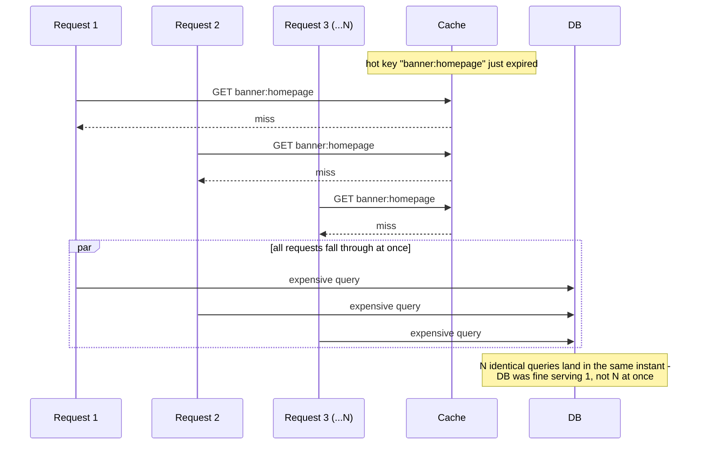
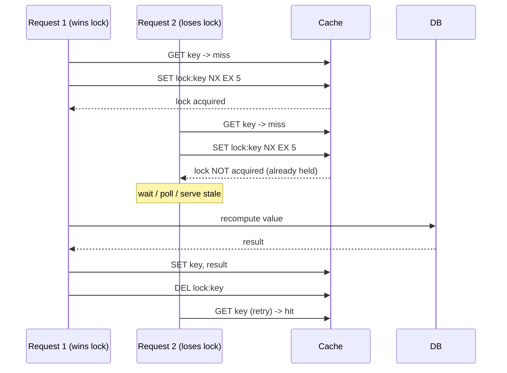

# Cache Stampede (Dogpile Effect / Thundering Herd)

_This topic assumes [caching layers and strategies](01-caching-layers-strategies.md) - specifically cache-aside's read-repopulate cycle and its read-write race - and [eviction policies](02-eviction-policies.md), which named this failure mode in passing under [mass expiry](02-eviction-policies.md#thundering-herd-mass-expiry-and-the-stampede-risk) and deferred it here for full treatment. This topic answers the question those two raised but didn't solve: when a hot key's cache entry disappears - by TTL, by eviction, or because the whole cache node just came back from a restart - and thousands of concurrent requests all miss at the same instant, what actually happens to the backing store, and what stops it?_

## Contents

- [What a cache stampede is](#what-a-cache-stampede-is)
- [Dogpile, thundering herd, stampede - same thing, different names](#dogpile-thundering-herd-stampede---same-thing-different-names)
- [Root causes](#root-causes)
- [Mitigation 1: locking / mutex on rebuild](#mitigation-1-locking--mutex-on-rebuild)
- [Mitigation 2: request coalescing / single-flight](#mitigation-2-request-coalescing--single-flight)
- [Mitigation 3: probabilistic early expiration (XFetch)](#mitigation-3-probabilistic-early-expiration-xfetch)
- [Mitigation 4: stale-while-revalidate](#mitigation-4-stale-while-revalidate)
- [Mitigation 5: jittered TTLs](#mitigation-5-jittered-ttls)
- [Mitigation 6: background/proactive refresh of hot keys](#mitigation-6-backgroundproactive-refresh-of-hot-keys)
- [Combining mitigations, and what's still unsolved](#combining-mitigations-and-whats-still-unsolved)
- [Worked example: a homepage banner key under load](#worked-example-a-homepage-banner-key-under-load)
- [Trade-offs](#trade-offs)
- [How this connects](#how-this-connects)
- [Check yourself](#check-yourself)
- [Real-world & sources](#real-world--sources)

## What a cache stampede is

A **cache stampede** happens when a single cache entry (or a large batch of entries) that many concurrent requests depend on becomes unavailable at once, and every one of those requests - instead of being smoothed out over time the way ordinary traffic is - falls through to the backing store **simultaneously, at the same instant**. The backing store (a database, a slow external API, an expensive computation) then receives a burst of duplicate, redundant work: potentially thousands of requests all asking for the *exact same* piece of data within milliseconds of each other, all because the one cached copy that would have absorbed them vanished.

The key word is **concurrent** and **duplicate**. An ordinary cache miss is fine - cache-aside (topic 01) is *built* around the assumption that some fraction of requests miss and re-populate the cache. A stampede is what happens when the assumption baked into that design - "misses are spread out, and only one request needs to actually pay the backing-store cost before the cache is warm again" - breaks down, because **every** one of N concurrent requests for the same key misses at once, and without a mitigation, all N of them independently decide to re-fetch or recompute the same value, doing N times the necessary work at the exact worst moment: right when the backing store is *already* under the load of a synchronized spike.

This is distinct from ordinary high-but-steady traffic in one specific way: the backing store didn't choose this moment, and can't spread the load out itself - the correlation is imposed entirely by the shared expiration deadline or shared cold-start moment, not by how requests happen to arrive from users. A database that comfortably handles 10,000 reads/sec of naturally-arriving traffic can be brought down by 10,000 requests arriving in the *same 50 ms window*, because it's not the volume alone that's the problem - it's the volume with zero smoothing, all demanding the same row/computation at once, often compounded by each of those requests being *more expensive* than a normal cached read (a full query, a join, an expensive aggregation - exactly the work the cache existed to avoid repeating).



## Dogpile, thundering herd, stampede - same thing, different names

These three terms are used almost interchangeably in caching discussions today, but they came from different places and it's worth knowing why they converged on describing the same phenomenon:

- **Thundering herd problem** is the oldest and most general of the three, originating in **operating-systems/networking literature**, not caching specifically: the classic case is multiple processes or threads all blocked waiting on the same event (e.g., several processes calling `accept()` on the same listening socket, or several threads waiting on the same condition variable/lock), and when that event fires, the OS wakes **all** of them, even though only one can actually proceed - the rest wake up, contend, lose, and go back to sleep, burning CPU/scheduling overhead for nothing. This is a resource-contention problem about **waking up more waiters than can usefully proceed at once**, and it long predates web caching. `verify` earliest documented use, but it's well-established as originating in kernel/scheduler discussions from the 1990s-2000s (e.g., discussions around Apache's process-per-connection model and multiple workers waking on one incoming connection).
- **Dogpile effect** is the term that came out of **web caching and web application literature specifically** - describing the exact scenario this topic covers: a cached page or fragment expires, and many concurrent web requests all "pile on" the origin server at once to regenerate it. It's essentially the caching-specific instance of the thundering-herd shape: instead of many threads waking on one lock, it's many requests missing on one cache key.
- **Cache stampede** is the more modern, distributed-systems-era term for the same dogpile scenario, and is now the most common name in large-scale caching/infrastructure writing (research papers, engineering blogs) - likely because "stampede" evokes the specific image of a large herd all moving toward the same point at once, which maps cleanly onto "many requests all hitting the same backing-store resource simultaneously."

**In practice, all three describe the same underlying shape** - a shared resource/signal that many waiters depend on becomes available/unavailable at once, and all waiters react simultaneously in a way that overwhelms whatever they're all converging on - and most engineers today use "cache stampede" and "dogpile" interchangeably when talking about caching specifically, reserving "thundering herd" for either the general OS-level version or as a synonym for the caching case depending on context. This document uses **cache stampede** as the primary term going forward, since that's the dominant usage in current caching literature, and treats "dogpile" and "thundering herd" as its synonyms.

## Root causes

A stampede needs two ingredients: a cache entry becoming unavailable, and **enough concurrency on the same key** at that exact moment for the resulting misses to matter. Four distinct triggers produce that combination in practice:

**1. A single hot key expiring under high concurrency.** The narrowest and most common case: one cache entry - a trending product's price, a leaderboard, a homepage banner, a celebrity's profile - is read by a very large number of concurrent requests, and the instant its TTL lapses (or it's evicted under memory pressure, per topic 02), every one of those concurrent readers misses at once. The "hot" property is exactly what makes this dangerous: a cold key with only 2 concurrent readers stampeding is a non-event; the same expiration on a key with 50,000 concurrent readers per second is a genuine incident.

**2. Mass expiry - many keys sharing the same TTL.** Described in topic 02: a batch job, a cache-warming script, or a deploy that populates thousands (or millions) of cache entries **in a tight time window, all with the same fixed TTL** (`EX 3600` for all of them, set within the same few seconds) causes all of them to expire together, roughly an hour later, **at the same few seconds** - turning what should be independent, staggered expirations into one large synchronized miss event across many different keys at once, rather than one key with many concurrent readers. This is a *correlation-of-deadlines* problem rather than a *correlation-of-readers-on-one-key* problem, but it produces the identical symptom: a burst of simultaneous backing-store load.

**3. Cold cache after a restart, deploy, or failover.** A cache node (or an entire cache cluster) that restarts, gets redeployed, or fails over to a replacement holds **zero entries** the instant it comes back online - every key is a miss, not just one hot key or one batch of same-TTL keys, but the *entire keyspace* at once. The very first wave of production traffic that hits a freshly-started cache is, by definition, 100% misses, and if that traffic volume is anything close to normal load, the backing store receives close to its **full unmitigated request volume**, all at once, with none of the load-shedding the cache is normally there to provide. This is the most severe version of the problem in raw scale, because it isn't bounded to "one hot key's readers" - it's every key, everywhere, simultaneously.

**4. Retry storms compounding the initial spike.** Once a stampede has already started overwhelming the backing store, clients/services that are timing out or getting errors typically **retry** - and if those retries aren't designed carefully (no backoff, or backoff that's itself synchronized because many clients started retrying at the same moment), the retry traffic **adds to** the original spike rather than backing off from it, extending and often worsening the incident well past when the original trigger (the key expiring, the cache restarting) would otherwise have self-resolved. This is why retry policy (exponential backoff with jitter, retry budgets, circuit breakers - covered in reliability topics) is treated as part of the same failure family: a stampede that would have been a brief, survivable spike can become a sustained outage purely because of how the *reaction* to the first wave of failures was engineered, not because of the original trigger itself.

## Mitigation 1: locking / mutex on rebuild

**The mechanism.** When a request misses the cache for a given key, before going to the backing store it first tries to acquire a **lock specific to that key** (commonly implemented as a short-TTL "lock" key in the same cache, e.g. `SET lock:product:8214 1 NX EX 5` in Redis - `NX` meaning "only set if it doesn't already exist," which is exactly the atomic compare-and-set primitive needed here). Exactly one request wins the lock (the `NX` set succeeds); that request proceeds to the backing store, recomputes/refetches the value, writes it into the cache, and **releases the lock** (deletes the lock key). Every other concurrent request that tried to acquire the same lock and failed either:

- **Waits** (polls or blocks briefly, then retries the cache read once the winner has finished and populated it), or
- **Falls back** to returning a slightly stale/default value or a "please retry" response rather than hitting the backing store itself.



**Why this works.** It collapses N concurrent backing-store calls into exactly 1 - the defining goal of every mitigation on this list, achieved here through mutual exclusion rather than through any change to expiration timing.

**Where it gets hard.** A lock held by a process that **crashes before releasing it** would leave every other waiter stuck forever - this is why the lock is always given a **short TTL of its own** (the `EX 5` above), so it self-expires even if the holder dies mid-rebuild, at the cost of a second, smaller stampede risk if the TTL is too short relative to how long the rebuild actually takes. In a **distributed** deployment (multiple cache nodes, multiple app instances across regions), a naive single-node lock isn't enough to guarantee true mutual exclusion - this is exactly the problem **Redlock** (Redis's proposed distributed-lock algorithm, requiring a quorum of independent Redis instances to agree on the lock) attempts to solve, and it remains a genuinely debated design (`verify` - Redlock's correctness under certain failure/clock-drift scenarios has been publicly disputed by distributed-systems researchers including Martin Kleppmann; treat it as a real but contested solution, not a settled one, when citing it).

## Mitigation 2: request coalescing / single-flight

**The mechanism.** Distinct from locking in an important way: locking coordinates across **separate processes/machines** via a shared external resource (the cache itself, or a distributed lock service); **request coalescing** (often called **single-flight**, the name popularized by Go's `golang.org/x/sync/singleflight` package) coordinates concurrent calls **within a single process** by recognizing that multiple in-flight goroutines/threads are asking for the *same key at the same time* and having them share one in-flight call rather than issue N separate ones. Mechanically: when a request for key `K` arrives and no cached value exists, the process checks an in-memory table of "calls currently in flight for key `K`." If none exists, it starts one, registers it in the table, and every *subsequent* concurrent request for the same key that arrives while that call is still running is handed a reference to the **same** in-flight future/promise rather than starting its own - all of them receive the identical result (and identical error, if it fails) once the one real call completes, and the entry is removed from the in-flight table.

**Why this is a different layer than locking, not a replacement for it.** Single-flight only coalesces calls that happen to be concurrent **within the same process** - it does nothing across the 50 different app instances behind a load balancer, each of which will independently make its own one call to the backing store even with perfect single-flight collapsing internally (50 instances x single-flight's "1 call" = 50 calls total, still a stampede at the fleet level, just 1/N smaller than the naive N-per-instance case). This is exactly why production systems commonly run **both**: single-flight collapses same-process concurrency for free (pure in-memory coordination, no network round trip, no lock-expiry risk), and a distributed lock or the probabilistic mechanisms below handle coordination *across* instances.

## Mitigation 3: probabilistic early expiration (XFetch)

**The mechanism.** Rather than treating a key's TTL as a hard deadline that every reader respects identically (guaranteeing they all miss in the same instant), probabilistic early expiration has readers **occasionally decide to recompute the value slightly before it actually expires**, with the *probability* of doing so increasing the closer the real expiration gets - so that instead of zero readers recomputing until the exact expiry instant (when all of them suddenly do), a small trickle of readers recompute early, at randomized moments spread across the final stretch before expiry, each such early recompute refreshing the cached value (and its TTL) for everyone else before the real deadline is ever reached.

The best-known concrete version is **XFetch** (from the paper "Optimal Probabilistic Cache Stampede Prevention," Vattani, Chierichetti & Lowenstein, Facebook/Google researchers, published at VLDB 2015 - `verify` exact author affiliations at time of publication). It requires storing two extra pieces of metadata alongside the cached value: **`delta`**, the time it took to compute/fetch the value originally, and the value's actual expiration timestamp. On every read, before returning the cached value, the reader computes:

```
recompute_early_if:  now - (delta * beta * ln(random()))  >=  expiry_time
```

where `random()` draws a fresh uniform value in `(0, 1)` on every check, and `beta` is a tunable constant (1.0 is the common default) controlling how aggressively the system recomputes early. Because `ln(random())` is always negative for `random()` in `(0, 1)`, subtracting `delta * beta * ln(random())` from `now` always pushes the left-hand side **higher** than `now` alone - meaning the check becomes more likely to trigger (i.e., more likely to already be `>= expiry_time`) the closer `now` gets to the real `expiry_time`, and also more likely to trigger the larger `delta` is (a value that's expensive to recompute gets a wider early-recompute window, giving the recompute enough runway to finish *before* the real deadline arrives). Concretely: this formula gives a **near-zero chance** of firing right after the value was cached, and a **rapidly increasing chance** of firing in the last stretch before expiry - exactly the "trickle of early recomputes, not a synchronized cliff" shape needed.

**Why this specifically fixes root cause #1 and #2 above.** Because every reader independently draws its own `random()` value, the readers that trigger early recompute are spread out in time rather than synchronized - a handful of the thousands of concurrent readers on a hot key will each, at slightly different moments before the real deadline, decide "I'll refresh this now," and whichever one does it first extends the TTL for everyone else, so the real, hard-deadline expiry that would cause a synchronized miss is very rarely reached at all under real concurrent load.

**Cost.** Pure computation and metadata overhead (an extra timestamp and duration per cached entry, one formula evaluated per read) - no lock, no distributed coordination, no extra round trip. The trade is a small amount of **wasted recomputation** (a value gets refreshed slightly before it strictly needed to be, sometimes recomputed redundantly by more than one early trigger firing close together) in exchange for eliminating the synchronized-miss risk entirely, and it requires the backing-store fetch/recompute to be safe to run **concurrently with itself** on the same key (idempotent, or at least side-effect-free to run twice) since XFetch doesn't guarantee mutual exclusion the way locking does - it only makes the *probability* of a true simultaneous miss very low, not zero.

## Mitigation 4: stale-while-revalidate

**The mechanism.** Rather than treating "expired" as "must not be served," stale-while-revalidate treats a just-expired value as still **usable for a short additional grace window**, while exactly one request in the background triggers a refresh: the first request to arrive after expiry is served the **stale** cached value immediately (fast, no wait), and that same request (or a decoupled background task it kicks off) fetches the fresh value and updates the cache; every *other* concurrent request that arrives during that refresh also gets served the stale value immediately, rather than blocking or falling through to the backing store themselves. Once the refresh completes, subsequent requests get the new value.

```mermaid
sequenceDiagram
    participant R1 as Request 1
    participant R2 as Request 2 (concurrent)
    participant Cache
    participant DB

    Note over Cache: value expired, but within stale grace window
    R1->>Cache: GET key
    Cache-->>R1: stale value (served immediately)
    Note over Cache: background refresh triggered
    R2->>Cache: GET key (concurrent)
    Cache-->>R2: stale value (also served immediately, no DB hit)
    Cache->>DB: background fetch (one call only)
    DB-->>Cache: fresh value
    Note over Cache: cache updated; next request gets fresh value
```

This is the same idea codified as an HTTP caching directive: `Cache-Control: stale-while-revalidate=<seconds>` tells a CDN/browser cache exactly this - serve the stale response for up to `<seconds>` past expiry while revalidating in the background, rather than blocking the user-facing request on a fresh fetch. `verify` exact HTTP spec/RFC reference before citing precisely, but this directive is in wide production use across CDNs.

**Why it's the fastest mitigation from the caller's perspective.** Every caller gets an immediate response (the stale value), with zero added latency - unlike locking (losers wait) or plain cache-aside (the miss itself pays full backing-store latency). The cost is explicit: it deliberately serves **known-stale data** for the grace window, which is only acceptable when a short staleness window is tolerable for that data (a product description, a homepage banner, a slowly-changing feed) and not when the data must be correct the instant it changes (an account balance, a real-time inventory count at checkout).

## Mitigation 5: jittered TTLs

**The mechanism.** The narrowest and cheapest fix, targeted specifically at root cause #2 (mass expiry): instead of setting every cache entry in a batch to the exact same fixed TTL (`EX 3600` for all of them), add a small random offset to each one - e.g., `EX (3600 + random(0, 300))`, so entries that were all written in the same few seconds expire spread out across a **five-minute window** rather than within the same second. This directly desynchronizes the expiration *deadlines* themselves, attacking the correlation at its source rather than reacting to the resulting concurrent misses the way locking/coalescing/stale-serving all do.

**Limitation.** Jitter only helps with root cause #2 (many keys, shared TTL) - it does nothing for root cause #1 (one hot key, many concurrent readers, one expiration event that's inherently a single moment regardless of jitter) or root cause #3 (a cold cache after restart, where there's no existing TTL to jitter at all - every key is simply absent). This is why jitter is typically deployed **alongside**, not instead of, one of the request-time mitigations above.

## Mitigation 6: background/proactive refresh of hot keys

**The mechanism.** For a known, identifiable set of especially hot keys (a homepage banner, a small number of viral products, a leaderboard), skip reactive expiration-and-refetch entirely: a background job refreshes those specific keys **on its own schedule, before they're ever close to expiring**, independent of whether any user request is currently waiting on them. A cache read for one of these keys should, under normal operation, **never** see a miss at all - the background process's refresh cadence is set comfortably faster than the TTL, so the value is always overwritten with a fresh one well before the old one would lapse.

**Why this is the strongest guarantee, and also the most limited.** Unlike every mitigation above (which all still allow the miss to happen and manage its consequences), proactive refresh tries to make the miss **never occur** for the keys it covers - the strongest possible guarantee against a stampede on that key. But it only scales to a **small, known set of genuinely hot keys**; it doesn't generalize to the long tail of the keyspace (you can't proactively refresh millions of rarely-accessed keys on a tight schedule - that's just re-implementing "no caching, no TTL" at high operational cost for negligible benefit), and it adds a standing background workload (and its own complexity: what refreshes the refresher if it falls behind or crashes) that has to be monitored as its own piece of infrastructure.

## Combining mitigations, and what's still unsolved

None of these six is a universal fix in isolation, and production systems typically layer several together, each covering a different root cause or a different phase of the problem:

- **Jittered TTLs** address mass expiry (#2) cheaply and are close to a "why wouldn't you" default whenever a batch process sets many same-TTL keys at once.
- **Probabilistic early expiration (XFetch)** and **background refresh of known-hot keys** both try to prevent the miss from happening at all for the highest-traffic keys, trading a little wasted recomputation/standing infrastructure for eliminating the synchronized-miss moment.
- **Locking/mutex** and **single-flight/request coalescing** both accept that a miss will happen, and instead ensure only one (or a bounded few) requests actually pay the backing-store cost when it does - single-flight for free within a process, locking across processes/instances at the cost of lock-management complexity and distributed-lock correctness risk (Redlock's contested guarantees, above).
- **Stale-while-revalidate** accepts the miss and accepts serving a slightly wrong answer for a bounded window, in exchange for zero added latency on every caller and the simplest implementation of the group - but only where a short staleness window is genuinely acceptable for that data.
- **Cold-cache-after-restart (#3)** is the one root cause none of the above fully solves on its own: jitter, XFetch, and background refresh all assume an *existing* cached value to build on, and locking/coalescing only reduce the *multiplier* on backing-store load, not the absolute fact that a freshly restarted cache starts at zero. The real mitigations here are operational rather than caching-algorithmic: **warming** a new cache node from a snapshot or a replica before routing production traffic to it, staggering cache-cluster restarts/deploys so the whole fleet is never cold simultaneously, and pairing this with backing-store-side protections (rate limiting, circuit breakers, connection-pool caps - reliability-track concerns) so that even an unmitigated cold-start burst can't take the backing store down entirely.
- **Retry storms (#4)** are addressed outside the caching layer proper: exponential backoff with jitter on the client/caller side, and retry budgets/circuit breakers that stop compounding an already-overloaded backing store with more retries - the same jitter *principle* as TTL jitter, applied to a different correlated-timing problem.

## Worked example: a homepage banner key under load

A key `banner:homepage` is read on every homepage visit; the site sees a steady **5,000 requests/sec** during business hours, and the value is expensive to recompute (a 200 ms query joining several tables). TTL is set to 60 seconds.

**Unmitigated cache-aside.** At the instant the 60-second TTL lapses, every request arriving in roughly the next 200 ms (the time the *first* miss takes to recompute and repopulate the cache) also misses, because the cache is still empty until that first recompute finishes. At 5,000 req/sec, that's roughly **1,000 concurrent requests** (5,000/sec x 0.2 sec) all falling through to the same expensive 200 ms query at once - 1,000x the intended load on that query, landing in a single 200 ms window, once every 60 seconds like clockwork.

**With locking.** The first of those ~1,000 requests acquires `lock:banner:homepage` (`NX EX 1`, since the rebuild is known to take ~200 ms, giving headroom). The other ~999 see the lock already held and either poll every 20-30 ms until the value appears (adding at most a few tens of milliseconds of extra latency to those unlucky requests) or are served a fallback/stale value if one exists. Net backing-store load per expiry event: **1 query**, not 1,000 - a 1000x reduction, at the cost of ~999 requests experiencing a small added wait.

**With stale-while-revalidate instead.** All ~1,000 requests arriving after expiry are served the (60-second-old, still perfectly reasonable for a homepage banner) stale value immediately - **zero added latency for any of them** - while exactly one background refresh runs the 200 ms query and updates the cache. Only real risk: for those ~200 ms, every visitor sees a banner that's up to 60 seconds and 200 ms old, which for a homepage banner is very likely an acceptable trade (it would not be acceptable if this were, say, an account balance).

**With XFetch layered in as well.** Given `delta = 0.2s` (the 200 ms recompute time) and `beta = 1`, the probability of an early recompute rises sharply in roughly the last second or two before the 60-second deadline (since `delta * beta * ln(random())` scales with `delta`, and `ln(random())` ranges from 0 down to large negative values as `random()` approaches 0, occasionally producing a large enough early-trigger value to fire well before `t=60s`, more often as `now` approaches `60s`). In practice this means one of the thousands of concurrent readers in that final stretch refreshes the value slightly early, resetting the TTL - so the hard 60-second deadline that would have produced the 1,000-concurrent-miss event above is very rarely reached under this traffic level at all.

## Trade-offs

| Mitigation | Added latency to callers | Consistency cost | Implementation complexity | Solves which root cause(s) |
| --- | --- | --- | --- | --- |
| **Locking / mutex** | Losers wait (or get a fallback) until the winner finishes | None once refreshed - correct value served, just delayed for some callers | Moderate; distributed-lock correctness is genuinely hard (Redlock is contested) | #1 (hot key), partially #2 |
| **Request coalescing / single-flight** | None extra beyond the one real call's latency, for same-process callers | None - all coalesced callers get the identical correct result | Low within one process; doesn't cover cross-instance concurrency alone | #1, within a single process only |
| **Probabilistic early expiration (XFetch)** | None - recompute happens transparently before real expiry | None once triggered; small wasted-recompute overhead | Moderate - requires storing `delta` + formula per read; needs idempotent/safe-to-run-concurrently recompute | #1, #2 (desynchronizes the trigger itself) |
| **Stale-while-revalidate** | Zero - always answers immediately | Serves known-stale data for a bounded grace window | Low-moderate | #1, #2; not correctness-critical data |
| **Jittered TTLs** | None | None | Very low - a random offset added at write time | #2 only (mass expiry); no help for #1 or #3 |
| **Background/proactive refresh** | None - miss should never occur for covered keys | None, if refresh cadence keeps up | Moderate - standing background job + monitoring of its own health | #1, for a small known hot-key set only |
| **(Cold cache #3)** | N/A - operational, not per-request | N/A | High - cache warming, staggered rollouts, backing-store-side rate limiting/circuit breaking | #3 specifically; none of the above alone solves it |

## How this connects

- **Back to caching layers and strategies (topic 01)** - the cache-aside read-write race named there is a narrow special case of the same underlying shape this topic generalizes: concurrent operations on the same key interleaving in a way a single-writer mental model doesn't anticipate.
- **Back to eviction policies (topic 02)** - TTL's schedule-driven nature, and mass expiry specifically, is exactly the root cause #2 this topic gives full mitigation treatment to; eviction under memory pressure (LRU/LFU) is a variant trigger for root cause #1 (a hot key evicted, not expired, still produces the same concurrent-miss shape).
- **Forward to cache coherence / invalidation (next L3 topic)** - a stampede is triggered by a value *disappearing* (TTL, eviction, cold start); invalidation is triggered by a value *changing* underneath the cache - a related but distinct question of "when does a cached copy stop being trustworthy," and the two failure modes can compound (an invalidation storm across many keys at once, following a bulk data change, looks exactly like mass expiry in its symptoms and shares several of the same mitigations, notably locking/coalescing).
- **Forward to negative caching** - a related but distinct concurrency problem: repeated misses for a key that **doesn't exist at all** (rather than one that existed and expired) can produce the same backing-store hammering pattern if not cached as a deliberate "negative" result; some of the same coalescing/locking mechanisms apply there too.
- **To L6 (messaging & streaming) and worker pools** - request coalescing/single-flight and locking are themselves concurrency-control mechanisms (mutexes, shared futures) drawn from the same fundamentals as thread synchronization generally; a background refresh job is an instance of a scheduled/async worker task, the same shape covered in service-tier background processing.
- **To reliability topics (SLOs, backoff, circuit breakers)** - retry-storm compounding (root cause #4) and cold-cache operational mitigations (staggered restarts, backing-store rate limiting) are reliability-engineering concerns proper, not caching-algorithm choices; this topic names them as part of the full picture but their full treatment (exponential backoff, circuit breaker design, retry budgets) lives there.

## Check yourself

- A hot key is read by 2,000 concurrent requests per second and takes 150 ms to recompute on a miss. Walk through, with rough numbers, how many redundant backing-store calls an unmitigated stampede produces at the instant that key expires - and then how locking versus stale-while-revalidate each change that number and the latency experienced by the "losing" requests.
- Explain the difference between locking/mutex and request coalescing/single-flight - specifically, why does deploying single-flight alone across 50 app instances still leave you with a 50x (not 1x) stampede at the fleet level?
- In the XFetch formula, why does a larger `delta` (recompute cost) make the mechanism more likely to trigger an early recompute, and why is that the correct behavior rather than a coincidence?
- A batch job writes 500,000 cache entries in a 10-second window, all with `EX 3600`. Explain exactly why this creates a stampede risk an hour later even though no single key is unusually "hot," and how jittering the TTL at write time fixes it - and separately, why jittering does nothing for a single very-hot key's own expiration.
- Why is a cold cache after a restart/deploy considered the most severe of the four root causes, and why do locking and single-flight only reduce its severity rather than solve it the way they solve a single hot key expiring?
- Stale-while-revalidate serves data that is, by definition, already known to be stale. Give one type of data where this trade-off is clearly acceptable and one where it clearly is not, and explain what property of the data drives the difference.

## Real-world & sources

**Meta (Facebook) - leases in Memcache, to fix thundering herds directly at the cache-protocol level.** The "Scaling Memcache at Facebook" paper (NSDI 2013) describes a mechanism called **leases**, introduced to solve two distinct problems at once: stale sets and thundering herds. On a miss, memcached hands the requesting client a lease - a token bound to that specific key - and "leases are given out at a constant rate. If a client requests data for a key, but a lease for the key has already been given out, the lease request will fail and the client will need to retry. Meanwhile, the owner of the lease will cause the key to be filled from cache, and the client will succeed on retry." This is functionally the same shape as this topic's "locking/mutex" mitigation (mitigation 1) - exactly one holder is allowed to go recompute, everyone else waits and retries - but implemented as a first-class primitive inside the cache server itself (memcached issuing/tracking the lease token) rather than as an application-level lock key. [Scaling Memcache at Facebook, NSDI 2013 (paper)](https://www.usenix.org/system/files/conference/nsdi13/nsdi13-final170_update.pdf); summary consulted at [micahlerner.com, "Scaling Memcache at Facebook"](https://www.micahlerner.com/2021/05/31/scaling-memcache-at-facebook.html) (fetched 2026-07-15).

**Cloudflare - lock-free probabilistic revalidation for CDN edge caching.** Cloudflare's engineering blog post "Sometimes I cache: implementing lock-free probabilistic caching" addresses the same problem this topic's mitigation 3 (XFetch) covers, applied to CDN image/asset caching: a popular cached item expiring causes a burst of simultaneous requests to overwhelm the origin (their example: an image server that can handle roughly 1 request/sec receiving 10 requests/sec at the moment of expiry). Rather than a distributed lock, they use a probability function - `p(t) = e^(-lambda*t)` over a revalidation window (their example uses a 5-minute window, `lambda = 1/300`) - so each request independently "rolls the dice" on whether to trigger an early revalidation, with the probability rising the closer the request lands to true expiry. This is the same early-recompute-with-rising-probability idea as XFetch, arrived at independently as a CDN-specific implementation; Cloudflare's own numbers show it keeps origin load roughly proportional and bounded (their example: ~20 rps of origin traffic even at 10,000 rps of edge request volume) instead of spiking at the expiry instant. [Cloudflare Blog, "Sometimes I cache: implementing lock-free probabilistic caching"](https://blog.cloudflare.com/sometimes-i-cache/) (fetched 2026-07-15).

**Stripe - jitter against thundering herd on the retry/idempotency side (root cause #4, not a classic cache miss).** Stripe's engineering post "Designing robust and predictable APIs with idempotency" doesn't describe a cache-stampede scenario in the TTL-expiry sense; it addresses the closely related retry-storm root cause (#4) named earlier in this document. Stripe states plainly: "We can address thundering herd by adding some amount of random 'jitter' to each client's wait time," on top of clients that "follow something akin to an exponential backoff algorithm as they see errors ... wait[ing] proportionally to 2^n, where n is the number of failures." Their own Ruby client library implements this directly: "The Stripe Ruby library retries on failure automatically with an idempotency key using increasing backoff times and jitter." This is fintech's version of the same underlying fix as jittered TTLs (mitigation 5) - desynchronizing a shared, correlated timing signal (here, retry attempts after a shared failure, rather than shared cache-entry expiry) so that recovery traffic doesn't itself become a second stampede against an already-struggling backend. [Stripe Blog, "Designing robust and predictable APIs with idempotency"](https://stripe.com/blog/idempotency) (fetched 2026-07-15).

**India's UPI/NPCI - a real, large-scale retry-storm incident, not a classic TTL-cache stampede.** On 12 April 2025, UPI experienced a multi-hour degradation that NPCI attributed to a surge in API calls from some banks - specifically, several payment service provider (PSP) banks "exceedingly using the 'Check Transaction' API," "issuing repeated calls to the system, including checks on transactions that occurred during previous days, without waiting for any feedback from the system." The success rate of UPI payments "fell dramatically to approximately 50 per cent for nearly two hours and stayed at approximately 80 per cent for the subsequent three hours," and NPCI's response was to direct the offending banks "to cease the use of the 'Check Transaction' API with immediate effect" as an immediate mitigation, ahead of longer-term API-usage guidelines. This maps to root cause #4 (retry/poll storm compounding load on an already-strained system) rather than mitigations 1-6 above, which are about cache-entry expiry specifically - it is included here as a documented, at-scale illustration of the same underlying failure shape (uncoordinated, un-backed-off repeated requests for the same status/data overwhelming a shared backend) rather than as an example of TTL-stampede mitigation proper. [Outlook Money, "UPI Outage Attributed To Surge In API Calls From Banks, Says NPCI"](https://www.outlookmoney.com/banking/upi-outage-attributed-to-surge-in-api-calls-from-banks-says-npci) (fetched 2026-07-15).

**Companies checked but not included.** Netflix's caching architecture (EVCache) is widely discussed in secondary sources as using per-key locking, background refresh of hot keys, and cross-region replication to avoid cold-cache effects during failover, but the primary source (`netflixtechblog.com` / Medium) could not be fetch-verified in this pass - Medium's redirect/access wall blocked direct retrieval of the article content, so no Netflix-specific claim is included above. If a first-party, directly fetchable Netflix source turns up later, it's worth adding as a fourth perspective (concurrency-controlled caching at very large scale, cache-aside pattern for cold starts after regional failover).
