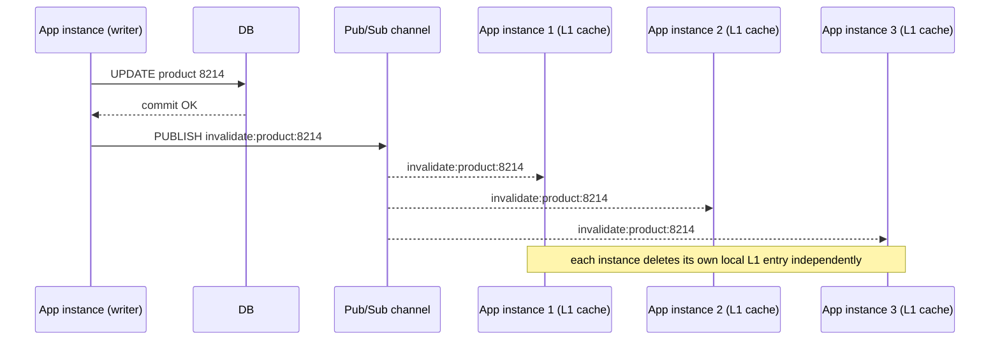

# Cache Coherence and Invalidation

_This topic assumes [caching layers and strategies](01-caching-layers-strategies.md) - specifically cache-aside's read-write race, first named there and revisited in [cache stampede](04-cache-stampede.md) - and [eviction policies](02-eviction-policies.md), whose TTL section covers *when a key disappears on a schedule*. This topic asks a related but distinct question: **when the source of truth changes, how does every copy of that data sitting in a cache find out - and what happens to a reader who asks in the gap before it does?** A stampede (topic 04) is triggered by a value *vanishing*. Invalidation is triggered by a value *changing underneath a copy that's still sitting there, still being served as if it were current*. That's a correctness problem, not a load problem, and it needs its own mechanics._

## Contents

- [What coherence means for a cache, and why it's a real problem](#what-coherence-means-for-a-cache-and-why-its-a-real-problem)
- [The staleness window, made precise](#the-staleness-window-made-precise)
- [Multiple copies, multiple problems: coherence across nodes and layers](#multiple-copies-multiple-problems-coherence-across-nodes-and-layers)
- [Invalidation mechanics: passive expiry vs active invalidation](#invalidation-mechanics-passive-expiry-vs-active-invalidation)
- [Delete-on-write vs update-on-write](#delete-on-write-vs-update-on-write)
- [Invalidating by key, by tag/pattern, and by version](#invalidating-by-key-by-tagpattern-and-by-version)
- [The dual-write race: a concrete timeline](#the-dual-write-race-a-concrete-timeline)
- [Mitigating the race](#mitigating-the-race)
- [Multi-node invalidation: pub/sub broadcast and lease/versioning](#multi-node-invalidation-pubsub-broadcast-and-leaseversioning)
- [What consistency you actually get: eventual, not strong](#what-consistency-you-actually-get-eventual-not-strong)
- [Trade-offs](#trade-offs)
- [How this connects](#how-this-connects)
- [Check yourself](#check-yourself)
- [Real-world & sources](#real-world--sources)

## What coherence means for a cache, and why it's a real problem

**Cache coherence**, in the caching sense used here, is the property that every copy of a piece of data - the one in the database, and every one sitting in every cache that fronts it - reflects the same value, or at least converges to the same value within a bounded, known amount of time. The word is borrowed from CPU-architecture literature (where "cache coherence protocols" like MESI keep multiple CPU cores' L1/L2 caches of the same memory address in agreement), and the underlying problem is structurally the same one level up the stack: **a cache is, definitionally, a copy - not the truth.** The moment you decide to keep a second copy of data anywhere other than its single source of truth, you have created a coherence problem, whether or not anyone designs for it on purpose.

Here is the shape of the problem stated as plainly as possible: a database row changes (a price is updated, a user changes their display name, an inventory count decrements). At the instant that write commits, the database holds the new value. Every cache that had previously cached the old value **does not know this happened** - caches don't watch the database; they hold whatever they were told to hold, until something explicitly tells them otherwise or their TTL lapses. Between "the database changed" and "every cache that held the old value has either been corrected or has expired," there exists a window - the **staleness window** - during which a reader who asks the cache gets an answer that is provably wrong: not "slow," not "eventually right," but **actively incorrect right now**, because it disagrees with the source of truth that a different reader, or the same reader a moment later, would see if they bypassed the cache.

This is worth separating cleanly from two things it resembles but isn't:

- It is **not** the cache-aside miss-and-repopulate cycle from topic 01 in its ordinary operation - that's the expected, designed-for behavior of a cache holding a copy that's simply *absent* and needs fetching once. Coherence is about a copy that's **present and wrong**, actively being served as if correct.
- It is **not** a cache stampede (topic 04) - a stampede is a load problem (many requests fall through to the backing store at once because a value disappeared). Invalidation is a correctness problem (a value is still present, still being served, and it's wrong). The two can compound - an invalidation storm across many keys at once looks like mass expiry and shares some of the same mitigations - but they are different failures with different root causes, and it's a common mistake to reach for stampede mitigations (locking, coalescing) when the actual bug is a coherence bug that no amount of request-coalescing fixes, because coalescing concurrent *misses* does nothing about a *hit* that returns the wrong value.

The reason this is a genuinely hard problem, not a solved footnote, is that **the write to the database and the correction of every cached copy are two separate operations against two separate systems, and there is no single atomic transaction that spans both** (short of building one, which the mitigations below approximate at real cost). Every invalidation mechanism that follows is, at bottom, a strategy for closing that gap as tightly as the workload's tolerance for staleness allows - never a way to make the gap literally zero for free.

## The staleness window, made precise

It helps to name the window's edges precisely, because "staleness" is often used loosely:

- **Start of the window**: the instant the database write commits (the new value becomes the source of truth).
- **End of the window**: the instant every cached copy of that data has either been corrected (deleted or updated to the new value) or has naturally expired via TTL and would be re-fetched fresh on next read.
- **Width of the window**: however long invalidation takes to reach every copy - which, depending on mechanism, ranges from single-digit milliseconds (a synchronous delete issued as part of the write path) to the full TTL (if no active invalidation exists at all and the system relies purely on passive expiry).

A system with **no explicit invalidation at all** - pure TTL, no delete/update on write - has a staleness window whose *worst case* equals the TTL itself: a value could be read as stale for up to the entire TTL duration after it changed in the database, if that value happens to have just been cached right before the write occurred. A system with **synchronous invalidation on every write** collapses that worst case down to however long the invalidation call itself takes (typically single-digit milliseconds for a same-datacenter cache delete) - but, as the dual-write race below shows, "synchronous" doesn't automatically mean "race-free," because *ordering* between the write and the invalidation still has to be gotten right.

## Multiple copies, multiple problems: coherence across nodes and layers

The single-cache mental model - one database, one cache, one staleness window - is already the easy case. Real systems typically have **many** copies of the same logical cached value sitting in different places at once, and coherence has to account for every one of them independently:

- **Multiple cache nodes in a distributed cache cluster.** A sharded Redis or Memcached deployment holding a hot key doesn't necessarily hold it in exactly one place - replicas of a shard, or a key that's been (mis)cached on more than one node due to a routing change, mean an invalidation has to reach **every** node holding a copy, not just one. Missing even one replica leaves a live, servable, wrong answer sitting on that one node indefinitely (until its own TTL, if any, lapses).
- **In-process (L1) caches on every app instance.** Recall from topic 01: an in-process cache is private to one running process. If 50 app instances each keep their own local copy of the same lookup table for speed (an "L1 in front of L2 distributed cache" hierarchy), invalidating the shared distributed cache (L2) does **nothing at all** to the 50 separate in-process copies (L1) - each one is a fully independent stale value that needs its own invalidation signal, and there is no single "the cache" to invalidate; there are 51 separate caches (50 L1s plus the shared L2), each capable of independently disagreeing with the database and with each other.
- **CDN edge caches.** The same data cached at dozens or hundreds of geographically distributed points-of-presence multiplies the same problem across a much wider blast radius - an invalidation ("purge") has to be broadcast globally, and different edges can be corrected at different times depending on network path, meaning even a single logical "cache" (the CDN) can show **different stale values to different users simultaneously**, depending purely on which edge PoP they were routed to. (CDN purge mechanisms specifically are covered in their own later L3/L1 material; named here only to complete the picture of how many independent copies "the cache" can actually mean.)

The unifying point: **"the cache" is rarely singular.** Every additional copy is another place a stale value can independently persist, and an invalidation mechanism that only reaches some of them (a common bug: invalidating the distributed cache but forgetting the in-process L1 layer, or invalidating one region's cache but not a replica in another) leaves the system in a state that's *worse* than having no invalidation at all in one sense - some readers see the fresh value, others don't, at the same instant, with no way for a client to tell which one they got.

## Invalidation mechanics: passive expiry vs active invalidation

Topic 02 (eviction policies) already covered TTL as an eviction mechanism in depth - what's relevant here is TTL considered specifically as a **coherence** mechanism, alongside the alternative of actively telling the cache something changed.

**TTL / passive expiry, used as invalidation.** The simplest possible coherence strategy is to not actively invalidate anything at all, and instead rely purely on every cached entry eventually expiring on its own schedule, at which point the next read is a guaranteed miss that re-fetches the current value from the database. This requires **zero coordination between the write path and the cache** - the application can write to the database and never think about the cache at all - which is exactly its appeal: no invalidation logic to get wrong, no message to lose, no ordering bug to reason about. The cost is precise and unavoidable: **the staleness window's worst case is the full TTL**, and it applies uniformly to every write regardless of how important that particular change was. A five-minute TTL means a price change can be served as stale for up to five minutes to any reader whose cache entry was populated just before the price changed - acceptable for a slowly-changing product description, entirely unacceptable for an account balance or an inventory count at checkout. This is why passive-expiry-only invalidation is reserved for data whose acceptable staleness window is itself comfortably close to (or longer than) a TTL the workload can tolerate, not used as a general-purpose invalidation strategy for data that must be corrected promptly.

**Active/explicit invalidation.** The alternative is to have the write path itself **tell the cache** that a specific piece of data just changed, at write time, rather than waiting for a clock to run out. This is what every mechanism in the rest of this topic is a variant of: something in the code path that performs (or triggers) the database write also performs an explicit action against the cache - a delete, an update, a tag-based bulk invalidation, or a version bump - so that the staleness window shrinks from "up to the full TTL" down to "however long the explicit invalidation step itself takes to run and propagate," typically milliseconds rather than minutes. Active invalidation doesn't replace TTL - in every production design covered below, **TTL remains present as a backstop**, exactly the same self-healing role it plays for the cache-aside race named in topic 01: if the active invalidation is ever missed, dropped, or arrives out of order (all of which are shown to be possible below), the TTL is what eventually, unconditionally, corrects the stale entry even when the "smart" mechanism fails.

**How this maps onto topic 01's four write strategies.** Write-through and write-back were already described there as *population* strategies; restated here specifically as *invalidation* mechanics:

- **Write-through** gives active invalidation "for free," structurally: because every write is routed through the cache and only acknowledged after the database confirms, the cache is *never* holding a value the database has since moved past - there is no staleness window to speak of for a write-through-cached key, by construction, not because an invalidation message was sent and received in time, but because the cache and the database's states were never allowed to diverge in the first place.
- **Write-back (write-behind)** has the *opposite* coherence relationship to the ones covered so far: it isn't a case of the cache lagging the database and needing correction - it's the cache **ahead of** the database, holding the newest value while the database still has the old one, for however long the value sits unflushed. Any other reader that bypasses the cache and reads the database directly during that window would see a *stale* database, which is a coherence problem in the opposite direction from everything else in this topic, and one of the concrete reasons write-back is reserved for workloads where only the cache is ever consulted (or where that specific inversion is tolerable), not for data multiple independent systems might read straight from the source of truth.
- **Cache-aside and read-through** are the strategies that actually need everything this topic covers - they say nothing by default about what happens to a stale cache entry when the backing store is written, leaving that entirely up to whatever explicit invalidation logic the application (or a supporting mechanism) adds on top. Nearly everything below is written from the cache-aside perspective specifically, because it's the strategy that has real invalidation decisions left to make.

## Delete-on-write vs update-on-write

Given that an active invalidation step is needed on write, there are exactly two things it can do to the stale cache entry: **delete it**, or **update it** to the new value. These sound equivalent (both "fix" the cache) but they carry meaningfully different risk, and the difference is worth internalizing precisely.

**Update-on-write.** The write path computes the new value and writes it directly into the cache (`SET key new_value`), so the next reader gets a hit with the correct value immediately - no re-fetch from the backing store required, and no cache miss at all if timed correctly. This sounds strictly better than deleting (why pay for a future cache-aside miss when you could just push the right answer in now?) - but it has a specific, dangerous failure mode under **concurrent writers**: if two writes to the same key are in flight at once, and their cache-updates land **out of order** relative to their database-writes (a very real possibility over a network, where nothing guarantees message arrival order matches issue order), the cache can end up holding the result of the **older** write even though the database correctly holds the newer one - a stale value now sitting in the cache with no pending correction, because from the cache's point of view, it was updated most recently and looks perfectly valid. This is a genuine, silent correctness bug, and it gets worse the more concurrent writers a key has.

**Delete-on-write.** The write path, instead of computing and pushing a new value into the cache, simply **deletes** the stale entry (`DEL key`), leaving the *next reader* to miss and repopulate the cache via the ordinary cache-aside path (fetching the current value fresh from the database at read time). This trades one guaranteed extra read (the next reader pays a cache-aside miss, instead of getting an immediate hit) for a much stronger correctness property: **whichever write happens to be the last one to actually commit in the database is the one whichever subsequent read will see**, because the read always goes back to the database itself to repopulate, rather than trusting whatever value some earlier concurrent write might have pushed into the cache. A delete can still race with a concurrent read (that's exactly the dual-write problem covered next), but it cannot suffer the specific "two concurrent updates land out of order and the older one wins" bug the way update-on-write can, because a delete carries no *value* to get out of order - there is nothing to disagree about except "is the key present or absent," and presence/absence doesn't have the same ordering-sensitive failure mode a competing pair of values does.

**Why delete is the standard recommendation.** This is precisely why "cache-aside reads, paired with delete-on-write (not update-on-write) as the invalidation step" is the dominant production pattern, and why engineering guidance on this topic (Facebook's Memcache paper among the most cited) explicitly recommends deleting over setting on invalidation - the extra cache-aside miss that delete costs the next reader is a small, bounded, predictable price (one backing-store read, absorbed exactly the way any ordinary cache miss is), while update-on-write's out-of-order risk is an unbounded, silent correctness bug that can persist until the entry's TTL eventually cleans it up - which, without an active TTL, could be indefinitely.

## Invalidating by key, by tag/pattern, and by version

A single explicit `DEL` on one known key is the simplest case; real systems need three progressively broader tools depending on how the cached data relates to what changed:

- **By key.** The direct case: the write path knows exactly which cache key corresponds to the row that changed (`product:8214` when product 8214's row is updated) and deletes that one key. This works cleanly when there's a 1:1 mapping between a database row and a cache key, and is the baseline every other approach builds on.
- **By tag / pattern (cache tagging).** Many cached values are **derived from multiple underlying rows** - a "top 10 products in category X" list, a rendered page fragment combining several tables, a search-results cache keyed by query parameters - and a single row change can invalidate many such derived cache entries at once, with no simple 1:1 key to delete. Cache tagging solves this by associating each cache entry with one or more **tags** at write time (a rendered category page tagged with `category:5` and `product:8214`, `product:9910`, ... for every product it currently displays), and maintaining a separate index from tag to the set of cache keys carrying that tag. When product 8214 changes, the invalidation step looks up "every cache key tagged `product:8214`" and deletes all of them in one operation, without the write path needing to know in advance every derived view that might be affected. The cost is real: maintaining the tag index itself is extra state that has to be kept consistent (a tag index that's wrong is its own coherence problem, one level removed), and a pattern-based delete (`DEL product:8214:*` via `SCAN` + `DEL` in Redis, since Redis has no native wildcard delete) can be an expensive, blocking-ish operation on the server if a tag maps to a very large number of keys - worth being deliberate about tag granularity so a single invalidation doesn't fan out into deleting millions of entries at once.
- **Versioned keys / cache-busting.** Instead of ever deleting a stale entry at all, this approach makes staleness structurally impossible to serve by embedding a **version identifier** (a monotonically increasing counter, a content hash, a timestamp) directly into the cache key itself - `product:8214:v7` instead of `product:8214`. When the underlying data changes, the write path bumps the version (`product:8214`'s "current version" pointer moves from `v7` to `v8`), and every subsequent read constructs the key using the *new* version, meaning it can only ever address the fresh entry - the old `product:8214:v7` key is never looked up again by anyone, and simply **ages out on its own TTL**, uncontested, because nothing references it any longer. This is the same principle web front-ends use for static-asset cache-busting (`app.a1b2c3.js` - a content hash embedded in the filename means a new deploy is automatically served fresh, because the old filename is never requested again, rather than because any CDN/browser cache was told to forget it). The advantage is that there's no race to get wrong at all - there is no "delete the old value before a stale read lands" timing problem, because the old key was never going to be read again regardless of timing. The cost is that it requires a place to look up "what's the current version" (itself a small piece of state that has to be read on every cache access, and which is itself subject to its own staleness/coherence question, just one level smaller and simpler than the original problem) and it leaves old, no-longer-referenced versions sitting in the cache until TTL/eviction reclaims them, rather than reclaiming that memory the instant the value changes.

## The dual-write race: a concrete timeline

Even with delete-on-write as the invalidation mechanism (the safer of the two above), a specific, classic race condition remains, because **writing to the database and invalidating the cache are two separate operations, and nothing forces every possible interleaving of a concurrent read to land safely between them.** This is distinct from the update-on-write ordering bug above - it can happen even with pure delete-on-write, and it's worth walking through step by step because the failure is genuinely counter-intuitive on first encounter: the *correct* operation (a delete) still leaves a **stale value repopulated after the delete has already run**, apparently undoing the very invalidation that was supposed to fix things.

Two concurrent requests: **Request A** is writing a new price for `product:8214` (say, updating it from $50 to $60). **Request B** is a completely ordinary read of the same product, arriving at almost the same moment, with no knowledge that a write is in progress.

```mermaid
sequenceDiagram
    participant A as Request A (writer)
    participant B as Request B (reader)
    participant Cache
    participant DB

    Note over Cache: product:8214 currently cached at $50 (stale value)
    B->>Cache: GET product:8214
    Cache-->>B: miss (TTL had just lapsed, or key never cached yet)
    B->>DB: SELECT price WHERE id=8214
    DB-->>B: $50 (still the OLD price - A hasn't committed yet)
    A->>DB: UPDATE price=$60 WHERE id=8214
    DB-->>A: commit OK
    A->>Cache: DEL product:8214
    Cache-->>A: deleted (cache now correctly empty)
    Note over B: B's earlier DB read already returned $50;<br/>B now proceeds to write that stale value into the cache
    B->>Cache: SET product:8214, $50
    Cache-->>B: ack
    Note over Cache: product:8214 now cached at $50 again -<br/>STALE, with no invalidation pending to correct it
```

Walking through why this is genuinely bad, not just "eventually fine": at the point this timeline ends, the database correctly holds $60, but the cache holds **$50, freshly written, with a fresh TTL**, and - critically - **no further write is coming to trigger another invalidation**, because as far as the system is concerned, the price-update transaction (A) already completed and already did its one invalidation. The stale $50 will now be served to every reader as a confirmed cache **hit** for up to the entry's full TTL, which could be minutes, and nothing about this scenario looks like an error to any component involved: A's write succeeded and A's delete succeeded; B's read succeeded and B's cache-populate succeeded. The bug lives entirely in the **interleaving** - specifically, that B's slow read-then-write straddled A's write-then-delete, with B's stale read landing *before* A's write but B's cache-populate landing *after* A's delete.

The essential shape to extract: **whichever of the two operations against the cache happens last wins, and there is no guarantee that "last" correlates with "most recently correct."** A delete that runs correctly, at the correct time, relative to its own write, can still be silently undone by a concurrent reader's slower, now-stale repopulation that simply happens to land afterward. This is exactly why this is called a **correctness bug**, distinct from a stampede: nothing here overloaded the backing store, no burst of concurrent misses happened - one single unlucky interleaving of one reader and one writer produced a permanently (until TTL) wrong cached value.

## Mitigating the race

No single technique eliminates this race for free; each of the following narrows the window or bounds its damage, and production systems typically layer more than one:

- **Delete instead of update, as already argued above**, is itself the first layer of defense - it doesn't prevent the race shown above (note the timeline used a delete and still raced), but it prevents the *additional, worse* out-of-order-value bug that update-on-write introduces on top of it, so it's a strict improvement even though it doesn't solve everything on its own.
- **Short TTL as a safety net.** Since the race above leaves a stale value with no further correction pending, the **only** thing that eventually fixes it (absent one of the mechanisms below) is the entry's own TTL lapsing. This is precisely why cache-aside deployments are told to keep a TTL even when the cache is being kept fresh via active invalidation for the common case - the TTL isn't there for the happy path, it's there specifically as a bound on how long this exact race's damage can persist. A shorter TTL directly shrinks the *worst-case* duration of this specific bug, at the ordinary cost (topic 02) of more frequent cache misses on the happy path.
- **Write-through, structurally.** As noted above, write-through doesn't have this race at all, because there is no independent "read from DB, then separately populate cache" step for a concurrent reader to race against - every write and every population of the cache happens through the same synchronous, ordered path. This is the strongest fix available, at write-through's usual cost (every write pays for both the cache write and the synchronous database write).
- **A second, delayed invalidation ("delete twice").** A pragmatic, widely-used mitigation: issue the delete once immediately after the write (as normal), and issue a *second* delete for the same key a short delay later (a few hundred milliseconds to a couple of seconds), specifically to catch and clean up any stale value a racing reader might have repopulated in between. This doesn't prevent the race from happening even once, but it shrinks the window during which a repopulated stale value can survive down to that short delay, rather than the full TTL - a cheap, heuristic backstop rather than a structural fix, but genuinely effective in practice because the race requires a very specific narrow timing overlap that a second delete a moment later reliably catches.
- **Driving invalidation off the database's own write log, rather than off application code's best-effort delete call.** The dual-write race above exists specifically because the delete is issued by *application code*, as a separate, independent step from the database write it's supposed to correspond to - and application code can be slow, can crash between the DB write and the cache delete, can race with a concurrent reader exactly as shown. **Change data capture (CDC)** - reading the database's own write-ahead/replication log and using *that* as the trigger for cache invalidation, rather than trusting application code to remember to call `DEL` - removes the application from the invalidation path entirely: the database's committed write becomes the single, authoritative signal, and every downstream cache invalidation is driven off that one log rather than off however many different code paths in the application happen to write to that table. The **outbox pattern** (writing an "I need to invalidate this" event to an outbox table in the *same* transaction as the actual data write, then reliably publishing that event afterward) is a related, transaction-safe way to get the same guarantee without reading the database engine's internal replication log directly. Both are covered in full mechanical depth in **L4** (CDC, outbox) - named here only as the structurally strongest answer to the dual-write race, because they move the invalidation trigger to a point that's guaranteed to fire exactly once per committed write, in commit order, rather than depending on application code executing a second, independent, race-prone step correctly every time.

## Multi-node invalidation: pub/sub broadcast and lease/versioning

Everything above addresses invalidating **one** logical cache entry correctly; a distributed cache cluster, or a fleet of in-process (L1) caches, needs that same correct invalidation to reach **every node/instance holding a copy**, not just the one the write happened to talk to directly.

**Pub/sub invalidation broadcast.** The write path, after (or as part of) invalidating its own local/primary cache copy, **publishes a message** - "key `product:8214` changed" - to a channel every cache node or app instance is subscribed to; each subscriber, on receiving that message, deletes (or marks invalid) its own local copy of that key. Redis supports this natively via **keyspace notifications** (Redis can publish an event on a configured channel whenever a key is modified/deleted/expired, which other instances subscribe to) or via plain Redis pub/sub channels the application manages itself; the same shape - "one writer, many independent listeners, each correcting its own copy on receipt" - is exactly how a fleet of in-process L1 caches (topic 01's "50 instances, 50 separate caches" problem) can be kept roughly coherent without every read hitting the shared L2 cache.



**Why this is fundamentally best-effort, not a guarantee.** Redis pub/sub (and most simple broadcast mechanisms) is **fire-and-forget**: a subscriber that is disconnected, slow, or simply not yet running at the moment the message is published **never receives it** - there is no replay, no durable queue behind it, no acknowledgment required from subscribers before the publish is considered "done" (this is exactly the same fire-and-forget property topic 03's Redis-vs-Memcached comparison names for Redis pub/sub generally, and the same reason Discord moved *away* from a Redis-backed queue for guaranteed-delivery needs). A cache node that misses the broadcast (a brief network blip, a node that was mid-restart) is left holding a stale entry with **no other mechanism correcting it** except, once again, its own TTL - which is exactly why pub/sub invalidation is always deployed alongside a TTL backstop, never as the sole coherence mechanism, and why systems that genuinely cannot tolerate a missed invalidation reach for a durable log (Kafka, or Redis Streams as a lighter-weight durable alternative, both covered in L6) rather than plain pub/sub specifically because a durable log lets a temporarily-disconnected subscriber catch up on everything it missed once it reconnects, instead of losing those messages permanently.

**Lease/versioning as an alternative to broadcast.** Rather than pushing invalidation messages out to every node, a lease- or version-based scheme has each **read** check whether its cached copy is still current, using a lightweight version number rather than trusting the cached value blindly. A simple version applied to the earlier versioned-keys idea: every cache node stores, alongside the value, the version it was fetched at; a shared, authoritative "current version" counter (itself cheap to check - a single small key, or embedded in the same lookup) tells a reader whether its locally cached copy's version is still the latest, and if not, that node treats it as a miss and refetches. This shifts the coherence check from "did I receive every broadcast message" (which can silently fail) to "is my version still current" (checked actively on read, so a missed broadcast simply means one extra round-trip to confirm the version rather than a silently stale hit) - at the cost of that extra version-check step on every read, whereas broadcast pays nothing on the read path at all when it works and fails silently when it doesn't. Meta's memcached **lease** mechanism (already covered as a stampede mitigation in topic 04's real-world section) is a related but distinct use of the same word: there, a lease token controls *who's allowed to repopulate a missing key*, not *whether an existing cached value is still valid* - worth not conflating the two uses of "lease" across these two topics.

## What consistency you actually get: eventual, not strong

It is worth being blunt about the ceiling every mechanism above operates under: **cache coherence, in essentially every real system that uses a general-purpose distributed cache in front of a database, is an eventual-consistency property, not a strong one.** Nothing covered in this topic - not delete-on-write, not CDC-driven invalidation, not pub/sub broadcast, not versioning - actually guarantees that at every single instant, every cached copy agrees with the database. Each one only guarantees that, **absent a failure**, every copy will agree **within some bounded, usually short, window** - and the qualifier "absent a failure" is doing real work, because the specific failures that widen or break that bound are ordinary, expected occurrences in any distributed system, not rare edge cases:

- **Network partitions and message loss** mean an invalidation broadcast, a pub/sub message, or a CDC event can simply never arrive at some subset of caches - not delayed, genuinely lost, unless the transport carrying it is itself durable and retried (a proper log, not fire-and-forget pub/sub).
- **Delay, not loss, is the more common case** - a message that does eventually arrive, just later than "instantly," during which a real reader can and does observe the stale value as a confirmed hit, not an error, not a warning, nothing distinguishing it from a correct answer.
- **The dual-write race** shown above is possible even when every individual message is delivered correctly and on time - it's an ordering problem between two entirely separate, correctly-functioning operations, not a delivery failure at all.

Given that, the practical engineering question is never "how do I make this strongly consistent" (for a general cache-plus-database architecture, you don't, short of write-through's much higher per-write cost, or abandoning the cache-plus-database split entirely) but **"what staleness window is acceptable for this specific piece of data, and which mechanism gets me comfortably inside it, most of the time, with a bounded worst case for when it fails."** A homepage banner tolerating a minute of staleness needs almost none of this topic's heavier machinery - plain TTL is enough. An account balance or an inventory count at checkout typically can't tolerate more than milliseconds of staleness, which pushes the design toward write-through, or toward not caching that specific value at all and reading the database directly for anything correctness-critical, reserving caching for the parts of the same system that can tolerate the eventual-consistency ceiling every mechanism here ultimately has. This framing - naming an explicit, deliberate "acceptable staleness window" per piece of data, rather than reaching for the strongest available mechanism everywhere - is the practical takeaway this topic converges on, and it's the same framing **consistency models** (L5) generalize far beyond caching specifically, to every place a distributed system keeps more than one copy of anything.

## Trade-offs

| Mechanism | Staleness window (worst case) | Handles multi-node coherence? | Fixes the dual-write race? | Complexity | Best for |
| --- | --- | --- | --- | --- | --- |
| **TTL / passive expiry only** | Full TTL duration | N/A - every node independently expires on its own schedule | No - doesn't address it at all, just bounds how long any stale value (from any cause) survives | Lowest - zero invalidation code | Data tolerant of minutes-scale staleness; simplest possible design |
| **Delete-on-write** | Milliseconds, absent the race | No - a single key's delete reaches only whichever cache(s) it's issued against | No - the race shown above happens even with correct deletes | Low | The safe default active-invalidation choice over update-on-write |
| **Update-on-write** | Milliseconds, absent ordering bugs | No | No, and adds its own out-of-order-value bug on top | Low | Rarely recommended alone; avoid under concurrent writers to the same key |
| **Tag-based invalidation** | Same as delete-on-write, for every tagged key at once | Only within one cache's tag index | No | Moderate - requires maintaining a tag-to-keys index | Derived/aggregate views spanning multiple underlying rows |
| **Versioned keys / cache-busting** | Old version simply never read again; ages out via TTL | Yes, if every node consults the same "current version" pointer | Structurally avoids the update-ordering variant; doesn't remove the read/write interleaving race on the version pointer itself | Moderate - needs a version-lookup step on every access | Static/derived assets, deploy-time cache-busting, content-addressed values |
| **Write-through** | None - never diverges | Depends on whether writes reach every node's cache synchronously | Yes - no independent read/write path to race | Moderate-high - every write pays synchronous DB + cache cost | Correctness-critical data that must never be observed stale |
| **CDC / outbox-driven invalidation** | Sub-second typically, driven by log-consumption lag | Yes, if every consumer subscribes to the same log | Yes - single authoritative, ordered signal per commit, removes the app-code race entirely | High - requires CDC/outbox infrastructure (L4) | High-value data where the dual-write race's residual risk is unacceptable |
| **Pub/sub broadcast** | Milliseconds when delivered; unbounded if a message is lost (until TTL) | Yes, for connected/live subscribers only | No - orthogonal; addresses fan-out, not the underlying race | Moderate | Multi-node/L1-cache fleets tolerant of occasional missed messages, paired with TTL |
| **Lease/versioning on read** | Bounded by version-check frequency, not by broadcast delivery | Yes - checked actively per read rather than pushed | Reduces exposure; doesn't eliminate the read/write race on the version signal itself | Moderate-high | Systems wanting an active correctness check rather than trusting best-effort delivery |

## How this connects

- **Back to caching layers and strategies (topic 01)** - the cache-aside staleness window and read-write race named there in passing is exactly the dual-write race given full timeline treatment here; write-through's "never diverges" guarantee, also named there, is restated here specifically as a coherence property rather than a population strategy.
- **Back to eviction policies (topic 02)** - TTL is this topic's universal backstop, the same mechanism topic 02 covered as an eviction trigger; here it plays a different role (bounding staleness rather than managing memory pressure), and both roles rely on exactly the same lazy/active expiration mechanics covered there.
- **Back to cache stampede (topic 04)** - explicitly distinguished above: a stampede is a load problem from a value *disappearing*; invalidation is a correctness problem from a value *changing*; the two compound when a bulk invalidation (many keys, one event) produces a stampede-shaped miss burst immediately afterward, at which point topic 04's mitigations (locking, coalescing) apply to *that* resulting load spike, not to the correctness question this topic addresses.
- **Forward to L4 (CDC, outbox pattern, NoSQL)** - this topic named change data capture and the outbox pattern only as the structurally strongest fix for the dual-write race; their full mechanics (reading a database's write-ahead/replication log, transactional outbox tables, exactly-once delivery considerations) get complete treatment there.
- **Forward to L5 (distributed systems, consistency models)** - "cache coherence is eventual, not strong" is this topic's version of a much more general property L5 formalizes (linearizability, causal consistency, eventual consistency) across every kind of replicated/multi-copy system, not just caches; the "acceptable staleness window" framing here is a concrete, caching-specific instance of the same trade-off L5 treats generically.
- **To L6 (messaging and streaming)** - pub/sub invalidation broadcast's fire-and-forget limitation, and the durable-log alternative (Kafka, Redis Streams) that fixes it, is a direct preview of the queues-vs-logs distinction L6 opens with; a system that needs guaranteed invalidation delivery rather than best-effort is choosing a log over a pub/sub channel for exactly the reasons L6 covers in depth.

## Check yourself

- A cache entry is corrected via `DEL` immediately after its corresponding database write commits, and yet a reader still observes a stale value shortly afterward with no further invalidation ever firing. Walk through the exact interleaving of operations that produces this, and explain why calling the delete "correct" and "on time" doesn't prevent it.
- Explain concretely why update-on-write is riskier than delete-on-write under concurrent writers to the same key - what specific thing can go out of order with update-on-write that has no equivalent failure mode for a plain delete?
- A distributed cache cluster has three nodes, each holding a copy of a hot key, plus 20 app instances each keeping their own in-process (L1) copy of the same key. A write updates the underlying row and issues one `DEL` against one of the three cluster nodes. How many stale copies remain, and what would actually be needed to correct all of them?
- Why is cache coherence, as covered in this topic, described as fundamentally eventual rather than strongly consistent - name one specific failure mode from this topic that would exist even if every invalidation message were always eventually delivered correctly.
- A homepage banner and an account balance both sit behind a cache. Using the "acceptable staleness window" framing from this topic, explain why the right invalidation mechanism differs for the two, rather than reaching for the strongest available mechanism (write-through, or CDC-driven invalidation) for both.
- Redis pub/sub is used to broadcast invalidation across 50 app-instance L1 caches. One instance is mid-restart when the broadcast fires. What happens to that instance's stale entry, and what backstop (already covered in an earlier L3 topic) is the reason this isn't a permanent problem?

## Real-world & sources

**Meta (Facebook/Instagram) - TAO's consistency, and the exact dual-write-style race hunted down at scale.** Meta's engineering blog post "Cache made consistent" describes hardening TAO's (Meta's distributed graph-cache layer over MySQL) cache-consistency guarantee **from 99.9999% to 99.99999999% of cache writes consistent within five minutes** - i.e., from six nines to ten nines of "cache agrees with the database within a 5-minute window." The post frames the core failure mode in the same terms this topic uses: "cache invalidation involves an action that has to be carried out by something other than the cache itself," and the canonical bug it walks through is a **cache fill landing after a write but before its invalidation message** - structurally the same interleaving as this topic's dual-write race, just at Meta's fan-out. To find and fix these races at scale, Meta built **Polaris**, a monitoring service that continuously samples cache replicas to detect client-observable consistency violations, and a **consistency-tracing** library that logs mutations only inside the narrow race window between a write and quiescence (rather than logging everything), which the post credits with resolving a specific stale-metadata bug - caused by error-handling code incorrectly dropping cache entries - within about 30 minutes of it surfacing. This is a first-party, quantified illustration of exactly this topic's closing point: coherence is eventual, bounded, and monitored, not strongly guaranteed. [Meta Engineering, "Cache made consistent"](https://engineering.fb.com/2022/06/08/core-infra/cache-made-consistent/) (fetched 2026-07-15).

**Meta (Facebook) - CDC-driven invalidation via the MySQL commit log ("mcsqueal"), the structurally strongest fix named in this topic.** The "Scaling Memcache at Facebook" paper (NSDI 2013) describes an invalidation daemon, informally called **mcsqueal**, that runs on every MySQL database server and reads its **commit log** directly rather than relying on application code to call a cache `DELETE` after every write: it extracts the deletes implied by committed rows, batches them, and routes the batch through **mcrouter** to the memcache servers in every relevant frontend cluster. Driving invalidation off the database's own commit log - rather than off a separate, independent `DEL` call issued by application code - is exactly the CDC approach this topic names as the structurally strongest answer to the dual-write race, and Meta's specific reason for choosing it is notable: producing invalidations *from* the commit log (instead of replicating the log and the invalidations as two separate streams) guarantees an invalidation can never reach a replica region **before** the underlying data change has itself replicated there, preserving ordering across regions as a side effect of the design. [Facebook/Meta, "Scaling Memcache at Facebook" (NSDI 2013 paper)](https://www.usenix.org/system/files/conference/nsdi13/nsdi13-final170_update.pdf); summary cross-checked at [micahlerner.com, "Scaling Memcache at Facebook"](https://www.micahlerner.com/2021/05/31/scaling-memcache-at-facebook.html) (fetched 2026-07-15).

**Netflix - EVCache's cross-region invalidation deliberately uses delete-on-write, not replicate-the-value, and accepts eventual consistency by design.** Netflix's tech blog post "Caching for a Global Netflix" explains that EVCache's cross-region replication for invalidation-sensitive writes doesn't ship the new value to other regions at all: "a SET on a given key only needs to invalidate that key in the other regions - we don't send the new data, we just send a DELETE," propagated via a message queue (Kafka) rather than a synchronous cross-region call. This is this topic's delete-on-write principle applied at the multi-region-node layer (topic's "multi-node invalidation" section), chosen specifically to avoid shipping stale/large payloads across regions and to let each region's next reader repopulate its own cache from its own regional source of truth. Netflix explicitly names the consistency trade-off in the same terms this topic converges on: "it's okay ... if Ireland and Virginia occasionally have slightly different recommendations for you as long as the difference doesn't hurt your browsing or streaming experience" - a deliberate, per-data-type "acceptable staleness window" decision, with measured 99th-percentile cross-region replication latency under roughly a second (about 400ms for high-volume caches) as the bound on how long that inconsistency window typically lasts. [Netflix Tech Blog, "Caching for a Global Netflix"](https://netflixtechblog.com/caching-for-a-global-netflix-7bcc457012f1) (fetched 2026-07-15).

**LinkedIn - ordering concurrent cache writes with a logical version number (System Change Number), directly addressing the update-on-write ordering bug.** LinkedIn's engineering blog post "Upscaling LinkedIn's Profile Datastore While Reducing Costs" describes a Couchbase cache sitting in front of the Espresso profile datastore, kept current via **Brooklin** change-capture streams (a change-capture stream of committed rows, plus a periodic bootstrap/snapshot stream). Because multiple writers and multiple stream consumers can race to update the same cached key, LinkedIn attaches a **System Change Number (SCN)** - "a logical timestamp: for each database row committed, [the] Espresso storage engine produces a SCN value and persists it in the binlog," with SCN order matching commit order - to every cache record, and applies updates with **last-writer-wins reconciliation keyed on SCN**: "given the same key, the record with the largest SCN always replaces the existing one in Couchbase," with the router additionally comparing the cache's SCN against the storage node's SCN before accepting an update. This is a first-party, production instance of this topic's warning about update-on-write's out-of-order-value risk, solved not by switching to delete-on-write but by attaching an explicit ordering token to every update so a genuinely-older write can never silently overwrite a newer one - LinkedIn states plainly that the resulting pipeline "follow[s] the eventual consistency principle," and reports p99 multi-get latency improving by about 60.7% and p999 by about 63.7% after the migration, at a 99% cache hit rate. [LinkedIn Engineering Blog, "Upscaling LinkedIn's Profile Datastore While Reducing Costs"](https://www.linkedin.com/blog/engineering/data-management/upscaling-profile-datastore-while-reducing-costs) (fetched 2026-07-15).

**No fintech example could be verified for this topic specifically.** Stripe's engineering blog was checked directly; it has substantial public writing on idempotency and API reliability (cited for retry/jitter in the cache-stampede topic's real-world section) but no dedicated, fetchable write-up specifically about *cache invalidation* mechanics was found - flagged here rather than forced in. India's UPI/NPCI was also considered; no publicly available engineering write-up specifically addressing cache invalidation/coherence at UPI's scale (as opposed to the retry-storm incident already cited in the cache-stampede topic) turned up in this pass. DoorDash's engineering blog ("How DoorDash Standardized and Improved Microservices Caching," which per its own summary uses a Kafka-based, ban-list/invalidation-timestamp approach very close to this topic's pub/sub and CDC sections) looked like a strong additional fintech-adjacent/e-commerce candidate, but both its URLs returned HTTP 403 on direct fetch in this pass and could not be first-party verified, so no DoorDash-specific claim is included above - worth revisiting if the blog becomes fetchable later.
