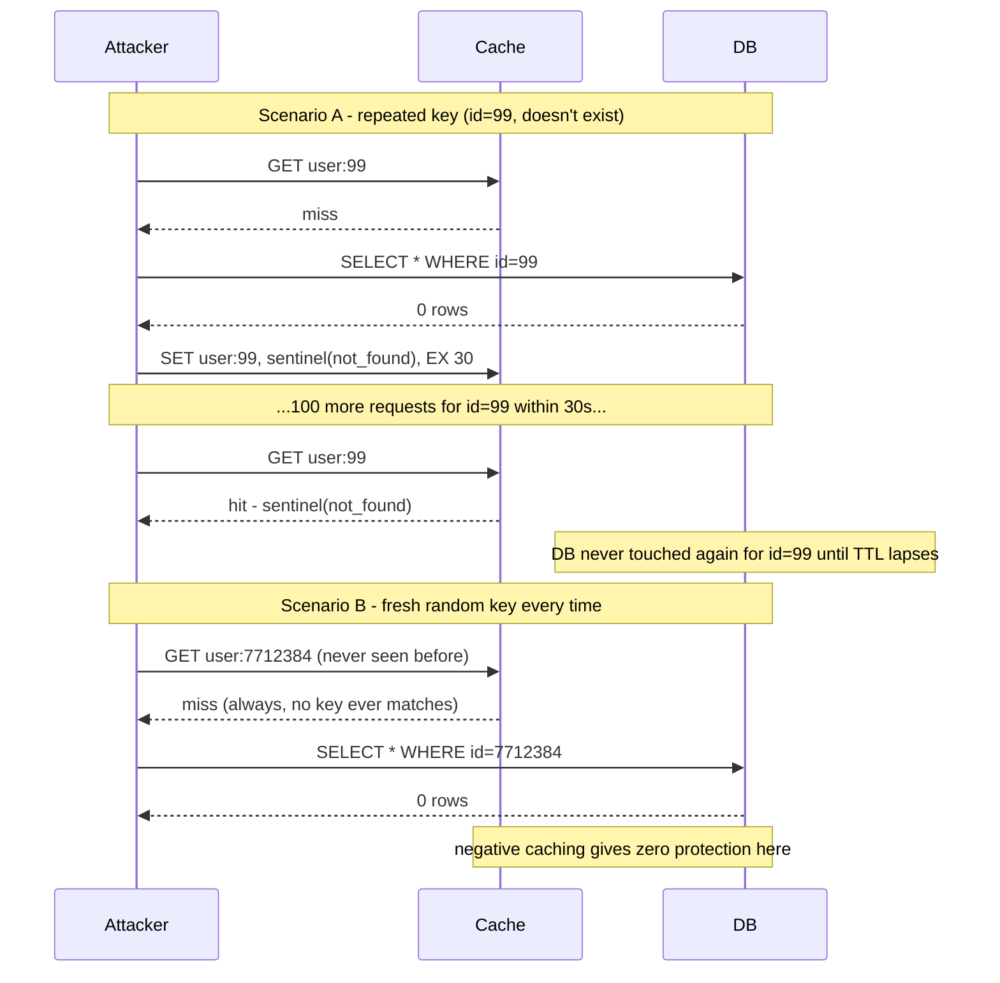

# Negative Caching

_Topic 04 ([cache stampede](04-cache-stampede.md)) named this in passing as a related-but-distinct problem and deferred it here: "repeated misses for a key that doesn't exist at all ... can produce the same backing-store hammering pattern if not cached as a deliberate 'negative' result." This topic is that deferred question, answered in full - what happens, by default, when a request asks for something that was never there to begin with, and what a cache has to do differently to stop that question from reaching the backing store every single time it's asked. It also reopens topic 05's ([cache coherence and invalidation](05-cache-coherence-invalidation.md)) core question - "when does a cached copy stop matching the truth?" - for the one case that topic didn't cover: **a cached copy of "this doesn't exist," sitting stale the instant it stops being true.**_

## Contents

- [What negative caching is](#what-negative-caching-is)
- [Why it exists: the miss-forever problem and cache penetration](#why-it-exists-the-miss-forever-problem-and-cache-penetration)
- [How it works: sentinel values, and TTL asymmetry](#how-it-works-sentinel-values-and-ttl-asymmetry)
- [Where it's implemented](#where-its-implemented)
- [A critical limit: negative caching only helps on repeated keys](#a-critical-limit-negative-caching-only-helps-on-repeated-keys)
- [Worked example: an attacker enumerating user IDs](#worked-example-an-attacker-enumerating-user-ids)
- [Trade-offs](#trade-offs)
- [How this connects](#how-this-connects)
- [Real-world & sources](#real-world--sources)
- [Check yourself](#check-yourself)

## What negative caching is

Every cache covered so far in this level caches a **positive result**: a row that exists, a computed value, a rendered page - something the backing store successfully produced, stored so the next identical request doesn't have to ask again. **Negative caching** is the same idea applied to the opposite outcome: caching the fact that a lookup **failed to find anything**, so that the next identical request for that same nonexistent thing also doesn't have to ask the backing store again.

Concretely, a negative cache entry represents any of these, all structurally the same shape:

- A database lookup for a row that doesn't exist - `SELECT * FROM users WHERE id = 8214` returning zero rows.
- A DNS query for a domain that isn't registered - an **NXDOMAIN** response.
- An HTTP request for a resource that doesn't exist at that path - a **404**.
- An API call that fails a permission or existence check - "no such account," "no such order."

The defining property is this: **a cache-aside implementation, by default, only knows what to do with a result.** When the backing store returns something, the standard read path (topic 01) fetches it, stores it, and returns it. When the backing store returns *nothing* - a genuinely absent row, an explicit "not found" - there is, by default, nothing to store, so most naive implementations simply pass the "not found" answer straight back to the caller and touch the cache not at all. Negative caching is the deliberate decision to store that "not found" answer anyway, as its own kind of cache entry, so that the *fact of absence* gets exactly the same protection from repeated backing-store lookups that a *fact of presence* already gets.

## Why it exists: the miss-forever problem and cache penetration

Here is the failure this exists to prevent, stated precisely. Without negative caching, a request for a key that doesn't exist is a **guaranteed cache miss, every single time, forever** - not occasionally, not until some expiry fires, but by construction, on every request, because nothing was ever written to the cache to hit against. Contrast this with an ordinary cache-aside miss (topic 01): that miss is a one-time event, immediately followed by a repopulation that turns every *subsequent* request for the same key into a hit. A lookup for a nonexistent key never gets that repopulation, because there's no positive value to write - so every request for it repeats the full round trip to the backing store, indefinitely, as if there were no cache in front of that key at all.

This has a name in caching literature and interview vocabulary: **cache penetration** - requests that "penetrate" straight through the cache layer to the backing store, on every single request, for an entire class of key that the cache structurally cannot help with. It's useful to hold this next to the two failure modes topic 04 already covered, because interviews frequently ask for exactly this three-way distinction:

| Failure | Trigger | Shape |
| --- | --- | --- |
| **Cache breakdown / stampede** (topic 04, single-key case) | One hot key **expires** | A brief, self-resolving spike - many concurrent misses at one instant, then the cache is warm again |
| **Cache avalanche** (topic 04, mass-expiry case) | Many keys **expire together** (shared TTL) | A larger, still self-resolving spike across many keys at once |
| **Cache penetration** (this topic) | A key that **never existed, or no longer exists** | Not a spike at all - a steady, ongoing, non-self-resolving stream of guaranteed misses for as long as anyone keeps asking |

The reason this matters beyond vocabulary: penetration is also the caching-layer's specific vulnerability to a class of attack. An attacker who wants to hammer a backend directly, bypassing whatever protection the cache is supposed to provide, doesn't need to find a way *around* the cache - they just need to query keys that are **guaranteed not to be cached**, because they're guaranteed not to exist. Iterating through random or sequential IDs (`/user/1`, `/user/2`, ... `/user/999999999`), most of which don't correspond to real accounts, produces exactly that: a request stream the cache cannot absorb any of, each one forced all the way through to the database, at whatever volume the attacker can sustain. This is why negative caching is discussed as much as a **backend/DoS-protection mechanism** as a performance optimization - it closes off the specific class of request the cache would otherwise do nothing for.

## How it works: sentinel values, and TTL asymmetry

**The mechanic itself is simple: store something at the key anyway.** When a lookup returns "not found," instead of returning that answer to the caller and leaving the cache untouched, the read path writes a marker into the cache at that key before returning - so the next request for the same key hits the cache and gets told "not found" immediately, without a second round trip to the backing store.

**The marker has to be distinguishable from "not cached at all."** This is the one implementation subtlety that trips people up: in Redis or Memcached, a plain `GET` on a key that was never set and a `GET` on a key explicitly set to an empty string or `nil` can look identical to careless calling code, and if a negative entry is stored as a bare empty value, the read path can't tell "confirmed absent, don't bother the DB" apart from "never checked, go ask the DB." The fix is to store an explicit **sentinel** - a small, unambiguous marker distinct from any real value the backing store could ever legitimately return - such as a fixed string (`"__NOT_FOUND__"`) or a small JSON envelope (`{"exists": false}`), and to treat *any* cache hit, whether it decodes to a real value or to that sentinel, as sufficient to skip the backing store entirely. Only a true absence of the key (no entry at all) should fall through to a real lookup.

**Negative TTLs are conventionally much shorter than positive TTLs.** A product page might be cached for an hour; a "product not found" result for the same key space is typically cached for seconds to a few minutes, not hours. The reasoning is asymmetric risk, not a fixed rule: a stale *positive* entry serves slightly-outdated-but-real data, generally a mild inconvenience; a stale *negative* entry actively tells a caller that something doesn't exist when it now does - the sharpest version being a user who just successfully created an account and is immediately told "no such account" for however long the negative TTL runs. Keeping negative TTLs short bounds that specific, user-visible failure mode tightly, at a cost that's cheap to pay: negative entries are trivial to recompute (the backing store answering "still not found" is no more expensive than it was the first time), so refreshing them more often has none of the recomputation cost that would make a short TTL painful for an expensive positive value.

## Where it's implemented

Negative caching shows up, under different names, at every layer that fronts a backing store with a cache:

- **DNS resolvers.** DNS negative caching is standardized in **RFC 2308**: a resolver that receives an **NXDOMAIN** (the domain doesn't exist at all) or a **NODATA** response (the domain exists, but has no record of the queried type) caches that negative answer, for a duration sourced from the authoritative zone's **SOA record's minimum-TTL field** - the same mechanism, formalized, this topic describes generically. Before this was standardized, every resolver along the chain would re-query the authoritative nameserver on every single lookup of a misspelled or unregistered domain, for no benefit to anyone; RFC 2308 exists specifically to stop that.
- **CDNs and HTTP caches.** A CDN or reverse proxy can cache an origin's error responses exactly like a success response, governed by the same `Cache-Control` headers (or, in Nginx, an explicit `proxy_cache_valid 404 1m;`-style directive setting a distinct TTL per status code) - protecting the origin from repeated requests for a broken or deleted link (a common source of steady, low-value traffic: dead links from search indexes, scanners probing for common paths, old bookmarks) the same way negative caching protects a database from repeated lookups of a nonexistent row.
- **API and application layers.** The pattern here is exactly the sentinel-value mechanic above, applied explicitly in cache-aside code: on a "not found," write a short-TTL sentinel instead of returning silently. Facebook's **DataLoader** pattern (widely used to batch and cache lookups within a single GraphQL request) caches rejected/empty results the same way it caches successful ones, within the lifetime of one request - so a query that asks for the same nonexistent ID multiple times inside one request resolves it once, not once per reference.
- **ORMs and query caches.** Many ORM-level second-tier caches (Hibernate's second-level cache being a commonly cited example) cache *found* entities by default but do **not** automatically cache "no row found" - that has to be added deliberately, following the same sentinel pattern, precisely because the framework's default cache-aside behavior is the "nothing to store" gap this whole topic addresses.

## A critical limit: negative caching only helps on repeated keys

This is the single most important trade-off to get right, and it's easy to miss: **negative caching only protects against repeated requests for the *same* nonexistent key.** It caches an answer *at a key*, and every benefit downstream depends on the next request asking about that exact same key again. An attacker (or a scraper, or a bug) that generates a **fresh, never-before-seen key on every single request** - a new random ID each time, never repeating one - gets zero protection from negative caching, because there is no history at that key for the cache to have stored anything against; every such request is a first-time, guaranteed miss, cached or not.

This is precisely why negative caching is described as **complementary to, not a replacement for, a membership check that doesn't depend on having seen the specific key before** - most commonly a **Bloom filter**: a compact probabilistic structure built once from the full set of *known-valid* IDs, which can answer "is this ID definitely absent, or possibly present?" in constant time, without touching the cache or the backing store at all, and without caring whether this exact ID has ever been queried previously. A request for an ID the Bloom filter reports as definitely absent can be rejected before it ever reaches the cache layer - closing the gap negative caching alone leaves open against a "never repeat a key" attack pattern. (Bloom filters' internal mechanics - the bit array, the hash functions, the false-positive-rate math - are a data-structures topic in their own right, covered on the DSA track; the point relevant here is only that they solve the specific failure mode negative caching, by itself, cannot.) The two are typically deployed together: a Bloom filter as the first line of defense against enumeration of genuinely-never-valid IDs, negative caching as the second line for the (much more common) case of a real, once-valid or plausible-looking key being looked up more than once - plus, at the network edge, rate limiting the source of an unusually high volume of misses in the first place, a defense that belongs to the same "protect the backend from an abusive request pattern" family but operates on request *volume* rather than on cache-key structure.

## Worked example: an attacker enumerating user IDs

A service exposes `GET /users/:id`. IDs are sequential integers, currently up to about 2,000,000. An attacker scans the ID space looking for accounts with predictable, guessable properties.

**Scenario A: the attacker requests the same handful of IDs repeatedly** (e.g., probing `1, 2, 3, ..., 50` over and over, checking for a status change). Without negative caching, all 50 lookups hit the database on every pass, however many passes the attacker runs. With negative caching (sentinel + 30-second TTL) at each of those 50 keys, only the *first* pass through each ID reaches the database; every subsequent request within the 30-second window is served straight from the cache. If the attacker is running 10,000 requests/sec against this fixed set of 50 IDs, database load drops from 10,000 qps to, at most, `50 / 30s` ≈ under 2 qps of genuine lookups - the rest are absorbed entirely by the cache.

**Scenario B: the attacker instead generates a fresh random ID on every request** (`GET /users/8471932`, then `/users/2910384`, never repeating one). Negative caching provides **no protection at all** here - every ID is a first-time key, a guaranteed cache miss regardless of any TTL, and the full 10,000 qps still reaches the database. This is exactly the limit described above, made concrete with numbers: the mitigation that fully solved scenario A does nothing for scenario B, because scenario B never revisits a key. Closing this gap requires either a Bloom filter checked before the cache (rejecting `8471932` outright if it's outside the known-valid ID set, at effectively zero backing-store cost per request) or rate-limiting the source IP/client generating this volume of misses - neither of which is "negative caching" proper, but both of which are the mechanisms this topic's limit points to as necessary complements.

## Trade-offs

| Concern | Detail |
| --- | --- |
| **Staleness risk (entity created after caching absence)** | A negative entry for a key later becomes wrong the instant that entity is actually created - the entry doesn't know the write happened. Bounded by TTL (kept intentionally short, per above), and closed faster by having the create/write path **explicitly invalidate** the negative entry at that key (the same delete-on-write mechanics as topic 05), rather than relying on TTL alone to eventually notice. |
| **Memory cost at scale / cache pollution** | Every distinct nonexistent key that gets negative-cached consumes real cache memory, and an enumeration attack (or a legitimate broken-link crawler) can generate an effectively unbounded number of distinct nonexistent keys - filling the cache with negative entries that, under LRU (topic 02), can evict genuinely useful positive entries. Mitigated by keeping negative TTLs short (bounding how long any one entry lingers), and by giving negative entries their own smaller, size-capped cache space so an enumeration burst can't evict hot positive data. |
| **Only helps on repeated keys** | As shown above: zero protection against an attacker who never queries the same nonexistent key twice. Needs a Bloom filter (or rate limiting) as a complementary defense, not a replacement. |
| **Security use: mitigating enumeration/scraping** | A well-tuned negative cache (short TTL, sentinel pattern) removes the *backend-load* incentive for enumeration attacks against repeated targets, and - depending on how "not found" responses are shaped - can also avoid leaking timing differences between "exists but forbidden" and "doesn't exist" that would otherwise help an attacker distinguish valid from invalid IDs faster than brute force alone. |
| **Simplicity cost** | Requires deliberate code at the cache-aside read path (most frameworks don't do this automatically) - a sentinel value, a shorter TTL policy, and (for full correctness) a negative-entry invalidation hook on the corresponding create path. Skipping it is the default; adding it is a conscious decision, unlike TTL-based positive caching which most caching libraries give you for free. |

## How this connects

- **Back to cache coherence and invalidation (topic 05)** - a stale negative entry (an entity created right after its key was cached as "not found") is the coherence problem from that topic, run in reverse: instead of a cached *value* disagreeing with a changed database row, a cached *absence* disagrees with a row that now exists. The same fix applies - the create/write path should actively invalidate the negative entry at that key, exactly the delete-on-write pattern topic 05 recommends, with TTL as the same unconditional backstop if that invalidation is ever missed.
- **Back to cache stampede (topic 04)** - cache penetration is the third named failure mode alongside stampede/breakdown and avalanche: all three describe requests overwhelming a backing store past what the cache absorbs, but penetration is a **steady-state**, non-self-resolving pattern (a key that never existed keeps missing forever) rather than a **spike triggered by an expiry event**.
- **Back to eviction policies (topic 02)** - negative entries competing with positive entries for space under LRU/LFU eviction is a direct instance of that topic's eviction-under-memory-pressure mechanics, applied to a specific pollution risk (enumeration filling the cache with low-value negative entries).
- **Forward to CDN caching (next L3 topic)** - CDN-layer negative caching (caching 404/error responses at the edge via `Cache-Control` / `proxy_cache_valid`) is the same mechanism as this topic's application-layer version, applied one layer further out; the next topic covers CDN cache mechanics in full, of which error-response caching is one specific case.
- **Forward to rate limiting and abuse-mitigation patterns** - negative caching closes the backend-load incentive for repeated-key enumeration, but (per the worked example) does nothing against never-repeated-key enumeration; that residual gap is closed by rate limiting the request source and by structural checks (Bloom filters) rather than by anything cache-layer, both covered in their own right elsewhere.
- **To DSA (Bloom filters)** - named here only as the complementary defense against the specific gap negative caching leaves open; the structure's internal mechanics (bit array sizing, hash function count, false-positive-rate trade-offs) are covered in full on the data-structures track.

## Real-world & sources

Three distinct layers of the stack, from three companies, verified directly against primary documentation (fetched 2026-07-15):

- **AWS - negative caching as a named, deliberate resilience pattern (Builders' Library + DynamoDB Accelerator).** AWS's *Caching challenges and strategies* article in the Builders' Library states the pattern in almost exactly this topic's terms: "Another option we employ is to cache the error response (that is, we use a 'negative cache') using a different TTL than positive cache entries," warning teams not to "cause or amplify an outage by repeatedly asking for the same downstream resource and discarding the error responses." **DynamoDB Accelerator (DAX)** implements this concretely and by default: when DAX can't find a requested item in the underlying DynamoDB table, "instead of generating an error, DAX caches an empty result and returns that result to the user" - a negative cache entry that "remains in the DAX item cache until its item TTL has expired, its LRU is invoked, or the item is modified using PutItem, UpdateItem, or DeleteItem." AWS explicitly calls out the staleness trade-off this topic covers, recommending a **lower, distinct TTL for negative entries** "to avoid long-lasting empty results in the cache and improve consistency with the table," and notes teams can opt to bypass DAX and read DynamoDB directly if the default negative-caching behavior doesn't fit their access pattern. This is the clearest documented instance of the "invalidate on write, TTL as backstop" mechanic this topic recommends, implemented as a first-class cache feature rather than bolted on by application code.
  Sources: [Caching challenges and strategies - AWS Builders' Library](https://aws.amazon.com/builders-library/caching-challenges-and-strategies/) · [DAX and DynamoDB consistency models - AWS docs](https://docs.aws.amazon.com/amazondynamodb/latest/developerguide/DAX.consistency.html)

- **Cloudflare - DNS negative caching, and its "aggressive" evolution beyond RFC 2308.** Cloudflare's 1.1.1.1 public resolver implements the RFC 2308 mechanic this topic describes, but layers on **RFC 8198 aggressive negative caching**: for DNSSEC-signed zones, the resolver can use the **NSEC records already sitting in its cache** to answer a *new*, never-before-queried name with an immediate NXDOMAIN - without any query to the authoritative nameserver at all - because the NSEC chain proves no name exists in the queried range. This is a meaningful evolution of the plain "cache the exact key you already saw" model this topic's limit section describes: NSEC-based aggressive caching gets negative-cache-like protection even against a **class** of never-before-seen names, not just repeats of one exact name, provided the zone is DNSSEC-signed (true for the root and roughly 1,400 of about 1,540 TLDs at time of writing). Separately, on the CDN side, Cloudflare's cache documentation confirms the "different TTL per status code" mechanic this topic recommends is a real, load-bearing default: 404 and 410 responses get a **3-minute default edge TTL** even with no `Cache-Control`/`Expires` header from the origin, configurable per status code via Cache Rules.
  Sources: [Introducing DNS Resolver, 1.1.1.1 - Cloudflare blog](https://blog.cloudflare.com/dns-resolver-1-1-1-1/) · [Cache by status code - Cloudflare Cache (CDN) docs](https://developers.cloudflare.com/cache/how-to/configure-cache-status-code/) · [RFC 2308 - Negative Caching of DNS Queries](https://datatracker.ietf.org/doc/html/rfc2308)

**On the fintech and UPI/NPCI angle:** this sweep did not turn up a fetch-verifiable engineering write-up describing negative caching or enumeration-attack mitigation specifically for VPA/account lookups in UPI, or a Stripe post describing negative caching of "not found" resource lookups (Stripe's public idempotency documentation covers caching of *successful/executed* request outcomes for retry-safety, a related but distinct mechanism - not caching of nonexistent-resource lookups, so it is **not** cited here to avoid overstating the connection). Flagging this gap openly rather than including a weak or tenuous source: if a stronger, dated fintech-specific source turns up in a future sweep, it should be added here.

## Check yourself

- A cache-aside read path fetches a row, gets zero results, and simply returns "not found" to the caller without touching the cache. Explain precisely why every future request for that same nonexistent key is a guaranteed miss "by construction," not merely "until something expires" - and how negative caching changes that.
- Why does a bare `nil`/empty value stored at a key fail to work as a negative-cache marker, and what does a sentinel value need to guarantee to work correctly?
- Explain why negative-cache TTLs are conventionally set much shorter than positive-cache TTLs for the same data, using the "user just created their account" scenario to make the risk concrete.
- An attacker sends 10,000 requests/second, cycling through a fixed list of 200 IDs that don't exist. A second attacker sends 10,000 requests/second, generating a brand-new random ID on every single request. Explain why negative caching (30-second TTL, sentinel pattern) protects the backend from the first attacker almost completely but does nothing at all against the second - and name the mechanism that would.
- Distinguish cache penetration from cache stampede/breakdown in one sentence each, focused on what triggers each one and whether it self-resolves.
