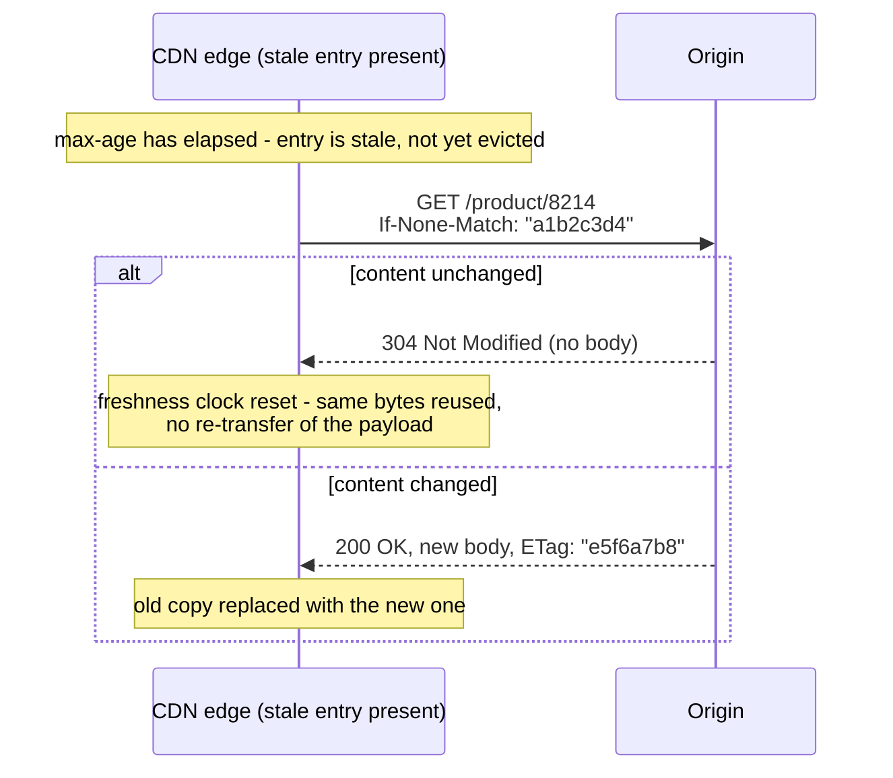
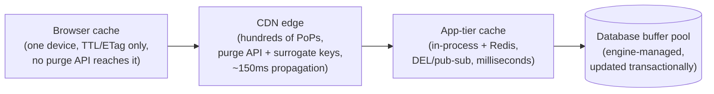
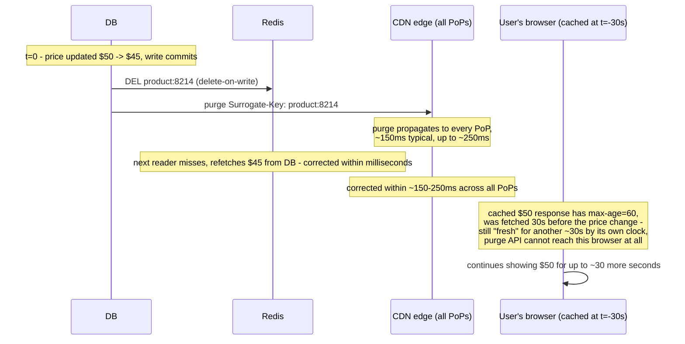

# CDN Caching (the Caching-Strategy View)

_[Caching layers and strategies](01-caching-layers-strategies.md) already placed the CDN as one of the five layers a request passes through, and named it as "the layer most naturally suited to content that is identical for many users" - then deferred its mechanics to the network level. [CDN internals](../L1/15-cdn-internals.md) covered that deferred mechanics in full: PoPs, anycast/GeoDNS routing, origin shielding, push vs pull population, key metrics. This topic does not repeat any of that - it picks up the question every other L3 topic has been answering for a different layer and asks it of the CDN specifically: **given that a CDN is just another cache sitting in front of a backing store, which of this level's strategies (cache-aside vs write-through, eviction, stampede mitigation, invalidation, negative caching) apply to it, and what changes when the "cache" is not one process or one cluster but hundreds of independent edge locations you don't operate directly?**_

## Contents

- [Why the CDN is a different kind of cache to reason about](#why-the-cdn-is-a-different-kind-of-cache-to-reason-about)
- [The HTTP caching contract that makes CDN caching possible](#the-http-caching-contract-that-makes-cdn-caching-possible)
- [Cache-Control: freshness directives (max-age, s-maxage)](#cache-control-freshness-directives-max-age-s-maxage)
- [Cache-Control: storability directives (public/private, no-cache, no-store)](#cache-control-storability-directives-publicprivate-no-cache-no-store)
- [Revalidation: ETag/If-None-Match and Last-Modified/If-Modified-Since](#revalidation-etagif-none-match-and-last-modifiedif-modified-since)
- [Vary and cache key design](#vary-and-cache-key-design)
- [Stale-while-revalidate and stale-if-error](#stale-while-revalidate-and-stale-if-error)
- [Static vs dynamic content: two different caching strategies](#static-vs-dynamic-content-two-different-caching-strategies)
- [Purge and invalidation at the CDN layer](#purge-and-invalidation-at-the-cdn-layer)
- [The multi-layer cache hierarchy: why every layer needs its own policy](#the-multi-layer-cache-hierarchy-why-every-layer-needs-its-own-policy)
- [Worked example: a price change, four layers, four different outcomes](#worked-example-a-price-change-four-layers-four-different-outcomes)
- [Trade-offs](#trade-offs)
- [How this connects](#how-this-connects)
- [Check yourself](#check-yourself)
- [Real-world and sources](#real-world-and-sources)

## Why the CDN is a different kind of cache to reason about

Every cache covered so far in this level - an in-process map, Redis, Memcached, a database's buffer pool - is a system **you operate**: you choose its eviction policy, you call `DEL` on it directly, you can watch its hit ratio in real time, and a single API call reaches the one (or few, sharded) place the data lives. A CDN inverts several of those assumptions at once:

- **You don't run the cache software.** You configure it - via response headers your origin sends, and via a purge/config API the CDN provider exposes - but the eviction policy, the storage engine, the exact propagation mechanics are the provider's implementation, not yours to inspect or tune directly.
- **"The cache" is not one thing.** As [cache coherence and invalidation](05-cache-coherence-invalidation.md#multiple-copies-multiple-problems-coherence-across-nodes-and-layers) already named in passing, a CDN's edge caches are "the same data cached at dozens or hundreds of geographically distributed points-of-presence" - correcting one copy does nothing for the other 199, and different users can observe different, simultaneously-valid-looking answers depending purely on which PoP routed them.
- **The population strategy is fixed by the protocol, not chosen by you.** [Topic 01's four strategies](01-caching-layers-strategies.md#the-four-populationconsistency-strategies) - cache-aside, read-through, write-through, write-back - describe *application code's* choices about when to populate a cache. A CDN in pull mode (the default; see [L1's push vs pull section](../L1/15-cdn-internals.md#push-vs-pull-cdns)) is structurally a **read-through** cache: the edge itself fetches from the origin on a miss and populates itself, with no application code in that path at all. There is no cache-aside CDN, because your application never talks to the CDN's storage directly - it only ever talks to the origin, and the CDN decides for itself, from the HTTP response, whether and how long to keep a copy.

Because of that last point, **the entire interface between your application and CDN caching behavior is HTTP response headers.** There's no `SET key value TTL 300` call to a CDN the way there is to Redis - the origin's response headers *are* the API. That's the reason this topic opens with HTTP caching semantics before anything else: it's not background trivia, it's the actual mechanism.

## The HTTP caching contract that makes CDN caching possible

Every cache in this level so far stores whatever the application tells it to store, for however long the application's code says to keep it. A CDN edge, by contrast, is a generic HTTP cache with no idea what a "product price" or a "user profile" even is - it can only reason about **freshness** (is this response still good to reuse) and **storability** (was this response allowed to be cached at all, and by whom). Both questions are answered entirely by a small set of standardized response headers the origin sends alongside the body, defined originally in HTTP/1.1 (RFC 7234, now RFC 9111) and extended since. Get these headers wrong, and the CDN either serves stale/wrong data with total confidence, or fails to cache anything at all and every request slams the origin - there is no separate "CDN caching config" that overrides a badly-set header by default.

## Cache-Control: freshness directives (max-age, s-maxage)

**`max-age=N`** declares that a response may be reused from any cache, without contacting the origin again, for `N` seconds from the moment the response was generated. This is the single most important number in CDN caching: it's the direct dial between hit ratio (longer = higher) and freshness (longer = staler for longer), the same fundamental trade-off [L1-15's TTL-length table](../L1/15-cdn-internals.md#cache-invalidation-and-content-freshness) already laid out for the edge specifically.

**`s-maxage=N`** is the shared-cache override: when present, a **shared cache** (a CDN edge, a corporate proxy, any cache serving more than one client) must use `s-maxage` instead of `max-age`, while a **private cache** (a single user's browser) still uses `max-age`. This lets an origin give the CDN a different, usually longer, freshness lifetime than it gives the end user's own browser - a common pattern being `Cache-Control: max-age=0, s-maxage=300`: the browser must revalidate on every load (so a user always sees their own latest action reflected), while the CDN happily serves the same response to everyone else for five minutes, absorbing the bulk of the traffic at the edge while individual users still get correctness. Without `s-maxage`, a single `max-age` value has to be a compromise that satisfies both a shared cache's appetite for a long TTL and a private cache's appetite for freshness at once - `s-maxage` lets each layer get the number it actually wants.

## Cache-Control: storability directives (public/private, no-cache, no-store)

These answer a different question from freshness: not "how long," but "may this be cached, and by whom, at all."

- **`public`** - explicitly allowed to be stored by any cache, shared or private, even if the response would otherwise look uncacheable by default (e.g., a response that carried an `Authorization` header, which is normally treated as private-only). Signals "this response is generic enough that it's fine for a shared cache to serve it to someone other than the original requester."
- **`private`** - may be cached, but **only** by the requesting client's own cache (a browser); a shared cache (CDN, corporate proxy) must not store it at all. This is the correct directive for anything personalized - a logged-in user's dashboard, an API response containing account-specific data - where reusing the cached bytes for a *different* user would leak one person's data to another.
- **`no-cache`** - the most commonly misread directive in this list: **despite the name, it does not mean "do not cache."** It means "you may store this, but you must revalidate with the origin (via a conditional request, next section) before serving it from cache on every single use - never serve it from cache without asking first." This is how a response gets both the bandwidth savings of a cached body (skip re-downloading it if it's unchanged) and the freshness guarantee of hitting the origin on every request (skip nothing on the correctness check).
- **`no-store`** - the directive that actually means "do not cache this, anywhere, ever, not even temporarily." No copy may be written to disk or kept in memory beyond what's needed to render the response once. Reserved for genuinely sensitive responses (a banking statement, a one-time payment token) where even a transient cached copy sitting in an intermediate proxy's memory is an unacceptable risk.

The two-axis nature of these headers is easy to collapse by mistake: `public`/`private` governs **who may cache it**; `no-cache`/`no-store` (and `max-age`/`s-maxage`) govern **how, and for how long**. They combine: `Cache-Control: private, no-store` for a payment token; `Cache-Control: public, max-age=86400` for a static image; `Cache-Control: private, max-age=0, no-cache` for a personalized page a browser should always revalidate before reusing.

## Revalidation: ETag/If-None-Match and Last-Modified/If-Modified-Since

Freshness (`max-age`) and revalidation (`no-cache`, or a `max-age`-expired entry) both eventually need to ask the origin "is the copy I'm holding still good?" - and the entire point of asking that way, instead of just re-fetching the full response, is that the answer is usually **yes**, and confirming "yes" should be far cheaper than re-downloading the whole body.

**ETag / If-None-Match.** The origin computes an **ETag** - an opaque validator (commonly a hash of the content, or a version identifier) - and sends it with every response: `ETag: "a1b2c3d4"`. On revalidation, the cache sends that same value back as a conditional request header: `If-None-Match: "a1b2c3d4"`. If the origin's current content still matches that ETag, it replies **`304 Not Modified`** with no body at all - just headers, confirming the cached copy is still correct and resetting its freshness clock - instead of resending the full payload. If the content has changed, the origin replies normally with `200`, a new body, and a new ETag. This is exactly the sentinel/validator pattern that shows up throughout this level, applied to HTTP: a cheap check that avoids a full, expensive re-fetch when the answer is "nothing changed."

**Last-Modified / If-Modified-Since.** The older, coarser equivalent: the origin sends a timestamp (`Last-Modified: Tue, 15 Jul 2025 10:00:00 GMT`), and the cache's revalidation request echoes it back as `If-Modified-Since`. The origin replies `304` if nothing has changed since that timestamp, `200` with a fresh body otherwise. It's weaker than ETag in one concrete way: **its resolution is one second**, so a resource that changes and changes back within the same second - or simply changes twice within one second - can't be distinguished by timestamp alone, whereas a content-hash ETag catches it correctly. Both headers can be sent together (defense in depth, and support for older intermediaries that only understand one), with ETag treated as authoritative when both are present.

## Vary and cache key design

Every cache in this level uses a **key** to decide whether two requests are "the same thing." For most caches covered so far that key is whatever the application chose (a database row ID, a computed cache-aside key). For an HTTP/CDN cache, the default key is the **request method + URL** - but real origins frequently return genuinely different bodies for the identical URL depending on a request header, and the cache has to be told about that, or it will confidently serve the wrong variant to the wrong request.

**`Vary`** is how the origin declares that: `Vary: Accept-Encoding` means "my response body differs depending on the client's `Accept-Encoding` request header" (a gzip-compressed body vs. an uncompressed one), so the cache must store gzip and non-gzip responses for the same URL as **separate entries**, keyed additionally on that header's value, and must not serve one in place of the other. `Vary: Accept-Language` does the same for a localized response body at one URL.

This directly determines **cache fragmentation and hit ratio**, exactly the failure mode L1-15 flagged for cache-key design generically: every value a `Vary`-listed header can take multiplies the number of distinct cache entries needed for what a human would call "the same page." `Vary: Accept-Encoding` is cheap - realistically two or three encoding values in practice. `Vary: Cookie` or `Vary: Authorization` is often *catastrophic* for a shared cache's hit ratio: if the cookie or auth header takes a near-unique value per logged-in user, the cache key becomes near-unique per user too, and a CDN edge that would otherwise serve one cached response to thousands of users instead ends up storing (in the worst case) one entry per user - functionally uncacheable at the shared-cache layer, no different in effect from marking the response `private`. This is exactly why CDNs commonly **strip cookies before the cache-key computation** for responses that don't actually vary by them (a static asset request that happens to carry a session cookie along for the ride shouldn't fragment into one cache entry per session), and why query-string handling is configurable per CDN: a marketing tracking parameter (`?utm_source=twitter`) appended to an otherwise-identical URL, if included in the cache key, produces one cache entry per tracking-tag value for content that is byte-for-byte identical - pure hit-ratio loss with zero correctness benefit, fixed by normalizing (stripping known-irrelevant params, or sorting/whitelisting the params that *do* matter) before the key is computed.

The two failure directions to hold side by side, because they're opposite mistakes with different symptoms: **too broad a cache key** (ignoring a header that genuinely changes the body) risks a correctness bug - serving the wrong variant to the wrong request (English content to a French-language request, gzip bytes to a client that never sent `Accept-Encoding: gzip`); **too narrow a cache key** (including a header that fragments needlessly, like `Cookie` on a non-personalized response) tanks the hit ratio for no correctness benefit at all. Cache key design is choosing exactly which axes the content genuinely varies along - no more, no fewer.

## Stale-while-revalidate and stale-if-error

Both are `Cache-Control` extension directives (RFC 5861) that soften the plain "fresh vs. stale, revalidate synchronously" model above by letting a cache serve a **known-stale** copy on purpose, in exchange for never making a user wait on a revalidation round trip.

**`stale-while-revalidate=N`.** Once the primary `max-age` has elapsed, the cache may still serve the now-stale copy **immediately** to the requester, while triggering an asynchronous revalidation request to the origin in the background - for up to `N` further seconds past the original expiry. The next request after that background refresh completes gets the updated content; the request that triggered the refresh gets the old content, instantly, rather than waiting on the origin. This is the same shape as [L1-15's summary of the same directive](../L1/15-cdn-internals.md#cache-invalidation-and-content-freshness): it decouples "the user gets a fast response" from "the response is perfectly current," trading a bounded, known window of staleness for latency that never spikes at the moment of expiry.

**`stale-if-error=N`.** If a revalidation request to the origin fails - the origin returns a `5xx`, times out, or is simply unreachable - the cache may serve the stale copy it's already holding instead of propagating that failure to the user, for up to `N` seconds past expiry. This is a resilience mechanism dressed as a caching directive: a brief origin blip becomes invisible to end users (they get slightly stale-but-correct-shaped content) instead of an outage, at the cost of the same trade every stale-serving mechanism makes - correctness for availability, bounded by the directive's own window.

Both directives matter for the same underlying reason: without them, an expired entry forces every single arriving request into a synchronous wait for the origin (one becomes the "unlucky" request that pays full origin latency, or - at CDN scale, with many PoPs missing near-simultaneously - many requests do). `stale-while-revalidate` is, in effect, this level's [cache stampede](04-cache-stampede.md) mitigation applied to the CDN: instead of many concurrent requests all racing to refetch a just-expired object synchronously (the exact stampede shape topic 04 describes), exactly one background refresh runs while every concurrent request is served the stale-but-present copy without waiting on it at all.

## Static vs dynamic content: two different caching strategies

The freshness/storability headers above are mechanism; how aggressively to use them depends entirely on what kind of content is being served, and the two ends of that spectrum call for genuinely different strategies, not just different numbers.

**Immutable, versioned static assets.** Build pipelines that fingerprint output filenames with a content hash - `app.js` becomes `app.a1b2c3.js`; a new deploy produces `app.d4e5f6.js` - can set `Cache-Control: public, max-age=31536000, immutable` (a one-year max-age, plus the `immutable` directive telling a cache it never needs to revalidate this URL even on a forced browser refresh) with zero risk, because **the URL itself is the correctness guarantee**: the bytes at `app.a1b2c3.js` can never legitimately change, so caching them essentially forever is never wrong. "Cache busting" on a new deploy isn't an invalidation action at all - it's the same **versioned-key mechanic** [cache coherence and invalidation](05-cache-coherence-invalidation.md#invalidating-by-key-by-tagpattern-and-by-version) already covered for Redis keys, one layer further out: the new build simply references the new hashed URL in its HTML/manifest, the old URL is never requested again by anyone, and the old cached copy at every CDN edge and every browser simply ages out on its own, uncontested, exactly as topic 05 described for `product:8214:v7`.

**Short-TTL and fragment caching for dynamic content.** Content that's genuinely different per request or changes frequently - a product listing with live inventory counts, a personalized homepage, a leaderboard - can't take the "cache forever" approach, but usually isn't fully uncacheable either. Two common strategies:

- **Short TTL, accepted staleness.** A product page's price block might be cached for 5-30 seconds (`Cache-Control: public, max-age=10, stale-while-revalidate=30`), accepting a brief window where a just-changed price could still be served to some users, in exchange for absorbing the overwhelming majority of read traffic at the edge instead of hitting the origin per request. This is precisely the "acceptable staleness window" framing topic 05 converged on, applied at the CDN layer: the question isn't "can this be cached" but "how much staleness is tolerable for this specific piece of content."
- **Edge-side includes (ESI) / fragment caching.** A page is decomposed into separately-cacheable fragments with independent freshness policies - a navigation bar and footer cached for hours (they rarely change and aren't personalized), stitched together at the edge with a genuinely dynamic fragment (a cart total, a personalized recommendation strip) that's fetched fresh or cached for seconds. This lets one page get the CDN's full latency/offload benefit for the parts of it that are actually static, without forcing the entire page to either the "cache the whole thing briefly" or "never cache any of it" extremes.

The origin doesn't need special CDN-side configuration to make either strategy work - in both cases the CDN is a generic HTTP cache obeying whatever headers the origin sends per URL; the strategy lives entirely in what the origin (or the build pipeline, for static assets) chooses to declare.

## Purge and invalidation at the CDN layer

Everything [cache coherence and invalidation](05-cache-coherence-invalidation.md) established about invalidation in general reappears here, with the CDN playing the role of "one more independent copy, at much greater fan-out than a cache cluster's handful of nodes."

- **TTL expiry (passive)** - the default, and the same trade-off topic 05 named for passive expiry generally: zero coordination cost, but worst-case staleness equal to the full `max-age`/`s-maxage` window. Fine for content whose acceptable staleness comfortably covers that TTL; wrong for anything that must reflect a change sooner than the TTL allows.
- **Explicit purge API (active, by URL)** - the CDN-layer equivalent of topic 05's "delete-on-write": the origin calls the CDN provider's purge API to explicitly discard a cached object at every edge, ahead of its natural expiry, exactly the way a write path calls `DEL` on a stale cache key. The crucial structural difference from a single-cluster `DEL`: **a CDN purge has to propagate to every PoP that might hold a copy**, which is a real, measurable amount of time, not an instantaneous local operation - [L1-15 cites Fastly's own figures](../L1/15-cdn-internals.md#real-world-and-sources) of roughly 150ms typical, up to 250ms, for a global purge to reach every edge. Note that this purge is structurally a **delete**, not an **update** - there is no general mechanism to push a *new value* into every PoP directly (short of push-CDN population for a known, planned release), so CDN purge inherits exactly topic 05's argument for why delete-on-write is the safer default: nothing has to arrive in a guaranteed order across hundreds of independent PoPs, because there's no competing *value* to race, only a presence/absence flag to flip everywhere.
- **Cache tags / surrogate keys (active, by tag)** - the same mechanic topic 05 described for tag-based invalidation in a distributed cache, transplanted to the edge: an origin tags every response that includes a given piece of data (every page fragment referencing product 4821 gets `Surrogate-Key: product:4821`), and a single purge call against that key discards every tagged object at every PoP, without the origin needing to enumerate every URL that happened to embed that product. The same cost applies too: the tag index is extra state that has to stay correct, and an overly broad tag (accidentally attached to millions of objects) turns one purge call into a purge storm, exactly the risk topic 05 flagged for over-broad tag granularity in a distributed cache.

**Mass purge and origin stampede.** Purging a single, very popular object (or invoking a broad tag/purge-all) means every PoP's cached copy of that object is discarded at effectively the same instant - so the *next* request to arrive at each of those hundreds of PoPs is a simultaneous miss, all racing to refetch the same object from the origin at once. This is precisely [cache stampede](04-cache-stampede.md)'s avalanche shape, just triggered by an explicit purge instead of a shared TTL lapsing, and it's exactly why **origin shielding** ([covered in full in L1-15](../L1/15-cdn-internals.md#origin-shielding-tiered-caching)) exists as a standing mitigation: a shield/parent tier collapses those many simultaneous post-purge edge misses into one real origin fetch, the same "add a fan-in-reducing tier" idea topic 04 and L1-15 both converge on independently, applied here specifically to the moment right after a mass purge rather than right after a shared expiry.

## The multi-layer cache hierarchy: why every layer needs its own policy

Pulling the full picture back together: a single logical piece of data can sit, simultaneously, in **four independent caching layers** between a user and the source of truth - the browser cache, the CDN edge, the application-tier cache (in-process and/or Redis/Memcached), and the database's own buffer pool. Each layer is a distinct, independently-stale copy in exactly the sense [topic 05's "multiple copies, multiple problems" section](05-cache-coherence-invalidation.md#multiple-copies-multiple-problems-coherence-across-nodes-and-layers) already generalized - that section explicitly named CDN edges as one more instance of the same problem; this topic is that instance, worked through in full.

The reason each layer needs its **own** TTL/invalidation policy, rather than one blanket setting applied everywhere, comes down to a real difference in what each layer can be told, and how fast:

- **The browser cache is the layer you have the least control over, by a wide margin.** There is no purge API that reaches a phone in someone's pocket; once a response is cached client-side with a given `max-age`, the *only* way to correct it before that TTL lapses is if the browser happens to revalidate anyway (a `no-cache` directive forcing a conditional request every time), or if the user reloads in a way that bypasses cache. This is exactly why sensitive or fast-changing data should carry a short `max-age` (or `no-cache`/`private`) at the browser layer specifically, even if the same data is comfortably cached longer at the CDN via `s-maxage` - the two numbers are allowed, and often need, to differ.
- **The CDN edge can be actively purged, but propagation is real, non-zero, distributed-systems time** - milliseconds to a couple hundred milliseconds across every PoP, not instantaneous, and (as above) purging broadly risks a stampede on the origin.
- **The app-tier cache (Redis, in-process) is invalidated fastest and most reliably** - a `DEL` or pub/sub broadcast reaches a same-datacenter distributed cache in single-digit milliseconds, which is why this is usually the layer chosen for data with the tightest correctness requirements, per topic 05's active-invalidation mechanics in full.
- **The database's buffer pool isn't really a TTL-governed cache at all** - it's kept consistent with the table it fronts transactionally, by the storage engine itself, not by any of this level's TTL/purge machinery; it's the layer everything else exists specifically to shield from load, not a layer that needs *its own* freshness policy the way the outer three do.

The practical consequence is the same "acceptable staleness window per piece of data" principle topic 05 converged on, generalized across all four layers **simultaneously** rather than picked once for "the cache": a genuinely static, versioned asset can (and should) get a near-infinite `max-age` at every layer, because there's nothing to invalidate; a price or inventory count needs a policy chosen **per layer**, because the layers differ enormously in how fast and how reliably they can be told something changed - long `s-maxage` at the CDN (offloading the bulk of read traffic, tolerating a purge-propagation window) paired with a short or zero `max-age` at the browser (correctness for the one user most likely to notice), backed by millisecond-level active invalidation at the Redis layer for whichever request path actually needs the freshest possible number.

## Worked example: a price change, four layers, four different outcomes

An e-commerce product page is served with these headers on `GET /products/8214`:

- Browser: `Cache-Control: public, max-age=60`
- CDN (via `s-maxage`, distinct from the browser's `max-age`): `s-maxage=300, stale-while-revalidate=30`, tagged with `Surrogate-Key: product:8214`
- Behind the origin: a Redis cache-aside entry `product:8214` with a 300-second TTL, populated per [topic 01](01-caching-layers-strategies.md#cache-aside-lazy-loading)
- Behind that: the database row itself

At `t=0`, an admin updates product 8214's price in the database from $50 to $45. The write path does two things: issues `DEL product:8214` against Redis (delete-on-write, per topic 05), and calls the CDN's purge API for `Surrogate-Key: product:8214`.

**Redis** is corrected almost immediately - the explicit `DEL` plus the next cache-aside miss means any request reaching the app tier after roughly a few milliseconds sees $45. **The CDN edge** is corrected within the purge-propagation window - call it 150-250ms - after which every PoP's next request for the product page is a guaranteed miss that refetches the corrected price from the (now-correct) origin. **The browser**, however, is not corrected by the purge at all: it cached the $50 response 30 seconds before the price change, under a 60-second `max-age`, and has no mechanism by which the purge API - which only ever talks to the CDN - reaches it. That one browser will keep serving its own locally cached $50 for up to roughly 30 more seconds, purely because its independent freshness clock hasn't run out yet, regardless of how instantly every other layer was corrected.

This is exactly the point the hierarchy section makes concrete with numbers: three layers were invalidated (two actively, in milliseconds to a few hundred milliseconds; one structurally can't be reached by any purge mechanism at all and depends entirely on its own, separately-chosen `max-age`). A design that assumed "we purged the CDN, so the price is now correct everywhere" would be wrong for up to 30 seconds, for exactly the users whose browsers happened to cache the old price shortly before the change - which is precisely why a price-sensitive endpoint's browser-layer `max-age` needs to be chosen deliberately short (or replaced with `no-cache` plus ETag revalidation, so the browser at least asks on every load even if it doesn't re-download the body) rather than inherited from whatever number felt reasonable for the CDN layer.

## Trade-offs

| Concern | Detail |
| --- | --- |
| **Freshness vs. hit ratio (max-age/s-maxage length)** | The same TTL trade-off every cache in this level faces: longer freshness windows mean higher hit ratio and lower origin load, at the cost of a longer worst-case staleness window with no active correction. `s-maxage` lets the CDN and the browser disagree deliberately, so this trade-off can be tuned per layer instead of forced to one compromise value. |
| **`no-cache` vs `no-store` confusion** | The single most common misreading of these headers: `no-cache` still caches, just with mandatory revalidation; only `no-store` actually forbids caching. Using `no-store` where `no-cache` was meant throws away the bandwidth benefit of a cached-but-revalidated body for no correctness gain. |
| **Cache key breadth (Vary, query params, cookies)** | Too broad a key (ignoring a header the response genuinely varies by) is a correctness bug - the wrong variant served to the wrong request. Too narrow a key (`Vary: Cookie` on a non-personalized response, uncleaned tracking query params) fragments the cache into near-per-request entries, destroying hit ratio for no benefit. |
| **stale-while-revalidate / stale-if-error** | Trades a small, bounded window of deliberate staleness (or degraded correctness during an origin outage) for consistently low latency and stampede protection - the right call when brief staleness is tolerable, wrong for data where every read must reflect the absolute latest write. |
| **Purge granularity (URL vs surrogate key vs purge-all)** | Narrow purges are cheap and precise but require enumerating exactly what changed; tag/surrogate-key purges scale to "everything touched by this one entity changed" without enumeration, at the cost of maintaining a correct tag index; purge-all is a blunt, expensive last resort that risks a full origin stampede across every PoP simultaneously. |
| **Purge propagation time is real, not instantaneous** | Unlike a same-datacenter Redis `DEL` (single-digit milliseconds), a global CDN purge takes on the order of 100-250ms to reach every PoP - a small but nonzero window during which different PoPs can serve different answers for the identical URL. |
| **The browser layer is structurally unreachable by any purge mechanism** | No CDN or origin-side action corrects an already-cached response sitting on a user's device; only that response's own `max-age`/revalidation policy bounds how long it can be wrong for. Any invalidation-dependent design that ignores this layer will be wrong on a delay no purge API can shorten. |

## How this connects

- **Back to caching layers and strategies (topic 01)** - completes the CDN entry that topic deferred to "L1 (network fundamentals)"; the CDN is structurally a **read-through** cache from the application's point of view, since the application never populates it directly, only the origin's HTTP headers govern its behavior.
- **Back to eviction policies (topic 02)** - `max-age`/`s-maxage` are this topic's version of TTL-as-eviction-trigger; the underlying lazy/active-expiration mechanics are the same ones topic 02 covered for any TTL-bearing cache, just governed by a header instead of a library config value.
- **Back to cache stampede (topic 04)** - a mass CDN purge (or purge-all) reproduces exactly topic 04's avalanche shape at edge scale; `stale-while-revalidate` is this topic's version of stampede mitigation, serving the stale copy to every concurrent requester while exactly one background refresh runs, instead of every requester racing the origin at once.
- **Back to cache coherence and invalidation (topic 05)** - nearly every mechanic here is topic 05's general machinery re-derived for a cache with hundreds of independently-addressable copies: CDN purge is structurally a delete (not an update), tag/surrogate-key purging is topic 05's tag-based invalidation one layer out, and the browser/CDN/Redis/DB hierarchy is a concrete instance of topic 05's "multiple copies, multiple problems" section, which named CDN edges explicitly as one more copy in that list.
- **Back to negative caching (topic 06)** - the CDN caching error responses (a `404`/`410` at a distinct, usually shorter, TTL than a `200`) via the exact same `Cache-Control`/status-code-specific config topic 06 described (Nginx's `proxy_cache_valid 404 1m;`, Cloudflare's 3-minute default edge TTL for 404/410) is topic 06's application-layer negative-caching pattern, applied one layer further out, exactly as topic 06's own "how this connects" section anticipated.
- **To CDN internals (L1)** - this topic assumes and does not repeat L1's mechanics: PoPs, anycast/GeoDNS routing, origin shielding, push vs pull population, and CDN key metrics all live there; this topic covers only the HTTP-caching-semantics and caching-strategy layer sitting on top of that mechanics.
- **Forward to object/blob storage (next L3 topic)** - CDN origins fronting large static-asset or video workloads are very often object/blob stores rather than application servers; the storage-side half of that pairing is covered next.

## Check yourself

- A response is served with `Cache-Control: private, max-age=0, no-cache`. Explain precisely what a CDN edge is and isn't allowed to do with it, and what a browser is and isn't allowed to do with it - and why `no-cache` here does not mean "don't cache this."
- An API response varies its body based on the `Accept-Language` request header but the origin forgets to send `Vary: Accept-Language`. Describe the concrete bug a shared CDN cache would produce, and contrast it with the opposite mistake of sending `Vary: Cookie` on a response that doesn't actually depend on cookies.
- Walk through why `stale-while-revalidate` is described in this topic as "cache stampede mitigation, transplanted to the CDN" - what specifically does it prevent that a plain `max-age` with no extension would allow to happen at the moment of expiry?
- A price change is corrected via an explicit Redis `DEL` and a CDN surrogate-key purge, both completing within a few hundred milliseconds. A user still sees the old price for the next 40 seconds. Using the worked example's structure, explain exactly which layer is responsible, and why neither the `DEL` nor the purge API could have prevented it.
- Why is a CDN purge described in this topic as structurally a "delete," never an "update," when [topic 05](05-cache-coherence-invalidation.md#delete-on-write-vs-update-on-write) showed that update-on-write is possible (if risky) for a single-cluster distributed cache?

## Real-world and sources

Three distinct company perspectives on the mechanics covered above, each verified by fetching the primary source directly (accessed 2026-07-15):

- **Fastly - surrogate keys as the canonical tag-based purge model.** Fastly's own documentation describes the exact mechanic topic's [purge/invalidation section](#purge-and-invalidation-at-the-cdn-layer) generalizes from topic 05: an origin tags an object (an image, a blog post, a product page fragment) with one or more values in the `Surrogate-Key` response header, and a single purge call against that key - via the control panel or Purge API - discards every object carrying it across the entire edge network, without enumerating URLs. Fastly frames the trade-off in its own guidance as a hit-ratio/operational one: "if you find yourself purging all cache on more than a weekly basis, consider using surrogate keys for more targeted purging" instead of blunt purge-all - the same narrow-vs-broad purge trade-off this topic's trade-offs table lists. A worked scenario in Fastly's material: a news site publishing a new article needs to purge that article's page *and* every category index, author page, and homepage module that references it - normally one purge call per URL, collapsed into a single surrogate-key purge (and, per Fastly's batch-purge API, a single call covering multiple keys at once for exactly this "one write touches many pages" shape). Source: [Purging with surrogate keys, Fastly Documentation](https://www.fastly.com/documentation/guides/full-site-delivery/purging/purging-with-surrogate-keys/) (living documentation, verified current) and [Introducing batch API for surrogate key purge](https://www.fastly.com/blog/introducing-batch-api-surrogate-key-purge) (originally published 2017 - the batch-purge *mechanism* it describes is still Fastly's current documented API per the page above, but the blog post itself predates this level's 4-year freshness bar, so it's cited only as background on why the batch API exists, not as a current-state source).

- **Cloudflare - stale-while-revalidate made fully asynchronous (2026).** Cloudflare's changelog documents a recent change to exactly the directive this topic's [stale-while-revalidate section](#stale-while-revalidate-and-stale-if-error) covers: previously, "the first request for an expired cached asset forced visitors to wait for the origin server to respond" before receiving a REVALIDATED or EXPIRED status - meaning the very request that triggers revalidation still paid full origin latency, only the *next* request benefited from the refreshed copy. As of this update, "the first request after the asset expires triggers revalidation in the background and immediately receives stale content with an UPDATING status," so every concurrent requester - including the one that happens to arrive right at expiry - gets the fast, stale response while exactly one background fetch runs, closing the gap between the textbook `stale-while-revalidate` semantics this topic describes and Cloudflare's actual production behavior. Cloudflare also notes the change reduces exposure to origin timeouts/errors during that window, tightening the connection this topic draws between `stale-while-revalidate` and stampede/resilience mitigation. Rollout was staged: all Free/Pro/Business zones got it immediately, with roughly 75% of Enterprise zones migrated at announcement and the rest phased in over the following quarter. Source: [Asynchronous stale-while-revalidate, Cloudflare Changelog](https://developers.cloudflare.com/changelog/post/2026-02-26-async-stale-while-revalidate/), published 2026-02-26, accessed 2026-07-15.

- **Vercel - stale-while-revalidate at the framework/build layer, for e-commerce and media specifically.** Vercel's Incremental Static Regeneration (ISR) for Next.js and other frameworks is an application of the same `stale-while-revalidate` pattern one layer further up the stack: "visitors get a fast cached response, and Vercel regenerates the page in the background based on a time interval or an API call you trigger." Vercel's documentation explicitly names this level's own domain-priority list as its primary use cases: "E-commerce: Large product catalogs that need current pricing and availability without rebuilding the entire site" and "Media and publishing: Content pages that update when authors publish in a headless CMS" - i.e., exactly the short-TTL-with-accepted-staleness pattern this topic's [static vs dynamic content section](#static-vs-dynamic-content-two-different-caching-strategies) describes for product pages, implemented as a first-class platform feature rather than a hand-set header. Two details go beyond what plain `Cache-Control` headers alone can do: **request collapsing** (concurrent requests to the same uncached path are collapsed into one origin function invocation per region, a stampede mitigation this topic's purge-storm discussion parallels) and **globally consistent purging** - "when you revalidate content, all caches across all regions update within 300ms," purging HTML and JSON data payloads atomically together so a user never sees the old page shell paired with new data or vice versa. On revalidation failure (origin timeout, 5xx, etc.), Vercel keeps serving the stale copy and retries after a 30-second TTL - the same `stale-if-error`-shaped resilience trade this topic covers, applied automatically rather than via an explicit directive. Source: [Incremental Static Regeneration (ISR), Vercel Documentation](https://vercel.com/docs/incremental-static-regeneration), last updated 2026-04-30, accessed 2026-07-15.

**On the fintech angle (Stripe):** no verifiable, dated source describing Stripe's own CDN/edge-caching configuration for its docs, dashboard, or marketing site turned up in this sweep - only an unverifiable secondhand forum mention that Stripe uses Fastly, which does not meet this project's fetch-verify bar and is not included above. Stripe's publicly documented engineering content is heavily API/infrastructure-focused rather than CDN-caching-focused, so this is flagged as a genuine gap rather than a forced fit: if a verified Stripe CDN-caching source surfaces later, it should be added here.
