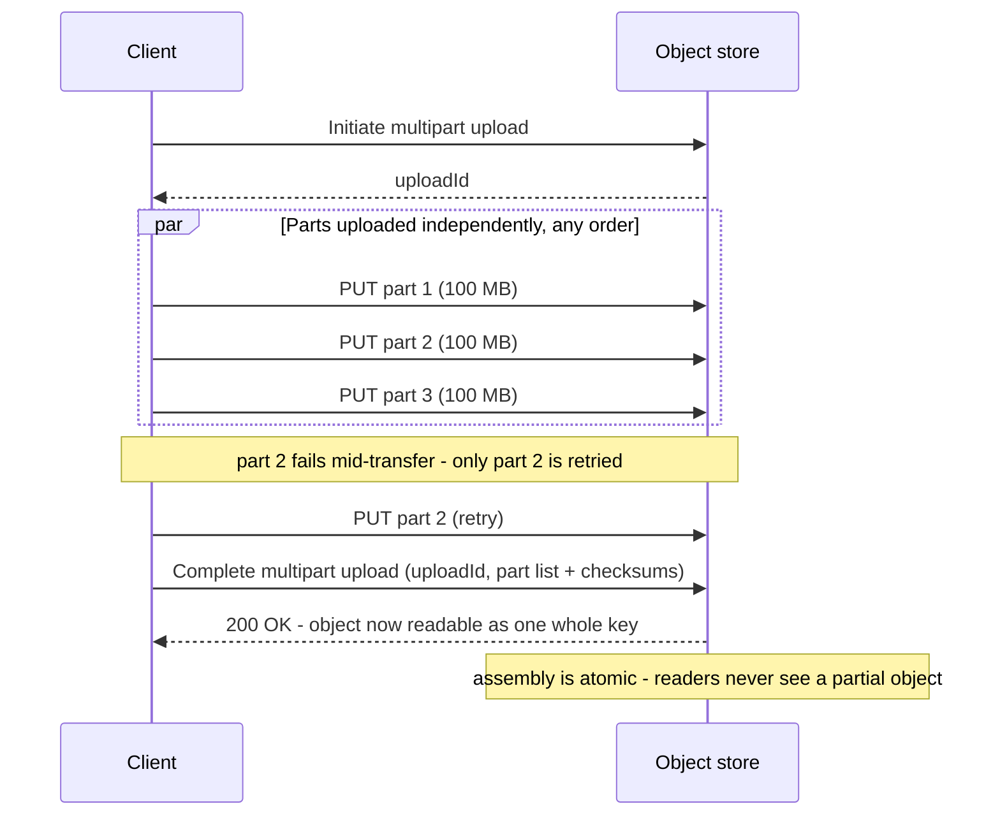
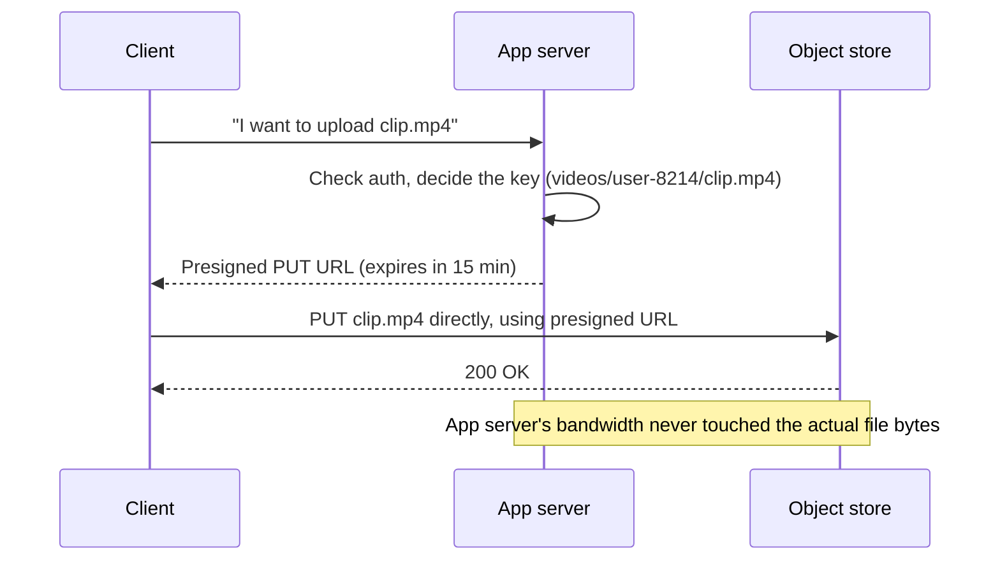

# Object / Blob Storage

_[CDN caching](07-cdn-caching.md) closed with a forward pointer to this exact topic: "CDN origins fronting large static-asset or video workloads are very often object/blob stores rather than application servers." Every other topic in this level has been about a *copy* of data sitting somewhere fast and volatile - a cache row, an edge PoP - always in front of some slower, authoritative store. This topic is the other half of that relationship: where large, unstructured data actually **lives at rest**, the thing a CDN caches copies of and a cache warms itself from on a miss. It also closes the loop back to [L2](../L2/01-relational-model.md): that level covered how a relational database physically stores small, structured rows in pages via B-tree/LSM storage engines - this topic covers the deliberately different answer for the data that never fit that model well in the first place: images, video, backups, logs, and any payload too large or too unstructured to live comfortably in a table row._

## Contents

- [What object storage is](#what-object-storage-is)
- [Object storage vs block storage vs file storage vs relational rows](#object-storage-vs-block-storage-vs-file-storage-vs-relational-rows)
- [Why it exists: the large-blob problem](#why-it-exists-the-large-blob-problem)
- [Object keys, metadata, and the flat namespace](#object-keys-metadata-and-the-flat-namespace)
- [Multipart upload for large objects](#multipart-upload-for-large-objects)
- [Consistency models: eventual vs strong](#consistency-models-eventual-vs-strong)
- [Durability: replication and erasure coding](#durability-replication-and-erasure-coding)
- [Storage classes and tiering: hot to archive](#storage-classes-and-tiering-hot-to-archive)
- [Presigned URLs: direct client upload/download](#presigned-urls-direct-client-uploaddownload)
- [Versioning and lifecycle policies](#versioning-and-lifecycle-policies)
- [Worked example: uploading and serving a 2 GB video](#worked-example-uploading-and-serving-a-2-gb-video)
- [Trade-offs](#trade-offs)
- [How this connects](#how-this-connects)
- [Real-world & sources](#real-world--sources)
- [Check yourself](#check-yourself)

## What object storage is

**Object storage is a system for storing and retrieving whole, immutable blobs of data - called objects - each identified by a unique key, in a flat namespace, accessed entirely over an HTTP-based API rather than a filesystem or block-device interface.** An object is, physically, three things bundled together and always handled as one atomic unit:

- **The data itself** - arbitrary bytes, from a few bytes to terabytes: a JPEG, an MP4, a database backup, a log file, a machine-learning model checkpoint.
- **Metadata** - a key-value map stored alongside the data: content type, cache-control headers, custom application tags (`{"user_id": "8214", "uploaded_by": "mobile-app-v3"}`), and system fields like size and last-modified time.
- **A unique key** - a string (often written to *look* hierarchical, e.g. `videos/2026/07/user-8214/clip.mp4`) that identifies the object within its bucket/container.

There is no directory tree underneath that key. `videos/2026/07/` is not a real folder the way `/home/user/videos/2026/07/` is on a filesystem - it's a naming convention, a prefix that a `LIST` API call can filter on and that a console UI renders as folders for human convenience, but the storage engine underneath sees one flat set of keys, not a tree of inodes. This is the single most consequential structural fact about object storage, and nearly everything else in this topic - how it scales, what it can't do, why the API looks the way it does - follows from it.

The interface is a REST/HTTP API with a small, deliberately narrow verb set: `PUT` an object (write the whole thing), `GET` an object (read the whole thing, or a byte range of it), `DELETE` an object, `HEAD` for metadata only, and `LIST` to enumerate keys under a prefix. Amazon S3's API, released in 2006, became the de facto standard shape for this interface - most other object stores (Google Cloud Storage, Azure Blob Storage's newer interfaces, MinIO, Ceph's RGW) either implement S3-API compatibility directly or mirror its verb set closely enough that client tooling built for one mostly works against the others.

## Object storage vs block storage vs file storage vs relational rows

Four ways to persist data, at four different granularities, are easy to blur together - and interviews frequently ask for exactly this comparison, because picking the wrong one for a workload is a common, expensive design mistake.

| | **Block storage** | **File storage** | **Object storage** | **Relational rows (L2)** |
| --- | --- | --- | --- | --- |
| **Unit of access** | A fixed-size block (512 B - 4 KB), addressed by block number | A file, in a hierarchical POSIX-like path (`/exports/team/report.csv`) | A whole object, addressed by a flat key | A row, addressed by primary key, inside a page-organized table |
| **API** | Raw device interface (`read`/`write` at a byte/block offset) - the OS/application formats it with any filesystem it likes | POSIX file calls over a network protocol (NFS, SMB) - `open`, `seek`, `write`, `close` | HTTP verbs (`PUT`/`GET`/`DELETE`/`LIST`) | SQL (`SELECT`/`UPDATE`/`INSERT`), transactional |
| **In-place mutation** | Yes - overwrite any block at any offset | Yes - `seek` + partial write, append | **No** - an object is replaced wholesale; there is no "modify byte 500 of this file" operation | Yes - `UPDATE` modifies specific columns of one row in place (MVCC creates a new version under the hood, but the logical row is mutable) |
| **Attach point** | One VM/host at a time in the common case (AWS EBS, Azure Managed Disks) | Many clients concurrently, over the network (AWS EFS, Azure Files, on-prem NFS) | Any number of clients, globally, over HTTP - no "mount" step at all | The database server process; clients go through it, never touch storage directly |
| **Typical scale ceiling** | Per-volume (single TBs, tied to one instance) | Per-filesystem (scales further than a single disk, but still a bounded, provisioned namespace) | Effectively unbounded - a single bucket routinely holds exabytes across trillions of objects | Per-table, bounded by what fits well in row-oriented pages before joins/scans degrade |
| **Best fit** | Databases' own data/log files, boot volumes - anything needing low-latency random reads/writes at byte granularity | Shared config, home directories, legacy apps expecting a real filesystem | Images, video, backups, logs, ML artifacts, static web assets - large or numerous blobs with infrequent, whole-object access | Structured, relationally-queried, transactionally-updated data: accounts, orders, inventory counts |

The relational-row column is worth dwelling on because it's the connection back to L2 specifically: a database row lives inside a fixed-size page (8 KB in PostgreSQL, 16 KB in InnoDB, per [storage engines](../L2/10-storage-engines.md#pages-slots-tuples-the-physical-unit-of-storage)), and the whole storage engine - buffer pool, WAL, MVCC, B-tree/LSM layout - is built around efficiently reading and updating *small* pieces of structured data with strong transactional guarantees. Cramming a 500 MB video into a `BYTEA`/`BLOB` column technically works in most relational engines, but it actively fights that design: the blob bloats the buffer pool with data that's never queried by column, bloats every full backup and every replica's storage, and inflates WAL/binlog volume for a write that has nothing to do with transactional row semantics. The standard, near-universal pattern is therefore to store the blob in object storage and put only a **reference** - the object's key/URL - in the relational row (`videos.thumbnail_url = 's3://bucket/videos/8214/thumb.jpg'`), keeping the transactional store doing what it's good at (small, structured, ACID-guaranteed data) and the object store doing what *it's* good at (huge, unstructured blobs, cheaply and durably, with no transactional overhead at all).

## Why it exists: the large-blob problem

Object storage exists to solve a problem that shows up the moment an application needs to store data that is **large, numerous, and read/written as a whole unit far more often than it's partially modified** - user-uploaded photos and video, application logs, database and system backups, ML model checkpoints, data-lake files for analytics. Three properties of that workload make every other storage type a poor fit and object storage a good one:

- **Volume that dwarfs anything a single provisioned volume or filesystem was sized for.** A photo-sharing app or a video platform accumulates petabytes of user content that only grows; provisioning a block volume or a file share for that would mean constantly resizing (and paying for) capacity ahead of need. Object storage buckets have no provisioned size at all - capacity is implicit, billed per byte actually stored, and scales from zero to exabytes in the same bucket without any resize operation.
- **Access pattern is whole-object, not partial-byte.** Almost nothing reads or writes "bytes 4,000-4,010 of this video" as its normal operation - it reads/writes the whole photo, the whole log file, the whole backup. Block storage's whole value proposition (fast random reads/writes at byte granularity) is wasted on a workload that doesn't need it; object storage's "replace the whole object" model isn't a limitation for this workload, it's a match.
- **Durability and availability requirements that exceed what a single disk, or even a single data center, can promise on its own**, at a cost per gigabyte far below keeping the same volume of data on provisioned block storage. This is the "why not just use a bigger disk" answer: a single EBS volume's durability is tied to the underlying hardware and the redundancy *you* configure (RAID, snapshots); an object store bakes multi-device, often multi-facility replication or erasure coding into every object, by default, at a fraction of the per-GB cost - covered in full below.

## Object keys, metadata, and the flat namespace

Every object is addressed by exactly two coordinates: a **bucket** (or container - the top-level namespace, itself often globally-unique-named and tied to a specific region) and a **key** (the string identifying the object inside that bucket). There is no third coordinate - no directory inode, no nested container object - which is precisely why the namespace is described as **flat**: `GET bucket/photos/2026/user-8214/avatar.jpg` and `GET bucket/photos/2026/user-9999/avatar.jpg` are two entirely unrelated keys that happen to share a string prefix; deleting everything "under" `photos/2026/` is not a single directory-delete operation the way `rm -rf` is on a real filesystem - it's a `LIST` call that enumerates every key matching that prefix, followed by (possibly thousands of) individual or batched `DELETE` calls.

This flatness is exactly what makes the "effectively unbounded scale" claim above true, and it's worth naming *why* structurally: a POSIX directory tree has real parent-pointer bookkeeping and locking semantics that make many-way concurrent creation/deletion under one directory a genuine bottleneck at extreme scale (millions of files in one directory is a known pain point for traditional filesystems); a flat key space with no parent/child relationship to maintain has no such bottleneck; distributing keys across storage nodes becomes "just" a partitioning problem (hash or range partitioning over key strings - the general version of this partitioning problem is covered in full in NoSQL and data at scale, immediately following this level), with no tree-structure coordination overhead layered on top.

**Metadata travels with the object, not in a separate row somewhere else.** A `PUT` request sets both the body and a set of headers (`Content-Type: video/mp4`, `Cache-Control: max-age=86400`, custom `x-amz-meta-*`/similar headers for application-defined key-value pairs); a `HEAD` request retrieves just that metadata, without transferring the (potentially huge) body at all - useful for, e.g., checking an object's size or content-type before deciding whether to fetch it. Every object also gets a system-computed integrity marker (S3's `ETag`, generally an MD5 hash of the content for a single-part upload) - the same content-fingerprint idea [CDN caching's ETag section](07-cdn-caching.md#revalidation-etagif-none-match-and-last-modifiedif-modified-since) covered for HTTP revalidation, here serving as an integrity check that the uploaded/downloaded bytes weren't corrupted in transit, rather than a cache-freshness signal. It's worth being precise that this is *not* the same thing as true **content-addressable storage** (where the hash of the content *is* the key, as in Git's object store or IPFS) - an S3-style object key is chosen by the uploader and can be anything; the content hash is auxiliary metadata for integrity, not the addressing scheme, unless an application deliberately builds content-addressing on top by choosing hash-based keys itself.

## Multipart upload for large objects

A single `PUT` works fine for a small object, but has real limits and real risk once an object gets large: most object stores cap a single-request upload at a few gigabytes (S3's single-PUT limit is 5 GiB), and even below that cap, a network blip 90% of the way through a 4 GB upload means restarting the *entire* transfer from byte zero.

**Multipart upload** solves both problems by splitting one logical object into independently-uploaded parts:

1. The client initiates a multipart upload, receiving an upload ID.
2. The client splits the object into parts (S3: minimum 5 MiB per part except the last one, maximum 5 GiB per part, up to 10,000 parts - implying a maximum object size of roughly 5 TiB via multipart upload) and uploads each part with its own `PUT` request, tagged with a part number.
3. Parts can be uploaded **in parallel**, over multiple connections, and **in any order** - the part number, not upload order, determines final assembly order.
4. If any individual part's upload fails, only *that part* is retried - not the whole object.
5. Once every part has been acknowledged, the client sends a single "complete multipart upload" request listing all part numbers and their integrity checksums; the store stitches them together server-side into one final object, atomically - readers see either the fully-assembled object or nothing, never a half-assembled one.

This is the direct structural consequence of "an object is a single, atomically-replaced whole" (below, in trade-offs): multipart upload doesn't violate that guarantee - the object still only ever exists, from a reader's point of view, in one of two states (absent, or fully present) - it just lets the *write* side of that guarantee be assembled incrementally and resiliently instead of as one giant, all-or-nothing network transfer.

## Consistency models: eventual vs strong

Because an object store is a distributed system with data replicated across multiple nodes (and typically multiple facilities, below), a question that recurs throughout distributed storage shows up here in its most consequential early form: **after a write completes, does the very next read anywhere in the system see it?**

Object stores historically defaulted to **eventual consistency** for exactly the reason distributed systems in general do: propagating a new object (or an overwrite/delete of an existing one) to every replica takes real, nonzero time, and serving a read from *whichever* replica is nearest/least loaded, without first checking that every replica agrees, is what makes the system fast and horizontally scalable in the first place. Under eventual consistency, a `GET` immediately following a `PUT` to the *same key* could - for a brief window - return the old version, no version at all (a fresh key not yet visible everywhere), or (worse, historically, for S3 specifically) sometimes the new version and sometimes a `404`, depending purely on which replica answered.

The industry direction has been toward **strong read-after-write consistency by default**, because the eventual-consistency window was a genuine, hard-to-debug source of application bugs (a service writes an object, then immediately reads it back to confirm, and occasionally gets a stale answer for no code-visible reason). AWS S3 announced in December 2020 that all S3 GET, PUT, and LIST operations, across all regions, are now **strongly consistent** by default, with no configuration change or added cost required - a case where a foundational public cloud storage service changed its baseline consistency guarantee out from under every existing application, strictly for the better, without those applications needing to change anything (`verify` - confirm this remains accurate for the reader's specific object-store provider and version, since not every object store or every non-AWS-compatible implementation makes the same guarantee).

The trade this still represents, even where strong consistency is the default: strong consistency for a single-key read-after-write does not mean the system stopped being an eventually-propagated, multi-replica system underneath - it means the store does the extra coordination work (e.g., serving a read only from a replica confirmed current, or fencing reads during propagation) to make that coordination invisible to the caller, at whatever latency/throughput cost that coordination genuinely has. It's the same "hide the underlying distributed reality behind a stronger guarantee, and pay for it in latency/coordination" trade [L2's isolation levels](../L2/05-transactions-isolation-levels.md) made for concurrent transactions on a single database - here applied to reads across geographically or logically separate replicas of one object.

## Durability: replication and erasure coding

**Durability** (will this object still exist and be intact a year from now) and **availability** (can I read it *right now*) are related but distinct promises, and object stores are engineered hard for the former specifically, because a blob store's core value proposition is "durable enough that you never have to think about disk failure yourself."

The number most associated with this is AWS S3's advertised **99.999999999% ("eleven nines") annual durability** for the Standard storage class - meaning, at that rate, if you stored 10,000,000 objects, you would expect to lose one object roughly once every 10,000 years. That number is achieved by **replicating (or erasure-coding) every object across multiple devices, in multiple Availability Zones - physically separate facilities - within a region**, so that losing an entire data center's storage, not just a single disk, does not lose the object.

Two mechanisms achieve that redundancy, at different cost/overhead trade-offs:

- **Straight replication** - store N full identical copies (commonly 3) across separate failure domains. Simple, and the fastest possible reconstruction if a copy is lost (just read another whole copy) - but at a fixed **3x raw storage overhead** for 3-way replication, regardless of the data.
- **Erasure coding** - split an object into k data fragments, compute m additional parity fragments (via a Reed-Solomon-style code), and spread all k+m fragments across separate failure domains; the object can be fully reconstructed from **any** k of the k+m fragments, tolerating up to m simultaneous fragment losses. This achieves comparable or better durability than 3x replication at a substantially lower storage overhead (roughly 1.2-1.5x total, depending on the specific k/m chosen), at the cost of needing to read and recompute from multiple fragments (more CPU, more network fan-in) to reconstruct an object after a failure, rather than just reading one intact replica. This is the same fundamental space-vs-reconstruction-cost trade that shows up, at far larger scale, in RAID 6 and in distributed filesystems like HDFS's erasure-coding mode - object stores at hyperscale (S3, Azure Blob, Google Cloud Storage) use variants of this to keep the "eleven nines, multi-facility redundant" promise affordable at exabyte scale, where flat 3x replication of *everything* would be a materially larger cost.

The practical takeaway for a system design conversation: don't say "object storage is durable" as if that were magic - it's a specific, costed engineering choice (how many copies/fragments, across how many independent failure domains, reconstructed how) that trades storage overhead against reconstruction cost and against how many simultaneous failures the system tolerates - the same replication-factor reasoning that recurs, generalized to full data stores rather than one object store's internals, in the level immediately following this one.

## Storage classes and tiering: hot to archive

Not all stored bytes are accessed at the same rate, and paying the same per-GB price for a file read constantly and a 7-year-old compliance backup read never is wasteful in one direction or the other. Object stores expose **storage classes** (tiers) that trade retrieval latency and per-request retrieval cost against per-GB storage cost, all while keeping the same key/API - moving an object between tiers doesn't change how it's addressed, only how it's priced and how fast a read against it responds:

| Tier (generic naming) | Access pattern it fits | Typical retrieval latency | Relative storage cost |
| --- | --- | --- | --- |
| **Hot / Standard** | Frequently accessed, low-latency reads expected | Milliseconds | Highest |
| **Infrequent Access / Cool** | Accessed occasionally (monthly-ish), but needs to be available fast when it is | Milliseconds (same as hot), but a lower storage cost paired with a per-GB retrieval fee | Lower than hot |
| **Archive - instant retrieval** | Rarely accessed, but occasionally needs to be read without delay (compliance lookups) | Milliseconds | Much lower than hot |
| **Archive - flexible/standard retrieval** | Rarely accessed, retrieval can tolerate a delay | Minutes to hours (commonly a few hours, with an "expedited" paid option for minutes) | Very low |
| **Deep archive** | Long-term compliance/regulatory retention, essentially never read | Many hours (commonly quoted around 12 hours standard, longer for the cheapest bulk option) | Lowest |

AWS S3 (Standard / Standard-IA / One Zone-IA / Glacier Instant Retrieval / Glacier Flexible Retrieval / Glacier Deep Archive), Azure Blob Storage (Hot / Cool / Cold / Archive), and Google Cloud Storage (Standard / Nearline / Coldline / Archive) all implement essentially this same hot-to-frozen spectrum under different names (`verify` exact current tier names/retrieval-time figures against each provider's live pricing page, since these get renamed and re-tiered periodically). **Lifecycle policies** (below) are what make tiering practical at scale: rather than an application deciding per-object which tier to use, a bucket-level rule expresses the transition declaratively ("move to Infrequent Access after 30 days with no read, to Archive after 90 days, delete after 7 years") and the store applies it automatically, in the background, to every object matching the rule.

## Presigned URLs: direct client upload/download

A naive upload path routes every byte of a user's file *through* the application server: client → app server → object store, and back the same way for a download. At any real scale, that makes the app server a bandwidth-bound relay for traffic it adds zero value to, doubling the network hop for every megabyte of every photo or video a user ever uploads or downloads.

A **presigned URL** removes the app server from that data path entirely, while still letting it control *who* gets access: the app server, which holds the actual credentials to the object store, generates a URL that embeds a cryptographic signature proving "the credential holder authorized exactly this operation (`PUT`/`GET`, this specific key), valid until this expiry timestamp" - without ever handing the underlying credentials to the client. The client then talks **directly** to the object store using that URL, for exactly one operation, until it expires (commonly minutes to a few hours for a download link; S3's presigned URLs, when signed with long-lived IAM credentials, can be valid up to 7 days, or bounded to the remaining lifetime of a temporary/STS credential if signed with one).

This is exactly the same "control the decision, not the data path" shape as offloading reads to a CDN or cache elsewhere in this level - the difference is that here the app server delegates a *write* (or a specific read) directly to the backing store itself, governed by a signed, time-boxed, single-purpose credential rather than by cache headers.

## Versioning and lifecycle policies

**Versioning**, when enabled on a bucket, changes what a `PUT` to an existing key does: instead of the new upload silently overwriting and permanently discarding the old object, the store keeps *every* version ever written to that key, each with its own version ID, and a plain `GET` returns the latest one by default while an explicit version ID can retrieve any prior one. A `DELETE` under versioning similarly doesn't erase data immediately - it writes a "delete marker" as the new latest version, hiding the object from a default `GET` while every prior version (and the option to remove the delete marker and "undelete") remains recoverable. This is the object-storage analogue of an audit trail: protection against accidental overwrite or deletion, at the direct cost of storing every version's full bytes, not just a diff (an object, recall, is never partially modified - a new version is a whole new copy, so version history for a large, frequently-rewritten object can get expensive fast without a policy governing it).

**Lifecycle policies** are the mechanism that keeps versioning (and tiering) from accumulating unbounded cost: a rule engine, evaluated per-object against its age/version status/prefix, that automates transitions and expirations - "transition current versions to Infrequent Access after 30 days," "transition noncurrent (superseded) versions to Archive after 7 days, then permanently delete them after 365 days," "abort incomplete multipart uploads after 7 days" (closing a real cost leak: a multipart upload that's initiated but never completed or aborted leaves its already-uploaded parts occupying billed storage indefinitely unless something cleans them up). None of this requires application code to run on a schedule - it's a declarative, store-managed background process, the same "push the recurring housekeeping into the infrastructure layer rather than application cron jobs" idea that shows up repeatedly across this level (TTL-based eviction, per [eviction policies](02-eviction-policies.md), being the closest analogue: a declared policy the store enforces on its own timeline, not a policy the application has to actively re-check).

## Worked example: uploading and serving a 2 GB video

A video platform's upload flow, tying every mechanic above together:

1. A user selects a 2 GB video in the browser. The client asks the app server for permission to upload; the app server authenticates the user, decides the object key (`videos/user-8214/raw/clip-a1b2c3.mp4`), and returns a **presigned multipart-upload URL set** rather than routing the file through itself.
2. The client splits the 2 GB file into 20 parts of 100 MB each and uploads them **in parallel** directly to the object store, using the presigned URLs. Part 14 fails once due to a flaky connection; only that 100 MB part is retried, not the other 1.9 GB already safely uploaded.
3. Once all 20 parts report success, the client calls "complete multipart upload." The store atomically assembles the object; `videos/user-8214/raw/clip-a1b2c3.mp4` now exists as one 2 GB object, replicated (or erasure-coded) across at least three separate facilities before the completion call even returns success - durability is a property of the write path, not something added afterward.
4. A background transcoding job reads the raw object, produces several resolutions, and writes each as its own new object (`videos/user-8214/720p/clip-a1b2c3.mp4`, etc.) - never modifying the original in place, because objects don't support partial modification; a "processed version" is always a distinct new key.
5. A lifecycle rule transitions the original raw upload to Infrequent Access after 30 days (kept only as a source-of-truth for potential re-transcoding, rarely read directly), while the transcoded 720p/1080p renditions stay in the hot tier, since those are the objects actually served to viewers.
6. When a viewer watches the video, the CDN in front of this bucket (exactly the pairing [CDN caching's closing section](07-cdn-caching.md#how-this-connects) anticipated) serves the request from an edge cache on a hit; on a miss, the CDN itself - not the viewer's browser, and not the app server - issues the `GET` straight to the object store as its origin fetch, populating the edge cache for the next viewer in that region.

## Trade-offs

| Concern | Detail |
| --- | --- |
| **No in-place edits - objects are immutable/replace-whole** | Changing even one byte of an object means uploading an entirely new object (or a new version, under versioning) - there is no analogue of a database `UPDATE` or a file's `seek`+partial-write. Fine for write-once-read-many blobs (images, backups, log segments); a poor fit for data that's genuinely edited incrementally and frequently (that belongs in a database row or a real filesystem instead). |
| **No complex queries or joins** | An object store answers "give me the bytes at this key" and "list keys under this prefix" - it has no concept of filtering by a field *inside* the object's content, no joins across objects, no transactions spanning multiple objects. Metadata/tags can be filtered on, but the object's actual payload is opaque to the store; anything requiring structured queries over the data's content belongs in a database, or, for structured files at scale, a lakehouse query engine reading the objects (a specialized-systems topic, further down the roadmap). |
| **Latency vs block storage** | Every operation is a network round trip over HTTP, to a service that (unlike a locally attached disk) is not colocated with the compute reading it - tens of milliseconds is a realistic floor for a small object's first byte, versus sub-millisecond for a locally attached SSD. Object storage is not a substitute for a database's own data files or a latency-sensitive random-access workload; it's the right tool for large, whole-object, less latency-critical reads/writes. |
| **Cost per GB vs performance, and across tiers** | Object storage's per-GB cost is typically far below provisioned block storage's, and drops further moving down the hot-to-archive spectrum - but archive tiers trade that savings directly against retrieval latency (milliseconds to many hours) and often an explicit per-GB retrieval fee, so an object accessed more often than the tier assumes can end up costing *more* overall than just leaving it in a hotter, pricier-per-GB tier. |
| **Versioning cost** | Protects against accidental overwrite/delete, but every version is a full copy, not a diff - an object rewritten daily under versioning with no lifecycle rule cleaning up old versions accumulates storage cost linearly with rewrite count, indefinitely, until a policy is added. |
| **Consistency model matters for correctness-sensitive flows** | Even with strong read-after-write consistency for a single key (the modern default for major providers), a `LIST` operation reflecting every very-recent write, or cross-region replication timing, can still have provider-specific caveats - a design that assumes "written means globally, instantly visible everywhere, in every operation" without checking the specific provider's documented guarantees is assuming more than is generally promised. |
| **Durability vs storage overhead (replication vs erasure coding)** | Straight replication (e.g. 3x) is simple and fast to reconstruct from but expensive in raw overhead; erasure coding cuts that overhead substantially at the cost of needing multiple fragments (more compute, more network fan-in) to reconstruct after a loss - the same amplification-style trade-off family [L2's storage-engine topic](../L2/10-storage-engines.md#write-read-and-space-amplification-restated-at-the-whole-engine-level) named for write/read/space amplification, one level up the stack. |

## How this connects

- **Back to caching layers and strategies (topic 01)** - an application-tier cache populated on a miss frequently reads that miss straight from object storage (a resized image not yet cached, fetched from S3/GCS and then written into Redis or an in-process cache) - object storage is very often *the* backing store a cache-aside read path falls through to, not only a relational database.
- **Back to eviction policies (topic 02)** - lifecycle-policy tiering/expiry is TTL-driven storage housekeeping applied to whole objects rather than cache entries, the same "declarative policy, engine-enforced on its own timeline" idea covered there for TTL as an eviction trigger.
- **Back to negative caching (topic 06)** - a `GET` for a key that was never uploaded, or already deleted, returns a `404` from the object store exactly like any other HTTP resource; that response is exactly as negative-cacheable, at the CDN or app layer, as the database-backed "not found" case topic 06 covered in depth.
- **Back to CDN caching (topic 07)** - this topic is the deferred "storage-side half" that topic explicitly pointed to: a CDN's origin, for large static-asset or video workloads, is very often an object store rather than an application server, and everything topic 07 covered (freshness headers, purge, `Vary`) applies unchanged to an object store acting as that origin, since from the CDN's point of view it's just another HTTP server answering `GET`s.
- **Back to L2 (relational model and storage engines)** - the standard pattern of storing a blob's *key/URL* in a relational row rather than the blob itself is the direct, practical resolution of L2's row/page-oriented storage engine being a poor fit for large binary payloads; the database keeps doing transactional, structured work, and the object store keeps doing large-blob work, each in the storage system actually designed for it.
- **Forward to NoSQL and data at scale (the level immediately following this one)** - object storage's own replication and consistency-model choices (eventual vs. strong, replication vs. erasure coding, flat-namespace partitioning) are specific, already-lived instances of the general replication, partitioning, and consistency concepts that level covers for distributed data stores broadly; this topic is the concrete warm-up for that more general treatment.
- **Forward to specialized systems (further down the roadmap)** - object storage is the substrate underneath data lakes and lakehouse architectures (raw files landing in a bucket, queried in place by engines like Spark or a lakehouse table format), and underneath big-data processing frameworks generally - the "large, immutable files at rest, queried by a separate compute layer" pattern this topic establishes is exactly what those later topics build on.

## Real-world & sources

Three distinct engineering perspectives on the concepts above - hyperscale cloud object storage internals, a media company's tiering strategy, and a consumer-storage company's from-scratch blob system - plus the compliance angle for the fintech domain, where the fintech-specific engineering-blog trail turned out to be thin (noted below).

- **AWS S3 - durability, erasure coding, and scale.** S3's own 20th-anniversary retrospective describes the durability engine as "a system of microservices that continuously inspect every single byte across the entire fleet," with auditor services that "automatically trigger repair systems the moment they detect signs of degradation" toward an explicit 11-nines (99.999999999%) durability design goal. It also gives concrete before/after scale figures worth citing directly: at launch (March 2006) S3 held roughly 1 PB across ~400 nodes with a 5 GB max object size; today it holds 500+ trillion objects, serves 200+ million requests/second globally across 123 Availability Zones in 39 regions, and supports objects up to 50 TB - a ~10,000x increase in max object size alone. This is the direct real-world backing for this topic's "eleven nines" and replication/erasure-coding claims. — [Twenty years of Amazon S3 and building what's next, AWS News Blog](https://aws.amazon.com/blogs/aws/twenty-years-of-amazon-s3-and-building-whats-next/) (accessed 2026-07-15; official AWS post, current as of publication).
- **Netflix - storage-class tiering and lifecycle policies at production scale.** Netflix's Media Infrastructure & Storage Platform team moved from a traditional on-prem "3-2-1 backup" model to cloud-tiering: underutilized production/media assets are moved to S3 Glacier Flexible Retrieval (3-5 hour retrieval, ~60% lower monthly storage cost than Standard) roughly six months after a title's launch, once access drops off, yielding on the order of 50-70% cost savings on archived content; a scalable, asynchronous garbage collector (part of their internal "Baggins" S3 abstraction layer) applies lifecycle rules and has archived 77 PB, temporarily restored 200 TB, and purged 33 PB. This is a direct, large-scale real-world instance of this topic's "storage classes and tiering" and "lifecycle policies" sections, including the same hot->archive access-pattern reasoning. — [Netflix's Media Landscape Evolution: From 3-2-1 to Cloud Storage Optimization, Netflix Technology Blog](https://netflixtechblog.medium.com/netflixs-media-landscape-evolution-from-3-2-1-to-cloud-storage-optimization-77e9a19171ed) (published 2024-04-02; accessed 2026-07-15).
- **Dropbox Magic Pocket - building an object/blob store from scratch, including erasure coding and multi-zone replication.** Dropbox's own exabyte-scale blob storage system (not S3-backed - built in-house after Dropbox moved off S3) stores immutable, encrypted 4 MB-max chunks; each block is replicated independently across at least two of three US zones, and once "cold," aggregated buckets of blocks are erasure-coded for storage efficiency rather than kept at full replication - the same replication-then-erasure-code lifecycle this topic describes generically. Dropbox states the durability bar explicitly: "theoretical durability has to be effectively infinite, to the point where loss due to an apocalyptic asteroid impact is more likely than random disk failures." Useful as a second, independently-engineered validation that the replicate-hot/erasure-code-cold pattern is a convergent industry answer, not an S3-only design choice. — [Inside the Magic Pocket, Dropbox Tech Blog](https://dropbox.tech/infrastructure/inside-the-magic-pocket) (published 2016-05-06; accessed 2026-07-15 - dated, but foundational-architecture posts of this kind are still the canonical reference for Magic Pocket and the design has been iterated on since, e.g. their later cold-storage optimization post).
- **Fintech/compliance angle - S3 Object Lock (WORM) for regulated retention, with Stripe's specific practice left unverified.** A direct search for a Stripe engineering write-up on object/document storage architecture or retention came up empty - Stripe's public engineering blog does not appear to have a dedicated post on this, so that specific claim is not made here (flagged per this repo's sourcing rules rather than guessed at). The verifiable fintech-relevant pattern instead is **S3 Object Lock**: a write-once-read-many (WORM) feature built directly on top of this topic's versioning mechanism, offering "governance" mode (overridable by a special permission) and "compliance" mode (not deletable by any user, including the account root, until the retention period elapses); AWS states Object Lock has been formally assessed by Cohasset Associates against SEC Rule 17a-4(f), FINRA Rule 4511, and CFTC Regulation 1.31 - the standard US financial-services retention rules for broker-dealer trade records - letting a regulated firm set independent retention dates per object (e.g. 5-year vs. 7-year records in the same bucket). AWS's financial-services spotlight post separately names Monzo (UK digital bank, 4M+ customers) as running its core banking on AWS including S3, though without S3-specific figures, so that mention is included only as light color, not as a worked case. — [Protecting data with Amazon S3 Object Lock, AWS Storage Blog](https://aws.amazon.com/blogs/storage/protecting-data-with-amazon-s3-object-lock/) (published 2019-09-05, updated 2023-11-12; accessed 2026-07-15) and [FSI Services Spotlight: Featuring Amazon S3, AWS for Industries](https://aws.amazon.com/blogs/industries/fsi-services-spotlight-featuring-amazon-simple-storage-service-amazon-s3/) (published 2023-02-27; accessed 2026-07-15).

`verify` — the Dropbox Magic Pocket post is from 2016; treat its specific numeric growth figures (petabyte->exabyte in ~6 months) as historical color rather than current-state, though the architectural pattern it describes (replicate-then-erasure-code, multi-zone) remains the standard shape cited in Dropbox's later posts.

## Check yourself

- Explain precisely why "list everything under this prefix and delete each one" is required to remove a whole "folder" of objects, when the same operation on a real filesystem is a single directory-delete - what structural fact about object storage's namespace makes this true?
- A team is storing 50 MB PDF invoices as `BYTEA` columns directly in a PostgreSQL table. Using this topic and L2's storage-engine concepts, explain concretely what that costs the database (buffer pool, backups, replication) and what the standard alternative pattern is.
- Why does multipart upload not violate the "an object is only ever fully present or fully absent, never partially visible" guarantee, even though it's assembled from many independently-uploaded parts?
- A photo platform serves resized thumbnails through a CDN backed by an object-storage origin. Trace one request from a cold CDN edge cache all the way to the object being read for the first time - which topic's mechanics govern each hop?
- Contrast straight 3-way replication against erasure coding for object durability: what does each cost in storage overhead, and what does each cost in the work required to reconstruct a lost fragment?
