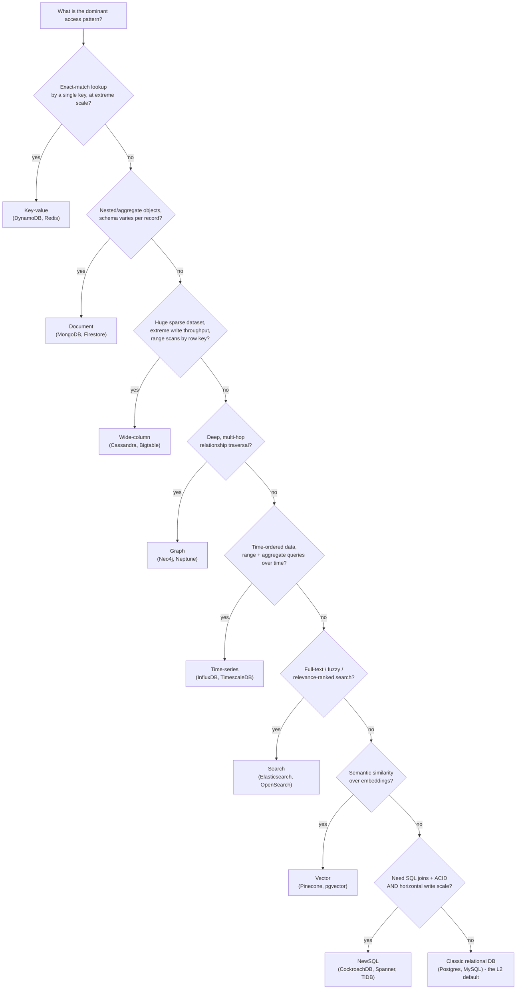

# NoSQL Families

_L2 and L3 built deep mastery of one storage model - the relational database, with its fixed schema, SQL, joins, and ACID transactions - plus the cache layer that sits in front of it. This is the opening topic of L4, and it exists because the relational model, for all its rigor, is not the only shape data comes in, nor the only access pattern applications need to serve at scale. "NoSQL" is not one thing; it is an umbrella over at least eight genuinely different data models, each invented to make one specific access pattern fast and cheap at a scale or shape where the relational model starts to strain. This topic surveys all eight - key-value, document, wide-column, graph, time-series, search, NewSQL, and vector - covering, for each, what it is, why it exists, how it works internally, what it trades off, and which real systems embody it, before closing with the actual question every one of these exists to answer: given a specific access pattern, which family fits?_

## Contents

- [Why NoSQL exists: what the relational model struggles with at scale](#why-nosql-exists-what-the-relational-model-struggles-with-at-scale)
- [ACID vs BASE, briefly](#acid-vs-base-briefly)
- [Key-value stores](#key-value-stores)
- [Document databases](#document-databases)
- [Wide-column (column-family) stores](#wide-column-column-family-stores)
- [Graph databases](#graph-databases)
- [Time-series databases](#time-series-databases)
- [Search engines](#search-engines)
- [NewSQL](#newsql)
- [Vector databases](#vector-databases)
- [How NewSQL and vector databases relate to the classic families](#how-newsql-and-vector-databases-relate-to-the-classic-families)
- [Choosing between families given access patterns](#choosing-between-families-given-access-patterns)
- [Trade-offs, side by side](#trade-offs-side-by-side)
- [How this connects](#how-this-connects)
- [Real-world & sources](#real-world--sources)
- [Check yourself](#check-yourself)

## Why NoSQL exists: what the relational model struggles with at scale

None of what follows is a claim that the relational model is wrong - [L2 covered in depth](../L2/01-relational-model.md) why normalization, ACID, and SQL are precisely the right tool for data that is genuinely tabular, needs strong multi-row consistency, and fits on hardware a single well-tuned primary (plus read replicas) can serve. NoSQL families exist because four specific pressures push past what that model comfortably gives you:

- **The data isn't naturally shaped like rows and columns.** A social graph (who follows whom), a nested JSON order object (an order with line items, each with its own attributes), a 768-dimensional embedding vector, a stream of timestamped sensor readings, or free text meant to be searched by relevance - none of these map cleanly onto a normalized table without either an awkward join-heavy schema or throwing away the structure that makes the data useful in the first place. Forcing a fundamentally hierarchical, graph-shaped, or vector-shaped problem into rows and foreign keys creates an **impedance mismatch**: the application's natural in-memory representation (a nested object, an adjacency list, a vector) has to be laboriously translated into and out of a relational schema on every read and write.
- **Write throughput and dataset size outgrow a single writable node.** A relational primary is, architecturally, one machine (plus read replicas that can serve reads but not, by default, accept writes) - [connection pooling and OLTP-vs-OLAP already surfaced this ceiling](../L2/12-connection-pooling.md) at the single-node level. Scaling writes horizontally means sharding, and classic relational engines don't shard themselves automatically: sharding a MySQL/Postgres fleet is something the application or a middleware layer (e.g. Vitess for MySQL) has to build and operate, and cross-shard joins/transactions become hard or unsupported the moment data spans multiple independent primaries. Several NoSQL families were built with automatic, transparent horizontal partitioning as a first-class feature from day one, precisely to remove this manual burden.
- **Rigid schema doesn't fit fast-evolving or heterogeneous data.** A relational table's columns are fixed and every row must conform (`NULL` for anything that doesn't apply) - fine for genuinely uniform data, painful for a product catalog where every product category has wildly different attributes, or for an application whose data shape changes weekly during early iteration. Schema-flexible families let each record define its own shape at write time, deferring "what does this data mean" enforcement to the application (schema-on-read) rather than the database (schema-on-write).
- **Some access patterns need index structures a B-tree fundamentally can't provide efficiently.** Full-text relevance ranking, k-nearest-neighbor search over high-dimensional vectors, and multi-hop graph traversal are three access patterns where [B-tree indexing](../L2/08-indexing.md#b-tree-indexes) - built for exact-match and range queries on scalar columns - simply doesn't help; each of these needed its own purpose-built index structure (inverted index, ANN graph, adjacency pointers), which is exactly what the search, vector, and graph families exist to provide.

## ACID vs BASE, briefly

[ACID](../L2/04-acid.md) is the relational model's consistency contract: every transaction is Atomic, Consistent, Isolated, and Durable, enforced by the database itself, at the cost of coordination overhead (locking, consensus, or MVCC bookkeeping) that grows as the number of participating nodes grows. Most of the NoSQL families below were originally built around a looser contract instead, commonly summarized as **BASE**:

- **Basically Available** - the system prioritizes responding (even with possibly stale or approximate data) over refusing to respond, favoring availability under network partitions rather than blocking until strong consistency can be guaranteed (the practical instance of the CAP trade-off, [covered in full rigor in L5](../L5/01-cap-and-pacelc.md)).
- **Soft state** - a replica's state can change over time even without new writes to it, simply as it catches up via replication/anti-entropy - there's no assumption that "no write means no change."
- **Eventually consistent** - if no new writes occur, all replicas will *eventually* converge to the same value, but there is no bound guaranteeing they agree *right now* - a read immediately after a write on a different replica can return a stale value.

This is a spectrum, not a binary: DynamoDB and Cassandra were built BASE-first but expose tunable consistency (quorum reads/writes, [covered in L4's own quorum topic](02-replication.md)); MongoDB added multi-document ACID transactions in version 4.0 (`verify` exact version/date); NewSQL systems (below) explicitly reject the BASE trade-off and keep full ACID while still scaling horizontally. The point of naming BASE here is vocabulary, not a rule that "NoSQL means eventual consistency" - each family's actual consistency guarantee is described in its own section below, and the deeper mechanics of consistency models generally belong to L5.

## Key-value stores

**What it is / the data model.** The simplest possible model: an opaque `key -> value` mapping, accessed almost exclusively by exact key (`GET`/`PUT`/`DELETE`), with the value treated as an uninterpreted blob the database doesn't parse or query into. Some key-value stores add a secondary "sort key" to support range queries within a partition (DynamoDB's partition key + sort key), but there is no query language, no joins, and generally no server-side understanding of the value's internal structure.

**Why it exists.** When every access is "give me the value for this exact key," a relational engine's SQL parser, query planner, and join machinery are pure overhead paying for capability the workload never uses. Stripping all of that away leaves a data structure that can be partitioned trivially (hash the key, route to the owning node) and scaled close to linearly by adding nodes - the model [L3 already covered in depth for the in-memory case (Redis/Memcached)](../L3/03-redis-vs-memcached.md) is the same model, just now considered as a durable, horizontally-partitioned distributed store rather than a cache.

**How it works internally.** Distributed key-value stores partition the keyspace across nodes - either via **consistent hashing** (the Dynamo-style ring, `verify` full mechanics covered later in this level) so that adding/removing a node moves only a bounded slice of keys, or via contiguous key ranges. Each partition is typically backed by an LSM-tree (DynamoDB, Cassandra's own KV layer, Riak) or an in-memory hash table (Redis), for the same write-throughput reasons [L2's storage-engines topic derived generically](../L2/10-storage-engines.md#lsm-tree-storage-engines-the-write-path-and-read-path-end-to-end). Replication is commonly leaderless with **quorum-based** reads and writes (`R + W > N`, [covered in this level's own quorum topic](02-replication.md)) rather than a single leader, so any replica can accept a write and the system tolerates individual node failures without an election.

**Trade-offs.** Extremely low, predictable latency (single-digit milliseconds) and near-linear horizontal scalability for point lookups, at the cost of: no secondary indexes by default (querying by anything other than the key means a full scan or a separately maintained index), no joins, and application-level denormalization done up front around exactly the access patterns the system needs to serve - the "design the schema around the query, not the query around the schema" discipline this whole level returns to repeatedly. DynamoDB added multi-item transactions (up to 100 items/4 MB, `verify` current limits) in 2018, narrowing but not eliminating this gap.

**Canonical systems.** **DynamoDB** (AWS-managed, partition key + optional sort key, single-digit-millisecond p99 at effectively unbounded scale, tunable eventual/strong consistency per read); **Redis** (in-memory, richer data structures, already covered in depth in L3); also **etcd** (a strongly-consistent KV store built on Raft consensus, used for cluster coordination/configuration rather than application data - a different point on the consistency spectrum from Dynamo-style leaderless KV stores, worth naming so "key-value store" isn't read as one monolithic consistency guarantee).

## Document databases

**What it is / the data model.** Records are self-describing, semi-structured **documents** - typically JSON or BSON (MongoDB's binary JSON) - grouped into collections, where each document can contain nested objects and arrays and different documents in the same collection can have different fields ("schema-on-read" rather than schema-on-write). A document is the natural unit of storage *and* the natural unit of retrieval: an entire order, with its line items nested inside, is one document rather than rows split across an `orders` table and an `order_items` table.

**Why it exists.** [Normalization](../L2/02-normalization-forms.md) is the right call when data is shared and updated independently across many contexts, but it forces exactly the kind of reassembly-via-join that a nested, aggregate-shaped object doesn't need: an application that always reads and writes a whole order as one unit pays a join cost on every read for a decomposition the application never actually wanted. Document stores are **aggregate-oriented**: they store the object the application actually works with as one physical unit, eliminating the object-relational impedance mismatch and letting each document's shape evolve independently (adding a new optional field to some products doesn't require an `ALTER TABLE` migration across the whole collection).

**How it works internally.** MongoDB's default storage engine, **WiredTiger** (since MongoDB 3.2, `verify` exact version), is itself a B-tree-based engine with per-document MVCC - so at the physical layer a document database can be built on the same storage-engine machinery [L2 covered generically](../L2/10-storage-engines.md), just organizing pages around whole BSON documents rather than fixed-width relational rows. Secondary indexes (including indexes into nested fields and arrays) are supported and are B-trees, same as a relational secondary index. Horizontal scaling is via **sharding**: MongoDB partitions collections by a chosen shard key (range-based or hashed) across shards, where each shard is itself a **replica set** (one primary, multiple secondaries, replicated via an operation log/oplog) for availability - the same leader-follower replication pattern this level covers generically, instantiated per shard.

**Trade-offs.** Flexible schema and a natural fit for hierarchical/aggregate data, with real secondary-index and query-language support (MongoDB's query language supports rich filtering, aggregation pipelines, and geospatial/text queries) - considerably more expressive than a pure key-value store - at the cost of: weaker cross-document consistency guarantees historically (multi-document ACID transactions arrived only in MongoDB 4.0, `verify` exact year 2018, and remain more expensive than a single-document write, which is atomic by default), a real risk of **data duplication** when the same fact is denormalized into multiple documents (an address duplicated into every order document written for a customer means every order must be updated if that address changes, or the duplication is accepted as a deliberate trade-off), and unbounded document growth (an array that keeps growing, e.g. comments embedded in a post) eventually hitting per-document size limits (16 MB in MongoDB, `verify`) or degrading write performance.

**Canonical systems.** **MongoDB** (the canonical general-purpose document database); **Amazon DocumentDB** (MongoDB-API-compatible but built on a different underlying storage layer, `verify` details); **Google Firestore** (document model with built-in real-time client sync, common in mobile/web app backends).

## Wide-column (column-family) stores

**What it is / the data model.** Conceptually a distributed, sorted, sparse map: `row key -> column family -> column name -> value` (Bigtable's own formal model adds a timestamp dimension: `(row: string, column: string, time: int64) -> string`). Rows are identified by a row key and sorted by it; each row can have an arbitrarily different, sparse set of columns grouped into column families - there is no requirement that every row populate the same columns, unlike a relational table's fixed column set.

**Why it exists.** This model was built (originally at Google, for Bigtable) for datasets that are both **enormous** and **sparse** - petabytes of data where any given row might have thousands of possible columns but populates only a handful, and where the workload needs sustained, very high write throughput plus efficient range scans by row key. A relational table would need either a huge number of mostly-`NULL` columns or an awkward entity-attribute-value schema to represent the same sparsity; a wide-column store represents "this row simply doesn't have that column" with zero storage cost, since unset columns are never written at all.

**How it works internally.** Wide-column stores are built on an **LSM-tree** storage engine almost without exception - [exactly the write path L2 derived generically](../L2/10-storage-engines.md#lsm-tree-storage-engines-the-write-path-and-read-path-end-to-end): writes append to a memtable and WAL, memtables flush to immutable, sorted SSTables, and background compaction merges them. This is what makes sustained high write throughput possible at this scale - random writes never happen, everything is sequential. Because rows are stored in row-key sort order, range scans by row key are efficient (row-key design is the primary schema-design lever, similar in spirit to a clustering key). Partitioning across nodes differs by system: Bigtable/HBase split the row-key space into contiguous **tablets/regions** that are dynamically split and rebalanced as they grow (leader-based per-tablet, built atop a distributed filesystem - Colossus for Bigtable, HDFS for HBase); Cassandra instead hashes the partition key (via a pluggable partitioner, commonly Murmur3) onto a **ring** and is leaderless, with tunable per-request consistency via quorums, closer in replication model to the KV family above than to Bigtable.

**Trade-offs.** Massive, near-linear write throughput and efficient range scans by row key at petabyte scale, at the cost of: no joins and very limited query flexibility - the row key and column-family layout must be designed around the known query patterns *in advance* ("query-first modeling," the wide-column family's version of the same access-pattern-first discipline every NoSQL family imposes), compaction overhead that must be actively monitored (the same [write/read/space-amplification trade-offs L2 quantified for LSM-trees generally](../L2/10-storage-engines.md#write-read-and-space-amplification-restated-at-the-whole-engine-level) apply directly), and, for leaderless designs like Cassandra, eventual consistency by default unless the application explicitly pays for stronger quorum settings.

**Canonical systems.** **Cassandra** (originated at Facebook, explicitly described in its own design as a hybrid of Amazon's Dynamo, `verify` for its distribution/replication model, and Google's Bigtable, `verify` for its data model - leaderless, ring-partitioned, tunable consistency); **Google Bigtable** (the original, leader-based per-tablet, underpins several large Google services including parts of Search's indexing and Gmail, `verify` exact product list); **HBase** (open-source Bigtable-architecture clone on HDFS); **ScyllaDB** (a C++ reimplementation of Cassandra's data/wire protocol, built for lower tail latency and better hardware utilization, `verify` specific benchmark claims).

## Graph databases

**What it is / the data model.** Data is modeled as **nodes** (entities, each with properties) connected by **edges** (relationships, each with a type, direction, and its own properties) - the **property graph** model, which Neo4j and most mainstream graph databases use. A separate lineage, the **RDF triple store** (subject-predicate-object statements, queried with SPARQL), targets semantic-web/knowledge-graph use cases and is worth naming as a distinct sub-family (`verify` which systems support which model - several, like Neptune, support both).

**Why it exists.** Traversing a multi-hop relationship in a relational schema - "friends of friends of friends," or "accounts connected to this one through any chain of shared devices/cards, for fraud detection" - requires a **self-join per hop**: a 4-hop traversal is (at least) a 4-way join against the same table, whose cost grows combinatorially with hop count and dataset size, because a relational join has to search for matching rows via an index probe at every hop. Graph databases exist to make this specific access pattern - deep, unpredictable-depth traversal of highly connected data - cheap regardless of total dataset size, by storing the connections themselves as the primary retrieval structure rather than as rows to be joined.

**How it works internally.** Neo4j's defining implementation technique is **index-free adjacency**: each node record stores a direct pointer to its first relationship record, and each relationship record stores direct pointers to the next relationship for both the node it starts from and the node it ends at, forming a set of doubly linked lists per node. Traversing to a node's neighbors is therefore a **pointer chase** - following a fixed-size record's direct physical reference - not an index lookup, so traversal cost is proportional to the number of edges actually visited, essentially independent of how many other nodes exist in the entire graph. This is the structural reason a graph database's multi-hop query can outperform a relational join-chain by orders of magnitude on the exact access pattern it's built for. Other systems layer a graph query API over a different underlying storage engine instead of building a native pointer-chasing engine - **JanusGraph** over Cassandra, HBase, or Bigtable; **Amazon Neptune** with its own storage layer (`verify` internals) exposing Gremlin, openCypher, and SPARQL as three separate query interfaces over the same underlying data.

**Trade-offs.** Very fast, predictable-cost multi-hop traversal and a natural fit for highly connected data (social graphs, fraud/anti-money-laundering ring detection, recommendation via "people who bought X also bought," knowledge graphs) at the cost of: horizontal partitioning is genuinely hard - **graph partitioning is a well-known hard combinatorial problem** (minimizing edges cut across shard boundaries while balancing shard size), and a naive partition means many traversals cross node boundaries and pay a network round trip per hop, defeating the whole point; aggregate/analytical queries over the whole graph (global counts, whole-graph statistics) are not what the index-free-adjacency design optimizes for and can be slower than a purpose-built OLAP engine; and the ecosystem/tooling maturity for extreme write throughput at Cassandra/DynamoDB scale is generally behind the KV and wide-column families.

**Canonical systems.** **Neo4j** (the canonical native property-graph database, Cypher query language, ACID transactions on top of index-free adjacency); **Amazon Neptune** (managed, supports both the property-graph model via Gremlin/openCypher and the RDF model via SPARQL, `verify` exact feature parity by version).

## Time-series databases

**What it is / the data model.** Data points are indexed primarily by **timestamp**, each tagged with metadata (tags/labels identifying the source - host, sensor, region) and carrying one or more numeric fields - e.g. `cpu_usage{host="web-1",region="us-east"} 0.42 @ t`. The overwhelming majority of writes are **appends of new, ever-increasing timestamps**; updates to old data are rare-to-nonexistent, and old data is routinely and wholesale **expired** rather than individually deleted.

**Why it exists.** This access pattern - extremely high-volume, strictly-append writes, queried almost always by a time range plus tag filters, and aggregated (downsampled) over rolling windows - is exactly the shape a general-purpose B-tree engine is *not* specialized for: a B-tree treats every row as equally likely to be randomly updated and indexes generically, paying overhead a workload that never updates old rows and never does point lookups by anything but time+tags doesn't need. Metrics pipelines (infrastructure monitoring, IoT telemetry, financial tick data) can produce millions of points per second, and need retention (drop data older than N days) to be a cheap, wholesale operation rather than a row-by-row `DELETE`.

**How it works internally.** Time-series engines lean on three specialized techniques a general-purpose engine doesn't need: **specialized compression** exploiting the fact that consecutive timestamps and consecutive values from the same series are highly predictable - delta-of-delta encoding for timestamps and XOR-based encoding for floating-point values, the technique Facebook's **Gorilla** in-memory TSDB popularized (`verify` exact algorithm details), commonly compressing time-series data to a small fraction of its raw size; **time-based partitioning ("chunking")**, where data is automatically split into per-time-range shards so that retention/expiry becomes dropping a whole chunk (cheap, sequential) instead of scanning and deleting individual rows - TimescaleDB's **hypertables** do exactly this transparently on top of PostgreSQL, splitting one logical table into many physical per-time-range chunk tables while presenting a single SQL table to the query layer; and **continuous/rollup aggregation**, precomputing downsampled views (e.g. per-minute averages from per-second data) so long-range queries don't have to scan raw high-resolution data. InfluxDB's own storage engine, the **TSM (Time-Structured Merge) tree**, is LSM-tree-like in spirit - in-memory cache plus immutable, time-ordered on-disk files merged via compaction - adapted specifically for the append-and-expire access pattern.

**Trade-offs.** Extremely efficient ingestion, compression, and cheap wholesale expiry for time-ordered data, plus purpose-built downsampling/aggregation, at the cost of: a poor fit for access patterns that aren't time-range-bounded (e.g. "find every reading ever recorded for sensor X regardless of when" can be inefficient if the engine assumes a time-range filter is always present), and generally limited or no support for arbitrary joins/relational integrity constraints outside of TimescaleDB, which - being a Postgres extension rather than a purpose-built engine - keeps full SQL and joins at some cost to the ingestion-rate ceiling a purpose-built TSDB reaches.

**Canonical systems.** **InfluxDB** (purpose-built TSDB, TSM storage engine, its own query language(s)); **TimescaleDB** (a PostgreSQL extension, giving full SQL/joins/ACID plus automatic time-partitioning via hypertables - the "keep everything Postgres already gives you, add time-series-specific partitioning and compression" approach); **Prometheus** (a pull-based metrics system with its own embedded TSDB, purpose-built for infrastructure monitoring specifically rather than general time-series storage, `verify` scope boundary).

## Search engines

**What it is / the data model.** Documents are indexed via an **inverted index**: a mapping from each distinct term to the list of document IDs (a **postings list**) containing that term, typically also storing term positions (for phrase queries) and term-frequency statistics (for relevance scoring). This is the structural opposite of a forward index (document -> terms) and is what makes "find every document containing this word" fast without scanning every document.

**Why it exists.** A relational `LIKE '%term%'` query can't use a B-tree index at all once the pattern has a leading wildcard (a B-tree's ordering only helps when you know a *prefix*), and even a well-indexed exact-match query gives no notion of **relevance ranking** - which matching document is the *best* match, not just *a* match. Full-text search needs tokenization (splitting text into terms), normalization (lowercasing, stemming/lemmatization so "running" matches "run"), typo tolerance/fuzzy matching, and a scoring function that ranks results - none of which a general-purpose relational or NoSQL index provides natively.

**How it works internally.** At index time, text is run through an **analyzer**: tokenized, lowercased, stemmed, and stripped of stopwords, producing the terms actually stored in the inverted index. At query time, matching documents are found by looking up the postings lists for the query's terms and intersecting/unioning them (postings lists are commonly compressed and skip-list-accelerated to make this intersection fast even for very common terms with huge postings lists), then **scored** for relevance - modern Elasticsearch/Lucene default to **BM25** (a probabilistic ranking function that improves on classic TF-IDF by better handling term-frequency saturation and document-length normalization, `verify` exact version this became default, commonly cited as Lucene 6+/Elasticsearch 5+). Elasticsearch and OpenSearch, both built on **Apache Lucene** as their underlying single-node index library, shard each logical index into multiple **Lucene shards** distributed and replicated across nodes for horizontal scale and availability, and make newly indexed documents searchable only after a periodic **refresh** (default interval commonly ~1 second, `verify`) - a deliberate near-real-time, not immediately-consistent, design.

**Trade-offs.** Excellent relevance ranking, full-text/fuzzy search, and rich faceted filtering/aggregation, with horizontal scale via sharding, at the cost of: not meant to be a system of record - Elasticsearch/OpenSearch are near-real-time, not immediately consistent, and lack the transactional guarantees a primary datastore needs, so production architectures almost universally pair a search engine with a genuine source-of-truth database and a sync mechanism (dual-write, or - preferably - [change data capture](02-replication.md), a topic covered later in this level) to keep the search index current; and the inverted index (plus, for high-cardinality fields, additional structures like doc-values for sorting/aggregation) is memory- and resource-intensive relative to a comparably-sized relational table.

**Canonical systems.** **Elasticsearch / OpenSearch** (the dominant general-purpose search-and-analytics engines, both built on Apache Lucene); **Algolia** (managed, latency-optimized specifically for typeahead/instant-search UX); **Meilisearch** and **Typesense** (lighter-weight, developer-experience-focused alternatives, `verify` current feature parity and adoption relative to Elasticsearch).

## NewSQL

**What it is.** NewSQL is not a new data model - it is the **relational model, SQL, and full ACID transactions**, delivered on an architecture that automatically shards data and replicates it via a consensus protocol across many commodity nodes, the way NoSQL systems do, instead of requiring a single powerful primary the way classic RDBMSs do.

**Why it exists.** NoSQL solved horizontal write scaling but, in most of the families above, gave up multi-row ACID transactions and general-purpose SQL joins - a real cost for domains (financial ledgers, inventory, anything needing strict multi-entity consistency) that genuinely need both scale *and* strong guarantees. Sharding a classic RDBMS manually (application-level shard routing, or a proxy layer like Vitess for MySQL) works but is operationally heavy and makes cross-shard transactions/joins hard or unsupported. NewSQL exists to answer: **can a database give you both** - the horizontal scalability NoSQL pioneered, and the SQL/ACID guarantees a relational database already gives, without asking the application to choose?

**How it works internally.** Data is automatically partitioned into small, contiguous key ranges (called "ranges" in CockroachDB, "regions" conceptually similar to Bigtable's tablets) distributed across nodes; each range is independently replicated via a **consensus protocol** - **Raft** in CockroachDB and TiDB, a Paxos-derivative in Google Spanner - so that a range survives individual node failure without losing any acknowledged write, the same principle [replication covers generically later in this level](02-replication.md) but with the specific guarantee that a majority of replicas must durably agree before a write is acknowledged, rather than a single leader's local disk being the only durability boundary. Transactions that touch multiple ranges (spanning multiple nodes) are coordinated via **two-phase commit** layered on top of each range's own consensus-replicated log, combined with an **MVCC**-based concurrency model - [the same MVCC mechanics L2 covered for a single node](../L2/06-mvcc.md), scaled to assign globally-comparable version timestamps across many nodes rather than one. Google Spanner's specific innovation on top of this is **TrueTime**: a globally synchronized clock (GPS plus atomic clocks in every datacenter) that exposes not a single timestamp but a *bounded uncertainty interval*, letting Spanner assign transaction timestamps that are globally, externally consistent without any single node acting as a global sequencing bottleneck - `verify` exact TrueTime uncertainty bounds (Spanner's paper cites low milliseconds, `verify`).

**Trade-offs.** SQL, joins, and full ACID transactions with horizontal, often multi-region, write scalability - the two things classic RDBMS and classic NoSQL each gave up half of - at the cost of: higher latency on any transaction that spans multiple ranges/nodes, since consensus (a round trip to a majority of replicas) and, for multi-range transactions, two-phase commit both add real network round trips to the write path compared to a single-node RDBMS's local commit; genuinely higher operational complexity in running and reasoning about a distributed consensus-based cluster (failure modes, rebalancing, clock-skew sensitivity for TrueTime-style designs); and a shorter production track record at the most extreme scales outside of Google itself, though CockroachDB and TiDB both have real, sizable production deployments (`verify` specific case studies, reserved for the real-world pass).

**Canonical systems.** **Google Spanner** (globally distributed, TrueTime-based external consistency, the system that originated this category); **CockroachDB** (open-source, explicitly Spanner-inspired, Raft-based, PostgreSQL-wire-compatible); **TiDB** (MySQL-wire-compatible, built on the Raft-based **TiKV** distributed KV storage layer underneath a separate SQL layer).

## Vector databases

**What it is / the data model.** Each record is a high-dimensional numeric **vector** (an embedding - commonly hundreds to low thousands of dimensions, `verify` typical ranges by model) produced by a machine-learning model to represent the semantic content of some object - a sentence, an image, an audio clip - plus optional metadata for filtering. The fundamental query is not exact match but **k-nearest-neighbor (k-NN) similarity search**: "return the k vectors most similar to this query vector," under a distance metric such as cosine similarity, Euclidean (L2) distance, or dot product.

**Why it exists.** No exact-match or range index - not a B-tree, not a hash index, not an inverted index - can efficiently answer "which vector is closest to this one in 768-dimensional space." This is the **curse of dimensionality**: as dimensionality grows, the notion of "nearby" degrades and any exact-indexing structure that relies on ordering or partitioning a low-dimensional key space stops being useful, while a brute-force linear scan (compare the query vector against every stored vector) becomes prohibitively slow past even modest dataset sizes. Vector databases exist specifically to make **approximate nearest-neighbor (ANN)** search fast at billion-vector scale - accepting a small, tunable amount of missed-true-neighbor error (recall loss) in exchange for orders-of-magnitude speedup over exact search - which is the engine underneath semantic search, recommendation, and retrieval-augmented generation (RAG) for LLMs.

**How it works internally.** The dominant algorithm today is **HNSW (Hierarchical Navigable Small World graphs)**: a multi-layer graph is built where each vector is a node connected to its approximate nearest neighbors, with sparser, longer-range links at upper layers (enabling fast, coarse initial navigation across the whole space) and denser, short-range links at the bottom layer (for fine-grained search among close neighbors); a query greedily descends from the top layer, at each layer moving to whichever neighbor is closest to the query vector, giving roughly logarithmic search cost instead of the linear cost of an exhaustive scan (`verify` HNSW's original description, Malkov and Yashunin). Two other approaches are commonly combined with or used instead of HNSW: **IVF (inverted file index)** - partition the vector space into clusters (via a k-means-like step), and at query time search only the handful of clusters nearest the query vector, skipping the rest entirely; and **product quantization (PQ)** - compress each vector into a much smaller quantized representation to cut memory footprint dramatically, commonly paired with IVF as "IVF-PQ" to trade some accuracy for a large reduction in both memory and search time. Every one of these is inherently **approximate** - the "A" in ANN - trading a small, tunable recall loss for large speed and memory gains versus exact search.

**Trade-offs.** Purpose-built vector databases (Pinecone, Milvus, Qdrant, Weaviate) get the most mature ANN index tuning, the ability to combine similarity search with metadata filtering efficiently, and the highest scale ceiling, at the cost of running and operating yet another specialized system that has to be kept in sync with whatever holds the actual source objects. "Bolt-on" vector support inside an existing general-purpose database - **pgvector** inside PostgreSQL, or vector-search features added to Elasticsearch, MongoDB, and Redis - keeps vectors co-located with the rest of an application's relational or document data (fewer moving parts, transactional consistency between a row and its embedding, one system to operate) at some cost in ANN performance and scale ceiling relative to a system architected around ANN indexing as its entire reason for existing.

**Canonical systems.** **Pinecone** (managed, purpose-built vector database); **pgvector** (a PostgreSQL extension adding a native vector column type plus HNSW and IVFFlat index types, `verify` version each index type was added); also worth naming **Milvus**, **Weaviate**, and **Qdrant** as other open-source, purpose-built options (`verify` relative maturity/adoption for the real-world pass).

## How NewSQL and vector databases relate to the classic families

Both NewSQL and vector databases are worth setting apart explicitly, because neither is really "another item on the same list" as KV/document/wide-column/graph/time-series/search:

- **NewSQL is not a new data model at all - it is a new *architecture* for the oldest data model here.** Every family above it in this document picked a data model specifically shaped for one access pattern (key-value for exact lookup, document for aggregates, wide-column for sparse high-write data, graph for traversal, time-series for time-ordered metrics, search for relevance ranking) and, in trade, generally gave up something the relational model has always had (joins, ad hoc queries, or full ACID). NewSQL is the answer to a different question entirely: *given that I want to keep the relational model's queries, joins, and transactions, can I still get NoSQL's horizontal scalability?* It borrows NoSQL's partitioning and consensus-based replication techniques, but the data sitting on top of that architecture is still rows, tables, foreign keys, and SQL - which is why it's more accurate to think of NewSQL as "distributed-systems techniques applied to the relational model" than as a sibling of the other seven families.
- **Vector databases are not a general-purpose data model either - they are a specialized *index type* (and its supporting infrastructure) bolted onto or built around whatever holds the actual data.** A vector database still needs somewhere to keep the source objects and their metadata; pgvector makes this explicit by putting the vector type and its ANN index directly inside a relational table alongside ordinary columns, and even purpose-built vector databases (Pinecone, Milvus) store metadata payloads next to each vector precisely because "find similar vectors" is nearly always step one of a query that then needs to filter or join against other facts about those objects. The right mental model is: **vector search is a capability every family can potentially grow (as several already have), not an eighth, independent way of organizing all of an application's data** - which is exactly why it shows up bolted onto Postgres, Elasticsearch, MongoDB, and Redis alike, rather than only ever appearing as a wholly separate system.

## Choosing between families given access patterns

The single question every family above answers a different version of is: **what does this application actually do to the data, and how often?** Concretely - what's the read/write ratio, are queries by exact key, by range, by relationship, by similarity, or by relevance, does the schema change shape often, and does correctness require strong multi-row transactions?

Two important caveats this diagram simplifies:

- **Most real systems are polyglot, not single-family.** A production e-commerce backend commonly runs Postgres (or a NewSQL system) as the transactional source of truth for orders and inventory, Elasticsearch for product search, Redis for session/cache state, and possibly a wide-column or time-series store for clickstream/event analytics - each family owns the slice of the workload its access pattern actually fits, with data flowing between them (often via [change data capture](02-replication.md), covered later in this level) rather than one database trying to be everything.
- **"Which family" is a first pass, not the final answer.** Once a family is chosen, the harder and more consequential work is [data modeling and denormalization](06-data-modeling-and-denormalization.md) *within* that family - designing the actual keys, partitions, and document/row shapes around the real query patterns, which is where most of a NoSQL system's eventual performance and operability is actually decided.

## Trade-offs, side by side

| Family | Best-fit access pattern | Canonical strength | Canonical cost |
| --- | --- | --- | --- |
| Key-value | Exact-key lookup at extreme scale | Lowest latency, near-linear horizontal scale | No secondary indexes/joins by default; upfront denormalization required |
| Document | Nested/aggregate objects, evolving schema | No join needed to read a whole aggregate; flexible per-record shape | Weaker cross-document consistency (improving); duplication risk |
| Wide-column | Huge sparse datasets, extreme write throughput | Sustained high write throughput; efficient row-key range scans | No joins; row/column-key layout must be designed around known queries |
| Graph | Deep, multi-hop relationship traversal | Traversal cost independent of total dataset size (index-free adjacency) | Hard to partition well; not built for whole-graph aggregates |
| Time-series | Time-ordered data, range + aggregate queries | Extreme compression/ingestion rate; cheap wholesale retention | Poor fit outside time-range-bounded queries; limited joins (outside TimescaleDB) |
| Search | Full-text, fuzzy, relevance-ranked queries | Best-in-class relevance ranking and faceted filtering | Near-real-time, not a system of record; memory-heavy |
| NewSQL | Need SQL/ACID *and* horizontal scale | Full transactions/joins at horizontal scale | Higher multi-range transaction latency; operational complexity |
| Vector | Semantic similarity over embeddings | Sub-linear ANN search at billion-vector scale | Approximate by construction; needs a paired source-of-truth store |

## How this connects

- **Back to L2 (storage and relational databases)** - every internal mechanism named above (LSM-trees, B-trees, MVCC, WAL, leader-follower replication) is a direct reuse of what [indexing](../L2/08-indexing.md), [storage engines](../L2/10-storage-engines.md), [MVCC](../L2/06-mvcc.md), and [the write-ahead log](../L2/09-write-ahead-log.md) already covered generically - this topic's job was to show which family builds on which mechanism, not to re-derive the mechanisms themselves.
- **Back to L3 (caching and data access)** - [Redis vs. Memcached](../L3/03-redis-vs-memcached.md) is, in this topic's terms, a deep dive on one specific key-value store considered as a cache; this topic re-frames the same system as one point in a much larger space of durable, horizontally-scaled key-value stores (DynamoDB) built on the same underlying model.
- **Forward to replication (next in L4)** - every family above referenced leader-follower or leaderless replication in passing (MongoDB's replica sets, Cassandra's ring, NewSQL's consensus-replicated ranges); the next topic covers the generic replication patterns (leader-follower, multi-leader, leaderless) that each family's specific choice is an instance of.
- **Forward to partitioning and sharding, and consistent hashing** - the "hash the key onto a ring" and "split into contiguous ranges" partitioning strategies named throughout this topic (DynamoDB, Cassandra, Bigtable, NewSQL ranges) are exactly what those next two topics formalize.
- **Forward to quorums (R + W > N)** - the tunable consistency this topic gestured at for DynamoDB, Cassandra, and other leaderless systems is formalized precisely in that later topic.
- **Forward to data modeling and denormalization** - this topic's recurring refrain ("design the schema around the access pattern, not the other way around") is the exact subject of that dedicated later topic, one level deeper than the family-selection question this topic answers.
- **Forward to L5 (distributed systems theory)** - the BASE/eventual-consistency vocabulary introduced briefly here, and the CAP trade-off referenced in passing, get their full formal treatment (CAP/PACELC, consistency models, consensus) in L5, which this level as a whole is a prerequisite for.
- **Forward to L12 and L13** - real-time OLAP systems (Pinot, Druid, ClickHouse) and probabilistic structures (Bloom filters, HyperLogLog) build on several of the storage patterns introduced here (LSM-trees, wide-column-style sparse storage) for analytical rather than transactional workloads; L13's search/typeahead and recommendation topics build directly on the inverted-index and vector-search mechanics covered in this topic's search and vector sections.

## Real-world & sources

Three verified engineering-blog examples, deliberately spanning three different families (document, wide-column, graph-on-non-graph) rather than repeating one family:

- **Stripe - document database (MongoDB-based DocDB), fintech.** Stripe adopted MongoDB in 2011 because its schema-less document model was more productive for developers than a relational schema for Stripe's fast-evolving financial data shapes, and its native sharding gave a horizontal-scaling path the team needed as transaction volume grew. As Stripe scaled, it built **DocDB** - an internal database-as-a-service layered on open-source MongoDB - specifically to get stronger security controls, a minimal/vetted query surface (to prevent expensive ad hoc queries from suboptimal client code), multi-tenancy with quotas, and zero-downtime data movement between shards, none of which stock MongoDB (pre-Atlas) offered at the time. As of the source, DocDB serves roughly **5 million queries/second** across **2,000+ shards** and **5,000+ collections**, with **99.999% uptime**, underpinning Stripe's processing of over $1 trillion in payment volume annually. Source: [How Stripe Scaled to 5 Million Database Queries Per Second](https://blog.bytebytego.com/p/how-stripe-scaled-to-5-million-database) (ByteByteGo, summarizing Stripe's own engineering blog; accessed 2026-07-16). Stripe's original post lives at [stripe.dev/blog](https://stripe.dev/blog/how-stripes-document-databases-supported-99.999-uptime-with-zero-downtime-data-migrations) (`verify` - the live page returned only a header/index when fetched directly; the ByteByteGo summary above was used to confirm the technical claims and scale numbers).
- **Discord - wide-column store, Cassandra then ScyllaDB, migrated for operational reasons.** Discord picked **Cassandra** in 2017 specifically because it needed "a database that was scalable, fault-tolerant, and relatively low maintenance" ahead of anticipated growth in message volume - a textbook wide-column choice for a huge, ever-growing, mostly-append dataset (messages keyed by channel). By 2022, at trillions of stored messages across a 177-node cluster, two specific wide-column pain points forced a migration to **ScyllaDB** (Cassandra-wire-compatible, written in C++): **hot partitions** - large servers/channels concentrated far more write/read traffic onto single partitions than small ones, and because Discord used quorum consistency, an overloaded node serving a hot partition degraded latency cluster-wide - and **JVM garbage-collection pauses**, which caused latency spikes severe enough to sometimes require manual node reboots. ScyllaDB's shard-per-core, GC-free C++ architecture eliminated the GC class of incident and, combined with a new Rust "data services" layer added for request coalescing, cut message-read latency from roughly 200ms to 5ms. Source: [How Discord Stores Trillions of Messages](https://discord.com/blog/how-discord-stores-trillions-of-messages) (Discord Engineering Blog; accessed 2026-07-16).
- **Netflix - wide-column (Cassandra via KVDAL) chosen over a native graph database, for its Real-Time Distributed Graph.** Building an 8-billion-node/multi-billion-edge real-time graph, Netflix explicitly evaluated and **rejected native graph databases** (Neo4j, AWS Neptune) - Neo4j's memory requirements made it inefficient past hundreds of millions of records, and Neptune's single-writer architecture bottlenecked high-volume, multi-region real-time ingestion; more generally, native graph engines are optimized for deep traversal, not the full-dataset scans, property filtering, and continuous high-throughput event ingestion Netflix's workload actually needed. Instead Netflix built **KVDAL**, a key-value abstraction on top of **Apache Cassandra** (wide-column), using a two-level map (record -> sorted key-value items) to represent adjacency lists - trading a purpose-built graph engine for a wide-column store the team already knew how to operate and scale horizontally. This is a useful counter-example to "graph access pattern implies graph database": the family that wins in practice is the one that fits the operational and scale constraints, not just the abstract data shape. Source: [How and Why Netflix Built a Real-Time Distributed Graph, Part 2: Building a Scalable Storage Layer](https://netflixtechblog.medium.com/how-and-why-netflix-built-a-real-time-distributed-graph-part-2-building-a-scalable-storage-layer-ff4a8dbd3d1f) (Netflix Technology Blog; accessed 2026-07-16).
- **Pinterest - HBase (wide-column) deprecation, an instructive counter-case.** Pinterest adopted HBase in 2013 and ran one of the largest HBase deployments in the world (10+ petabytes, 10M+ QPS), powering its graph service, wide-column store, and other online systems. By the 2020s Pinterest deprecated HBase in favor of TiDB (NewSQL) and a custom RocksDB-based KVStore, citing concrete wide-column limitations at their scale: no distributed transactions or global secondary indexes forcing extra layers to be built on top (adding operational complexity), a version that had drifted 5 years behind upstream with a 2-year upgrade effort, and needing 6 data replicas for disaster recovery versus 3 for TiDB - a direct cost difference. This pairs well with the Discord/Netflix examples above as evidence that wide-column and NewSQL are genuinely competing options for the same "huge, high-throughput" access pattern, and the right choice shifts over a system's lifetime as requirements (transactions, secondary indexes) grow. Source: [HBase Deprecation at Pinterest](https://medium.com/pinterest-engineering/hbase-deprecation-at-pinterest-8a99e6c8e6b7) (Pinterest Engineering Blog; accessed 2026-07-16).

**India UPI/NPCI angle: not included.** A targeted search for NPCI/UPI's internal use of a specific NoSQL family (key-value or wide-column) at scale did not turn up a credible, dated, NPCI-sourced or reputable engineering write-up describing their actual database architecture (only general UPI technology-stack overviews with no database-family specifics). Flagging this gap openly rather than including an unverified claim - worth revisiting if a future source surfaces.

## Check yourself

- A colleague says "NoSQL means eventual consistency." Name two systems covered in this topic that contradict that claim, and explain what each one actually guarantees.
- Explain, in terms of index structures, why a relational B-tree index cannot efficiently answer either a full-text relevance-ranked query or a k-nearest-neighbor vector similarity query - what does each one need instead?
- A team is building a fraud-detection feature that needs to find all accounts connected to a flagged account through any chain of shared devices, IP addresses, or payment methods, up to 5 hops away. Which family fits best, and specifically why does a relational join-based approach get combinatorially worse as hop count grows while this family's approach doesn't?
- Why is NewSQL described in this topic as "not a new data model" - what exactly does it borrow from NoSQL, and what does it deliberately keep from the relational model that most NoSQL families gave up?
- A product catalog has highly variable attributes per category (a book has an ISBN and author; a TV has a screen size and resolution) and is read far more often than written. Would you reach for a document database or a wide-column store, and what's the specific difference in access pattern that should decide it?
- Explain why HNSW's search cost is roughly logarithmic rather than linear in the number of stored vectors, and name the specific trade-off (versus an exact linear scan) that makes this possible.
