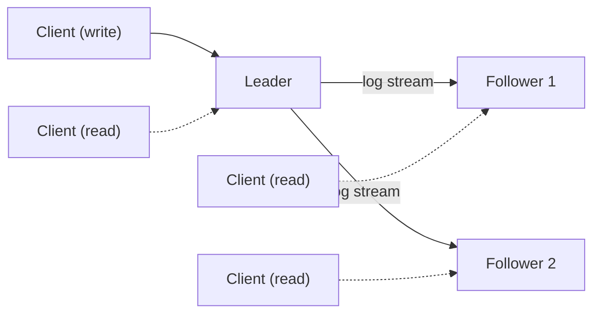
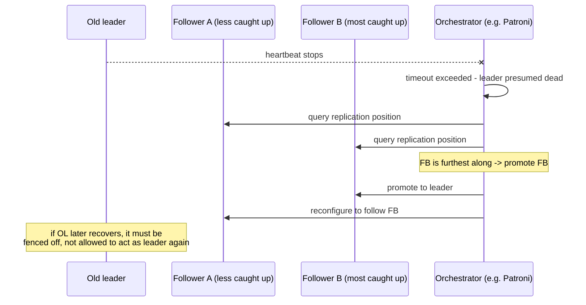
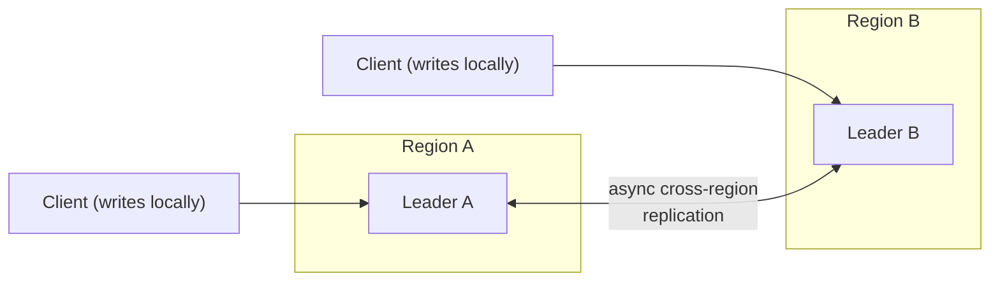
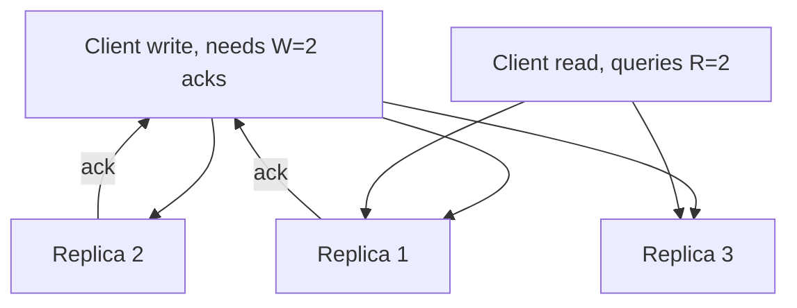

# Replication

_The previous topic surveyed eight data models and, in passing, named nearly every one of them as leaning on one of three replication topologies - MongoDB's replica sets, Cassandra's ring, NewSQL's consensus-replicated ranges. This topic makes that passing mention rigorous: what replication actually is and why every non-trivial system needs it, then each of the three topologies - leader-follower (single-leader), multi-leader, and leaderless - in full mechanical depth: how changes actually propagate, what happens when a node dies mid-flight, how conflicting concurrent writes get resolved when there's no single leader to serialize them, and the concrete, observable bugs that replication lag causes in production applications, independent of whichever formal consistency-model label L5 will later attach to each one._

## Contents

- [What replication is and why it exists](#what-replication-is-and-why-it-exists)
- [The synchronous/asynchronous axis](#the-synchronousasynchronous-axis)
- [Leader-follower (single-leader) replication](#leader-follower-single-leader-replication)
- [Failover: detecting and handling leader failure](#failover-detecting-and-handling-leader-failure)
- [Multi-leader replication](#multi-leader-replication)
- [Conflict detection and resolution](#conflict-detection-and-resolution)
- [Leaderless replication](#leaderless-replication)
- [Sloppy quorums and hinted handoff](#sloppy-quorums-and-hinted-handoff)
- [Read repair and anti-entropy](#read-repair-and-anti-entropy)
- [Replication lag and its concrete consequences](#replication-lag-and-its-concrete-consequences)
- [Trade-offs, side by side](#trade-offs-side-by-side)
- [How this connects](#how-this-connects)
- [Real-world & sources](#real-world--sources)
- [Check yourself](#check-yourself)

## What replication is and why it exists

**Replication is keeping the same data durably stored on multiple machines (replicas), connected by a network, so the loss or slowness of any single one of them doesn't mean the loss or slowness of the data itself.** It answers a different question than partitioning/sharding (covered next in this level): partitioning asks "how do I split *different* data across many nodes so no single node has to hold or serve all of it," while replication asks "how do I keep *the same* data safely duplicated." In any real large-scale system the two are combined - each partition/shard is itself replicated using one of the three topologies this topic covers - but they solve genuinely separate problems and are worth holding apart precisely for that reason.

Three distinct motivations drive the decision to replicate at all, and a real system usually wants more than one of them simultaneously:

- **Fault tolerance / high availability.** A single machine (or a single availability zone, or a single region) will eventually fail - disk failure, process crash, kernel panic, a whole data-center losing power. A copy of the data on an independent machine (ideally in an independent failure domain - a different rack, AZ, or region) means that failure doesn't mean data loss or an outage; some other replica can keep serving.
- **Read scaling.** A single node's read capacity is bounded by its own CPU, memory, and disk I/O. If reads vastly outnumber writes (the common case for most applications), spreading read queries across many replicas - each holding a full copy - lets read throughput scale roughly linearly with the number of replicas, without touching the write path at all.
- **Latency via geographic placement.** A round trip from Singapore to a single primary database in `us-east-1` costs on the order of 200+ ms (`verify` exact figure varies by route/provider) purely in network transit, regardless of how fast that database is. Placing a replica physically close to a population of users - a different region, a different continent - lets reads (and, in multi-leader/leaderless designs, writes too) be served locally, trading replication complexity for materially lower client-perceived latency.

## The synchronous/asynchronous axis

Before the three topologies, one design axis cuts across all of them and is worth naming up front, since every topology below makes this choice somewhere: does the node accepting a write **wait** for another replica to confirm receipt before telling the client "done"?

- **Synchronous replication** - the accepting node blocks until at least one other replica has durably received (or applied) the write, then acknowledges the client. Guarantees that replica is never behind by even one committed write, at the direct cost of every write's latency now including a network round trip to that replica - and, if that replica becomes unreachable, the accepting node either blocks indefinitely or must fail the write, trading availability for that guarantee.
- **Asynchronous replication** - the accepting node acknowledges the client immediately, and ships the change to other replicas in the background, on its own schedule. Client-facing write latency is unaffected by replica health or distance, at the cost of a durability gap: if the accepting node crashes before a given write has shipped, that write can be lost even though the client was already told it succeeded.
- **Semi-synchronous replication** - a deliberate middle ground: wait for confirmation from just one (or a small, configurable number) of replicas, and let the rest replicate asynchronously. PostgreSQL's `synchronous_standby_names` (naming which standby/standbys must confirm) and MySQL's semisynchronous replication plugin (`rpl_semi_sync`) both implement exactly this - most of async's low latency, most of sync's durability guarantee, because losing an acknowledged write now requires *both* the primary and its one synchronous standby to fail together, a materially rarer event than either failing alone.

This axis applies identically inside leader-follower replication (a leader choosing how many followers to wait on), multi-leader replication (how a leader waits, if at all, before replicating to peer leaders), and leaderless replication (where it resurfaces as the choice of **W**, the write quorum size, covered below) - it is one knob, reused by all three topologies, not a fourth topology of its own.

## Leader-follower (single-leader) replication

**What it is.** Exactly one node - the **leader** (also called primary/master) - accepts all writes. Any number of **followers** (replicas/secondaries/slaves) receive a continuous stream of every change the leader makes and apply it locally, and can serve reads, but never accept a write directly (a write sent to a follower is either rejected or silently forwarded to the leader).

**How changes actually ship - four techniques, in order of increasing decoupling from the physical storage engine:**

1. **Statement-based replication** - the leader ships the literal SQL statement it executed (`UPDATE accounts SET balance = balance - 100 WHERE id = 42`), and each follower re-executes that exact statement itself. Cheapest in bandwidth, but breaks the instant a statement's result depends on anything not captured in the statement text itself: `NOW()`, `RAND()`, auto-increment values assigned at execution time, or a stored procedure/trigger whose own side effects differ subtly by execution order on the follower versus the leader - any of which silently diverges the follower's data from the leader's without either side noticing. MySQL used this as its historical default (`binlog_format=STATEMENT`) before switching the default to row-based (`verify` exact version, commonly cited as MySQL 5.7.7); it remains available but is now the less-recommended option specifically because of this correctness risk.
2. **Write-ahead log (physical) shipping** - the leader ships the literal WAL bytes it already produces for its own crash recovery ([L2's WAL topic](../L2/09-write-ahead-log.md)), and the follower replays them using the identical redo logic a crash-recovery pass would use. This is PostgreSQL's default **streaming (physical) replication**: the follower ends up byte-for-byte identical to the leader at the disk-page level, at essentially zero extra encoding cost (the log already exists for durability purposes), but the follower is tightly coupled to the leader's exact major version and physical page format - it generally can't run a different major PostgreSQL version, filter which tables replicate, or feed a different downstream system.
3. **Row-based (logical) replication** - the leader ships a decoded, storage-format-independent description of exactly which rows changed and how ("table `accounts`, row with primary key 42: `balance` 500 -> 400"), rather than raw physical bytes. MySQL's binlog in `ROW` format and PostgreSQL's **logical replication** (built on `wal_level = logical`, introduced in PostgreSQL 10, `verify` exact version) both work this way. Decoupling from the physical format is exactly what makes selective replication possible - replicating a subset of tables, replicating across different major versions, or feeding an entirely different downstream consumer - which is precisely the mechanism change data capture tools (Debezium reading a binlog or a logical replication slot) read from, a connection this level returns to in its dedicated CDC topic.
4. **Trigger-based replication** - the oldest, most flexible, and heaviest approach: a database trigger fires on every write and manually inserts a corresponding record into a separate table or an external queue, entirely at the schema/application level rather than inside the storage engine itself (Bucardo, for PostgreSQL, is a canonical example, `verify` current maintenance status). Highest per-write overhead (an extra trigger execution and extra write on every change) but the only option flexible enough for replicating across genuinely different database products or applying heavy transformation in flight.

**Cascading replication.** Followers can themselves have their own followers (a follower re-ships the same stream it receives onward to sub-followers), reducing the leader's fan-out cost - the leader ships to a handful of second-tier followers instead of every replica in the fleet - at the price of an extra hop of lag for anything downstream of the first tier. Both PostgreSQL and MySQL support this topology.

**Trade-offs.** The dominant topology for exactly the reason it's the default in PostgreSQL, MySQL, and MongoDB: writes are trivially serialized (there is only ever one writer, so there's no concept of a write conflict to resolve), and reads scale horizontally by simply adding more followers. The costs are: all write throughput is bounded by what one leader can handle (the model doesn't help write scaling at all, only read scaling), a single point of failure for writes specifically (mitigated, not eliminated, by failover below), and, under asynchronous replication, followers running behind the leader by some lag - the source of the concrete bugs covered later in this topic.

**Canonical systems.** **PostgreSQL** (streaming/physical by default, logical replication as an option); **MySQL** (binlog-based, statement/row/mixed format); **MongoDB replica sets** (an oplog - operation log - shipped in row-level style to secondaries, with automatic leader election built into the replica-set protocol itself, `verify` exact election-protocol name/version); **Redis** primary-replica replication (async by default via `PSYNC`, [the same leader-follower shape L3 already covered at the cache layer](../L3/03-redis-vs-memcached.md)); and, worth naming even though it's covered fully at L6, **Kafka's per-partition leader + in-sync-replica-set (ISR)** model, which is this identical topology applied to a partitioned commit log rather than a database table.

## Failover: detecting and handling leader failure

Leader-follower replication makes the leader a single point of failure for writes, so every real deployment needs a defined failover procedure - and the procedure has four distinct steps, each with its own failure mode:

1. **Detect the failure.** Almost always a heartbeat/timeout: some monitor (an external orchestrator, or peer followers themselves) notices the leader hasn't responded within a configured window. The timeout value is a direct trade-off: too short and a transient network blip or GC pause triggers an unnecessary failover ("flapping," which itself causes an availability blip); too long and genuine outages mean longer real downtime before recovery starts.
2. **Choose a new leader.** Normally the follower with the most up-to-date replication position (least lag) is promoted, since promoting a lagging follower would silently discard whatever writes other, more-current followers already had - the opposite of what failover is supposed to protect. Agreeing on which follower is "most caught up," and getting every other node to agree on the outcome, is genuinely a consensus problem - the reason PostgreSQL and vanilla MySQL replication don't attempt to solve it internally at all (below).
3. **Reconfigure the system.** Clients and remaining followers must be told to send writes to (or replicate from) the newly promoted leader - typically via a proxy layer, service discovery update, or DNS change, none of which happen for free or instantaneously, meaning there's a real window where writes may fail or be misrouted even after a new leader is chosen.
4. **Fence the old leader.** If the old leader was only unreachable, not actually dead, and later reconnects, it must not still believe it is the leader and keep accepting writes - two nodes both believing they're the leader ("split brain") is exactly the scenario the whole failover apparatus exists to prevent. Fencing (sometimes bluntly called **STONITH** - "shoot the other node in the head" - forcibly powering off or network-isolating the old leader) or a monotonically increasing **fencing token** that downstream storage rejects stale writes against are the two standard defenses.

**A durability risk worth stating plainly:** under asynchronous replication, if the leader dies before its most recent writes have shipped to any follower, those writes are gone the moment a follower is promoted - the client that received a success acknowledgment for them experiences a real, if rare, durability violation. This is the direct cost of choosing asynchronous replication for its latency benefit, and it is exactly why financial and other correctness-sensitive workloads frequently choose synchronous or semi-synchronous replication despite the latency cost, or push the durability guarantee down to a quorum-based or consensus-replicated storage layer instead (NewSQL, [covered in the previous topic](01-nosql-families.md#newsql)).

**Neither PostgreSQL nor vanilla MySQL replication solves steps 2-4 by itself** - both require an external orchestrator (Patroni, repmgr, or pg_auto_failover for PostgreSQL; Orchestrator for MySQL) commonly backed by its own separate consensus store (etcd, Consul, or ZooKeeper) to safely elect a new leader without risking split brain. This is a deliberate design choice worth naming explicitly: correctly solving "get a set of nodes to agree on one new leader despite some of them being unreachable or lying dead" is genuinely hard distributed-systems machinery (consensus - Raft, Paxos, ZAB), the full formal treatment of which is L5's job; leader-follower replication as a topology only names *that* something must choose the new leader, not how that choice is made safely. **MySQL Group Replication** takes the opposite approach, folding a Paxos-derived consensus protocol directly into the database itself (and optionally supporting multi-primary mode, `verify` exact architecture) so failover doesn't need a bolted-on external orchestrator - a preview of exactly the trade consensus-based systems make throughout this level and the next.

## Multi-leader replication

**What it is.** More than one node accepts writes directly ("multi-master"), and each leader replicates its own writes - usually asynchronously - to every other leader, which applies them to its own copy.

**Why it's used - three genuine, distinct use cases**, none of which leader-follower serves well:

- **Multi-datacenter / multi-region active-active.** Writes are accepted locally in whichever region a client is near, avoiding the cross-continental round trip a single global leader would force every write to pay, at the cost of background cross-region replication (and the conflict problem below) instead.
- **Offline-capable clients.** A mobile app, a local calendar client, or any application that must keep working while disconnected is, in effect, its own leader while offline - it accepts local writes with no leader reachable at all - and reconciles with the rest of the system once connectivity returns.
- **Collaborative editing.** Multiple simultaneous editors of the same document each need their edits treated as first-class writes in real time, not serialized through a single leader every keystroke would have to round-trip to - the exact origin case for CRDTs and operational transformation, covered again from the client side at FE-L4.

**The core new problem this topology introduces: write conflicts.** Because two leaders can each accept a write to the *same* record without coordinating first - that concurrency is the entire point of the topology - the system must detect that two writes actually conflicted and decide, by some rule, what the merged result should be. Each leader must also tag writes with an origin-node identifier so a peer doesn't re-replicate a write back to the node it originally came from, which would otherwise loop forever.

Multi-leader deployments commonly wire leaders together in one of a small number of standard shapes: **all-to-all** (every leader replicates directly to every other leader - simplest, but replication messages can arrive out of causal order if network paths have different speeds), a **circular** ring (each leader forwards to the next, bounding the fan-out but adding a hop of lag per leader in the ring), or a **star/hub** topology (one designated hub relays between the others). None of these shapes solves the conflict problem itself - that's a separate concern, covered next.

## Conflict detection and resolution

- **Last-write-wins (LWW).** Every write carries a timestamp; when two conflicting writes are compared, whichever has the higher timestamp is kept and the other is silently discarded. Simple, needs no extra per-key metadata beyond a timestamp, but has two real costs: clock skew between nodes can cause a write that actually happened *later*, in real/causal time, to lose to one that happened earlier but landed on a node with a fast clock; and it's an unconditional "one side's data vanishes" resolution, acceptable for some fields (a "last seen online" timestamp, where losing a slightly-earlier update is harmless) and dangerous for others (two concurrent decrements to an inventory count, where LWW silently drops one decrement rather than applying both). Cassandra applies LWW per-column by default, using either client-supplied or server-assigned timestamps (`verify` exact default and tie-breaking rule).
- **Version vectors (vector clocks).** Each replica maintains a vector of per-node counters, incremented every time that replica originates a write; comparing two vectors tells you whether one write causally happened-before the other, or whether the two are genuinely **concurrent** (neither vector's counts dominate the other's). Concurrent writes are surfaced explicitly as a conflict - the read returns multiple "sibling" versions - rather than silently resolved by a clock, leaving the actual merge decision to the application (or a human). The original Amazon **Dynamo** whitepaper (2007) used vector clocks for exactly this reason, and **Riak** inherited the same model directly.
- **CRDTs (Conflict-free Replicated Data Types).** Data types engineered so that concurrent updates merge deterministically *by construction*, with no conflict ever needing to be flagged at all: a **G-Counter** (grow-only counter) keeps a separate per-node increment tally and sums them, so concurrent increments from different nodes simply add correctly rather than racing; an **OR-Set** (observed-remove set) tags every element addition with a unique identifier so a concurrent add and remove of "the same" logical element resolve deterministically instead of depending on message-arrival order. The trade CRDTs make is generality for guarantee: only certain data shapes (counters, sets, registers, ordered sequences) have a known CRDT construction, but for those shapes, merging is provably conflict-free with no application-level logic required. Redis Enterprise's Active-Active geo-replication (CRDB) and Riak's built-in data types (`Riak DT`) are both built on CRDTs (`verify` Riak DT's exact catalogue of supported types).
- **Application-defined merge functions.** **CouchDB**'s canonical approach: every write to a document creates a new **revision** in a per-document revision tree (structurally a version-vector concept scoped to a single document); when replication detects two sibling revisions with no ancestor relationship between them (a genuine conflict), CouchDB keeps *both* internally, deterministically picks one as the default "winner" so every replica converges on the identical choice without further coordination, but exposes *all* conflicting revisions through its API so the application can implement domain-specific merge logic (e.g., for a shopping cart, union the two item lists instead of discarding one wholesale) rather than relying on a generic rule that fits some fields and silently corrupts others.

**A hybrid worth naming: Galera Cluster** (MySQL/MariaDB) largely sidesteps after-the-fact conflict resolution entirely by using a **certification-based, synchronous** replication protocol - every transaction is broadcast to the whole cluster and "certified" against concurrent transactions *before* being applied anywhere, so a genuinely conflicting concurrent write is detected and aborted at commit time on whichever node loses certification, rather than being accepted everywhere and reconciled later. This shows multi-leader topologies don't have to accept "conflicts happen, then get resolved" as inevitable - the cost is that every commit now pays a cluster-wide certification round trip, pushing Galera's latency profile closer to a synchronous single-leader system than to the low-latency, fully-async multi-leader designs above.

**Canonical systems.** **CouchDB** (revision trees, explicit per-document conflict exposure to the application); **Galera Cluster** / **MySQL Group Replication** in multi-primary mode (certification-based, synchronous); multi-region active-active deployments built by bridging otherwise single-leader-per-region databases with a logical-replication or CDC pipeline between regions - a common architectural pattern more than a single named product (`verify` a specific canonical example for the real-world pass).

## Leaderless replication

**What it is.** No node is designated leader; any replica can accept a read or write directly (or a coordinator node forwards a client's request to several replicas at once), and consistency comes not from a single serializing writer but from **quorum overlap** between reads and writes, backed up by continuous background repair.

**The write path.** A client (or a coordinator acting on its behalf) sends a write to multiple replicas in parallel - typically all **N** replicas that own the key, per whatever partitioning scheme assigns ownership (consistent hashing, the next-but-one topic in this level) - and considers the write successful once at least **W** of them acknowledge, without waiting for all N to respond.

**The read path**, symmetric: the coordinator queries at least **R** replicas in parallel and, if they disagree, returns the highest-versioned value to the client while triggering repair of whichever replica(s) were stale (below).

**Quorums, formalized: R + W > N.** If W replicas must acknowledge a write and R replicas are queried on a read, choosing R and W so that **R + W > N** guarantees any write set and any read set share at least one replica in common, by pigeonhole - so at least one replica the read touches must have seen the most recent successful write.

Worked example, N = 3 (three replicas own a given key):

| N | W | R | R+W | Overlap guaranteed? | Latency shape | What fails if 1 node is down |
| --- | --- | --- | --- | --- | --- | --- |
| 3 | 1 | 1 | 2 | No | Fastest possible (1 replica needed either way) | Neither reads nor writes fail, but no consistency guarantee at all |
| 3 | 2 | 2 | 4 | Yes | Balanced - 2 of 3 must respond for both operations | Both reads and writes still succeed (2 of the remaining 2 nodes respond) |
| 3 | 3 | 1 | 4 | Yes | Writes slow (wait for all 3); reads fast | Writes fail outright (can't get 3 of 3) |
| 3 | 1 | 3 | 4 | Yes | Writes fast; reads slow (wait for all 3) | Reads fail outright (can't get 3 of 3) |

An important precision: quorum overlap guarantees a read *can* see the latest write, not that it *always will*, and it is not the same guarantee as linearizability - concurrent writes, clock skew, and a read racing an in-flight write can all still surface a stale or ambiguous result. Read this section's guarantee as "quorum overlap makes staleness detectable and correctable via read repair, not impossible" - the precise formal boundary between quorum consistency and linearizability is L5's job.

## Sloppy quorums and hinted handoff

The strict quorum scheme above assumes a write can always reach enough of the key's true N "home" replicas. If a network partition or outage makes fewer than W of those home nodes reachable, a strict quorum system has only one option: reject or block the write, sacrificing availability for correctness. Dynamo's alternative - inherited by Cassandra and Riak - is a **sloppy quorum**: if fewer than W of the true home nodes are reachable, the write is instead accepted by *some* W reachable nodes, even ones outside the key's designated home set, temporarily. Each such write is tagged with a **hint** recording which node it was actually meant for; once the true home node becomes reachable again, the node holding the hint forwards the write there and deletes its own temporary copy - this forwarding step is exactly what gives **hinted handoff** its name. Cassandra retains undelivered hints for a bounded window before giving up on them (`max_hint_window_in_ms`, commonly cited default 3 hours, `verify`).

The trade-off is explicit and deliberate: sloppy quorums raise availability (writes keep flowing even when the "correct" replicas are unreachable) at the direct cost of *not* actually satisfying R+W>N overlap during the sloppy period, since the write landed outside the true replica set - a genuinely weaker guarantee, accepted specifically to keep writes succeeding through a partition. This is the leaderless topology's concrete instance of the availability side of the CAP trade-off (full formal treatment in [L5](../L5/01-cap-and-pacelc.md)).

## Read repair and anti-entropy

Two complementary background mechanisms fix replicas that have fallen behind, without ever routing writes through a single leader:

- **Read repair** - triggered opportunistically as a side effect of an ordinary client read: when a coordinator queries R replicas and one returns a stale value, it pushes the newer value to that replica immediately, either synchronously (before responding to the client) or asynchronously (after responding). This fixes inconsistency only for keys that actually get read - a key that's written once and never read again would stay stale on the lagging replica forever without a second mechanism.
- **Anti-entropy** - a background process, independent of client traffic entirely, that compares two replicas' whole datasets and repairs whatever differs, so even rarely- or never-read keys eventually converge. Comparing every key-value pair directly would be prohibitively expensive at scale, so this is built on **Merkle trees**: each replica maintains a tree of hashes where every leaf hashes a small range of the keyspace and every parent hashes the concatenation of its children's hashes, up to a single root. Two replicas compare root hashes first - if they match, the entire ranges underneath are provably identical and no further comparison is needed; if they differ, only that branch is recursed into, repeatedly halving the amount of data that must actually be compared until the specific small key range that diverged is isolated. Cassandra's `nodetool repair` and Riak's **active anti-entropy (AAE)** both use exactly this Merkle-tree comparison to make continuous, cheap background reconciliation practical instead of requiring a rare, expensive full-dataset scan.

**Canonical systems.** The original Amazon **Dynamo** whitepaper (2007) as the design that introduced sloppy quorums, hinted handoff, vector clocks, and Merkle-tree anti-entropy as one coherent architecture; **Cassandra** and **Riak** as its most direct open-source descendants, both genuinely leaderless with tunable per-request consistency (Cassandra's `ONE` / `QUORUM` / `ALL` consistency levels). **DynamoDB** (the AWS managed service) is worth a precise caveat here: it publicly presents the same Dynamo-lineage vocabulary (partition key, eventually-consistent vs. strongly-consistent reads), but per AWS's own published 2022 architecture, its actual internal replication is closer to **leader-based replication per partition** - each partition's replicas elect a leader via a Paxos-based protocol and replicate synchronously to a quorum of that partition's own replica set (`verify` - Elhemali et al., "Amazon DynamoDB: A Scalable, Predictably Performant, and Fully Fault-Tolerant NoSQL Database Service," USENIX ATC 2022; confirm exact wording in the real-world pass). In other words, "DynamoDB is leaderless" more precisely describes the client-facing consistency model and the design philosophy it inherited from the original Dynamo paper than it describes the AWS service's present-day internal replication architecture - a distinction commonly blurred in teaching material and worth stating explicitly here.

## Replication lag and its concrete consequences

Every asynchronous form of replication above - leader-follower's async mode, multi-leader's cross-leader replication, leaderless's sloppy or low-quorum reads - shares one structural fact: a replica can be **behind** the most recently accepted write by some amount of wall-clock time, called **replication lag**, and that lag (commonly single-digit milliseconds under normal load, but capable of growing to seconds or minutes under load spikes, network trouble, or a struggling replica) produces specific, observable application bugs, not just an abstract "eventual consistency" label:

- **Read-your-writes (read-after-write) violation.** A user submits a write - updates their profile photo - which lands on the leader, then immediately reloads the page, and the read happens to be served by a follower that hasn't yet applied that write: the user sees their *old* photo right after changing it, reading as a bug ("did my change not save?") even though the system is behaving exactly as an eventually-consistent design promises. **Mitigations:** route a user's own reads to the leader for some window after their own write, or specifically for data they themselves just wrote; or track the write's log position/version and route the client's next read only to a replica that has caught up to at least that position.
- **Monotonic reads violation.** A user issues two reads in a row (e.g., refreshing a page twice), and because each happens to land on a *different* replica with a *different* amount of lag, the second read can show data *older* than the first - time appears to move backwards from that user's point of view, which is more disorienting than plain staleness because it violates an ordering expectation the user never consciously relied on. **Mitigation:** route a given user's reads consistently to the *same* replica (e.g., via a hash of the user ID, or a sticky session), so that user's own view is at least internally self-consistent even if it lags the true leader by some bounded amount.
- **Consistent prefix reads violation.** If write A causally happens before write B (a question is posted, then someone replies to it), a reader must never see B without also having seen A - observing the reply before the question it replies to is nonsensical, not merely "stale." This becomes a real risk specifically when causally related writes are partitioned differently than they're read - the question and its reply landing in different partitions replicating at different speeds - letting a reader see the causally-later write from a fast-replicating partition before the causally-earlier write from a slower one. **Mitigation:** keep causally related writes on the same partition so they replicate together in order, and/or explicitly track and enforce causal dependencies across partitions when that isn't possible - a genuinely harder problem in general, and the reason causal consistency gets its own full formal treatment as a distinct consistency model later rather than being solved generically here.

These three are named here purely as **concrete, observable symptoms** of replication lag - precise vocabulary for which specific guarantee was violated and why, without yet placing them inside the formal consistency-model hierarchy (linearizable, sequential, causal, eventual) that classifies and orders them rigorously; that classification, along with the formal definition of "eventual consistency" itself, is [L5's job](../L5/02-consistency-models.md).

## Trade-offs, side by side

| Topology | Who accepts writes | Conflict handling | Failure handling | Best fit | Canonical cost |
| --- | --- | --- | --- | --- | --- |
| Leader-follower | Exactly one leader | None needed - writes are already serialized by having one writer | Failover: detect, elect (most-caught-up follower), reconfigure, fence | Read-heavy workloads, a single region/low write-latency requirement, simplicity | Write throughput capped by one node; single point of failure for writes until failover completes |
| Multi-leader | Any of several leaders (usually one per region/device) | Explicit: LWW, version vectors, CRDTs, or app-defined merge | No leader to fail over - a leader's own outage just removes local write availability in its region until it recovers or is bypassed | Multi-region active-active, offline-capable clients, collaborative editing | Conflicts are a first-class, ongoing operational concern; topology and conflict-resolution logic add real complexity |
| Leaderless | Any replica, via a coordinator and R/W quorums | Version vectors/vector clocks + read repair + anti-entropy | No leader to fail over - individual node loss tolerated as long as a quorum remains reachable (sloppy quorums extend this further) | Very high write availability, tolerant of individual node/AZ failure, workloads that can accept tunable, not always strict, consistency | Quorum overlap is not linearizability; sloppy quorums trade correctness for availability during partitions; needs continuous background repair (read repair, anti-entropy) to actually converge |

## How this connects

- **Back to L2 (write-ahead log)** - leader-follower log shipping directly reuses [the WAL](../L2/09-write-ahead-log.md): PostgreSQL's physical replication ships the literal WAL bytes a crash-recovery pass would replay, and logical/row-based replication ships a decoded version of the same underlying stream; [MVCC's](../L2/06-mvcc.md) version bookkeeping rides along inside those same records exactly as it does for local crash recovery.
- **Back to L3 (caching)** - [Redis primary-replica replication](../L3/03-redis-vs-memcached.md) is this topic's leader-follower shape, applied at the cache layer rather than the durable-storage layer.
- **Back to L4/01 (NoSQL families)** - this topic makes rigorous what that topic named in passing for each family: MongoDB replica sets (leader-follower with built-in election), Cassandra and Riak (leaderless, quorum-tunable), CouchDB (multi-leader, revision-tree conflict exposure), and NewSQL ranges (consensus-replicated, a stricter cousin of leader-follower covered again in L5).
- **Forward to partitioning and sharding, rebalancing, and consistent hashing (next in this level)** - replication (copying the *same* data) and partitioning (splitting *different* data across nodes) are orthogonal and combined in practice: each partition/shard this level's next topics describe is itself replicated using one of the three topologies covered here, and consistent hashing specifically determines which N nodes "own" a given key for the quorum mechanics above.
- **Forward to quorums (a dedicated later L4 topic)** - this topic introduced R+W>N as far as leaderless replication strictly requires it; that later topic goes further into tunable per-operation consistency levels and how quorum reads interact with the session-level guarantees (read-your-writes, monotonic reads) named above.
- **Forward to change data capture and event sourcing** - row-based/logical replication is the exact mechanism CDC tools (Debezium) read from; this topic's log-shipping foundation is the direct prerequisite for both of that later topic's subjects.
- **Forward to L5 (distributed systems theory)** - [CAP/PACELC](../L5/01-cap-and-pacelc.md) formalizes the availability-vs-consistency trade-off sloppy quorums and asynchronous replication both made informally here; [consistency models](../L5/02-consistency-models.md) formally classifies read-your-writes, monotonic reads, and consistent-prefix reads instead of leaving them as the concrete symptoms this topic named; and consensus (Raft, Paxos, ZAB) is the exact machinery underneath MySQL Group Replication's and DynamoDB's internal leader election, both named above without yet explaining how they actually agree.

## Real-world & sources

Four verified examples, each fetched directly from its source, deliberately spanning all three topologies rather than defaulting to leader-follower:

- **Stripe - leader-follower (fintech).** Stripe's internal database-as-a-service, **DocDB**, is built on MongoDB Community: each shard is deployed as a classic **replica set** - one primary node handling all writes, several secondary nodes replicating from it, distributed across availability zones/regions - and if the primary fails, a secondary is automatically promoted. Stripe layers its own **CDC-based replication service** on top for shard migrations: during a live data move, writes on the source shard are blocked and the replication service is given time to ship any outstanding writes (read from the MongoDB oplog) to the target shard before cutover, so a migration never loses a write in flight. This is the textbook single-leader topology applied to Stripe's payments-scale requirement that a write is either fully durable or the client is told it failed - never ambiguous. Source: [stripe.dev - "How Stripe's document databases supported 99.999% uptime with zero-downtime data migrations"](https://stripe.dev/blog/how-stripes-document-databases-supported-99.999-uptime-with-zero-downtime-data-migrations) (Stripe engineering blog, published 2024-06-06; fetched 2026-07-16; corroborating technical detail on the replica-set/primary-secondary shape drawn from [Quastor's summary of the same post](https://blog.quastor.org/p/architecture-stripes-document-database) and [ByteByteGo's summary](https://blog.bytebytego.com/p/how-stripe-scaled-to-5-million-database), both fetched 2026-07-16).

- **Discord - leaderless (Cassandra quorum tuning, then a topology-adjacent migration).** Discord ran Apache Cassandra - genuinely leaderless, any replica can serve a read or write - at replication factor 3, using **quorum-level consistency** for both reads and writes (each operation needs acknowledgment/agreement from a majority of the 3 replicas) to get a durability/consistency balance without a single leader. In production this created a specific, named pain point: when a channel's data landed on a "hot partition," *every* query to that key's replica set - not just the leader, since there is no leader - suffered a latency increase, because quorum reads/writes on a leaderless system fan out to multiple replicas rather than a single node absorbing the load. Discord also relied on Cassandra's **hinted handoff** operationally, deliberately pulling a node out of rotation to let it finish compaction, then letting it rejoin and catch up via hints before repeating on the next node (their "gossip dance"). By 2022 the operational cost of this maintenance cycle at scale (177 Cassandra nodes) was a major driver of migrating to ScyllaDB (down to 72 nodes) - illustrating a real cost of the leaderless model's per-key quorum fan-out and continuous repair machinery at very high scale, not a rejection of the topology itself. Source: [Discord Engineering Blog - "How Discord Stores Trillions of Messages"](https://discord.com/blog/how-discord-stores-trillions-of-messages) (published 2023-03-06; fetched 2026-07-16).

- **Uber - leader-follower, evolving toward consensus-based failover (fintech-adjacent: core trip/payment infrastructure).** Uber's MySQL fleet historically ran **single-primary, async-replica** leader-follower replication with an external orchestration chain (health checks + an emergency-promotion tool) to detect and fail over a dead primary - and that external chain had an SLA around 120 seconds of write unavailability per failover, with real gaps: reliance on external components that could themselves fail independently, and a risk of "errant GTIDs" (transactions the old primary had accepted but not yet replicated, surfacing inconsistently after failover). Uber's fix was to adopt **MySQL Group Replication (MGR)** in single-primary mode: a 3-node consensus group (one primary, two secondaries) plus additional async read replicas, where failover is decided *inside* the database via internal consensus rather than bolted-on external tooling - cutting total write unavailability during failover to roughly 10 seconds and eliminating the errant-GTID class of inconsistency, since uncommitted transactions no longer propagate beyond the consensus group before a new primary is chosen. This is a concrete, dated illustration of exactly the trade-off this topic's failover section names abstractly: moving from "leader-follower plus an external orchestrator" toward "consensus built into the database itself." Source: [Uber Engineering Blog - "Improving MySQL Cluster Uptime: Designing Advanced Detection, Mitigation, and Consensus with Group Replication" (Part 1)](https://www.uber.com/us/en/blog/improving-mysql-cluster-uptime-part1/) (published 2025-12-02; fetched 2026-07-16).

- **Redis Enterprise - multi-leader (CRDT-based active-active).** Redis Enterprise's **Active-Active geo-distribution** feature implements genuine multi-leader replication: each participating cluster (region) runs its own writable instance of a shared database (a "CRDB" - conflict-free replicated database), applications read and write locally in any region, and instances replicate bidirectionally to every other region. Conflicts are resolved with no explicit merge step required from the application, using **CRDTs** built into Redis's own data types - e.g., a concurrent increment to a counter from two regions sums correctly rather than one increment silently overwriting the other (as last-write-wins would do), and a concurrent add to a set from two regions unions both elements rather than one write clobbering the other. This is the same trade this topic's conflict-resolution section names formally: CRDTs buy deterministic, coordination-free convergence, but only for the specific data shapes (counters, sets, registers) that have a known CRDT construction. Source: [Redis - "Getting Started with Active-Active Geo-Distribution for Redis Applications with CRDTs"](https://redis.io/blog/getting-started-active-active-geo-distribution-redis-applications-crdt-conflict-free-replicated-data-types/) (Redis Enterprise engineering blog; originally published 2017-10-04, updated 2025-03-27; fetched 2026-07-16). Flagged: this is vendor content describing Redis's own product rather than a third-party company's production case study, included because it's the most concrete, currently-maintained, fetch-verified description of multi-leader CRDT replication in production use.

**Flagged gap - UPI/NPCI.** Per this repo's standing priority to surface India's UPI/NPCI wherever relevant, a search was run specifically for NPCI's replication/multi-datacenter/disaster-recovery architecture. What was found (an Observer Research Foundation piece on UPI outages, published 2025-06-21, and general press coverage of NPCI's "High Availability Project" targeting mirrored secondary hubs) confirms NPCI is actively working toward geo-redundant, mirrored data centers but does **not** describe which replication topology it uses or provide primary-source technical detail - NPCI has not published its own architecture in a form that would meet this document's fetch-verify bar, and the ORF piece itself notes NPCI has not been transparent about the technical causes of recent outages. No claim about UPI's specific replication topology is included here; this is flagged openly rather than filled with an unverified claim.

## Check yourself

- A leader-follower system uses asynchronous replication. Walk through exactly what can go wrong if the leader crashes one second after acknowledging a client's write - and explain why choosing synchronous replication instead would have prevented it, and what it would have cost on every single write in exchange.
- Why does leader-follower replication need an external orchestrator (Patroni, Orchestrator) or a consensus protocol built into the database (MySQL Group Replication) to fail over safely, rather than just "promote whichever follower notices the leader is down first"? What specifically goes wrong with the naive version?
- A multi-leader system accepts a concurrent write to the same inventory-count field in two different regions. Compare what happens under last-write-wins versus a CRDT counter - which one silently loses data, and why doesn't the other?
- For a leaderless system with N=5 replicas, propose a W and R that guarantee quorum overlap, and explain using the R+W>N logic why your choice works. Then explain precisely why satisfying R+W>N is not the same guarantee as linearizability.
- A user posts a comment, then immediately refreshes the page twice in a row and sees the comment, then doesn't see it, then sees it again. Which of the three replication-lag consequences is this, and what's the standard mitigation?
- Explain why sloppy quorums and hinted handoff exist - what specific availability problem would a strict R+W>N quorum scheme have during a network partition, and what does Dynamo/Cassandra's approach trade away to fix it?
