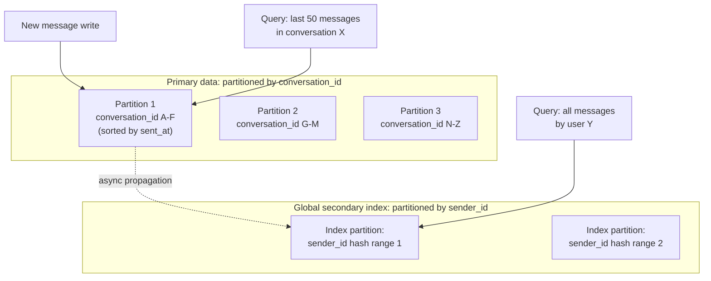

# Partitioning and Sharding

_The previous topic made rigorous how many copies of the same data stay in sync. This topic answers the orthogonal question every one of L4's data models has assumed an answer to without yet explaining it: when one node's disk, memory, or CPU simply isn't enough to hold or serve all the data, how do you split *different* data across many nodes so each one only has to own a slice? Partitioning is the reason DynamoDB, Cassandra, Bigtable, and every NewSQL system can scale to petabytes and millions of writes per second on commodity hardware - and, combined with replication, it is the single structural decision (which partitioning key, which strategy) that determines whether a distributed database's later life is smooth or a permanent fight against lopsided load._

## Contents

- [What partitioning is and why it exists](#what-partitioning-is-and-why-it-exists)
- [Partitioning strategies for key-value data](#partitioning-strategies-for-key-value-data)
  - [Range partitioning](#range-partitioning)
  - [Hash partitioning](#hash-partitioning)
  - [Directory-based (lookup) partitioning](#directory-based-lookup-partitioning)
- [Partitioning secondary indexes](#partitioning-secondary-indexes)
  - [Local (document-partitioned) secondary indexes](#local-document-partitioned-secondary-indexes)
  - [Global (term-partitioned) secondary indexes](#global-term-partitioned-secondary-indexes)
- [Combining partitioning with replication](#combining-partitioning-with-replication)
- [Request routing: how a client finds the right partition](#request-routing-how-a-client-finds-the-right-partition)
- [Skew and hotspots: a preview](#skew-and-hotspots-a-preview)
- [Operational concerns: adding, removing, and resharding](#operational-concerns-adding-removing-and-resharding)
- [Trade-offs, side by side](#trade-offs-side-by-side)
- [Worked example: partitioning a messaging app's messages table](#worked-example-partitioning-a-messaging-apps-messages-table)
- [How this connects](#how-this-connects)
- [Real-world & sources](#real-world--sources)
- [Check yourself](#check-yourself)

## What partitioning is and why it exists

**Partitioning (also called sharding - the two words are used interchangeably in most modern systems, though "sharding" originated as MMO-game and MySQL-community vocabulary for the exact same technique) is splitting a dataset into disjoint subsets, called partitions or shards, and placing each one on a different node, so that no single node has to store or serve the entire dataset.** [Replication, covered in the previous topic](02-replication.md), asks "how do I keep *the same* data safely duplicated"; partitioning asks the opposite question - "how do I split *different* data across many nodes." They are orthogonal, and in any real large-scale system they are combined, not chosen between: each partition is itself replicated using one of the three topologies the previous topic covered, so a cluster of 12 nodes might hold 4 partitions at replication factor 3, not 12 independent unreplicated shards.

Two distinct pressures drive the decision to partition at all - and, just as with replication's three motivations, a real system usually faces both simultaneously:

- **The data is too big for one node.** A single machine has finite disk capacity. A table with hundreds of terabytes or petabytes of data simply cannot fit on one machine's storage, no matter how large that machine is - and even if it technically could, a full-table operation (a backup, a `VACUUM`, an index rebuild) on that much data on one node would take an impractically long time.
- **The data is too hot for one node.** Even a dataset that would physically fit on one machine can produce more read or write traffic than that one machine's CPU, memory, and I/O can serve - a single Postgres primary tops out at some ceiling of writes per second regardless of disk size, [the same single-writer bottleneck the NoSQL-families topic named for the relational model](01-nosql-families.md#why-nosql-exists-what-the-relational-model-struggles-with-at-scale) and leader-follower replication only partially answers (more read replicas, not more write capacity). Partitioning is the only way to scale *write* throughput horizontally, because it multiplies the number of nodes that can each independently accept writes for their own slice of the keyspace - this is the core capability leader-follower replication structurally cannot provide on its own, and it's why partitioning and leader-follower replication are always paired in practice (partition for write scale, replicate each partition for durability and read scale).

The **partition key** (also called the shard key) is the field, or combination of fields, whose value determines which partition a given row or document lives on. Choosing it well is arguably the single highest-leverage decision in any partitioned system's design - it determines which queries can be answered by touching one partition (fast) versus which must fan out to every partition (slow, and a recurring theme below) - and it is also the thing hardest to change later without a full data migration, which is exactly why the strategies below exist as a small, well-understood menu rather than something worth reinventing per system.

## Partitioning strategies for key-value data

Three genuinely different strategies answer "given a key, which partition owns it?" - each with a different trade-off between range-query support and even load distribution.

### Range partitioning

**What it is.** Keys are sorted, and the total keyspace is divided into contiguous ranges, each assigned to one partition - e.g. keys `A-F` on partition 1, `G-M` on partition 2, `N-S` on partition 3, `T-Z` on partition 4. Bigtable's tablets, HBase's regions, and CockroachDB/Spanner's ranges are all this strategy, and each system additionally makes range boundaries *dynamic*: a range that grows past a size threshold automatically splits into two smaller ranges, and a range that shrinks (after deletes) can merge back with a neighbor.

**Why it's chosen.** Range partitioning is the only one of the three strategies that keeps a **range scan efficient** - "give me every event between timestamp T1 and T2," or "give me every user with a username starting with `sm`," touches only the handful of contiguous partitions the range actually spans, not every partition in the cluster. This is precisely why Bigtable, HBase, and every NewSQL system built on this strategy: their canonical workloads (sequential scans by row key, range queries by primary key) depend on it.

**The corresponding cost: skew.** Because adjacent keys land on the same partition, any workload where writes cluster around a narrow, adjacent key range creates a **hot partition** - the exact failure mode the next topic in this level (rebalancing and hotspots) exists to address in depth. The canonical example: partitioning a table by insertion timestamp so that "today's writes" always land on whatever the *last* range happens to be, meaning one partition absorbs 100% of write traffic while every other range, holding only historical data, sits idle. Systems that use range partitioning almost universally warn against a naively monotonic partition key for exactly this reason, and either prefix the key with something that spreads writes (a hash prefix, or a reversed/sharded timestamp) or accept the hotspot as a deliberate trade-off for range-scan simplicity.

### Hash partitioning

**What it is.** A hash function is applied to the partition key, and the resulting hash value (not the key itself) determines which partition owns it - e.g. `partition = hash(key) mod N`, or, in production systems, the hash value's position on a **consistent-hashing ring** (the mechanism the next-but-one topic in this level formalizes in full; for now, treat "hash the key, then place it somewhere on a ring of partitions" as the production-grade version of the naive `mod N` scheme). DynamoDB (hash the partition key), Cassandra (hash the partition key via a pluggable partitioner, commonly Murmur3, onto its ring), and MongoDB's hashed-shard-key option all use this strategy.

**Why it's chosen.** A good hash function scatters even adjacent or sequential input keys uniformly across the entire output range, so two keys that are lexically next to each other (`user_1000` and `user_1001`) land on essentially random, unrelated partitions. This directly cures range partitioning's monotonic-write hotspot: a workload writing sequential IDs or increasing timestamps gets spread evenly across every partition instead of concentrating on one.

**The corresponding cost: range scans become a scatter-gather.** Because hashing deliberately destroys the key's ordering, "give me every key between X and Y" can no longer be answered by touching a contiguous handful of partitions - the query has to fan out to *every* partition, ask each one for its share of matching keys, and merge the results, an operation whose cost scales with the number of partitions in the cluster rather than the number of rows actually in range. This is the direct mirror image of range partitioning's trade-off: pick hash partitioning and range queries get expensive; pick range partitioning and monotonic writes get dangerous. DynamoDB's partition-key-plus-sort-key design is a deliberate compromise on exactly this axis: the partition key is hashed (spreading load across partitions), but *within* one partition, the sort key is stored in sorted order, so range queries scoped to a single partition key ("all of this user's orders, in a date range") stay cheap, while cross-partition range queries remain a scatter-gather.

### Directory-based (lookup) partitioning

**What it is.** Rather than deriving a key's partition from a formula (a hash or a range boundary), an explicit lookup table - a directory - maps each individual key (or, more commonly, each range or chunk of keys) to the specific node currently holding it. The directory itself is a small, separately-managed piece of metadata, typically kept in a strongly-consistent, replicated config store (ZooKeeper, etcd, or a dedicated metadata service) precisely because every node in the cluster needs to agree on it.

**Why it's chosen.** A formula-based scheme (hash or range) ties "which partition owns this key" permanently to a rule that's awkward to change - reassigning keys to different nodes means either rehashing everything (painful) or manually redrawing range boundaries. A directory decouples the two: which partition a key belongs to (a stable, rarely-changing assignment, e.g. "this document belongs to shard 7" via an explicit chunk-to-shard mapping) is tracked separately from which physical node currently serves that partition, so migrating a partition to a different physical node is just an update to one row in the directory, not a wholesale recomputation of every key's location. MongoDB's sharding architecture is the canonical example: **config servers** hold the chunk-to-shard mapping explicitly as metadata, `mongos` routing processes consult that mapping (see routing, below) on every query, and moving a chunk between shards during rebalancing is exactly "update the directory entry, migrate the data in the background."

**The corresponding cost.** The directory itself becomes a piece of critical shared state that every node must consult (or cache) to route correctly - a potential bottleneck and, if it drifts out of sync with reality even briefly, a source of misrouted requests. Real systems mitigate this by caching the directory aggressively on the routing tier and only re-fetching it when a request is misrouted (a "wrong shard" error) or on a periodic refresh, rather than consulting the authoritative config store on every single request.

## Partitioning secondary indexes

Partitioning the primary key (the exact-match key-value data itself) is what the three strategies above answer. But most real workloads also need to query **by a field other than the primary key** - find every order with `status = 'shipped'`, not just order `#42` by its ID - which raises a second, genuinely separate partitioning question: [L2 covered what a secondary index is and how it's built on a single node](../L2/08-indexing.md); this section covers what happens to that same secondary index once the underlying data itself is split across many partitions. Only the depth needed to understand *why* each has the trade-off it has is covered here - it is not a re-derivation of indexing itself.

### Local (document-partitioned) secondary indexes

**What it is.** Each partition maintains its own secondary index, covering only the primary data that already lives on that same partition - so a partition holding orders 1-1000 also holds a `status` index covering only orders 1-1000, entirely locally, with no cross-partition coordination needed to write to it.

**Why it's chosen: writes are cheap.** Writing a document and updating its secondary index touches only one partition - the one that already owns the document - so a write never needs to coordinate with any other node. MongoDB and Elasticsearch/Lucene (each Lucene shard maintains its own local inverted index) both default to this model for exactly this reason: it's the natural, low-coordination choice when the write path is what needs to stay simple and fast.

**The corresponding cost: reads become scatter-gather.** A query by the secondary index field ("every order with `status = 'shipped'`, across the whole dataset") cannot be answered by any single partition's local index alone, since matching documents could live on any partition - the query must be sent to *every* partition, each searches its own local index, and the results are merged before returning to the client. This pattern is commonly called **scatter-gather querying**, and it's the same cost hash partitioning imposed on range scans above, now recurring one layer up at the secondary-index level: local indexes make writes partition-local at the cost of making cross-cutting reads touch every partition, with tail latency dominated by whichever single partition responds slowest.

### Global (term-partitioned) secondary indexes

**What it is.** The secondary index itself is partitioned separately from the primary data - by the *indexed term* rather than by the document's own primary key - so that, for instance, all orders with `status = 'shipped'`, regardless of which partition their primary data lives on, are indexed together on one particular index-partition. A query for a specific term now only has to consult the specific partition(s) that own that term, not every partition in the cluster.

**Why it's chosen: reads become cheap and targeted.** The whole point of a global index is the mirror image of the local index's trade-off: a query by the indexed field goes straight to the partition(s) that own the relevant term(s), instead of fanning out everywhere - exactly the property a read-heavy secondary-index query pattern needs.

**The corresponding cost: writes get expensive and often asynchronous.** A single write to one document may need to update secondary-index entries that live on a *different* partition than the document itself (the document's primary partition is determined by its primary key; the index entry's partition is determined by the indexed field's value, which is generally unrelated) - meaning one logical write can turn into writes against multiple, potentially remote partitions. Making that update atomic and synchronous would require a distributed transaction on every write; in practice, systems that use global secondary indexes (DynamoDB's Global Secondary Indexes are the canonical example) instead propagate the update to the index **asynchronously**, which means the index can briefly lag behind the primary data - a deliberate, named eventual-consistency window traded for keeping the common-case write path fast and avoiding a cross-partition transaction on every write.

Neither model is universally "correct" - it's a direct instance of the same read/write trade-off recurring at a different layer: local indexes bet that writes matter more and reads can afford to fan out; global indexes bet the opposite.

## Combining partitioning with replication

Every partitioning strategy above answers "which node(s) own this key," and [every replication topology the previous topic covered](02-replication.md) answers "how many copies of that partition exist, and who can write to them" - the two combine directly, not as an afterthought: **each individual partition is itself an independently replicated unit**, using whichever of leader-follower, multi-leader, or leaderless replication the system as a whole has chosen.

Concretely, in a cluster with 8 partitions at replication factor 3 running leader-follower replication per partition (this is exactly how Kafka's per-topic partitions work, and how MongoDB's sharded clusters work - [each shard *is* a replica set](02-replication.md#canonical-systems)): each of the 8 partitions independently elects its own leader among its own 3 replicas, so the cluster as a whole has 8 leaders total, each handling writes only for its own slice of the keyspace, each with 2 followers of its own. A node in such a cluster is very often a leader for some partitions and a follower for others simultaneously - "leader" and "follower" are roles scoped to one partition, not labels attached permanently to a physical machine. Cassandra's leaderless, quorum-based replication combines the same way: a key's hash determines which N nodes on the ring own that partition (via consistent hashing, formalized in the next-but-one topic), and every read/write against a key in that partition independently goes through the R/W quorum mechanics [the previous topic derived](02-replication.md#leaderless-replication) scoped to just that partition's N replicas, not the whole cluster.

This is also precisely why choosing the replication factor N and the number of partitions are two separate dials: more partitions increases the degree of write parallelism (more independent leaders, more nodes each doing a smaller slice of work); higher replication factor increases durability and read capacity per partition, independent of how many partitions exist.

## Request routing: how a client finds the right partition

Whichever partitioning strategy is in use, a client (or the load balancer/proxy in front of the cluster) needs to answer, on every single request: *which node do I actually send this to?* Three broad approaches answer this, in increasing order of how much intelligence lives outside the data nodes themselves - and the full mechanics of how nodes agree on cluster membership and detect failure (gossip, consensus) belong to L5; only enough is covered here to explain how a request finds the right shard.

- **Gossip-based routing (the node itself knows).** In a leaderless, ring-based system (Cassandra, DynamoDB's original design lineage), every node participates in a **gossip protocol** - periodically exchanging cluster-membership and partition-ownership state with a few random peers, so that information about which nodes own which parts of the ring eventually (within a few gossip rounds) reaches every node without any of them needing a single, centrally-consulted directory. A client can therefore connect to *any* node in the cluster, and that node - even if it doesn't itself own the requested key - knows (via its locally-gossiped view of the ring) which node does, and forwards the request there as a **coordinator**, exactly the coordinator role [the previous topic's leaderless-replication section already assumed](02-replication.md#the-write-path). The full mechanics of gossip protocols themselves (how membership state propagates, how failure is detected) are covered formally in L5.
- **A dedicated routing tier (a stateless proxy in front of the data nodes).** MongoDB's `mongos` processes are the canonical example: they hold no data themselves, consult the config servers' chunk-to-shard directory (cached locally, refreshed on demand), and route each incoming query to the specific shard(s) that own the relevant chunk(s) - a client only ever talks to `mongos`, never directly to a shard. Vitess (the sharding middleware commonly used to shard MySQL/Postgres-style fleets, [named in the NoSQL-families topic](01-nosql-families.md#why-nosql-exists-what-the-relational-model-struggles-with-at-scale)) plays the identical role for relational sharding. This approach's advantage is that client applications stay completely unaware of the partitioning scheme - they speak to what looks like a single logical database - at the cost of the routing tier itself being an additional hop and an additional piece of infrastructure to run and scale.
- **A separate, strongly-consistent config/coordination service (the directory, made highly available in its own right).** ZooKeeper (historically, for Kafka's partition-leader and broker metadata) and etcd (for many modern systems, including Kubernetes' own service-discovery layer and CockroachDB's cluster metadata) hold the authoritative partition-to-node mapping, replicated via **consensus** (so the directory itself doesn't become a single point of failure), and every routing tier or client library either queries this service directly or subscribes to be notified when the mapping changes. This is directory-based partitioning's routing counterpart: the directory that decided *which partition owns a key* and the service that tells clients *which node currently holds that partition* are frequently the same piece of infrastructure. Consensus itself (Raft, Paxos, ZAB) - what makes this config service trustworthy even when some of its own nodes fail - is L5's job; here it's enough to know that a config service exists specifically because "who owns what" is itself data that needs to be replicated correctly.

All three approaches share one structural requirement worth naming explicitly: whatever answers "which node owns this key" must itself be either eventually consistent in a way the system tolerates (gossip - a request can transiently be routed to a now-stale coordinator, which then reroutes) or backed by a system built to be strongly consistent under failure (a routing tier plus a consensus-backed config store) - routing metadata being wrong even briefly means a request goes to the wrong node, which every real system must detect and correct (a "moved" or "wrong shard" response that triggers a retry against the corrected destination) rather than silently serving stale or missing data.

## Skew and hotspots: a preview

Every strategy above assumes, implicitly, that keys are chosen and accessed roughly *uniformly* - that no single key or narrow range of keys receives dramatically more traffic than any other. Real workloads routinely violate this assumption, and the resulting **skew** takes two related but distinct forms worth naming here, even though fully solving either is the next topic's job:

- **A hot partition from a poorly chosen key.** Range partitioning's monotonic-timestamp problem above is one instance; another is choosing a partition key with low cardinality relative to actual traffic concentration - e.g. partitioning tweets by `user_id` when a small number of celebrity accounts each generate orders of magnitude more read/write traffic than an ordinary user, meaning the partition holding that one celebrity's data becomes overloaded regardless of how evenly the *key space itself* is distributed.
- **A hot key within a single partition.** Even a well-distributed partitioning scheme can't help if the skew isn't about which partition a key lands on but about one specific key inside a partition being accessed far more often than its neighbors - a viral post's `like_count` being incremented thousands of times per second, all landing on the same row/key regardless of partitioning strategy, because partitioning only ever controls the granularity of *which partition*, never traffic *within* one key.

Both are named here only to motivate why this level's next two topics exist: **rebalancing and hotspots** covers the concrete mitigations (splitting a hot partition further, adding a random suffix to spread a hot key across several physical keys, caching in front of the hot key) in depth, and **consistent hashing with virtual nodes** covers the specific mechanism (assigning each physical node many small, randomly-distributed positions on the hash ring rather than one large contiguous slice) that makes rebalancing after a skew-driven split - or after simply adding/removing a node - touch a bounded, small fraction of the keyspace instead of reshuffling everything. Nothing about detecting or fixing skew is solved in this topic; it is named here purely as the direct, motivating consequence of the partitioning strategies just covered.

## Operational concerns: adding, removing, and resharding

A partitioned system is never static - data grows, traffic patterns shift, and nodes are added or removed - and every partitioning strategy above has to answer what happens when the number of partitions or nodes changes, in outline here (the next topic, rebalancing and hotspots, covers the mechanics in depth):

- **Naive `hash(key) mod N` breaks catastrophically when N changes.** If partition assignment is computed as `hash(key) mod N` and a node is added (N increases by one), the modulus changes for essentially every key, meaning almost every key's assigned partition changes - not just the keys that should logically move to the new node, but nearly the entire dataset needs to be physically relocated. This is precisely the problem consistent hashing (the next-but-one topic) was invented to solve, and it's worth flagging here specifically as the reason production systems never actually use naive modulo hashing for partition assignment, despite it being the simplest possible formula to state.
- **Range partitioning rebalances by splitting and merging ranges.** Because range boundaries are already stored as explicit metadata rather than computed from a formula, adding capacity is "pick an existing range that's grown too large, split it in two, and move one half to the new node" - a much more surgical, bounded operation than modulo hashing's wholesale reshuffle, and the direct reason Bigtable, HBase, and NewSQL systems can add nodes without touching the whole dataset.
- **Resharding is expensive and risky regardless of strategy**, because it means physically moving data between machines while the system keeps serving live traffic: reads and writes arriving mid-migration for a key that's in the process of moving must be handled correctly (routed to wherever the key's *current* authoritative copy is, not silently dropped or duplicated), and the migration itself consumes real network and I/O capacity that competes with normal traffic. Stripe's DocDB, [named in the previous two topics' real-world sections](02-replication.md#real-world--sources), was built with **zero-downtime data migration** as an explicit, first-class design goal for precisely this reason - resharding a payments-scale system without a maintenance window is hard enough to be worth purpose-built tooling (blocking writes on the source shard only briefly at cutover, after the bulk of the migration has already streamed via CDC) rather than treating it as an occasional manual operation.
- **A capacity-planning lesson worth stating plainly: choose a partition count larger than your current node count from day one, where the strategy allows it.** MongoDB and DynamoDB-style hash-partitioned systems commonly create many more logical partitions than there are currently physical nodes (e.g. hundreds of chunks across a handful of shards), specifically so that future growth is "move some already-existing chunks to new nodes" rather than "recompute partition boundaries for the whole dataset" - a distinction between *adding capacity* and *repartitioning*, where only the latter requires touching every key's assignment logic.

## Trade-offs, side by side

| Strategy | Range queries | Load distribution | Rebalancing cost | Canonical systems |
| --- | --- | --- | --- | --- |
| Range partitioning | Efficient - contiguous ranges scan cheaply | Risk of hotspots on monotonic/sequential keys | Cheap and surgical - split/merge ranges as metadata | Bigtable, HBase, CockroachDB, Spanner |
| Hash partitioning | Expensive - scatter-gather across all partitions | Even, given a good hash function | Naive `mod N` is catastrophic; consistent hashing (next topic) bounds it | DynamoDB, Cassandra, MongoDB (hashed shard key) |
| Directory-based | Depends on what's tracked (often paired with range/hash under the hood) | As even as the directory's own assignment policy | Cheap - update one directory entry, migrate in background | MongoDB (config servers + chunks) |

| Secondary-index model | Write cost | Read cost | Consistency | Canonical systems |
| --- | --- | --- | --- | --- |
| Local (document-partitioned) | Low - one partition, no coordination | High - scatter-gather across every partition | Immediately consistent with its own partition's data | MongoDB, Elasticsearch/Lucene shards |
| Global (term-partitioned) | High - may touch a remote partition per write | Low - go straight to the owning partition(s) | Often asynchronous/eventually consistent | DynamoDB Global Secondary Indexes |

## Worked example: partitioning a messaging app's messages table

A chat application stores messages with a schema roughly `(conversation_id, message_id, sender_id, body, sent_at)`, and needs to serve two dominant queries: "give me the last 50 messages in conversation X" (by far the most frequent) and, much more rarely, "search all of a given user's messages across every conversation."

- **Choosing the partition key.** Partitioning by `message_id` (say, a globally unique, roughly time-ordered ID) under hash partitioning would spread writes evenly - good for avoiding a single hot partition overall - but would scatter a single conversation's messages across every partition in the cluster, turning the dominant query ("last 50 messages in this conversation") into a scatter-gather across the whole cluster merely to reassemble one conversation's history. Partitioning by `conversation_id` instead means every message belonging to the same conversation lands on the same partition, and (as in DynamoDB's partition-key-plus-sort-key model) a sort key of `sent_at` or `message_id` within that partition keeps "last 50 messages, in order" a single-partition, sorted range read - cheap and fast, exactly matching the dominant access pattern.
- **The corresponding cost, made concrete.** A single wildly popular group conversation (a large public channel, or a broadcast-style group with thousands of members all reading/writing) now concentrates all of its traffic onto one partition - the hot-partition problem the [skew section above](#skew-and-hotspots-a-preview) named generically, now instantiated: one conversation's write volume can dwarf an ordinary one's by orders of magnitude, and because `conversation_id` is the entire partition key, there is no way to split that one conversation's traffic across multiple partitions without changing the partitioning scheme itself for that specific hot key (exactly the kind of targeted mitigation the next topic, rebalancing and hotspots, exists to cover).
- **The secondary query, and why it needs a different index shape.** "All of a given user's messages across every conversation" cannot be answered efficiently by the primary partitioning at all - `sender_id` isn't the partition key, so this query would have to scatter-gather across every conversation-partition in the cluster. A **global secondary index** on `sender_id` (partitioned by `sender_id` itself, independent of which conversation-partition the underlying message physically lives in) turns this into a targeted read against the index's own partition(s) - at the cost of every message write now needing to (asynchronously) also update an index entry that may live on a completely different physical partition than the message itself, exactly the local-vs-global trade-off named above, now applied to a genuine two-access-pattern system rather than in the abstract.

## How this connects

- **Back to L2 (indexing)** - [local vs global secondary indexes](#partitioning-secondary-indexes) above is the distributed-systems continuation of exactly what [L2's indexing topic](../L2/08-indexing.md) covered for a single node: the index structures themselves (B-trees, inverted indexes) are unchanged, but partitioning adds an entirely new dimension - not just "how is the index structured" but "which node(s) does the index itself live on," independent of where the underlying data lives.
- **Back to L4/01 (NoSQL families) and L4/02 (Replication)** - every partitioning strategy named above was already gestured at in passing across both prior topics (DynamoDB and Cassandra's hashing, Bigtable/HBase's tablets/regions, MongoDB's chunks, NewSQL's ranges); this topic is where each of those passing mentions gets its formal name and mechanism, and [combining partitioning with replication](#combining-partitioning-with-replication) makes explicit what both prior topics assumed - that a partition and its replica set are two different, composable concerns.
- **Forward to rebalancing and hotspots (next in this level)** - this topic named skew and the operational pain of resharding only enough to motivate why they're a problem; that topic covers the concrete mitigations (splitting hot partitions, hot-key suffixing, load-aware rebalancing) in full depth.
- **Forward to consistent hashing / virtual nodes (next-but-one in this level)** - the naive `hash(key) mod N` failure mode named in [operational concerns](#operational-concerns-adding-removing-and-resharding) above is precisely the problem that topic solves, and the "hash the key, place it on a ring" language used loosely throughout this topic gets its full mechanical treatment there (virtual nodes, bounded key movement on membership change).
- **Forward to data modeling and denormalization** - choosing a partition key well (the messages-table worked example above) is the leading edge of that later topic's entire subject: designing keys, partitions, and document shapes around actual query patterns rather than around a normalized schema's natural structure.
- **Forward to quorums (R + W > N)** - this topic named that each partition's N replicas carry their own independent quorum mechanics; that later topic goes deeper into tunable per-operation consistency scoped to one partition's replica set.
- **Forward to L5 (distributed systems theory)** - gossip protocols and consensus were both named here only far enough to explain how routing metadata propagates and stays trustworthy; L5 covers gossip and consensus (Raft, Paxos, ZAB) as general-purpose distributed-systems mechanisms in their own right, independent of the partitioning use case this topic needed them for.
- **Forward to L12 (scalability and performance patterns)** - geo-partitioning (partitioning by region so a user's data lives physically close to them) and hot-key mitigation, both named only in passing here, get dedicated, deeper treatment as explicit scaling patterns in that later level.

## Real-world & sources

Three verified examples spanning hash, directory-based, and a fintech perspective - deliberately not repeating [replication's real-world section](02-replication.md#real-world--sources), which covers Stripe's DocDB topology, Discord's Cassandra quorum tuning, Uber's MySQL failover, and Redis Active-Active separately:

- **DynamoDB - hash partitioning, with "split for heat" adaptive capacity.** DynamoDB hashes the partition key to place each item on a partition arranged on a **consistent-hashing ring**; when a sort key is also present, items sharing one partition key are additionally stored sorted by the sort key within that partition (the partition-key-plus-sort-key compromise named above). Concretely, AWS documents that a single partition supports roughly **3,000 strongly-consistent reads/second, or up to 9,000 eventually-consistent reads/second** (when all three of a partition's replica nodes are healthy) - and recommends designing for **6,000 eventually-consistent reads/second** to leave headroom for node maintenance. When one partition's traffic exceeds this regardless of overall table-level provisioning, DynamoDB's **adaptive capacity ("split for heat")** automatically splits that single hot partition into two, each inheriting a subset of the original's items and doubling the available read/write capacity for those items - with the split point calculated from recent traffic patterns rather than a fixed midpoint (though a table using a Local Secondary Index constrains splits to occur only between item collections). Source: [AWS Database Blog - "Scaling DynamoDB: How partitions, hot keys, and split for heat impact performance (Part 2: Querying)"](https://aws.amazon.com/blogs/database/part-2-scaling-dynamodb-how-partitions-hot-keys-and-split-for-heat-impact-performance/) (AWS engineering blog; fetched 2026-07-16).

- **Vitess/YouTube - directory-based (VSchema) routing over range- and hash-sharded MySQL.** YouTube built Vitess starting in 2010 specifically because, after already adding read replicas and then write replicas, "write traffic became too high for the master database to handle" and the team needed to shard - splitting rows across many identically-schemed MySQL databases - without hand-writing shard-routing logic into application code for every query. Vitess's `VTGate` proxies sit between the application and the underlying MySQL shards, consulting a `VSchema` (the directory: a declared mapping of which shard(s) own which key ranges for a given keyspace, supporting both range-based and hash-based sharding underneath) to route, rewrite, and scatter-gather queries automatically - the application talks to what looks like one logical database. Per Vitess's own published history, YouTube scaled its user base "by a factor of more than 50" on this architecture after adopting it, and Vitess subsequently saw external adoption (starting 2015) by Slack, Square/Block, and JD.com, among others. Source: [Vitess official documentation - "History"](https://vitess.io/docs/22.0/overview/history/) (fetched 2026-07-16).

- **Stripe DocDB - directory/chunk-based sharding (fintech).** Stripe's internal MongoDB-based document database, DocDB, organizes data into **chunks** (small key ranges within a collection, chosen by a sharding key such as customer ID or transaction timestamp), tracked by a **chunk metadata service** that a fleet of Golang database proxies consults on every query to determine which of Stripe's **2,000+ database shards** currently holds the requested chunk - the same directory-based pattern MongoDB's own config servers implement, run at Stripe's own scale (reported at roughly **5 million database queries per second** across the fleet). This directory decoupling is what lets Stripe split a shard under traffic pressure, or consolidate many underused shards via bin-packing during quieter periods, as background chunk-reassignment operations rather than a wholesale schema change - directly illustrating this topic's claim that a directory turns resharding into "update one metadata entry, migrate in the background" instead of recomputing every key's assignment. Source: [ByteByteGo - "How Stripe Scaled to 5 Million Database [Queries per Second]"](https://blog.bytebytego.com/p/how-stripe-scaled-to-5-million-database) (secondary summary of Stripe's own engineering post, [stripe.dev, published 2024-06-06](https://stripe.dev/blog/how-stripes-document-databases-supported-99.999-uptime-with-zero-downtime-data-migrations)); cited via ByteByteGo because the original Stripe post's full body text could not be retrieved directly (fetched 2026-07-16).

**Flagged gap - UPI/NPCI.** Per this repo's standing priority to surface India's UPI/NPCI wherever relevant, a search was run specifically for NPCI's partitioning/sharding architecture (how transaction data is split across the central switch and participating banks' systems). Several vendor and press sources describe UPI/bank infrastructure using distributed, sharded databases in general terms (e.g. Oracle Globally Distributed Database marketing material referencing sharded deployments for "always-on" UPI banking infrastructure), but the primary vendor blog making this claim could not be fetched (returned an access error on repeated attempts), and no NPCI-published primary source describing its own specific partitioning strategy, shard key, or concrete throughput-per-shard numbers was found. No claim about UPI/NPCI's specific partitioning strategy is included here; this is flagged openly rather than filled with an unverified claim, consistent with [the same gap flagged in replication's real-world section](02-replication.md#real-world--sources).

## Check yourself

- A time-series workload writes rows keyed by a strictly increasing timestamp. Explain concretely why range partitioning creates a hotspot here, and why hash partitioning would fix that specific problem - then explain what hash partitioning would break that range partitioning had given you for free.
- A DynamoDB table uses a hashed partition key plus a sort key. Explain why a query scoped to one partition key can still efficiently return a sorted range of results, while a query that needs to range-scan across many different partition keys cannot.
- Why does a local (document-partitioned) secondary index make writes cheap and reads expensive, while a global (term-partitioned) secondary index makes the opposite trade - and why does the global index typically have to be updated asynchronously rather than atomically with the write to the underlying document?
- Explain, precisely, why computing partition assignment as `hash(key) mod N` breaks badly when a node is added and N changes - what specifically has to move, and how much of it?
- In the messages-table worked example, why would partitioning by `message_id` instead of `conversation_id` have made the dominant query (last 50 messages in a conversation) worse, even though it would have distributed write load more evenly overall?
- A cluster has 8 partitions at replication factor 3, using leader-follower replication per partition. How many total leader roles exist across the cluster, and why is it wrong to think of "leader" as a property of a physical machine rather than of a partition?
</content>
