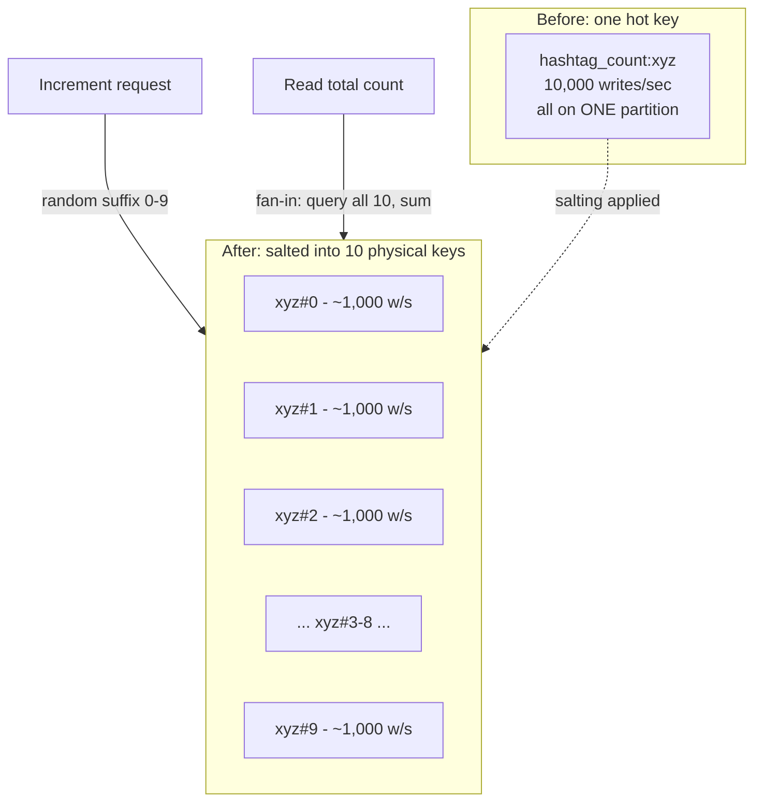

# Rebalancing and Hotspots

_The previous topic named skew and resharding only far enough to motivate why they're a problem, deferring the actual mitigations to this topic - so this is where that deferred work gets done. A partitioned cluster is never static: nodes get added for more capacity, nodes fail and have to be replaced, and even a perfectly chosen partition key can still concentrate traffic on one narrow slice of the keyspace as real-world usage turns out lopsier than the schema assumed. This topic covers, in depth, the concrete strategies real systems use to redistribute data as membership changes (rebalancing) and the concrete techniques that detect and relieve a partition or key that's taking disproportionate load (hotspot mitigation) - stopping short only of the specific mechanism, consistent hashing with virtual nodes, that the next topic formalizes as the modern way to make rebalancing itself cheap._

## Contents

- [What rebalancing is and why it's needed](#what-rebalancing-is-and-why-its-needed)
- [Rebalancing strategies](#rebalancing-strategies)
  - [Fixed number of partitions](#fixed-number-of-partitions)
  - [Fixed partition size (dynamic splitting)](#fixed-partition-size-dynamic-splitting)
  - [Dynamic partitioning proportional to nodes](#dynamic-partitioning-proportional-to-nodes)
- [How a rebalance actually moves data](#how-a-rebalance-actually-moves-data)
- [Hotspots: causes](#hotspots-causes)
- [Hotspots: mitigations](#hotspots-mitigations)
- [Manual vs automatic rebalancing](#manual-vs-automatic-rebalancing)
- [Trade-offs, side by side](#trade-offs-side-by-side)
- [Worked example: a chunked collection and a viral hashtag counter](#worked-example-a-chunked-collection-and-a-viral-hashtag-counter)
- [How this connects](#how-this-connects)
- [Real-world & sources](#real-world--sources)
- [Check yourself](#check-yourself)

## What rebalancing is and why it's needed

**Rebalancing is the process of moving data (and, in most designs, the read/write responsibility for that data) between nodes so that load - storage, CPU, or request traffic - is redistributed roughly evenly across the cluster as it currently exists.** It is the operational, ongoing counterpart to the one-time design decision [the previous topic covered](03-partitioning-and-sharding.md#partitioning-strategies-for-key-value-data): partitioning strategy answers "given a key, which partition owns it, in principle," while rebalancing answers "given that the cluster's membership or load has just changed, how do we get from the current, now-unbalanced assignment to a new, balanced one, without losing data or serving incorrect answers along the way."

Three genuinely different triggers force a rebalance, and a real cluster faces all three over its lifetime, often within the same week:

- **Capacity is added.** A new node joins the cluster - because the dataset outgrew existing capacity, or simply for more headroom - and, unless partitions are actively moved onto it, it sits idle while every existing node keeps its original share of the load. Rebalancing here means deciding which existing partitions to move (or split) onto the new node so it actually starts carrying its fair share.
- **Capacity is removed.** A node fails permanently, is decommissioned, or is intentionally taken out of service (e.g. downsizing after a traffic drop) - and whatever partitions it owned need a new home. Unlike the replication story [the earlier topic covered](02-replication.md#failover-detecting-and-handling-leader-failure) (a follower losing its leader), this is about the data itself needing to be physically relocated to a surviving node, not just a leadership handoff among nodes that all already hold a copy.
- **Partitions grow unevenly, independent of node count.** Even with a fixed number of nodes and no membership change at all, real data rarely grows uniformly across the keyspace - one range of keys (a popular product category, a busy time window, a large tenant in a multi-tenant system) accumulates far more rows or far more traffic than another, and the partition holding it eventually needs to be split, its two halves redistributed, purely because of *skew*, not because a node joined or left.

Whatever the trigger, a rebalancing scheme is judged against the same three requirements, restated from [the previous topic's operational-concerns section](03-partitioning-and-sharding.md#operational-concerns-adding-removing-and-resharding) and now made the explicit subject of this one: **after rebalancing, load should be shared fairly across nodes; while rebalancing, the database must keep accepting reads and writes**; and **no more data than necessary should move over the network and disk I/O**, both because that data movement itself consumes capacity that competes directly with live traffic, and because unnecessary movement is unnecessary risk (more bytes in flight, more chances for a partial failure mid-move). The three strategies below are three different, long-settled answers to "how do we structure partitions from the start so that satisfying all three requirements later is actually possible" - the naive `hash(key) mod N` scheme named in the previous topic fails the third requirement almost completely (nearly every key's assignment changes when N changes), which is precisely why none of the three strategies below use it.

## Rebalancing strategies

### Fixed number of partitions

**What it is.** The cluster is created with a number of partitions decided once, up front - typically an order of magnitude or more larger than the number of nodes expected to ever exist (e.g. 4,096 or 65,536 partitions for a cluster that might grow to a few dozen nodes) - and that number never changes for the life of the cluster. Each node is initially assigned several partitions (total partitions / total nodes, roughly), and a partition's size simply grows or shrinks with however much data happens to fall into its slice of the keyspace; nothing about the partition boundaries themselves is recomputed as data grows.

**Why it's chosen.** Because the number of partitions is fixed and independent of node count, rebalancing on a membership change becomes purely a matter of **moving whole, already-existing partitions between nodes** - never recomputing which keys belong to which partition, since that assignment (key -> partition) is a stable formula (a hash mod the fixed partition count) that never changes. Adding a node means picking a handful of existing partitions from the busiest nodes and physically transferring them, unchanged, to the new node; removing a node means redistributing its partitions among the survivors. Riak, Couchbase, and Elasticsearch (whose primary-shard count is fixed at index-creation time) are canonical examples of this strategy.

**The corresponding cost.** The partition count must be chosen correctly *in advance*, and choosing wrong is expensive to fix: too few partitions relative to eventual node count means the cluster can never grow beyond (partition count) nodes without a disruptive full repartition (recomputing the hash-mod-N formula itself, the exact operation this strategy exists to avoid); too many partitions relative to current data size means each partition is needlessly small, and per-partition overhead (open file handles, background compaction bookkeeping, metadata) accumulates without a matching benefit. Elasticsearch's own operational guidance is a direct instance of this trade-off: because primary shard count can't be changed after index creation without reindexing the data into a brand-new index, operators are explicitly advised to over-provision shard count based on *anticipated* future data volume, not current volume - a bet made once, at the very beginning, with real cost if it's wrong in either direction.

### Fixed partition size (dynamic splitting)

**What it is.** Rather than fixing the *count* of partitions, this strategy fixes a target *size* (or, in some systems, a target request-rate ceiling) per partition, and lets the number of partitions grow automatically as data grows: when a partition exceeds the configured size threshold, it **splits** into two smaller partitions, each roughly half the original's data, with one half typically relocated to a less-loaded node as part of the split. Symmetrically, when partitions shrink (after deletes or TTL-based expiry), some designs **merge** small, adjacent partitions back into one. This is exactly the range-partitioning splitting mechanism [the previous topic named for Bigtable's tablets and HBase's regions](03-partitioning-and-sharding.md#range-partitioning), and MongoDB's **chunks** (default target size historically 64 MB, `verify` current default) and CockroachDB's **ranges** (target size commonly 512 MB, `verify` current default) both work the same way regardless of whether the underlying partitioning is by range or by hash.

**Why it's chosen.** The number of partitions naturally tracks data volume, so a lightly loaded, newly created table doesn't pay the fixed-strategy's up-front over-provisioning cost, and a table that grows far beyond its original expected size doesn't hit a hard ceiling the way a fixed partition count can. Splitting is also **local and surgical**: only the one overgrown partition is touched, and only half its data physically moves - a direct contrast with a scheme where growth forces recomputing a global formula across the whole keyspace.

**The corresponding cost.** Splitting decisions have to be actively monitored and triggered by the system itself (or an operator) rather than being a one-time, fixed decision - each split is itself an operation with real cost (copying roughly half a partition's data to wherever the new partition will live, updating the directory/metadata that tracks which node owns which range, and briefly serving reads/writes correctly across the in-progress split) and a system under heavy, uneven write load can end up splitting the *same* logical region repeatedly if growth continues unabated, each split consuming I/O and network capacity that competes with live traffic. A range that's actively being written to fastest (a monotonically increasing key, the exact hotspot named in the previous topic) can also end up splitting into a fresh partition that immediately re-accumulates all the write traffic, requiring another split shortly after - a treadmill this strategy alone doesn't solve (the hotspot mitigations below and, for the key-distribution root cause, a better partition key are what actually break it).

### Dynamic partitioning proportional to nodes

**What it is.** A third scheme fixes neither the total partition count nor a size threshold directly - instead it fixes a target **number of partitions per node**, and grows the total partition count in lockstep with the number of nodes in the cluster. When a new node joins, it doesn't simply receive some already-existing, untouched partitions (as in the fixed-number strategy) - instead, several existing partitions are each **split in half**, and the new node takes one half of each, so that every node in the cluster (old and new alike) ends up holding roughly the same, constant number of partitions regardless of how many nodes total now exist. Cassandra's modern default - many small, randomly distributed **virtual nodes (vnodes)** per physical node, the specific mechanism [the next topic in this level formalizes in full](05-consistent-hashing.md) - is the production-grade version of exactly this scheme: because the ring is divided into far more tokens than there are physical nodes, adding one physical node means claiming a set of existing vnode ranges scattered across the ring (splitting the load contribution of many existing nodes by a small amount each) rather than either a wholesale rehash or a single large contiguous chunk carved out of one neighbor.

**Why it's chosen.** This scheme gets the fixed-size strategy's benefit of no up-front partition-count guess, while additionally keeping per-node partition count (and therefore per-node operational overhead - compaction load, metadata, file handles) roughly constant as the cluster scales out, rather than growing partition count independent of node count the way pure size-based splitting does. Because each membership change only moves a bounded, small fraction of the total keyspace (the fraction owned by whichever few vnodes get reassigned), it is the strategy that most directly satisfies "rebalancing should move no more data than strictly necessary" from the requirements above - the exact property the next topic proves formally for consistent hashing with virtual nodes.

**The corresponding cost.** Choosing how many virtual partitions each physical node should own is itself a tuning knob (Cassandra's `num_tokens`, historically defaulted to 256 per node, more recently recommended lower - commonly 16, `verify` current guidance - once an improved token-allocation algorithm made a smaller number sufficient for even distribution) - too many small virtual partitions per node adds per-partition overhead similar to the fixed-number strategy's over-provisioning cost; too few reduces how evenly a rebalance can spread load across the remaining nodes, since a coarser split moves larger, lumpier chunks rather than many small, easily-redistributed ones.

## How a rebalance actually moves data

Whichever strategy decides *what* moves, every rebalance shares the same underlying mechanical requirement: data has to be physically copied from a source node to a destination node while the cluster keeps serving live traffic for the keys in transit, and only once the copy is verified complete does the cluster's routing metadata switch over to the new location. Concretely, this typically happens in three phases, regardless of the specific system: **(1) bulk copy** - the destination node streams (or is sent) a snapshot of the partition's current data in the background, while the source node continues serving reads and writes for it normally; **(2) catch-up** - any writes that landed on the source partition *during* the bulk copy (which, for a large partition, can take real time - minutes to hours depending on data size and available network bandwidth) are re-applied to the destination, often via the same change-stream/oplog mechanism [replication uses to keep a follower current](02-replication.md#leader-follower-single-leader-replication), so the destination reaches an up-to-date state without needing to freeze writes for the whole copy duration; **(3) cutover** - once the destination is caught up, the directory or routing metadata (the config server's chunk-to-shard mapping, the gossiped ring ownership) is atomically updated to point at the new owner, and only the brief cutover window itself (not the whole multi-minute copy) needs to block or reject writes for that specific partition, if it needs to block at all. MongoDB's balancer moves a chunk between shards using exactly this shape, and Stripe's DocDB, [named in the previous topic's real-world section](03-partitioning-and-sharding.md#real-world--sources) for exactly this reason, was engineered so that only the final cutover briefly interrupts writes - the bulk of a shard migration streams via change-data-capture well before that point, which is what lets a payments-scale system reshard without a maintenance window.

A request that arrives for a key *during* this window - after the bulk copy has started but before cutover completes - has to be handled correctly rather than silently dropped or duplicated: most systems route it to whichever node the (possibly briefly stale) directory currently names as owner, and if that guess turns out wrong mid-migration, the receiving node returns a "moved" or "wrong shard" response that triggers the client (or routing tier) to refresh its view of the directory and retry - precisely [the same requirement the previous topic named generically for request routing](03-partitioning-and-sharding.md#request-routing-how-a-client-finds-the-right-partition), now surfacing at its most operationally important moment.

## Hotspots: causes

A **hotspot** is a single partition or a single key receiving load - read traffic, write traffic, or both - disproportionate to its neighbors, independent of whether the overall cluster has enough aggregate capacity: the problem isn't insufficient total capacity, it's that capacity being allocated unevenly across nodes while one specific node or key is overwhelmed. Four distinct root causes produce it, and they call for genuinely different fixes:

- **Skewed key distribution.** The partition key itself has far more traffic concentrated on some values than others relative to its cardinality - the celebrity-account problem [the previous topic named](03-partitioning-and-sharding.md#skew-and-hotspots-a-preview): partitioning tweets or messages by `user_id` distributes the *keyspace* evenly (every user gets one slot), but a small number of accounts (a celebrity, a large public channel) generate orders of magnitude more read/write traffic than an ordinary user, so the one partition holding that account's data is overloaded regardless of how uniformly the key values themselves are spread.
- **A poorly chosen hash function, or hashing a low-cardinality field.** A hash function that doesn't scatter its inputs uniformly (a weak or non-cryptographic-quality hash misapplied to structured input, or - more commonly in practice - hashing a field with too few distinct values relative to the number of partitions, e.g. hashing a `country` or `status` column across a thousand partitions when only a handful of distinct values ever occur) concentrates many logically distinct keys onto the same physical partition even though hashing was specifically chosen to *avoid* concentration - the fix here is a genuinely different, higher-cardinality key or hash input, not a rebalance, since the underlying key choice is what's wrong.
- **Time-based access patterns - the monotonic-key problem, restated.** [Already named as range partitioning's canonical failure mode](03-partitioning-and-sharding.md#range-partitioning): a table partitioned by an ever-increasing timestamp or sequential ID means "today's writes" (or "this second's writes") always land on whichever partition currently owns the tail end of the range, so one partition absorbs effectively all new-write traffic while every other partition, holding only historical data, sits idle. This is the specific hotspot cause that a fixed-partition-size splitting strategy alone can turn into a repeated-splitting treadmill, as noted above - splitting the hot tail partition just produces a new hot tail partition immediately after.
- **A single hot key within an otherwise well-distributed partition.** Distinct from all three causes above: even a partitioning scheme that spreads *partitions* perfectly evenly can't help when the skew is about one specific key inside one partition being hit far more than its neighbors - a viral post's `like_count` incremented thousands of times per second, or a single flash-sale product's inventory counter decremented on every checkout attempt, all landing on the exact same row/key no matter how evenly the surrounding keyspace is partitioned, because partitioning only ever controls *which partition* a key lands on, never how much traffic a single key inside that partition receives.

## Hotspots: mitigations

Each cause above has a correspondingly specific fix - there is no single universal mitigation, because a hot *partition* problem and a hot *key* problem require different tools:

- **Key salting / splitting a hot key into several physical keys.** The standard fix for a single hot key (the viral-counter case): append a random or round-robin suffix (`like_count#0` through `like_count#9`, say) so that what was logically one key becomes N physically distinct keys, each independently absorbing roughly 1/N of the write traffic and therefore landing on N different partitions (or at least N different positions within one partition, spreading the contention even if they happen to co-locate). A write picks a random suffix each time; a read that needs the true aggregate total queries all N physical keys and sums them - trading write scalability for a small, bounded read-side fan-in cost, the same read/write trade-off that recurs throughout this level. DynamoDB's own documentation recommends exactly this "write sharding" pattern for exactly this failure mode.
- **Choosing a better partition key (or a composite key) up front.** Where the hotspot's root cause is a poorly chosen or low-cardinality key rather than one specific value being hot, the durable fix is redesigning the key itself - e.g. a composite key of `(hashtag, time_bucket)` instead of `hashtag` alone, so a single trending hashtag's traffic is spread across several time-bucketed partitions instead of concentrating on one; or prefixing a monotonic timestamp key with a random or hashed value specifically to defeat the tail-hotspot pattern, the same fix [the previous topic named for range partitioning's monotonic-key problem](03-partitioning-and-sharding.md#range-partitioning). This overlaps directly with [data modeling and denormalization](06-data-modeling-and-denormalization.md), the topic later in this level dedicated to designing keys around actual access patterns - the mitigation here is a preview of that topic's central discipline, applied specifically to the hotspot problem.
- **Caching in front of the hot key.** Where the hot key is read far more than it's written (a celebrity's profile data, a trending product's price), a cache layer in front of the database - [Redis or Memcached, covered in depth in L3](../L3/03-redis-vs-memcached.md) - absorbs the read traffic entirely, so the database partition only ever sees a small, steady trickle of cache-miss traffic rather than the full read volume. This doesn't help a write-heavy hot key (a counter being incremented, not read) at all, since a cache in front of a write path just adds a hop before the same contention on the underlying value - key salting or an approximate/batched-write technique is the fix for that case instead.
- **Adaptive, traffic-aware splitting - the modern automatic mitigation.** Rather than splitting a partition only when it crosses a *size* threshold (the fixed-partition-size strategy above), several production systems monitor per-partition (or per-key) *request rate* directly and split a partition specifically because its traffic - not necessarily its data volume - has exceeded a threshold. DynamoDB's **adaptive capacity ("split for heat")**, [already named with concrete throughput figures in the previous topic's real-world section](03-partitioning-and-sharding.md#real-world--sources), is the canonical instance: when one partition's observed traffic exceeds its share of the table's overall provisioned capacity, DynamoDB automatically splits that specific partition into two, each inheriting a subset of the original's items and (critically) a fresh, independent capacity allocation - with the split point computed from recent traffic patterns rather than a fixed midpoint, specifically so the split actually separates the hot items from the cold ones rather than arbitrarily bisecting the key range. This mitigation only helps the *hot-partition* cause, though: if the entire disproportionate traffic is genuinely concentrated on one single key (not spread across a range that a split could separate), splitting the partition further does nothing - that single key ends up on one side of the split or the other, still hot, which is exactly why salting and caching remain necessary even in a system with fully automatic adaptive splitting.

## Manual vs automatic rebalancing

Whether a human or the system itself decides *when* and *what* to rebalance is a genuinely separate operational axis from which strategy structures the partitions in the first place, and real systems split across it differently:

- **Manual rebalancing** puts a human operator in control of triggering each rebalance - historically the default for early Cassandra deployments (an operator running `nodetool` commands to move tokens after adding a node) and still common wherever an operations team wants explicit control over *when* a potentially disruptive data-movement operation happens. The advantage is control: a rebalance can be scheduled for a known low-traffic window, throttled deliberately, and reviewed by a human before it consumes shared I/O and network capacity that live traffic also needs - valuable specifically in high-stakes systems (payments, anything with strict latency SLAs) where an unreviewed, system-triggered mass data movement at the wrong moment is itself considered a risk worth avoiding. The cost is toil and reaction speed: a sudden, unexpected hotspot (a post going viral at 2 a.m.) sits unmitigated until a human notices and acts, and manual rebalancing scales poorly with cluster size and change frequency - it depends on skilled operators being available and paying attention.
- **Automatic rebalancing** lets the system itself monitor load and trigger rebalances without human intervention - MongoDB's built-in **balancer** process (which continuously monitors chunk distribution across shards and migrates chunks to even it out, throttled to run only during a configurable time window by default to avoid competing with peak-hour traffic) and DynamoDB's adaptive capacity above are both canonical examples. The advantage is reaction speed and reduced operational toil: a hotspot or an uneven distribution gets corrected within minutes rather than whenever an operator next looks, with no ongoing human attention required for the common case. The cost is that the rebalance itself consumes real I/O and network capacity, and an automatic system triggering a large migration at exactly the moment the cluster is already under the heaviest load (the same skew event that triggered the rebalance in the first place) can transiently make things worse before they get better - which is why mature automatic rebalancers (MongoDB's balancer, Vitess's controlled resharding, Stripe's chunk migrations) all throttle migration bandwidth deliberately and schedule around known traffic patterns rather than moving data as fast as the network allows.
- **A middle ground - automatic detection, gated execution.** Several high-stakes production systems split the difference explicitly: automated monitoring detects and alerts on skew or capacity pressure, but the actual data-moving operation still requires a human to review and approve before it executes - accepting slower reaction time in exchange for a human checkpoint before a potentially disruptive operation runs against a system where correctness and availability carry an unusually high cost of getting wrong.

## Trade-offs, side by side

| Strategy | Partition count | Rebalance granularity | Up-front decision required | Canonical systems |
| --- | --- | --- | --- | --- |
| Fixed number of partitions | Fixed forever at cluster creation | Move whole, pre-existing partitions between nodes | Must guess final partition count correctly in advance | Riak, Couchbase, Elasticsearch (shard count per index) |
| Fixed partition size (dynamic splitting) | Grows with data volume | Split one overgrown partition, move roughly half its data | None - size threshold is the only tunable | MongoDB (chunks), Bigtable/HBase (tablets/regions), CockroachDB (ranges) |
| Dynamic, proportional to nodes (vnodes) | Grows with node count, many small virtual partitions per node | Split several existing vnode ranges, bounded fraction moves per node change | Choose vnodes-per-node count | Cassandra (`num_tokens`), DynamoDB's ring internals |

| Hotspot cause | Root problem | Correct mitigation |
| --- | --- | --- |
| Skewed key distribution (celebrity key) | One key's traffic dwarfs its partition's neighbors | Composite key design, or key salting if it's one specific value |
| Poor hash function / low-cardinality hashed field | Many logically distinct keys collide onto few partitions | Choose a higher-cardinality key or better hash input |
| Time-based monotonic key | "Now" always lands on the same tail partition | Prefix with hash/random value, or accept and split repeatedly |
| Single hot key within a partition | One row/key, not a range, is overloaded | Key salting (writes) or caching (reads) - splitting the partition alone does not help |

## Worked example: a chunked collection and a viral hashtag counter

**Part one - fixed-size splitting in action.** A social app stores posts in a MongoDB-style collection sharded on `hashtag`, with chunks targeted at 64 MB each. A previously ordinary hashtag suddenly goes viral: its chunk grows from 40 MB to 90 MB in under an hour as posts pour in. The balancer detects the chunk has crossed the 64 MB threshold and splits it in two by hashtag-range midpoint, then migrates one half to a shard carrying lighter load - a mechanical, three-phase move exactly as described above (bulk copy of the migrating half's documents, catch-up on writes that arrived mid-copy, then an atomic update to the chunk-to-shard mapping the routing tier consults on every query). This works cleanly *if* the viral traffic is spread across many distinct hashtag values near this one in sort order. It does **not** work if the entire spike is concentrated on the exact same single hashtag value - splitting by range midpoint still leaves every document for that one hashtag on whichever side of the split its exact key falls on, so the split partition is still hot immediately afterward.

**Part two - salting the genuinely hot key.** Suppose the actual traffic is a single counter, `hashtag_count:xyz`, incremented on every post using that tag - a hot key, not a hot range, exactly the case splitting can't fix. The fix: rewrite the counter as ten physical keys, `hashtag_count:xyz#0` through `hashtag_count:xyz#9`, with each increment picking a suffix at random (or round-robin). Write throughput per physical key drops to roughly 1/10th of the original concentrated load, spreading contention across (ideally) several different partitions instead of one. A read for the true total now queries all ten keys and sums them - ten small reads instead of one, a deliberate, bounded cost traded for removing the single-key write bottleneck entirely.

## How this connects

- **Back to partitioning and sharding (previous in this level)** - this topic is the direct, promised continuation of [that topic's skew preview](03-partitioning-and-sharding.md#skew-and-hotspots-a-preview) and [operational-concerns section](03-partitioning-and-sharding.md#operational-concerns-adding-removing-and-resharding): the three partitioning strategies there (range, hash, directory-based) each pair with one or more of the rebalancing strategies covered here, and the naive `hash(key) mod N` failure named there is exactly what all three rebalancing strategies above exist specifically to avoid.
- **Back to replication** - [the three-phase move mechanics](#how-a-rebalance-actually-moves-data) reuse the same change-stream-driven catch-up technique [leader-follower replication uses to bring a new or lagging follower current](02-replication.md#leader-follower-single-leader-replication); a rebalance is, mechanically, a one-time, ad hoc "make this new node a fully caught-up replica of this specific partition's data" operation, not a fundamentally different mechanism.
- **Forward to consistent hashing / virtual nodes (next in this level)** - [dynamic partitioning proportional to nodes](#dynamic-partitioning-proportional-to-nodes) named vnodes only far enough to motivate why bounding rebalance movement matters; the next topic covers the ring mechanics, virtual-node assignment, and the precise proof of how much data moves on a membership change in full formal depth.
- **Forward to data modeling and denormalization** - [choosing a better partition key as a hotspot mitigation](#hotspots-mitigations) is a direct preview of that later topic's entire subject: this topic treats key redesign as a reactive fix for an already-hot key; that topic treats designing the key well from the start, around real access patterns, as the primary discipline.
- **Forward to L3 (caching)** - [caching a hot key](#hotspots-mitigations) reuses exactly the cache-aside and TTL mechanics [L3 already covered in depth](../L3/03-redis-vs-memcached.md); this topic's contribution is naming *when* a hotspot specifically calls for that tool versus when it doesn't (a write-heavy hot key isn't fixed by caching at all).
- **Forward to L5 (distributed systems theory)** - automatic rebalancing depends on cluster membership and load information propagating correctly and being agreed upon (gossip, or a consensus-backed config service), [exactly as request routing did in the previous topic](03-partitioning-and-sharding.md#request-routing-how-a-client-finds-the-right-partition); the underlying gossip and consensus mechanics remain L5's job to formalize.
- **Forward to L12 (scalability and performance patterns)** - hot-key mitigation and geo-partitioning, both named only as immediate, tactical fixes here, get dedicated, deeper treatment there as general-purpose scaling patterns applied across many different systems and problem shapes, not just the NoSQL-partitioning context this topic introduced them in.

## Real-world & sources

Three verified examples, deliberately choosing angles not already covered in [the previous topic's real-world section](03-partitioning-and-sharding.md#real-world--sources) (which cited DynamoDB's split-for-heat mechanics and Stripe DocDB's chunk-directory architecture on their own terms):

- **DynamoDB adaptive capacity - the automatic, traffic-aware split, and why it had to become instant.** AWS's own account of adaptive capacity describes the problem it was built to solve directly: before this feature, DynamoDB allocated provisioned throughput evenly across partitions, so an application with a genuinely uneven access pattern (the blog's own worked example: a census table partitioned by province, where Ontario and Quebec alone hold roughly 60% of Canada's population and therefore its write traffic) would throttle with `ProvisionedThroughputExceededException` on the hot partition long before the table's aggregate provisioned capacity was exhausted - forcing customers to either over-provision the whole table or redesign their key. Adaptive capacity fixes this by boosting a hot partition's individual allocation automatically; the mechanism originally took 5-30 minutes to kick in, and AWS's May 2019 update to the same post specifically calls out that it was changed to activate **instantly**, a direct instance of a hotspot mitigation being revised over time as the underlying system matured. Source: [AWS Database Blog - "How Amazon DynamoDB adaptive capacity accommodates uneven data access patterns"](https://aws.amazon.com/blogs/database/how-amazon-dynamodb-adaptive-capacity-accommodates-uneven-data-access-patterns-or-why-what-you-know-about-dynamodb-might-be-outdated/) (published 2018-08-13, updated 2019-05-24; fetched 2026-07-16).

- **Discord - a hot-partition problem that splitting alone could not fix, solved upstream of the database.** Discord's Cassandra cluster stored messages partitioned by channel, and popular channels (a server with hundreds of thousands of members) generated orders-of-magnitude more read traffic than an ordinary small server's channel - the "skewed key distribution" cause named above, made worse because Cassandra reads (unlike its append-only writes) require touching multiple on-disk SSTables, so a hot partition's read latency degraded further under concurrent load, and that degradation cascaded across the cluster through Cassandra's quorum reads. Rather than relying on repartitioning or splitting alone, Discord's fix was a **data services layer** - intermediary Rust services sitting between the API and the database that perform **request coalescing** (many simultaneous requests for the same hot channel collapse into a single underlying database query, with the result fanned back out to all callers) using **consistent-hash-based routing** so repeated requests for the same channel land on the same service instance. Discord separately migrated from 177 Cassandra nodes to 72 ScyllaDB nodes, citing ScyllaDB's shard-per-core architecture and elimination of GC pauses, which cut p99 message-fetch latency from 40-125ms down to about 15ms. This is a canonical illustration of this topic's claim that a hot-partition problem sometimes needs a fix *in front of* the database (caching/coalescing), not only inside the partitioning scheme itself. Source: [Discord Engineering Blog - "How Discord Stores Trillions of Messages"](https://discord.com/blog/how-discord-stores-trillions-of-messages) (published 2023-03-06; fetched 2026-07-16).

- **Stripe DocDB (fintech) - gated, throttled rebalancing at payments scale, plus heat-aware rebalancing in progress.** Stripe's Data Movement Platform (the system underlying DocDB's shard splits, merges, and migrations, [already named for its directory/chunk architecture in the previous topic](03-partitioning-and-sharding.md#real-world--sources)) is reported to have bin-packed and migrated **1.5 petabytes of data in 2023 alone**, reducing DocDB's total shard count by roughly three quarters by consolidating underutilized shards - background rebalancing run deliberately, transparent to product applications, rather than as an emergency reaction to a live hotspot. Stripe's own account additionally describes an in-progress **heat management system**, explicitly designed to balance data across shards based on both **size and throughput** (not size alone) together with **shard autoscaling** to react to changing traffic patterns automatically - a direct real-world instance of this topic's "adaptive, traffic-aware splitting" mitigation being adopted at a payments company specifically because a size-only balancer (the fixed-partition-size strategy above) does not, by itself, address a hot-but-small shard. Source: [Stripe Engineering Blog - "How Stripe's document databases supported 99.999% uptime with zero-downtime data migrations"](https://stripe.dev/blog/how-stripes-document-databases-supported-99.999-uptime-with-zero-downtime-data-migrations) (published 2024-06-06); cross-checked via [ByteByteGo's summary of the same post](https://blog.bytebytego.com/p/how-stripe-scaled-to-5-million-database) because the original page's full body text could not be retrieved directly on repeated fetch attempts (fetched 2026-07-16).

**Flagged gap - UPI/NPCI.** Per this repo's standing priority to surface India's UPI/NPCI wherever relevant, a search was run specifically for NPCI's own account of rebalancing or hotspot mitigation (how the central switch or a participating bank's systems detect and relieve an overloaded shard - e.g. a bank whose customers are disproportionately active). Results returned only generic third-party explainer articles (Medium, dev.to) describing sharding and hotspot mitigation *in general terms* while citing UPI only as a backdrop, not a primary NPCI engineering source describing NPCI's own partitioning key, shard count, or a specific rebalancing/hotspot incident. No claim about UPI/NPCI's specific rebalancing mechanics is included here; this is flagged openly rather than filled with an unverified claim, consistent with [the same gap flagged in the previous topic's real-world section](03-partitioning-and-sharding.md#real-world--sources).

## Check yourself

- A cluster uses the fixed-number-of-partitions strategy with 1,024 partitions across 8 nodes. A new node joins, bringing the total to 9. Concretely describe what has to move, and contrast that with what would have to move if partition assignment were instead computed as `hash(key) mod 8` changing to `mod 9`.
- Why can a fixed-partition-size splitting strategy end up repeatedly re-splitting the same logical region under a monotonically increasing key workload, and why doesn't splitting alone solve that specific case?
- A single row's counter is being incremented thousands of times per second by a viral event. Explain why adding more partitions to the cluster does nothing to relieve this specific hotspot, and what would actually help.
- Distinguish, with a concrete example of each, a hotspot caused by skewed key distribution from a hotspot caused by a single hot key within one partition - and explain why the fix for one (splitting) does not fix the other.
- Why does automatic rebalancing (e.g. a MongoDB-style balancer or DynamoDB's adaptive capacity) typically throttle how fast it moves data, rather than migrating as quickly as the network allows?
- Explain, step by step, the three phases a rebalance goes through to move a partition from one node to another without dropping or misrouting requests for keys in that partition during the move.
