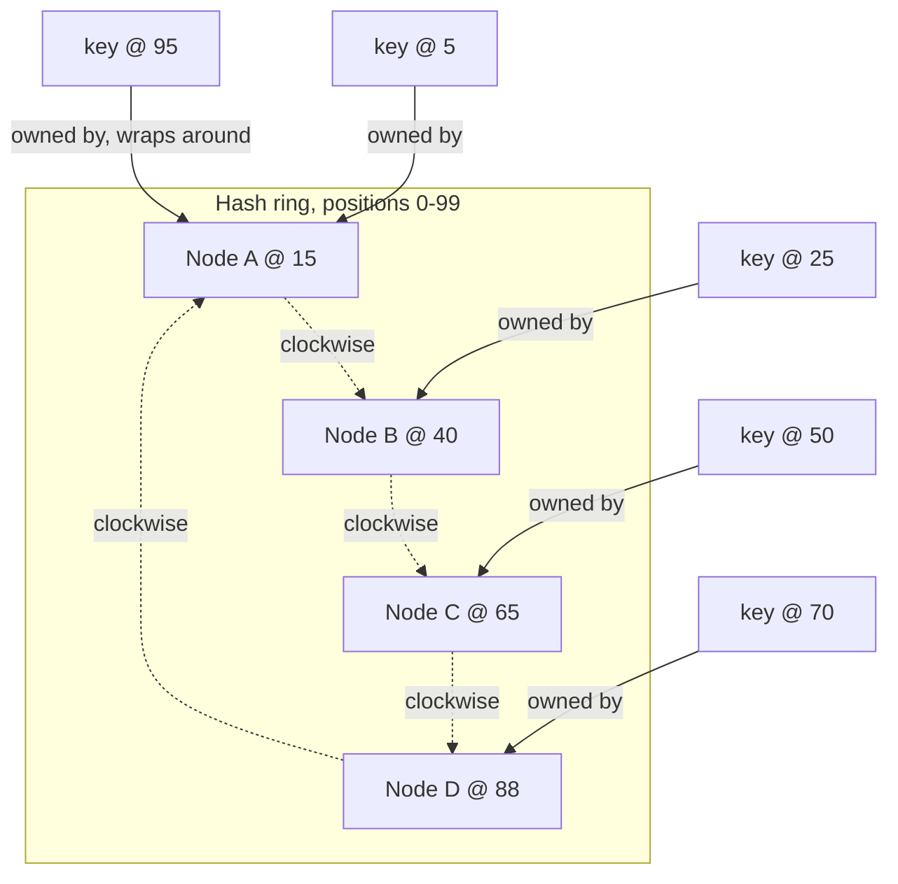

# Consistent Hashing (Virtual Nodes)

_The previous two topics both named this mechanism only far enough to motivate why it matters, then deferred it here: [partitioning and sharding](03-partitioning-and-sharding.md#operational-concerns-adding-removing-and-resharding) flagged the naive `hash(key) mod N` scheme as "precisely the problem consistent hashing was invented to solve," and [rebalancing and hotspots](04-rebalancing-and-hotspots.md#dynamic-partitioning-proportional-to-nodes) previewed virtual nodes as "the specific mechanism the next topic formalizes in full." This is that topic - the ring, the proof that membership changes move only a bounded slice of the keyspace, and the virtual-node refinement that makes that bound actually hold in practice, all worked through with concrete numbers rather than left as a diagram and a promise._

## Contents

- [The naive `hash(key) mod N` failure mode](#the-naive-hashkey-mod-n-failure-mode)
- [The hash ring](#the-hash-ring)
- [Bounded key movement: adding and removing a node](#bounded-key-movement-adding-and-removing-a-node)
- [Virtual nodes: fixing load imbalance](#virtual-nodes-fixing-load-imbalance)
- [Replication on the ring: finding a key's replica set](#replication-on-the-ring-finding-a-keys-replica-set)
- [Trade-offs](#trade-offs)
- [How this connects](#how-this-connects)
- [Real-world & sources](#real-world--sources)
- [Check yourself](#check-yourself)

## The naive `hash(key) mod N` failure mode

**The scheme.** Assign each key to partition `hash(key) mod N`, where N is the current number of nodes. It is the simplest possible formula that scatters keys evenly across N nodes, and it works fine as long as N never changes.

**Why it breaks, with numbers.** Take 12 keys with these hash values: `3, 17, 22, 35, 41, 48, 53, 61, 74, 82, 91, 97`. With N=4 nodes (partitions 0-3):

| Key hash | mod 4 (N=4) | mod 5 (N=5, one node added) | Moved? |
| --- | --- | --- | --- |
| 3 | 3 | 3 | no |
| 17 | 1 | 2 | **yes** |
| 22 | 2 | 2 | no |
| 35 | 3 | 0 | **yes** |
| 41 | 1 | 1 | no |
| 48 | 0 | 3 | **yes** |
| 53 | 1 | 3 | **yes** |
| 61 | 1 | 1 | no |
| 74 | 2 | 4 | **yes** |
| 82 | 2 | 2 | no |
| 91 | 3 | 1 | **yes** |
| 97 | 1 | 2 | **yes** |

Adding one node out of four - a 25% capacity increase - changed the assignment of **7 of 12 keys (58%)**, not the 1 in 5 (20%) that should logically need to relocate to populate the new node. This isn't a quirk of this particular sample: because `mod` is not monotonic in its divisor, changing N from 4 to 5 changes the remainder of almost every input, with only a small, essentially coincidental sliver of keys landing on the same remainder by chance under both moduli. Reasoning it through in general (letting the hash values range over a large space and comparing `h mod N` against `h mod (N+1)`) shows that the *fraction of keys that keep the same assignment* is only about `1/(N+1)` - meaning the fraction that move is about `N/(N+1)`, i.e. **almost the entire dataset**, regardless of how small the actual capacity change was. For N=10 growing to 11, that's roughly 91% of all keys reassigned to add one node's worth (9%) of capacity.

In a real cluster, "reassigned" is not a bookkeeping abstraction - it means physically copying that key's data over the network to whatever node the new formula now names as owner, for close to every key in the dataset, while the cluster is expected to keep serving live traffic throughout. That is exactly the "catastrophic" failure mode [the partitioning topic flagged and deferred here](03-partitioning-and-sharding.md#operational-concerns-adding-removing-and-resharding), and it is the reason no production hash-partitioned system (DynamoDB, Cassandra, Riak) actually computes ownership as `hash(key) mod N`.

## The hash ring

**The fix, at a glance.** Instead of hashing a key directly to one of N slots and recomputing that mapping whenever N changes, consistent hashing hashes **both nodes and keys into the same fixed, node-count-independent output space**, conceptually arranged as a circle (a "ring") that wraps from its maximum value back to zero. A key's owner is defined as *whichever node's hash value is the first one reached going clockwise from the key's own hash position* - the key's **successor** node. Because a node's position on the ring depends only on hashing that node's own identifier (its IP:port, hostname, or an assigned token), not on how many other nodes currently exist, adding or removing a node never touches any *other* node's position.

Production systems hash into a large space - 32-bit (0 to 2^32 - 1) or 160-bit (SHA-1, as in the original Chord and Dynamo designs) - but the mechanism is identical at any size, so this topic uses a ring of only 100 positions (0-99) throughout, purely to keep the arithmetic checkable by hand.

**Worked example.** Four physical nodes are hashed onto the 0-99 ring at positions A=15, B=40, C=65, D=88. Five keys hash to positions 5, 25, 50, 70, 95. Each key's owner is the first node position reached going clockwise (wrapping past 99 back to 0 if necessary):

| Key position | First node clockwise | Owner |
| --- | --- | --- |
| 5 | 15 | A |
| 25 | 40 | B |
| 50 | 65 | C |
| 70 | 88 | D |
| 95 | wraps past 99 to 15 | A |

Each node owns the contiguous **arc** running from its predecessor's position (exclusive) to its own position (inclusive): A owns (88,15] wrapping (size 27), B owns (15,40] (size 25), C owns (40,65] (size 25), D owns (65,88] (size 23) - together covering the whole ring exactly once.

## Bounded key movement: adding and removing a node

**Adding a node.** A fifth node, E, joins at position 30 - which falls inside B's current arc, (15,40]. E's arrival splits that one arc in two: E now owns (15,30] (size 15), and B's arc shrinks to (30,40] (size 10). **A, C, and D's arcs are completely untouched** - their boundaries never mention position 30 at all, so no key they own can possibly be affected.

Checking the five sample keys: the key at position 25 was owned by B (it fell in B's old (15,40] arc); it now falls in E's new (15,30] arc, so it moves to E. The other four keys (at positions 5, 50, 70, 95) are owned by A, C, D, and A respectively - exactly as before - none of whose arcs changed at all. **1 of 5 keys moved (20%)**, exactly matching the expectation that adding a 5th node to a 4-node ring should move roughly `1/(4+1) = 1/5` of the keyspace, and it moves *from a single specific neighbor*, not scrambled across every existing node.

At real scale the same arithmetic holds: a ring holding 1,000,000 keys across 10 nodes (~100,000 keys/node on average) gaining an 11th node moves roughly `1,000,000 / 11 ≈ 90,900 keys` - all of them carved out of whichever one existing node's arc the new node's position happened to land in, leaving the other 9 nodes' ~909,100 keys completely undisturbed. Contrast that with the naive `mod N` scheme's result for the identical 10-to-11 change derived above: roughly `10/11 ≈ 909,100 keys move` (nearly everyone) to add the same one node's worth of capacity. **The two schemes' outcomes are almost exact mirror images of each other** - consistent hashing moves the small fraction (`1/(N+1)`) that logically needs to relocate; naive modulo hashing moves the large fraction (`N/(N+1)`) that logically should have stayed put.

**Removing a node.** Removing C (position 65) from the original four-node ring means C's entire arc, (40,65], has nowhere to go except its own clockwise successor, D - D's arc grows to absorb it, becoming (40,88] (size 48). A and B are untouched. Checking the sample keys: the key at 50 (previously C's) now falls in D's enlarged arc and moves to D; every other sample key is unaffected. **A node leaving dumps its entire arc onto exactly one neighbor** - a fact worth holding onto, because it is precisely the problem virtual nodes exist to fix, below.

## Virtual nodes: fixing load imbalance

Giving each physical node exactly **one** token (one ring position) - as both worked examples above did - creates two related problems, both of which [rebalancing and hotspots already named as vnodes' motivation](04-rebalancing-and-hotspots.md#dynamic-partitioning-proportional-to-nodes) without deriving:

**Problem 1 - uneven arc sizes, purely from placement luck.** With only a handful of random positions splitting a circle, the arcs they produce are rarely close to equal, even though each node's *expected* share is `1/N`. Concretely: four nodes single-tokened at positions 2, 8, 15, 60 produce arcs of size 42 (owned by the node at 2, wrapping from 60), 6 (owned by 8), 7 (owned by 15), and 45 (owned by 60) - two nodes each holding roughly 42-45% of the entire keyspace while the other two hold only 6-7%, purely because of where their single random token happened to land, despite every node being "supposed to" own 25%.

**Problem 2 - one join or leave dumps/takes an entire, possibly oversized, contiguous chunk from a single neighbor.** The removal example above already showed this: C's whole arc landed entirely on D, nobody else. If C's arc had been one of the oversized 42-45% arcs above instead of an average one, D would have absorbed almost half the total keyspace's traffic overnight - a single node bearing the *entire* cost of one departure, rather than that cost being shared.

**The fix: many small, randomly scattered vnodes per physical node.** Instead of hashing a physical node to one ring position, hash it (via distinct labels - `"nodeA-vnode0"`, `"nodeA-vnode1"`, ... ) to many positions, scattered independently across the ring. A physical node's total share of the keyspace becomes the *sum* of many small, independently-placed arcs rather than the luck of one placement - and by the same statistical logic that makes an average of many independent samples converge more tightly than any single sample, that sum concentrates much closer to the true average (`1/N`) the more vnodes each node has.

**Worked comparison, 4 tokens per node instead of 1.** Sixteen tokens (4 per node) placed at: A = 4, 28, 55, 80; B = 11, 37, 61, 88; C = 19, 44, 70, 93; D = 33, 49, 76, 97. Computing each node's total share (sum of its four arcs' sizes) gives **A=26, B=25, C=29, D=20** - a spread of only 20-29%, versus the single-token example's wild 6-45% spread, even though both sets of positions were placed without any special tuning. Real systems use far more than 4 vnodes per node - Cassandra's `num_tokens` [was already named, historically defaulting to 256 and more recently tuned lower once an improved token-allocation algorithm made a smaller count sufficient](04-rebalancing-and-hotspots.md#dynamic-partitioning-proportional-to-nodes) - and more vnodes tightens the distribution further still; the current exact default and the reason for the change are verified below in Real-world & sources.

**Worked comparison, joining with vnodes.** A fifth node, E, joins the 16-token ring above carrying 4 of its own new tokens at positions 7, 24, 46, and 67 - each landing inside a different existing node's arc: 7 falls inside B's (4,11] arc (E takes 3 of B's 25), 24 falls inside A's (19,28] arc (E takes 5 of A's 26), 46 falls inside D's (44,49] arc (E takes 2 of D's 20), and 67 falls inside C's (61,70] arc (E takes 6 of C's 29). E's total new share is 3+5+2+6 = 16 (close to the ideal `100/5 = 20` for a 5-node ring), assembled from four small pieces taken from **all four** existing nodes - nobody lost their entire arc, and nobody absorbed a disproportionate share. Compare this directly to the single-token join earlier in this topic, where the new node's entire arc came from **one** neighbor (B alone lost 15 of its 25) - vnodes convert "one big chunk from one unlucky neighbor" into "many small chunks spread across the whole cluster," fixing both problems named above at once, and delivering exactly what the rebalancing topic promised: a membership change that "splits the load contribution of many existing nodes by a small amount each."

## Replication on the ring: finding a key's replica set

[Leaderless replication already assumed](02-replication.md#the-write-path) that a key has N replicas, "per whatever partitioning scheme assigns ownership (consistent hashing...)"; [partitioning and sharding already stated](03-partitioning-and-sharding.md#combining-partitioning-with-replication) that "a key's hash determines which N nodes own that partition via consistent hashing." This is that mechanism, made explicit: to find a key's full **replica set** at replication factor N, walk clockwise from the key's ring position exactly as for ownership, but keep collecting distinct **physical** nodes - not tokens - until N distinct physical nodes have been found, skipping any token encountered that belongs to a physical node already counted (since that physical node already holds a copy; counting one of its other vnode tokens again wouldn't add a new replica).

**Worked example.** Suppose, while walking clockwise past a key's position, the coordinator encounters tokens in this order: `42 (node C)`, `44 (node C)`, `50 (node D)`, at replication factor 2. The first token, 42, belongs to C - count C as replica 1. The second token, 44, also belongs to C - already counted, skip it (it is the *same* physical node's other vnode, not a second replica). The third token, 50, belongs to D - a genuinely new physical node - count D as replica 2. With 2 distinct physical nodes found, the walk stops: the key's replica set is `{C, D}`. This is exactly the original Dynamo paper's **preference list** - the ordered list of nodes responsible for a key - and it is precisely the N-node set that [leaderless replication's R/W quorum mechanics](02-replication.md#the-write-path) and [per-partition replica sets](03-partitioning-and-sharding.md#combining-partitioning-with-replication) operate over, scoped to whichever N nodes this walk names.

A refinement worth naming but not deriving here: production systems (Cassandra's `NetworkTopologyStrategy`) extend "distinct physical node" to "distinct node in a distinct rack or availability zone," so that a key's replicas are spread across failure domains rather than merely across separate machines that could still share a rack's power or network failure - full treatment of failure-domain awareness belongs to the reliability track, not this topic.

## Trade-offs

| Scheme | Key movement on membership change | Load balance | Metadata/overhead | Canonical systems |
| --- | --- | --- | --- | --- |
| Naive `hash(key) mod N` | Catastrophic - roughly `N/(N+1)` of all keys reassigned | Even, but only while N is fixed | None (a pure formula) | Not used in production for exactly this reason |
| Consistent hashing, single token/node | Bounded - roughly `1/(N+1)` of keys, but taken/dumped entirely from/onto one neighbor | Uneven - a few nodes can hold far more or less than `1/N` by placement luck | Minimal - one ring position per node | Original Chord/early Dynamo designs |
| Consistent hashing + vnodes | Bounded, and spread across many existing nodes in small pieces | Much tighter around `1/N` as vnode count grows | Higher - every vnode is a separate token every node must track and gossip | Cassandra (`num_tokens`), Riak, DynamoDB's ring internals |

**The vnode-count knob, both directions.** Too few vnodes per node reduces back toward the single-token variance problem (fewer independent samples per node, wider spread around the average); too many vnodes means more ring positions for every node to track, gossip, and include in Merkle-tree anti-entropy ranges - [the same gossip-propagation cost already named for cluster-membership routing](03-partitioning-and-sharding.md#request-routing-how-a-client-finds-the-right-partition) and [the same Merkle-tree comparison mechanism already covered for anti-entropy](02-replication.md#read-repair-and-anti-entropy), now scaled up by however many vnodes exist per node. Cassandra's own history - a `num_tokens` default cut from 256 to 16 once a smarter, non-random token-allocation algorithm shipped (verified below in Real-world & sources) - is a direct, confirmed instance of this trade-off being actively re-tuned as the underlying allocation algorithm improved, not a settled constant.

**What consistent hashing does *not* fix.** It balances keyspace evenly - it says nothing about *traffic per key*. A celebrity account's key still hashes to exactly one ring position no matter how many vnodes exist in the cluster; if that one key receives disproportionate read/write traffic, consistent hashing (with or without vnodes) does nothing to relieve it, because vnodes only smooth *how much keyspace* each physical node owns, not *how much traffic* any individual key inside that keyspace generates. The hot-key and hot-partition mitigations - key salting, caching, adaptive traffic-aware splitting - [already covered in full in the rebalancing and hotspots topic](04-rebalancing-and-hotspots.md#hotspots-mitigations) remain fully necessary on top of consistent hashing, not replaced by it.

## How this connects

- **Back to partitioning and sharding** - this topic is the full resolution of [that topic's flagged `hash(key) mod N` failure](03-partitioning-and-sharding.md#operational-concerns-adding-removing-and-resharding), and [combining partitioning with replication](03-partitioning-and-sharding.md#combining-partitioning-with-replication)'s "N nodes own a partition via consistent hashing" now has its full mechanical basis.
- **Back to rebalancing and hotspots** - [dynamic partitioning proportional to nodes](04-rebalancing-and-hotspots.md#dynamic-partitioning-proportional-to-nodes) previewed vnodes exactly far enough to motivate them; this topic delivered the ring mechanics and the worked proof of bounded movement that topic promised.
- **Back to replication** - [leaderless replication's N-replica assumption](02-replication.md#the-write-path) and [Dynamo's preference-list, sloppy-quorum, and Merkle-tree anti-entropy machinery](02-replication.md#real-world--sources) all operate on exactly the replica set this topic's ring-walk produces.
- **Forward to data modeling and denormalization** - consistent hashing decides *where* a key's data physically lands, evenly; it has no opinion on *which field* should be the key in the first place - that remains this level's next topic's entire subject, and a poorly chosen key (low cardinality, or one that concentrates traffic) is exactly the residual hotspot risk named in trade-offs above.
- **Forward to quorums (R + W > N)** - the N in that later topic's formula is precisely the N distinct physical nodes this topic's replication-on-the-ring section walks the ring to find.
- **Forward to L5 (distributed systems theory)** - propagating ring/token ownership to every node relies on the same gossip protocols [already named in partitioning's request-routing section](03-partitioning-and-sharding.md#request-routing-how-a-client-finds-the-right-partition); L5 formalizes gossip and consensus as general mechanisms in their own right.
- **Forward to L12 (scalability and performance patterns)** - hot-key mitigation and geo-partitioning, both named here only as residual risk on top of an otherwise-balanced ring, get dedicated, deeper treatment there as general-purpose scaling patterns.

## Real-world & sources

**Amazon DynamoDB - the ring survives, the coordination around it doesn't.** The original 2007 Dynamo design used a fully peer-to-peer consistent-hashing ring: every node gossiped membership and derived ownership independently, with no central coordinator. The 2022 USENIX ATC paper on the production DynamoDB service ("Amazon DynamoDB: A Scalable, Predictably Performant, and Fully Managed NoSQL Database Service") documents that this has changed - DynamoDB now relies on **logically-centralized services** to manage replication groups and partition metadata, rather than pure peer-to-peer gossip across a symmetric ring of every node. What hasn't changed is the underlying placement principle this topic covers: a table's items are still hashed and distributed across partitions, and [partitioning and sharding's real-world section already verified, from AWS's own Database Blog](03-partitioning-and-sharding.md#real-world--sources), that those partitions are arranged on a consistent-hashing ring. In short: the ring mechanic this topic derives is intact; the *coordination layer* around who-knows-what-about-the-ring has moved from decentralized gossip to centralized services as the system scaled to trillions of requests. (Direct fetch of the USENIX paper page returned HTTP 403; the centralization claim is corroborated via a secondary summary of the same paper and is marked accordingly.) `verify` — the centralization detail is confirmed only via a paper summary, not the primary PDF itself.

**Apache Cassandra - the vnode-count default itself changed, and here's why.** Cassandra's `num_tokens` setting (tokens/vnodes per physical node) defaults to **16** as of Cassandra 4.0, confirmed directly from the current Cassandra configuration documentation - down from a long-standing legacy default of 256 in earlier major versions. This wasn't an arbitrary reduction: starting in Cassandra 3.0, the project shipped a new token-allocation algorithm that deliberately places new tokens to split the *largest* existing token ranges, rather than scattering them at random the way this topic's worked examples do for simplicity. Because the smarter algorithm no longer relies on sheer token count to average out placement luck, testing showed 16 tokens with the new algorithm gives comparable load balance to 256 randomly-placed tokens - while cutting gossip and metadata overhead per node and speeding up operations (bootstrap, repair, streaming) whose cost scales with token count. This is a directly verified, real instance of exactly the "vnode-count knob" trade-off named in this topic's Trade-offs section: fewer tokens became sufficient once the allocation algorithm got smarter about *where* it places them, not because fewer tokens are inherently better.

**Discord - consistent hashing for request routing, not just storage sharding.** Discord's March 2023 engineering blog post "How Discord Stores Trillions of Messages" describes a Data Service layer that uses **consistent hash-based routing** keyed on channel ID: "For each request to our data service, we provide a routing key... For messages, this is a channel ID, so all requests for the same channel go to the same instance." This is a different application of the same ring mechanic this topic derives - not deciding which node *stores* a shard of data, but deciding which service instance *handles* a request, so that repeated requests for one hot channel land on one instance and can be coalesced into a single database query instead of fanning out N duplicate queries. It's a useful reminder that consistent hashing's value - stable, node-count-independent affinity for a key - generalizes beyond storage partitioning to any routing problem that wants request affinity.

A fintech example (Stripe first, per this repo's standing priority) and a UPI/NPCI angle were both searched for specifically in this pass and neither turned up a genuine, citable primary source describing consistent hashing use - flagged openly rather than forced. Riak's own ring documentation (explicitly Dynamo-derived) was also not directly fetched in this pass and remains a gap for a future sweep if a fintech/UPI source still doesn't surface.

Sources:
- Amazon DynamoDB: A Scalable, Predictably Performant, and Fully Managed NoSQL Database Service, USENIX ATC 2022 - summarized via [alexdebrie.com/posts/dynamodb-paper](https://www.alexdebrie.com/posts/dynamodb-paper/) (accessed 2026-07-16); direct USENIX page (usenix.org/conference/atc22/presentation/elhemali) returned HTTP 403 on fetch, so the centralization claim is `verify`-flagged pending a direct primary-source read.
- Apache Cassandra 4.0 configuration reference: [cassandra.apache.org/doc/4.0/cassandra/configuration/cass_yaml_file.html](https://cassandra.apache.org/doc/4.0/cassandra/configuration/cass_yaml_file.html) (accessed 2026-07-16) - confirms `num_tokens` default of 16.
- The Last Pickle, "The Impacts of Changing the Number of VNodes in Apache Cassandra" (2021): [thelastpickle.com/blog/2021/01/29/impacts-of-changing-the-number-of-vnodes.html](https://thelastpickle.com/blog/2021/01/29/impacts-of-changing-the-number-of-vnodes.html) (accessed 2026-07-16) - context on the token-allocation algorithm change and its effect on the num_tokens default.
- Cassandra dev mailing list, "[Discuss] num_tokens default in Cassandra 4.0" (CASSANDRA-13701): [mail-archive.com/dev@cassandra.apache.org/msg14563.html](https://www.mail-archive.com/dev@cassandra.apache.org/msg14563.html) (accessed 2026-07-16).
- Discord Engineering, "How Discord Stores Trillions of Messages" (published March 6, 2023): [discord.com/blog/how-discord-stores-trillions-of-messages](https://discord.com/blog/how-discord-stores-trillions-of-messages) (accessed 2026-07-16).

## Check yourself

- Twelve keys are assigned via `hash(key) mod 4`. A fifth node joins, changing the formula to `mod 5`. Without recomputing every value, explain in general terms why roughly 4 out of every 5 keys' assignments change, rather than only the 1 in 5 that logically needs to move to the new node.
- On a ring with nodes at positions 15, 40, 65, and 88 (out of 0-99), a key hashes to position 62. Which node owns it, and why? If a new node joins at position 58, does that key's owner change - and does node D's (position 88) arc change at all?
- Explain why giving each physical node a single ring token produces uneven arc sizes even when node positions are chosen "randomly," and why giving each node many small tokens instead fixes this without changing each node's *expected* share of the keyspace.
- A physical node leaves a single-token ring. Describe precisely which other node absorbs its entire arc, and explain why that specific fact is what motivates virtual nodes.
- At replication factor 3, walking clockwise from a key's position, a coordinator encounters tokens belonging to nodes `B, B, A, C` in that order. Which three nodes end up in the replica set, and why is the second `B` token skipped rather than counted as a second replica?
- A table's partition key is a celebrity's user ID, and that one key receives far more traffic than any other. Explain precisely why adding more vnodes per node to the cluster does nothing to relieve this specific problem, and name what would.
