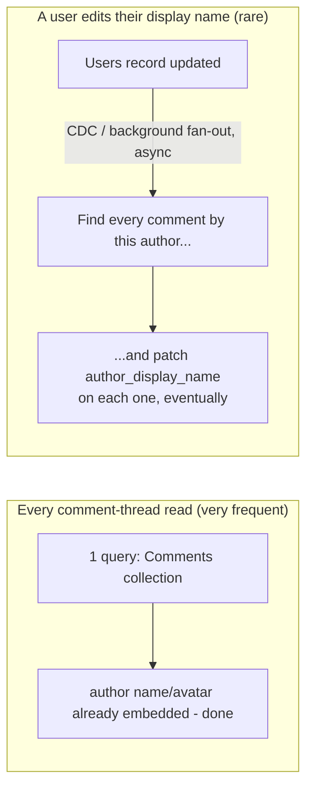
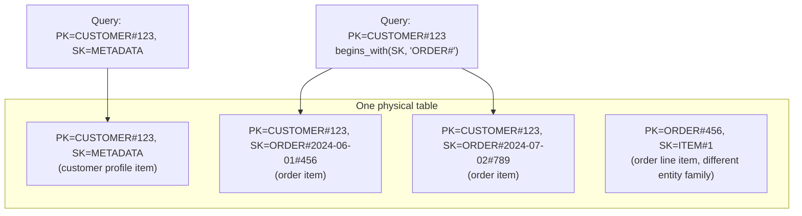
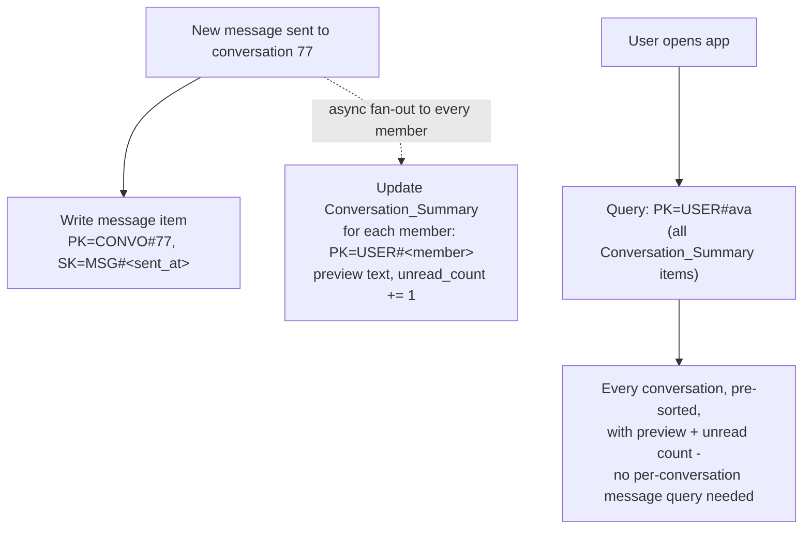

# Data Modeling and Denormalization

_Four topics in this level have all pointed here without doing the work themselves. [NoSQL families](01-nosql-families.md) named "design the schema around the access pattern, not the access pattern around the schema" as its recurring refrain and explicitly deferred "the actual keys, partitions, and document/row shapes" to this topic. [Partitioning and sharding](03-partitioning-and-sharding.md) built a messages-table worked example around choosing `conversation_id` as the partition key and called that choice "the leading edge of that later topic's entire subject." [Rebalancing and hotspots](04-rebalancing-and-hotspots.md) covered reactive fixes for an already-hot key and named this topic as the place "designing the key well from the start, around real access patterns" becomes the primary discipline instead. [Consistent hashing](05-consistent-hashing.md) proved *where* a key lands on the ring but was explicit that it "has no opinion on *which field* should be the key in the first place." This topic pays off all four: it is the actual discipline of shaping keys, partitions, and document/row bodies around real queries, and the reason every NoSQL family demands it._

## Contents

- [The inversion: query-first vs normalize-first](#the-inversion-query-first-vs-normalize-first)
- [Denormalization: the core technique](#denormalization-the-core-technique)
  - [Worked example: embedding vs joining a comment's author](#worked-example-embedding-vs-joining-a-comments-author)
- [Composite keys: the primary tool for multiple access patterns](#composite-keys-the-primary-tool-for-multiple-access-patterns)
  - [Partition key + sort key](#partition-key--sort-key)
  - [Single-table design](#single-table-design)
- [One-to-many and many-to-many without joins](#one-to-many-and-many-to-many-without-joins)
  - [One-to-many: embed or reference](#one-to-many-embed-or-reference)
  - [Many-to-many: duplication and adjacency lists](#many-to-many-duplication-and-adjacency-lists)
  - [Materialized views and precomputed aggregates](#materialized-views-and-precomputed-aggregates)
- [The trade-off, precisely](#the-trade-off-precisely)
- [Worked example: a messages table, revisited, with two more access patterns](#worked-example-a-messages-table-revisited-with-two-more-access-patterns)
- [How this connects](#how-this-connects)
- [Real-world & sources](#real-world--sources)
- [Check yourself](#check-yourself)

## The inversion: query-first vs normalize-first

[L2's normalization-forms topic](../L2/02-normalization-forms.md) taught a specific discipline: decompose a relation until every non-key attribute depends on "the whole key, and nothing but the key," proving each of the update/insertion/deletion anomalies structurally impossible. That discipline works because a relational engine can cheaply *reassemble* the decomposed pieces at read time - a join is a single, well-optimized operation the query planner ([L2's own query-planning topic](../L2/11-query-planning-and-optimization.md)) can execute against indexes on one machine, or across a handful of read replicas of the same data.

That assumption - cheap reassembly - is precisely what most NoSQL families remove. [NoSQL families](01-nosql-families.md#why-nosql-exists-what-the-relational-model-struggles-with-at-scale) already established why: a key-value store has no query language at all, only exact-key lookup; a wide-column store has no joins and [must have its row-key/column-family layout designed around known queries in advance](01-nosql-families.md#wide-column-column-family-stores); a document store's whole reason for existing is to store an aggregate as one physical unit rather than decompose it. And once data is [partitioned across many nodes](03-partitioning-and-sharding.md#partitioning-strategies-for-key-value-data), even a family that *could* support a join would have to do it as a **scatter-gather** across every partition holding a piece of the two relations being joined - exactly the cost [partitioning's local-secondary-index section](03-partitioning-and-sharding.md#local-document-partitioned-secondary-indexes) already quantified for the simpler case of a single cross-cutting query, now multiplied by however many relations a join touches.

This forces an inversion of the design order itself:

| | Relational (L2 default) | NoSQL (this topic) |
| --- | --- | --- |
| **Design order** | Normalize the data first (model the real-world entities and their dependencies faithfully); write whatever query the application needs later - the engine's query planner and join machinery absorb the cost | Enumerate every access pattern the application needs *first* - every query, its frequency, its latency requirement; only then decide what a record looks like and which field is the key |
| **What "correct" means** | A schema that eliminates redundancy and anomalies, provable via functional dependencies | A schema that answers every named access pattern with a single partition read (or a small, bounded number of them) |
| **What changes if a new query type appears later** | Usually just a new query (a new `JOIN`) against the existing normalized schema | Often a schema change - a new composite key, a new denormalized copy, or a new index, because the old shape was never built to answer this query cheaply |

This is not "NoSQL abandons discipline" - it trades one rigorous discipline (normalize by functional dependency) for a different, equally rigorous one (model by access pattern, verified by "can this query be answered by one partition read"). Both are precise; they just optimize for opposite things - normalization optimizes for write-time integrity and query flexibility later, access-pattern modeling optimizes for read-time cost being bounded and known in advance, at the cost of that flexibility.

## Denormalization: the core technique

**Denormalization is deliberately duplicating data across records, documents, or tables so that a read that would otherwise require a join or a scatter-gather across partitions can instead be answered from a single record, on a single partition.** [L2's normalization topic already introduced this vocabulary and one worked example (call-analytics records)](../L2/02-normalization-forms.md#denormalization-the-deliberate-trade-off) as a deliberate, occasional reversal of normalization inside a relational schema; in NoSQL modeling it isn't an occasional reversal, it is usually the *default* starting posture, because the alternative (a join, or a cross-partition fan-out) is frequently not available at all rather than merely expensive.

### Worked example: embedding vs joining a comment's author

A social app stores posts and comments. Every comment page renders each comment's author display name and avatar next to the comment body - the single most frequent read in the entire application, executed on every page view.

**Normalized shape** (the relational instinct, [3NF](../L2/02-normalization-forms.md#third-normal-form-3nf)):

```
Comments                              Users
comment_id | post_id | author_id | body        user_id PK | display_name | avatar_url
9001       | 501     | 12        | "nice shot"  12         | ava.codes    | .../ava.png
9002       | 501     | 27        | "love this"  27         | ben.makes    | .../ben.png
```

Rendering a post's comment thread means, for every comment, resolving `author_id` against `Users` - one join (or, in a document store with no joins at all, one extra round-trip per distinct author) on every single page load, for a read that happens orders of magnitude more often than a user ever changes their display name or avatar.

**Denormalized shape** (embed the author's display name and avatar directly in each comment):

```json
{
  "comment_id": 9001,
  "post_id": 501,
  "author_id": 12,
  "author_display_name": "ava.codes",
  "author_avatar_url": ".../ava.png",
  "body": "nice shot"
}
```

- **The read-speed win.** Rendering the comment thread is now one query against one collection/partition - no second lookup against a `Users` table, no join, no scatter-gather across partitions for authors that might live anywhere. This is the entire point: the read that happens on every page view got cheaper, at the cost of a write that happens rarely.
- **The write/update-fanout cost.** If Ava changes her display name, every comment she has ever authored - potentially thousands, scattered across many different posts and, in a partitioned system, many different partitions - now holds a stale copy of her old name, and each one must eventually be corrected. This is the **update anomaly** [normalization was specifically built to make structurally impossible](../L2/02-normalization-forms.md#the-problem-what-an-unnormalized-table-actually-costs-you), reintroduced on purpose. It is not fixed by "just update them all synchronously" - that would mean one profile edit triggering a write fan-out across an unbounded, unpredictable number of documents, potentially on many different partitions, turning a cheap single-row update into an expensive, slow, all-or-nothing operation exactly the kind [partitioning's global-secondary-index section already showed doesn't stay synchronous at scale](03-partitioning-and-sharding.md#global-term-partitioned-secondary-indexes). In practice this fan-out is handled **asynchronously** - a background job, or (previewing this level's next topics) a **change-data-capture** stream off the `Users` table that finds every comment needing the update and patches it eventually - accepting a deliberate, bounded window where a comment shows a stale display name after a profile edit, in exchange for every comment *read* staying a single-partition lookup forever.



The decision to embed rather than reference is a bet, made explicitly: this application's read:write ratio for "render a comment" versus "edit a display name" is so lopsided (millions of reads per profile edit) that paying a bounded, asynchronous write cost on the rare event is worth it for a synchronous win on the frequent one. A field that changes *often* relative to how often it's read (a live view counter, say) is exactly the wrong candidate to denormalize this way - the fan-out cost would dominate instead of being a rare background nuisance.

## Composite keys: the primary tool for multiple access patterns

Denormalization solves "avoid a join by duplicating the joined data into the record." A second, complementary technique solves a different problem: one entity type - one item, one document - often needs to be *found* several different ways by several different, unrelated queries, and a single scalar key can only ever support one of them efficiently.

### Partition key + sort key

[Key-value stores](01-nosql-families.md#key-value-stores) and DynamoDB specifically support a **composite primary key**: a **partition key** (determines which physical partition/node owns the item, [exactly as partitioning covered](03-partitioning-and-sharding.md#hash-partitioning)) plus a **sort key** that orders items *within* that one partition key's collection. This single structural feature is the workhorse behind almost every multi-access-pattern NoSQL schema, because it lets one table answer two genuinely different questions cheaply:

- "give me this one specific item" - exact match on partition key + sort key, an O(1)-style point lookup;
- "give me a range of related items" - exact match on partition key, plus a range or `begins_with` condition on the sort key, a single-partition sorted scan - no scatter-gather, because every item sharing that partition key is physically co-located and stored in sort-key order.

[Partitioning and sharding's messages-table worked example](03-partitioning-and-sharding.md#worked-example-partitioning-a-messaging-apps-messages-table) is exactly this in miniature: partition key `conversation_id`, sort key `sent_at` (or `message_id`), so "last 50 messages in this conversation" becomes one partition, one sorted range read - the single design decision that worked example built its entire argument around, made explicit here as the general technique it was an instance of.

### Single-table design

The composite-key idea, taken to its logical extreme in DynamoDB modeling practice, is **single-table design**: rather than one table per entity type (the relational instinct - a `Users` table, an `Orders` table, an `OrderItems` table), store *every* entity type an application needs in **one physical table**, using generic, overloaded attribute names (commonly `PK` and `SK`, plus `GSI1PK`/`GSI1SK` for a global secondary index supporting a second access pattern) whose *meaning* differs by which kind of item currently occupies them. A customer's own record might use `PK = CUSTOMER#123`, `SK = METADATA`; that same customer's orders might use `PK = CUSTOMER#123`, `SK = ORDER#2024-06-01#456` - different real-world entities, sharing one partition key, so a single query ("get everything where `PK = CUSTOMER#123`") returns the customer's profile *and* every one of their orders in one request, pre-sorted by the order's date-prefixed sort key, with zero joins.



**The trade-off, named plainly.** Single-table design is the most extreme instance of this topic's whole discipline - it requires every access pattern to be known and enumerated *before* the table is designed, because retrofitting a new, previously unanticipated access pattern into an already-populated single table (rather than just adding a new normalized table alongside the others, the relational escape hatch) often means a new global secondary index, a new key-overloading convention, or in the worst case a full data migration. It also makes the table close to unreadable by inspection - a raw item in the table tells you almost nothing about what kind of entity it is without decoding the `PK`/`SK` convention - trading application-level clarity for a minimized number of round trips. Many teams deliberately choose **multi-table design** instead (one table per entity type, DynamoDB's `Query`/`BatchGetItem` calls used to stitch results together in the application) precisely to keep the schema legible and each entity's access patterns independently evolvable, accepting a few more round trips per request in exchange. Neither is universally correct; it is the same read-cost-vs-flexibility trade-off this whole topic keeps restating, just instantiated at the level of "how many tables should this system have."

## One-to-many and many-to-many without joins

Every relationship a relational schema expresses via a foreign key and a `JOIN` has to be re-expressed some other way once joins are off the table (or prohibitively expensive across partitions).

### One-to-many: embed or reference

- **Embed** the "many" side directly inside the "one" side's document when the many side is **small and bounded** and almost always read together with its parent - e.g. a handful of shipping addresses embedded in a customer document, or (from the comment example above) a small, capped list of recent comments embedded directly in a post document. This is the document family's [aggregate-oriented design](01-nosql-families.md#document-databases) working exactly as intended: one read returns the whole object.
- **Reference** (store a foreign key and query the "many" side separately, or as a separate partition-key-scoped range read) when the many side is **large, unbounded, or independently queried** - a post with potentially tens of thousands of comments cannot be embedded in the post document at all without risking [MongoDB's per-document size ceiling (16 MB) or degrading write performance on every new comment](01-nosql-families.md#document-databases), so comments instead live as their own items/documents, keyed by `post_id` (partition key) so that "all comments for this post" stays a single-partition range read even though it is no longer literally embedded in the parent.

The deciding question is exactly the one [rebalancing and hotspots already used for a different purpose](04-rebalancing-and-hotspots.md#hotspots-mitigations): is this a small, roughly fixed-size collection that always travels with its parent, or an open-ended, independently-growing one? Embedding an unbounded "many" side is a direct route to the exact unbounded-document-growth failure mode [named in the NoSQL-families topic](01-nosql-families.md#document-databases).

### Many-to-many: duplication and adjacency lists

A many-to-many relationship - users following users, students enrolled in courses - has no join to fall back on at all, so it is modeled as **duplicated adjacency data on both sides of the relationship**, accepting eventual consistency between the two copies as a deliberate trade:

```
PK=USER#ava,  SK=FOLLOWS#ben     -- ava's following list contains ben
PK=USER#ben,  SK=FOLLOWER#ava    -- ben's follower list contains ava
```

A single logical fact ("ava follows ben") is written as two physically separate items, one on each user's own partition, specifically so that "who does ava follow" and "who follows ben" are each single-partition reads instead of a scan of every follow-relationship in the system. The cost is symmetrical to the comment-author example above: an unfollow, or any change to the relationship, must be applied to both copies, and if the second write fails or is delayed, the two sides can briefly disagree (ava's following-list says she follows ben; ben's follower-list hasn't caught up yet) - an eventual-consistency window accepted explicitly because the alternative (a distributed transaction across two different partitions on every follow/unfollow) is exactly the coordination cost this whole family of database was chosen to avoid.

### Materialized views and precomputed aggregates

A third pattern handles queries that are fundamentally about the *whole* relationship set rather than one side of it - "how many followers does ava have," "what are this product's average rating and review count." Recomputing these by scanning every relevant row/item on every read is the scatter-gather cost this topic exists to eliminate, so instead the aggregate itself is **precomputed and stored as its own record**, updated incrementally as the underlying facts change (an atomic increment/decrement on `follower_count` each time a follow/unfollow item is written, rather than a `COUNT(*)` scan) or refreshed periodically by a background job or a genuine [materialized view](../L2/02-normalization-forms.md#denormalization-the-deliberate-trade-off) mechanism where the underlying engine supports one. This is denormalization at its purest: a fact ("ava has 4,213 followers") that is technically derivable from other stored data is instead stored redundantly, specifically so reading it costs one lookup instead of a scan proportional to the relationship's total size.

## The trade-off, precisely

Every technique above buys the same thing and spends the same thing, restated one final time explicitly because it is the entire point of the topic:

| Gained | Spent |
| --- | --- |
| Single-partition reads for the enumerated access patterns - no join, no scatter-gather | The exact update/insertion/deletion anomalies [normalization eliminated by construction](../L2/02-normalization-forms.md#the-problem-what-an-unnormalized-table-actually-costs-you), reintroduced deliberately |
| Horizontal write scalability - each partition independently absorbs its own writes, [the core reason NoSQL partitions in the first place](03-partitioning-and-sharding.md#what-partitioning-is-and-why-it-exists) | Storage bloat - the same fact (a display name, a follow edge, an aggregate count) is physically stored in multiple places |
| Predictable, bounded read latency regardless of dataset size, because the access pattern was designed in from the start | Eventual inconsistency between duplicated copies during the window between a write to the source and the fan-out reaching every duplicate |
| No coordination cost on the hot, frequent path (a comment read, a follower-list read) | Real coordination cost pushed onto the cold, rare path (a display-name edit, an unfollow) - now paid asynchronously, via a background job or CDC, rather than never |

This is the same trade-off L2's normalization topic already named in the abstract - "the anomaly risk doesn't vanish, it moves" - except in NoSQL modeling it is usually the starting design, not an occasional reporting-table exception layered on top of an otherwise-normalized schema. Choosing it well means being honest, per field, about which side of that table you actually need: correctness-critical, rarely-read, frequently-updated facts (an account balance, an inventory count) still want something closer to normalized, transactionally-safe treatment - which is exactly why NewSQL and single-document ACID transactions exist as escape hatches within these same families, [both already named in NoSQL families](01-nosql-families.md#newsql) - while read-heavy, rarely-changing facts (a display name shown next to a comment, a follower count) are the textbook case for denormalizing without regret.

## Worked example: a messages table, revisited, with two more access patterns

[Partitioning's messages worked example](03-partitioning-and-sharding.md#worked-example-partitioning-a-messaging-apps-messages-table) modeled one access pattern well (`conversation_id` as partition key, `sent_at`/`message_id` as sort key, for "last 50 messages in this conversation") and flagged a second ("all of a user's messages across every conversation") as needing a global secondary index. A real chat application typically needs at least two more, and each is answered by the same composite-key + denormalization toolkit rather than a new mechanism:

- **"List of a user's conversations, with each conversation's most recent message preview and unread count"** - the screen every chat app opens to. Rather than joining conversations to messages on every app open, a `Conversation_Summary` item is maintained per `(user_id, conversation_id)`, holding a **denormalized copy** of the last message's preview text and sender name plus a precomputed unread count, updated (asynchronously, or synchronously if the write volume is low enough to afford it) every time a new message is sent to that conversation. Opening the app becomes one partition-scoped query (`PK = USER#ava`) returning every conversation summary already assembled, instead of, for every conversation the user is in, a separate query against the full message history to find the latest one.
- **"Group conversation membership - who is in this group, and which groups is this user in"** - a genuine many-to-many relationship between users and conversations, modeled exactly as the follows example above: `PK=CONVO#77, SK=MEMBER#ava` (this conversation's member list) alongside `PK=USER#ava, SK=CONVO#77` (this user's conversation list), two physically separate copies of the same membership fact, each optimized for one direction of the query, kept eventually consistent with each other rather than joined.



Notice the shape repeats exactly: the frequent read (opening the app) gets a single-partition query because a rarer event (a new message arriving) pays an asynchronous, fanned-out write to every affected member's summary - the same read/write trade-off this entire topic has been restating in every worked example, now composed across three access patterns on one logical application instead of one.

## How this connects

- **Back to NoSQL families** - this topic is the direct payoff of [that topic's closing claim](01-nosql-families.md#choosing-between-families-given-access-patterns) that "which family" is only the first pass, and that "the harder and more consequential work is data modeling and denormalization *within* that family." Every family-specific mechanism named there (DynamoDB's partition-key-plus-sort-key, MongoDB's aggregate-oriented documents, wide-column's row-key-designed-around-known-queries) is exactly the raw material this topic assembled into full schemas.
- **Back to partitioning and sharding** - the messages-table worked example this topic revisited and extended was [that topic's own closing argument](03-partitioning-and-sharding.md#how-this-connects) that choosing a partition key well "is the leading edge of that later topic's entire subject" - this topic is that promise redeemed, generalized from one access pattern to several composed on the same table.
- **Back to rebalancing and hotspots** - that topic treated a better partition/composite key as a *reactive* fix, applied after a hotspot was already discovered; this topic is the proactive version of the identical technique - choosing the composite key and denormalized shape correctly from the start so the reactive fix is never needed for the access patterns that were actually anticipated.
- **Back to consistent hashing** - that topic proved precisely *where* a given key's data physically lands and how evenly, and was explicit that it has no opinion on *which field* is the key. This topic is where that field gets chosen - the partition key, sort key, and denormalized fields worked out above are exactly the inputs consistent hashing's ring mechanics then place.
- **Back to L2 (normalization forms)** - every denormalization technique here is the deliberate, wholesale reversal of [the anomaly-elimination discipline normalization forms proved](../L2/02-normalization-forms.md#denormalization-the-deliberate-trade-off), now applied as NoSQL's default starting posture rather than an occasional reporting-schema exception.
- **Forward to quorums (R + W > N), next in this level** - every duplicated copy this topic accepted (a comment's embedded author name, both sides of a follow relationship, a conversation summary) needs some consistency guarantee about when a read is allowed to see a write; quorums formalize the tunable read/write consistency knob that governs exactly how stale one of these duplicated copies is allowed to be before a read is required to see a fresher one.
- **Forward to change data capture (CDC) and the outbox pattern**, also next in this level - every "asynchronous fan-out" this topic waved at (propagating a display-name change to every comment, updating a conversation summary when a message arrives) is a concrete instance of the exact problem CDC and the outbox pattern exist to solve reliably: detecting a source-of-truth change and propagating it to every denormalized copy without silently dropping an update or double-applying one.
- **Forward to event sourcing and CQRS**, later in this level - both are, in effect, this topic's discipline taken to its logical extreme: CQRS formalizes maintaining a separate, denormalized read model deliberately optimized for queries (exactly what the `Conversation_Summary` item above already is, informally); event sourcing formalizes treating the write side as an immutable log of facts rather than mutable state, which is what makes rebuilding a denormalized read model after a bug or a new access pattern a replay rather than a best-effort backfill.
- **Forward to L12 (scalability and performance patterns)** - fan-out-on-write vs fan-out-on-read (that level's own topic) is precisely a generalization of the `Conversation_Summary` write-time fan-out this topic's worked example used, applied as an explicit, named pattern across many problem shapes (feeds, notifications) rather than one worked chat example.

## Real-world & sources

This topic is a synthesis of technique, not a single company's story, and the strongest verified company-specific evidence for the *NoSQL-family* side of it - Stripe's DocDB chunking, Discord's Cassandra/ScyllaDB partition-key choices, Netflix's KVDAL adjacency-list modeling on Cassandra, Pinterest's HBase-to-TiDB migration - was already surfaced and cited in this level's earlier topics ([NoSQL families](01-nosql-families.md#real-world--sources), [partitioning and sharding](03-partitioning-and-sharding.md#real-world--sources), [rebalancing and hotspots](04-rebalancing-and-hotspots.md#real-world--sources)) and is not repeated here to avoid duplicating citations already made on their own terms. What follows are three verified perspectives specific to *this* topic's own subject - single-table design, and fan-out-on-write as a denormalization technique - not already covered above.

- **DynamoDB single-table design - AWS's own account, plus the canonical independent explainer.** AWS's own Database Blog describes single-table design as "materializing joins" at write time: items that are accessed together are given the same partition key so that a single `Query` returns every related, heterogeneous item type in one request, rather than issuing sequential requests per entity type the way a multi-table, relational-style layout would. The post is explicit that this is a genuine trade-off, not a default best practice - it names three concrete reasons to reach for single-table design (materializing joins for items accessed together, reducing write cost when splitting fast-moving from slow-moving attributes on the same logical entity, and reduced per-table operational overhead) and, symmetrically, concrete reasons to prefer multiple tables instead (DynamoDB Streams' two-concurrent-consumer limit, and analytics/export pipelines that want different strategies for immutable versus mutable data) - explicitly recommending that teams "understand DynamoDB's foundational principles" before picking either. Source: [AWS Database Blog - "Single-table vs. multi-table design in Amazon DynamoDB"](https://aws.amazon.com/blogs/database/single-table-vs-multi-table-design-in-amazon-dynamodb/) (published 2022-08-16, fetched 2026-07-16). The specific `PK`/`SK`-overloading pattern and the "adjacency list" framing used earlier in this topic trace directly to **Alex DeBrie** (an AWS Data Hero whose AWS re:Invent talks, "Data Modeling with Amazon DynamoDB," and *The DynamoDB Book* are the field's most widely cited explainer of the technique): his own post frames the core idea as "the main reason for using a single table in DynamoDB is to retrieve multiple, heterogeneous item types using a single request," and names the same trade-offs candidly - a steep learning curve for teams used to relational modeling, real difficulty retrofitting an unanticipated access pattern into an already-populated table, and a schema that "looks more like machine code than a simple spreadsheet" for anyone trying to re-normalize it for analytics - while also recommending *against* single-table design for early-stage products still prioritizing developer agility, or for GraphQL backends where per-type resolvers already undercut the single-request benefit. Source: [Alex DeBrie - "The What, Why, and When of Single-Table Design with DynamoDB"](https://www.alexdebrie.com/posts/dynamodb-single-table/) (published 2020-02-05, fetched 2026-07-16) - `verify`/flagged: this post is older than this repo's usual 4-year recency preference, but it is cited here specifically as the field's canonical, most-referenced explainer of a technique that has not materially changed since (corroborated by the more recent, dated AWS post above, which describes the same mechanism and the same trade-offs independently).
- **Bluesky - ScyllaDB denormalization plus fan-out-on-write for timelines, a distinct company from this level's other feed/messaging examples.** Bluesky migrated its read-heavy "AppView" service from PostgreSQL to ScyllaDB (a wide-column store) specifically for read scale, and its own engineers are quoted describing the direct cost of that move in this topic's exact vocabulary: "data must be denormalized, meaning it isn't stored as efficiently as in a relational database" - a concrete, company-sourced instance of this topic's central trade-off (read-time cost traded for storage duplication) rather than the pattern stated only in the abstract. Source: [The Pragmatic Engineer - "Building Bluesky: a Distributed Social Network"](https://newsletter.pragmaticengineer.com/p/bluesky) (published 2024-04-23, fetched 2026-07-16; based on the newsletter's direct engineering interviews with the Bluesky team, at the time it had roughly 5.5 million registered users and was processing 60-100 firehose events/second, peaking near 400/second). A separate, independent technical deep-dive into the same system's timeline generation names the fan-out-on-write mechanism explicitly: "the system precomputes timelines for each user whenever new posts arrive... when the user requests their timeline, the data is already waiting for them to be served" - the same push-model this topic's `Conversation_Summary` worked example used - and gives concrete before/after numbers from re-implementing that dataplane: an open-source, fan-in ("query on read") implementation topped out with p99 latency exceeding 60ms at roughly 600 requests/second, while a fan-out-on-write reimplementation held "tiny" latencies at roughly 800 requests/second; the same source names the celebrity-account problem this topic's follows/adjacency-list section and [rebalancing and hotspots](04-rebalancing-and-hotspots.md#hotspots-causes) both cover, describing Bluesky's production system as combining "fan-out (for regular posts) with fan-in (for celebrity posts) for performance reasons" - precisely the hybrid push/pull pattern this level names but does not fully formalize until [L12's fan-out-on-write vs fan-out-on-read topic](../L12/README.md). Source: [bitcrowd - "Serving Bluesky timelines with Elixir"](https://bitcrowd.dev/timelines-from-elixir/) (published 2026-05-28, fetched 2026-07-16).
- **Fintech (Stripe first) and UPI/NPCI angle - searched, not found beyond what's already cited.** A targeted search was run for a Stripe engineering source specifically about single-table design or fan-out-on-write denormalization (as distinct from the DocDB sharding/chunking architecture already cited in [partitioning and sharding](03-partitioning-and-sharding.md#real-world--sources) and [rebalancing and hotspots](04-rebalancing-and-hotspots.md#real-world--sources)) - it surfaced Stripe's idempotency-key and API-versioning engineering posts, which are excellent but address a different topic (safe retries and backward compatibility, not data modeling/denormalization), so nothing new and on-topic was found worth citing here without duplicating an already-cited source. A further targeted search for an NPCI/UPI-specific account of how transaction or account data is modeled (single-table vs multi-table, denormalized vs normalized) again turned up only general UPI-technology-stack explainer articles (Medium, dev.to, LinkedIn Pulse) with no NPCI-published or otherwise primary source naming a specific schema, key design, or denormalization decision - consistent with the identical gap already flagged in [NoSQL families](01-nosql-families.md#real-world--sources), [partitioning and sharding](03-partitioning-and-sharding.md#real-world--sources), and [rebalancing and hotspots](04-rebalancing-and-hotspots.md#real-world--sources). No fintech- or UPI-specific claim is added here rather than risk an unverified one; this gap is flagged openly rather than silently dropped.

## Check yourself

- A colleague says "NoSQL just means you skip normalization." Explain why that's imprecise - what discipline replaces normalization in NoSQL modeling, and what does it optimize for instead?
- In the comment-author worked example, explain precisely why embedding the author's display name is a good bet for this specific field but would be a bad bet for a field like `like_count` that changes on nearly every read.
- A DynamoDB table uses `PK = CUSTOMER#<id>` and `SK` values like `METADATA`, `ORDER#<date>#<id>`, and `ADDRESS#<id>`, all under the same partition key. Explain what single query this enables, and name one concrete cost of this design if a genuinely new, unanticipated access pattern shows up after the table is already in production.
- A `follows` relationship is modeled as two separate items - one under the follower's partition, one under the followee's partition. Explain why this duplication is necessary (rather than just picking one side to store), and what has to happen, and how, when a user unfollows someone.
- Why does a precomputed `follower_count` field avoid the exact cost that made a hot celebrity key dangerous in the rebalancing-and-hotspots topic, and what has to be true about how it's updated for it to stay correct?
- Revisit the messages-table worked example from partitioning and sharding: explain, in this topic's vocabulary, why choosing `conversation_id` as the partition key was already an instance of "designing the schema around the access pattern" - and identify which part of that original example was left as denormalization/composite-key work for this topic to finish.
