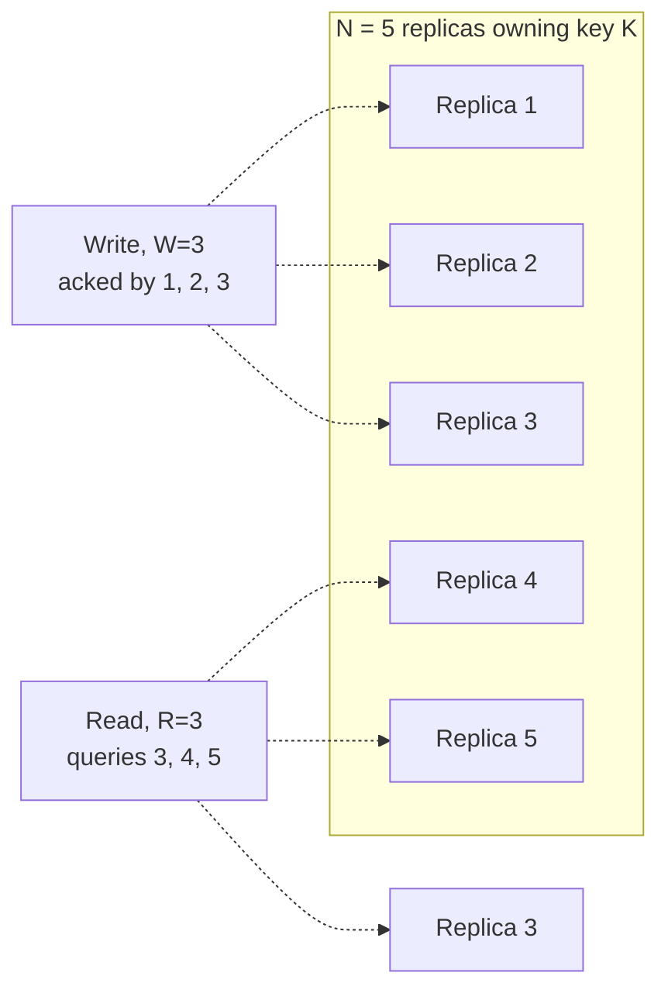

# Quorums (R + W > N)

_[Replication](02-replication.md#leaderless-replication) introduced R, W, and N far enough to make leaderless replication's write and read paths make sense, stated the R+W>N condition, proved the pigeonhole overlap for a single N=3 example, and explicitly deferred "tunable per-operation consistency levels and how quorum reads interact with the session-level guarantees" to here. [Consistent hashing](05-consistent-hashing.md#replication-on-the-ring-finding-a-keys-replica-set) supplied the other missing piece: the N in this topic's formula is exactly the N distinct physical nodes a ring walk finds for a given key. This topic does the work both left outstanding - the general proof, the strict/sloppy distinction in full, exactly how read repair rides along on a quorum read, the full tunable-consistency knob, and the precise, load-bearing reason R+W>N is not linearizability._

## Contents

- [N, R, and W, precisely](#n-r-and-w-precisely)
- [The quorum condition: R + W > N, proved in general](#the-quorum-condition-r--w--n-proved-in-general)
- [Strict quorums vs sloppy quorums](#strict-quorums-vs-sloppy-quorums)
- [Failure scenarios: fewer than R or W replicas reachable](#failure-scenarios-fewer-than-r-or-w-replicas-reachable)
- [Read repair and how it rides along on a quorum read](#read-repair-and-how-it-rides-along-on-a-quorum-read)
- [Tunable consistency: choosing R and W](#tunable-consistency-choosing-r-and-w)
- [Quorum consistency vs strong consistency](#quorum-consistency-vs-strong-consistency)
- [How this connects](#how-this-connects)
- [Real-world & sources](#real-world--sources)
- [Check yourself](#check-yourself)

## N, R, and W, precisely

Three integers parametrize every operation in a leaderless, quorum-based store:

- **N - replication factor.** The number of replicas that own a given key - precisely the set [consistent hashing's ring-walk section produces](05-consistent-hashing.md#replication-on-the-ring-finding-a-keys-replica-set): starting from the key's ring position and walking clockwise, collecting distinct *physical* nodes until N of them have been found. N is a property of the key (via the partitioning scheme), not of any single request.
- **W - write quorum.** The number of those N replicas that must acknowledge a write before the coordinator reports the write as successful to the client. A coordinator (any node, or a dedicated request-routing layer) fans the write out to some or all of the N replicas in parallel and returns success the moment W acknowledgments arrive, without waiting for the remaining N-W.
- **R - read quorum.** The number of those N replicas a coordinator queries in parallel on a read, before it is willing to answer the client. If the R responses disagree, the coordinator resolves them (highest version/timestamp, or by exposing siblings for the application to merge - [exactly the version-vector mechanics replication already covered](02-replication.md#conflict-detection-and-resolution)) and triggers repair on whichever replica(s) it found were behind (below).

Both W and R are chosen **per operation type**, not fixed once for the whole system - a store commonly runs with one W for all writes and a different R for all reads, and some systems (Cassandra, Riak) let an individual *request* override the default and pick its own consistency level.

## The quorum condition: R + W > N, proved in general

**The claim.** If a write's acknowledgment set (of size W) is drawn from a pool of N replicas, and a later read's query set (of size R) is drawn from that same pool of N replicas, then choosing R and W so that **R + W > N** guarantees the two sets share at least one replica in common - the read is *guaranteed* to touch at least one replica that has seen the write.

**The proof, by pigeonhole (not just the N=3 example already worked in replication).** Suppose, for contradiction, the write set W and the read set R were completely disjoint - sharing zero replicas. Two disjoint subsets of an N-element pool can together contain at most N elements, so `|W| + |R| <= N`, i.e. `W + R <= N`. That is the exact logical negation of `R + W > N`. So if `R + W > N` holds, the sets *cannot* be disjoint - they must overlap in at least `R + W - N` replicas. This holds for any N, not only N=3, and the size of the guaranteed overlap (`R + W - N`, not just "at least one") is itself a useful number: it is how many replicas a read is guaranteed to find that are current, which matters directly for read-repair below.

**Worked example, N=5.** Five replicas (1-5) own a key.

With W=3 and R=3 (`R+W=6 > 5`), the guaranteed overlap is `6-5=1` replica - replica 3 in the diagram above, which received the write *and* is queried by the read, so the read is guaranteed to see it (subject to the caveats in the last section of this topic). Compare a choice that violates the condition: W=2, R=2 (`R+W=4 <= 5`) - a write acknowledged by replicas {1,2} and a read that happens to query {4,5} share zero replicas; the read returns stale data with no way to know it did, because no repair mechanism ever touched replicas 4 or 5 with this write at all.

**Every valid symmetric-and-asymmetric split at N=5**, with what each buys and costs in fault tolerance (a replica is "down" = simply unreachable for that operation; the table asks how many replicas can be down before the operation can no longer be completed):

| W | R | R+W | Overlap holds? | Write tolerates this many down | Read tolerates this many down |
| --- | --- | --- | --- | --- | --- |
| 1 | 5 | 6 | Yes | 4 | 0 |
| 2 | 4 | 6 | Yes | 3 | 1 |
| 3 | 3 | 6 | Yes | 2 | 2 |
| 4 | 2 | 6 | Yes | 1 | 3 |
| 5 | 1 | 6 | Yes | 0 | 4 |
| 2 | 2 | 4 | **No** | 3 | 3 |

The last row shows the general shape of the trade-off precisely: dropping below the quorum threshold buys more fault tolerance on *both* operations simultaneously, but at the cost of losing the overlap guarantee entirely - not partially, entirely, since the proof above is a strict inequality. The **W=3, R=3** ("majority quorum," `⌊N/2⌋+1 = 3` for N=5) row is the unique split that gives both operations the *same*, and the *maximum simultaneous*, fault tolerance (`⌊N/2⌋ = 2` down on either side) while still satisfying the condition - which is exactly why "majority" is the default most systems reach for when neither reads nor writes are known in advance to dominate.

## Strict quorums vs sloppy quorums

**Strict quorum.** W acknowledgments (or R responses) must come specifically from the key's true N "home" replicas - the exact set [the ring walk names](05-consistent-hashing.md#replication-on-the-ring-finding-a-keys-replica-set). If fewer than W of those specific nodes are reachable, the write cannot be considered successful by definition, full stop - there is no substitute node that would count. This is the scheme the proof above assumes throughout, and it is what actually makes the R+W>N guarantee hold: the overlap proof only works because both the write set and the read set are drawn from the *same* fixed pool of N nodes.

**Sloppy quorum (with hinted handoff).** [Already introduced in replication](02-replication.md#sloppy-quorums-and-hinted-handoff) as Dynamo's availability-preserving alternative: if fewer than W of the true home nodes are reachable, the coordinator accepts the write on *any* W reachable nodes, home or not, tagging each borrowed acknowledgment with a **hint** recording the write's true destination, and forwarding (handing off) the write once that destination becomes reachable again. Worth stating with full precision here, since it is easy to gloss over: a sloppy write **does not satisfy R+W>N's overlap guarantee during the sloppy period**, because the write literally may not have landed on any of the N nodes a subsequent strict read would query - the pigeonhole proof above requires both sets to be drawn from the identical pool, and a sloppy write breaks that premise on purpose. This is not a bug in sloppy quorums; it is the entire, deliberate trade being made - availability (the write always succeeds if *some* W nodes anywhere are reachable) purchased with a temporary, explicit hole in the consistency guarantee, repaired later by hinted handoff and, for keys that never get read during the gap, by anti-entropy.

## Failure scenarios: fewer than R or W replicas reachable

Four distinct cases, each with a genuinely different outcome:

- **Strict quorum, fewer than W of the N home replicas reachable for a write.** The write cannot be completed - the coordinator times out waiting for acknowledgments that will never arrive and returns a failure to the client. Nothing is silently half-written: either W replicas eventually ack (write succeeds) or they don't (write fails outright, and the client must retry, back off, or surface the failure upward - the coordinator does not report partial success). Concretely, at N=3 W=2: one node down still allows the write (2 of the remaining 2 respond); two nodes down makes the write impossible under strict quorum, regardless of how long the client waits.
- **Strict quorum, fewer than R of the N home replicas reachable for a read.** Symmetric: the read cannot assemble a quorum of responses and fails outright, rather than returning a possibly-stale answer built from fewer than R replicas. Some deployments deliberately configure a **fallback consistency level** (e.g., Cassandra allows a client to request `QUORUM` but the driver can retry at `ONE` on failure, `verify` exact retry-policy semantics) - but that fallback is an explicit, separate choice to accept weaker consistency for availability, not a hidden behavior of the strict scheme itself.
- **Sloppy quorum enabled, fewer than W of the true home replicas reachable.** The write does not fail: the coordinator looks further along the ring/beyond the home set for additional reachable nodes, accepts the write there with a hint attached, and reports success once W total acknowledgments (home + borrowed) are collected. Availability is preserved at the cost of the overlap gap named above, until the hint is delivered.
- **Sloppy quorum enabled, but *even* a sloppy quorum can't be reached** (a severe partition where fewer than W nodes total, anywhere, are reachable from the coordinator) - the write still fails; sloppy quorums raise the bar for what counts as an outage, they don't eliminate the possibility of one. Similarly, if all replicas holding a sloppily-accepted write (and its hint) are lost permanently before handoff completes, that acknowledged write is genuinely gone - a durability gap directly analogous to [async leader-follower replication's durability risk](02-replication.md#failover-detecting-and-handling-leader-failure), now expressed in quorum terms instead of leader-election terms.

## Read repair and how it rides along on a quorum read

[Replication already named read repair and anti-entropy as the two background-convergence mechanisms](02-replication.md#read-repair-and-anti-entropy); here is precisely how the first one is woven into every quorum read rather than being a separate process:

**The mechanics, step by step.** A coordinator sends the read to R replicas (some systems send to more than R and only wait for R responses, to race out stragglers). Each replica returns its current value tagged with a version (timestamp or version vector). The coordinator compares the R responses: if they already agree, it answers the client immediately with no repair needed. If they disagree, it picks the winning value by whatever conflict rule the store uses (highest timestamp for LWW, or exposes concurrent siblings for the application/version-vector case) and pushes that winning value to whichever of the R queried replicas returned a stale one - either **synchronously** (before answering the client, at the cost of extra latency on the read that found the divergence) or **asynchronously** (answer the client immediately with the resolved value, repair the lagging replica in the background).

**Digest reads - keeping this cheap on the common, no-divergence path.** Sending and comparing the *full* value from every one of R replicas on every single read wastes bandwidth on the overwhelmingly common case where all replicas already agree. Cassandra's optimization (`verify` exact default consistency-level interaction) is to fetch the full value from only one of the R replicas and a lightweight **digest** (a hash of the value) from the rest; if all digests match the full value's hash, no divergence exists and the read returns cheaply; only on a digest mismatch does the coordinator fetch full values from all R replicas to determine the winner and trigger repair. This is the same "compare hashes first, only pay the full comparison cost on a genuine difference" idea [anti-entropy's Merkle trees already used at the whole-dataset scale](02-replication.md#read-repair-and-anti-entropy), applied here per-read instead of per-background-sweep.

**What read repair does and does not fix.** A single quorum read repairs only the R replicas it happened to query - any of the remaining N-R replicas holding stale data are untouched by that read and stay stale until either a future read happens to query them, or the separate anti-entropy process (Merkle-tree comparison, running independently of client traffic) reaches them. This is exactly why leaderless stores need *both* mechanisms rather than either alone: read repair converges only what gets read; anti-entropy is the backstop for keys that are rarely or never read again.

## Tunable consistency: choosing R and W

Because R and W are independent per-operation knobs (subject only to whatever the store's default or per-request override allows), the same N-replica cluster can be tuned along a continuous spectrum from "fast reads, fragile writes" to "fast writes, fragile reads" to a balanced middle, without changing anything about how the data itself is stored or partitioned:

| Choice | Read latency/availability | Write latency/availability | Rationale |
| --- | --- | --- | --- |
| R=1, W=N | Fastest possible reads (any single replica always has the latest, since every replica must ack every write); reads fail if even one replica is down | Slowest, most fragile writes - every one of N replicas must be up and must ack | Read-dominated workload where a temporarily-unavailable write path is acceptable (e.g. a rarely-updated configuration/reference table) |
| R=N, W=1 | Slowest, most fragile reads - every replica must be up and must respond | Fastest, most available writes - only one replica needs to be reachable | Write-heavy, read-rare workload, or a workload that explicitly accepts eventual consistency and reconciles via read repair/anti-entropy later |
| R=W=majority (`⌊N/2⌋+1`) | Balanced - tolerates `⌊N/2⌋` replicas down | Balanced - tolerates the same `⌊N/2⌋` replicas down | The default most systems reach for absent a specific reason to lean one way - maximum simultaneous fault tolerance on both paths (derived above) |
| R=1, W=1 | Fastest reads and writes | Fastest reads and writes | No consistency guarantee at all (`R+W=2`, fails the condition unless N<=1) - pure availability/latency optimization, staleness fully possible and undetected until a later repair pass |
| R=N, W=N | Strongest per-operation freshness this scheme can offer | Slowest, most fragile writes | Rare in practice - pays leaderless replication's coordination cost on every single operation while gaining none of a true single-writer system's simplicity |

**Named per-request consistency levels in real systems** - the same R/W knob, exposed as a label rather than a raw integer: Cassandra's `ONE` / `TWO` / `THREE` (fixed small R or W regardless of N), `QUORUM` (majority of all N replicas, across the whole cluster), `LOCAL_QUORUM` (majority within the client's own data center only, avoiding a cross-region round trip on every operation), `EACH_QUORUM` (a majority within *every* data center, the strongest and slowest of the named levels), and `ALL` (R=N or W=N). DynamoDB (the AWS managed service) exposes a coarser, boolean version of the same idea at the read path specifically - `ConsistentRead=false` (eventually consistent, cheaper, roughly R=1-equivalent) versus `ConsistentRead=true` (strongly consistent, routed to be answered from state that reflects all successfully completed writes) - though, [as replication's real-world section already flagged](02-replication.md#real-world--sources) with its own `verify`, DynamoDB's actual internal replication is closer to per-partition leader-based consensus than to a client-tunable R/W scheme, so its two read modes are best read as *this same idea, re-exposed through a simpler two-state API* rather than literal proof that DynamoDB computes an integer R against a fixed N the way Cassandra or Riak do.

## Quorum consistency vs strong consistency

**The precise claim, stated carefully:** R+W>N guarantees a read's query set overlaps with any prior write's acknowledgment set - it guarantees the read *can* see the latest acknowledged write. It does **not** guarantee linearizability (a single, real-time-respecting total order that every client agrees on), for several independent reasons, each worth naming precisely rather than waving at as one vague "it's not linearizable" caveat:

- **The overlap guarantee is about set membership, not about what the coordinator does with disagreement.** Even with a guaranteed-overlapping replica in the read set, the coordinator still has to *pick* which of the R returned values is "the" answer - by timestamp (LWW) or by exposing concurrent siblings (version vectors). Picking wrong is entirely possible: LWW compares wall-clock timestamps, and if two nodes' clocks are skewed (a well-known, unavoidable reality of physical clocks across machines - [the F-level clocks topic](../F/f-computing-fundamentals.md#clocks) already covered why NTP-synchronized clocks still drift and skew), a write that happened causally *later* in real time can carry an *earlier* timestamp than a write that happened before it, and LWW then keeps the wrong one - a genuine, silent correctness violation that R+W>N's overlap guarantee does nothing to prevent, because the overlap only guarantees the *replica* is present, not that the *resolution rule* picks correctly.
- **Concurrent writes have no total order to begin with.** If two writes to the same key are genuinely concurrent (neither is causally derived from the other, in the version-vector sense), there is no fact of the matter about "which one came first" for the system to get right or wrong - R+W>N doesn't manufacture an ordering that doesn't exist; it just guarantees a read will observe *some* value consistent with having seen the write set, possibly along with the honest admission (siblings) that a conflict occurred.
- **In-flight writes create a genuine race, failure-free.** A coordinator only needs W of N acknowledgments to declare a write successful - the remaining N-W replicas can still be mid-flight, not yet applied, at the exact moment the write is declared done. A read issued at that same instant, querying a different subset of R replicas than the ones that already have the value, can return a stale answer even though the write it's racing against has already been acknowledged to another client - a real, observable non-linearizable window, not a rare edge case, present in every quorum write regardless of clock skew or actual concurrency.
- **Sloppy quorums break the overlap premise outright**, as detailed above - during a sloppy period, there may be zero overlap between a write's actual landing set and a subsequent strict read's query set, by construction.

**What actually gets you to linearizability, and why quorums alone don't:** the missing ingredient in all of the above is a single agreed *order* for operations on a given key that every replica and every reader is bound to respect - which is precisely what **consensus** protocols (Raft, Paxos, ZAB - covered as their own dedicated topics in [L5](../L5/04-consensus-paxos-raft-zab.md)) add on top of raw quorum arithmetic. A consensus-replicated system still requires a *majority* of nodes to agree before anything commits - the same arithmetic shape as W being a majority of N here - but it adds three things a bare Dynamo-style quorum store deliberately does not: a single elected leader per shard/key-range serializing all writes into one agreed log order (removing the "genuinely concurrent, no total order" case entirely, by construction), a monotonically increasing term/log-index that lets every node detect and reject stale or conflicting proposals (removing the clock-skew LWW failure mode, since ordering no longer depends on wall-clock timestamps at all), and a commit rule that only considers a write "done" once it is durably present in a majority of replicas' logs *in the same position*, rather than merely "acknowledged by W of them independently" - closing the in-flight-race window above. [L5's own dedicated **Quorums** topic](../L5/03-quorums-distributed-theory.md) formalizes majority-quorum arithmetic as it is used *inside* consensus (for leader election and log commitment) rather than for data reads/writes directly - the same R+W>N-shaped inequality, reused for a structurally different purpose with a structurally stronger guarantee attached, precisely because the surrounding machinery (log order, terms, a single leader) is what upgrades "quorum overlap" into "linearizability," not the quorum arithmetic by itself. Spanner's TrueTime and the broader Hybrid Logical Clocks approach (a later L4 topic, `verify` exact file once written) are the further refinement worth naming forward: they let a majority-quorum, consensus-replicated system also make **external consistency** claims across entirely different keys/shards - a strictly harder guarantee than what any single-key quorum scheme in this topic ever promised.

**The honest summary line to hold onto:** quorum overlap (R+W>N) makes staleness *detectable and correctable* (via read repair and anti-entropy) rather than *impossible* - it is a tool for tuning the availability/consistency/latency trade-off on a per-operation basis, not a substitute for the ordering guarantees consensus protocols are built specifically to provide.

## How this connects

- **Back to replication** - [leaderless replication's write and read paths](02-replication.md#leaderless-replication) are exactly where N, R, W, and R+W>N were first introduced with a single N=3 worked example; [sloppy quorums and hinted handoff](02-replication.md#sloppy-quorums-and-hinted-handoff) and [read repair/anti-entropy](02-replication.md#read-repair-and-anti-entropy) are made fully rigorous here rather than repeated.
- **Back to consistent hashing** - [the ring-walk section](05-consistent-hashing.md#replication-on-the-ring-finding-a-keys-replica-set) is the literal mechanism that produces the N nodes this topic's every formula and table operates over; N is not a free parameter chosen at request time, it is fixed by the ring and the configured replication factor.
- **Forward to L5 (distributed systems theory)** - [CAP/PACELC](../L5/01-cap-and-pacelc.md) formalizes the availability-vs-consistency trade sloppy quorums make informally here; [consistency models](../L5/02-consistency-models.md) places "quorum consistency" precisely inside the strong-to-eventual hierarchy this topic only gestured at; L5's own dedicated **Quorums** topic covers the majority-quorum arithmetic reused *inside* consensus (leader election, log commitment) rather than for direct data reads/writes; **Consensus (Paxos, Raft, ZAB)** is the exact machinery this topic's last section named as what closes the gap between quorum overlap and linearizability; and **Merkle trees / anti-entropy / read-repair / hinted handoff** gets its own dedicated, formal L5 treatment building on the mechanical version already covered in replication and refined here.
- **Forward to change data capture and event sourcing (later in this level)** - both assume an ordered, durable log of changes; understanding precisely why a bare quorum store does *not* hand you a total order for free is the direct motivation for why CDC pipelines and event-sourced systems often sit on top of a single-leader or consensus-replicated log instead of a leaderless quorum store when strict ordering matters.
- **Forward to L12 (scalability and performance patterns)** - hot-key traffic still concentrates on whichever specific replicas happen to be in a hot key's N-node set, regardless of how R and W are tuned; the mitigations for that remain [rebalancing and hotspots'](04-rebalancing-and-hotspots.md) job, not this topic's.

## Real-world & sources

**Discord - quorum consistency turning hot partitions into cluster-wide latency incidents (Cassandra, `QUORUM`).** Discord's original message store ran on Cassandra with reads and writes performed at the `QUORUM` consistency level. Their own account of the 2022 migration off that cluster (177 nodes storing trillions of messages) states directly: "Since we perform reads and writes with quorum consistency level, all queries to the nodes that serve the hot partition suffer latency increases, resulting in broader end-user impact." This is a concrete illustration of a trade-off this topic derives abstractly: `QUORUM` (majority of N, here effectively cluster-wide rather than `LOCAL_QUORUM`) buys the overlap guarantee, but it also means *every* read/write for a key must wait on however many of that key's specific replicas are healthy - so a hot/struggling partition's latency isn't isolated to that partition's traffic alone, it propagates to the coordinator-side latency of every quorum operation touching it. Source: [Discord Engineering, "How Discord Stores Trillions of Messages," May 2022](https://discord.com/blog/how-discord-stores-trillions-of-messages) (fetch-verified 2026-07-16).

**Apache Cassandra - the canonical named consistency-level menu (`ONE`/`QUORUM`/`LOCAL_QUORUM`/`EACH_QUORUM`/`ALL`).** Cassandra's official architecture documentation describes its consistency levels explicitly as "a version of Dynamo's R + W > N consistency mechanism where operators could configure the number of nodes that must participate in reads (R) and writes (W) to be larger than the replication factor (N)," configurable per query, where "the consistency level represents the minimum number of Cassandra nodes that must acknowledge a read or write operation to the coordinator before the operation is considered successful." For multi-datacenter clusters, the docs recommend `LOCAL_QUORUM` specifically to "provide a weaker but still useful guarantee: reads are guaranteed to see the latest write from within the same datacenter," avoiding a cross-DC round trip on every operation, while `EACH_QUORUM` requires a majority in *every* datacenter simultaneously for clusters that need the stronger (and slower) cross-DC guarantee. With the common default replication factor of 3 per datacenter, `LOCAL_QUORUM` resolves to 2 of 3 local replicas - the textbook majority split this topic derives at N=5 generalized down to N=3. Source: [Apache Cassandra Documentation, "Dynamo" architecture page](https://cassandra.apache.org/doc/latest/cassandra/architecture/dynamo.html) (fetch-verified 2026-07-16, living "latest" docs - current as of this Cassandra release line).

**Amazon DynamoDB - tunable consistency collapsed to a two-state read flag (`ConsistentRead`).** AWS's official DynamoDB documentation confirms eventually-consistent reads are the default for all read operations and are "half the cost of strongly consistent reads" in DynamoDB's request-unit pricing; setting the optional `ConsistentRead` parameter to `true` on `GetItem`/`Query`/`Scan` instead "returns a response with the most up-to-date data, reflecting the updates from all prior write operations that were successful" - but only for tables and local secondary indexes, since global secondary indexes and DynamoDB Streams are always eventually consistent regardless of the flag. This is the same R/W-tuning idea this topic covers, exposed as a coarse boolean rather than an integer R against a fixed N - and it carries the same underlying incentive Cassandra's `R=1` row in the trade-off table above names: cheaper, lower-latency reads by default, with an explicit opt-in cost for freshness only where the application actually needs it. Note (carried over from replication's own real-world section, `verify`): DynamoDB's internal replication is architecturally closer to per-partition leader-based replication than to a literal client-tunable Dynamo-paper R/W quorum, so this is best read as the same trade-off re-exposed through a simpler API, not proof DynamoDB computes an integer quorum the way Cassandra does. Source: [AWS Documentation, "DynamoDB read consistency"](https://docs.aws.amazon.com/amazondynamodb/latest/developerguide/HowItWorks.ReadConsistency.html) (fetch-verified 2026-07-16).

**Riak - literal N/R/W as first-class, per-bucket-or-per-request tunables (`verify` currency/adoption).** Riak KV's own documentation exposes `n_val` (N), `r` (R), and `w` (W) as configuration knobs settable at the bucket level or overridden per individual request, plus symbolic shorthands - `all` (=N), `one` (=1), and `quorum` (=`⌊N/2⌋+1`, e.g. 2 of a default N=3, or 3 of N=5) - matching this topic's table almost exactly, including a separate `dw` parameter for durable (fsync'd) write acknowledgment distinct from plain in-memory acknowledgment. This is arguably the most literal, textbook implementation of the R/W scheme covered in this topic. Flagged honestly: Riak/Basho's commercial backing ended in 2017 and the project is now community-maintained, so treat this as a canonical *design* reference rather than evidence of current large-scale production adoption - `verify` if a recent (post-2022) production case study is needed. Source: [Riak KV Documentation, "Replication Properties"](https://docs.riak.com/riak/kv/latest/developing/app-guide/replication-properties/index.html) (fetch-verified via search 2026-07-16, no visible last-updated date on the page itself).

**Fintech / UPI angle actively searched, not found for this specific topic.** No fintech-specific (Stripe or otherwise) or UPI/NPCI engineering write-up describing a literal Dynamo-style tunable R/W or named consistency-level scheme was found; payments systems in this space more commonly reach for single-leader/consensus-replicated stores with strong per-transaction consistency (the subject of L5's consensus and quorum-in-consensus topics) rather than exposing a client-tunable eventual-consistency knob directly on money-moving writes, so the absence is consistent with the domain rather than a research gap - flagged per this repo's standing UPI-priority instruction rather than silently omitted.

## Check yourself

- Prove, in general terms (not by checking a specific example), why `R + W > N` guarantees a write's acknowledgment set and a read's query set must share at least one replica - and state exactly how many replicas of overlap are guaranteed, not just "at least one."
- At N=5, name a valid (W, R) pair other than the majority split (3,3) that still satisfies the quorum condition, and explain precisely what it costs on one operation to buy extra fault tolerance on the other.
- A store is running with a sloppy quorum enabled during a partition. Explain precisely why a strict read immediately afterward, querying only the key's true N home replicas, might still return stale data even though the earlier write reported success - and name the two mechanisms that eventually fix this.
- Walk through why a quorum read that finds three replicas disagreeing doesn't necessarily mean data was lost - what are the two different things the coordinator can do with the disagreement, and what does each one assume about the underlying conflict-resolution scheme?
- Explain, without invoking clock skew, a way a bare R+W>N quorum scheme can return a stale answer to a client even when no node has failed and no partition is happening. What specific extra guarantee would a consensus protocol add that closes this gap?
- Cassandra offers `LOCAL_QUORUM` in addition to `QUORUM`. Explain what problem it solves that a plain cluster-wide majority quorum does not, and what it gives up in exchange.
