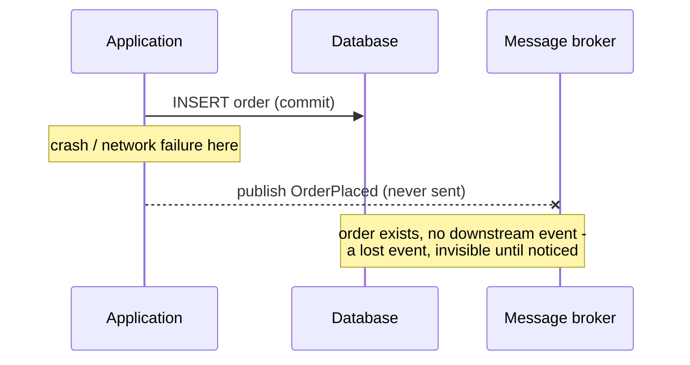
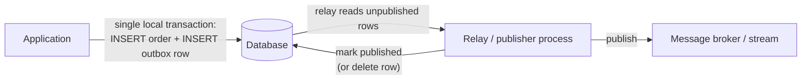
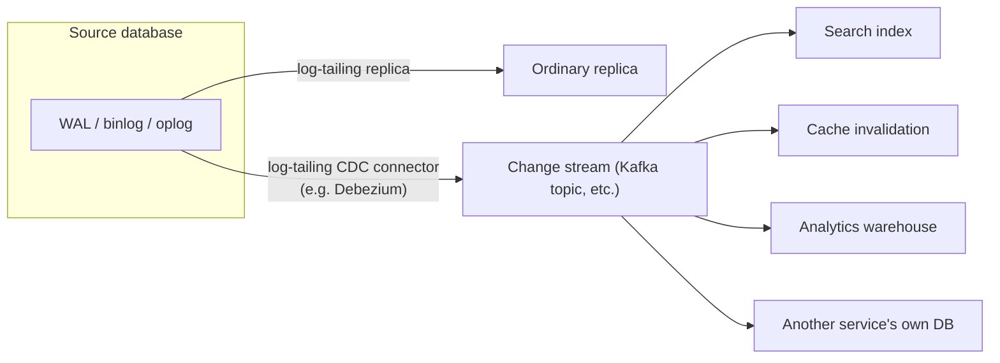

# Change Data Capture (CDC) and the Transactional Outbox Pattern

_Every topic so far in this level has stayed inside one database's own replica set - copying and partitioning the same store's own rows across its own nodes. Real systems need the opposite kind of movement too: getting a row change *out* of one service's database and into someone else's - a search index, a cache, an analytics warehouse, or another service's own database entirely - reliably, and without the sending service and the receiving system ever sharing a transaction. This topic is the discipline for doing that safely: why the naive way (write to the database, then separately publish a message) is unsafe by construction, and the two techniques - the transactional outbox pattern and change data capture - that fix it, frequently by combining them into one pipeline._

## Contents

- [The dual-write problem](#the-dual-write-problem)
- [The transactional outbox pattern](#the-transactional-outbox-pattern)
- [Change data capture (CDC)](#change-data-capture-cdc)
- [Log-based vs query-based (polling) CDC](#log-based-vs-query-based-polling-cdc)
- [Combining CDC and outbox: log-tailing relay vs polling relay](#combining-cdc-and-outbox-log-tailing-relay-vs-polling-relay)
- [At-least-once delivery and idempotent consumers](#at-least-once-delivery-and-idempotent-consumers)
- [Ordering guarantees](#ordering-guarantees)
- [Failure modes](#failure-modes)
- [Trade-offs, side by side](#trade-offs-side-by-side)
- [How this connects](#how-this-connects)
- [Real-world & sources](#real-world--sources)
- [Check yourself](#check-yourself)

## The dual-write problem

**The setup.** A service handles a request - say, "place an order" - and needs to do two things as a result: (1) persist the order to its own database, and (2) tell the rest of the system it happened, by publishing an `OrderPlaced` event to a message broker or stream (Kafka, RabbitMQ, SNS/SQS) so that inventory, billing, notifications, and search-indexing services can each react. The naive implementation writes to each of these two systems as two separate operations:

```text
1. INSERT INTO orders (...) VALUES (...);   -- write #1: the database
2. producer.send("order-events", event);     -- write #2: the message broker
```

**Why this is unsafe.** A relational database transaction and a message broker publish are two entirely separate systems with no shared commit protocol between them by default. There is no atomic operation that does both, so every ordering of the two writes has a partial-failure window:

- **DB commits, then the publish fails** (the broker is down, the network blips, the process crashes between the two lines) - the order exists in the database, but no `OrderPlaced` event was ever sent. Inventory is never decremented, billing never runs, the customer's order silently never progresses - a **lost event**, and the kind of bug that is invisible until a customer complains, because the primary write (the one the client got a success response for) actually succeeded.
- **Publish succeeds, then the DB commit fails or rolls back** (a constraint violation, a deadlock, the transaction is aborted) - downstream services now process an `OrderPlaced` event for an order that, from the source-of-truth database's point of view, never happened. Inventory gets decremented, a confirmation email goes out, for an order the orders table has no record of - a **phantom event**, arguably worse than a lost one because it actively corrupts downstream state rather than merely failing to update it.
- **The process crashes between the two writes entirely** (the pod is killed, the host loses power) - whichever write had already completed stands, and whichever hadn't never happens; from the outside there is no way to tell, after the fact, which of the two states resulted, without an authoritative log of what was attempted.



**Why this can't be patched away by "just retry" or "just be careful with ordering."** The problem is not a bug in either system individually - Postgres commits are atomic, and Kafka's producer can itself be made durable - the problem is that **atomicity does not compose across two independently-committing systems** without an explicit protocol to make it so. A two-phase commit (2PC) spanning the database and the broker is the textbook fix for exactly this shape of problem, but almost no production message broker implements the XA/2PC participant protocol a database expects, and even where available, 2PC introduces a blocking coordinator and materially higher latency on every single write - a cost real systems consistently choose to avoid, in favor of the two patterns below that get an equivalent (or, for the outbox, a genuinely *stronger*) guarantee using only mechanisms a single database already provides for free.

## The transactional outbox pattern

**The core idea: don't try to make two systems commit atomically - make it one system's commit by writing the event into the same database, in the same local transaction, as the business write.** Instead of publishing directly to the broker, the application writes a row describing the event into a dedicated **outbox table** in the very same database, as a normal `INSERT` inside the same transaction as the business write itself:

```sql
BEGIN;
  INSERT INTO orders (id, customer_id, total, status)
    VALUES ('ord_123', 'cust_9', 4200, 'placed');

  INSERT INTO outbox (id, aggregate_type, aggregate_id, event_type, payload, created_at)
    VALUES (gen_random_uuid(), 'order', 'ord_123', 'OrderPlaced',
            '{"order_id":"ord_123","total":4200}', now());
COMMIT;
```

Because both `INSERT`s are inside one transaction, [ACID's atomicity guarantee](../L2/04-acid.md) - already fully mechanized by the same [write-ahead log](../L2/09-write-ahead-log.md) this level keeps returning to - applies to *both rows together*: either the order and the outbox event both become durable, or neither does. There is no window where one exists without the other, because from the storage engine's point of view they are not two separate writes at all - they are two rows inside a single WAL-durable commit.

**A separate relay process then moves rows out of the outbox and onto the broker**, independently of the request path that wrote them:



This shifts the hard problem from "make two heterogeneous systems agree" to "reliably get already-durably-stored rows out of one database and onto a broker eventually" - a strictly easier problem, because the outbox row is never lost even if the relay itself crashes mid-flight: it just resumes from wherever it left off, since the row is still sitting in the table, unpublished, waiting.

**Two ways to build the relay itself**, the choice this topic returns to as its central design decision:

1. **Polling.** The relay periodically (`SELECT * FROM outbox WHERE published = false ORDER BY created_at LIMIT 100`) queries the outbox table, publishes each row it finds, then marks it published (or deletes it) - the two-table pattern (a `processed`/`published` boolean plus a periodic sweep) that debezium's own documentation and multiple production write-ups (`verify` - name a specific canonical implementation for the real-world pass) describe as the simplest possible implementation, needing nothing beyond the database and a small polling worker.
2. **Log tailing (CDC on the outbox table itself)**, covered in full once CDC itself is introduced below - a tool watches the database's own transaction log for inserts specifically into the `outbox` table and forwards each one to the broker as it commits, without the relay ever running a polling `SELECT` against the table at all.

## Change data capture (CDC)

**What it is.** Change data capture is the general technique of extracting a stream of row-level changes (inserts, updates, deletes) from a database as they happen, by reading the database's own internal record of those changes, rather than by querying the current state of tables directly. It answers a broader question than the outbox pattern alone: "how do I get *any* table's changes out of this database as an ordered stream," not just "how do I reliably publish outbox rows."

**Where the stream actually comes from.** CDC does not invent a new source of truth - it taps directly into the exact mechanism [replication](02-replication.md#leader-follower-single-leader-replication) already uses to keep a follower in sync with a leader: the database's write-ahead log, expressed in whichever logical/row-based form that database exposes for downstream consumption -

- **PostgreSQL** - a **logical replication slot**, built on `wal_level = logical`, decoding the physical WAL into a stream of row-level changes (`verify` exact plugin, commonly `pgoutput` or `wal2json`) that a client (Debezium, or a custom consumer) can subscribe to exactly as a replica would subscribe to physical WAL bytes for ordinary replication.
- **MySQL** - the **binlog** in `ROW` format, [the identical row-based replication stream already covered in the replication topic](02-replication.md#leader-follower-single-leader-replication) as the mechanism MySQL followers replicate from - a CDC tool reads the same binlog a real MySQL replica reads, registering itself as if it were just another replica.
- **MongoDB** - the **oplog** (operation log), the capped collection MongoDB replica-set secondaries already tail to stay in sync; MongoDB additionally exposes **change streams** as a purpose-built, oplog-backed API specifically for CDC-style consumption, so a consumer doesn't need to parse the raw oplog format itself.

This is the precise, load-bearing reason CDC is discussed in the same level, right after replication: **CDC is not a new mechanism - it is replication's log-tailing machinery, pointed at a downstream consumer instead of (or in addition to) another database replica.** Anything already true about that log - that it's append-only, ordered, and the same source [crash recovery](../L2/09-write-ahead-log.md#crash-recovery-analysis-redo-undo-aries-at-a-high-level) itself relies on - carries over directly to CDC's guarantees.



## Log-based vs query-based (polling) CDC

Two fundamentally different ways to build a CDC pipeline, and the reason the log-based approach is the one nearly every serious CDC tool (Debezium foremost) is built around:

| | Query-based (polling) CDC | Log-based CDC |
| --- | --- | --- |
| **Mechanism** | Periodically query the table itself for rows that changed - typically `WHERE updated_at > :last_poll_time`, or comparing against a previous snapshot | Tail the database's own transaction log (WAL/binlog/oplog) for committed changes as they happen |
| **Requires application changes** | Yes - every table needs a reliable `updated_at` column (or a monotonic version column), maintained correctly on every write path, including any manual/ad-hoc ones | No - the log already records every change the storage engine makes, regardless of which application code path produced it |
| **Captures deletes** | Not directly - a `DELETE` leaves no row behind to query for a timestamp on, so deletes need a separate soft-delete convention (a `deleted_at` column) to be detectable at all | Yes, natively - a `DELETE` is its own distinct log record type, captured exactly like an insert or update |
| **Captures intermediate changes** | No - if a row is updated three times between two poll intervals, only the final state is ever seen; the two earlier states are invisible | Yes - every individual committed change is its own log record, so all three updates are each captured as their own event, in order |
| **Load on the source database** | An extra query, repeated on every poll interval, against the live table - competing for the same buffer pool and I/O as the application's own read/write traffic, and scaling worse as poll frequency increases or the table grows | Reads the log stream directly - the log is already being written for the engine's own durability/replication needs, so tailing it adds comparatively little marginal load; the source database does not need to serve any extra query at all |
| **Latency** | Bounded below by the poll interval (typically seconds to minutes) | Near-real-time - a change is visible to the CDC stream essentially as soon as it's durably committed and replicated out of the log |
| **Ordering guarantee** | Only as good as the timestamp column's precision and the poll's own consistency - concurrent writes with identical or out-of-order timestamps can be missed or misordered | Exact - the log's own physical order (the same LSN-based ordering [the WAL topic](../L2/09-write-ahead-log.md#log-records-and-log-sequence-numbers-lsns) already established) is preserved end to end |

**Why log-based CDC is preferred in practice, stated plainly:** query-based/polling CDC can genuinely **miss updates** (a row updated and then updated again before the next poll shows only the final value, silently dropping the intermediate state from anything downstream that cared about the sequence, not just the endpoint), **misses deletes** without extra schema convention, and **adds continuous read load to the source database in direct proportion to how fresh the downstream consumers want the data to be** - the more real-time the requirement, the more aggressively the poll has to run, the more load it adds, a bad trade curve. Log-based CDC sidesteps all three at once, because it reads a stream the engine is already producing for its own purposes rather than asking the live table extra questions - which is exactly why **Debezium** (the dominant open-source CDC platform, built on Kafka Connect) is architected entirely around log-tailing connectors for Postgres, MySQL, MongoDB, SQL Server, and Oracle, rather than offering a polling mode as its primary path.

## Combining CDC and outbox: log-tailing relay vs polling relay

The outbox pattern's relay (introduced above) is exactly where CDC and the outbox pattern meet, and the choice between them is this topic's central design decision:

- **Polling relay.** A small worker process periodically queries the outbox table for unpublished rows, publishes each to the broker, and marks it published. Simple to build and reason about - it's ordinary application code, no extra infrastructure - but it inherits query-based CDC's costs precisely: added periodic load on the source database, and latency bounded below by the poll interval. It also needs care around **exactly which rows to mark published and in what order**, since a crash mid-batch can otherwise republish or skip rows if not handled with an explicit, durable cursor.
- **Log-tailing relay (Debezium-style).** A CDC connector tails the database's WAL/binlog specifically for `INSERT`s into the `outbox` table and forwards each one to the broker as soon as it commits, without ever running a `SELECT` against the table. This is the architecture Debezium's own documented **outbox event router** single-message transform is purpose-built for: it reads outbox-table inserts off the log, reshapes each row's `aggregate_id`, `event_type`, and `payload` columns into a properly-keyed, properly-typed Kafka message, and can delete the row immediately in the same transaction (since it's never queried again) rather than needing a `published` flag maintained at all. This gets the outbox pattern's atomicity *and* CDC's near-real-time, low-source-load properties simultaneously - the reason "outbox pattern + Debezium-style log-tailing relay" is the combination most commonly recommended together rather than the outbox pattern being used with a hand-rolled poller.

**The trade each makes, precisely:**

| | Polling relay | Log-tailing (CDC) relay |
| --- | --- | --- |
| **Extra infrastructure** | None beyond the application itself | A CDC connector platform (Debezium + Kafka Connect + Kafka) - genuinely more moving parts to operate |
| **Source DB load** | Extra periodic query load, scaling with poll frequency | Minimal - reads the log the engine already produces |
| **Latency** | Bounded by poll interval (seconds+) | Near-real-time (log-tailing, typically sub-second) |
| **Row cleanup** | Needs an explicit sweep/cursor and, separately, a cleanup job to delete or archive old published rows | Can delete the row in the very same transaction the log-tailing connector observed, since nothing will ever query it again |
| **Operational complexity** | Low - it's just application code | Higher - requires running and monitoring a CDC connector, a Kafka Connect cluster, offset/watermark tracking for the connector itself |

Both achieve the same correctness property - the outbox row and the business write commit atomically, so the event is never lost or phantom - the choice between them is purely an operational-cost-versus-freshness trade, not a correctness trade.

## At-least-once delivery and idempotent consumers

**Neither the polling relay nor the log-tailing relay can offer exactly-once delivery to the broker on its own**, and this is worth stating as an unavoidable consequence, not an implementation defect: a relay (of either kind) publishes a message, and only *after* a successful publish does it mark the row published (or record its own log position/offset as processed). If the relay crashes *after* the broker has durably received the message but *before* the relay durably records that fact, the relay - on restart - has no way to know the publish already succeeded, and will publish that same message again. The alternative order (mark-published-first, publish-second) is strictly worse, since a crash between the two would silently lose the message instead of merely duplicating it - so every correctly-built relay accepts **at-least-once delivery**: every event is delivered one or more times, never zero times, and duplicates are a known, expected possibility rather than a rare bug.

**The necessary consequence: consumers must be idempotent.** Because at-least-once delivery is the best guarantee achievable without a distributed transaction spanning the relay's bookkeeping and the broker's own commit, every consumer of a CDC/outbox event stream must be able to safely process the same event twice (or more) without a different final result than processing it once - typically by keying off the event's own unique ID (the outbox row's UUID, or the log's own LSN/offset) and either using an idempotency key check ("have I already applied event `evt_abc123`? if so, no-op") or by making the operation itself naturally idempotent (an `UPSERT` keyed on the order ID rather than a blind `INSERT`, a "set balance to X" rather than "add X to balance"). This connects directly forward to idempotency and delivery-semantics as their own dedicated, fully rigorous topics later in the track (`verify` exact file, planned as an L5 topic) - this topic's job is only to establish *why* idempotent consumption isn't optional once at-least-once delivery is accepted as the honest ceiling on what a CDC/outbox pipeline can promise.

## Ordering guarantees

A downstream consumer very often needs to see events for the *same entity* in the order they actually happened - an `OrderPlaced` before an `OrderCancelled` for the same order, never the reverse - even though total, global ordering across *every* entity in the system is rarely needed and would be far more expensive to guarantee.

**How ordering is typically preserved: partition (or route) by key.** Both Debezium's outbox event router and hand-rolled relays commonly publish using the entity's own ID - `aggregate_id` (the order ID, the user ID) - as the message's **partition key**. In Kafka, messages with the same key always land in the same partition, and a single partition is itself a strictly ordered, append-only log consumed by exactly one consumer (or one consumer-thread) at a time within a consumer group - so every event for a given order is guaranteed to be delivered to whichever consumer is reading that partition in the exact order it was written, even though events for a *different* order, landing in a different partition, carry no ordering relationship to the first order's events at all. This is precisely the same per-partition ordering guarantee that will get its full formal treatment as its own topic in the messaging/streaming level of this track, applied here specifically to CDC/outbox event streams rather than to arbitrary application-published messages.

**What this does and does not buy.** Per-key ordering is enough for the overwhelmingly common case - a consumer only cares about causal order *within* one entity's own history - but it is explicitly not a total order across the whole stream: two different orders' events can arrive at a consumer interleaved in any relative sequence, and a consumer that genuinely needs cross-entity ordering (rare, and usually a sign the entity boundary itself should be reconsidered) needs a different, stronger mechanism than partition-key ordering provides.

## Failure modes

Three distinct, concrete operational failure modes every CDC/outbox pipeline in production has to be designed against, beyond the at-least-once/idempotency consequence already covered:

- **Relay lag.** If the relay (polling or log-tailing) falls behind - a slow broker, a burst of writes, a struggling connector - downstream consumers see events later than they were actually committed, a staleness window directly analogous to [replication lag's own consequences](02-replication.md#replication-lag-and-its-concrete-consequences), now expressed at the event-stream layer instead of the replica layer. A monitoring signal worth naming explicitly: for log-tailing CDC, lag is measured as the gap between the log's current write position (the latest LSN/binlog position the source database has committed) and the connector's own last-processed position - a metric Debezium and Kafka Connect both expose directly, and one that should be alerted on, since an unbounded, growing lag eventually risks the source database recycling WAL segments the connector hasn't consumed yet (below).
- **Poison messages.** A single malformed or unexpectedly-shaped event (a schema change the connector or a downstream consumer wasn't updated for, a payload that fails deserialization) can stall an entire ordered partition if the consumer crashes or infinitely retries on that one message, blocking every event behind it in the same partition from ever being processed - the direct cost of the strict per-partition ordering just established, since skipping ahead would violate that same ordering. The standard mitigation is a **dead-letter queue (DLQ)**: after a bounded number of retry attempts, the consumer moves the offending message to a separate topic/queue for manual inspection or reprocessing, and advances past it in the main partition rather than blocking indefinitely - a pattern this track covers in full as its own dedicated messaging-level topic, named here because it is the direct answer to what would otherwise be an unrecoverable stall in a CDC/outbox pipeline specifically.
- **Outbox table growth and cleanup.** Every business write that also needs an event now also writes a permanent-feeling row into the outbox table, and if nothing ever removes old, already-published rows, the table grows without bound - bloating the table's own indexes, slowing the very query (or log segment) the relay reads from, and, for a polling relay in particular, making the `WHERE published = false` scan progressively more expensive as the table accumulates dead, already-published rows it still has to skip past. The two standard fixes: a periodic cleanup job that deletes (or archives) rows once they're confirmed published and past some retention window (a poll-based relay's natural fix), or - the log-tailing relay's own answer, already named above - having the CDC connector delete the row in the very same transaction it observes it in the log, since a row it has already forwarded to the broker will never need to be read again by anyone.

## Trade-offs, side by side

| | Dual write (naive) | Transactional outbox (polling relay) | Transactional outbox + CDC (log-tailing relay) |
| --- | --- | --- | --- |
| **Atomicity of write + publish** | None - two independent commits, genuinely unsafe | Yes, via a single local DB transaction | Yes, via a single local DB transaction |
| **Extra infrastructure** | None | A small polling worker | A CDC connector platform (Debezium + Kafka Connect) |
| **Source DB load** | One extra network call, no extra query load | Periodic polling query load | Minimal - log-tailing only |
| **Latency to downstream** | Immediate (when it works) | Bounded by poll interval | Near-real-time |
| **Delivery semantics** | Undefined - can silently lose or duplicate | At-least-once | At-least-once |
| **Requires idempotent consumers** | Should, but the failure modes are worse (lost events) than "just" duplicates | Yes | Yes |
| **Captures every table's changes, not just outbox events** | No | No - only whatever the application explicitly writes to the outbox | Yes, trivially extendable - the same log-tailing connector can also stream ordinary table changes for other purposes (search indexing, cache invalidation, warehouse replication) |

## How this connects

- **Back to L2 (write-ahead log)** - [the WAL](../L2/09-write-ahead-log.md) is the literal artifact CDC tails; the outbox pattern's atomicity guarantee is nothing more than the same single-transaction, single-WAL-commit guarantee [ACID's atomicity](../L2/04-acid.md) already covers, applied to two rows in two different tables instead of one.
- **Back to L4/02 (replication)** - [replication's row-based/logical shipping section](02-replication.md#leader-follower-single-leader-replication) named CDC tools reading a binlog or logical-replication slot as "the exact mechanism"; this topic is that promised full treatment - CDC is replication's log-tailing machinery pointed at a downstream event consumer instead of (or alongside) another database replica.
- **Back to L4/07 (quorums)** - quorums' own forward pointer noted that "understanding precisely why a bare quorum store does *not* hand you a total order for free is the direct motivation for why CDC pipelines... often sit on top of a single-leader or consensus-replicated log instead of a leaderless quorum store when strict ordering matters" - this topic's per-key partition ordering is exactly that total-order-within-a-key guarantee, and it depends on the source being a single ordered log (a leader's WAL/binlog/oplog), not a leaderless quorum store with no single agreed order to tail in the first place.
- **Forward to event sourcing (next in this level)** - an event-sourced system makes the event log the *actual* source of truth rather than a derived side effect of a row-oriented write, which is the natural conceptual endpoint of everything this topic built toward: once every state change is already captured as an ordered, durable event, CDC/outbox machinery becomes optional rather than necessary, because the "outbox" and the primary store converge into the same thing.
- **Forward to CQRS** - CDC streams (of exactly the kind built here) are the standard mechanism for keeping a CQRS system's read-optimized query models in sync with its write-optimized command model, asynchronously and without the write path ever needing to know which read models exist downstream.
- **Forward to L5 (idempotency, delivery semantics, distributed transactions)** - this topic established *why* at-least-once delivery is the honest ceiling and idempotent consumption is the necessary consequence; L5's own dedicated idempotency and delivery-semantics topics (`verify` exact filenames once written) formalize both, and L5's 2PC/saga topic covers the heavier, genuinely-atomic-across-systems alternative this topic's dual-write section named as theoretically possible but rarely chosen in practice.
- **Forward to L6 (messaging and streaming)** - Kafka's partition-based ordering and consumer-group model, invoked here only as far as CDC/outbox event ordering needs it, gets its own full mechanical treatment there; dead-letter queues, named here as the answer to poison messages, get their own dedicated topic in the same level.

## Real-world & sources

Three verified, varied production perspectives on log-based CDC and outbox-style reliable event delivery - one e-commerce, one infra-origin/canonical, and one fintech (consumer-facing side of the same at-least-once discipline):

- **Shopify - migrating a sharded MySQL monolith from polling CDC to Debezium + Kafka Connect (e-commerce).** Shopify's data platform originally ran a query-based CDC tool ("Longboat") that polled `updated_at` columns on read replicas, limited to roughly hourly freshness and, exactly as this topic predicts for polling CDC, unable to reliably capture hard deletes or intermediate row states. They replaced it with one Debezium connector per MySQL shard (100+ shards) reading MySQL binlogs directly, feeding Kafka Connect, with a custom Kafka Streams job consolidating per-shard topics into logical per-table topics - cutting change-to-Kafka latency to **p99 < 10 seconds**. Shopify also hit and fixed a concrete operational failure mode this topic names: Debezium's default MySQL snapshot mode held table-level read locks for hours on their largest tables, blocking production writes; a Shopify engineer built a lock-free snapshot mode and contributed it upstream into Debezium itself. Source: [Capturing Every Change From Shopify's Sharded Monolith](https://shopify.engineering/capturing-every-change-shopify-sharded-monolith), Shopify Engineering, published March 12, 2021 (fetch-verified).

- **Debezium's own origin, and LinkedIn's independent, parallel log-based CDC system (infra-origin + canonical tooling).** Debezium - the log-tailing CDC platform this topic names throughout as the dominant tool for Postgres/MySQL/MongoDB/SQL Server/Oracle - was created at **Red Hat** by engineer Randall Hauch (project started 2015-2016), built on Kafka Connect and directly inspired by Martin Kleppmann's "turning the database inside out" work; it is not a LinkedIn project (`verify` further if citing elsewhere - some secondary write-ups conflate the two, but Debezium's own history page and Red Hat's documentation are unambiguous on Red Hat/Hauch as the origin). Separately, and predating wide Debezium adoption, **LinkedIn** built its own log-based CDC pipeline for Oracle: version 1.0 used interval-based polling SQL against read replicas (the same query-based approach this topic critiques) and hit reliability/SLA limits; version 2.0 replaced it with **Oracle GoldenGate**, which reads Oracle's redo logs directly (the Oracle analogue of a binlog/WAL) instead of polling, streaming changes through Kafka and LinkedIn's own **Brooklin** framework (open-sourced in 2019) to HDFS and other downstream consumers with minimal production-database impact. Sources: [Incremental Data Capture for Oracle Databases at LinkedIn: Then and Now](https://www.linkedin.com/blog/engineering/data-management/incremental-data-capture-for-oracle-databases-at-linkedin-then-), LinkedIn Engineering, published November 22, 2017 (fetch-verified); [Open sourcing Brooklin: Near real-time data streaming at scale](https://engineering.linkedin.com/blog/2019/brooklin-open-source), LinkedIn Engineering, 2019.

- **Stripe - at-least-once event/webhook delivery and idempotent consumption (fintech).** Stripe's public webhooks documentation states plainly that event delivery is not exactly-once: events "might occasionally" arrive more than once, delivery is retried with exponential backoff for up to three days in live mode, and events are not guaranteed to arrive in order - the exact at-least-once-delivery-plus-idempotent-consumer discipline this topic derives from first principles for any outbox/CDC relay. Stripe's own recommended fix mirrors this topic's idempotent-consumer guidance precisely: log each processed `event.id` and no-op on a repeat, and where two distinct `Event` objects can describe the same underlying change, de-duplicate using the `data.object` ID plus `event.type` together. Stripe's public documentation does not describe the internal mechanism (outbox table, CDC, or otherwise) used to generate these events reliably from its own databases, so the internal architecture claim is explicitly `verify` - only the external delivery contract (at-least-once, retried, out-of-order-possible) is fetch-verified. Source: [Receive Stripe events in your webhook endpoint](https://docs.stripe.com/webhooks), Stripe Docs (fetch-verified, accessed 2026-07-16).

## Check yourself

- Walk through, step by step, exactly what state the system ends up in if an application commits a database write and then crashes before publishing the corresponding event to a message broker - and explain precisely why "just retry the publish" doesn't fully solve this without the outbox pattern.
- Why does writing the event to an outbox table in the same local transaction as the business write actually solve the dual-write problem, when publishing directly to a broker in a second, separate step does not? What specific guarantee is being reused, and where does it actually come from?
- Explain, without hand-waving, why log-based CDC is preferred over query-based/polling CDC for capturing deletes and intermediate updates specifically - what does each miss, and why?
- A team wires Debezium's outbox event router directly onto their `outbox` table instead of running a polling relay. What do they gain, and what extra operational cost do they take on in exchange?
- Why must every consumer of a CDC/outbox event stream be idempotent, given that the relay itself cannot offer exactly-once delivery? Give a concrete example of a non-idempotent event handler and show how to make it idempotent.
- A CDC pipeline partitions events by `order_id`. Explain precisely what ordering guarantee this does and does not provide, and describe a scenario where a consumer might wrongly assume a stronger guarantee than it's actually getting.
- An outbox table has grown to tens of millions of rows and the polling relay's query is slowing down. Name the two standard fixes this topic covers, and explain why one of them isn't available at all if the relay is a log-tailing CDC connector instead of a poller.
